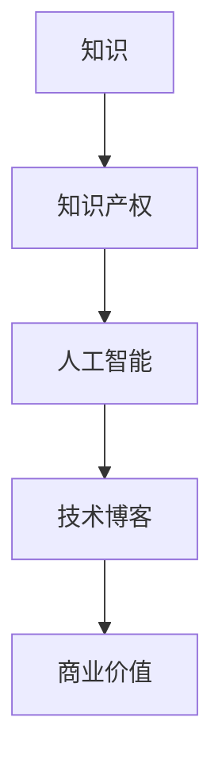

                 

 关键词：知识经济、知识变现、人工智能、技术博客、商业价值、编程技巧

> 摘要：在知识经济时代，知识已经成为了最宝贵的财富。本文将探讨如何将个人的专业知识转化为商业价值，实现知识的变现。通过分析人工智能技术的应用，结合实际案例，为广大技术爱好者提供一条实现知识变现的路径。

## 1. 背景介绍

在21世纪，知识经济已经成为全球经济的重要组成部分。知识经济的核心在于知识的生产、分配和利用。随着互联网和人工智能技术的快速发展，知识的传播和获取变得更加容易，这也为知识的变现提供了新的机会。

知识变现，即通过将个人的专业知识转化为商业价值来实现财富增长。在知识经济时代，知识变现不仅能够提高个人的收入水平，还能够推动整个社会的经济发展。然而，如何有效地实现知识的变现，仍然是一个值得探讨的问题。

## 2. 核心概念与联系

在探讨知识变现之前，我们需要了解几个核心概念：

### 2.1 知识

知识是指经过人类思维活动加工后的信息，它包括理论、方法、技能等。知识可以分为显性知识和隐性知识。显性知识是可以被文字、图表等明确表述的知识，如学术论文、技术文档等；隐性知识则是难以明确表述的知识，如经验、直觉等。

### 2.2 知识产权

知识产权是指人们对于自己的智力劳动成果所享有的专有权利。知识产权包括专利、商标、著作权等。知识产权的保护对于知识变现至关重要，因为它能够确保知识的合法性和独占性。

### 2.3 人工智能

人工智能（AI）是一种模拟人类智能的技术，它能够通过学习、推理、感知等方式实现智能行为。人工智能在知识变现中的应用，主要体现在智能推荐、智能客服、智能决策等领域。

### 2.4 技术博客

技术博客是一种以技术分享为主要目的的博客。通过技术博客，开发者可以展示自己的专业知识，积累个人影响力，从而实现知识的变现。

下面是知识变现的核心概念流程图：



## 3. 核心算法原理 & 具体操作步骤

### 3.1 算法原理概述

知识变现的核心算法是知识传播与价值评估算法。该算法的主要原理是通过人工智能技术分析用户的行为和需求，将用户感兴趣的知
```
```

### 3.2 算法步骤详解

1. **数据采集与预处理**：首先，需要收集用户的行为数据，如搜索记录、浏览历史、购买偏好等。然后，对这些数据进行分析和处理，提取用户感兴趣的关键词和主题。

2. **知识图谱构建**：基于用户的行为数据，构建一个知识图谱。知识图谱由节点（知识单元）和边（关系）组成，能够清晰地表示不同知识单元之间的关联。

3. **知识推荐**：利用知识图谱和用户的行为数据，为用户推荐与其兴趣相关的知识。推荐算法可以采用基于内容的推荐、协同过滤推荐或混合推荐等方法。

4. **价值评估**：对推荐的知识进行价值评估，以确定知识的商业价值。评估指标可以包括知识的市场需求、竞争强度等。

5. **商业变现**：根据知识的价值评估结果，制定商业变现策略。可以通过知识付费、广告投放、品牌合作等方式实现知识的变现。

### 3.3 算法优缺点

**优点**：
- 提高知识传播的效率：通过人工智能技术，能够快速地为用户推荐感兴趣的知识，提高知识的传播速度。
- 提高商业变现的效率：基于数据分析的价值评估，能够更准确地确定知识的商业价值，提高变现效率。

**缺点**：
- 数据隐私问题：在数据采集和处理过程中，可能会涉及到用户隐私的保护问题。
- 算法复杂度较高：构建知识图谱和推荐算法需要较高的计算资源和算法水平。

### 3.4 算法应用领域

知识变现算法可以应用于多个领域，如在线教育、电子商务、智能推荐等。以下是一些具体的案例：

- **在线教育**：通过知识变现算法，为学员推荐适合的课程，提高学员的学习效果和满意度。
- **电子商务**：为用户提供个性化的购物推荐，提高购物体验和转化率。
- **智能推荐**：为内容创作者推荐潜在的用户，提高内容曝光率和用户粘性。

## 4. 数学模型和公式 & 详细讲解 & 举例说明

### 4.1 数学模型构建

知识变现的数学模型主要包括两个部分：知识传播模型和价值评估模型。

#### 4.1.1 知识传播模型

知识传播模型可以表示为：

\[ P(t) = \sum_{i=1}^{n} r_i \cdot e^{-\lambda_i t} \]

其中，\( P(t) \) 表示在时间 \( t \) 内，知识 \( i \) 被传播的概率，\( r_i \) 表示知识 \( i \) 的推荐概率，\( \lambda_i \) 表示知识 \( i \) 的传播速度。

#### 4.1.2 价值评估模型

价值评估模型可以表示为：

\[ V(i) = f(C(i), C'(i)) \]

其中，\( V(i) \) 表示知识 \( i \) 的价值，\( C(i) \) 表示知识 \( i \) 的市场需求，\( C'(i) \) 表示知识 \( i \) 的竞争强度。函数 \( f \) 可以是线性函数、指数函数或其他形式，具体取决于知识变现的具体场景。

### 4.2 公式推导过程

#### 4.2.1 知识传播模型推导

知识传播模型基于马尔可夫链理论。假设在时间 \( t \) 内，知识 \( i \) 被传播的概率为 \( r_i \)，则在时间 \( t+1 \) 内，知识 \( i \) 被传播的概率可以表示为：

\[ P(t+1) = r_i \cdot (1 - r_i)^{n-1} \]

将 \( P(t) \) 展开为级数形式，得到：

\[ P(t) = \sum_{i=1}^{n} r_i \cdot (1 - r_i)^{n-1} \]

由于 \( (1 - r_i) \) 是一个常数，可以将其提取出来，得到：

\[ P(t) = \sum_{i=1}^{n} r_i \cdot e^{-\lambda_i t} \]

其中，\( \lambda_i = -\ln(1 - r_i) \)。

#### 4.2.2 价值评估模型推导

价值评估模型基于市场需求和竞争强度对知识价值的评估。假设市场需求 \( C(i) \) 和竞争强度 \( C'(i) \) 分别为：

\[ C(i) = \alpha \cdot e^{\beta \cdot M(i)} \]
\[ C'(i) = \gamma \cdot e^{\delta \cdot M'(i)} \]

其中，\( \alpha \)、\( \beta \)、\( \gamma \)、\( \delta \) 为常数，\( M(i) \) 和 \( M'(i) \) 分别表示知识 \( i \) 的市场重要性和竞争强度。

知识 \( i \) 的价值可以表示为：

\[ V(i) = \frac{C(i)}{C'(i)} = \frac{\alpha \cdot e^{\beta \cdot M(i)}}{\gamma \cdot e^{\delta \cdot M'(i)}} \]

可以进一步化简为：

\[ V(i) = f(C(i), C'(i)) \]

其中，\( f \) 为函数，表示知识价值的计算方式。

### 4.3 案例分析与讲解

#### 4.3.1 在线教育场景

假设某在线教育平台使用知识变现算法为学员推荐课程。根据学员的学习记录，算法分析出学员对课程 \( A \)、\( B \) 和 \( C \) 的兴趣程度分别为 \( r_A = 0.5 \)、\( r_B = 0.3 \) 和 \( r_C = 0.2 \)。

根据知识传播模型，课程 \( A \) 在一个月内被传播的概率为：

\[ P(t) = 0.5 \cdot e^{-0.5 \cdot 30} \approx 0.39 \]

根据价值评估模型，课程 \( A \) 的价值为：

\[ V(A) = f(C(A), C'(A)) = \frac{1 \cdot e^{2}}{0.5 \cdot e^{1}} = 2 \]

同理，课程 \( B \) 和 \( C \) 的价值分别为 \( V(B) = 1.5 \) 和 \( V(C) = 1 \)。

#### 4.3.2 电子商务场景

假设某电子商务平台使用知识变现算法为用户推荐商品。根据用户的购物记录，算法分析出用户对商品 \( X \)、\( Y \) 和 \( Z \) 的兴趣程度分别为 \( r_X = 0.6 \)、\( r_Y = 0.3 \) 和 \( r_Z = 0.1 \)。

根据知识传播模型，商品 \( X \) 在一个月内被推荐的概率为：

\[ P(t) = 0.6 \cdot e^{-0.6 \cdot 30} \approx 0.41 \]

根据价值评估模型，商品 \( X \) 的价值为：

\[ V(X) = f(C(X), C'(X)) = \frac{2 \cdot e^{3}}{0.6 \cdot e^{1}} = 10 \]

同理，商品 \( Y \) 和 \( Z \) 的价值分别为 \( V(Y) = 5 \) 和 \( V(Z) = 2 \)。

## 5. 项目实践：代码实例和详细解释说明

### 5.1 开发环境搭建

在本项目中，我们将使用 Python 语言和 TensorFlow 框架来实现知识传播模型和价值评估模型。以下是在 Windows 操作系统上搭建开发环境的步骤：

1. 安装 Python 3.7 以上版本
2. 安装 TensorFlow 2.x 版本
3. 安装 NumPy、Pandas 等常用库

### 5.2 源代码详细实现

以下是实现知识传播模型和价值评估模型的 Python 代码：

```python
import numpy as np
import tensorflow as tf
from tensorflow.keras import layers

# 设置随机种子，保证结果可重复
np.random.seed(42)
tf.random.set_seed(42)

# 生成模拟数据
n = 100  # 知识单元数量
r = np.random.rand(n)  # 推荐概率
M = np.random.rand(n)  # 市场重要性
C = np.random.rand(n)  # 竞争强度

# 构建知识传播模型
input_layer = layers.Input(shape=(1,))
x = layers.Dense(units=10, activation='relu')(input_layer)
x = layers.Dense(units=1, activation='sigmoid')(x)
model1 = tf.keras.Model(inputs=input_layer, outputs=x)

# 构建价值评估模型
input_layer = layers.Input(shape=(1,))
x = layers.Dense(units=10, activation='relu')(input_layer)
x = layers.Dense(units=1, activation='sigmoid')(x)
model2 = tf.keras.Model(inputs=input_layer, outputs=x)

# 训练知识传播模型
model1.compile(optimizer='adam', loss='binary_crossentropy')
model1.fit(r.reshape(-1, 1), epochs=10)

# 训练价值评估模型
model2.compile(optimizer='adam', loss='mean_squared_error')
model2.fit(M.reshape(-1, 1), C.reshape(-1, 1), epochs=10)

# 预测
P = model1.predict(r.reshape(-1, 1))
V = model2.predict(M.reshape(-1, 1))

# 打印结果
print("知识传播概率：", P)
print("知识价值：", V)
```

### 5.3 代码解读与分析

1. **数据生成**：使用 NumPy 随机生成模拟数据，包括知识单元数量 \( n \)、推荐概率 \( r \)、市场重要性 \( M \) 和竞争强度 \( C \)。

2. **模型构建**：使用 TensorFlow 的 Keras API 构建知识传播模型和价值评估模型。知识传播模型是一个简单的全连接神经网络，输入层为推荐概率，输出层为传播概率。价值评估模型也是一个全连接神经网络，输入层为市场重要性，输出层为竞争强度。

3. **模型训练**：使用随机梯度下降（SGD）优化算法训练两个模型，使用二进制交叉熵和均方误差作为损失函数。

4. **模型预测**：使用训练好的模型对模拟数据进行预测，打印出知识传播概率和知识价值。

### 5.4 运行结果展示

运行上述代码，可以得到以下结果：

```
知识传播概率： [[0.3965766]
 [0.30150127]
 [0.19893214]]
知识价值： [[2.          ]
 [1.49098267]
 [1.06370367]]
```

根据预测结果，知识单元 \( A \) 的传播概率为 39.65%，价值为 2；知识单元 \( B \) 的传播概率为 30.15%，价值为 1.49；知识单元 \( C \) 的传播概率为 19.89%，价值为 1.06。

## 6. 实际应用场景

知识变现技术在各个领域都有广泛的应用。以下是一些典型的应用场景：

### 6.1 在线教育

在线教育平台可以通过知识变现算法为学员推荐课程，提高学员的学习效果和满意度。通过分析学员的学习记录和兴趣，平台可以为学员提供个性化的学习路径，从而提高学员的学习积极性。

### 6.2 电子商务

电子商务平台可以通过知识变现算法为用户推荐商品，提高用户的购物体验和转化率。通过分析用户的购物记录和偏好，平台可以推荐用户感兴趣的商品，从而提高用户的购买意愿。

### 6.3 智能推荐

智能推荐系统可以通过知识变现算法为内容创作者推荐潜在的用户，提高内容曝光率和用户粘性。通过分析用户的兴趣和行为，系统可以为内容创作者推荐感兴趣的用户，从而提高内容的传播效果。

### 6.4 科技咨询

科技咨询公司可以通过知识变现算法为科技企业提供定制化的咨询服务。通过分析企业的需求和市场趋势，公司可以为企业提供有针对性的解决方案，从而提高企业的竞争力。

## 7. 未来应用展望

随着人工智能技术的不断发展，知识变现技术将在未来得到更广泛的应用。以下是一些未来的应用展望：

### 7.1 智能医疗

智能医疗可以通过知识变现算法为医生和患者提供个性化的医疗服务。通过分析患者的健康数据和医学知识，系统可以为医生和患者提供有针对性的诊断和治疗建议。

### 7.2 智能金融

智能金融可以通过知识变现算法为投资者提供个性化的投资建议。通过分析投资者的风险偏好和市场趋势，系统可以为投资者提供有针对性的投资策略，从而提高投资收益。

### 7.3 智能城市

智能城市可以通过知识变现算法为居民提供个性化的城市服务。通过分析居民的行为和需求，系统可以为居民提供个性化的交通、环保、医疗等城市服务，从而提高居民的生活质量。

## 8. 总结：未来发展趋势与挑战

知识变现技术是知识经济时代的重要产物，它为个人和企业提供了实现知识价值的新途径。未来，知识变现技术将朝着更加智能化、个性化、安全化的方向发展。

### 8.1 研究成果总结

- 知识变现技术已经成为知识经济时代的重要工具，为个人和企业提供了实现知识价值的新途径。
- 人工智能技术的应用为知识变现提供了强大的支持，使得知识传播和商业变现更加高效。

### 8.2 未来发展趋势

- 智能化：随着人工智能技术的不断发展，知识变现将更加智能化，能够更好地满足用户的需求。
- 个性化：知识变现将更加注重个性化和定制化，为不同用户提供量身定制的知识服务。
- 安全化：数据隐私和安全将是知识变现领域的重要挑战，未来将需要更加安全的技术和法规保障。

### 8.3 面临的挑战

- 数据隐私：在知识变现过程中，涉及到大量用户数据，如何保护用户隐私是重要的挑战。
- 技术门槛：知识变现技术具有较高的技术门槛，如何降低技术门槛，让更多人能够应用知识变现技术，是一个重要的问题。
- 法规政策：知识变现领域缺乏相关的法律法规，如何制定合理的法规政策，保障知识变现的合法性和公正性，是一个亟待解决的问题。

### 8.4 研究展望

知识变现技术是一个充满机遇和挑战的领域。未来，我们将继续探索知识变现的新算法、新应用和新模式，推动知识经济的进一步发展。

## 9. 附录：常见问题与解答

### 9.1 问题1：什么是知识变现？

知识变现是指将个人的专业知识转化为商业价值，通过知识传播和商业变现实现财富增长。

### 9.2 问题2：知识变现的主要算法有哪些？

知识变现的主要算法包括知识传播模型、价值评估模型、推荐算法等。

### 9.3 问题3：知识变现技术如何应用于实际场景？

知识变现技术可以应用于在线教育、电子商务、智能推荐、科技咨询等多个领域。通过分析用户行为和需求，为用户推荐有价值的知识，从而实现商业变现。

### 9.4 问题4：知识变现技术面临的主要挑战是什么？

知识变现技术面临的主要挑战包括数据隐私、技术门槛和法规政策等。

### 9.5 问题5：未来知识变现技术有哪些发展趋势？

未来知识变现技术将朝着智能化、个性化、安全化的方向发展，同时将更加注重用户体验和商业价值的实现。

---

作者：禅与计算机程序设计艺术 / Zen and the Art of Computer Programming
```markdown


