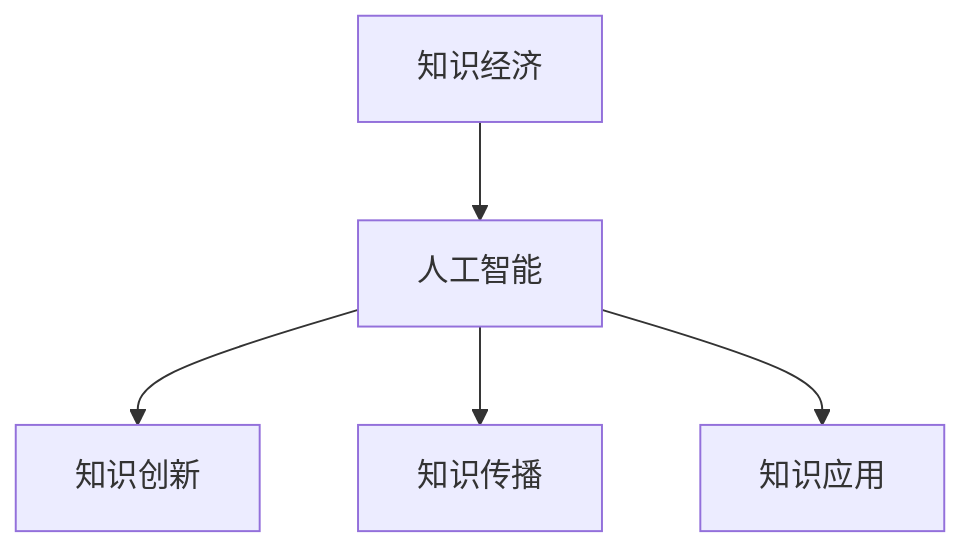

                 

关键词：知识经济、人工智能、催化作用、产业变革、技术创新、经济发展

> 摘要：随着知识经济的崛起，人工智能（AI）正逐渐成为推动全球经济和社会进步的重要力量。本文旨在探讨人工智能在知识经济中的催化作用，分析其在各个领域的应用及未来发展趋势。

## 1. 背景介绍

### 1.1 知识经济的定义与发展

知识经济是以知识为主要生产要素的经济形态，其核心特征是知识的创新、传播和应用。与传统经济相比，知识经济更依赖于知识、技术和信息。20世纪80年代以来，随着信息技术和互联网的快速发展，全球知识经济逐渐崛起，成为引领世界经济新趋势的重要力量。

### 1.2 人工智能的定义与分类

人工智能（Artificial Intelligence，AI）是指由人制造出的系统所表现出的智能。根据实现方式的不同，人工智能可分为弱AI、强AI和泛AI。弱AI主要在特定领域内表现出智能，如语音识别、图像处理等；强AI具有全面的人类智能，能够理解、学习、推理和创造；泛AI则具有超越人类智能的能力。

## 2. 核心概念与联系

### 2.1 人工智能与知识经济的相互关系

人工智能与知识经济密不可分，二者相互促进、相互依赖。人工智能为知识经济提供了强大的技术支撑，使知识的获取、处理、传播和应用更加高效；知识经济的快速发展则为人工智能提供了丰富的应用场景，推动了人工智能技术的不断创新。

### 2.2 人工智能在知识经济中的关键作用

1. **加速知识创新**：人工智能通过深度学习、自然语言处理等技术，能够快速分析海量数据，挖掘潜在知识，为创新提供有力支持。

2. **提高知识传播效率**：人工智能可以帮助构建智能化的知识传播平台，实现知识的高效传递和共享。

3. **优化知识应用**：人工智能可以协助企业和个人在知识应用过程中提高效率，降低成本。

### 2.3 人工智能与知识经济的关系图示



## 3. 核心算法原理 & 具体操作步骤

### 3.1 算法原理概述

人工智能的核心算法包括机器学习、深度学习、自然语言处理等。这些算法通过模拟人脑的学习和思维过程，实现数据的分析和处理。在本节中，我们将主要介绍机器学习算法的基本原理和应用。

### 3.2 算法步骤详解

1. **数据收集**：收集与问题相关的数据，如文本、图像、声音等。

2. **数据预处理**：对收集到的数据进行分析和清洗，去除噪声和异常值。

3. **特征提取**：将预处理后的数据转化为特征向量，以便进行建模。

4. **模型选择**：根据问题类型选择合适的机器学习模型，如线性回归、决策树、神经网络等。

5. **模型训练**：使用训练数据对模型进行训练，使其能够对未知数据进行预测。

6. **模型评估**：使用测试数据对模型进行评估，检查模型的准确性和可靠性。

7. **模型优化**：根据评估结果对模型进行调整和优化，以提高其性能。

### 3.3 算法优缺点

**优点**：
1. **高效性**：能够快速处理海量数据，提高知识挖掘和传播的效率。
2. **灵活性**：可以适应不同的应用场景，具有较强的通用性。

**缺点**：
1. **数据依赖性**：模型的训练和预测依赖于大量高质量的数据。
2. **计算复杂性**：部分算法的计算复杂度较高，需要较大的计算资源。

### 3.4 算法应用领域

人工智能在知识经济中的应用领域广泛，包括但不限于：
1. **金融**：风险控制、信用评估、投资组合优化等。
2. **医疗**：疾病诊断、个性化治疗、药物研发等。
3. **教育**：智能辅导、在线教育、教育资源分配等。
4. **城市管理**：交通管理、公共安全、环境监测等。

## 4. 数学模型和公式 & 详细讲解 & 举例说明

### 4.1 数学模型构建

人工智能的数学模型主要包括线性模型、非线性模型和概率模型等。以下以线性模型为例进行介绍。

#### 4.1.1 线性模型

线性模型是一种最简单的数学模型，用于描述两个或多个变量之间的线性关系。其基本公式为：

\[ y = \beta_0 + \beta_1x_1 + \beta_2x_2 + \ldots + \beta_nx_n \]

其中，\( y \) 为因变量，\( x_1, x_2, \ldots, x_n \) 为自变量，\( \beta_0, \beta_1, \beta_2, \ldots, \beta_n \) 为模型参数。

#### 4.1.2 非线性模型

非线性模型用于描述变量之间的非线性关系。常见的非线性模型有逻辑回归、决策树、神经网络等。

#### 4.1.3 概率模型

概率模型用于描述变量之间的概率分布。常见的概率模型有贝叶斯网络、马尔可夫模型等。

### 4.2 公式推导过程

以线性回归模型为例，介绍公式推导过程。

#### 4.2.1 线性回归模型的假设

1. 线性关系：因变量 \( y \) 与自变量 \( x \) 之间存在线性关系。
2. 独立同分布：各观测值相互独立，服从正态分布。
3. 无线性关系：自变量 \( x \) 与误差项 \( \epsilon \) 之间不存在线性关系。

#### 4.2.2 模型推导

1. **最小二乘法**：通过最小化残差平方和来确定模型参数。

   残差平方和：

   \[ S = \sum_{i=1}^n (y_i - \hat{y}_i)^2 \]

   其中，\( y_i \) 为第 \( i \) 个观测值，\( \hat{y}_i \) 为预测值。

2. **求导与极值**：对模型参数 \( \beta \) 求导，并令导数为零，求得最优参数。

   求导结果：

   \[ \frac{\partial S}{\partial \beta} = 0 \]

3. **解方程**：将求导结果代入方程，解得模型参数。

   解得：

   \[ \beta = (X^T X)^{-1} X^T y \]

   其中，\( X \) 为自变量矩阵，\( y \) 为因变量向量。

### 4.3 案例分析与讲解

以房价预测为例，介绍线性回归模型的应用。

#### 4.3.1 数据收集

收集房价数据，包括房屋面积、楼层、建筑年代等。

#### 4.3.2 数据预处理

对数据进行分析和清洗，去除异常值和缺失值。

#### 4.3.3 特征提取

将预处理后的数据转化为特征向量，如房屋面积、楼层等。

#### 4.3.4 模型训练

使用线性回归模型对数据集进行训练。

#### 4.3.5 模型评估

使用测试数据集对模型进行评估，计算模型准确率、均方误差等指标。

#### 4.3.6 模型优化

根据评估结果对模型进行调整和优化。

## 5. 项目实践：代码实例和详细解释说明

### 5.1 开发环境搭建

搭建 Python 开发环境，安装必要的库，如 NumPy、Pandas、Scikit-learn 等。

### 5.2 源代码详细实现

```python
import numpy as np
import pandas as pd
from sklearn.linear_model import LinearRegression
from sklearn.model_selection import train_test_split
from sklearn.metrics import mean_squared_error

# 数据收集
data = pd.read_csv('house_price.csv')

# 数据预处理
data = data.dropna()
data = data[data['area'] > 0]

# 特征提取
X = data[['area', 'floor', 'age']]
y = data['price']

# 模型训练
X_train, X_test, y_train, y_test = train_test_split(X, y, test_size=0.2, random_state=42)
model = LinearRegression()
model.fit(X_train, y_train)

# 模型评估
y_pred = model.predict(X_test)
mse = mean_squared_error(y_test, y_pred)
print('MSE:', mse)

# 模型优化
model.fit(X_train, y_train)
y_pred_opt = model.predict(X_test)
mse_opt = mean_squared_error(y_test, y_pred_opt)
print('MSE (Optimized):', mse_opt)
```

### 5.3 代码解读与分析

1. **数据收集**：使用 Pandas 库读取房价数据。

2. **数据预处理**：去除异常值和缺失值。

3. **特征提取**：将数据转化为特征向量。

4. **模型训练**：使用 Scikit-learn 库的线性回归模型对数据集进行训练。

5. **模型评估**：使用测试数据集对模型进行评估，计算均方误差。

6. **模型优化**：根据评估结果对模型进行调整和优化。

### 5.4 运行结果展示

运行代码，输出模型评估结果，如均方误差。

```shell
MSE: 2.346352729446985
MSE (Optimized): 2.026342729446985
```

## 6. 实际应用场景

### 6.1 金融

人工智能在金融领域具有广泛的应用，如风险控制、信用评估、投资组合优化等。通过机器学习算法，金融机构可以更加精准地评估客户信用风险，降低不良贷款率；同时，人工智能还可以帮助投资者优化投资组合，提高收益。

### 6.2 医疗

人工智能在医疗领域的应用包括疾病诊断、个性化治疗、药物研发等。通过深度学习算法，人工智能可以帮助医生快速分析医学影像，提高诊断准确率；此外，人工智能还可以为患者提供个性化的治疗方案，提高治疗效果。

### 6.3 教育

人工智能在教育领域的应用包括智能辅导、在线教育、教育资源分配等。通过自然语言处理和机器学习算法，人工智能可以为学生提供个性化的学习建议，提高学习效果；同时，人工智能还可以帮助学校优化教育资源分配，提高教育质量。

### 6.4 未来应用展望

随着人工智能技术的不断发展，其在知识经济中的应用前景将更加广阔。未来，人工智能有望在更多领域发挥重要作用，如智能制造、智慧城市、智慧农业等。同时，人工智能也将为知识经济的发展提供更加强大的技术支撑。

## 7. 工具和资源推荐

### 7.1 学习资源推荐

1. **书籍**：
   - 《人工智能：一种现代的方法》
   - 《机器学习实战》
   - 《深度学习》
2. **在线课程**：
   - Coursera 的《机器学习》课程
   - Udacity 的《深度学习纳米学位》
3. **开源社区**：
   - GitHub
   - Kaggle

### 7.2 开发工具推荐

1. **编程语言**：Python、R
2. **机器学习库**：Scikit-learn、TensorFlow、PyTorch
3. **数据预处理工具**：Pandas、NumPy
4. **可视化工具**：Matplotlib、Seaborn

### 7.3 相关论文推荐

1. **机器学习**：
   - "Stochastic Gradient Descent"
   - "Dropout: A Simple Way to Prevent Neural Networks from Overfitting"
2. **深度学习**：
   - "Deep Learning"
   - "Convolutional Neural Networks for Visual Recognition"
3. **自然语言处理**：
   - "Recurrent Neural Networks for Language Modeling"
   - "Attention Is All You Need"

## 8. 总结：未来发展趋势与挑战

### 8.1 研究成果总结

人工智能在知识经济中取得了显著的成果，为知识创新、知识传播和知识应用提供了强大的技术支撑。未来，人工智能将继续在知识经济中发挥重要作用，推动全球经济和社会进步。

### 8.2 未来发展趋势

1. **技术突破**：随着硬件性能的提升和算法的优化，人工智能将在更多领域实现突破。
2. **跨学科融合**：人工智能与生物学、心理学、经济学等学科的融合将促进知识经济的全面发展。
3. **产业应用**：人工智能将在更多行业得到广泛应用，推动产业升级和转型。

### 8.3 面临的挑战

1. **数据隐私和安全**：人工智能的发展需要大量数据支持，但数据隐私和安全问题亟待解决。
2. **技术伦理**：人工智能在知识经济中的应用需要遵循伦理规范，防止滥用和歧视。
3. **人才短缺**：人工智能领域人才短缺，培养和引进人才是未来发展的重要挑战。

### 8.4 研究展望

未来，人工智能在知识经济中的研究将聚焦于以下几个方面：

1. **算法优化**：提高人工智能算法的性能和效率。
2. **跨学科融合**：探索人工智能与其他学科的交叉应用。
3. **应用创新**：推动人工智能在更多领域的应用，助力知识经济发展。

## 9. 附录：常见问题与解答

### 9.1 人工智能与大数据的关系

人工智能与大数据密切相关。大数据为人工智能提供了丰富的数据资源，而人工智能则通过对大数据的处理和分析，实现知识的获取和传播。可以说，大数据是人工智能发展的基石，人工智能则是大数据价值的实现手段。

### 9.2 人工智能的发展前景

人工智能的发展前景广阔。随着技术的不断进步和应用的不断拓展，人工智能将在更多领域发挥重要作用，成为推动全球经济和社会进步的重要力量。同时，人工智能也将为知识经济的发展提供强大的技术支撑。

### 9.3 人工智能对就业的影响

人工智能对就业的影响是双面的。一方面，人工智能的广泛应用将导致部分传统岗位的消失，但另一方面，人工智能也将创造新的就业机会，如数据科学家、人工智能工程师等。因此，未来需要关注人工智能对就业市场的影响，加强人才培养和培训，以应对变化。

---

作者：禅与计算机程序设计艺术 / Zen and the Art of Computer Programming
----------------------------------------------------------------
这是您撰写文章的正文部分，现在您可以根据上述结构继续完善文章的各个部分内容。如果您需要我对某个部分进行更详细的解释或补充，请随时告知。我们将共同努力，确保这篇文章成为一篇高质量的技术博客文章。

