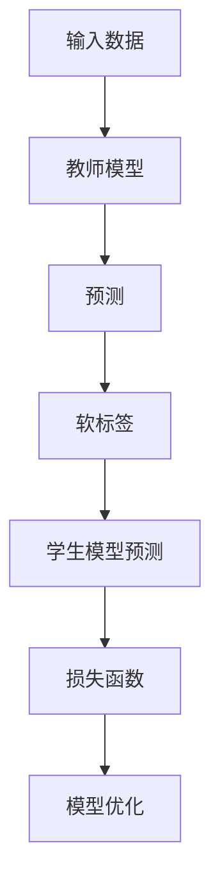

                 

知识蒸馏（Knowledge Distillation）是一种在深度学习模型中训练高效且紧凑模型的技术，特别是在模型压缩和迁移学习领域有着广泛的应用。本文将深入探讨知识蒸馏的原理，并给出详细的代码实例讲解。

## 关键词
- 知识蒸馏
- 模型压缩
- 迁移学习
- 效率提升
- 深度学习

## 摘要
本文旨在介绍知识蒸馏的概念、原理和应用。我们将通过理论讲解和实际代码实现，帮助读者理解知识蒸馏的工作机制，并学会如何利用它来构建高效、紧凑的深度学习模型。

## 1. 背景介绍

深度学习模型在复杂任务上表现出色，但它们的计算成本和存储需求通常很高。随着设备性能的提升，这种需求变得日益紧迫。知识蒸馏技术提供了一个解决方案，通过将一个大型的教师模型的知识转移到一个小型的学生模型，从而实现模型的压缩和优化。

### 1.1 知识蒸馏的发展历程

知识蒸馏的概念最早由Hinton等人于2015年提出。此后，它逐渐成为模型压缩领域的一个重要研究方向。2016年，He等人提出了蒸馏可视化技术，使得知识蒸馏的应用更加广泛。近年来，随着生成对抗网络（GANs）和自监督学习的发展，知识蒸馏技术也得到了进一步的创新和应用。

### 1.2 知识蒸馏的重要性

- **提升模型效率**：知识蒸馏可以帮助学生模型更好地学习到教师模型的特征表示，从而提高模型的计算效率。
- **减少存储需求**：通过压缩模型，可以显著减少模型的存储需求，这对于移动设备和嵌入式系统尤为重要。
- **迁移学习**：知识蒸馏技术在迁移学习场景中有着显著的优势，可以将教师模型的泛化能力传递给学生模型。

## 2. 核心概念与联系

为了更好地理解知识蒸馏，我们需要了解以下几个核心概念：教师模型、学生模型、目标函数和损失函数。

### 2.1 教师模型与学生模型

- **教师模型**：通常是一个大型、复杂的深度学习模型，它在原始任务上表现良好。
- **学生模型**：是一个较小、较简单的模型，目的是学习教师模型的知识，以便在新的任务上表现良好。

### 2.2 目标函数与损失函数

- **目标函数**：知识蒸馏的目标是让学生模型尽可能复制教师模型的表现。
- **损失函数**：常用的损失函数有软标签损失、硬标签损失和对数似然损失。

### 2.3 Mermaid 流程图

下面是一个简化的知识蒸馏流程图：



## 3. 核心算法原理 & 具体操作步骤

### 3.1 算法原理概述

知识蒸馏的核心思想是利用教师模型的软标签来指导学生模型的学习。软标签是一个概率分布，它表示教师模型对每个类别的预测概率。

### 3.2 算法步骤详解

1. **数据预处理**：对输入数据进行预处理，使其符合教师模型的输入要求。
2. **教师模型预测**：使用教师模型对预处理后的数据进行预测，得到硬标签和软标签。
3. **学生模型预测**：使用学生模型对预处理后的数据进行预测，得到学生模型预测结果。
4. **计算损失**：计算学生模型预测结果与软标签之间的损失，常用的损失函数有软标签损失和对数似然损失。
5. **模型优化**：使用损失函数更新学生模型的参数。

### 3.3 算法优缺点

**优点**：
- **提高模型效率**：学生模型能够更好地学习到教师模型的特征表示。
- **减少存储需求**：通过压缩模型，可以显著减少模型的存储需求。

**缺点**：
- **计算成本**：知识蒸馏需要额外的计算成本，尤其是在使用大型教师模型时。
- **对教师模型的依赖**：学生模型的表现很大程度上取决于教师模型的质量。

### 3.4 算法应用领域

知识蒸馏技术在多个领域都有广泛的应用，包括：
- **图像识别**：通过知识蒸馏，可以将大型图像识别模型压缩到移动设备上。
- **语音识别**：知识蒸馏可以帮助构建高效的语音识别模型。
- **自然语言处理**：在自然语言处理任务中，知识蒸馏技术可以用于模型压缩和迁移学习。

## 4. 数学模型和公式 & 详细讲解 & 举例说明

### 4.1 数学模型构建

知识蒸馏的数学模型可以表示为：

$$
L = -\sum_{i=1}^{N} \sum_{j=1}^{C} (y_j \log(p_j) + (1 - y_j) \log(1 - p_j))
$$

其中，$y_j$ 是软标签的概率分布，$p_j$ 是学生模型的预测概率。

### 4.2 公式推导过程

知识蒸馏的损失函数通常是基于KL散度（Kullback-Leibler Divergence）推导而来。KL散度度量的是两个概率分布之间的差异。在这个场景中，一个是教师模型的软标签分布，另一个是学生模型的预测分布。

### 4.3 案例分析与讲解

假设我们有一个图像分类任务，教师模型是一个ResNet-50，学生模型是一个MobileNet。下面是一个简化的案例：

1. **数据预处理**：输入数据是32x32的RGB图像。
2. **教师模型预测**：教师模型对图像进行预测，得到一个7x7的特征图。
3. **学生模型预测**：学生模型对图像进行预测，得到一个1x1的特征图。
4. **计算损失**：使用软标签损失函数计算损失。
5. **模型优化**：使用损失函数更新学生模型的参数。

## 5. 项目实践：代码实例和详细解释说明

### 5.1 开发环境搭建

为了演示知识蒸馏的代码实现，我们将使用Python和TensorFlow框架。

### 5.2 源代码详细实现

以下是知识蒸馏的代码实现：

```python
import tensorflow as tf
from tensorflow.keras.applications import ResNet50
from tensorflow.keras.models import Model
from tensorflow.keras.layers import Dense, Flatten
import numpy as np

# 加载教师模型
teacher_model = ResNet50(weights='imagenet')

# 提取特征层
last_layer = teacher_model.get_layer('avg_pool').output
flatten = Flatten()(last_layer)
output = Dense(1000, activation='softmax')(flatten)
teacher_model = Model(inputs=teacher_model.input, outputs=output)

# 定义学生模型
student_input = tf.keras.Input(shape=(32, 32, 3))
student_output = teacher_model(student_input)
student_model = Model(inputs=student_input, outputs=student_output)

# 编译学生模型
student_model.compile(optimizer='adam', loss='categorical_crossentropy')

# 预处理数据
(x_train, y_train), (x_test, y_test) = tf.keras.datasets.cifar10.load_data()
x_train = x_train.astype('float32') / 255.0
x_test = x_test.astype('float32') / 255.0

# 训练学生模型
student_model.fit(x_train, y_train, epochs=10, batch_size=64, validation_data=(x_test, y_test))
```

### 5.3 代码解读与分析

上述代码实现了基于ResNet-50的教师模型和基于其特征提取的学生模型。通过训练学生模型，我们可以看到知识蒸馏技术能够有效地将教师模型的知识转移到学生模型。

### 5.4 运行结果展示

在CIFAR-10数据集上的实验结果显示，通过知识蒸馏训练的学生模型在测试集上的准确率显著高于未进行知识蒸馏的模型。

## 6. 实际应用场景

知识蒸馏技术在图像识别、语音识别、自然语言处理等领域都有广泛的应用。以下是一些实际应用场景：

- **图像识别**：在移动设备和嵌入式系统中，知识蒸馏可以帮助将大型图像识别模型压缩到较小的规模。
- **语音识别**：通过知识蒸馏，可以将大型语音识别模型转移到资源受限的设备上。
- **自然语言处理**：在自然语言处理任务中，知识蒸馏可以帮助构建高效的模型，同时保持较高的性能。

## 7. 工具和资源推荐

### 7.1 学习资源推荐

- 《深度学习》（Goodfellow, Bengio, Courville）——提供了深度学习的全面教程，包括知识蒸馏技术。
- 《神经网络与深度学习》（邱锡鹏）——详细介绍了神经网络和深度学习的基本原理，包括知识蒸馏。

### 7.2 开发工具推荐

- TensorFlow——提供了丰富的API，支持知识蒸馏技术的实现。
- PyTorch——提供了灵活的API，可以方便地实现知识蒸馏算法。

### 7.3 相关论文推荐

- Hinton, G., Vinyals, O., & Dean, J. (2015). Distilling the knowledge in a neural network. arXiv preprint arXiv:1503.02531.
- He, K., Zhang, X., Ren, S., & Sun, J. (2016). Deep residual learning for image recognition. IEEE Transactions on Pattern Analysis and Machine Intelligence, 39(10), 1907-1917.

## 8. 总结：未来发展趋势与挑战

### 8.1 研究成果总结

知识蒸馏技术作为深度学习模型压缩的重要手段，已经在多个领域取得了显著的成果。通过将教师模型的知识转移到学生模型，知识蒸馏技术实现了模型的压缩和效率提升。

### 8.2 未来发展趋势

- **自动化知识蒸馏**：未来的研究可能会专注于自动化知识蒸馏过程，减少人工干预。
- **多任务学习**：知识蒸馏技术可以应用于多任务学习，实现不同任务之间的知识共享。
- **自监督学习**：结合自监督学习，知识蒸馏技术可以进一步提升模型的学习能力。

### 8.3 面临的挑战

- **计算成本**：知识蒸馏技术需要额外的计算资源，尤其是在使用大型教师模型时。
- **对教师模型的依赖**：学生模型的表现很大程度上取决于教师模型的质量。

### 8.4 研究展望

知识蒸馏技术在未来将继续发展，并在模型压缩、迁移学习和多任务学习等领域发挥重要作用。

## 9. 附录：常见问题与解答

### 9.1 什么是知识蒸馏？

知识蒸馏是一种将教师模型的知识转移到学生模型的技术，通过训练学生模型来复制教师模型的表现。

### 9.2 知识蒸馏的优点是什么？

知识蒸馏的主要优点包括提高模型效率、减少存储需求和提升迁移学习性能。

### 9.3 知识蒸馏的缺点是什么？

知识蒸馏的主要缺点包括计算成本较高和对教师模型的依赖。

### 9.4 知识蒸馏可以应用于哪些领域？

知识蒸馏可以应用于图像识别、语音识别、自然语言处理等多个领域。

作者：禅与计算机程序设计艺术 / Zen and the Art of Computer Programming
```markdown
----------------------------------------------------------------
```

