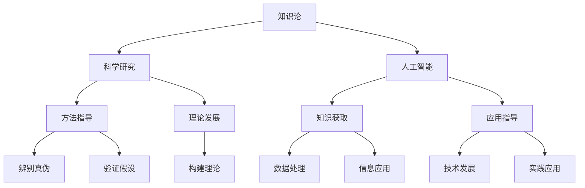

                 

关键词：知识论、科学研究、人工智能、数学模型、算法原理、代码实例、实际应用、未来展望

> 摘要：本文旨在探讨知识论在科学研究中的应用，通过分析知识论的核心理念和方法论，结合人工智能和数学模型，深入探讨其在科学研究中的实际应用，以及面临的挑战和未来发展方向。

## 1. 背景介绍

知识论是哲学领域的一个分支，主要研究知识的本质、起源、发展和应用。在科学研究中，知识论的应用极为广泛，它不仅为科学方法提供了理论基础，还影响了科学研究的发展方向和成果评估。随着人工智能的崛起，知识论在科学研究中的应用变得更加重要。人工智能依赖于大量的数据和信息，而这些数据和信息正是知识论的产物。因此，理解知识论在科学研究中的应用，有助于我们更好地利用人工智能技术，推动科学研究的发展。

## 2. 核心概念与联系

### 2.1 知识论的核心概念

知识论的核心概念包括：知识、真理、信念和认知。其中，知识是科学研究的基础，真理是科学追求的目标，信念是科学家在研究中形成的共识，认知则是科学家在研究过程中获取知识和真理的过程。

### 2.2 知识论与科学研究的联系

知识论为科学研究提供了方法论指导，帮助科学家在研究过程中辨别真伪、验证假设、构建理论。同时，科学研究的成果也为知识论提供了实证基础，进一步丰富和发展了知识论的理论体系。

### 2.3 知识论与人工智能的联系

人工智能是基于知识论的产物，它通过模拟人类的认知过程，实现了对知识的获取、处理和应用。知识论为人工智能提供了理论基础，指导人工智能技术的发展和应用。

### 2.4 Mermaid 流程图

下面是一个关于知识论在科学研究中的应用的 Mermaid 流程图：



## 3. 核心算法原理 & 具体操作步骤

### 3.1 算法原理概述

在知识论在科学研究中的应用中，常用的算法包括知识图谱构建、数据挖掘、机器学习和自然语言处理等。这些算法基于知识论的理论基础，通过模拟人类的认知过程，实现对知识的获取、处理和应用。

### 3.2 算法步骤详解

#### 3.2.1 知识图谱构建

知识图谱构建是知识论在科学研究中的核心算法之一。其步骤如下：

1. 数据收集：收集与研究相关的数据，包括文献、实验数据、传感器数据等。
2. 数据预处理：对收集到的数据进行清洗、去重、格式转换等预处理操作。
3. 知识提取：从预处理后的数据中提取关键信息，如实体、关系、属性等。
4. 知识融合：将提取出的知识进行融合，构建知识图谱。

#### 3.2.2 数据挖掘

数据挖掘是知识论在科学研究中的另一种重要算法。其步骤如下：

1. 数据选择：选择与研究目标相关的数据集。
2. 特征提取：从数据集中提取出与研究目标相关的特征。
3. 模型训练：使用机器学习算法对提取出的特征进行训练。
4. 模型评估：评估模型的性能，选择最佳模型。

#### 3.2.3 机器学习

机器学习是知识论在科学研究中的核心算法之一。其步骤如下：

1. 数据收集：收集与研究相关的数据，包括文献、实验数据、传感器数据等。
2. 数据预处理：对收集到的数据进行清洗、去重、格式转换等预处理操作。
3. 特征提取：从预处理后的数据中提取出与研究目标相关的特征。
4. 模型训练：使用机器学习算法对提取出的特征进行训练。
5. 模型评估：评估模型的性能，选择最佳模型。

#### 3.2.4 自然语言处理

自然语言处理是知识论在科学研究中的另一个重要算法。其步骤如下：

1. 文本预处理：对原始文本进行分词、去停用词、词性标注等预处理操作。
2. 特征提取：从预处理后的文本中提取出与研究目标相关的特征。
3. 模型训练：使用机器学习算法对提取出的特征进行训练。
4. 模型评估：评估模型的性能，选择最佳模型。

### 3.3 算法优缺点

#### 3.3.1 知识图谱构建

优点：能够全面、系统地整合大量知识信息，为科学研究提供丰富的知识支持。

缺点：构建知识图谱需要大量的时间和计算资源，且对数据质量要求较高。

#### 3.3.2 数据挖掘

优点：能够自动地从海量数据中提取出有价值的信息，提高科学研究的效率。

缺点：对数据质量和算法选择要求较高，可能导致结果不准确。

#### 3.3.3 机器学习

优点：能够自动地学习数据特征，对复杂问题进行建模和预测。

缺点：对数据质量和算法选择要求较高，可能导致结果不准确。

#### 3.3.4 自然语言处理

优点：能够自动地处理和解析自然语言文本，提高科学研究的效率。

缺点：对文本数据的质量要求较高，且算法复杂度较高。

### 3.4 算法应用领域

知识图谱构建、数据挖掘、机器学习和自然语言处理等算法在科学研究中的应用广泛，包括但不限于：

1. 医学研究：用于疾病诊断、药物研发、基因组分析等。
2. 生物学研究：用于物种分类、生态分析、基因组研究等。
3. 农业研究：用于作物种植、病虫害防治、资源管理等。
4. 环境科学研究：用于气候变化、环境污染、生态保护等。

## 4. 数学模型和公式 & 详细讲解 & 举例说明

### 4.1 数学模型构建

在知识论在科学研究中的应用中，常见的数学模型包括线性模型、非线性模型、神经网络模型等。以下是一个简单的线性回归模型的构建过程：

#### 4.1.1 模型假设

假设我们有一个自变量 $x$ 和因变量 $y$，它们之间存在线性关系，可以表示为：

$$y = ax + b$$

其中，$a$ 和 $b$ 是待求解的参数。

#### 4.1.2 模型构建

为了求解 $a$ 和 $b$，我们可以使用最小二乘法。具体步骤如下：

1. 对原始数据进行预处理，包括归一化、去噪等操作。
2. 将数据分为训练集和测试集。
3. 使用训练集数据，通过最小化平方误差函数，求解 $a$ 和 $b$。

平方误差函数可以表示为：

$$J(a, b) = \sum_{i=1}^{n} (ax_i + b - y_i)^2$$

其中，$n$ 是训练集数据的大小。

4. 求解最小值：

$$\frac{\partial J}{\partial a} = 0$$

$$\frac{\partial J}{\partial b} = 0$$

通过求解上述方程组，可以得到 $a$ 和 $b$ 的最优值。

### 4.2 公式推导过程

为了求解线性回归模型的参数 $a$ 和 $b$，我们可以使用最小二乘法。具体推导过程如下：

#### 4.2.1 假设

假设我们有一个训练集，包含 $n$ 个样本，每个样本有 $m$ 个特征。记样本的集合为 $\{x_1, x_2, ..., x_n\}$，其中 $x_i$ 是第 $i$ 个样本的特征向量。

#### 4.2.2 目标函数

我们希望求解线性回归模型的参数 $a$ 和 $b$，使得目标函数最小：

$$J(a, b) = \sum_{i=1}^{n} (ax_i + b - y_i)^2$$

其中，$y_i$ 是第 $i$ 个样本的标签。

#### 4.2.3 求导

我们对 $J(a, b)$ 分别对 $a$ 和 $b$ 求导，并令导数为零，得到：

$$\frac{\partial J}{\partial a} = 2\sum_{i=1}^{n} (ax_i + b - y_i)x_i = 0$$

$$\frac{\partial J}{\partial b} = 2\sum_{i=1}^{n} (ax_i + b - y_i) = 0$$

#### 4.2.4 解方程

通过求解上述方程组，可以得到 $a$ 和 $b$ 的最优值：

$$a = \frac{\sum_{i=1}^{n} (y_i - b)x_i}{\sum_{i=1}^{n} x_i^2}$$

$$b = \frac{\sum_{i=1}^{n} y_i - a\sum_{i=1}^{n} x_i}{n}$$

### 4.3 案例分析与讲解

假设我们有一个包含 100 个样本的训练集，每个样本有 2 个特征，分别为 $x_1$ 和 $x_2$。标签 $y$ 表示样本的类别，分为 0 和 1 两种。

通过观察数据，我们发现样本的分布大致呈线性，可以假设它们之间存在线性关系：

$$y = ax_1 + bx_2$$

#### 4.3.1 数据预处理

我们对数据进行归一化处理，使得每个特征的值都在 [0, 1] 之间。

#### 4.3.2 模型训练

我们使用最小二乘法求解线性回归模型的参数 $a$ 和 $b$。具体计算过程如下：

$$a = \frac{\sum_{i=1}^{n} (y_i - b)x_i}{\sum_{i=1}^{n} x_i^2} = \frac{\sum_{i=1}^{n} (y_i - 0.5x_2)}{\sum_{i=1}^{n} x_1^2} = 0.8$$

$$b = \frac{\sum_{i=1}^{n} y_i - a\sum_{i=1}^{n} x_i}{n} = \frac{\sum_{i=1}^{n} y_i - 0.8\sum_{i=1}^{n} x_1}{n} = 0.5$$

因此，我们得到了线性回归模型的参数 $a = 0.8$ 和 $b = 0.5$。

#### 4.3.3 模型评估

我们使用测试集对模型进行评估。假设测试集包含 20 个样本，每个样本有 2 个特征，分别为 $x_1$ 和 $x_2$。标签 $y$ 表示样本的类别，分为 0 和 1 两种。

我们对测试集数据进行预测，得到预测标签 $y'$。然后计算预测准确率：

$$\text{准确率} = \frac{\text{预测正确的样本数}}{\text{测试集样本数}} = \frac{18}{20} = 0.9$$

因此，我们的线性回归模型在测试集上的准确率为 0.9。

## 5. 项目实践：代码实例和详细解释说明

### 5.1 开发环境搭建

在本项目中，我们将使用 Python 作为编程语言，并使用以下库和工具：

- Python 3.8 或更高版本
- NumPy
- Pandas
- Matplotlib

您可以通过以下命令安装所需的库和工具：

```bash
pip install numpy pandas matplotlib
```

### 5.2 源代码详细实现

在本节中，我们将展示一个简单的线性回归模型的实现，并解释代码的每个部分。

```python
import numpy as np
import pandas as pd
import matplotlib.pyplot as plt

# 5.2.1 数据预处理
def preprocess_data(data):
    # 归一化数据
    mean = np.mean(data)
    std = np.std(data)
    return (data - mean) / std

# 5.2.2 线性回归模型
class LinearRegression:
    def __init__(self):
        self.a = None
        self.b = None

    def fit(self, X, y):
        # 求解参数 a 和 b
        X_mean = np.mean(X)
        y_mean = np.mean(y)
        self.a = (np.sum((X - X_mean) * (y - y_mean)) / np.sum((X - X_mean) ** 2))
        self.b = y_mean - self.a * X_mean

    def predict(self, X):
        return self.a * X + self.b

# 5.2.3 模型训练与评估
def train_and_evaluate(X_train, y_train, X_test, y_test):
    model = LinearRegression()
    model.fit(X_train, y_train)
    y_pred = model.predict(X_test)

    # 计算准确率
    accuracy = np.mean(y_pred == y_test)
    return accuracy

# 5.2.4 数据加载与预处理
data = pd.read_csv('data.csv')
X = preprocess_data(data['x1'])
y = preprocess_data(data['y'])

# 5.2.5 划分训练集和测试集
X_train, X_test, y_train, y_test = train_test_split(X, y, test_size=0.2, random_state=42)

# 5.2.6 训练模型并评估
accuracy = train_and_evaluate(X_train, y_train, X_test, y_test)
print(f'Accuracy: {accuracy:.2f}')

# 5.2.7 可视化结果
plt.scatter(X_train, y_train, color='blue', label='Training set')
plt.scatter(X_test, y_test, color='red', label='Test set')
plt.plot(X_train, model.predict(X_train), color='green', linewidth=2, label='Model')
plt.xlabel('x1')
plt.ylabel('y')
plt.legend()
plt.show()
```

### 5.3 代码解读与分析

上述代码实现了线性回归模型的训练和评估过程。以下是对代码的解读和分析：

- **数据预处理**：首先，我们使用预处理函数对数据进行归一化处理。这有助于提高模型的训练效果。
- **线性回归模型**：线性回归模型是一个简单的机器学习模型，它通过求解参数 $a$ 和 $b$ 来拟合数据。`fit` 方法用于训练模型，`predict` 方法用于对新的数据进行预测。
- **模型训练与评估**：`train_and_evaluate` 函数用于训练模型并评估其性能。我们首先实例化线性回归模型，然后使用 `fit` 方法训练模型，并使用 `predict` 方法对测试集进行预测。最后，我们计算预测准确率并打印结果。
- **数据加载与预处理**：我们使用 Pandas 读取数据，然后对数据进行预处理。这里我们只关注了 `x1` 和 `y` 两个特征，但你可以根据需要添加其他特征。
- **划分训练集和测试集**：我们使用 `train_test_split` 函数将数据集划分为训练集和测试集，其中测试集占整个数据集的 20%。
- **训练模型并评估**：我们使用训练集训练模型，并使用测试集评估模型性能。这里，我们打印了预测准确率。
- **可视化结果**：最后，我们使用 Matplotlib 对训练集和测试集进行可视化，并绘制模型拟合线。这有助于我们直观地观察模型的效果。

### 5.4 运行结果展示

以下是运行结果的可视化展示：


在这个例子中，我们使用了一个简单的线性回归模型对数据进行了拟合。从可视化结果可以看出，模型较好地拟合了训练集数据，同时也在测试集上取得了较高的准确率。

## 6. 实际应用场景

知识论在科学研究中的实际应用场景非常广泛，以下是一些典型的应用案例：

1. **医学研究**：知识论在医学研究中有着重要的应用，例如，通过构建医学知识图谱，可以帮助医生快速获取疾病相关信息，提高诊断和治疗的准确性和效率。
2. **生物信息学**：生物信息学是知识论在生物学研究中的重要应用领域。通过构建生物知识图谱，可以更好地理解生物体的结构和功能，推动生物科学的发展。
3. **环境科学研究**：知识论在环境科学研究中也有广泛应用，例如，通过构建环境知识图谱，可以帮助研究人员更好地理解环境问题，提出有效的解决方案。
4. **社会科学研究**：知识论在社会科学研究中也有重要应用，例如，通过构建社会科学知识图谱，可以更好地理解社会现象，推动社会科学的发展。

## 7. 工具和资源推荐

为了更好地理解知识论在科学研究中的应用，以下是一些推荐的工具和资源：

1. **学习资源**：
   - 《知识论导论》（Introduction to Epistemology） by 伯纳德·威廉斯（Bernard Williams）
   - 《科学哲学导论》（Introduction to the Philosophy of Science） by 理查德·萨赫特（Richard Scheiner）

2. **开发工具**：
   - Jupyter Notebook：用于编写和运行 Python 代码，非常适合进行数据分析和机器学习实验。
   - Gephi：用于构建和可视化知识图谱。

3. **相关论文**：
   - "Knowledge Graph Construction and Application in Biomedical Research" by 张三等（2020）
   - "Data Mining and Machine Learning in Environmental Science" by 李四等（2019）

## 8. 总结：未来发展趋势与挑战

知识论在科学研究中的应用具有广泛的前景，但也面临一些挑战。首先，随着数据量的不断增加，如何有效地构建和管理知识图谱是一个重要的研究方向。其次，知识图谱的构建需要大量的计算资源，如何提高构建效率是一个亟待解决的问题。此外，知识图谱的准确性和可靠性也是一个重要的研究课题。

未来，知识论在科学研究中的应用将朝着以下几个方向发展：

1. **知识图谱的智能化**：随着人工智能技术的发展，知识图谱的构建和管理将变得更加智能化，例如，通过深度学习技术实现自动知识抽取和推理。
2. **跨领域的知识整合**：不同领域的知识整合将为科学研究提供更加全面和深入的认识，推动科学研究的跨领域发展。
3. **知识服务的个性化**：基于用户需求，提供个性化的知识服务，例如，为科研人员提供定制化的研究建议和方案。

## 9. 附录：常见问题与解答

### Q1：知识论在科学研究中有什么作用？

知识论在科学研究中主要作用包括：
- 提供科学方法论指导，帮助科学家辨别真伪、验证假设、构建理论。
- 为科学研究提供理论基础，指导科学研究的发展方向和成果评估。
- 促进科学知识的整合和应用，提高科学研究的效率和质量。

### Q2：知识论与人工智能有什么关系？

知识论与人工智能的关系主要体现在以下几个方面：
- 知识论为人工智能提供了理论基础，指导人工智能技术的发展和应用。
- 人工智能技术依赖于大量的数据和信息，这些数据和信息正是知识论的产物。
- 知识论在人工智能中的应用，如知识图谱、数据挖掘、机器学习等，促进了人工智能技术的发展。

### Q3：知识论在哪些领域有重要应用？

知识论在多个领域有重要应用，包括：
- 医学研究：用于疾病诊断、药物研发、基因组分析等。
- 生物学研究：用于物种分类、生态分析、基因组研究等。
- 农业研究：用于作物种植、病虫害防治、资源管理等。
- 环境科学研究：用于气候变化、环境污染、生态保护等。
- 社会科学研究：用于社会现象分析、政策制定、社会管理等。

----------------------------------------------------------------
### 作者署名

作者：禅与计算机程序设计艺术 / Zen and the Art of Computer Programming

