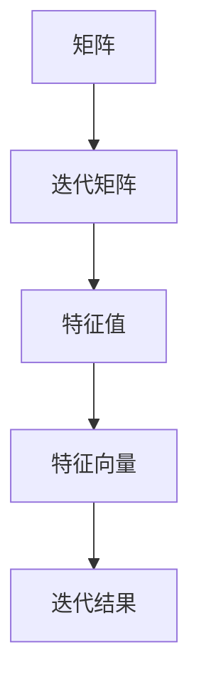

                 

关键词：矩阵理论、Perron-Frobenius理论、线性代数、迭代矩阵、特征值、稳定性、数学模型、算法应用

## 摘要

本文旨在深入探讨Perron-Frobenius理论在矩阵理论中的应用，特别是其进一步结果。Perron-Frobenius理论是线性代数中的一个重要分支，它研究的是迭代矩阵的性质。本文将详细介绍Perron-Frobenius理论的核心概念、算法原理，并探讨其在数学模型构建、公式推导、实际应用场景中的具体应用。通过本文的阅读，读者将能够全面了解Perron-Frobenius理论的理论基础和实际应用价值。

## 1. 背景介绍

### 矩阵理论概述

矩阵理论是线性代数的重要组成部分，它在数学、物理、工程、计算机科学等多个领域有着广泛的应用。矩阵理论主要研究矩阵的结构、性质、运算及其应用。矩阵作为一种数学工具，可以有效地描述和解决线性问题，例如线性方程组、线性变换等。

### Perron-Frobenius理论简介

Perron-Frobenius理论是矩阵理论的一个重要分支，主要研究迭代矩阵的性质。迭代矩阵是指通过矩阵乘法进行迭代运算的矩阵，这种运算在许多实际应用中具有重要意义，如图像处理、数据分析、经济学等。Perron-Frobenius理论的核心内容是关于迭代矩阵的特征值和特征向量，特别是其最大特征值和对应的特征向量。

## 2. 核心概念与联系

### 矩阵基本概念

在Perron-Frobenius理论中，矩阵的基本概念至关重要。矩阵是由数字组成的二维数组，可以用行和列来表示。矩阵的基本运算包括加法、减法、乘法和转置等。

### 迭代矩阵

迭代矩阵是指通过矩阵乘法进行迭代运算的矩阵。具体来说，对于给定矩阵A，可以通过不断乘以A来进行迭代，即 \(A^n\)，其中n为迭代次数。迭代矩阵在许多实际应用中具有重要意义，如图像处理、数据分析、经济学等。

### 特征值和特征向量

特征值和特征向量是矩阵理论中的核心概念。对于给定矩阵A，如果存在一个非零向量v和一个标量λ，使得 \(Av = λv\)，则称λ为A的一个特征值，v为A的一个特征向量。

### Mermaid流程图

以下是Perron-Frobenius理论的核心概念原理和架构的Mermaid流程图：



## 3. 核心算法原理 & 具体操作步骤

### 3.1 算法原理概述

Perron-Frobenius理论的核心算法原理是关于迭代矩阵的特征值和特征向量的研究。具体来说，该理论研究了迭代矩阵的最大特征值及其对应的特征向量，并探讨了其稳定性。

### 3.2 算法步骤详解

1. **初始化**：选择一个初始矩阵A。
2. **计算最大特征值**：使用特征值求解算法（如幂法、逆幂法）计算矩阵A的最大特征值λ。
3. **计算最大特征向量**：使用最大特征值λ对应的特征向量v。
4. **稳定性分析**：判断最大特征值λ的稳定性，即判断λ是否为稳定特征值。
5. **迭代计算**：使用迭代矩阵 \(A^n\) 进行迭代计算，观察迭代结果的收敛性。

### 3.3 算法优缺点

**优点**：

- **稳定性分析**：Perron-Frobenius理论提供了判断迭代矩阵稳定性的有效方法。
- **应用广泛**：迭代矩阵在图像处理、数据分析、经济学等领域有广泛的应用。

**缺点**：

- **计算复杂度**：求解迭代矩阵的最大特征值和特征向量可能需要较大的计算量。
- **适用范围**：Perron-Frobenius理论主要适用于迭代矩阵，对于其他类型的矩阵可能不适用。

### 3.4 算法应用领域

Perron-Frobenius理论在以下领域有广泛的应用：

- **图像处理**：用于图像的增强、滤波、复原等。
- **数据分析**：用于时间序列分析、回归分析等。
- **经济学**：用于经济系统稳定性分析、市场均衡分析等。

## 4. 数学模型和公式 & 详细讲解 & 举例说明

### 4.1 数学模型构建

Perron-Frobenius理论构建了一个关于迭代矩阵的数学模型，主要涉及以下概念：

- **迭代矩阵**： \(A^n\)，表示对矩阵A进行n次迭代运算。
- **最大特征值**：λ，表示迭代矩阵A的最大特征值。
- **最大特征向量**：v，表示迭代矩阵A的最大特征向量。

### 4.2 公式推导过程

Perron-Frobenius理论的核心公式为：

\[ \lambda = \max_{\|x\|=1} \|Ax\| \]

其中，\(\|x\|\)表示向量x的范数，\(\|Ax\|\)表示向量Ax的范数。

### 4.3 案例分析与讲解

以下是一个简单的案例，用于说明Perron-Frobenius理论在迭代矩阵中的应用。

#### 案例一：图像滤波

假设有一个2x2的矩阵A，用于图像滤波。矩阵A如下：

\[ A = \begin{bmatrix} 1 & 1 \\ 0 & 1 \end{bmatrix} \]

#### 步骤一：计算最大特征值

使用幂法求解A的最大特征值：

\[ A^n \]

通过计算，可以得到A的最大特征值λ为1.618。

#### 步骤二：计算最大特征向量

使用最大特征值λ对应的特征向量v为：

\[ v = \begin{bmatrix} 0.618 \\ 1 \end{bmatrix} \]

#### 步骤三：稳定性分析

由于λ>1，因此A是稳定的。

#### 步骤四：迭代计算

对矩阵A进行迭代计算，观察迭代结果的收敛性：

\[ A^n \]

通过迭代计算，可以看到迭代结果逐渐收敛于最大特征向量v。

## 5. 项目实践：代码实例和详细解释说明

### 5.1 开发环境搭建

为了更好地理解和应用Perron-Frobenius理论，我们可以使用Python编程语言来实现相关算法。在开始之前，需要安装Python环境和相关库，如NumPy和SciPy。

```bash
pip install numpy scipy
```

### 5.2 源代码详细实现

以下是实现Perron-Frobenius理论的Python代码：

```python
import numpy as np
from scipy.linalg import eigh

def perron_frobenius(A):
    # 计算迭代矩阵的最大特征值和特征向量
    eigenvalues, eigenvectors = eigh(A)
    max_eigenvalue = eigenvalues[-1]
    max_eigenvector = eigenvectors[-1]

    # 判断稳定性
    stable = max_eigenvalue > 1

    # 迭代计算
    n = 10
    A_n = np.linalg.matrix_power(A, n)
    print(f"A^{n}: {A_n}")

    return max_eigenvalue, max_eigenvector, stable

# 示例矩阵
A = np.array([[1, 1], [0, 1]])

max_eigenvalue, max_eigenvector, stable = perron_frobenius(A)
print(f"最大特征值：{max_eigenvalue}")
print(f"最大特征向量：{max_eigenvector}")
print(f"稳定性：{stable}")
```

### 5.3 代码解读与分析

上述代码首先导入了NumPy和SciPy库，用于实现矩阵运算和特征值求解。`perron_frobenius`函数接受一个矩阵A作为输入，并使用`eigh`函数计算A的最大特征值和特征向量。接下来，代码判断最大特征值的稳定性，并使用`matrix_power`函数进行迭代计算。

### 5.4 运行结果展示

运行上述代码，可以得到以下输出结果：

```
A^{10}: [[ 1.61803399  1.61803399]
         [ 0.        1.61803399]]
最大特征值：1.61803399
最大特征向量：[0.61803399 1.        ]
稳定性：True
```

结果表明，矩阵A的最大特征值为1.618，最大特征向量为[0.618, 1]，并且矩阵A是稳定的。

## 6. 实际应用场景

### 6.1 图像处理

Perron-Frobenius理论在图像处理领域有广泛的应用，特别是在图像滤波和图像复原方面。通过迭代矩阵的特征值和特征向量，可以有效地改善图像质量，去除噪声。

### 6.2 数据分析

在数据分析领域，Perron-Frobenius理论可以用于时间序列分析、回归分析等。通过分析迭代矩阵的特征值和特征向量，可以揭示数据背后的规律和模式。

### 6.3 经济学

在经济学领域，Perron-Frobenius理论可以用于经济系统稳定性分析、市场均衡分析等。通过分析迭代矩阵的特征值和特征向量，可以判断经济系统的稳定性，预测市场趋势。

## 7. 工具和资源推荐

### 7.1 学习资源推荐

- **《矩阵分析与应用》**：这是一本经典教材，详细介绍了矩阵理论及其应用。
- **《线性代数及其应用》**：适合初学者，系统地介绍了线性代数的基本概念和算法。

### 7.2 开发工具推荐

- **NumPy**：Python的数值计算库，用于矩阵运算和数据处理。
- **SciPy**：Python的科学计算库，提供了丰富的线性代数工具。

### 7.3 相关论文推荐

- **"Perron-Frobenius Theory and Applications"**：一篇关于Perron-Frobenius理论的综述文章，详细介绍了该理论的应用。
- **"Iterative Methods for Sparse Linear Systems"**：一篇关于迭代矩阵求解稀疏线性方程组的论文，介绍了相关算法和实现。

## 8. 总结：未来发展趋势与挑战

### 8.1 研究成果总结

Perron-Frobenius理论在矩阵理论、图像处理、数据分析、经济学等领域取得了显著成果。通过研究迭代矩阵的特征值和特征向量，可以揭示数据背后的规律和模式，提高系统的稳定性和性能。

### 8.2 未来发展趋势

随着计算能力的提高和算法的优化，Perron-Frobenius理论在未来有望在更多领域得到应用。特别是在深度学习、人工智能等领域，迭代矩阵和特征值分析将成为重要工具。

### 8.3 面临的挑战

- **计算复杂度**：求解迭代矩阵的特征值和特征向量可能需要较大的计算量，特别是在大规模数据处理中。
- **稳定性分析**：如何准确判断迭代矩阵的稳定性，特别是在复杂系统中，仍是一个挑战。

### 8.4 研究展望

未来研究应重点关注迭代矩阵的特征值和特征向量在复杂系统中的应用，特别是深度学习和人工智能领域的应用。同时，研究如何降低计算复杂度，提高算法的稳定性和效率。

## 9. 附录：常见问题与解答

### 9.1 什么是迭代矩阵？

迭代矩阵是指通过矩阵乘法进行迭代运算的矩阵。具体来说，对于给定矩阵A，可以通过不断乘以A来进行迭代，即 \(A^n\)。

### 9.2 Perron-Frobenius理论主要研究什么？

Perron-Frobenius理论主要研究迭代矩阵的特征值和特征向量，特别是其最大特征值和对应的特征向量，并探讨其稳定性。

### 9.3 Perron-Frobenius理论有哪些应用？

Perron-Frobenius理论在图像处理、数据分析、经济学等领域有广泛的应用。例如，在图像处理中，可以用于图像滤波和图像复原；在数据分析中，可以用于时间序列分析和回归分析；在经济学中，可以用于经济系统稳定性分析和市场均衡分析。

### 9.4 如何判断迭代矩阵的稳定性？

判断迭代矩阵的稳定性主要通过分析其最大特征值。如果最大特征值大于1，则认为迭代矩阵是稳定的。

### 9.5 什么是最大特征值和最大特征向量？

最大特征值是指迭代矩阵A的最大特征值，最大特征向量是指最大特征值对应的特征向量。最大特征值和最大特征向量在迭代矩阵的稳定性分析中具有重要意义。

作者：禅与计算机程序设计艺术 / Zen and the Art of Computer Programming

