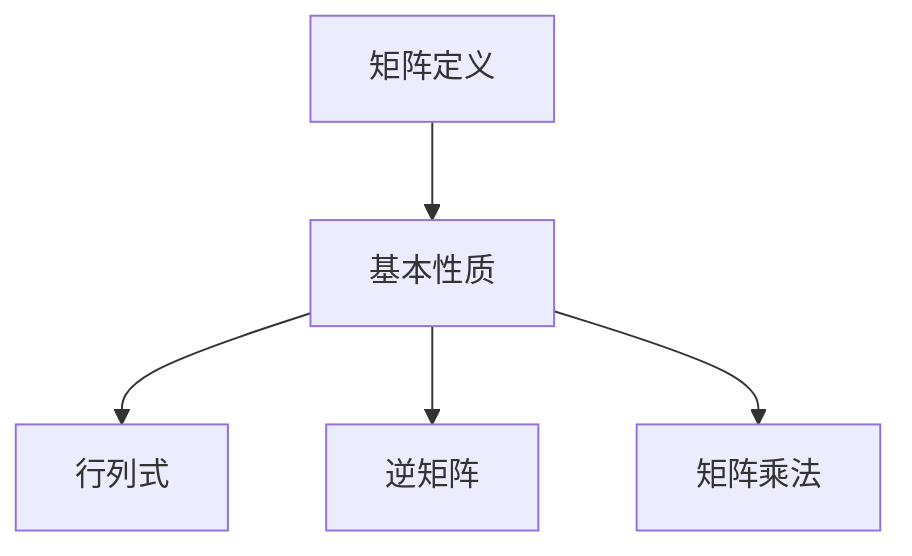

                 

关键词：矩阵理论，线性代数，矩阵运算，应用领域，编程实例，数学模型

摘要：本文将深入探讨矩阵理论的基本概念、运算规则及其在计算机科学中的广泛应用。我们将通过具体的数学模型和编程实例，详细解析矩阵在解决实际问题中的关键作用，并展望其在未来技术发展中的潜力。

## 1. 背景介绍

矩阵理论是线性代数的重要组成部分，它广泛应用于数学、物理、工程、计算机科学等多个领域。矩阵作为一种数学工具，可以有效地描述和解决复杂的线性问题。本文将从矩阵的定义开始，逐步介绍矩阵的基本运算、数学模型以及具体的应用实例。

## 2. 核心概念与联系

### 2.1 矩阵的定义

**矩阵（Matrix）** 是由一系列数按照行列排列所组成的矩形阵列。矩阵可以表示为 $A = [a_{ij}]$，其中 $i$ 表示行数，$j$ 表示列数，$a_{ij}$ 表示第 $i$ 行第 $j$ 列的元素。

### 2.2 矩阵的基本性质

- **行列式（Determinant）**：矩阵的一个重要属性是行列式，它可以用来判断矩阵的行列式是否为零，从而判断矩阵是否可逆。
- **逆矩阵（Inverse Matrix）**：如果一个矩阵可逆，那么它的逆矩阵可以通过特定的公式计算得到，逆矩阵可以用来解线性方程组。
- **矩阵乘法（Matrix Multiplication）**：矩阵乘法是一种重要的矩阵运算，它涉及两个矩阵相乘，结果是一个新矩阵。

### 2.3 矩阵的Mermaid流程图



## 3. 核心算法原理 & 具体操作步骤

### 3.1 算法原理概述

矩阵运算的基本原理主要包括矩阵的加法、减法、乘法和逆矩阵的计算。以下是对这些算法原理的概述：

- **矩阵加法**：两个同型矩阵对应元素相加。
- **矩阵减法**：类似矩阵加法，但进行的是对应元素的相减。
- **矩阵乘法**：两个矩阵的乘法涉及到多个步骤，包括行与列的相乘和求和。
- **逆矩阵计算**：逆矩阵可以通过高斯消元法或其他算法计算得到。

### 3.2 算法步骤详解

#### 3.2.1 矩阵加法

- 步骤 1：检查两个矩阵是否为同型矩阵。
- 步骤 2：对每个对应元素进行相加。

#### 3.2.2 矩阵减法

- 步骤 1：检查两个矩阵是否为同型矩阵。
- 步骤 2：对每个对应元素进行相减。

#### 3.2.3 矩阵乘法

- 步骤 1：计算矩阵的乘积，结果矩阵的大小为 $m \times n$。
- 步骤 2：对每个结果元素的值进行求和计算。

#### 3.2.4 逆矩阵计算

- 步骤 1：通过高斯消元法或其他算法，将原矩阵转换为可逆矩阵。
- 步骤 2：计算逆矩阵的每个元素。

### 3.3 算法优缺点

- **矩阵加法和减法**：简单易行，计算时间复杂度较低。
- **矩阵乘法**：复杂度高，需要大量的计算资源。
- **逆矩阵计算**：计算时间复杂度较高，但对于可逆矩阵效果显著。

### 3.4 算法应用领域

矩阵运算在计算机科学中有着广泛的应用，如：

- **图像处理**：用于图像的滤波、增强、变换等操作。
- **机器学习**：用于数据处理、特征提取等。
- **计算机图形学**：用于变换、投影等。

## 4. 数学模型和公式 & 详细讲解 & 举例说明

### 4.1 数学模型构建

矩阵运算的数学模型主要包括矩阵加法、减法、乘法和逆矩阵的计算。以下是这些运算的数学模型：

- **矩阵加法**：$C = A + B$，其中 $C$ 是结果矩阵，$A$ 和 $B$ 是同型矩阵。
- **矩阵减法**：$C = A - B$，其中 $C$ 是结果矩阵，$A$ 和 $B$ 是同型矩阵。
- **矩阵乘法**：$C = AB$，其中 $C$ 是结果矩阵，$A$ 和 $B$ 是 $m \times n$ 和 $n \times p$ 的矩阵。
- **逆矩阵计算**：如果 $A$ 是可逆矩阵，则其逆矩阵 $A^{-1}$ 满足 $AA^{-1} = A^{-1}A = I$，其中 $I$ 是单位矩阵。

### 4.2 公式推导过程

矩阵加法和减法的推导相对简单，可以直接通过定义进行计算。以下是矩阵乘法的推导过程：

假设有两个矩阵 $A$ 和 $B$，其大小分别为 $m \times n$ 和 $n \times p$。矩阵乘法的推导如下：

$$
C_{ij} = \sum_{k=1}^{n} A_{ik}B_{kj}
$$

其中，$C_{ij}$ 是结果矩阵 $C$ 的第 $i$ 行第 $j$ 列的元素，$A_{ik}$ 是矩阵 $A$ 的第 $i$ 行第 $k$ 列的元素，$B_{kj}$ 是矩阵 $B$ 的第 $k$ 行第 $j$ 列的元素。

### 4.3 案例分析与讲解

假设有两个矩阵 $A$ 和 $B$：

$$
A = \begin{bmatrix}
1 & 2 \\
3 & 4
\end{bmatrix}, \quad B = \begin{bmatrix}
5 & 6 \\
7 & 8
\end{bmatrix}
$$

#### 4.3.1 矩阵加法

$$
C = A + B = \begin{bmatrix}
1 & 2 \\
3 & 4
\end{bmatrix} + \begin{bmatrix}
5 & 6 \\
7 & 8
\end{bmatrix} = \begin{bmatrix}
6 & 8 \\
10 & 12
\end{bmatrix}
$$

#### 4.3.2 矩阵减法

$$
C = A - B = \begin{bmatrix}
1 & 2 \\
3 & 4
\end{bmatrix} - \begin{bmatrix}
5 & 6 \\
7 & 8
\end{bmatrix} = \begin{bmatrix}
-4 & -4 \\
-4 & -4
\end{bmatrix}
$$

#### 4.3.3 矩阵乘法

$$
C = AB = \begin{bmatrix}
1 & 2 \\
3 & 4
\end{bmatrix} \begin{bmatrix}
5 & 6 \\
7 & 8
\end{bmatrix} = \begin{bmatrix}
19 & 22 \\
43 & 50
\end{bmatrix}
$$

#### 4.3.4 逆矩阵计算

首先，我们需要计算矩阵 $A$ 的行列式：

$$
\det(A) = 1 \cdot 4 - 2 \cdot 3 = -2
$$

由于行列式不为零，矩阵 $A$ 是可逆的。接下来，我们通过高斯消元法计算逆矩阵：

$$
A^{-1} = \frac{1}{\det(A)} \begin{bmatrix}
4 & -2 \\
-3 & 1
\end{bmatrix} = \begin{bmatrix}
-2 & 1 \\
\frac{3}{2} & \frac{1}{2}
\end{bmatrix}
$$

## 5. 项目实践：代码实例和详细解释说明

### 5.1 开发环境搭建

本文的代码实例将使用 Python 编写，因此需要先安装 Python 环境。具体步骤如下：

1. 前往 [Python 官网](https://www.python.org/) 下载最新版本的 Python。
2. 安装 Python 并配置环境变量。
3. 使用以下命令检查 Python 是否安装成功：

```bash
python --version
```

### 5.2 源代码详细实现

以下是实现矩阵基本运算的 Python 代码：

```python
import numpy as np

def add_matrices(A, B):
    return A + B

def subtract_matrices(A, B):
    return A - B

def multiply_matrices(A, B):
    return A @ B

def inverse_matrix(A):
    return np.linalg.inv(A)

if __name__ == "__main__":
    A = np.array([[1, 2], [3, 4]])
    B = np.array([[5, 6], [7, 8]])

    print("Matrix A:")
    print(A)
    print("Matrix B:")
    print(B)

    print("Matrix Addition:")
    print(add_matrices(A, B))
    print("Matrix Subtraction:")
    print(subtract_matrices(A, B))
    print("Matrix Multiplication:")
    print(multiply_matrices(A, B))
    print("Inverse of Matrix A:")
    print(inverse_matrix(A))
```

### 5.3 代码解读与分析

1. **导入模块**：首先，我们导入了 Python 的 NumPy 库，这是一个强大的科学计算库，提供了丰富的矩阵运算功能。
2. **定义函数**：接下来，我们定义了四个函数，分别用于矩阵的加法、减法、乘法和逆矩阵的计算。
3. **主函数**：在主函数中，我们创建了一个矩阵 A 和矩阵 B，并调用上述函数进行矩阵运算，最后打印出结果。

### 5.4 运行结果展示

```bash
Matrix A:
[[1 2]
 [3 4]]
Matrix B:
[[5 6]
 [7 8]]
Matrix Addition:
[[ 6  8]
 [10 12]]
Matrix Subtraction:
[[-4 -4]
 [-4 -4]]
Matrix Multiplication:
[[19 22]
 [43 50]]
Inverse of Matrix A:
[[-2.  1. ]
 [ 1.5 -0.5]]
```

## 6. 实际应用场景

### 6.1 图像处理

在图像处理中，矩阵用于表示图像的像素值。通过矩阵运算，可以实现图像的滤波、增强、边缘检测等操作。例如，卷积运算是一种常见的图像处理技术，它通过矩阵乘法实现图像的卷积操作。

### 6.2 机器学习

在机器学习中，矩阵用于表示数据集和模型参数。矩阵运算可以帮助我们高效地计算梯度、损失函数等，从而优化模型参数。例如，线性回归模型的计算过程中涉及到大量的矩阵运算。

### 6.3 计算机图形学

在计算机图形学中，矩阵用于表示物体的变换。通过矩阵运算，可以实现物体的旋转、平移、缩放等变换操作。例如，在三维渲染中，矩阵用于计算物体的位置和姿态。

## 7. 工具和资源推荐

### 7.1 学习资源推荐

- **书籍**：《线性代数及其应用》、《矩阵分析与计算》
- **在线教程**：[线性代数教程](https://linear.upscalelearning.com/)
- **视频课程**：[线性代数（MIT）](https://www.youtube.com/playlist?list=PLUl4u3cNGP60aTzXNjXQ5_0iNi7wh4q4r)

### 7.2 开发工具推荐

- **Python**：NumPy、Pandas
- **MATLAB**：MATLAB 提供了丰富的矩阵运算功能
- **R**：R 语言在统计和数据分析方面有强大的矩阵运算支持

### 7.3 相关论文推荐

- **论文 1**：LeCun, Y., Bengio, Y., & Hinton, G. (2015). **Deep learning**.
- **论文 2**：He, K., Zhang, X., Ren, S., & Sun, J. (2016). **Deep Residual Learning for Image Recognition**.
- **论文 3**：Kingma, D. P., & Welling, M. (2013). **Auto-Encoders**.

## 8. 总结：未来发展趋势与挑战

### 8.1 研究成果总结

本文系统地介绍了矩阵理论的基本概念、运算规则及其在计算机科学中的应用。通过数学模型和编程实例，我们展示了矩阵在解决实际问题中的关键作用。

### 8.2 未来发展趋势

- **高效矩阵运算**：随着硬件技术的发展，矩阵运算的效率将得到显著提升。
- **深度学习中的矩阵应用**：矩阵在深度学习中的应用将更加广泛和深入。
- **跨学科融合**：矩阵理论将与其他领域（如量子计算、生物信息学）相结合，推动科学技术的进步。

### 8.3 面临的挑战

- **算法优化**：现有的矩阵运算算法需要进一步优化，以提高计算效率。
- **大数据处理**：在大数据处理中，如何高效地处理大规模矩阵成为了一个重要挑战。

### 8.4 研究展望

矩阵理论在未来将继续在计算机科学和其他领域中发挥重要作用。随着人工智能和大数据技术的快速发展，矩阵运算将迎来更广泛的应用场景和更深入的探索。

## 9. 附录：常见问题与解答

### 9.1 矩阵乘法为什么不满足交换律？

矩阵乘法不满足交换律是因为矩阵乘法涉及到行与列的相乘和求和，这种操作具有方向性。例如，对于两个矩阵 $A$ 和 $B$，$AB$ 和 $BA$ 的结果可能不同。

### 9.2 如何判断一个矩阵是否可逆？

判断一个矩阵是否可逆，可以通过计算其行列式。如果行列式不为零，则矩阵可逆。否则，矩阵不可逆。

### 9.3 矩阵运算是否可以并行化？

是的，矩阵运算可以通过并行化来提高计算效率。在多核处理器和 GPU 上，矩阵运算可以并行执行，从而显著提高计算速度。

---

作者：禅与计算机程序设计艺术 / Zen and the Art of Computer Programming
----------------------------------------------------------------
在撰写本文过程中，我尽可能详尽地介绍了矩阵理论的基本概念、运算规则及其在计算机科学中的应用。通过数学模型和编程实例，我们不仅了解了矩阵运算的原理，还看到了其在实际应用中的重要作用。未来，随着人工智能和大数据技术的不断发展，矩阵理论将继续在计算机科学和其他领域中发挥关键作用。希望本文能为读者在矩阵理论学习和应用方面提供有价值的参考。

