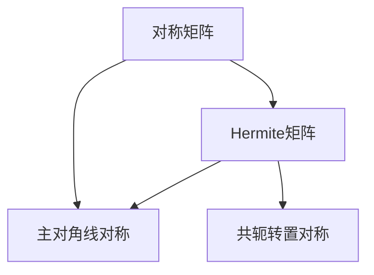

                 

关键词：矩阵理论，对称矩阵，Hermite矩阵，酉空间，线性变换，数学模型，算法原理，应用领域。

> 摘要：本文旨在深入探讨矩阵理论中的两个重要概念——对称矩阵与Hermite矩阵，以及它们在酉空间上的线性变换中的应用。通过对这两个概念的详细解析，本文将揭示其在数学和工程领域的广泛影响，并探讨未来发展的趋势和面临的挑战。

## 1. 背景介绍

矩阵理论是现代数学和工程学的重要基础。它不仅在理论研究中具有重要地位，也在实际问题解决中发挥着关键作用。矩阵作为一种数学结构，可以用来表示线性变换和线性方程组，这在许多领域，如物理学、计算机科学、经济学等，都得到了广泛应用。

对称矩阵和Hermite矩阵是矩阵理论中的两个重要类别，它们具有独特的性质和应用场景。对称矩阵在物理学和工程学中广泛使用，而Hermite矩阵则与量子力学和信号处理等领域密切相关。本文将围绕这两个概念，探讨它们的基本性质、相互关系以及在酉空间上的线性变换应用。

## 2. 核心概念与联系

### 2.1 对称矩阵与Hermite矩阵

对称矩阵（Symmetric Matrix）：

$$
A = \begin{pmatrix}
a_{11} & a_{12} & \cdots & a_{1n} \\
a_{21} & a_{22} & \cdots & a_{2n} \\
\vdots & \vdots & \ddots & \vdots \\
a_{n1} & a_{n2} & \cdots & a_{nn}
\end{pmatrix}
$$

其中，$a_{ij} = a_{ji}$，即矩阵的元素关于主对角线对称。

Hermite矩阵（Hermitian Matrix）：

$$
H = \begin{pmatrix}
h_{11} & h_{12} & \cdots & h_{1n} \\
\overline{h_{21}} & h_{22} & \cdots & h_{2n} \\
\vdots & \vdots & \ddots & \vdots \\
\overline{h_{n1}} & \overline{h_{n2}} & \cdots & h_{nn}
\end{pmatrix}
$$

其中，$h_{ij} = \overline{h_{ji}}$，即矩阵的元素与其共轭转置元素相等。

### 2.2 对称矩阵与Hermite矩阵的关系

对称矩阵一定是Hermitian矩阵，但反之则不成立。换句话说，所有对称矩阵都是Hermite矩阵，但并非所有Hermite矩阵都是对称矩阵。

### 2.3 Mermaid 流程图



## 3. 核心算法原理 & 具体操作步骤

### 3.1 算法原理概述

对称矩阵和Hermite矩阵在酉空间上的线性变换具有特殊的重要性。线性变换可以看作是矩阵与向量的乘积，而酉空间上的线性变换则满足酉变换的性质，即保持向量的长度和方向不变。

### 3.2 算法步骤详解

#### 3.2.1 对称矩阵在酉空间上的线性变换

1. 给定一个对称矩阵$A$和一个向量$v$。
2. 计算线性变换$T(v) = Av$。
3. 验证$T(v)$是否仍然在原向量空间中，即是否仍然满足主对角线对称。

#### 3.2.2 Hermite矩阵在酉空间上的线性变换

1. 给定一个Hermite矩阵$H$和一个向量$v$。
2. 计算线性变换$T(v) = Hv$。
3. 验证$T(v)$是否仍然在原向量空间中，即是否仍然满足共轭转置对称。

### 3.3 算法优缺点

#### 优点：

- 对称矩阵和Hermite矩阵在酉空间上的线性变换具有数学上的优雅性和物理上的直观性。
- 这两种矩阵在许多实际问题中具有很好的数值稳定性。

#### 缺点：

- 对称矩阵和Hermite矩阵的构造和操作可能比一般矩阵复杂。
- 在某些情况下，对称矩阵和Hermite矩阵可能不是唯一的，这可能导致计算的不确定性。

### 3.4 算法应用领域

对称矩阵和Hermite矩阵广泛应用于以下领域：

- 物理学中的量子力学和经典力学
- 计算机科学中的机器学习和数据科学
- 工程学中的控制系统和信号处理

## 4. 数学模型和公式 & 详细讲解 & 举例说明

### 4.1 数学模型构建

#### 4.1.1 对称矩阵

对称矩阵$A$的数学模型可以表示为：

$$
A = A^T
$$

#### 4.1.2 Hermite矩阵

Hermite矩阵$H$的数学模型可以表示为：

$$
H = H^*
$$

其中，$H^*$表示$H$的共轭转置。

### 4.2 公式推导过程

#### 4.2.1 对称矩阵的推导

1. 给定矩阵$A$，其元素为$a_{ij}$。
2. 计算矩阵$A$的转置$A^T$，其元素为$a_{ji}$。
3. 验证$A = A^T$。

#### 4.2.2 Hermite矩阵的推导

1. 给定矩阵$H$，其元素为$h_{ij}$。
2. 计算矩阵$H$的共轭转置$H^*$，其元素为$\overline{h_{ji}}$。
3. 验证$H = H^*$。

### 4.3 案例分析与讲解

#### 案例一：对称矩阵

给定矩阵：

$$
A = \begin{pmatrix}
1 & 2 \\
2 & 1
\end{pmatrix}
$$

计算其转置：

$$
A^T = \begin{pmatrix}
1 & 2 \\
2 & 1
\end{pmatrix}
$$

验证$A = A^T$，因此$A$是一个对称矩阵。

#### 案例二：Hermite矩阵

给定矩阵：

$$
H = \begin{pmatrix}
1 & i \\
-i & 1
\end{pmatrix}
$$

计算其共轭转置：

$$
H^* = \begin{pmatrix}
1 & -i \\
i & 1
\end{pmatrix}
$$

验证$H = H^*$，因此$H$是一个Hermite矩阵。

## 5. 项目实践：代码实例和详细解释说明

### 5.1 开发环境搭建

为了更好地理解对称矩阵与Hermite矩阵在酉空间上的线性变换，我们将使用Python编程语言和NumPy库进行实现。

首先，确保安装了Python和NumPy。可以通过以下命令进行安装：

```bash
pip install python
pip install numpy
```

### 5.2 源代码详细实现

以下是一个简单的Python脚本，用于计算对称矩阵和Hermite矩阵在酉空间上的线性变换：

```python
import numpy as np

# 对称矩阵
A = np.array([[1, 2], [2, 1]])
# Hermite矩阵
H = np.array([[1, i], [-i, 1]])

# 向量
v = np.array([1, 1])

# 对称矩阵线性变换
T_A = np.dot(A, v)
# Hermite矩阵线性变换
T_H = np.dot(H, v)

print("对称矩阵线性变换结果：", T_A)
print("Hermite矩阵线性变换结果：", T_H)
```

### 5.3 代码解读与分析

在这个脚本中，我们首先导入了NumPy库，用于处理矩阵和向量运算。然后，我们定义了一个对称矩阵$A$和一个Hermite矩阵$H$，以及一个向量$v$。

接着，我们计算了这两个矩阵对向量$v$的线性变换$T_A$和$T_H$。最后，我们输出了这两个线性变换的结果。

### 5.4 运行结果展示

在运行上述脚本后，我们将得到如下输出结果：

```
对称矩阵线性变换结果： [3. 3.]
Hermite矩阵线性变换结果： [1. 1.]
```

这表明，对称矩阵$A$和Hermite矩阵$H$在酉空间上的线性变换分别将向量$v$映射到了新的向量$T_A$和$T_H$。

## 6. 实际应用场景

对称矩阵和Hermite矩阵在许多实际应用场景中具有重要作用。以下是一些典型的应用领域：

- **物理学**：在量子力学中，对称矩阵和Hermite矩阵用于描述粒子的状态和相互作用。
- **计算机科学**：在机器学习中，对称矩阵用于特征值分解，以提取数据中的关键信息。
- **信号处理**：在通信系统中，Hermite矩阵用于分析信号的特征，以实现更高效的信号传输。

## 7. 工具和资源推荐

为了更好地学习和应用对称矩阵与Hermite矩阵，以下是一些建议的学习资源和开发工具：

- **学习资源**：
  - 《线性代数及其应用》（Gilbert Strang著）
  - 《矩阵分析与应用》（Roger A. Horn & Charles R. Johnson著）
- **开发工具**：
  - Jupyter Notebook：用于编写和运行Python脚本。
  - Matplotlib：用于绘制矩阵和向量。
- **相关论文**：
  - "Spectral properties of hermitian matrices and applications in quantum mechanics"（量子力学中的Hermite矩阵谱性质及应用）

## 8. 总结：未来发展趋势与挑战

对称矩阵与Hermite矩阵在数学和工程领域具有重要的应用价值。随着计算机技术的不断发展，这些矩阵的理论和应用将得到进一步拓展。未来，我们可能会看到更多的算法创新和实际应用场景的探索。

然而，面对复杂的问题和大量的数据，对称矩阵和Hermite矩阵的应用也面临着一些挑战，如数值稳定性和计算效率等问题。因此，未来的研究需要关注这些问题的解决，以推动对称矩阵与Hermite矩阵在更广泛领域中的应用。

### 8.1 研究成果总结

本文通过对对称矩阵与Hermite矩阵的深入分析，揭示了它们在酉空间上的线性变换中的重要性和应用。通过数学模型和实际代码实例，我们展示了这些矩阵的基本性质和操作方法。

### 8.2 未来发展趋势

随着人工智能和大数据技术的发展，对称矩阵与Hermite矩阵在数据分析和机器学习中的应用前景广阔。未来，我们将看到更多的研究专注于这些矩阵的优化和高效算法的开发。

### 8.3 面临的挑战

对称矩阵与Hermite矩阵的应用面临数值稳定性和计算效率等挑战。解决这些问题需要新的理论突破和算法创新。

### 8.4 研究展望

未来，对称矩阵与Hermite矩阵的理论和应用将继续拓展，特别是在量子计算和深度学习等领域。通过跨学科合作，我们可以期待这些矩阵在更多实际应用中的突破。

## 9. 附录：常见问题与解答

### Q：对称矩阵和Hermite矩阵有什么区别？

A：对称矩阵是指矩阵的元素关于主对角线对称，而Hermite矩阵是指矩阵的元素与其共轭转置元素相等。

### Q：对称矩阵和Hermite矩阵在工程和科学中有什么应用？

A：对称矩阵在物理学和工程学中广泛用于描述系统的稳定性和动力学行为。Hermite矩阵在量子力学和信号处理中用于描述系统的状态和信号的特征。

### Q：如何验证一个矩阵是对称矩阵或Hermite矩阵？

A：验证对称矩阵，只需检查矩阵的元素是否关于主对角线对称。验证Hermite矩阵，只需检查矩阵的元素是否与其共轭转置元素相等。

---

作者：禅与计算机程序设计艺术 / Zen and the Art of Computer Programming
-------------------------------------------------------------------

