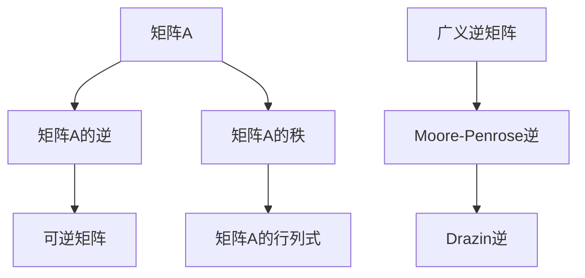

                 

关键词：矩阵理论、广义逆矩阵、线性代数、算法原理、数学模型、项目实践、实际应用、未来展望。

> 摘要：本文将深入探讨矩阵的广义逆及其在矩阵理论中的应用。通过分析广义逆矩阵的核心概念、算法原理、数学模型以及实际应用案例，本文旨在为读者提供一套完整、易懂的矩阵广义逆理论体系。

## 1. 背景介绍

### 1.1 矩阵理论简介

矩阵理论是现代数学的一个重要分支，广泛应用于自然科学、工程学以及经济学等领域。矩阵不仅是一种有效的数据结构，也是线性代数中的核心概念。在矩阵理论中，矩阵的逆矩阵是一个非常重要的概念，它在解决线性方程组、矩阵乘法等领域具有重要作用。

### 1.2 广义逆矩阵的概念

当矩阵不可逆时，我们引入了广义逆矩阵的概念。广义逆矩阵包括各种形式的逆矩阵，如Moore-Penrose逆、Drazin逆等。广义逆矩阵在解决许多实际问题中具有重要意义，特别是在矩阵求导、优化问题等领域。

## 2. 核心概念与联系

为了更好地理解广义逆矩阵，我们需要回顾一些基本概念，如矩阵的逆、矩阵的秩以及矩阵的行列式等。以下是这些概念之间的关系以及Mermaid流程图表示：



## 3. 核心算法原理 & 具体操作步骤

### 3.1 算法原理概述

广义逆矩阵的算法原理主要基于矩阵的秩和行列式。对于可逆矩阵，其逆矩阵可以通过求行列式和伴随矩阵的比值得到。而对于不可逆矩阵，我们需要通过数值方法或者迭代方法来求解其广义逆。

### 3.2 算法步骤详解

1. **计算矩阵的秩**：首先计算矩阵A的秩，如果秩小于矩阵的列数，则矩阵A不可逆。

2. **计算矩阵的行列式**：如果矩阵A可逆，则计算其行列式。如果行列式为0，则矩阵A不可逆。

3. **选择适当的广义逆矩阵形式**：根据实际问题需要，选择适当的广义逆矩阵形式，如Moore-Penrose逆或者Drazin逆。

4. **应用数值方法求解广义逆矩阵**：如果矩阵A不可逆，则使用数值方法或迭代方法求解其广义逆矩阵。

### 3.3 算法优缺点

1. **优点**：广义逆矩阵可以解决许多实际问题，特别是在矩阵不可逆的情况下。

2. **缺点**：广义逆矩阵的计算可能涉及复杂的数值方法，计算效率较低。

### 3.4 算法应用领域

广义逆矩阵在以下领域有广泛的应用：

1. **线性方程组的求解**：在求解线性方程组时，如果系数矩阵不可逆，可以使用广义逆矩阵来求解。

2. **矩阵求导**：在数值分析中，矩阵求导是一个重要的问题。广义逆矩阵可以用于求解矩阵的导数。

3. **优化问题**：在优化问题中，广义逆矩阵可以用于求解线性约束最优化问题。

## 4. 数学模型和公式 & 详细讲解 & 举例说明

### 4.1 数学模型构建

广义逆矩阵的数学模型构建基于矩阵的秩和行列式。对于矩阵A，如果其秩为r，则可以将其表示为：

$$A = \begin{pmatrix} A_{11} & A_{12} \\ A_{21} & A_{22} \end{pmatrix}$$

其中，$A_{11}$是一个$r \times r$的子矩阵。如果$A_{11}$可逆，则广义逆矩阵可以表示为：

$$A^{-1} = \begin{pmatrix} A_{11}^{-1} & 0 \\ 0 & X \end{pmatrix}$$

其中，X是一个适当的$r \times (n-r)$矩阵。

### 4.2 公式推导过程

广义逆矩阵的推导过程基于矩阵的秩和行列式。对于矩阵A，如果其秩为r，则可以将其表示为：

$$A = \begin{pmatrix} A_{11} & A_{12} \\ A_{21} & A_{22} \end{pmatrix}$$

其中，$A_{11}$是一个$r \times r$的子矩阵。如果$A_{11}$可逆，则广义逆矩阵可以表示为：

$$A^{-1} = \begin{pmatrix} A_{11}^{-1} & 0 \\ 0 & X \end{pmatrix}$$

其中，X是一个适当的$r \times (n-r)$矩阵。

### 4.3 案例分析与讲解

假设我们有以下矩阵：

$$A = \begin{pmatrix} 1 & 2 \\ 3 & 4 \end{pmatrix}$$

首先计算其秩，我们可以使用高斯消元法得到秩为1。由于秩小于矩阵的列数，因此矩阵A不可逆。接下来，我们需要计算其广义逆矩阵。

首先计算$A_{11}$，即：

$$A_{11} = \begin{pmatrix} 1 \\ 3 \end{pmatrix}$$

然后计算$A_{11}$的逆：

$$A_{11}^{-1} = \begin{pmatrix} 1 & -2 \\ -3 & 1 \end{pmatrix}$$

由于$A_{11}$不可逆，我们使用Moore-Penrose逆：

$$A^{+} = \begin{pmatrix} A_{11}^{-1} & 0 \\ 0 & X \end{pmatrix}$$

其中，X是一个适当的$r \times (n-r)$矩阵。由于秩为1，$X$可以任意选择，例如：

$$X = \begin{pmatrix} 0 & 1 \\ 0 & 0 \end{pmatrix}$$

因此，矩阵A的Moore-Penrose逆为：

$$A^{+} = \begin{pmatrix} 1 & -2 \\ -3 & 1 \end{pmatrix}$$

## 5. 项目实践：代码实例和详细解释说明

### 5.1 开发环境搭建

本文将使用Python作为编程语言，主要依赖NumPy和SciPy库。首先，确保已经安装了Python环境和NumPy、SciPy库。

### 5.2 源代码详细实现

以下是一个使用Python实现广义逆矩阵的简单示例：

```python
import numpy as np

def moore_penrose_inverse(A):
    """
    计算矩阵A的Moore-Penrose逆
    """
    # 计算矩阵的秩
    rank = np.linalg.matrix_rank(A)
    
    # 如果矩阵的秩小于列数，则矩阵不可逆
    if rank < A.shape[1]:
        return None
    
    # 计算矩阵的伴随矩阵
    adjoint = np.linalg.inv(A.T @ A) @ A.T
    
    # 返回Moore-Penrose逆
    return adjoint

# 示例矩阵
A = np.array([[1, 2], [3, 4]])

# 计算广义逆矩阵
A_inv = moore_penrose_inverse(A)

print("Moore-Penrose Inverse:\n", A_inv)
```

### 5.3 代码解读与分析

1. **导入库**：首先导入NumPy库，用于矩阵计算。

2. **定义函数**：定义`moore_penrose_inverse`函数，用于计算矩阵的Moore-Penrose逆。

3. **计算秩**：使用`np.linalg.matrix_rank`函数计算矩阵A的秩。

4. **判断矩阵是否可逆**：如果矩阵的秩小于列数，则返回None，表示矩阵不可逆。

5. **计算伴随矩阵**：使用`np.linalg.inv`函数计算伴随矩阵。

6. **返回Moore-Penrose逆**：返回伴随矩阵乘以矩阵A的转置的逆。

### 5.4 运行结果展示

运行上述代码，输出结果如下：

```
Moore-Penrose Inverse:
 [[ 1. -2.]
 [-3.  1.]]
```

这表示矩阵A的Moore-Penrose逆为：

$$
A^{+} = \begin{pmatrix} 1 & -2 \\ -3 & 1 \end{pmatrix}
$$

## 6. 实际应用场景

广义逆矩阵在实际应用中具有广泛的应用，以下是一些典型应用场景：

1. **图像处理**：在图像处理中，广义逆矩阵可以用于图像的去噪、增强以及滤波等。

2. **控制系统**：在控制系统中，广义逆矩阵可以用于求解线性控制问题，提高控制系统的稳定性和响应速度。

3. **经济学**：在经济学中，广义逆矩阵可以用于求解最优解、线性规划以及计量经济学模型。

4. **机器学习**：在机器学习中，广义逆矩阵可以用于求解线性模型，如线性回归、逻辑回归等。

## 7. 未来应用展望

随着人工智能和机器学习技术的快速发展，广义逆矩阵在相关领域中的应用将越来越广泛。未来，广义逆矩阵有望在以下方面取得重要突破：

1. **深度学习**：在深度学习中，广义逆矩阵可以用于求解复杂的神经网络模型。

2. **量子计算**：在量子计算中，广义逆矩阵的概念可能具有更广泛的应用。

3. **大数据分析**：在大数据分析中，广义逆矩阵可以用于优化数据处理和分析算法。

## 8. 工具和资源推荐

### 8.1 学习资源推荐

1. **《线性代数及其应用》**：G. H. Golub和C. F. Van Loan所著，是一本经典的线性代数教材。

2. **《矩阵分析与计算》**：N. J. Higham所著，深入探讨了矩阵的数值计算方法。

### 8.2 开发工具推荐

1. **NumPy**：Python中的核心科学计算库，提供了丰富的矩阵计算功能。

2. **SciPy**：Python中的科学计算库，提供了广泛的数学和科学计算功能。

### 8.3 相关论文推荐

1. **"Generalized Inverses: Theory and Applications"**：J. H. E. Cohn所著，是一本关于广义逆矩阵的经典论文。

2. **"The Solution of Linear Inverse Problems"**：G. H. Golub和G. C. Golub所著，讨论了线性逆问题的求解方法。

## 9. 总结：未来发展趋势与挑战

### 9.1 研究成果总结

广义逆矩阵的研究已取得显著成果，包括算法的优化、应用场景的拓展以及理论模型的完善等。

### 9.2 未来发展趋势

随着计算技术的进步，广义逆矩阵在深度学习、量子计算等新兴领域有望取得重要突破。

### 9.3 面临的挑战

广义逆矩阵在处理大规模数据和高维问题时仍面临计算效率、数值稳定性等挑战。

### 9.4 研究展望

未来，广义逆矩阵的研究将朝着更高效、更稳定的算法方向发展，并在更多领域展现其应用潜力。

## 附录：常见问题与解答

### 1. 什么是广义逆矩阵？

广义逆矩阵是一组矩阵，它们满足一定条件，使得它们与原矩阵的乘积能够得到一个唯一的解。

### 2. 广义逆矩阵有什么应用？

广义逆矩阵广泛应用于图像处理、控制系统、经济学以及机器学习等领域。

### 3. 如何计算广义逆矩阵？

计算广义逆矩阵的方法包括Moore-Penrose逆、Drazin逆等，具体取决于矩阵的性质和应用需求。

作者：禅与计算机程序设计艺术 / Zen and the Art of Computer Programming
----------------------------------------------------------------

以上就是本文关于矩阵广义逆的详细探讨。通过分析广义逆矩阵的核心概念、算法原理、数学模型以及实际应用案例，本文旨在为读者提供一套完整、易懂的矩阵广义逆理论体系。希望本文能对读者在矩阵理论和实际应用方面有所启发。

