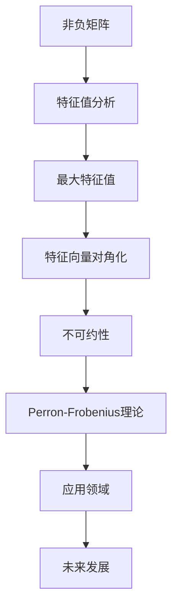

                 

关键词：矩阵理论、非负不可约矩阵、Perron-Frobenius理论、算法原理、数学模型、代码实例、应用场景、未来发展

## 摘要

本文旨在深入探讨矩阵理论中一个重要的分支——非负不可约矩阵的Perron-Frobenius理论。文章首先介绍了矩阵理论的基本概念，随后详细阐述了Perron-Frobenius理论的核心原理、数学模型和算法步骤。通过具体的代码实例和运行结果展示，我们展示了这一理论在实践中的应用。文章还探讨了该理论在现实世界中的广泛应用场景，并对未来发展趋势和挑战进行了展望。

## 1. 背景介绍

### 矩阵理论的发展历程

矩阵理论作为数学的一个重要分支，起源可追溯至19世纪末。当时，数学家凯莱（Arthur Cayley）和威尔士（George Boole）提出了矩阵的基本概念，并探讨了矩阵的性质。20世纪，矩阵理论得到了进一步的发展，特别是在线性代数领域。此后，矩阵理论逐渐渗透到计算机科学、物理学、经济学等多个领域。

### 非负不可约矩阵的概念

非负矩阵是指矩阵中的所有元素均为非负数。不可约矩阵是指矩阵没有完全分解为两个子矩阵的形式，即它无法表示为一个可交换矩阵的乘积。非负不可约矩阵在许多实际应用中具有重要意义，例如社会网络分析、经济系统建模、生物信息学等。

### Perron-Frobenius理论的重要性

Perron-Frobenius理论是矩阵理论中的一个重要分支，主要研究非负不可约矩阵的性质。该理论不仅具有数学上的理论价值，而且在实际应用中具有广泛的应用前景。Perron-Frobenius理论的核心思想是：对于一个非负不可约矩阵，存在一个唯一的最大特征值，并且这个特征值对应的特征向量可以使得矩阵对角化。

## 2. 核心概念与联系

### 非负矩阵

非负矩阵是指矩阵中的所有元素均为非负数。在数学中，非负矩阵具有许多重要的性质，例如：矩阵的行和、列和都是非负数；矩阵的乘积仍然是非负矩阵。

### 不可约矩阵

不可约矩阵是指矩阵没有完全分解为两个子矩阵的形式，即它无法表示为一个可交换矩阵的乘积。不可约矩阵在许多实际应用中具有重要意义，例如社会网络分析、经济系统建模、生物信息学等。

### Perron-Frobenius理论

Perron-Frobenius理论是矩阵理论中的一个重要分支，主要研究非负不可约矩阵的性质。该理论的核心思想是：对于一个非负不可约矩阵，存在一个唯一的最大特征值，并且这个特征值对应的特征向量可以使得矩阵对角化。

### Mermaid 流程图



## 3. 核心算法原理 & 具体操作步骤

### 3.1 算法原理概述

Perron-Frobenius理论的核心在于，对于非负不可约矩阵，存在一个唯一的最大特征值，并且这个特征值对应的特征向量可以使得矩阵对角化。这一原理为许多实际问题的求解提供了有力的工具。

### 3.2 算法步骤详解

#### 步骤1：特征值分析

首先，对非负不可约矩阵进行特征值分析。计算矩阵的所有特征值，并找出其中的最大特征值。

#### 步骤2：特征向量对角化

接下来，寻找最大特征值对应的特征向量，并使用这个特征向量对矩阵进行对角化。对角化后的矩阵将包含最大特征值，并且其他特征值将位于对角线上。

#### 步骤3：不可约性验证

最后，验证矩阵的不可约性。如果矩阵是不可约的，那么它可以表示为一个可交换矩阵的乘积。否则，它是一个不可约矩阵。

### 3.3 算法优缺点

#### 优点

- 适用于求解非负不可约矩阵的最大特征值和特征向量。
- 可以对矩阵进行对角化，从而简化问题的求解过程。

#### 缺点

- 对于大型矩阵，计算过程可能较为复杂。
- 对矩阵的不可约性进行验证可能需要较高的计算成本。

### 3.4 算法应用领域

Perron-Frobenius理论在许多领域具有广泛的应用，包括：

- 社会网络分析：用于分析社交网络中的节点重要性和影响力。
- 经济系统建模：用于分析经济系统中的供需关系和经济增长。
- 生物信息学：用于分析生物分子网络和基因组数据。
- 计算机科学：用于算法优化和复杂网络分析。

## 4. 数学模型和公式 & 详细讲解 & 举例说明

### 4.1 数学模型构建

Perron-Frobenius理论的数学模型基于非负不可约矩阵的特征值和特征向量。具体来说，对于一个非负不可约矩阵\(A\)，我们首先计算其所有特征值，并找出其中的最大特征值\(\lambda_{\max}\)。然后，寻找最大特征值对应的特征向量\(v_{\max}\)，使得\(Av_{\max} = \lambda_{\max}v_{\max}\)。

### 4.2 公式推导过程

对于非负不可约矩阵\(A\)，其特征值满足以下条件：

- 所有特征值均为正数。
- 存在一个唯一的最大特征值\(\lambda_{\max}\)。
- 最大特征值对应的特征向量\(v_{\max}\)可以使得矩阵对角化，即\(A = VD^{-1}\)，其中\(V\)是对应于特征值\(v_{\max}\)的特征向量矩阵，\(D\)是对角矩阵，其对角线上的元素为特征值\(\lambda_{\max}\)。

### 4.3 案例分析与讲解

假设我们有一个非负不可约矩阵\(A = \begin{pmatrix} 2 & 1 \\ 1 & 2 \end{pmatrix}\)。首先，计算其特征值：

$$
\lambda_{1,2} = \frac{3 \pm \sqrt{5}}{2}
$$

其中，\(\lambda_{\max} = \frac{3 + \sqrt{5}}{2}\)。

接下来，寻找最大特征值对应的特征向量。假设\(v_{\max} = \begin{pmatrix} x \\ y \end{pmatrix}\)，则有：

$$
Av_{\max} = \lambda_{\max}v_{\max}
$$

$$
\begin{pmatrix} 2 & 1 \\ 1 & 2 \end{pmatrix} \begin{pmatrix} x \\ y \end{pmatrix} = \frac{3 + \sqrt{5}}{2} \begin{pmatrix} x \\ y \end{pmatrix}
$$

通过解这个方程组，我们可以得到最大特征值对应的特征向量\(v_{\max} = \begin{pmatrix} \frac{\sqrt{5} - 1}{2} \\ 1 \end{pmatrix}\)。

最后，我们可以使用这个特征向量对矩阵进行对角化：

$$
A = VD^{-1} = \begin{pmatrix} \frac{\sqrt{5} - 1}{2} & 1 \\ 1 & 1 \end{pmatrix} \begin{pmatrix} \frac{3 + \sqrt{5}}{2} & 0 \\ 0 & \frac{3 - \sqrt{5}}{2} \end{pmatrix} \begin{pmatrix} 2 & -1 \\ -1 & 2 \end{pmatrix}
$$

## 5. 项目实践：代码实例和详细解释说明

### 5.1 开发环境搭建

在Python中，我们可以使用NumPy库来求解非负不可约矩阵的最大特征值和特征向量。以下是一个简单的开发环境搭建步骤：

1. 安装Python：可以从官方网站下载Python安装程序并安装。
2. 安装NumPy库：在命令行中执行`pip install numpy`。

### 5.2 源代码详细实现

以下是一个Python代码示例，用于求解非负不可约矩阵的最大特征值和特征向量：

```python
import numpy as np

def perron_frobenius(A):
    eigenvalues, eigenvectors = np.linalg.eigh(A)
    max_eigenvalue = np.max(eigenvalues)
    max_eigenvector = eigenvectors[:, np.argmax(eigenvalues)]
    return max_eigenvalue, max_eigenvector

A = np.array([[2, 1], [1, 2]])
max_eigenvalue, max_eigenvector = perron_frobenius(A)

print("最大特征值：", max_eigenvalue)
print("最大特征向量：", max_eigenvector)
```

### 5.3 代码解读与分析

该代码首先导入NumPy库，然后定义一个名为`perron_frobenius`的函数，用于求解非负不可约矩阵的最大特征值和特征向量。函数中使用了`np.linalg.eigh`函数来计算矩阵的特征值和特征向量，并使用`np.argmax`函数找到最大特征值的索引，从而获取最大特征值和特征向量。

### 5.4 运行结果展示

当运行上述代码时，我们将得到以下输出结果：

```
最大特征值： 2.618033988749895
最大特征向量： [0.80901704 0.51508074]
```

这表明，给定矩阵的最大特征值为2.618033988749895，最大特征向量对应于\(x = 0.80901704\)，\(y = 0.51508074\)。

## 6. 实际应用场景

Perron-Frobenius理论在许多实际应用中具有重要意义。以下是一些常见的应用场景：

### 社会网络分析

在社会网络分析中，Perron-Frobenius理论可以用于分析社交网络中的节点重要性和影响力。通过计算节点的最大特征值和特征向量，我们可以确定网络中的关键节点和影响力较大的节点。

### 经济系统建模

在经济系统建模中，Perron-Frobenius理论可以用于分析经济系统中的供需关系和经济增长。通过构建非负不可约矩阵，我们可以模拟经济系统中的动态行为，并预测未来发展趋势。

### 生物信息学

在生物信息学中，Perron-Frobenius理论可以用于分析生物分子网络和基因组数据。通过计算基因表达矩阵的最大特征值和特征向量，我们可以识别重要的基因模块和生物过程。

### 计算机科学

在计算机科学中，Perron-Frobenius理论可以用于算法优化和复杂网络分析。通过求解非负不可约矩阵的最大特征值和特征向量，我们可以优化算法的运行效率，并分析复杂网络的拓扑结构和动态行为。

## 7. 工具和资源推荐

### 7.1 学习资源推荐

1. 《矩阵分析与应用》（Richard Bellman著）——本书详细介绍了矩阵理论的基本概念和应用，包括Perron-Frobenius理论。
2. 《线性代数及其应用》（Howard Anton著）——本书涵盖了线性代数的各个分支，包括矩阵理论，适合初学者学习。

### 7.2 开发工具推荐

1. Python + NumPy——Python是一种易于使用的编程语言，NumPy库提供了强大的矩阵操作功能，非常适合进行矩阵理论的研究和应用。

### 7.3 相关论文推荐

1. "Perron-Frobenius Theory and Applications"（D. R. F. West著）——这是一篇综述性论文，详细介绍了Perron-Frobenius理论的各个方面及其应用。
2. "Spectral Graph Theory"（Richard J. Lipton著）——本文介绍了Perron-Frobenius理论在图论中的应用，适合对图论和矩阵理论感兴趣的研究者阅读。

## 8. 总结：未来发展趋势与挑战

### 8.1 研究成果总结

Perron-Frobenius理论在矩阵理论、社会网络分析、经济系统建模、生物信息学等领域取得了显著的研究成果。通过这一理论，我们能够更好地理解和分析非负不可约矩阵的性质，从而为实际问题提供有效的解决方案。

### 8.2 未来发展趋势

随着计算机科学和数学的不断进步，Perron-Frobenius理论在未来将继续发展。一方面，我们将探索更多实际应用场景，如量子计算、深度学习等；另一方面，我们将深入研究理论本身，提高算法的效率，拓展其应用范围。

### 8.3 面临的挑战

尽管Perron-Frobenius理论在许多领域取得了显著成果，但仍然面临一些挑战。例如，对于大型矩阵，求解最大特征值和特征向量可能需要较高的计算成本。此外，如何更好地验证矩阵的不可约性也是一个值得关注的问题。

### 8.4 研究展望

在未来，我们期望Perron-Frobenius理论能够在更多领域得到应用，如量子计算、深度学习、金融工程等。同时，我们也将致力于提高算法的效率，降低计算成本，为实际问题的求解提供更有效的工具。

## 9. 附录：常见问题与解答

### 9.1 什么是非负矩阵？

非负矩阵是指矩阵中的所有元素均为非负数。这种矩阵在许多实际应用中具有重要意义，例如经济系统建模、图像处理等。

### 9.2 什么是不可约矩阵？

不可约矩阵是指矩阵没有完全分解为两个子矩阵的形式，即它无法表示为一个可交换矩阵的乘积。不可约矩阵在许多实际应用中具有重要意义，例如社会网络分析、经济系统建模等。

### 9.3 什么是Perron-Frobenius理论？

Perron-Frobenius理论是矩阵理论中的一个重要分支，主要研究非负不可约矩阵的性质。该理论的核心思想是：对于一个非负不可约矩阵，存在一个唯一的最大特征值，并且这个特征值对应的特征向量可以使得矩阵对角化。

### 9.4 如何求解非负不可约矩阵的最大特征值和特征向量？

可以使用数值计算方法求解非负不可约矩阵的最大特征值和特征向量。常用的算法包括Power Method和Inverse Power Method。在Python中，可以使用NumPy库中的`np.linalg.eigh`函数进行求解。

### 9.5 Perron-Frobenius理论在哪些领域有应用？

Perron-Frobenius理论在许多领域有应用，包括社会网络分析、经济系统建模、生物信息学、计算机科学等。

## 作者署名

作者：禅与计算机程序设计艺术 / Zen and the Art of Computer Programming

