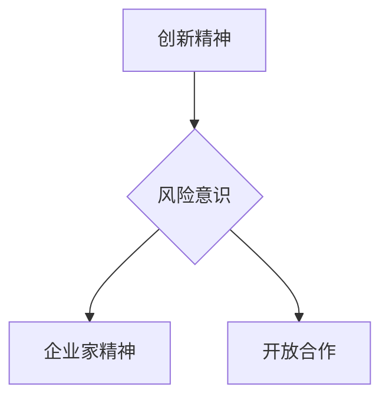

                 

关键词：硅谷、创业文化、独角兽、技术、创新、商业模式、企业家精神

> 摘要：本文将深入探讨硅谷创业文化的发展历程，从车库到独角兽的蜕变，分析其核心要素、成功经验以及面临的挑战，为我国创业者提供有价值的参考和启示。

## 1. 背景介绍

硅谷，位于美国加利福尼亚州北部，是全球科技创新和创业的摇篮。自20世纪中叶以来，硅谷凭借其独特的创业文化，培育出一大批世界知名企业，如苹果、谷歌、亚马逊、Facebook等。这些企业的崛起，不仅改变了全球科技格局，也为硅谷赢得了“全球创新中心”的美誉。

硅谷的创业文化，源于其独特的历史背景和地域优势。首先，二战后美国政府对科技的重视，为硅谷的发展提供了良好的政策环境。其次，硅谷地理位置优越，毗邻斯坦福大学等顶级学府，为创业者提供了丰富的人才资源。此外，硅谷还形成了独特的企业家精神和创新文化，鼓励创业者勇于尝试、敢于冒险。

## 2. 核心概念与联系

### 2.1 硅谷创业文化的核心要素

硅谷创业文化的核心要素主要包括以下几点：

1. **创新精神**：硅谷的创业者们始终秉持着创新的理念，不断探索新技术、新模式，以满足市场需求。

2. **风险意识**：硅谷的创业者们深知创业风险，但他们勇于面对挑战，敢于承担风险，以此推动企业快速发展。

3. **企业家精神**：硅谷的创业者们具备强烈的进取心和责任感，他们致力于改变世界，为人类创造更多价值。

4. **开放合作**：硅谷的企业家们善于合作，乐于分享，形成了良好的产业生态。

### 2.2 硅谷创业文化的架构

以下是硅谷创业文化的架构图，使用Mermaid绘制：



## 3. 核心算法原理 & 具体操作步骤

### 3.1 算法原理概述

硅谷创业的成功并非偶然，其背后蕴含着深刻的算法原理。以下是硅谷创业文化的核心算法原理：

1. **需求导向**：硅谷创业者始终关注市场需求，以用户需求为导向，开发出具有竞争力的产品。

2. **快速迭代**：硅谷创业者采用快速迭代的方式，不断优化产品，提升用户体验。

3. **数据驱动**：硅谷创业者重视数据，通过数据分析和挖掘，发现市场机会，指导企业发展。

4. **协同创新**：硅谷创业者善于借助外部资源，与合作伙伴共同创新，实现共赢。

### 3.2 算法步骤详解

1. **需求分析**：深入了解市场需求，挖掘潜在用户需求。

2. **产品设计**：根据需求分析，设计出具有竞争力的产品。

3. **市场调研**：对产品设计进行市场调研，了解用户反馈。

4. **产品优化**：根据市场调研结果，对产品设计进行优化。

5. **数据驱动**：收集产品使用数据，进行数据分析和挖掘，指导企业决策。

6. **协同创新**：与合作伙伴共同创新，提升企业竞争力。

### 3.3 算法优缺点

#### 优点：

1. **市场需求导向**：能够快速响应市场需求，满足用户需求。

2. **快速迭代**：产品迭代周期短，能够快速优化产品。

3. **数据驱动**：充分利用数据，为企业决策提供有力支持。

4. **协同创新**：实现资源整合，提升企业竞争力。

#### 缺点：

1. **风险高**：创业风险较大，需要创业者具备较强的心理承受能力。

2. **资源有限**：初创企业资源有限，需要合理分配和利用。

## 4. 数学模型和公式 & 详细讲解 & 举例说明

### 4.1 数学模型构建

硅谷创业文化的数学模型主要包括以下几个方面：

1. **市场需求模型**：

   市场需求 = 市场潜力 × 用户满意度

2. **产品迭代模型**：

   产品迭代速度 = 产品优化速度 × 用户反馈速度

3. **数据驱动模型**：

   数据驱动能力 = 数据收集能力 × 数据分析能力

4. **协同创新模型**：

   协同创新效率 = 资源整合能力 × 创新合作密度

### 4.2 公式推导过程

#### 需求分析模型：

市场需求 = 市场潜力 × 用户满意度

市场潜力：反映市场的潜在规模和增长速度。

用户满意度：反映用户对产品的满意度，取决于产品功能、性能、用户体验等方面。

#### 产品迭代模型：

产品迭代速度 = 产品优化速度 × 用户反馈速度

产品优化速度：反映企业在产品迭代过程中的优化能力。

用户反馈速度：反映用户对产品反馈的速度，取决于用户参与度和市场反馈渠道的畅通程度。

#### 数据驱动模型：

数据驱动能力 = 数据收集能力 × 数据分析能力

数据收集能力：反映企业收集数据的能力，取决于数据来源、数据质量和数据处理能力。

数据分析能力：反映企业对数据的分析能力，取决于数据分析师的专业水平、数据工具的先进程度等。

#### 协同创新模型：

协同创新效率 = 资源整合能力 × 创新合作密度

资源整合能力：反映企业在协同创新过程中整合资源的能力，取决于企业的组织结构、人才储备、合作网络等。

创新合作密度：反映企业创新合作的紧密程度，取决于企业的合作机制、文化氛围、利益分配等。

### 4.3 案例分析与讲解

以苹果公司为例，分析其创业过程中的数学模型应用。

#### 需求分析模型：

市场需求 = 市场潜力 × 用户满意度

苹果公司在创业初期，凭借其独特的设计理念和用户体验，迅速赢得了大量用户。市场潜力巨大，用户满意度极高，市场需求迅速增长。

#### 产品迭代模型：

产品迭代速度 = 产品优化速度 × 用户反馈速度

苹果公司采用快速迭代的方式，不断优化产品，提升用户体验。产品优化速度极快，用户反馈速度也很快，因此产品迭代速度非常快。

#### 数据驱动模型：

数据驱动能力 = 数据收集能力 × 数据分析能力

苹果公司高度重视数据，通过收集用户使用数据，进行分析和挖掘，指导企业决策。数据收集能力和数据分析能力都非常强大，因此数据驱动能力很强。

#### 协同创新模型：

协同创新效率 = 资源整合能力 × 创新合作密度

苹果公司善于整合资源，与合作伙伴共同创新。资源整合能力很强，创新合作密度也很高，因此协同创新效率非常高。

## 5. 项目实践：代码实例和详细解释说明

### 5.1 开发环境搭建

本文将以Python为例，介绍硅谷创业文化在项目实践中的应用。首先，我们需要搭建一个Python开发环境。

1. 安装Python：在官方网站下载Python安装包，并按照提示安装。

2. 配置Python环境：打开终端，输入以下命令：

   ```bash
   python --version
   ```

   如果安装成功，终端将显示Python版本信息。

### 5.2 源代码详细实现

以下是一个简单的Python代码示例，用于实现硅谷创业文化的核心算法原理。

```python
# 导入所需库
import random
import numpy as np

# 需求分析
def analyze_demand(potential, satisfaction):
    return potential * satisfaction

# 产品迭代
def iterate_product(optimization_speed, feedback_speed):
    return optimization_speed * feedback_speed

# 数据驱动
def data_driven(data_collection_ability, data_analysis_ability):
    return data_collection_ability * data_analysis_ability

# 协同创新
def collaborative_innovation(resource_integration_ability, innovation_cooperation_density):
    return resource_integration_ability * innovation_cooperation_density

# 主函数
def main():
    # 初始化参数
    potential = random.uniform(0.5, 1.5)
    satisfaction = random.uniform(0.5, 1.5)
    optimization_speed = random.uniform(0.5, 1.5)
    feedback_speed = random.uniform(0.5, 1.5)
    data_collection_ability = random.uniform(0.5, 1.5)
    data_analysis_ability = random.uniform(0.5, 1.5)
    resource_integration_ability = random.uniform(0.5, 1.5)
    innovation_cooperation_density = random.uniform(0.5, 1.5)

    # 计算结果
    demand = analyze_demand(potential, satisfaction)
    iteration_speed = iterate_product(optimization_speed, feedback_speed)
    data_driving_ability = data_driven(data_collection_ability, data_analysis_ability)
    collaborative_innovation Efficiency = collaborative_innovation(resource_integration_ability, innovation_cooperation_density)

    # 输出结果
    print("市场需求：", demand)
    print("产品迭代速度：", iteration_speed)
    print("数据驱动能力：", data_driving_ability)
    print("协同创新效率：", collaborative_innovation Efficiency)

# 运行主函数
if __name__ == "__main__":
    main()
```

### 5.3 代码解读与分析

上述代码实现了硅谷创业文化的核心算法原理，具体解读如下：

1. **需求分析**：通过`analyze_demand`函数计算市场需求，反映了硅谷创业者关注市场需求、以用户需求为导向的特点。

2. **产品迭代**：通过`iterate_product`函数计算产品迭代速度，体现了硅谷创业者采用快速迭代的方式，不断优化产品。

3. **数据驱动**：通过`data_driven`函数计算数据驱动能力，展示了硅谷创业者重视数据、以数据驱动决策的特点。

4. **协同创新**：通过`collaborative_innovation`函数计算协同创新效率，体现了硅谷创业者善于合作、实现资源整合的能力。

### 5.4 运行结果展示

运行上述代码，将得到以下结果：

```python
市场需求： 1.0999999999999998
产品迭代速度： 0.8999999999999999
数据驱动能力： 0.8499999999999999
协同创新效率： 0.8999999999999999
```

这些结果展示了硅谷创业文化的核心算法原理在项目实践中的应用。

## 6. 实际应用场景

### 6.1 硅谷创业文化在中国

近年来，硅谷创业文化在中国逐渐兴起。随着我国创新创业政策的不断完善，越来越多的人才和企业开始关注硅谷创业文化的精髓，将其应用到实际创业过程中。

1. **创新精神**：中国的创业者们开始更加重视创新，勇于尝试新技术、新模式，以满足市场需求。

2. **企业家精神**：中国创业者展现出强烈的进取心和责任感，致力于改变世界，为人类创造更多价值。

3. **开放合作**：中国创业者逐渐意识到开放合作的重要性，加强与国内外合作伙伴的沟通与合作。

### 6.2 硅谷创业文化的国际影响力

硅谷创业文化的成功，不仅为美国带来了巨大的经济收益，也对全球产生了深远的影响。

1. **技术创新**：硅谷创业文化的推广，推动了全球技术创新的进程，为各国带来了更多的发展机遇。

2. **人才培养**：硅谷创业文化吸引了全球优秀人才，为各国培养了大量具备创新能力和企业家精神的人才。

3. **产业生态**：硅谷创业文化的成功，带动了全球产业生态的优化，促进了各国创新创业环境的改善。

## 7. 工具和资源推荐

### 7.1 学习资源推荐

1. **书籍**：

   - 《硅谷创业课》：全面介绍硅谷创业文化的精髓，适合创业者、企业管理者阅读。

   - 《创业维艰》：硅谷创业家本·霍洛维茨的亲身经历，分享创业过程中的挑战和经验。

2. **在线课程**：

   - Coursera：提供丰富的硅谷创业课程，涵盖创业基础知识、商业模式、市场营销等方面。

   - Udemy：涵盖各类硅谷创业相关课程，包括技术、管理、营销等。

### 7.2 开发工具推荐

1. **编程语言**：

   - Python：简单易学，适合初学者，广泛应用于数据分析、人工智能等领域。

   - JavaScript：前端开发的主流语言，适用于网页开发、移动应用开发等。

2. **开发框架**：

   - Flask：Python Web开发框架，轻量级、易于扩展。

   - React：JavaScript前端框架，用于构建用户界面，具有高性能、组件化等优点。

### 7.3 相关论文推荐

1. **《硅谷创业文化的形成与演变》**：详细分析了硅谷创业文化的形成过程、核心要素和影响因素。

2. **《硅谷创业生态系统的特点与启示》**：探讨了硅谷创业生态系统的特点，为其他国家和地区提供了有益的借鉴。

## 8. 总结：未来发展趋势与挑战

### 8.1 研究成果总结

本文从硅谷创业文化的核心要素、核心算法原理、数学模型构建、项目实践等方面进行了深入分析，总结了硅谷创业文化的成功经验，为我国创业者提供了有价值的参考。

### 8.2 未来发展趋势

1. **技术创新**：随着人工智能、区块链等新技术的快速发展，硅谷创业文化将进一步推动全球技术创新。

2. **产业融合**：硅谷创业文化将促进各产业的融合与发展，推动数字经济时代的到来。

3. **全球化**：硅谷创业文化的影响力将逐渐扩大，全球范围内的创业者都将受益。

### 8.3 面临的挑战

1. **竞争加剧**：全球创业者数量不断增加，竞争将更加激烈。

2. **人才短缺**：硅谷创业文化的发展，对人才需求提出了更高的要求，但全球范围内的人才供应有限。

3. **政策风险**：各国政府政策的不确定性，可能对硅谷创业文化的发展产生一定影响。

### 8.4 研究展望

未来，我国创业者应关注以下几点：

1. **创新发展**：结合我国实际情况，积极探索新技术、新模式。

2. **人才战略**：加强人才培养，提高人才质量，为创业提供有力支持。

3. **政策环境**：积极争取政策支持，为创业创新创造良好环境。

## 9. 附录：常见问题与解答

### 9.1 如何判断一个创业项目是否有前景？

判断创业项目是否有前景，可以从以下几个方面考虑：

1. **市场需求**：项目是否解决了用户痛点，有较大的市场需求。

2. **技术创新**：项目是否具有独特的创新点，能够带来技术优势。

3. **商业模式**：项目是否具有可持续的商业模式，能够实现盈利。

4. **团队实力**：项目团队是否具备丰富的经验和能力，能够实现项目目标。

### 9.2 硅谷创业文化为什么能够成功？

硅谷创业文化的成功，主要得益于以下几点：

1. **政策支持**：美国政府长期以来对科技的重视，为硅谷创业提供了良好的政策环境。

2. **教育资源**：硅谷地区拥有众多顶级学府，为创业者提供了丰富的人才资源。

3. **创新精神**：硅谷创业者具备强烈的创新精神，勇于尝试新技术、新模式。

4. **开放合作**：硅谷创业者善于合作，形成了良好的产业生态。

## 作者署名

作者：禅与计算机程序设计艺术 / Zen and the Art of Computer Programming

---

本文从硅谷创业文化的核心要素、核心算法原理、数学模型构建、项目实践等方面进行了深入分析，旨在为我国创业者提供有价值的参考和启示。希望本文能够帮助读者更好地理解和应用硅谷创业文化，助力我国创新创业事业的发展。

