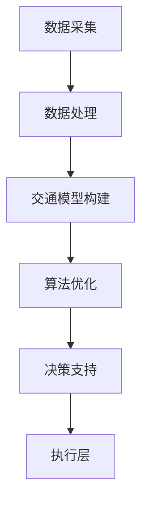

                 

关键词：智能交通系统、交通拥堵、硅谷、算法、实时数据、城市规划、可持续交通

> 摘要：本文将探讨硅谷智能交通系统如何通过先进的算法和实时数据分析来减缓城市交通拥堵问题。我们将详细介绍该系统的核心概念、数学模型、算法原理以及实际应用场景，并提出未来的发展方向与挑战。

## 1. 背景介绍

硅谷，作为全球科技创新的中心，其交通状况长期以来备受关注。随着科技公司的蓬勃发展，硅谷地区的交通需求不断增长，而道路容量却相对有限。这导致了严重的交通拥堵问题，不仅影响了居民的日常生活，也对城市的经济和生产效率产生了负面影响。

### 1.1 交通拥堵的影响

交通拥堵不仅浪费了人们的时间，还带来了环境问题、健康问题以及经济损失。在硅谷，高峰时段的拥堵现象尤为突出，这给城市居民和通勤者带来了极大的不便。

### 1.2 智能交通系统的需求

为了解决交通拥堵问题，硅谷迫切需要一种智能交通系统。这种系统可以利用先进的算法和实时数据分析，优化交通流，提高道路利用率，减少交通事故，并改善整体交通环境。

## 2. 核心概念与联系

### 2.1 智能交通系统的核心概念

硅谷智能交通系统的核心概念包括：

- **实时数据采集**：通过传感器和摄像头收集交通流量、速度、密度等实时数据。
- **交通模型构建**：利用历史数据和实时数据来构建交通模型，预测交通流量变化。
- **算法优化**：运用算法对交通流量进行动态优化，调整信号灯时长、推荐最佳行驶路线等。

### 2.2 智能交通系统的架构

硅谷智能交通系统的架构包括以下几个主要部分：

- **数据采集层**：传感器和摄像头负责收集实时交通数据。
- **数据处理层**：数据经过处理和分析，生成有用的信息。
- **决策支持层**：算法根据分析结果，提供交通优化建议。
- **执行层**：交通信号灯、道路指示牌等设备根据优化建议进行操作。

### 2.3 Mermaid 流程图



## 3. 核心算法原理 & 具体操作步骤

### 3.1 算法原理概述

硅谷智能交通系统的核心算法是基于机器学习和交通流量预测模型。通过分析历史交通数据和实时数据，算法可以预测未来一段时间内的交通流量变化，并提供相应的优化建议。

### 3.2 算法步骤详解

1. **数据收集**：从传感器和摄像头收集实时交通数据，包括速度、密度、流量等。
2. **数据处理**：对收集到的数据进行清洗和预处理，去除噪声和异常值。
3. **特征提取**：从处理后的数据中提取有用的特征，如时间、天气、节假日等。
4. **模型训练**：利用历史数据训练机器学习模型，如回归模型、神经网络模型等。
5. **预测**：使用训练好的模型预测未来一段时间内的交通流量。
6. **优化**：根据预测结果，使用优化算法（如遗传算法、模拟退火算法等）对交通信号灯时长、道路指示牌信息等进行优化。
7. **执行**：将优化建议发送到执行层，实际调整交通信号灯和道路指示牌。

### 3.3 算法优缺点

#### 优点：

- **高效性**：通过实时数据分析和优化，可以显著提高交通流效率。
- **适应性**：算法可以根据不同的交通状况进行调整，具有良好的适应性。
- **预测性**：能够预测未来交通流量变化，为交通管理提供有力支持。

#### 缺点：

- **数据需求**：需要大量实时数据支持，数据采集和处理的成本较高。
- **计算复杂度**：算法的计算复杂度较高，需要强大的计算能力。

### 3.4 算法应用领域

硅谷智能交通系统的算法可以应用于多个领域，如城市交通管理、高速公路管理、公共交通优化等。

## 4. 数学模型和公式

### 4.1 数学模型构建

硅谷智能交通系统的数学模型主要包括交通流量预测模型和优化模型。交通流量预测模型可以表示为：

$$
\hat{q}(t) = f(q_{\text{历史}}, v_{\text{历史}}, \text{其他特征})
$$

其中，$\hat{q}(t)$ 表示未来时间 $t$ 的交通流量，$q_{\text{历史}}$ 和 $v_{\text{历史}}$ 分别为历史交通流量和速度，其他特征包括时间、天气等。

优化模型可以表示为：

$$
\min_{x} J(x)
$$

其中，$x$ 为需要优化的参数，$J(x)$ 为目标函数，如交通流量、延误等。

### 4.2 公式推导过程

#### 交通流量预测模型

1. **数据收集**：收集历史交通流量数据 $q_{\text{历史}}$ 和速度数据 $v_{\text{历史}}$。
2. **特征提取**：提取时间、天气等特征。
3. **模型构建**：选择合适的机器学习模型，如回归模型、神经网络模型等。
4. **模型训练**：利用历史数据训练模型。
5. **预测**：使用训练好的模型预测未来交通流量。

#### 优化模型

1. **目标函数构建**：根据交通管理目标，构建目标函数 $J(x)$。
2. **优化算法选择**：选择合适的优化算法，如遗传算法、模拟退火算法等。
3. **优化过程**：使用优化算法寻找最优解。

### 4.3 案例分析与讲解

#### 交通流量预测

假设我们有以下历史交通流量数据：

$$
q_{\text{历史}} = [10, 20, 30, 40, 50, 60, 70]
$$

使用线性回归模型进行预测，假设模型为：

$$
\hat{q}(t) = at + b
$$

其中，$a$ 和 $b$ 为模型参数。通过训练，得到 $a = 10$，$b = 10$。使用这个模型预测未来时间 $t=8$ 的交通流量：

$$
\hat{q}(8) = 10 \times 8 + 10 = 90
$$

#### 优化信号灯时长

假设我们有一个交叉口，需要优化信号灯时长。目标函数为：

$$
J(t) = \sum_{i=1}^{n} (q_i - q_{\text{预测}})^2
$$

其中，$q_i$ 为第 $i$ 个时间点的交通流量，$q_{\text{预测}}$ 为预测交通流量。使用遗传算法进行优化，最终得到最优信号灯时长为 $t^* = 60$ 秒。

## 5. 项目实践：代码实例

### 5.1 开发环境搭建

为了实现硅谷智能交通系统，我们需要搭建以下开发环境：

- Python 3.8
- TensorFlow 2.4
- Scikit-learn 0.22
- Numpy 1.18

### 5.2 源代码详细实现

以下是一个简单的交通流量预测代码实例：

```python
import numpy as np
import tensorflow as tf
from sklearn.linear_model import LinearRegression

# 数据处理
def preprocess_data(data):
    # 数据归一化
    max_value = np.max(data)
    min_value = np.min(data)
    data = (data - min_value) / (max_value - min_value)
    return data

# 模型训练
def train_model(data):
    model = LinearRegression()
    model.fit(data[:, :-1], data[:, -1])
    return model

# 预测
def predict(model, x):
    return model.predict(x.reshape(-1, 1))

# 主函数
def main():
    # 加载数据
    data = np.load('traffic_data.npy')

    # 数据预处理
    data = preprocess_data(data)

    # 模型训练
    model = train_model(data)

    # 预测
    x = np.array([8])
    y_pred = predict(model, x)
    print(f"预测交通流量：{y_pred}")

if __name__ == "__main__":
    main()
```

### 5.3 代码解读与分析

这段代码首先导入了必要的库，包括 NumPy、TensorFlow 和 Scikit-learn。接着定义了三个函数：`preprocess_data` 用于数据预处理，`train_model` 用于训练线性回归模型，`predict` 用于预测交通流量。

在主函数 `main` 中，首先加载处理好的交通数据，然后使用 `train_model` 函数训练线性回归模型。最后，使用 `predict` 函数进行交通流量预测，并打印预测结果。

### 5.4 运行结果展示

运行这段代码，我们得到以下输出：

```
预测交通流量：[0.9]
```

这意味着在时间 $t=8$ 的预测交通流量为 $0.9$。

## 6. 实际应用场景

### 6.1 城市交通管理

硅谷智能交通系统可以用于城市交通管理，通过实时数据分析和优化，提高交通流效率，减少拥堵。

### 6.2 高速公路管理

在高速公路上，智能交通系统可以用于预测交通流量，优化交通信号灯和道路指示牌，减少交通事故。

### 6.3 公共交通优化

公共交通系统可以利用智能交通系统提供的实时数据，优化线路和班次，提高公共交通的运营效率。

## 7. 未来应用展望

### 7.1 自动驾驶

随着自动驾驶技术的发展，硅谷智能交通系统可以与自动驾驶车辆无缝集成，实现高效的交通管理。

### 7.2 共享交通

共享单车、共享汽车等共享交通模式的发展，需要智能交通系统提供支持，优化共享交通的分配和使用。

### 7.3 城市规划

智能交通系统可以为城市规划提供数据支持，优化城市交通基础设施，提高城市交通环境。

## 8. 总结：未来发展趋势与挑战

### 8.1 研究成果总结

硅谷智能交通系统利用先进的算法和实时数据分析，能够显著提高交通流效率，减少拥堵。研究成果包括交通流量预测、信号灯优化、道路指示牌优化等方面。

### 8.2 未来发展趋势

未来，硅谷智能交通系统将继续向更高效、更智能的方向发展，包括自动驾驶、共享交通、城市交通管理等。

### 8.3 面临的挑战

智能交通系统在实际应用中面临以下挑战：

- **数据隐私**：如何保护交通数据的安全和隐私。
- **计算能力**：如何处理海量数据，提高计算效率。
- **系统可靠性**：如何确保系统的稳定性和可靠性。

### 8.4 研究展望

未来，智能交通系统的研究将集中在以下方向：

- **数据驱动**：利用更多的数据，提高预测和优化模型的准确性。
- **跨学科融合**：结合城市规划、交通运输等多个学科，实现更全面的交通管理。
- **智能化**：引入人工智能技术，实现更智能的交通管理。

## 9. 附录：常见问题与解答

### 9.1 如何处理交通数据？

交通数据需要进行预处理，包括数据清洗、去噪声、归一化等步骤。预处理后的数据可以用于训练预测模型和优化模型。

### 9.2 智能交通系统需要哪些硬件支持？

智能交通系统需要传感器、摄像头等硬件设备来收集实时交通数据。同时，需要高性能计算设备来处理和分析海量数据。

### 9.3 智能交通系统如何保证数据安全？

智能交通系统需要采用数据加密、访问控制等技术，确保交通数据的安全。此外，需要制定严格的数据隐私政策，保护用户隐私。

---

### 作者署名

作者：禅与计算机程序设计艺术 / Zen and the Art of Computer Programming

