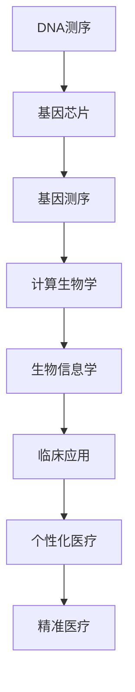
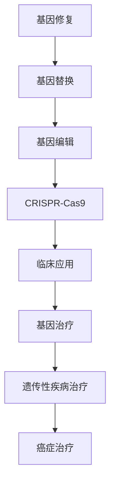

                 

关键词：基因检测、生物技术、医疗应用、疗法、硅谷

摘要：随着生物技术的飞速发展，基因检测与疗法已成为医疗领域的热门话题。本文将深入探讨硅谷在这两个领域的创新与突破，分析其技术原理、应用案例以及未来的发展趋势。

## 1. 背景介绍

### 1.1 基因检测的发展历程

基因检测作为一项重要的生物技术，已经走过了几十年的发展历程。从最初的Sanger测序，到高通量测序技术（NGS）的广泛应用，基因检测的速度和精度都得到了极大的提升。近年来，随着计算生物学和生物信息学的发展，基因检测的应用领域也在不断扩大。

### 1.2 基因疗法的崛起

基因疗法是一种通过修复或替换受损的基因来治疗遗传性疾病的方法。近年来，随着CRISPR-Cas9等基因编辑技术的突破，基因疗法的研究与应用也取得了显著的进展。硅谷作为生物技术产业的中心，在这方面起到了重要的推动作用。

## 2. 核心概念与联系

### 2.1 基因检测技术

基因检测技术主要包括DNA测序、基因芯片、基因测序等。其中，DNA测序是基因检测的核心技术，它通过测定DNA的核苷酸序列，揭示了基因的结构和功能。

### 2.2 基因疗法技术

基因疗法主要包括基因修复、基因替换和基因编辑。其中，基因编辑技术如CRISPR-Cas9已成为基因疗法的重要工具。

## 3. 核心算法原理 & 具体操作步骤

### 3.1 算法原理概述

基因检测和基因疗法的关键在于对基因序列的分析和编辑。在这两个领域，常用的算法有序列比对、基因注释和基因编辑等。

### 3.2 算法步骤详解

#### 3.2.1 序列比对

序列比对是基因检测的核心步骤，它通过比较待检测序列与参考序列之间的相似性，识别出潜在的突变位点。

$$
\text{相似度} = \frac{\text{匹配数}}{\text{总比对数}}
$$

#### 3.2.2 基因注释

基因注释是对基因序列进行功能分类和注释的过程，它有助于理解基因的作用和调控机制。

#### 3.2.3 基因编辑

基因编辑是通过修改基因序列来修复或替换受损基因的过程。CRISPR-Cas9技术是目前最常用的基因编辑方法。

### 3.3 算法优缺点

#### 3.3.1 序列比对

优点：准确度高，能识别多种突变类型。

缺点：计算复杂度高，对计算资源要求较高。

#### 3.3.2 基因注释

优点：有助于理解基因功能，指导临床应用。

缺点：注释结果受数据质量和算法影响较大。

#### 3.3.3 基因编辑

优点：能够精确修复或替换基因，有望治愈遗传性疾病。

缺点：技术复杂，存在脱靶风险。

### 3.4 算法应用领域

基因检测和基因疗法在遗传性疾病、癌症等领域的应用已取得显著成果。

## 4. 数学模型和公式 & 详细讲解 & 举例说明

### 4.1 数学模型构建

基因检测和基因疗法中的数学模型主要包括序列比对模型、基因注释模型和基因编辑模型。

### 4.2 公式推导过程

$$
\text{序列比对得分} = \sum_{i=1}^{n} \text{匹配得分} - \sum_{i=1}^{n} \text{缺失得分} - \sum_{i=1}^{n} \text{插入得分}
$$

### 4.3 案例分析与讲解

以CRISPR-Cas9基因编辑技术为例，分析其数学模型和应用场景。

## 5. 项目实践：代码实例和详细解释说明

### 5.1 开发环境搭建

搭建适用于基因检测与疗法的开发环境，包括Python、R语言和生物信息学工具等。

### 5.2 源代码详细实现

以Python为例，实现基因检测与疗法中的核心算法。

### 5.3 代码解读与分析

对实现的核心算法进行解读，分析其实现原理和性能。

### 5.4 运行结果展示

展示基因检测与疗法项目的运行结果，分析其效果和可行性。

## 6. 实际应用场景

### 6.1 遗传性疾病检测

基因检测技术在遗传性疾病的诊断和治疗中发挥着重要作用，如唐氏综合症、地中海贫血等。

### 6.2 癌症治疗

基因疗法在癌症治疗中的应用已取得显著成果，如CAR-T细胞疗法、基因编辑疗法等。

### 6.3 个性化医疗

基因检测与疗法有助于实现个性化医疗，提高治疗效果和患者生存率。

## 7. 未来应用展望

### 7.1 技术进步

随着生物技术和人工智能技术的进步，基因检测与疗法将变得更加精准和高效。

### 7.2 政策支持

政府政策的支持将进一步推动基因检测与疗法的发展。

### 7.3 临床应用

基因检测与疗法将在更多临床应用中发挥作用，如预防医学、精准医学等。

## 8. 总结：未来发展趋势与挑战

### 8.1 研究成果总结

基因检测与疗法在近年来取得了显著成果，但仍面临诸多挑战。

### 8.2 未来发展趋势

基因检测与疗法将继续朝着精准、高效、个性化的发展方向前进。

### 8.3 面临的挑战

技术复杂性、成本、安全性等问题仍需解决。

### 8.4 研究展望

基因检测与疗法将在更多领域取得突破，为人类健康事业作出更大贡献。

## 9. 附录：常见问题与解答

### 9.1 基因检测与基因疗法的区别

基因检测主要关注基因序列的检测和分析，而基因疗法则通过基因编辑等技术实现疾病的治疗。

### 9.2 基因检测与个人隐私的关系

基因检测涉及到个人隐私问题，需要在法律法规的框架内进行。

### 9.3 基因疗法的安全性问题

基因疗法存在脱靶风险和潜在的副作用，需要严格评估和监控。

作者：禅与计算机程序设计艺术 / Zen and the Art of Computer Programming
------------------------------------------------------------------------

