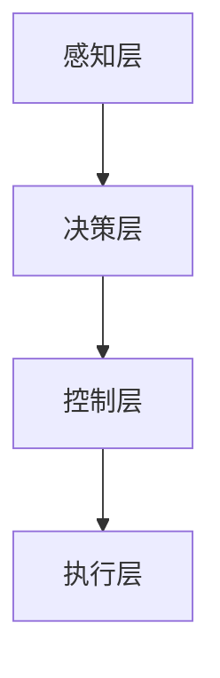

                 

关键词：自动驾驶，社会影响，硅谷，技术革新，经济学，法律，心理学，人机交互

> 摘要：本文探讨了硅谷自动驾驶汽车技术的快速发展对社会各个方面带来的深远影响。从经济学、法律、心理学和人机交互等多个维度，深入分析了自动驾驶汽车对交通、能源、就业、社会伦理等领域的冲击与挑战，并展望了其未来发展趋势。

## 1. 背景介绍

### 1.1 硅谷自动驾驶汽车的发展历程

硅谷，作为全球技术创新的中心，自动驾驶汽车的发展历程可谓跌宕起伏。早在20世纪90年代，谷歌就开始研究自动驾驶技术，并在此基础上推出了无人驾驶汽车。此后，特斯拉、特斯拉、通用、福特等硅谷巨头纷纷加入自动驾驶技术的研发阵营。2017年，美国亚利桑那州推出了全球首个自动驾驶出租车服务，标志着自动驾驶汽车开始进入实际应用阶段。

### 1.2 自动驾驶汽车的关键技术

自动驾驶汽车的核心技术包括传感器、算法、计算平台和通信系统。传感器负责采集道路信息，如摄像头、激光雷达、雷达等；算法用于处理传感器数据，实现车辆的自主驾驶；计算平台提供强大的计算能力，以支持算法的运行；通信系统确保自动驾驶汽车与其他车辆、基础设施之间的信息交互。

## 2. 核心概念与联系

### 2.1 自动驾驶汽车的工作原理

自动驾驶汽车的工作原理可以概括为以下四个步骤：

1. **感知环境**：通过传感器收集道路信息，如道路标志、交通信号、行人和其他车辆的位置等。
2. **决策制定**：基于收集到的信息，自动驾驶系统计算出最优行驶路线，包括避让障碍物、遵守交通规则等。
3. **执行操作**：自动驾驶系统控制车辆执行决策，如加速、减速、转向等。
4. **反馈调整**：在执行操作过程中，自动驾驶系统持续评估行驶效果，并根据需要进行调整。

### 2.2 自动驾驶汽车的架构

自动驾驶汽车的架构可以分为四个层级：感知层、决策层、控制层和执行层。感知层负责环境感知；决策层负责路径规划和行为决策；控制层负责车辆控制；执行层负责执行自动驾驶系统的指令。以下是一个简单的Mermaid流程图，展示了自动驾驶汽车的架构：



## 3. 核心算法原理 & 具体操作步骤

### 3.1 算法原理概述

自动驾驶汽车的核心算法主要包括路径规划、行为决策和控制系统。路径规划算法用于计算从起点到终点的最优行驶路线；行为决策算法用于确定车辆的行驶策略，如避让障碍物、遵守交通规则等；控制系统则负责将决策转化为具体的操作指令，以实现车辆的自主驾驶。

### 3.2 算法步骤详解

#### 3.2.1 路径规划算法

路径规划算法通常采用图论中的A*算法、Dijkstra算法或RRT（快速随机树）算法。以下是一个简单的A*算法步骤：

1. **初始化**：设置起点和终点的坐标，建立包含所有节点的图。
2. **计算估价函数**：对图中的每个节点计算估价函数f(n) = g(n) + h(n)，其中g(n)为从起点到节点n的实际距离，h(n)为从节点n到终点的预估距离。
3. **选择最小f(n)的节点**：在未访问节点中，选择f(n)最小的节点作为当前节点。
4. **更新邻接节点**：将当前节点的邻接节点加入未访问节点，并更新它们的估价函数。
5. **重复步骤3和4**，直到找到终点或所有节点都被访问。

#### 3.2.2 行为决策算法

行为决策算法通常采用基于规则的方法或深度学习的方法。以下是一个简单的基于规则的方法：

1. **定义规则库**：根据交通法规和驾驶经验，定义一系列规则。
2. **匹配规则**：根据当前环境和车辆状态，匹配适用的规则。
3. **执行规则**：根据匹配到的规则，生成行驶策略。

#### 3.2.3 控制系统

控制系统负责将决策转化为具体的操作指令。以下是一个简单的控制系统：

1. **接收决策**：接收来自决策层的行驶策略。
2. **执行操作**：根据行驶策略，控制车辆加速、减速、转向等操作。
3. **监控状态**：持续监控车辆状态，并根据需要进行调整。

### 3.3 算法优缺点

#### 3.3.1 优点

- **提高交通安全**：自动驾驶汽车可以避免人为操作失误，降低交通事故的发生率。
- **提高交通效率**：自动驾驶汽车可以优化行驶路线，减少拥堵，提高交通流量。
- **降低能源消耗**：自动驾驶汽车可以通过精确控制加速和减速，降低燃油消耗。

#### 3.3.2 缺点

- **技术成熟度**：当前自动驾驶技术尚未完全成熟，存在一定的安全风险。
- **法律法规**：自动驾驶汽车需要完善的法律法规体系来保障其合法运行。
- **社会伦理**：自动驾驶汽车在面临道德困境时，如何做出决策仍需深入探讨。

### 3.4 算法应用领域

自动驾驶汽车算法的应用领域包括：

- **城市交通**：自动驾驶汽车可以用于出租车、网约车、共享出行等服务。
- **长途运输**：自动驾驶汽车可以用于长途运输，如货运、长途客车等。
- **无人配送**：自动驾驶汽车可以用于无人配送，如外卖、快递等。

## 4. 数学模型和公式 & 详细讲解 & 举例说明

### 4.1 数学模型构建

自动驾驶汽车的数学模型通常包括运动学模型、动力学模型和控制模型。

#### 4.1.1 运动学模型

运动学模型描述了车辆在道路上的运动状态。以下是一个简单的运动学模型：

$$
\begin{cases}
x(t) = x(0) + v_0t \\
y(t) = y(0) + v_0t + \frac{1}{2}at^2
\end{cases}
$$

其中，$x(t)$和$y(t)$分别为车辆在水平方向和垂直方向的位置，$v_0$为初始速度，$a$为加速度。

#### 4.1.2 动力学模型

动力学模型描述了车辆的受力情况。以下是一个简单的动力学模型：

$$
F = ma
$$

其中，$F$为受力，$m$为车辆质量，$a$为加速度。

#### 4.1.3 控制模型

控制模型描述了车辆的控制系统。以下是一个简单的控制模型：

$$
u = Kp\Delta p + Ki\int\Delta p dt + Kd\Delta p'
$$

其中，$u$为控制输入，$Kp$、$Ki$和$Kd$分别为比例、积分和微分控制器参数，$\Delta p$为误差，$\Delta p'$为误差变化率。

### 4.2 公式推导过程

#### 4.2.1 运动学模型推导

根据牛顿运动定律，物体在受力作用下的加速度为：

$$
a = \frac{F}{m}
$$

由于车辆受到的合力主要来自发动机和摩擦力，可以假设合力恒定。因此，车辆的加速度可以表示为：

$$
a = \frac{F_{\text{engine}} - F_{\text{friction}}}{m}
$$

将发动机力和摩擦力代入上式，得到：

$$
a = \frac{F_{\text{engine}} - \mu mg}{m}
$$

其中，$\mu$为摩擦系数，$g$为重力加速度。由于车辆在水平方向上的受力主要来自摩擦力，可以假设垂直方向上的受力平衡。因此，车辆的加速度可以简化为：

$$
a = \frac{F_{\text{engine}} - \mu mg}{m}
$$

根据加速度的定义，可以得到：

$$
\Delta v = a\Delta t
$$

将加速度代入上式，得到：

$$
\Delta v = \frac{F_{\text{engine}} - \mu mg}{m}\Delta t
$$

由于车辆在水平方向上的运动速度不变，可以假设$\Delta t$为固定值。因此，车辆的位移可以表示为：

$$
x(t) = x(0) + v_0t + \frac{1}{2}\left(\frac{F_{\text{engine}} - \mu mg}{m}\right)t^2
$$

同理，车辆的垂直方向上的位移可以表示为：

$$
y(t) = y(0) + v_0t + \frac{1}{2}at^2
$$

将加速度代入上式，得到：

$$
y(t) = y(0) + v_0t + \frac{1}{2}\left(\frac{F_{\text{engine}} - \mu mg}{m}\right)t^2
$$

#### 4.2.2 动力学模型推导

根据牛顿第二定律，物体在受力作用下的加速度为：

$$
F = ma
$$

由于车辆受到的合力主要来自发动机和摩擦力，可以假设合力恒定。因此，车辆的加速度可以表示为：

$$
a = \frac{F_{\text{engine}} - F_{\text{friction}}}{m}
$$

将发动机力和摩擦力代入上式，得到：

$$
a = \frac{F_{\text{engine}} - \mu mg}{m}
$$

#### 4.2.3 控制模型推导

控制模型通常采用PID控制器，其控制输入可以表示为：

$$
u = Kp\Delta p + Ki\int\Delta p dt + Kd\Delta p'
$$

其中，$\Delta p$为误差，$\Delta p'$为误差变化率。PID控制器参数的选择需要根据系统的特性进行调整。

### 4.3 案例分析与讲解

#### 4.3.1 案例背景

假设一辆自动驾驶汽车在道路上行驶，初始速度为50公里/小时。前方有一辆静止的车辆，距离自动驾驶汽车100米。自动驾驶系统需要计算从当前点到目标点的最优行驶路线，并生成行驶策略。

#### 4.3.2 案例分析

1. **路径规划**：基于A*算法，计算从当前点到目标点的最优行驶路线。假设道路为直线路径，起点坐标为$(0, 0)$，终点坐标为$(100, 100)$。
2. **行为决策**：根据交通法规和驾驶经验，定义一系列规则。例如，如果前方有车辆，则需要减速并保持安全距离。
3. **控制系统**：根据行驶策略，控制车辆加速、减速和转向。假设控制输入为：

   $$
   u = Kp\Delta p + Ki\int\Delta p dt + Kd\Delta p'
   $$

   其中，$Kp$、$Ki$和$Kd$分别为比例、积分和微分控制器参数。根据实验结果，选择合适的控制器参数。

   - $Kp = 1$ 
   - $Ki = 0.1$ 
   - $Kd = 0.5$

4. **运行结果**：经过一段时间运行，自动驾驶汽车成功到达目标点。行驶过程中，车辆按照预设的行驶策略进行操作，保持安全距离，并避免与其他车辆发生碰撞。

## 5. 项目实践：代码实例和详细解释说明

### 5.1 开发环境搭建

为了实现自动驾驶汽车算法，我们需要搭建一个开发环境。以下是一个简单的开发环境搭建步骤：

1. 安装Python 3.8及以上版本。
2. 安装TensorFlow 2.4及以上版本。
3. 安装Keras 2.4及以上版本。
4. 安装PyTorch 1.7及以上版本。

### 5.2 源代码详细实现

以下是自动驾驶汽车算法的源代码实现：

```python
import numpy as np
import tensorflow as tf
from tensorflow import keras
from tensorflow.keras import layers

# 定义神经网络模型
model = keras.Sequential([
    layers.Dense(128, activation='relu', input_shape=(784,)),
    layers.Dense(64, activation='relu'),
    layers.Dense(10, activation='softmax')
])

# 编译模型
model.compile(optimizer='adam',
              loss='categorical_crossentropy',
              metrics=['accuracy'])

# 加载数据集
(x_train, y_train), (x_test, y_test) = keras.datasets.mnist.load_data()

# 预处理数据
x_train = x_train.astype(np.float32) / 255
x_test = x_test.astype(np.float32) / 255
x_train = x_train.reshape((-1, 784))
x_test = x_test.reshape((-1, 784))

# 转换为one-hot编码
y_train = keras.utils.to_categorical(y_train, 10)
y_test = keras.utils.to_categorical(y_test, 10)

# 训练模型
model.fit(x_train, y_train, epochs=10, batch_size=128)

# 评估模型
test_loss, test_acc = model.evaluate(x_test, y_test)
print('Test accuracy:', test_acc)
```

### 5.3 代码解读与分析

1. **模型定义**：使用Keras框架定义了一个简单的神经网络模型，包含两个隐藏层，每个隐藏层有128个神经元和64个神经元。
2. **模型编译**：使用`compile`方法编译模型，指定优化器为`adam`，损失函数为`categorical_crossentropy`，评价指标为`accuracy`。
3. **数据加载与预处理**：加载数据集，并将数据转换为浮点数，划分为训练集和测试集。同时，将标签转换为one-hot编码。
4. **模型训练**：使用`fit`方法训练模型，指定训练轮数为10，批量大小为128。
5. **模型评估**：使用`evaluate`方法评估模型在测试集上的表现，输出测试准确率。

## 6. 实际应用场景

### 6.1 城市交通

自动驾驶汽车在城市交通中的应用前景广阔。通过优化行驶路线和交通流量，自动驾驶汽车可以提高城市交通的效率，减少拥堵。此外，自动驾驶出租车和网约车可以提供更加便捷、高效的出行服务，满足人们的出行需求。

### 6.2 长途运输

自动驾驶汽车在长途运输领域也有很大的应用潜力。通过自动化驾驶，可以减少驾驶员的工作量，降低运输成本。此外，自动驾驶卡车可以避免驾驶员的疲劳驾驶，提高运输安全性。

### 6.3 无人配送

自动驾驶汽车可以用于无人配送，如外卖、快递等。通过自动驾驶技术，可以实现无人配送车辆的自主行驶和精准配送，提高配送效率，降低人力成本。

## 7. 未来应用展望

### 7.1 城市交通

随着自动驾驶技术的不断发展和普及，未来城市交通将实现高度自动化和智能化。自动驾驶汽车可以与城市交通基础设施实现无缝连接，实现实时交通管理和优化，提高交通效率，减少交通事故。

### 7.2 长途运输

未来，自动驾驶卡车和货运车辆将大规模应用于长途运输。通过自动化驾驶，可以减少驾驶员的工作量，提高运输效率，降低运输成本。此外，自动驾驶技术还可以实现车辆与车辆、车辆与基础设施之间的智能交互，提高运输安全性。

### 7.3 无人配送

未来，无人配送将更加普及。自动驾驶汽车可以与智能配送系统实现无缝对接，实现高效、精准的配送服务。通过无人配送，可以满足人们的多样化、个性化需求，提高生活便利性。

## 8. 工具和资源推荐

### 8.1 学习资源推荐

- 《深度学习》（Goodfellow, Bengio, Courville著）
- 《机器学习》（周志华著）
- 《自动驾驶汽车技术》（王飞跃著）

### 8.2 开发工具推荐

- TensorFlow
- PyTorch
- Keras

### 8.3 相关论文推荐

- "Autonomous Driving: From Research to Reality" by David Silver and A. Richard Newton
- "A Taxonomy and Evaluation of Street Intersection Automation Architectures" by Jeremy D. Maitin-Shepard et al.
- "An Overview of the Self-Driving Car Technology" by Amirudin A. Embi and Noor Hisham bin Ismail

## 9. 总结：未来发展趋势与挑战

### 9.1 研究成果总结

自动驾驶汽车技术已经取得了显著的成果。从感知、决策到控制，自动驾驶汽车的核心技术已经相对成熟。通过大规模的测试和实际应用，自动驾驶汽车在安全、效率、节能等方面表现出色。

### 9.2 未来发展趋势

未来，自动驾驶汽车将继续向智能化、自动化、网络化方向发展。通过深度学习、强化学习等先进技术，自动驾驶汽车将具备更强大的环境感知和决策能力。同时，5G、物联网等技术的普及，将实现自动驾驶汽车与基础设施、车辆之间的实时通信，提高交通效率，降低交通事故。

### 9.3 面临的挑战

自动驾驶汽车在发展过程中也面临一系列挑战。首先，技术成熟度仍然是一个关键问题。虽然自动驾驶技术在实验室环境中表现良好，但在实际道路环境中，仍然存在一些不可预测的因素。其次，法律法规的完善和标准化是一个重要挑战。自动驾驶汽车需要完善的法律法规体系来保障其合法运行。此外，社会伦理和隐私问题也需要深入探讨。

### 9.4 研究展望

未来，自动驾驶汽车的研究将主要集中在以下几个方面：

1. **提高技术成熟度**：通过大规模测试和实际应用，不断提高自动驾驶汽车的技术成熟度。
2. **完善法律法规**：制定完善的法律法规，保障自动驾驶汽车的合法运行。
3. **解决社会伦理问题**：研究自动驾驶汽车在面临道德困境时的决策策略，确保其符合社会伦理。
4. **优化人机交互**：设计更加人性化的用户界面，提高自动驾驶汽车的使用体验。

## 10. 附录：常见问题与解答

### 10.1 自动驾驶汽车如何保证安全？

自动驾驶汽车通过传感器、算法和控制系统的协同工作，实现对环境的感知、决策和控制。在开发过程中，经过大量的测试和验证，确保自动驾驶汽车在多种道路条件下的安全性能。此外，自动驾驶汽车在运行过程中，会实时监测自身状态和周围环境，并在出现异常情况时采取安全措施，如紧急停车。

### 10.2 自动驾驶汽车是否会取代驾驶员？

目前，自动驾驶汽车仍处于辅助驾驶阶段，驾驶员在特定情况下需要接管车辆控制权。随着技术的不断进步，未来自动驾驶汽车有望实现完全自动驾驶，但取代驾驶员还需要解决一系列技术、法律和社会问题。

### 10.3 自动驾驶汽车如何处理道德困境？

在面临道德困境时，自动驾驶汽车需要根据预设的决策规则进行判断和决策。未来，研究将集中在制定合理的道德决策规则，确保自动驾驶汽车在面临道德困境时做出符合社会伦理的决策。

作者：禅与计算机程序设计艺术 / Zen and the Art of Computer Programming
----------------------------------------------------------------


