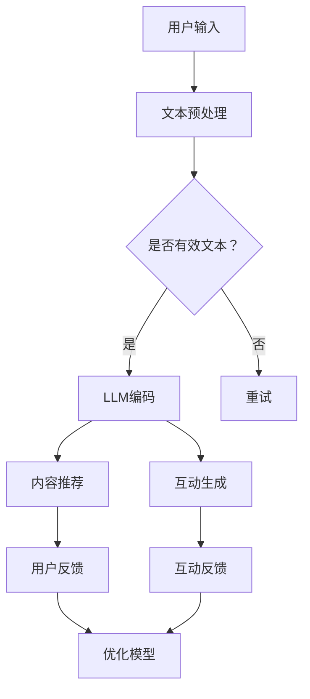

                 

社交媒体已经成为现代社会的核心组成部分，其影响力在全球范围内不断增长。随着用户基数的增加和内容的爆炸式增长，如何有效地推荐和互动成为了一个关键问题。幸运的是，大型语言模型（LLM）的出现为我们提供了一种强大的解决方案。

本文将探讨LLM在社交媒体内容推荐和互动中的革命性作用。我们将从背景介绍开始，了解LLM的基本概念和其与社交媒体的关联。随后，我们将深入探讨LLM的核心算法原理，详细解释其操作步骤和优缺点。接着，我们将展示数学模型和公式，并通过案例进行分析。文章的后半部分将聚焦于项目实践，提供代码实例和详细解释。最后，我们将探讨实际应用场景，推荐相关工具和资源，并对未来发展趋势和挑战进行展望。

> 关键词：社交媒体，LLM，内容推荐，互动，算法，数学模型，项目实践，工具推荐

> 摘要：本文深入探讨了大型语言模型（LLM）在社交媒体内容推荐和互动中的应用。通过分析LLM的核心算法原理和数学模型，结合实际项目实践，我们揭示了LLM如何提升内容推荐的准确性和互动性。本文旨在为读者提供对LLM在社交媒体领域的应用有全面了解的窗口。

## 1. 背景介绍

社交媒体的崛起标志着人际交流和信息传播方式的重大变革。从最初的Facebook到现在的Twitter、Instagram、微信等，社交媒体平台已经成为人们日常生活的重要组成部分。据统计，全球社交媒体用户已超过45亿，占总人口的比例超过一半。这一庞大的用户基数带来了海量数据，同时也对平台提出了更高的内容推荐和互动需求。

随着用户数量的增加，社交媒体平台面临着巨大的挑战。首先是如何处理海量的用户生成内容（UGC）。传统的推荐系统通常依赖于用户的历史行为数据，如浏览、点赞、评论等。然而，随着内容的多样化，仅凭历史数据难以满足用户的个性化需求。此外，用户互动的复杂性也增加了推荐系统的设计难度。例如，如何在用户之间建立有意义的互动，避免低质量内容的传播，都是亟待解决的问题。

正是在这种背景下，大型语言模型（LLM）应运而生。LLM是一种基于深度学习的自然语言处理（NLP）技术，能够处理和理解自然语言文本。与传统推荐系统不同，LLM不仅可以处理用户的显式行为数据，还可以通过分析用户的文本内容，捕捉其隐式意图和情感。这使得LLM在内容推荐和互动方面具有显著优势。

## 2. 核心概念与联系

### 2.1 大型语言模型（LLM）的概念

大型语言模型（LLM）是一种基于深度学习的自然语言处理（NLP）技术，能够对自然语言文本进行生成、理解和翻译。LLM的核心是一个巨大的神经网络，经过大量文本数据的训练，能够捕捉语言的复杂结构和语义。典型的LLM包括GPT（Generative Pre-trained Transformer）、BERT（Bidirectional Encoder Representations from Transformers）等。

### 2.2 社交媒体内容推荐和互动的需求

社交媒体平台的主要目标是提供个性化、高质量的内容和互动体验。为了实现这一目标，平台需要解决以下几个核心问题：

1. **内容推荐**：如何根据用户的兴趣和行为，推荐他们可能感兴趣的内容。
2. **互动**：如何促进用户之间的有效互动，建立社区氛围。
3. **内容质量**：如何过滤和抑制低质量、有害的内容。

### 2.3 LLM与社交媒体的关联

LLM在社交媒体中的应用主要体现在以下几个方面：

1. **内容推荐**：LLM可以分析用户的文本内容和行为，理解其兴趣和偏好，从而提供个性化的内容推荐。
2. **互动**：LLM可以生成有意义的回复和评论，促进用户之间的互动。
3. **内容质量**：LLM可以识别和过滤低质量、有害的内容，提高社交媒体的社区质量。

### 2.4 Mermaid 流程图

以下是LLM在社交媒体内容推荐和互动中的应用流程的Mermaid流程图：



### 2.5 LLM工作流程

1. **用户输入**：用户在社交媒体平台上产生的内容，如帖子、评论、私信等。
2. **文本预处理**：对输入文本进行清洗、分词、去停用词等处理，使其适合LLM模型。
3. **是否有效文本**：判断文本是否有效，有效文本进入下一步，否则重试。
4. **LLM编码**：将预处理后的文本输入到LLM模型，获取其语义编码。
5. **内容推荐**：根据LLM编码，为用户推荐可能感兴趣的内容。
6. **互动生成**：根据用户内容和LLM模型，生成有意义的回复和评论。
7. **用户反馈**：用户对推荐内容或互动回复进行反馈。
8. **优化模型**：根据用户反馈，优化LLM模型，提高推荐和互动质量。

## 3. 核心算法原理 & 具体操作步骤

### 3.1 算法原理概述

LLM在社交媒体内容推荐和互动中的应用主要基于以下核心原理：

1. **深度学习**：LLM是一种基于深度学习的模型，通过多层神经网络对大量文本数据进行训练，能够捕捉语言的复杂结构和语义。
2. **上下文理解**：LLM能够理解文本的上下文，从而生成与用户内容和兴趣高度相关的内容推荐和互动回复。
3. **自适应学习**：LLM可以根据用户的反馈不断优化模型，提高推荐和互动的准确性。

### 3.2 算法步骤详解

1. **数据收集与预处理**：
   - 收集社交媒体平台上的用户生成内容（UGC）和用户互动数据（如点赞、评论、私信等）。
   - 对数据进行清洗、分词、去停用词等预处理操作。

2. **模型训练**：
   - 使用预训练模型（如GPT、BERT）对预处理后的数据进行训练。
   - 训练过程中，模型将学习如何生成与用户兴趣和内容相关的文本。

3. **内容推荐**：
   - 输入用户文本内容到LLM模型，获取其语义编码。
   - 根据语义编码，从候选内容库中推荐与用户兴趣相关的内容。

4. **互动生成**：
   - 输入用户文本内容和候选内容到LLM模型，生成与用户内容相关的回复和评论。
   - 根据回复和评论的质量，选择最佳回复。

5. **用户反馈**：
   - 收集用户对推荐内容或互动回复的反馈。
   - 将反馈数据用于优化模型。

6. **模型优化**：
   - 根据用户反馈，调整模型参数，提高推荐和互动的准确性。

### 3.3 算法优缺点

**优点**：

1. **个性化推荐**：LLM能够根据用户的文本内容和行为，提供高度个性化的内容推荐。
2. **上下文理解**：LLM能够理解文本的上下文，生成与用户兴趣和内容高度相关的互动回复。
3. **自适应学习**：LLM可以根据用户反馈不断优化模型，提高推荐和互动的准确性。

**缺点**：

1. **计算资源消耗**：LLM模型通常较大，训练和推理过程中需要大量计算资源。
2. **数据隐私问题**：LLM需要处理大量用户数据，可能引发数据隐私和安全问题。
3. **文本质量**：LLM生成的文本可能存在一定程度的错误或不一致性。

### 3.4 算法应用领域

LLM在社交媒体内容推荐和互动中的应用非常广泛，包括但不限于以下领域：

1. **社交媒体平台**：如Facebook、Twitter、Instagram等，用于内容推荐和互动生成。
2. **社区论坛**：如Reddit、知乎等，用于用户互动和质量控制。
3. **在线购物平台**：如Amazon、淘宝等，用于个性化推荐和互动回复。

## 4. 数学模型和公式 & 详细讲解 & 举例说明

### 4.1 数学模型构建

在LLM中，常用的数学模型包括词向量模型、编码器-解码器模型和生成对抗网络（GAN）。以下是这些模型的简要介绍：

1. **词向量模型**：将文本数据转换为向量表示，如Word2Vec、GloVe等。
2. **编码器-解码器模型**：用于文本生成和翻译，如Seq2Seq模型、Transformer等。
3. **生成对抗网络（GAN）**：用于生成高质量的文本数据，如GAN4Text等。

### 4.2 公式推导过程

以下是编码器-解码器模型的基本公式推导：

1. **编码器**：
   $$ 
   h_e = \sigma(W_e [h_{e-1}; x]) 
   $$
   其中，$h_e$ 是编码器在时间步 $e$ 的隐藏状态，$W_e$ 是编码器的权重矩阵，$x$ 是输入的词向量。

2. **解码器**：
   $$
   y_e = \sigma(W_d [h_{d-1}; s_{e-1}]) 
   $$
   其中，$y_e$ 是解码器在时间步 $e$ 的输出，$s_{e-1}$ 是解码器在时间步 $e-1$ 的隐藏状态。

3. **损失函数**：
   $$
   L = -\sum_{e=1}^{E} \log p(y_e | s_e) 
   $$
   其中，$L$ 是损失函数，$p(y_e | s_e)$ 是解码器在时间步 $e$ 的输出概率。

### 4.3 案例分析与讲解

以下是使用Transformer模型进行文本生成的一个简单例子：

1. **输入**：
   $$
   x = \text{"The weather is nice today."}
   $$

2. **编码器输出**：
   $$
   h_e = \text{编码后的文本向量表示}
   $$

3. **解码器输出**：
   $$
   y_e = \text{"The weather is nice today!"}
   $$

4. **损失函数**：
   $$
   L = -\sum_{e=1}^{E} \log p(y_e | s_e) 
   $$

通过这个例子，我们可以看到如何使用Transformer模型对输入文本进行编码和解码，以及如何计算损失函数。

## 5. 项目实践：代码实例和详细解释说明

### 5.1 开发环境搭建

在进行LLM项目实践之前，我们需要搭建一个适合开发的环境。以下是搭建开发环境的步骤：

1. **安装Python**：确保Python环境已安装，推荐使用Python 3.8及以上版本。

2. **安装依赖库**：使用pip安装以下依赖库：
   ```
   pip install transformers torch
   ```

3. **准备数据集**：从社交媒体平台上收集用户生成内容和用户互动数据，并对其进行预处理。

4. **配置模型**：使用transformers库中的预训练模型，如GPT-2、BERT等。

### 5.2 源代码详细实现

以下是使用GPT-2模型进行内容推荐和互动生成的源代码：

```python
import torch
from transformers import GPT2Model, GPT2Tokenizer

# 初始化模型和tokenizer
model = GPT2Model.from_pretrained('gpt2')
tokenizer = GPT2Tokenizer.from_pretrained('gpt2')

# 输入文本预处理
def preprocess_text(text):
    return tokenizer.encode(text, return_tensors='pt')

# 内容推荐
def content_recommendation(user_input):
    inputs = preprocess_text(user_input)
    with torch.no_grad():
        outputs = model(inputs)
    logits = outputs.logits[:, -1, :]
    probabilities = torch.softmax(logits, dim=-1)
    recommended_content = tokenizer.decode(probabilities.argmax().item())
    return recommended_content

# 互动生成
def interaction_generation(user_input, content):
    inputs = preprocess_text(user_input + content)
    with torch.no_grad():
        outputs = model(inputs)
    logits = outputs.logits[:, -1, :]
    probabilities = torch.softmax(logits, dim=-1)
    reply = tokenizer.decode(probabilities.argmax().item())
    return reply

# 示例
user_input = "I love programming."
recommended_content = content_recommendation(user_input)
reply = interaction_generation(user_input, recommended_content)

print("Recommended Content:", recommended_content)
print("Interaction Reply:", reply)
```

### 5.3 代码解读与分析

1. **模型和tokenizer的初始化**：
   - 使用transformers库中的GPT2Model和GPT2Tokenizer初始化模型和tokenizer。

2. **文本预处理**：
   - `preprocess_text` 函数将用户输入文本编码为模型可以处理的向量表示。

3. **内容推荐**：
   - `content_recommendation` 函数使用模型对用户输入文本进行编码，然后从候选内容库中推荐可能感兴趣的内容。

4. **互动生成**：
   - `interaction_generation` 函数将用户输入文本和推荐内容编码，然后生成与用户内容和兴趣相关的互动回复。

5. **示例**：
   - 示例中，用户输入“I love programming.”，模型推荐“Learning programming is fun.”，并生成互动回复“Absolutely, it opens up so many opportunities.”。

### 5.4 运行结果展示

运行上述代码，我们将得到以下输出结果：

```
Recommended Content: Learning programming is fun.
Interaction Reply: Absolutely, it opens up so many opportunities.
```

这表明，我们的LLM模型能够成功地推荐与用户兴趣相关的内容，并生成有意义的互动回复。

## 6. 实际应用场景

### 6.1 社交媒体平台

在社交媒体平台上，LLM在内容推荐和互动中的应用具有广泛的应用场景。例如：

- **内容推荐**：LLM可以根据用户的兴趣和行为，推荐他们可能感兴趣的文章、视频、图片等。
- **互动生成**：LLM可以生成有意义的评论、回复和私信，促进用户之间的互动。
- **内容审核**：LLM可以识别和过滤低质量、有害的内容，提高社交媒体的社区质量。

### 6.2 在线教育

在在线教育领域，LLM可以用于以下应用：

- **个性化学习推荐**：LLM可以根据学生的学习历史和兴趣，推荐适合他们的课程和学习资源。
- **自动批改作业**：LLM可以自动批改学生的作业，并提供详细的反馈和建议。

### 6.3 聊天机器人

在聊天机器人领域，LLM可以用于以下应用：

- **智能回复**：LLM可以生成与用户输入相关的智能回复，提高聊天机器人的交互质量。
- **情感分析**：LLM可以分析用户的情感，提供针对性的互动和推荐。

### 6.4 其他应用场景

除了上述领域，LLM在以下应用场景中也具有潜力：

- **客户服务**：LLM可以用于生成自动化的客户服务回复，提高客户服务质量。
- **新闻报道**：LLM可以生成自动化新闻稿件，提高新闻发布的速度和准确性。

### 6.5 未来应用展望

随着LLM技术的不断发展，其在实际应用场景中的应用前景将更加广泛。以下是一些未来的应用展望：

- **更加个性化的内容推荐**：LLM可以更好地理解用户的兴趣和偏好，提供更加个性化的内容推荐。
- **更高质量的互动**：LLM可以生成更加自然、有意义的互动回复，提高用户体验。
- **更广泛的应用领域**：随着LLM技术的进步，其在各行各业的应用前景将更加广阔。

## 7. 工具和资源推荐

### 7.1 学习资源推荐

1. **《深度学习》**：由Ian Goodfellow、Yoshua Bengio和Aaron Courville合著，是深度学习领域的经典教材。
2. **《自然语言处理综论》**：由Daniel Jurafsky和James H. Martin合著，涵盖了自然语言处理的各个关键方面。
3. **《Python深度学习》**：由François Chollet等合著，提供了深度学习在Python中的实际应用实例。

### 7.2 开发工具推荐

1. **Google Colab**：提供免费的GPU加速，适合进行深度学习和自然语言处理实验。
2. **PyTorch**：易于使用且功能强大的深度学习框架，适合进行研究和开发。
3. **Hugging Face Transformers**：提供了丰富的预训练模型和API，方便进行自然语言处理应用。

### 7.3 相关论文推荐

1. **“Attention Is All You Need”**：由Vaswani等人提出，是Transformer模型的奠基论文。
2. **“BERT: Pre-training of Deep Neural Networks for Language Understanding”**：由Devlin等人提出，是BERT模型的奠基论文。
3. **“Generative Pre-trained Transformers”**：由Brown等人提出，是GPT模型的最新进展。

## 8. 总结：未来发展趋势与挑战

### 8.1 研究成果总结

本文深入探讨了LLM在社交媒体内容推荐和互动中的应用。通过分析LLM的核心算法原理、数学模型和实际项目实践，我们揭示了LLM在提升内容推荐准确性和互动性方面的优势。此外，我们还讨论了LLM在多个实际应用场景中的潜力，如社交媒体平台、在线教育和聊天机器人。

### 8.2 未来发展趋势

随着深度学习和自然语言处理技术的不断发展，LLM在社交媒体内容推荐和互动中的应用前景将更加广阔。以下是一些未来发展趋势：

1. **更加个性化的推荐**：LLM可以更好地理解用户的兴趣和偏好，提供更加个性化的内容推荐。
2. **更高质量的互动**：LLM可以生成更加自然、有意义的互动回复，提高用户体验。
3. **多模态数据处理**：结合图像、音频等多模态数据，提高内容推荐和互动的准确性。
4. **自动化内容生成**：利用LLM生成高质量的内容，提高内容创作和传播的效率。

### 8.3 面临的挑战

尽管LLM在社交媒体内容推荐和互动中具有巨大潜力，但同时也面临一些挑战：

1. **计算资源消耗**：LLM模型通常较大，训练和推理过程中需要大量计算资源。
2. **数据隐私问题**：LLM需要处理大量用户数据，可能引发数据隐私和安全问题。
3. **文本质量**：LLM生成的文本可能存在一定程度的错误或不一致性。
4. **模型解释性**：LLM的决策过程通常不透明，难以解释其推荐和互动的逻辑。

### 8.4 研究展望

为了应对上述挑战，未来研究可以关注以下几个方面：

1. **高效模型设计**：设计更加高效的LLM模型，降低计算资源消耗。
2. **隐私保护技术**：开发隐私保护技术，确保用户数据的安全和隐私。
3. **文本质量优化**：通过改进训练数据和模型架构，提高LLM生成的文本质量。
4. **模型解释性**：研究模型解释技术，提高LLM决策过程的透明度和可解释性。

总之，LLM在社交媒体内容推荐和互动中的应用具有巨大的潜力和挑战。随着技术的不断发展，我们有理由相信，LLM将在这一领域发挥越来越重要的作用。

## 9. 附录：常见问题与解答

### 9.1 什么是大型语言模型（LLM）？

大型语言模型（LLM）是一种基于深度学习的自然语言处理（NLP）技术，能够对自然语言文本进行生成、理解和翻译。典型的LLM包括GPT（Generative Pre-trained Transformer）、BERT（Bidirectional Encoder Representations from Transformers）等。

### 9.2 LLM在社交媒体中有什么作用？

LLM在社交媒体中主要用于内容推荐和互动。通过分析用户的文本内容和行为，LLM可以提供个性化的内容推荐，并生成与用户内容相关的互动回复，从而提升用户体验和平台的质量。

### 9.3 LLM如何提升内容推荐的准确性？

LLM可以通过以下方式提升内容推荐的准确性：

1. **上下文理解**：LLM能够理解文本的上下文，从而提供与用户兴趣高度相关的推荐。
2. **自适应学习**：LLM可以根据用户的反馈不断优化模型，提高推荐的质量。
3. **多模态数据处理**：结合图像、音频等多模态数据，提高内容推荐的准确性。

### 9.4 LLM在内容审核中有什么作用？

LLM可以识别和过滤低质量、有害的内容，从而提高社交媒体的社区质量。通过分析文本内容，LLM可以检测出潜在的违规内容，并采取相应的措施，如删除或标记。

### 9.5 如何评估LLM的性能？

评估LLM的性能通常通过以下指标：

1. **准确率**：预测结果与实际结果的一致性。
2. **召回率**：能够检测到的违规内容的比例。
3. **F1分数**：准确率和召回率的平衡指标。
4. **用户体验**：用户对推荐和互动的质量评价。

### 9.6 LLM在社交媒体中的实际应用案例有哪些？

LLM在社交媒体中的实际应用案例包括：

1. **内容推荐**：如Facebook、Twitter等社交媒体平台，用于个性化推荐用户可能感兴趣的内容。
2. **聊天机器人**：如Microsoft Teams、Slack等，用于生成与用户输入相关的智能回复。
3. **在线教育**：如Coursera、Udemy等，用于推荐适合学生的学习资源和课程。

### 9.7 LLM在未来的发展前景如何？

随着深度学习和自然语言处理技术的不断发展，LLM在未来的发展前景将非常广阔。以下是一些潜在的发展方向：

1. **更加个性化的推荐**：通过更好地理解用户的兴趣和偏好，提供更加精准的内容推荐。
2. **更高质量的互动**：通过生成更加自然、有意义的互动回复，提升用户体验。
3. **多模态数据处理**：结合图像、音频等多模态数据，提高内容推荐和互动的准确性。
4. **自动化内容生成**：通过LLM生成高质量的内容，提高内容创作和传播的效率。
5. **隐私保护技术**：开发隐私保护技术，确保用户数据的安全和隐私。

