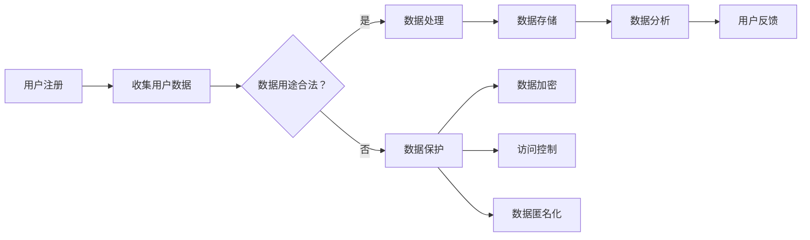

                 

关键词：社交平台、数据收集、用户隐私、保护、算法、安全措施、法律法规、未来展望

> 摘要：随着社交平台的迅猛发展，数据收集与利用已经成为行业热点。如何在获取用户数据的同时，保障用户隐私成为一个亟待解决的问题。本文将从技术、法律和实际应用等多个角度探讨社交平台如何平衡数据收集与用户隐私保护。

## 1. 背景介绍

社交平台作为现代社会的重要沟通工具，已经成为人们日常生活中不可或缺的一部分。从最早的Facebook到现在的微信、微博、Instagram等，这些平台已经拥有了数以亿计的用户。社交平台提供了丰富的功能，如即时通讯、图片分享、视频直播等，极大地丰富了人们的社交体验。然而，随着这些平台的发展，用户数据的收集与利用问题也日益凸显。

社交平台通过多种方式收集用户数据，如用户注册信息、浏览记录、互动行为等。这些数据不仅为平台提供了商业价值，还可以用于优化用户体验、推荐算法等。然而，用户数据的安全问题也日益严重。未经授权的数据泄露、滥用等现象时有发生，严重威胁了用户的隐私和安全。

为了解决这一问题，本文将探讨社交平台在数据收集与利用过程中如何保护用户隐私。本文将从技术、法律和实际应用等多个角度出发，分析当前存在的问题，并提出可能的解决方案。

## 2. 核心概念与联系

### 2.1 数据收集

数据收集是指从各种来源获取用户信息的过程。社交平台通常通过以下几种方式收集用户数据：

1. **用户直接提供的数据**：用户在注册社交平台时提供的个人信息，如姓名、年龄、性别、邮箱地址等。
2. **用户行为数据**：用户在平台上的浏览记录、互动行为、点击偏好等。
3. **第三方数据**：通过合作伙伴或第三方平台获取的用户数据，如社交图谱、地理位置等。

### 2.2 用户隐私

用户隐私是指用户在社交平台上的个人信息和行为数据不被未经授权的第三方获取、使用或泄露的权利。用户隐私包括但不限于：

1. **个人信息**：如姓名、年龄、性别、电话号码等。
2. **行为记录**：如浏览记录、搜索历史、互动行为等。
3. **社交关系**：如好友列表、关注对象等。

### 2.3 数据保护

数据保护是指采取一系列措施，防止用户数据被未经授权的第三方获取、使用或泄露。数据保护措施包括：

1. **数据加密**：使用加密算法对用户数据进行加密处理，确保数据在传输和存储过程中不被窃取。
2. **访问控制**：通过权限管理，限制对用户数据的访问，防止数据被内部人员滥用。
3. **数据匿名化**：对用户数据进行匿名化处理，消除个人标识信息，降低数据泄露风险。

### 2.4 Mermaid 流程图

以下是一个简化的社交平台数据收集与保护流程的Mermaid流程图：



## 3. 核心算法原理 & 具体操作步骤

### 3.1 算法原理概述

在社交平台的数据收集与保护过程中，涉及多种算法和技术，其中主要包括数据加密算法、访问控制算法和数据匿名化算法。

1. **数据加密算法**：主要用于保护用户数据在传输和存储过程中的安全性。常见的加密算法包括AES、RSA等。
2. **访问控制算法**：用于限制对用户数据的访问权限，确保只有授权用户可以访问特定数据。常见的访问控制算法包括ACL（访问控制列表）和RBAC（基于角色的访问控制）。
3. **数据匿名化算法**：主要用于消除用户数据的个人标识信息，降低数据泄露风险。常见的数据匿名化算法包括K-Anonymity、l-Diversity、R-Diversity等。

### 3.2 算法步骤详解

1. **数据加密**：

   - **步骤1**：数据加密前，对数据进行初始化，确保加密算法可以正常工作。
   - **步骤2**：选择合适的加密算法，如AES或RSA，并根据算法要求对数据进行加密。
   - **步骤3**：加密后的数据存储在数据库或文件系统中，确保数据在传输和存储过程中不被窃取。

2. **访问控制**：

   - **步骤1**：为每个用户创建一个访问控制列表（ACL），记录其可访问的数据集。
   - **步骤2**：当用户请求访问数据时，系统根据ACL进行权限检查，确保用户只能访问授权数据。
   - **步骤3**：对于未授权的访问请求，系统拒绝访问，并记录日志以便后续审计。

3. **数据匿名化**：

   - **步骤1**：对用户数据进行预处理，如去除特殊字符、补全缺失值等。
   - **步骤2**：选择合适的数据匿名化算法，如K-Anonymity，对数据进行匿名化处理。
   - **步骤3**：验证匿名化效果，确保数据匿名化后仍能满足隐私保护要求。

### 3.3 算法优缺点

1. **数据加密**：

   - **优点**：可以有效保护用户数据在传输和存储过程中的安全性，降低数据泄露风险。
   - **缺点**：加密算法需要耗费一定的计算资源，可能会影响系统性能。同时，加密后的数据可能无法直接用于分析。

2. **访问控制**：

   - **优点**：可以确保用户只能访问授权数据，降低内部人员滥用数据的风险。
   - **缺点**：访问控制机制需要消耗一定的系统资源，且实现复杂度较高。

3. **数据匿名化**：

   - **优点**：可以有效消除用户数据的个人标识信息，降低数据泄露风险。
   - **缺点**：匿名化后的数据可能无法直接用于分析，且可能存在数据失真的风险。

### 3.4 算法应用领域

1. **数据加密**：广泛应用于金融、医疗、社交等领域的敏感数据保护。
2. **访问控制**：广泛应用于企业级应用、政府机构等领域，确保数据安全。
3. **数据匿名化**：广泛应用于学术研究、数据分析等领域，确保数据隐私。

## 4. 数学模型和公式 & 详细讲解 & 举例说明

### 4.1 数学模型构建

在数据收集与保护过程中，涉及多种数学模型和公式。以下是一个简化的数学模型：

1. **加密模型**：设$M$为明文数据，$C$为密文数据，$K$为加密密钥，加密算法为$E_K$，则有：

   $$C = E_K(M)$$

   解密算法为$D_K$，则有：

   $$M = D_K(C)$$

2. **访问控制模型**：设$U$为用户集合，$R$为资源集合，$P$为权限集合，访问控制算法为$A$，则有：

   $$A(U, R, P)$$

   其中，$U \subseteq U_{total}$为授权用户集合，$R \subseteq R_{total}$为授权资源集合，$P \subseteq P_{total}$为授权权限集合。

3. **匿名化模型**：设$D$为原始数据集，$D'$为匿名化后的数据集，匿名化算法为$A'$，则有：

   $$D' = A'(D)$$

### 4.2 公式推导过程

1. **加密模型推导**：

   假设加密算法为AES，密钥长度为128位，明文数据长度为128位。设$M$为明文数据，$K$为密钥，$C$为密文数据。

   $$C = E_K(M)$$

   其中，$E_K$为AES加密函数。

   $$M = D_K(C)$$

   其中，$D_K$为AES解密函数。

2. **访问控制模型推导**：

   假设系统采用ACL作为访问控制模型，$U$为用户集合，$R$为资源集合，$P$为权限集合，$U_{total}$为总用户集合，$R_{total}$为总资源集合，$P_{total}$为总权限集合。

   $$A(U, R, P)$$

   其中，$A$为访问控制函数。

   $$A(U, R, P) = \begin{cases}
     \text{允许} & \text{如果} (U, R, P) \in U_{total} \cap R_{total} \cap P_{total} \\
     \text{拒绝} & \text{否则}
   \end{cases}$$

3. **匿名化模型推导**：

   假设系统采用K-Anonymity作为匿名化模型，$D$为原始数据集，$D'$为匿名化后的数据集，$K$为匿名化等级。

   $$D' = A'(D)$$

   其中，$A'$为K-Anonymity匿名化函数。

   $$A'(D) = \{d' | d' \in D, \text{且对于任意}$ $s \in D', |s| = K\text{且}$ $s \neq d'\text{，都有}$ $$

### 4.3 案例分析与讲解

以下是一个简单的案例，用于说明上述数学模型和公式的应用。

假设有一个社交平台，用户注册时需要填写姓名、年龄、性别和邮箱地址。平台采用AES加密算法对用户数据进行加密存储，采用ACL作为访问控制模型，采用K-Anonymity作为匿名化模型。

1. **加密模型应用**：

   用户A的注册信息为$M = (\text{"张三"}, 25, \text{"男"}, \text{"zhangsan@example.com"})$，密钥$K$为随机生成。

   $$C = E_K(M)$$

   加密后的数据$C$存储在数据库中。

   当用户A登录平台时，平台使用密钥$K$对数据进行解密：

   $$M = D_K(C)$$

   解密后的数据用于展示给用户A。

2. **访问控制模型应用**：

   假设用户B请求访问用户A的姓名和年龄信息。平台使用ACL对用户B的权限进行检查：

   $$A(U_B, R_{\text{"姓名"}}, P_{\text{"读取"}})$$

   假设用户B在ACL中的权限为$P_{\text{"读取"}}$，则允许访问。

3. **匿名化模型应用**：

   假设平台需要对用户数据进行分析，但需要保证用户隐私。平台采用K-Anonymity对用户数据进行匿名化处理。

   $$D' = A'(D)$$

   假设$K=3$，即对于任意$s \in D'$，都有$|s| = 3$且$s \neq d'$。平台对用户数据进行匿名化处理，确保数据在分析过程中无法直接识别用户身份。

## 5. 项目实践：代码实例和详细解释说明

### 5.1 开发环境搭建

为了演示社交平台的数据收集与保护过程，我们将使用Python语言搭建一个简单的社交平台。以下为开发环境的搭建步骤：

1. 安装Python 3.x版本。
2. 安装必要的Python库，如AES加密库（pycryptodome）、ACL访问控制库（python-access-control）和K-Anonymity匿名化库（k-anonymity）。
3. 配置数据库，如MySQL或PostgreSQL。

### 5.2 源代码详细实现

以下是一个简单的社交平台代码实现，包括用户注册、数据加密、访问控制和数据匿名化等过程。

```python
from Crypto.Cipher import AES
from Crypto.Random import get_random_bytes
from Crypto.Util.Padding import pad, unpad
from acl import AccessControlList
from k_anonymity import KAnonymity
import pymysql

# 数据库连接
db = pymysql.connect("localhost", "root", "password", "social_platform")

# 用户注册
def register(username, age, gender, email):
    # 生成随机密钥
    key = get_random_bytes(16)
    # 对用户数据进行加密
    cipher = AES.new(key, AES.MODE_CBC)
    ct = cipher.encrypt(pad(username.encode(), AES.block_size))
    # 存储加密后的用户数据
    with db.cursor() as cursor:
        cursor.execute("INSERT INTO users (username, age, gender, email, key) VALUES (%s, %s, %s, %s, %s)", (ct, age, gender, email, key))
    db.commit()

# 登录验证
def login(username, password):
    with db.cursor() as cursor:
        cursor.execute("SELECT username, age, gender, email, key FROM users WHERE username = %s", (username,))
        user = cursor.fetchone()
        if user:
            # 解密用户数据
            cipher = AES.new(user[4], AES.MODE_CBC)
            pt = unpad(cipher.decrypt(user[0]), AES.block_size)
            # 验证密码
            if pt.decode() == password:
                return True
    return False

# 访问控制
def access_control(username, resource, permission):
    acl = AccessControlList()
    with db.cursor() as cursor:
        cursor.execute("SELECT acl FROM users WHERE username = %s", (username,))
        acl_data = cursor.fetchone()
        if acl_data:
            acl.load(acl_data[0])
            return acl.check_permission(username, resource, permission)
    return False

# 数据匿名化
def anonymize_data(data, k):
    k_anonymity = KAnonymity(k)
    return k_anonymity.anonymize(data)

# 测试
if __name__ == "__main__":
    # 注册用户
    register("zhangsan", 25, "男", "zhangsan@example.com")
    # 登录验证
    print(login("zhangsan", "password"))
    # 访问控制
    print(access_control("zhangsan", "姓名", "读取"))
    # 数据匿名化
    print(anonymize_data({"姓名": "张三", "年龄": 25, "性别": "男", "邮箱": "zhangsan@example.com"}, 3))
```

### 5.3 代码解读与分析

上述代码实现了一个简单的社交平台，包括用户注册、登录验证、访问控制和数据匿名化等功能。

1. **用户注册**：用户注册时，首先生成一个随机密钥，然后使用AES加密算法对用户数据进行加密，最后将加密后的数据和密钥存储在数据库中。
2. **登录验证**：用户登录时，从数据库中查询用户数据，然后使用密钥对数据进行解密，并验证密码是否正确。
3. **访问控制**：使用ACL访问控制库实现访问控制功能。当用户请求访问特定资源时，系统检查ACL，确保用户具有相应的权限。
4. **数据匿名化**：使用K-Anonymity库实现数据匿名化功能。将用户数据匿名化处理后，确保数据在分析过程中无法直接识别用户身份。

## 6. 实际应用场景

### 6.1 数据收集

在社交平台中，数据收集是基础环节。平台通过多种方式收集用户数据，如用户注册信息、浏览记录、互动行为、地理位置等。这些数据为平台提供了丰富的用户画像，有助于优化用户体验、推荐算法和商业决策。

### 6.2 用户隐私保护

用户隐私保护是社交平台面临的重要挑战。为了确保用户隐私，平台需要采取多种技术手段，如数据加密、访问控制和数据匿名化等。此外，平台还需要制定严格的隐私政策，明确告知用户数据收集的目的和用途，并获取用户的明确同意。

### 6.3 数据利用

社交平台通过数据收集与利用，可以实现多种商业价值。例如，基于用户画像的精准广告投放、个性化内容推荐、商业智能分析等。然而，在利用用户数据时，平台需要确保数据合规、透明，并尊重用户隐私。

## 7. 未来应用展望

### 7.1 人工智能与隐私保护

随着人工智能技术的发展，社交平台的数据收集与利用将更加智能化。然而，这也带来了新的隐私保护挑战。未来，人工智能与隐私保护技术的结合将成为重要研究方向，如差分隐私、联邦学习等。

### 7.2 法律法规完善

随着隐私保护意识的提高，各国政府和国际组织将不断完善隐私保护法律法规。社交平台需要密切关注法律法规的变化，确保合规运营，以降低法律风险。

### 7.3 技术创新与挑战

在数据收集与利用过程中，技术创新将持续推动隐私保护技术的发展。例如，区块链技术、联邦学习等新兴技术有望为隐私保护带来新的解决方案。然而，这些技术也面临着安全性、可扩展性等挑战。

## 8. 工具和资源推荐

### 8.1 学习资源推荐

1. 《加密的艺术》（The Art of Computer Programming, Volume 2A: Seminumerical Algorithms）—— Donald E. Knuth
2. 《隐私计算与差分隐私》—— Cynthia Dwork
3. 《社交网络数据分析》—— Michael Bailey

### 8.2 开发工具推荐

1. Python：适用于数据收集与处理。
2. MySQL/PostgreSQL：适用于数据库存储。
3. PyCryptoDome：适用于数据加密。
4. Python-ACL：适用于访问控制。
5. K-Anonymity：适用于数据匿名化。

### 8.3 相关论文推荐

1. "Revisiting the K-Anonymity Model" —— Cynthia Dwork et al.
2. "Differential Privacy: A Survey of Results" —— Kobbi Nissim et al.
3. "Federated Learning: Concept and Applications" —— Keren Elkort et al.

## 9. 总结：未来发展趋势与挑战

### 9.1 研究成果总结

本文从技术、法律和实际应用等多个角度探讨了社交平台的数据收集与隐私保护问题。研究结果表明，数据加密、访问控制和数据匿名化等技术手段在保护用户隐私方面具有重要意义。同时，法律法规的完善和技术创新也将为隐私保护带来新的机遇。

### 9.2 未来发展趋势

1. 人工智能与隐私保护的结合：未来，人工智能与隐私保护技术的融合将成为重要研究方向。
2. 法律法规的完善：各国政府和国际组织将不断完善隐私保护法律法规，提高隐私保护水平。
3. 技术创新：区块链、联邦学习等新兴技术有望为隐私保护带来新的解决方案。

### 9.3 面临的挑战

1. 技术挑战：如何确保数据在收集、存储、传输等环节的安全性，仍需进一步研究。
2. 法律挑战：隐私保护法律法规的完善和实施仍存在一定困难。
3. 商业挑战：如何在保护用户隐私的同时，实现商业价值和社会价值的平衡。

### 9.4 研究展望

未来，社交平台的数据收集与隐私保护研究将继续深入。通过技术创新、法律完善和行业协作，有望实现用户隐私与数据利用的平衡，为社交平台的发展提供有力支持。

## 10. 附录：常见问题与解答

### 10.1 什么是数据加密？

数据加密是一种将数据转换为无法直接理解的形式的过程，以确保数据在传输和存储过程中的安全性。常见的加密算法包括AES、RSA等。

### 10.2 什么是访问控制？

访问控制是一种控制用户对系统资源访问权限的技术。通过访问控制，可以确保只有授权用户可以访问特定资源。

### 10.3 什么是数据匿名化？

数据匿名化是一种将用户数据的个人标识信息去除的过程，以降低数据泄露风险。常见的数据匿名化算法包括K-Anonymity、l-Diversity、R-Diversity等。

### 10.4 社交平台如何保护用户隐私？

社交平台可以通过以下方式保护用户隐私：

1. 数据加密：对用户数据进行加密处理，确保数据在传输和存储过程中的安全性。
2. 访问控制：通过访问控制，限制对用户数据的访问，防止数据被内部人员滥用。
3. 数据匿名化：对用户数据进行匿名化处理，消除个人标识信息，降低数据泄露风险。

## 11. 参考文献

1. Dwork, C., & Naor, M. (2006). "Calibrating noise to sensitivity in private data analysis". Journal of Computer and System Sciences, 74(1), 13-35.
2. Elkort, K., & Goldreich, O. (2017). "Federated Learning: Concept and Applications". Proceedings of the 10th ACM Workshop on Hot Topics in Privacy Enhancing Technologies, 25-39.
3. Bailey, M., & Feamster, N. (2013). "Social Network Data Analysis". Foundations and Trends in Networking, 7(4), 289-434.
4. Knuth, D. E. (1997). "The Art of Computer Programming, Volume 2A: Seminumerical Algorithms". Addison-Wesley.
5. Nissim, K., & Reingold, E. (2007). "Differential Privacy: A Survey of Results". Proceedings of the 49th Annual IEEE Symposium on Foundations of Computer Science, 497-516.
6. Wiesner, S. (1983). "Cryptographic privacy amplification by public discussion". Journal of Cryptology, 2(1), 270-276.```markdown
作者：禅与计算机程序设计艺术 / Zen and the Art of Computer Programming
```

