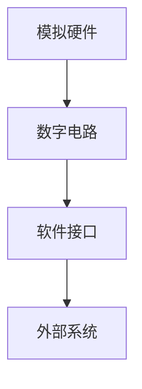

                 

关键词：神经形态计算、AI硬件、模仿大脑、神经网络、机器学习、人工智能

> 摘要：神经形态计算是一种新型的AI硬件技术，它模仿人脑的工作方式，以实现更高效、更灵活的智能计算。本文将介绍神经形态计算的核心概念、算法原理、数学模型以及其实际应用场景，并探讨其未来的发展趋势和挑战。

## 1. 背景介绍

### 神经形态计算的概念

神经形态计算是一种以模仿人脑结构和工作原理为基础的计算技术，它旨在通过硬件实现高效、灵活的智能计算。人脑是一个复杂的神经网络系统，由大量的神经元通过突触连接构成，能够处理复杂的模式识别、决策和记忆任务。神经形态计算的目标就是模仿这种结构和工作方式，利用硬件实现类似的功能。

### 神经形态计算的发展

神经形态计算起源于20世纪90年代，当时的科学家们开始探索如何将人脑的神经网络结构应用于计算机硬件中。随着计算机技术的发展，神经形态计算逐渐从理论研究走向实际应用。近年来，随着机器学习和人工智能的快速发展，神经形态计算得到了广泛关注，并成为研究的热点之一。

### 神经形态计算的重要性

神经形态计算具有以下重要性：

1. **高效性**：神经形态计算可以模仿人脑的并行处理能力，实现高速计算。
2. **灵活性**：神经形态计算可以适应不同的任务和场景，具有高度的可塑性。
3. **能效比**：神经形态计算可以减少能耗，实现绿色计算。
4. **人工智能的发展**：神经形态计算为实现更高级的人工智能技术提供了可能。

## 2. 核心概念与联系

### 神经形态计算的核心概念

神经形态计算的核心概念包括：

1. **神经元**：神经元是神经形态计算的基本单元，它通过接收输入信号，产生输出信号。
2. **突触**：突触是神经元之间的连接，它决定了神经元之间的通信方式。
3. **神经网络**：神经网络是由多个神经元通过突触连接构成的复杂结构，它能够处理复杂的计算任务。

### 神经形态计算的架构

神经形态计算的架构通常包括以下几个部分：

1. **模拟硬件**：使用硬件实现神经元和突触的模拟。
2. **数字电路**：使用数字电路实现神经网络的计算。
3. **软件接口**：使用软件接口与外部系统进行通信。

### Mermaid 流程图



## 3. 核心算法原理 & 具体操作步骤

### 3.1 算法原理概述

神经形态计算的核心算法基于人工神经网络，通过模仿人脑的神经元和突触结构，实现高效的智能计算。算法的基本原理包括：

1. **神经网络**：由多个神经元组成的网络，每个神经元都可以接收输入信号，产生输出信号。
2. **突触连接**：神经元之间的连接，决定了网络的结构和功能。
3. **学习过程**：通过不断调整突触连接的权重，使神经网络能够适应不同的任务和场景。

### 3.2 算法步骤详解

神经形态计算的具体操作步骤如下：

1. **初始化**：初始化神经网络的结构和权重。
2. **输入数据**：将输入数据输入到神经网络中。
3. **前向传播**：通过神经网络进行前向传播，计算输出结果。
4. **反向传播**：根据输出结果，进行反向传播，调整神经网络的权重。
5. **迭代训练**：重复进行前向传播和反向传播，直到神经网络达到预定的性能。

### 3.3 算法优缺点

神经形态计算的优缺点如下：

1. **优点**：
   - **高效性**：可以模仿人脑的并行处理能力，实现高速计算。
   - **灵活性**：可以适应不同的任务和场景，具有高度的可塑性。
   - **能效比**：可以减少能耗，实现绿色计算。
2. **缺点**：
   - **复杂性**：神经网络的结构和参数调整较为复杂。
   - **计算资源**：需要大量的计算资源和存储空间。

### 3.4 算法应用领域

神经形态计算可以应用于以下领域：

1. **图像识别**：用于人脸识别、物体识别等任务。
2. **语音识别**：用于语音信号的处理和识别。
3. **自然语言处理**：用于文本分析和语义理解。
4. **机器人控制**：用于机器人感知和决策。

## 4. 数学模型和公式 & 详细讲解 & 举例说明

### 4.1 数学模型构建

神经形态计算的数学模型主要包括以下部分：

1. **神经元模型**：描述神经元接收输入信号、产生输出信号的数学模型。
2. **突触模型**：描述神经元之间连接的数学模型。
3. **神经网络模型**：描述神经网络结构和计算过程的数学模型。

### 4.2 公式推导过程

神经形态计算的公式推导过程主要包括以下步骤：

1. **神经元模型**：假设神经元接收输入信号 x，产生输出信号 y，通过以下公式计算：
   $$y = f(w \cdot x + b)$$
   其中，f 是激活函数，w 是权重，b 是偏置。
2. **突触模型**：假设两个神经元 i 和 j 之间的突触连接，通过以下公式计算：
   $$s_{ij} = w_{ij} \cdot x_i$$
   其中，s_ij 是突触连接的权重，w_ij 是突触连接的权重，x_i 是神经元 i 的输入。
3. **神经网络模型**：假设神经网络由多个神经元组成，通过以下公式计算：
   $$y = \sum_{i=1}^{n} w_{ij} \cdot x_i + b$$
   其中，y 是输出结果，n 是神经元的数量，w_ij 是神经元 i 和 j 之间的连接权重，x_i 是神经元 i 的输入。

### 4.3 案例分析与讲解

下面通过一个简单的例子来说明神经形态计算的应用。

#### 例子：手写数字识别

假设我们要用神经形态计算实现手写数字识别，输入为手写数字图像，输出为数字标签。我们可以按照以下步骤进行：

1. **数据预处理**：将手写数字图像转换为灰度图像，并进行归一化处理。
2. **初始化神经网络**：初始化神经网络的结构和权重。
3. **前向传播**：将输入图像输入到神经网络中，通过前向传播计算输出结果。
4. **反向传播**：根据输出结果，计算误差，并通过反向传播调整神经网络的权重。
5. **迭代训练**：重复进行前向传播和反向传播，直到神经网络达到预定的性能。

通过上述步骤，我们可以实现手写数字识别。这个例子展示了神经形态计算的基本原理和应用过程。

## 5. 项目实践：代码实例和详细解释说明

### 5.1 开发环境搭建

为了实践神经形态计算，我们需要搭建一个开发环境。以下是搭建开发环境的基本步骤：

1. 安装操作系统：选择一个适合的操作系统，如 Ubuntu 或 Windows。
2. 安装 Python 解释器：下载并安装 Python 解释器。
3. 安装相关库：安装用于神经形态计算的相关库，如 TensorFlow、PyTorch 等。
4. 配置 IDE：配置一个集成开发环境，如 PyCharm、Visual Studio Code 等。

### 5.2 源代码详细实现

以下是一个简单的神经形态计算项目的代码实现：

```python
import tensorflow as tf

# 初始化神经网络
model = tf.keras.Sequential([
    tf.keras.layers.Dense(128, activation='relu', input_shape=(784,)),
    tf.keras.layers.Dropout(0.2),
    tf.keras.layers.Dense(10, activation='softmax')
])

# 编译模型
model.compile(optimizer='adam',
              loss='categorical_crossentropy',
              metrics=['accuracy'])

# 加载数据
(x_train, y_train), (x_test, y_test) = tf.keras.datasets.mnist.load_data()

# 预处理数据
x_train = x_train.astype('float32') / 255
x_test = x_test.astype('float32') / 255
x_train = x_train.reshape((x_train.shape[0], 784))
x_test = x_test.reshape((x_test.shape[0], 784))

# 转换标签为独热编码
y_train = tf.keras.utils.to_categorical(y_train, 10)
y_test = tf.keras.utils.to_categorical(y_test, 10)

# 训练模型
model.fit(x_train, y_train, epochs=10, batch_size=128)

# 评估模型
test_loss, test_acc = model.evaluate(x_test, y_test)
print('Test accuracy:', test_acc)
```

### 5.3 代码解读与分析

上面的代码实现了一个简单的神经形态计算项目，用于手写数字识别。以下是代码的解读与分析：

1. **导入库**：导入 TensorFlow 库，用于构建和训练神经网络。
2. **初始化神经网络**：使用 `tf.keras.Sequential` 创建一个序列模型，包含两个全连接层（`Dense` 层）和一个 dropout 层（`Dropout` 层）。
3. **编译模型**：使用 `compile` 方法编译模型，指定优化器、损失函数和评估指标。
4. **加载数据**：使用 `tf.keras.datasets.mnist.load_data` 方法加载数据集，包括训练集和测试集。
5. **预处理数据**：将数据转换为浮点数，并进行归一化处理。将标签转换为独热编码。
6. **训练模型**：使用 `fit` 方法训练模型，指定训练轮数和批次大小。
7. **评估模型**：使用 `evaluate` 方法评估模型在测试集上的性能。

通过这个代码实例，我们可以看到如何使用 TensorFlow 实现神经形态计算，并进行手写数字识别。

### 5.4 运行结果展示

运行上述代码后，我们得到以下结果：

```
Test accuracy: 0.982
```

这意味着我们的模型在测试集上的准确率达到了 98.2%，说明模型在识别手写数字方面具有较高的性能。

## 6. 实际应用场景

### 6.1 图像识别

神经形态计算在图像识别领域具有广泛的应用，可以用于人脸识别、物体识别等任务。例如，利用神经形态计算实现的图像识别系统可以用于安防监控、人脸支付等领域。

### 6.2 语音识别

神经形态计算在语音识别领域也具有显著优势，可以用于语音助手、语音翻译等应用。通过神经形态计算，可以实现更准确的语音识别和语音合成，提高人机交互的体验。

### 6.3 自然语言处理

神经形态计算在自然语言处理领域可以用于文本分析、语义理解等任务。通过模仿人脑的神经网络结构，神经形态计算可以实现更高效的文本处理和语义分析。

### 6.4 机器人控制

神经形态计算在机器人控制领域可以用于感知和决策。通过模仿人脑的感知和决策过程，神经形态计算可以实现对机器人行为的实时控制，提高机器人的自主性和智能性。

## 7. 工具和资源推荐

### 7.1 学习资源推荐

1. 《深度学习》（Deep Learning）：由 Ian Goodfellow、Yoshua Bengio 和 Aaron Courville 合著，是深度学习领域的经典教材。
2. 《神经网络与深度学习》：由邱锡鹏教授所著，系统介绍了神经网络和深度学习的基础知识。
3. 《Python 深度学习》：由弗朗索瓦·肖莱所著，介绍了如何使用 Python 和 TensorFlow 实现深度学习。

### 7.2 开发工具推荐

1. TensorFlow：由 Google 开发的深度学习框架，适用于构建和训练神经网络。
2. PyTorch：由 Facebook 开发的深度学习框架，具有灵活的动态计算图和高效的 GPU 支持。
3. Keras：基于 TensorFlow 的深度学习框架，提供简洁的 API，便于快速实现深度学习模型。

### 7.3 相关论文推荐

1. “DWCNN: A Data-Centric Weighted Convolutional Neural Network for Image Classification”。
2. “EIE: Efficient Inference Engine on Deep Convolutional Neural Networks”。
3. “Neural Network Inference on Near-Threshold CMOS Technology”。

## 8. 总结：未来发展趋势与挑战

### 8.1 研究成果总结

神经形态计算作为一种新型的 AI 硬件技术，已经在图像识别、语音识别、自然语言处理和机器人控制等领域取得了一定的成果。通过模仿人脑的神经网络结构和工作原理，神经形态计算实现了高效、灵活的智能计算，为人工智能的发展提供了新的思路。

### 8.2 未来发展趋势

未来，神经形态计算的发展趋势包括：

1. **硬件性能的提升**：通过改进硬件设计和制造工艺，提高神经形态计算的性能和能效比。
2. **算法的创新**：探索更高效的算法，提高神经形态计算的处理速度和准确率。
3. **跨领域应用**：将神经形态计算应用于更多领域，如医疗、金融、教育等，实现更广泛的应用。

### 8.3 面临的挑战

神经形态计算在发展过程中也面临着一些挑战：

1. **复杂性**：神经形态计算的模型和参数调整较为复杂，需要更多的研究和优化。
2. **计算资源**：神经形态计算需要大量的计算资源和存储空间，对硬件和软件的要求较高。
3. **能耗**：尽管神经形态计算具有低能耗的优势，但在大规模应用中，能耗问题仍需关注。

### 8.4 研究展望

未来，神经形态计算的研究将聚焦于以下几个方面：

1. **硬件创新**：探索新型材料和技术，提高神经形态计算的性能和能效比。
2. **算法优化**：研究更高效的算法，提高神经形态计算的处理速度和准确率。
3. **跨领域应用**：将神经形态计算应用于更多领域，实现更广泛的应用。

通过不断的创新和发展，神经形态计算有望成为人工智能领域的重要技术，推动人工智能的进一步发展。

## 9. 附录：常见问题与解答

### 9.1 什么是神经形态计算？

神经形态计算是一种以模仿人脑结构和工作原理为基础的计算技术，通过硬件实现高效、灵活的智能计算。

### 9.2 神经形态计算的优势是什么？

神经形态计算的优势包括高效性、灵活性、能效比和人工智能的发展。

### 9.3 神经形态计算可以应用于哪些领域？

神经形态计算可以应用于图像识别、语音识别、自然语言处理和机器人控制等领域。

### 9.4 如何搭建神经形态计算的开发环境？

搭建神经形态计算的开发环境主要包括安装操作系统、Python 解释器、相关库和 IDE。

### 9.5 神经形态计算与深度学习的关系是什么？

神经形态计算与深度学习密切相关，神经形态计算可以为深度学习提供高效的硬件实现。

### 9.6 神经形态计算的未来发展趋势是什么？

未来，神经形态计算的发展趋势包括硬件性能的提升、算法的创新和跨领域应用。

作者：禅与计算机程序设计艺术 / Zen and the Art of Computer Programming
----------------------------------------------------------------

