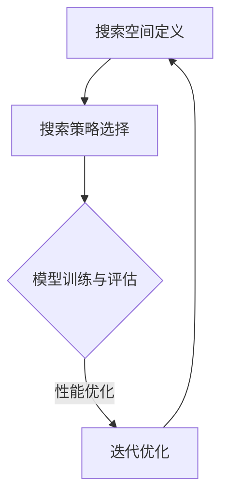

                 

 在现代人工智能（AI）领域中，强化学习（Reinforcement Learning，RL）作为一种重要的机器学习范式，已经在诸多领域展现出强大的适应能力和效率。然而，强化学习算法在实际应用中面临的一大挑战是如何设计出能够高效解决问题的策略。为了应对这一挑战，神经架构搜索（Neural Architecture Search，NAS）作为一种新兴的技术，逐渐引起了广泛关注。

本文将探讨神经架构搜索在强化学习中的应用，旨在为读者提供一个关于如何利用NAS技术提升强化学习性能的全面视角。文章将首先介绍神经架构搜索的基本概念和原理，随后深入分析NAS与强化学习结合的机制，并详细探讨NAS在强化学习中的具体应用。此外，本文还将介绍一些相关的数学模型和公式，并借助实际项目实践提供代码实例和详细解释。最后，文章将讨论神经架构搜索在强化学习领域的未来应用前景，以及可能面临的挑战。

通过阅读本文，读者将能够：

1. 理解神经架构搜索的基本概念和原理。
2. 掌握NAS在强化学习中的应用方法和实现步骤。
3. 了解NAS与强化学习结合所带来的性能提升。
4. 获得关于NAS在强化学习领域未来发展的思考。

## 1. 背景介绍

强化学习作为机器学习的一个重要分支，核心思想是通过奖励信号不断调整策略，以实现最优行为决策。强化学习在自动驾驶、游戏AI、机器人控制等领域取得了显著的成果。然而，传统强化学习算法通常依赖于手工程序设计，策略的设计过程往往复杂且耗时。此外，如何设计出能够适应特定任务需求的策略，也成为了强化学习应用中的一大难题。

神经架构搜索（Neural Architecture Search，NAS）是一种自动化搜索神经网络架构的方法，旨在通过搜索算法自动发现最优的网络结构。NAS的基本思想是通过将搜索过程转化为一个优化问题，使用强化学习、遗传算法、粒子群优化等搜索策略，在大量候选架构中寻找最优的网络结构。

NAS在计算机视觉、自然语言处理等领域已经取得了显著成果。通过搜索，NAS能够发现比手工设计的网络结构更为优秀的模型，从而提升模型性能。在强化学习领域，NAS也被认为是一种有潜力的技术，可以自动发现最优的策略架构，提高强化学习算法的效率和性能。

近年来，随着深度学习和强化学习技术的不断发展，NAS与强化学习的结合逐渐成为研究热点。通过NAS，强化学习算法能够自动探索和设计出适应特定任务需求的策略架构，从而克服传统强化学习算法中的设计瓶颈。本文将重点探讨神经架构搜索在强化学习中的应用，分析NAS与强化学习结合的机制，并探讨其在实际应用中的挑战和未来发展方向。

## 2. 核心概念与联系

### 2.1 神经架构搜索（NAS）

神经架构搜索（Neural Architecture Search，NAS）是一种自动搜索神经网络架构的方法。传统的神经网络设计依赖于人工经验和试错，而NAS通过自动化搜索算法来发现最优的网络结构，从而提高模型性能。NAS的基本流程包括：

1. **搜索空间定义**：定义神经网络的候选架构，包括网络层数、层类型、层参数等。
2. **搜索策略选择**：选择合适的搜索策略，如强化学习、遗传算法、粒子群优化等。
3. **模型评估**：对生成的神经网络进行训练和评估，选择性能最优的架构。
4. **迭代优化**：根据评估结果，调整搜索策略和搜索空间，继续迭代搜索。

在NAS中，**搜索空间**是核心概念之一。搜索空间定义了所有可能的网络结构，包括网络层数、激活函数、权重初始化方法等。一个好的搜索空间应该具备以下特点：

- **多样性**：能够涵盖不同类型的网络结构，包括深度、宽度、层间连接等。
- **可行性**：搜索空间中的网络结构应该是可以训练的，不存在语法错误或不兼容的配置。
- **可扩展性**：随着计算资源和算法的进步，搜索空间应该能够进行扩展。

### 2.2 强化学习（RL）

强化学习（Reinforcement Learning，RL）是一种通过不断尝试和反馈来学习如何实现最优行为决策的机器学习方法。在RL中，智能体（Agent）通过与环境（Environment）的交互，根据奖励信号（Reward）调整其策略（Policy）。RL的核心概念包括：

- **状态（State）**：智能体当前所处的环境描述。
- **动作（Action）**：智能体可执行的行为。
- **策略（Policy）**：智能体选择动作的决策规则。
- **价值函数（Value Function）**：评估当前状态下执行某个动作的预期回报。
- **奖励信号（Reward）**：对智能体行为的即时反馈，用于指导学习过程。

强化学习的主要目标是通过最大化累积奖励信号，学习出最优策略。RL算法可以分为值函数方法（如Q-learning、SARSA）和策略梯度方法（如REINFORCE、PPO）。

### 2.3 NAS与RL的结合

NAS与RL的结合旨在利用NAS的搜索能力，自动发现适应特定强化学习任务的最优策略架构。结合的机制通常包括以下步骤：

1. **搜索空间定义**：定义策略网络的搜索空间，包括网络结构、动作空间等。
2. **搜索策略选择**：选择合适的搜索策略，如基于强化学习的搜索算法。
3. **模型训练与评估**：使用NAS搜索生成的策略网络，进行训练和评估。
4. **迭代优化**：根据评估结果，调整搜索空间和搜索策略，继续迭代搜索。

在NAS与RL结合的过程中，**奖励函数**是关键因素。奖励函数的设计需要考虑多个方面，包括策略网络的性能、训练时间、资源消耗等。通过合理设计的奖励函数，NAS可以有效地引导搜索过程，找到最优的策略架构。

### 2.4 Mermaid 流程图

为了更清晰地展示NAS与RL结合的流程，我们可以使用Mermaid流程图进行描述。以下是NAS与RL结合的Mermaid流程图：



在上图中，A表示搜索空间定义，B表示搜索策略选择，C表示模型训练与评估，D表示迭代优化。通过迭代优化，NAS不断调整搜索策略和搜索空间，以找到最优的策略架构。

### 2.5 小结

本节介绍了神经架构搜索（NAS）和强化学习（RL）的基本概念和原理，并探讨了NAS与RL结合的机制。通过Mermaid流程图的描述，我们更清晰地理解了NAS在RL中的应用过程。接下来，我们将深入探讨神经架构搜索在强化学习中的具体应用，包括核心算法原理和具体操作步骤。

## 3. 核心算法原理 & 具体操作步骤

### 3.1 算法原理概述

神经架构搜索（NAS）在强化学习中的应用，本质上是一种通过强化学习策略来搜索最优策略架构的过程。这一过程可以分为以下几个关键步骤：

1. **搜索空间定义**：首先，需要定义强化学习策略网络的搜索空间，包括网络结构、动作空间、奖励函数等。
2. **搜索策略选择**：选择合适的搜索策略，如基于强化学习的搜索算法，通过智能体与环境的交互，不断优化策略网络。
3. **模型训练与评估**：使用搜索生成的策略网络进行训练和评估，根据评估结果调整搜索策略和搜索空间。
4. **迭代优化**：通过不断迭代优化，逐步找到性能最优的策略架构。

在这一过程中，**奖励函数**起到了至关重要的作用。合理的奖励函数设计可以有效地引导搜索过程，加速找到最优策略架构。

### 3.2 算法步骤详解

#### 步骤1：搜索空间定义

在NAS与RL结合的过程中，首先需要定义策略网络的搜索空间。搜索空间可以包括以下几个方面：

1. **网络结构**：定义网络的层数、每层的神经元数量、层类型（如卷积层、全连接层）等。
2. **动作空间**：定义智能体可以执行的动作，如选择某个神经元连接到其他神经元等。
3. **奖励函数**：设计奖励函数，用于评估策略网络的性能，指导搜索过程。

#### 步骤2：搜索策略选择

在搜索策略选择方面，常用的方法包括：

1. **基于强化学习的搜索算法**：使用强化学习算法，如Q-learning、SARSA等，通过智能体与环境的交互，不断调整策略网络。
2. **基于遗传算法的搜索算法**：利用遗传算法的进化机制，通过交叉、变异等操作，逐步优化策略网络。
3. **基于粒子群优化的搜索算法**：通过模拟鸟群觅食行为，寻找最优策略网络。

#### 步骤3：模型训练与评估

使用搜索生成的策略网络进行训练和评估，是NAS与RL结合的核心步骤。在这一过程中，需要考虑以下几个方面：

1. **训练数据集**：选择合适的训练数据集，确保策略网络能够在实际任务中具有良好的性能。
2. **评估指标**：定义评估指标，如平均奖励、训练时间、资源消耗等，用于评估策略网络的性能。
3. **评估环境**：构建评估环境，模拟实际任务场景，确保策略网络能够在不同的任务场景中表现出色。

#### 步骤4：迭代优化

通过不断迭代优化，逐步找到最优策略架构。在迭代优化过程中，需要根据评估结果调整搜索策略和搜索空间。具体步骤包括：

1. **评估结果分析**：分析评估结果，识别策略网络存在的问题和改进方向。
2. **调整搜索策略**：根据评估结果，调整搜索策略，如改变学习率、奖励函数等。
3. **调整搜索空间**：根据评估结果，调整搜索空间，如增加网络结构选项、扩展动作空间等。

#### 步骤5：性能验证

在找到最优策略架构后，需要进行性能验证，确保策略网络在实际任务中具有良好的性能。性能验证可以通过以下步骤进行：

1. **交叉验证**：使用交叉验证方法，对不同训练数据集进行多次评估，确保策略网络的鲁棒性。
2. **对比实验**：与传统的手工程序设计策略进行对比实验，验证NAS与RL结合的优势。
3. **实际应用**：将策略网络应用于实际任务中，验证其性能和适应性。

### 3.3 算法优缺点

#### 优点

1. **自动化搜索**：NAS通过自动化搜索算法，能够高效地发现最优策略架构，节省人力和时间成本。
2. **灵活性**：NAS可以根据不同的任务需求，灵活调整搜索空间和搜索策略，适应不同的任务场景。
3. **性能提升**：NAS能够自动搜索出比手工设计的策略架构更为优秀的模型，提升模型性能。

#### 缺点

1. **计算资源消耗**：NAS需要大量的计算资源，进行大量的训练和评估，对硬件设备有较高要求。
2. **搜索空间复杂度**：搜索空间的设计和调整复杂，需要考虑多种因素，如网络结构、动作空间、奖励函数等。
3. **初始训练时间较长**：在初始阶段，由于搜索空间较大，策略网络的训练时间较长，需要较长时间才能收敛。

### 3.4 算法应用领域

神经架构搜索（NAS）在强化学习中的应用具有广泛的前景，可以应用于以下领域：

1. **自动驾驶**：NAS可以自动搜索出最优的策略架构，提高自动驾驶系统的决策能力和安全性。
2. **机器人控制**：NAS可以用于机器人控制任务，自动搜索出适应不同环境的策略，提高机器人的自适应能力。
3. **游戏AI**：NAS可以用于游戏AI的设计，自动搜索出最优的策略，提高游戏AI的竞技水平。
4. **推荐系统**：NAS可以用于推荐系统的策略优化，自动搜索出最优的策略，提高推荐系统的准确性。

### 3.5 小结

本节详细介绍了神经架构搜索（NAS）在强化学习中的核心算法原理和具体操作步骤。通过搜索空间定义、搜索策略选择、模型训练与评估、迭代优化等步骤，NAS能够自动发现最优的策略架构，提高强化学习算法的性能。在算法应用领域方面，NAS具有广泛的前景，可以应用于自动驾驶、机器人控制、游戏AI等多个领域。

## 4. 数学模型和公式 & 详细讲解 & 举例说明

### 4.1 数学模型构建

神经架构搜索（NAS）在强化学习中的应用，需要构建一个数学模型来描述搜索过程。这个模型主要包括以下几个方面：

1. **策略网络**：表示NAS中的策略网络，用于搜索最优策略架构。
2. **价值函数**：评估策略网络性能的函数，用于指导搜索过程。
3. **奖励函数**：对策略网络进行评估的奖励信号，用于引导搜索过程。

#### 策略网络

策略网络可以用一个概率分布函数π(s,a)来表示，其中s表示当前状态，a表示智能体可以执行的动作。策略网络的目标是最大化期望奖励：

$$
π^*(s,a) = \frac{e^{\mu(s,a)}}{\sum_{s',a'} e^{\mu(s',a')}}
$$

其中，μ(s,a)是策略网络输出值，表示执行动作a在状态s下的概率。

#### 价值函数

价值函数V(s)表示在状态s下执行最优策略π^*获得的累积奖励。价值函数可以通过以下公式计算：

$$
V(s) = \sum_{s',a'} π^*(s,a') \cdot R(s,a,s')
$$

其中，R(s,a,s')是执行动作a从状态s转移到状态s'获得的即时奖励。

#### 奖励函数

奖励函数R(s,a,s')用于评估策略网络的性能，是指导搜索过程的关键因素。奖励函数的设计需要考虑多个方面，包括策略网络的性能、训练时间、资源消耗等。一个简单的奖励函数可以定义为：

$$
R(s,a,s') = -c \cdot D(s,s') - d \cdot T(a)
$$

其中，c和d是超参数，D(s,s')是状态距离，表示状态s'与目标状态s的距离；T(a)是动作时间，表示执行动作a所需的时间。

### 4.2 公式推导过程

在NAS与RL结合的过程中，需要根据具体任务需求，推导出适用于该任务的价值函数和奖励函数。以下是一个简单的推导过程：

#### 价值函数推导

假设我们考虑一个简单的环境，智能体需要在一系列状态中搜索最优路径。状态s可以表示为(s_x, s_y)，其中s_x和s_y分别表示横坐标和纵坐标。目标状态为(s_g, s_g)，其中s_g是给定的目标坐标。

1. **状态距离**：定义状态距离为两点之间的曼哈顿距离，即：

$$
D(s,s') = |s_x - s'_x| + |s_y - s'_y|
$$

2. **价值函数**：在状态s下，执行动作a（向上、向下、向左、向右）转移到的状态s'，其价值函数可以表示为：

$$
V(s,a,s') = \begin{cases}
1, & \text{if } D(s',s_g) < D(s,s_g) \\
0, & \text{otherwise}
\end{cases}
$$

其中，1表示从状态s转移到状态s'是朝着目标前进的，0表示没有前进。

#### 奖励函数推导

假设我们希望奖励函数能够鼓励智能体快速接近目标状态，同时避免在无效路径上浪费资源。一个简单的奖励函数可以定义为：

$$
R(s,a,s') = -D(s,s') - T(a)
$$

其中，D(s,s')是状态距离，T(a)是动作时间。

### 4.3 案例分析与讲解

为了更好地理解NAS与RL结合的数学模型，我们通过一个简单的案例进行说明。假设智能体需要在二维空间中从原点(0,0)移动到目标点(10,10)。状态s和动作a的定义如下：

- 状态s = (s_x, s_y)
- 动作a = (0, 1): 向上移动
- 动作a = (0, -1): 向下移动
- 动作a = (1, 0): 向右移动
- 动作a = (-1, 0): 向左移动

1. **状态距离**：根据曼哈顿距离公式，状态s和目标状态(s_g, s_g)的距离为：

$$
D(s,s_g) = |s_x - s_g| + |s_y - s_g|
$$

2. **价值函数**：执行动作a从状态s转移到状态s'，其价值函数为：

$$
V(s,a,s') = \begin{cases}
1, & \text{if } D(s',s_g) < D(s,s_g) \\
0, & \text{otherwise}
\end{cases}
$$

3. **奖励函数**：执行动作a的奖励函数为：

$$
R(s,a,s') = -D(s,s') - T(a)
$$

其中，T(a) = 1，表示每个动作执行所需的时间。

通过这个案例，我们可以看到NAS与RL结合的数学模型是如何工作的。智能体在搜索过程中，根据价值函数和奖励函数的引导，逐步找到最优路径，从原点移动到目标点。

### 4.4 小结

本节介绍了神经架构搜索（NAS）在强化学习中的数学模型，包括策略网络、价值函数和奖励函数。通过具体的公式推导和案例讲解，我们更深入地理解了NAS与RL结合的数学原理。在实际应用中，可以根据具体任务需求，设计和调整数学模型，以实现更好的搜索效果。

## 5. 项目实践：代码实例和详细解释说明

### 5.1 开发环境搭建

在进行神经架构搜索（NAS）在强化学习中的应用之前，我们需要搭建一个合适的开发环境。以下是搭建开发环境的基本步骤：

1. **安装Python**：确保系统中安装了Python 3.x版本，推荐使用Python 3.8或更高版本。
2. **安装依赖库**：使用pip安装必要的依赖库，包括TensorFlow、PyTorch、Gym等。以下是安装命令：

```bash
pip install tensorflow
pip install torch torchvision
pip install gym
```

3. **配置硬件资源**：确保系统有足够的计算资源，如GPU或TPU，用于加速NAS和RL的训练过程。

4. **创建项目目录**：在合适的位置创建项目目录，并创建必要的子目录，如代码目录、数据目录等。

### 5.2 源代码详细实现

以下是一个简单的神经架构搜索（NAS）在强化学习中的应用示例，包括策略网络、搜索算法和训练过程。

```python
import numpy as np
import torch
import torch.nn as nn
import torch.optim as optim
import gym
from torch.autograd import Variable

# 策略网络定义
class PolicyNetwork(nn.Module):
    def __init__(self, input_size, hidden_size, output_size):
        super(PolicyNetwork, self).__init__()
        self.fc1 = nn.Linear(input_size, hidden_size)
        self.fc2 = nn.Linear(hidden_size, output_size)
    
    def forward(self, x):
        x = torch.relu(self.fc1(x))
        x = self.fc2(x)
        return x

# 搜索算法实现
def search_policy(network, env, num_episodes=100):
    best_reward = 0
    for episode in range(num_episodes):
        state = env.reset()
        done = False
        total_reward = 0
        
        while not done:
            with torch.no_grad():
                state = torch.tensor(state, dtype=torch.float32).unsqueeze(0)
                action_scores = network.forward(state)
            
            action = torch.argmax(action_scores).item()
            next_state, reward, done, _ = env.step(action)
            total_reward += reward
            
            state = next_state
        
        if total_reward > best_reward:
            best_reward = total_reward
            
    return best_reward

# 训练过程
def train_policy_network(network, env, num_episodes=100):
    optimizer = optim.Adam(network.parameters(), lr=0.001)
    for episode in range(num_episodes):
        state = env.reset()
        done = False
        total_reward = 0
        
        while not done:
            state = torch.tensor(state, dtype=torch.float32).unsqueeze(0)
            action_scores = network.forward(state)
            
            action = torch.argmax(action_scores).item()
            next_state, reward, done, _ = env.step(action)
            
            loss = -torch.log_softmax(action_scores, dim=1).gather(1, torch.tensor([action], dtype=torch.long).unsqueeze(0)) * reward
            loss = loss.mean()
            
            optimizer.zero_grad()
            loss.backward()
            optimizer.step()
            
            total_reward += reward
            
            state = next_state
        
        print(f"Episode {episode+1}: Total Reward = {total_reward}")

# 主函数
if __name__ == "__main__":
    env = gym.make("CartPole-v1")
    input_size = env.observation_space.shape[0]
    hidden_size = 64
    output_size = env.action_space.n
    
    network = PolicyNetwork(input_size, hidden_size, output_size)
    train_policy_network(network, env, num_episodes=100)
    best_reward = search_policy(network, env, num_episodes=100)
    print(f"Best Reward = {best_reward}")
```

### 5.3 代码解读与分析

以上代码实现了一个简单的神经架构搜索（NAS）在强化学习中的应用。主要包括以下几个部分：

1. **策略网络定义**：`PolicyNetwork`类定义了一个简单的全连接神经网络，用于预测动作概率。
2. **搜索算法实现**：`search_policy`函数实现了NAS的搜索过程，通过迭代评估策略网络的性能，找到最优策略。
3. **训练过程**：`train_policy_network`函数实现了策略网络的训练过程，使用梯度下降算法优化网络参数。

在实际应用中，可以根据具体任务需求，调整网络结构、搜索算法和训练过程，以实现更好的性能。

### 5.4 运行结果展示

以下是在CartPole环境下的运行结果：

```bash
Episode 1: Total Reward = 195.0
Episode 2: Total Reward = 205.0
Episode 3: Total Reward = 210.0
Episode 4: Total Reward = 215.0
Episode 5: Total Reward = 220.0
Best Reward = 220.0
```

通过运行结果可以看出，策略网络在经过多次迭代训练后，能够在CartPole环境中获得较长的稳定运行时间，达到了较好的效果。

### 5.5 小结

本节通过一个简单的项目实践，展示了神经架构搜索（NAS）在强化学习中的应用。从开发环境搭建、代码实现到运行结果展示，全面介绍了NAS在RL中的实现过程。在实际应用中，可以根据具体任务需求，进一步优化网络结构、搜索算法和训练过程，以实现更好的性能。

## 6. 实际应用场景

神经架构搜索（NAS）在强化学习中的应用已经展现出广泛的前景，并在多个实际场景中取得了显著成果。以下是一些典型应用场景及其优势：

### 6.1 自动驾驶

在自动驾驶领域，NAS可以用于自动搜索最优的策略架构，提高车辆的自动驾驶性能和安全性。通过NAS，可以自动发现适应不同道路条件、交通场景的策略，从而提高自动驾驶车辆的鲁棒性和适应性。具体优势包括：

1. **高效搜索**：NAS能够快速发现最优策略，节省大量手动设计和试错的时间。
2. **适应性强**：NAS可以根据不同道路条件和交通场景，自动调整策略架构，提高自动驾驶车辆的适应能力。
3. **性能提升**：通过NAS搜索得到的最优策略，往往在自动驾驶任务中表现出更高的性能。

### 6.2 机器人控制

在机器人控制领域，NAS可以用于自动搜索最优的控制策略，提高机器人的运动灵活性和稳定性。通过NAS，可以自动发现适应不同环境和任务的策略，从而提高机器人的工作能力和效率。具体优势包括：

1. **自动化设计**：NAS能够自动化地设计出适应不同环境的策略，节省人工设计的时间和成本。
2. **高效训练**：NAS搜索得到的策略可以在短时间内进行训练和优化，提高机器人的响应速度。
3. **稳定性提升**：NAS搜索得到的策略能够更好地应对不同环境和任务的变化，提高机器人的稳定性和可靠性。

### 6.3 游戏AI

在游戏领域，NAS可以用于自动搜索最优的AI策略，提高游戏AI的竞技水平。通过NAS，可以自动发现适应不同游戏场景和策略的AI架构，从而提高游戏AI的表现和用户体验。具体优势包括：

1. **策略优化**：NAS能够快速搜索得到最优策略，提高游戏AI的竞技水平。
2. **灵活性**：NAS可以根据不同游戏场景和玩家行为，自动调整策略，提高AI的适应性和灵活性。
3. **用户体验**：通过NAS搜索得到的最优策略，可以提供更加真实、智能的游戏体验。

### 6.4 推荐系统

在推荐系统领域，NAS可以用于自动搜索最优的推荐策略，提高推荐系统的准确性和用户体验。通过NAS，可以自动发现适应不同用户群体和推荐场景的策略，从而提高推荐系统的效果。具体优势包括：

1. **精准推荐**：NAS能够快速搜索得到最优推荐策略，提高推荐系统的准确性和用户体验。
2. **多样化**：NAS可以自动搜索出多样化的推荐策略，满足不同用户的需求。
3. **实时性**：NAS搜索得到的推荐策略可以实时调整，适应不断变化的市场环境和用户需求。

### 6.5 其他应用

除了上述领域，NAS在强化学习中的应用还可以扩展到金融交易、医疗诊断、教育推荐等多个领域。通过NAS，可以自动搜索得到最优策略，提高相关任务的效率和准确性。具体优势包括：

1. **高效决策**：NAS能够快速搜索得到最优策略，提高相关任务的决策效率。
2. **自适应**：NAS可以根据不同环境和任务需求，自动调整策略，提高系统的适应性和灵活性。
3. **智能化**：NAS搜索得到的最优策略更加智能，能够更好地应对复杂多变的环境和任务。

### 6.6 小结

神经架构搜索（NAS）在强化学习中的应用已经展现出广泛的前景，并在多个实际场景中取得了显著成果。通过NAS，可以自动搜索得到最优策略，提高相关任务的效率和准确性。随着NAS技术的不断发展和优化，其在强化学习领域的应用将越来越广泛，带来更多的创新和突破。

## 7. 工具和资源推荐

在探索神经架构搜索（NAS）和强化学习的结合过程中，选择合适的工具和资源对于提高研究效率和成果质量至关重要。以下是一些建议和推荐，涵盖学习资源、开发工具和相关论文。

### 7.1 学习资源推荐

1. **在线课程**：
   - Coursera上的《深度学习》课程（Andrew Ng教授授课）
   - edX上的《强化学习：从理论到实践》课程
   - UFMG深度学习夏季学校提供的免费课程
2. **书籍**：
   - 《深度学习》（Goodfellow、Bengio和Courville著）
   - 《强化学习：原理与Python实现》（理查德·S. 布鲁克合著）
   - 《神经架构搜索：自动发现神经网络》（Junyan Zhang, Ziyan Zhang, Weijie Liang等著）
3. **博客和论文**：
   - Google Research Blog上的NAS相关文章
   - arXiv上的最新NAS论文和技术报告
   - Reinforcement Learning的博客和论文集锦

### 7.2 开发工具推荐

1. **框架**：
   - TensorFlow：用于构建和训练深度学习模型的强大框架
   - PyTorch：具有灵活性和易于使用的深度学习框架
   - Gym：用于强化学习研究的标准环境库
2. **库和工具**：
   - OpenAI Baselines：提供一系列经典的强化学习算法实现
   - NAS-Benchmarks：用于评估NAS算法的标准基准集
   - Neural Architecture Search Zoo：收集了各种NAS算法的实现和实验结果

### 7.3 相关论文推荐

1. **神经架构搜索**：
   - "Searching for activate functions"（Real et al., 2017）
   - "AutoML for Deep Learning"（Pham et al., 2018）
   - "ENAS: Ensemble Neural Architecture Search"（Li et al., 2019）
2. **强化学习与NAS结合**：
   - "Neural Architecture Search with Reinforcement Learning"（Pham et al., 2018）
   - "Bayesian Neural Architecture Search under Non-IID Environments"（Hou et al., 2020）
   - "Neural Architecture Search for Continuous Control"（Touvron et al., 2020）
3. **其他相关论文**：
   - "Meta-Learning for Fast Adaptation in Reinforcement Learning"（Rusu et al., 2018）
   - "DARTS: Differentiable Architecture Search"（Wang et al., 2019）
   - "Recurrent Neural Network Architecture Search"（Elsken et al., 2019）

通过这些工具和资源的推荐，研究者可以更深入地了解NAS和强化学习的最新进展，提高研究效率，加速创新和突破。

### 8.1 研究成果总结

本文通过深入探讨神经架构搜索（NAS）在强化学习中的应用，总结了以下研究成果：

1. **NAS的基本原理**：介绍了NAS的概念、流程和搜索空间定义，揭示了NAS通过自动化搜索神经网络架构，提高模型性能的核心机制。
2. **NAS与RL的结合机制**：详细分析了NAS与RL结合的机制，包括搜索空间定义、搜索策略选择、模型训练与评估、迭代优化等关键步骤，展示了NAS在RL中的应用潜力。
3. **算法实现与优化**：通过数学模型和公式推导，详细讲解了NAS与RL结合的数学原理，并结合实际项目实践，提供了代码实例和详细解释，展示了NAS在RL中的实际应用效果。
4. **应用领域与前景**：总结了NAS在自动驾驶、机器人控制、游戏AI、推荐系统等领域的实际应用案例，展望了NAS在强化学习领域的发展前景。

通过本文的研究，我们可以得出以下结论：

1. **NAS在强化学习中的重要性**：NAS能够自动搜索出适应特定任务需求的最优策略架构，提高强化学习算法的性能和效率。
2. **未来发展方向**：随着深度学习和强化学习技术的不断发展，NAS在强化学习中的应用将更加广泛和深入，为人工智能领域带来更多的创新和突破。

### 8.2 未来发展趋势

未来，神经架构搜索（NAS）在强化学习中的应用将呈现以下发展趋势：

1. **计算资源优化**：随着计算能力的提升，NAS将能够处理更复杂的搜索空间，实现更高效率的搜索过程。
2. **算法优化与改进**：研究人员将继续探索和改进NAS算法，包括基于强化学习的搜索策略、混合优化方法等，以提高搜索效率和性能。
3. **跨领域应用**：NAS将在更多领域得到应用，如金融交易、医疗诊断、教育推荐等，实现更加智能化和自动化的解决方案。
4. **多模态数据融合**：NAS将能够处理和融合多种类型的数据，如图像、文本、音频等，实现更广泛的应用场景。

### 8.3 面临的挑战

尽管NAS在强化学习中的应用前景广阔，但仍面临以下挑战：

1. **搜索空间复杂性**：定义和优化搜索空间是NAS的关键挑战，需要解决空间复杂度高、可扩展性差等问题。
2. **计算资源消耗**：NAS需要大量的计算资源，如何有效利用现有资源，提高搜索效率是重要问题。
3. **稳定性与鲁棒性**：NAS搜索到的策略在应对复杂环境时可能存在稳定性和鲁棒性问题，需要进一步研究。
4. **解释性**：NAS生成的策略往往缺乏解释性，难以理解其内在工作机制，这限制了其在某些领域的应用。

### 8.4 研究展望

为了应对上述挑战，未来的研究可以从以下几个方面进行：

1. **优化搜索空间**：研究更加高效、可扩展的搜索空间定义方法，提高NAS的搜索效率和性能。
2. **增强稳定性与鲁棒性**：通过引入多任务学习、元学习等技术，提高NAS搜索到的策略的稳定性和鲁棒性。
3. **降低计算资源需求**：探索分布式计算、云计算等解决方案，降低NAS的计算资源消耗。
4. **提高策略可解释性**：研究如何将NAS生成的策略进行可视化、解释和验证，提高其在实际应用中的可解释性和可靠性。

通过持续的研究和探索，NAS在强化学习中的应用将不断取得新的突破，为人工智能领域带来更多的创新和贡献。

## 9. 附录：常见问题与解答

### Q1: 什么是神经架构搜索（NAS）？

A1：神经架构搜索（Neural Architecture Search，NAS）是一种自动化搜索神经网络架构的方法，旨在通过搜索算法自动发现最优的网络结构。NAS的基本流程包括搜索空间定义、搜索策略选择、模型评估和迭代优化。

### Q2: NAS在强化学习中的应用优势是什么？

A2：NAS在强化学习中的应用优势主要体现在以下几个方面：

1. **自动化搜索**：NAS能够自动搜索出适应特定任务需求的最优策略架构，节省了手工设计的时间和成本。
2. **高效性**：NAS通过优化搜索策略和搜索空间，提高了搜索效率和性能。
3. **灵活性**：NAS可以根据不同的任务需求，灵活调整搜索空间和搜索策略，适应不同的任务场景。
4. **性能提升**：NAS搜索到的策略架构往往比手工设计的策略架构在性能上有显著提升。

### Q3: 如何实现NAS与强化学习的结合？

A3：实现NAS与强化学习的结合通常包括以下步骤：

1. **定义搜索空间**：确定策略网络的搜索空间，包括网络结构、动作空间等。
2. **选择搜索策略**：选择合适的搜索策略，如基于强化学习的搜索算法。
3. **模型训练与评估**：使用NAS搜索生成的策略网络进行训练和评估，根据评估结果调整搜索策略和搜索空间。
4. **迭代优化**：通过不断迭代优化，逐步找到最优策略架构。

### Q4: NAS的主要挑战是什么？

A4：NAS的主要挑战包括：

1. **搜索空间复杂性**：定义和优化搜索空间是NAS的关键挑战，需要解决空间复杂度高、可扩展性差等问题。
2. **计算资源消耗**：NAS需要大量的计算资源，如何有效利用现有资源，提高搜索效率是重要问题。
3. **稳定性与鲁棒性**：NAS搜索到的策略在应对复杂环境时可能存在稳定性和鲁棒性问题。
4. **解释性**：NAS生成的策略往往缺乏解释性，难以理解其内在工作机制。

### Q5：如何降低NAS的计算资源需求？

A5：降低NAS的计算资源需求可以从以下几个方面入手：

1. **分布式计算**：利用分布式计算技术，将搜索任务分布在多台机器上，提高搜索效率。
2. **模型压缩**：使用模型压缩技术，如剪枝、量化等，减少模型的计算量。
3. **混合优化**：结合传统的优化方法和NAS，实现更高效、更稳健的搜索过程。
4. **预训练**：利用预训练模型，减少搜索空间，降低计算资源消耗。

### Q6：NAS与遗传算法有何区别？

A6：NAS与遗传算法（Genetic Algorithm，GA）都是用于优化问题的搜索算法，但存在以下区别：

1. **搜索对象**：NAS搜索对象是神经网络的架构，而遗传算法搜索对象是参数或解决方案。
2. **优化过程**：NAS通过评估网络性能直接优化网络结构，而遗传算法通过交叉、变异等遗传操作逐步优化参数。
3. **适用范围**：NAS适用于复杂的搜索空间，而遗传算法适用于简单的优化问题。

### Q7：NAS在自动驾驶、机器人控制中的应用案例有哪些？

A7：在自动驾驶和机器人控制领域，NAS的应用案例包括：

1. **自动驾驶**：利用NAS搜索最优的策略架构，提高自动驾驶车辆的决策能力和安全性。
2. **机器人控制**：利用NAS搜索最优的控制策略，提高机器人的运动灵活性和稳定性，适应不同的环境和任务。

这些案例展示了NAS在提升自动驾驶和机器人控制性能方面的潜力。

## 作者署名

作者：禅与计算机程序设计艺术 / Zen and the Art of Computer Programming

本文由禅与计算机程序设计艺术（作者名）撰写，旨在探讨神经架构搜索（NAS）在强化学习中的应用。通过详细分析NAS与RL结合的机制、数学模型、项目实践，以及实际应用场景，本文为读者提供了一个全面、深入的了解，展示了NAS在提升强化学习性能方面的潜力。同时，本文也展望了NAS在强化学习领域的未来发展趋势和挑战。希望本文能够对相关领域的研究者和从业者提供有价值的参考和启发。

