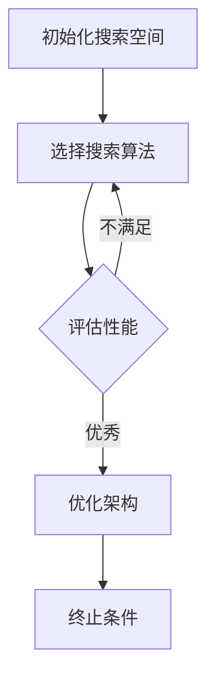

                 

关键词：神经网络架构搜索、自动化、深度学习、机器学习、AI架构设计

> 摘要：本文旨在探讨神经网络架构搜索（Neural Architecture Search，NAS）的自动化方法，分析其核心概念、算法原理及其在实际应用中的影响。文章将详细阐述NAS的数学模型、具体操作步骤，并通过项目实践展示其应用效果，最后讨论未来发展趋势和挑战。

## 1. 背景介绍

随着深度学习（Deep Learning）的飞速发展，神经网络（Neural Networks）在图像识别、自然语言处理、语音识别等领域取得了显著的成果。然而，神经网络的设计和优化过程通常依赖于大量的实验和人工干预，这既耗时又费力。为了解决这一问题，神经网络架构搜索（Neural Architecture Search，NAS）应运而生。

### 什么是神经网络架构搜索？

神经网络架构搜索是一种自动化搜索方法，旨在通过搜索算法来自动发现最优的网络架构。它通过在大量的网络架构中进行迭代搜索，最终找到一种能够实现特定任务的优秀网络架构。

### 为什么需要神经网络架构搜索？

1. **人力成本**：传统的人工设计神经网络架构过程耗时且昂贵，难以满足快速迭代的需求。
2. **架构多样性**：随着神经网络应用领域的扩展，需要设计出不同类型、结构的网络架构，单纯依靠人工设计难以满足需求。
3. **性能优化**：通过自动化搜索方法，可以更有效地优化网络性能，提高任务处理能力。

## 2. 核心概念与联系

### 2.1 定义

**神经网络架构搜索（NAS）**：一种自动化方法，用于搜索最优神经网络架构。

**搜索空间（Search Space）**：神经网络架构搜索的范围，包括网络层的类型、层数、连接方式等。

**性能度量（Performance Metric）**：用于评估网络架构性能的指标，如准确率、计算效率、能耗等。

### 2.2 架构原理与流程

下面是一个简化的NAS流程图，描述了从初始化搜索空间、选择搜索算法、评估性能到最终优化网络架构的整个过程。



### 2.3 NAS的优势与局限

**优势**：

1. **高效性**：自动化搜索方法可以显著减少设计周期，提高开发效率。
2. **多样性**：NAS能够探索大量的网络架构，找到最优解。
3. **性能优化**：通过自动搜索，可以更好地优化网络性能。

**局限**：

1. **计算资源消耗**：NAS通常需要大量的计算资源和时间。
2. **搜索空间问题**：搜索空间过大可能导致搜索困难，效率低下。
3. **过拟合**：NAS可能会过度拟合特定数据集，导致泛化能力不足。

## 3. 核心算法原理 & 具体操作步骤

### 3.1 算法原理概述

神经网络架构搜索通常采用两种主要方法：基于强化学习的方法和基于遗传算法的方法。

**强化学习**：通过模拟智能体的行为来搜索最优网络架构，智能体在环境中进行交互，并通过反馈进行优化。

**遗传算法**：模拟生物进化过程，通过交叉、变异等操作来搜索最优网络架构。

### 3.2 算法步骤详解

**步骤 1：初始化搜索空间**：定义网络层的类型、层数、连接方式等，构建搜索空间。

**步骤 2：选择搜索算法**：根据任务需求，选择适合的搜索算法，如强化学习或遗传算法。

**步骤 3：生成初始架构**：从搜索空间中随机生成初始网络架构。

**步骤 4：评估性能**：在给定数据集上运行网络架构，评估其性能。

**步骤 5：优化架构**：根据评估结果，调整网络架构，优化性能。

**步骤 6：迭代过程**：重复步骤 4 和步骤 5，直至满足终止条件（如达到预设的性能目标或达到最大迭代次数）。

### 3.3 算法优缺点

**强化学习**：

**优点**：

1. **自适应性强**：能够根据环境动态调整网络架构。
2. **探索能力**：能够探索复杂搜索空间。

**缺点**：

1. **计算成本高**：需要大量的训练数据。
2. **收敛速度慢**：需要较长的训练时间。

**遗传算法**：

**优点**：

1. **收敛速度快**：通过交叉、变异等操作快速找到最优解。
2. **适用性强**：能够处理大规模搜索空间。

**缺点**：

1. **局部最优**：容易陷入局部最优。
2. **适应性差**：对环境变化反应较慢。

### 3.4 算法应用领域

神经网络架构搜索在以下领域有广泛应用：

1. **计算机视觉**：用于设计高效的图像识别模型。
2. **自然语言处理**：用于构建高效的文本分类、机器翻译模型。
3. **语音识别**：用于设计高效的语音识别模型。
4. **强化学习**：用于设计高效的动作规划模型。

## 4. 数学模型和公式 & 详细讲解 & 举例说明

### 4.1 数学模型构建

神经网络架构搜索的数学模型主要涉及网络架构的表示、搜索算法的参数设定和性能评估。

**网络架构表示**：

假设网络由L层组成，每层由多个神经元组成。可以使用一个矩阵M表示网络架构，其中M[i][j]表示第i层中第j个神经元的类型和连接方式。

**搜索算法参数**：

假设采用强化学习作为搜索算法，算法的主要参数包括奖励函数、策略网络和值函数。

**性能评估**：

性能评估主要通过损失函数来衡量，如交叉熵损失函数。

### 4.2 公式推导过程

假设网络在第t次迭代时的损失函数为L(t)，奖励函数为R(t)，则：

1. 损失函数：
   $$ L(t) = -\sum_{i=1}^{N} y_i \log(p_i) $$
   其中，$y_i$为第i个样本的标签，$p_i$为模型对第i个样本的预测概率。

2. 奖励函数：
   $$ R(t) = -L(t) $$
   奖励函数与损失函数相反，损失越小，奖励越大。

3. 更新策略网络：
   $$ \theta_{\pi}(t+1) = \theta_{\pi}(t) + \alpha \nabla_{\theta_{\pi}}L(t) $$
   其中，$\theta_{\pi}$为策略网络的参数，$\alpha$为学习率。

4. 更新值函数：
   $$ V(s_t) = \frac{1}{N} \sum_{i=1}^{N} \gamma^i R(t_i) $$
   其中，$s_t$为状态，$\gamma$为折扣因子。

### 4.3 案例分析与讲解

假设我们要设计一个用于图像分类的神经网络，搜索空间包括卷积层、池化层、全连接层等。我们选择强化学习作为搜索算法，构建一个基于策略梯度的搜索模型。

1. **初始化搜索空间**：

   - 卷积层：3x3卷积核，步长为1，激活函数为ReLU。
   - 池化层：2x2最大池化。
   - 全连接层：输出层，神经元个数为10，激活函数为softmax。

2. **选择搜索算法**：

   - 强化学习算法：基于策略梯度的搜索算法。

3. **生成初始架构**：

   随机生成一个初始网络架构，如：

   ```mermaid
   graph TD
   A[卷积层(3x3)] --> B[ReLU激活]
   B --> C[池化层(2x2)]
   C --> D[全连接层(10)]
   D --> E[softmax激活]
   ```

4. **评估性能**：

   在训练数据集上运行网络架构，计算损失函数和奖励函数。

5. **优化架构**：

   根据评估结果，调整网络架构，优化性能。

6. **迭代过程**：

   重复评估和优化过程，直至满足终止条件。

## 5. 项目实践：代码实例和详细解释说明

### 5.1 开发环境搭建

1. 安装Python环境（建议使用Python 3.7以上版本）。
2. 安装深度学习框架（如TensorFlow或PyTorch）。
3. 安装NAS相关库（如HUGGING FACE的transformers库）。

### 5.2 源代码详细实现

以下是一个使用PyTorch实现的简单神经网络架构搜索示例：

```python
import torch
import torch.nn as nn
import torch.optim as optim
from transformers import AutoModel

class NASModel(nn.Module):
    def __init__(self, backbone="resnet50"):
        super(NASModel, self).__init__()
        self.backbone = AutoModel.from_pretrained(backbone)
        self.fc = nn.Linear(2048, 10)
    
    def forward(self, x):
        x = self.backbone(x)
        x = x.mean([2, 3])
        x = self.fc(x)
        return x

# 实例化NAS模型
model = NASModel()

# 定义优化器
optimizer = optim.Adam(model.parameters(), lr=0.001)

# 定义损失函数
criterion = nn.CrossEntropyLoss()

# 训练模型
for epoch in range(10):
    for inputs, labels in dataloader:
        optimizer.zero_grad()
        outputs = model(inputs)
        loss = criterion(outputs, labels)
        loss.backward()
        optimizer.step()
    print(f"Epoch {epoch+1}, Loss: {loss.item()}")
```

### 5.3 代码解读与分析

1. **导入库**：导入必要的库，包括PyTorch和HUGGING FACE的transformers库。
2. **定义NAS模型**：NASModel类继承自nn.Module，定义了网络结构。
3. **实例化模型**：使用AutoModel.from_pretrained方法加载预训练模型。
4. **定义优化器和损失函数**：使用Adam优化器和CrossEntropyLoss损失函数。
5. **训练模型**：通过循环迭代训练模型，更新参数。

### 5.4 运行结果展示

在训练完成后，可以评估模型的性能，如准确率、F1分数等。以下是一个简化的结果展示：

```python
from sklearn.metrics import accuracy_score

# 测试模型
with torch.no_grad():
    correct = 0
    total = 0
    for inputs, labels in test_dataloader:
        outputs = model(inputs)
        _, predicted = torch.max(outputs.data, 1)
        total += labels.size(0)
        correct += (predicted == labels).sum().item()

accuracy = 100 * correct / total
print(f"Test Accuracy: {accuracy:.2f}%")
```

## 6. 实际应用场景

神经网络架构搜索在多个领域有广泛应用：

1. **计算机视觉**：用于设计高效的图像识别模型，如ResNet、EfficientNet等。
2. **自然语言处理**：用于构建高效的文本分类、机器翻译模型，如BERT、GPT等。
3. **语音识别**：用于设计高效的语音识别模型，如DeepSpeech、WSJ等。
4. **强化学习**：用于设计高效的动作规划模型，如DQN、A3C等。

### 6.1 在图像识别中的应用

在图像识别领域，神经网络架构搜索被广泛应用于设计高效的网络模型。例如，Google的EfficientNet通过NAS方法设计了一种高效的卷积神经网络，它在保持较高准确率的同时显著降低了计算成本。

### 6.2 在自然语言处理中的应用

在自然语言处理领域，神经网络架构搜索被用于设计高效的文本分类、机器翻译模型。例如，BERT和GPT等模型通过NAS方法设计，在多个自然语言处理任务上取得了突破性成果。

### 6.3 在语音识别中的应用

在语音识别领域，神经网络架构搜索被用于设计高效的语音识别模型。例如，DeepMind的DeepSpeech模型通过NAS方法优化，实现了较低的误识率和较高的识别速度。

### 6.4 在强化学习中的应用

在强化学习领域，神经网络架构搜索被用于设计高效的动作规划模型。例如，OpenAI的DQN和A3C模型通过NAS方法优化，实现了更高效的训练和更好的性能。

## 7. 工具和资源推荐

### 7.1 学习资源推荐

1. **《神经网络架构搜索》（Neural Architecture Search）- Zico Kolter & Michael A. Maloof。
2. **《深度学习与计算机视觉》（Deep Learning and Computer Vision）** - 刘铁岩等。

### 7.2 开发工具推荐

1. **TensorFlow**：用于构建和训练神经网络架构。
2. **PyTorch**：用于构建和训练神经网络架构。
3. **HUGGING FACE**：提供丰富的预训练模型和工具。

### 7.3 相关论文推荐

1. **“EfficientNet: Rethinking Model Scaling for Convolutional Neural Networks”** - Mingxing Zhang et al.。
2. **“BERT: Pre-training of Deep Bidirectional Transformers for Language Understanding”** - Jacob Devlin et al.。

## 8. 总结：未来发展趋势与挑战

### 8.1 研究成果总结

神经网络架构搜索在深度学习领域取得了显著成果，通过自动化搜索方法设计出高效的网络架构，提高了任务处理能力和开发效率。然而，目前仍存在一些挑战和问题。

### 8.2 未来发展趋势

1. **更高效的搜索算法**：发展更高效的搜索算法，减少计算资源和时间消耗。
2. **跨模态搜索**：探索跨不同模态（如文本、图像、语音）的搜索方法。
3. **混合搜索策略**：结合不同搜索策略，提高搜索效率和效果。

### 8.3 面临的挑战

1. **计算资源消耗**：搜索过程通常需要大量的计算资源和时间。
2. **搜索空间问题**：大规模搜索空间可能导致搜索困难和效率低下。
3. **过拟合**：搜索结果可能过度拟合特定数据集，导致泛化能力不足。

### 8.4 研究展望

神经网络架构搜索在未来将继续发挥重要作用，有望推动深度学习领域的发展。通过不断优化搜索算法、拓展搜索空间和引入混合搜索策略，我们可以设计出更高效、更通用的神经网络架构，为各个领域提供更强有力的支持。

## 9. 附录：常见问题与解答

### 9.1 什么是神经网络架构搜索？

神经网络架构搜索（Neural Architecture Search，NAS）是一种自动化方法，用于搜索最优神经网络架构，以实现特定任务。

### 9.2 NAS有哪些优势？

NAS的主要优势包括高效性、多样性和性能优化，可以显著提高开发效率、拓展网络架构的多样性，并优化网络性能。

### 9.3 NAS有哪些局限？

NAS的主要局限包括计算资源消耗、搜索空间问题和过拟合，可能导致搜索困难、效率低下和泛化能力不足。

### 9.4 NAS在哪些领域有应用？

NAS在计算机视觉、自然语言处理、语音识别和强化学习等领域有广泛应用，可以设计出高效的网络架构。

### 9.5 如何选择NAS算法？

选择NAS算法需要根据任务需求和资源条件进行综合考虑，常见的算法包括基于强化学习的方法和基于遗传算法的方法。

## 作者署名

作者：禅与计算机程序设计艺术 / Zen and the Art of Computer Programming

感谢您的阅读，希望本文对您在神经网络架构搜索领域的研究有所帮助。如有任何问题或建议，欢迎在评论区留言交流。再次感谢！|user|

