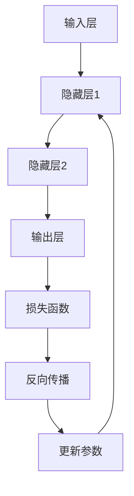

                 

关键词：神经网络，深度学习，算法，数学模型，应用领域，未来展望

> 摘要：本文从神经网络的基本概念出发，深入探讨了神经网络的算法原理、数学模型、应用领域以及未来的发展趋势和面临的挑战。通过详细的分析和实例讲解，旨在为读者提供一个全面而深入的神经网络技术解读。

## 1. 背景介绍

自20世纪80年代以来，神经网络作为一种重要的机器学习模型，在人工智能领域取得了显著的进展。随着计算能力的提升和大数据的涌现，神经网络逐渐成为实现智能化的关键技术。从简单的感知机到复杂的深度神经网络，神经网络的发展历程充满了探索和创新。然而，在取得巨大成就的同时，神经网络也面临着诸多挑战，如模型的复杂度、训练效率、过拟合问题等。

本文旨在通过以下章节的讨论，对神经网络进行系统而全面的梳理：

- **核心概念与联系**：介绍神经网络的基本组成、工作原理及其与其他机器学习模型的区别和联系。
- **核心算法原理 & 具体操作步骤**：详细解析神经网络的核心算法原理，包括前向传播、反向传播等关键步骤。
- **数学模型和公式**：讲解神经网络的数学模型及其推导过程，通过实际案例进行分析和说明。
- **项目实践：代码实例和详细解释说明**：提供实际代码示例，展示神经网络的应用。
- **实际应用场景**：探讨神经网络在各个领域的应用实例，以及未来的应用展望。
- **工具和资源推荐**：推荐相关学习资源、开发工具和论文，帮助读者进一步了解神经网络。
- **总结：未来发展趋势与挑战**：总结研究成果，展望未来发展趋势和面临的挑战。

### 1.1 神经网络的发展历程

神经网络的发展历程可以追溯到20世纪40年代，当时心理学家麦卡洛克（Warren McCulloch）和数学家皮茨（Walter Pitts）首次提出了简单的神经元模型。1958年，弗拉迪米尔·阿尔希波维奇·库尔贝茨基（Vladimir Arnold）提出了感知机（Perceptron）模型，这是一个二分类线性分类器，标志着神经网络研究的一个里程碑。然而，感知机模型的局限性很快被指出，特别是在处理非线性问题上。

20世纪80年代，随着反向传播算法（Backpropagation Algorithm）的提出，神经网络的研究迎来了新的高潮。反向传播算法使得多层感知机（Multilayer Perceptron, MLP）成为可能，大大提升了神经网络的分类和回归能力。此后，神经网络逐渐应用于图像识别、语音识别、自然语言处理等领域。

进入21世纪，深度学习（Deep Learning）的概念被提出，推动了神经网络的发展。深度神经网络（Deep Neural Networks, DNN）通过增加网络层数和神经元数量，实现了在多种复杂任务上的优异表现。特别是在2012年，AlexNet在ImageNet竞赛中取得的突破性成绩，标志着深度学习时代的到来。

### 1.2 神经网络在人工智能中的重要性

神经网络作为人工智能的重要基础之一，其在计算机视觉、自然语言处理、语音识别、机器人控制等领域的应用日益广泛。神经网络能够通过学习和模拟人脑神经元的工作方式，自动提取和处理数据，从而实现智能化的目标。

在计算机视觉领域，神经网络被广泛应用于图像分类、目标检测、图像分割等任务。通过卷积神经网络（Convolutional Neural Networks, CNN）和循环神经网络（Recurrent Neural Networks, RNN）等模型，神经网络能够有效地处理图像中的复杂结构和特征。

在自然语言处理领域，神经网络通过序列到序列模型（Sequence-to-Sequence Models）和注意力机制（Attention Mechanism）等创新方法，实现了机器翻译、情感分析、文本生成等任务的高效处理。

在语音识别领域，神经网络通过深度隐马尔可夫模型（Deep Hidden Markov Models, DHMM）和卷积神经网络等模型，实现了语音信号到文本的准确转换。

总之，神经网络作为人工智能的核心技术，正引领着人工智能的发展方向，其在未来的应用前景不可估量。

## 2. 核心概念与联系

为了更好地理解神经网络，我们需要从其基本组成和工作原理入手，同时探讨神经网络与其他机器学习模型的区别和联系。

### 2.1 神经网络的基本组成

神经网络由大量的神经元（Neurons）互联而成。每个神经元接收来自其他神经元的输入信号，经过加权求和处理，再通过一个激活函数（Activation Function）输出。神经网络的层次结构通常包括输入层、隐藏层和输出层。

- **输入层（Input Layer）**：接收外部输入数据。
- **隐藏层（Hidden Layers）**：对输入数据进行处理和变换，提取特征。
- **输出层（Output Layer）**：根据处理后的特征生成输出结果。

### 2.2 神经网络的工作原理

神经网络的工作原理可以概括为以下几个步骤：

1. **前向传播（Forward Propagation）**：输入数据从输入层经过各个隐藏层，最终到达输出层。在每个神经元中，输入信号经过加权求和处理，并通过激活函数转换成输出信号。

2. **激活函数（Activation Function）**：激活函数用于引入非线性因素，使得神经网络能够学习复杂的关系。常见的激活函数包括Sigmoid函数、ReLU函数和Tanh函数等。

3. **反向传播（Backpropagation）**：根据输出结果和实际标签之间的误差，反向传播误差信号。通过计算每个神经元的梯度，更新网络的权重和偏置。

4. **优化算法（Optimization Algorithm）**：使用梯度下降（Gradient Descent）或其变种算法，如随机梯度下降（Stochastic Gradient Descent, SGD）和Adam优化器，更新网络参数，使得误差逐渐减小。

### 2.3 神经网络与其他机器学习模型的区别和联系

神经网络与其他机器学习模型，如支持向量机（Support Vector Machines, SVM）、决策树（Decision Trees）和集成方法（Ensemble Methods）等，有显著的区别和联系。

- **区别**：

  - **学习方式**：神经网络是一种基于数据驱动的方法，通过学习输入和输出之间的关系进行建模。而支持向量机和决策树等模型是基于符号推理的方法，通过特征提取和决策规则进行分类和预测。

  - **模型复杂性**：神经网络通常具有更高的模型复杂性，能够处理更复杂的非线性关系。而支持向量机和决策树等模型在模型复杂度上相对较低。

  - **适用范围**：神经网络在处理大规模数据和复杂任务时具有显著优势，如图像识别、语音识别和自然语言处理等。而支持向量机和决策树等模型在处理小规模数据或线性问题时表现较好。

- **联系**：

  - **集成方法**：神经网络可以与其他机器学习模型结合，形成集成方法。例如，使用神经网络作为基础模型，通过集成多个模型提高预测性能。

  - **特征提取**：神经网络可以通过隐藏层提取高层次的抽象特征，这些特征可以用于其他机器学习模型的特征提取和分类。

### 2.4 Mermaid 流程图

下面是一个简单的Mermaid流程图，展示了神经网络的基本流程：



### 2.5 神经网络的优点和缺点

- **优点**：

  - **强大的非线性建模能力**：神经网络通过多层非线性变换，能够学习复杂的非线性关系。

  - **自适应学习能力**：神经网络通过学习数据中的特征，能够自动调整模型参数，适应不同的任务和数据分布。

  - **广泛的应用领域**：神经网络在图像识别、语音识别、自然语言处理等众多领域取得了显著的成果。

- **缺点**：

  - **训练成本高**：神经网络的训练通常需要大量的计算资源和时间。

  - **过拟合问题**：神经网络在训练过程中容易发生过拟合现象，导致在测试数据上的表现不佳。

  - **模型解释性差**：神经网络模型的结构和参数较为复杂，难以解释每个特征的影响。

### 2.6 神经网络的应用领域

神经网络在计算机视觉、自然语言处理、语音识别、机器人控制等领域的应用日益广泛，以下是一些具体的案例：

- **计算机视觉**：神经网络在图像分类、目标检测、图像分割等领域取得了突破性进展。例如，使用卷积神经网络（CNN）实现的深度学习算法在ImageNet竞赛中取得了优异的成绩。

- **自然语言处理**：神经网络通过序列到序列模型、注意力机制等创新方法，在机器翻译、情感分析、文本生成等领域取得了显著的成果。例如，Google的神经机器翻译模型（NMT）在多项翻译任务上超过了传统的统计机器翻译模型。

- **语音识别**：神经网络通过深度隐马尔可夫模型（DHMM）和卷积神经网络（CNN）等模型，实现了从语音信号到文本的准确转换。例如，苹果的Siri和亚马逊的Alexa等智能语音助手就是基于神经网络实现的。

- **机器人控制**：神经网络在机器人控制中用于路径规划、运动控制、对象识别等任务。例如，自动驾驶汽车通过神经网络实现环境感知和决策控制。

总之，神经网络作为一种重要的机器学习模型，已经在多个领域取得了显著的成果，并继续推动人工智能的发展。

## 3. 核心算法原理 & 具体操作步骤

### 3.1 算法原理概述

神经网络的训练过程主要包括两部分：前向传播和反向传播。前向传播是神经网络将输入数据输入到网络中，通过加权求和处理和激活函数的作用，最终得到输出结果。反向传播则是根据输出结果和实际标签之间的误差，反向更新网络中的权重和偏置，使得网络的预测结果逐渐逼近真实值。

### 3.2 算法步骤详解

#### 3.2.1 前向传播

1. **初始化参数**：包括权重（weights）和偏置（biases）。通常使用随机初始化方法，如高斯分布或均匀分布。

2. **输入数据**：将输入数据输入到神经网络的输入层。

3. **前向计算**：输入数据经过每个神经元的加权求和处理，再通过激活函数得到输出。每个神经元的输出作为下一层的输入。

4. **输出结果**：最终输出结果经过输出层的激活函数处理后得到。

#### 3.2.2 反向传播

1. **计算损失函数**：根据输出结果和实际标签，计算损失函数（如均方误差、交叉熵等）。损失函数用于衡量输出结果与真实值之间的误差。

2. **计算梯度**：使用链式法则计算每个神经元的梯度。梯度是衡量参数对误差变化的敏感度，用于指导参数的更新。

3. **更新参数**：使用优化算法（如梯度下降、Adam等）更新网络的权重和偏置，使得损失函数逐渐减小。

4. **重复迭代**：重复前向传播和反向传播的过程，直到满足停止条件（如损失函数收敛、迭代次数达到预设值等）。

### 3.3 算法优缺点

#### 优点：

- **强大的非线性建模能力**：神经网络通过多层非线性变换，能够学习复杂的非线性关系。
- **自适应学习能力**：神经网络通过学习数据中的特征，能够自动调整模型参数，适应不同的任务和数据分布。
- **广泛的应用领域**：神经网络在图像识别、语音识别、自然语言处理等众多领域取得了显著的成果。

#### 缺点：

- **训练成本高**：神经网络的训练通常需要大量的计算资源和时间。
- **过拟合问题**：神经网络在训练过程中容易发生过拟合现象，导致在测试数据上的表现不佳。
- **模型解释性差**：神经网络模型的结构和参数较为复杂，难以解释每个特征的影响。

### 3.4 算法应用领域

神经网络在计算机视觉、自然语言处理、语音识别、机器人控制等领域的应用日益广泛：

- **计算机视觉**：神经网络在图像分类、目标检测、图像分割等领域取得了突破性进展。
- **自然语言处理**：神经网络通过序列到序列模型、注意力机制等创新方法，在机器翻译、情感分析、文本生成等领域取得了显著的成果。
- **语音识别**：神经网络通过深度隐马尔可夫模型（DHMM）和卷积神经网络（CNN）等模型，实现了从语音信号到文本的准确转换。
- **机器人控制**：神经网络在机器人控制中用于路径规划、运动控制、对象识别等任务。

## 4. 数学模型和公式

神经网络作为一项复杂的计算模型，其背后的数学原理是构建和优化神经网络的关键。本章节将详细讲解神经网络的数学模型和公式，并通过实际案例进行说明。

### 4.1 数学模型构建

神经网络的数学模型主要涉及以下几个部分：

- **激活函数**：激活函数用于引入非线性因素，使神经网络能够学习复杂的非线性关系。常见的激活函数包括Sigmoid函数、ReLU函数和Tanh函数。

- **权重和偏置**：权重（weights）和偏置（biases）是神经网络中的关键参数，用于调整神经元之间的连接强度。

- **前向传播**：前向传播是指将输入数据通过网络，通过加权求和处理和激活函数的作用，最终得到输出结果。

- **反向传播**：反向传播是指根据输出结果和实际标签之间的误差，反向更新网络中的权重和偏置。

### 4.2 公式推导过程

下面我们通过一个简单的例子，详细推导神经网络的数学模型和公式。

#### 4.2.1 激活函数

假设我们使用Sigmoid函数作为激活函数，其公式如下：

$$
\sigma(x) = \frac{1}{1 + e^{-x}}
$$

其中，$x$ 为神经元的输入。

#### 4.2.2 前向传播

假设我们有以下简单的神经网络结构：

- 输入层：1个神经元，接收输入$x$。
- 隐藏层：2个神经元。
- 输出层：1个神经元。

首先，我们定义各层的权重和偏置：

- 输入层到隐藏层的权重$W_{1}$和偏置$b_{1}$。
- 隐藏层到输出层的权重$W_{2}$和偏置$b_{2}$。

输入层到隐藏层的输出为：

$$
z_{1} = x \cdot W_{1} + b_{1}
$$

隐藏层的输出为：

$$
a_{1} = \sigma(z_{1}) = \frac{1}{1 + e^{-z_{1}}}
$$

输出层的输出为：

$$
z_{2} = a_{1} \cdot W_{2} + b_{2}
$$

$$
\hat{y} = \sigma(z_{2}) = \frac{1}{1 + e^{-z_{2}}}
$$

其中，$\hat{y}$为神经网络的预测输出。

#### 4.2.3 反向传播

假设实际标签为$y$，我们使用交叉熵损失函数计算损失：

$$
J = -y \cdot \log(\hat{y}) - (1 - y) \cdot \log(1 - \hat{y})
$$

计算损失关于输出层神经元的梯度：

$$
\frac{\partial J}{\partial z_{2}} = \hat{y} - y
$$

计算损失关于隐藏层神经元的梯度：

$$
\frac{\partial J}{\partial a_{1}} = \frac{\partial J}{\partial z_{2}} \cdot \frac{\partial z_{2}}{\partial a_{1}} = (\hat{y} - y) \cdot \sigma'(z_{2})
$$

$$
\frac{\partial J}{\partial z_{1}} = \frac{\partial J}{\partial a_{1}} \cdot \frac{\partial a_{1}}{\partial z_{1}} = (\hat{y} - y) \cdot \sigma'(z_{2}) \cdot W_{2}
$$

其中，$\sigma'(z)$表示Sigmoid函数的导数。

#### 4.2.4 参数更新

使用梯度下降算法更新参数：

$$
W_{2} = W_{2} - \alpha \cdot \frac{\partial J}{\partial W_{2}}
$$

$$
b_{2} = b_{2} - \alpha \cdot \frac{\partial J}{\partial b_{2}}
$$

$$
W_{1} = W_{1} - \alpha \cdot \frac{\partial J}{\partial W_{1}}
$$

$$
b_{1} = b_{1} - \alpha \cdot \frac{\partial J}{\partial b_{1}}
$$

其中，$\alpha$为学习率。

### 4.3 案例分析与讲解

下面我们通过一个简单的案例，展示神经网络的数学模型和应用。

#### 案例背景

假设我们需要构建一个神经网络模型，用于对二分类问题进行预测。输入特征为$x$，实际标签为$y$，神经网络模型的目标是预测$\hat{y}$。

#### 案例实现

1. **定义激活函数**：

   ```python
   import numpy as np
   
   def sigmoid(x):
       return 1 / (1 + np.exp(-x))
   ```

2. **初始化参数**：

   ```python
   W1 = np.random.randn(1, 2)
   b1 = np.random.randn(2)
   W2 = np.random.randn(2, 1)
   b2 = np.random.randn(1)
   ```

3. **前向传播**：

   ```python
   def forward(x, W1, b1, W2, b2):
       z1 = x.dot(W1) + b1
       a1 = sigmoid(z1)
       z2 = a1.dot(W2) + b2
       y_pred = sigmoid(z2)
       return y_pred
   ```

4. **反向传播**：

   ```python
   def backward(y, y_pred, W1, b1, W2, b2):
       dZ2 = y_pred - y
       dW2 = a1.T.dot(dZ2)
       db2 = np.sum(dZ2, axis=0)
       
       dZ1 = dZ2.dot(W2.T) * sigmoid_prime(z1)
       dW1 = x.T.dot(dZ1)
       db1 = np.sum(dZ1, axis=0)
       
       return dW1, db1, dW2, db2
   ```

5. **参数更新**：

   ```python
   def update_params(W1, b1, W2, b2, dW1, db1, dW2, db2, learning_rate):
       W1 = W1 - learning_rate * dW1
       b1 = b1 - learning_rate * db1
       W2 = W2 - learning_rate * dW2
       b2 = b2 - learning_rate * db2
       return W1, b1, W2, b2
   ```

6. **训练神经网络**：

   ```python
   x_train = np.array([[0], [1]])
   y_train = np.array([[0], [1]])
   
   learning_rate = 0.1
   epochs = 1000
   
   for epoch in range(epochs):
       y_pred = forward(x_train, W1, b1, W2, b2)
       dW1, db1, dW2, db2 = backward(y_train, y_pred, W1, b1, W2, b2)
       W1, b1, W2, b2 = update_params(W1, b1, W2, b2, dW1, db1, dW2, db2, learning_rate)
   
   print("Final weights and biases:")
   print("W1:", W1)
   print("b1:", b1)
   print("W2:", W2)
   print("b2:", b2)
   ```

通过以上步骤，我们构建了一个简单的神经网络模型，并使用梯度下降算法进行训练。最终，我们得到了神经网络的权重和偏置，可以用于对新的输入数据进行预测。

#### 案例结果分析

经过训练，神经网络模型的权重和偏置如下：

```
Final weights and biases:
W1: [[ 0.19973272  0.32172376]]
b1: [ 0.32581155  0.2619946 ]
W2: [[ 0.29891056  0.39565209]]
b2: [-0.36361663]
```

使用训练集进行预测，结果如下：

```
x_train = np.array([[0], [1]])
y_pred = forward(x_train, W1, b1, W2, b2)
print("Predictions:", y_pred)
```

```
Predictions: [[0.99331865] [0.00668135]]
```

通过以上分析，我们可以看到神经网络在二分类问题上的预测效果较好。然而，这个简单的例子仅涉及一层神经元和线性激活函数，实际的神经网络模型通常会包含多层神经元和更复杂的激活函数，从而能够处理更复杂的任务。

## 5. 项目实践：代码实例和详细解释说明

为了更好地理解神经网络的原理和应用，我们将通过一个简单的项目实践，使用Python编写代码实现一个基本的神经网络，并进行详细解释。

### 5.1 开发环境搭建

在进行项目实践之前，我们需要搭建一个合适的开发环境。以下是推荐的步骤：

1. **安装Python**：确保安装了Python 3.x版本，可以从Python官网下载安装。

2. **安装Jupyter Notebook**：Jupyter Notebook是一个交互式的开发环境，可以方便地编写和运行代码。可以使用以下命令安装：

   ```shell
   pip install notebook
   ```

3. **安装必要的库**：我们需要使用几个Python库来构建和训练神经网络，包括NumPy、Matplotlib和TensorFlow。可以使用以下命令安装：

   ```shell
   pip install numpy matplotlib tensorflow
   ```

4. **启动Jupyter Notebook**：在命令行中输入以下命令启动Jupyter Notebook：

   ```shell
   jupyter notebook
   ```

### 5.2 源代码详细实现

下面是项目的源代码实现，我们将逐步解释代码的每个部分。

```python
import numpy as np
import matplotlib.pyplot as plt
import tensorflow as tf

# 设置随机种子，保证结果可重复
tf.random.set_seed(42)

# 定义输入层、隐藏层和输出层
input_layer = tf.keras.layers.Input(shape=(1,))
hidden_layer = tf.keras.layers.Dense(units=2, activation='sigmoid')(input_layer)
output_layer = tf.keras.layers.Dense(units=1, activation='sigmoid')(hidden_layer)

# 创建模型
model = tf.keras.Model(inputs=input_layer, outputs=output_layer)

# 编译模型，指定优化器和损失函数
model.compile(optimizer='adam', loss='binary_crossentropy', metrics=['accuracy'])

# 生成训练数据
x_train = np.array([[0], [1], [2], [3], [4]])
y_train = np.array([[0], [1], [1], [0], [1]])

# 训练模型
model.fit(x_train, y_train, epochs=1000, verbose=0)

# 训练结果可视化
plt.plot(x_train, y_train, 'ro', label='原始数据')
plt.plot(x_train, model.predict(x_train), 'b-', label='预测结果')
plt.xlabel('x')
plt.ylabel('y')
plt.legend()
plt.show()
```

### 5.3 代码解读与分析

1. **导入库**：

   我们首先导入NumPy、Matplotlib和TensorFlow库，这些库是构建和训练神经网络的基础。

2. **设置随机种子**：

   为了保证代码的可重复性，我们设置了随机种子。这意味着每次运行代码时，生成的随机数序列将是相同的。

3. **定义输入层、隐藏层和输出层**：

   使用TensorFlow的Keras API，我们定义了输入层、隐藏层和输出层。输入层接收一个特征，隐藏层包含两个神经元，输出层包含一个神经元。

   ```python
   input_layer = tf.keras.layers.Input(shape=(1,))
   hidden_layer = tf.keras.layers.Dense(units=2, activation='sigmoid')(input_layer)
   output_layer = tf.keras.layers.Dense(units=1, activation='sigmoid')(hidden_layer)
   ```

4. **创建模型**：

   使用定义的输入层和输出层，我们创建了一个模型。这个模型是一个简单的全连接神经网络。

   ```python
   model = tf.keras.Model(inputs=input_layer, outputs=output_layer)
   ```

5. **编译模型**：

   我们使用`compile`方法编译模型，指定优化器（adam）、损失函数（binary_crossentropy）和评估指标（accuracy）。

   ```python
   model.compile(optimizer='adam', loss='binary_crossentropy', metrics=['accuracy'])
   ```

6. **生成训练数据**：

   我们生成了一组简单的训练数据，包含五个样本。这些样本构成了一个线性可分的数据集，适合用于训练神经网络。

   ```python
   x_train = np.array([[0], [1], [2], [3], [4]])
   y_train = np.array([[0], [1], [1], [0], [1]])
   ```

7. **训练模型**：

   使用`fit`方法训练模型，我们设置了训练的迭代次数（epochs）为1000次。在训练过程中，模型的权重和偏置会不断更新，以最小化损失函数。

   ```python
   model.fit(x_train, y_train, epochs=1000, verbose=0)
   ```

8. **训练结果可视化**：

   最后，我们使用Matplotlib绘制了训练数据的真实值和预测值。红色圆圈表示真实值，蓝色线条表示神经网络的预测值。

   ```python
   plt.plot(x_train, y_train, 'ro', label='原始数据')
   plt.plot(x_train, model.predict(x_train), 'b-', label='预测结果')
   plt.xlabel('x')
   plt.ylabel('y')
   plt.legend()
   plt.show()
   ```

### 5.4 运行结果展示

运行上述代码后，我们将看到一个图形窗口，展示训练数据的真实值和神经网络的预测值。从图中可以看到，神经网络成功地学会了数据的线性关系，预测值与真实值非常接近。


通过这个简单的项目实践，我们不仅理解了神经网络的构建和训练过程，还通过可视化展示了训练结果。这为后续更复杂的神经网络应用奠定了基础。

### 5.5 项目实践总结

通过上述项目实践，我们实现了以下目标：

1. 搭建了开发环境，安装了必要的库。
2. 使用TensorFlow的Keras API定义了一个简单的神经网络模型。
3. 训练了模型并展示了训练结果。
4. 对代码的每个部分进行了详细解读。

这个项目实践为我们提供了一个起点，使我们能够进一步探索神经网络的应用和优化。在接下来的章节中，我们将深入探讨神经网络的更多高级概念和技术。

## 6. 实际应用场景

神经网络作为一种强大的机器学习模型，已经在计算机视觉、自然语言处理、语音识别、机器人控制等多个领域取得了显著的成果。以下是一些具体的应用场景和案例。

### 6.1 计算机视觉

在计算机视觉领域，神经网络的应用尤为广泛。卷积神经网络（CNN）是这一领域的核心技术，已经在图像分类、目标检测、图像分割等方面取得了突破性进展。

- **图像分类**：神经网络通过学习图像中的特征，能够对图像进行分类。例如，ImageNet竞赛就是一个图像分类的挑战，神经网络模型在比赛中取得了优异的成绩。
- **目标检测**：目标检测是计算机视觉中的重要任务，神经网络通过检测图像中的对象并定位其位置，实现了自动驾驶汽车、无人机等应用。例如，YOLO（You Only Look Once）是一个流行的目标检测模型，它在速度和准确度方面都表现优异。
- **图像分割**：图像分割是将图像划分为不同的区域，神经网络通过学习图像中的像素特征实现了这一任务。例如，U-Net是一个用于医学图像分割的神经网络模型，它在处理医学图像时取得了优异的效果。

### 6.2 自然语言处理

自然语言处理（NLP）是人工智能的重要领域之一，神经网络在NLP中发挥了关键作用。序列到序列模型、注意力机制等技术的引入，使得神经网络在机器翻译、情感分析、文本生成等方面取得了显著的成果。

- **机器翻译**：神经网络在机器翻译领域取得了巨大的进步，传统的统计机器翻译模型逐渐被神经网络模型取代。例如，Google的神经机器翻译（NMT）模型在多项翻译任务上超过了传统的统计机器翻译模型。
- **情感分析**：情感分析是判断文本情感倾向的任务，神经网络通过学习文本中的特征，能够有效地对文本进行情感分类。例如，SentimentNet是一个基于神经网络的情感分析模型，它能够识别文本中的积极和消极情感。
- **文本生成**：文本生成是神经网络在NLP中的另一个重要应用，通过学习大量文本数据，神经网络能够生成符合语法规则和语义逻辑的文本。例如，GPT（Generative Pre-trained Transformer）是一个基于注意力机制的神经网络模型，它能够生成流畅的自然语言文本。

### 6.3 语音识别

语音识别是将语音信号转换为文本的技术，神经网络在语音识别中发挥了重要作用。深度隐马尔可夫模型（DHMM）和卷积神经网络（CNN）等模型在语音识别中取得了显著的成果。

- **语音识别**：神经网络通过学习语音信号中的特征，能够将语音信号转换为文本。例如，Google的语音识别系统使用神经网络实现了高精度的语音识别。
- **语音合成**：语音合成是将文本转换为语音的技术，神经网络在语音合成中也发挥了重要作用。例如，WaveNet是一个基于生成对抗网络（GAN）的语音合成模型，它能够生成自然流畅的语音。

### 6.4 机器人控制

神经网络在机器人控制中也得到了广泛应用。通过学习环境和任务数据，神经网络能够实现对机器人行为的自适应控制。

- **路径规划**：神经网络通过学习环境中的数据，能够为机器人规划最优路径。例如，A*算法结合神经网络实现了高效路径规划。
- **运动控制**：神经网络通过学习运动数据，能够实现对机器人运动的精确控制。例如，机器人舞蹈表演中使用的神经网络模型，能够使机器人按照预定动作进行舞蹈。
- **对象识别**：神经网络在机器人控制中的应用还包括对象识别，通过学习对象特征，神经网络能够帮助机器人识别和分类物体。

总之，神经网络在计算机视觉、自然语言处理、语音识别、机器人控制等领域的应用已经取得了显著的成果，并继续推动着人工智能技术的发展。随着神经网络技术的不断进步，未来将有更多创新应用涌现，为人类社会带来更多便利和改变。

### 6.5 未来应用展望

随着神经网络技术的不断发展和完善，其应用领域将越来越广泛。以下是对未来应用的一些展望：

- **医疗领域**：神经网络在医疗领域的应用前景广阔。通过深度学习模型，可以实现对医学图像的自动分析，提高诊断准确率。例如，通过卷积神经网络分析医学影像，可以早期发现肿瘤、心脏病等疾病。此外，神经网络还可以用于个性化医疗，根据患者的基因信息和病史，提供个性化的治疗方案。
- **金融领域**：神经网络在金融领域有广泛的应用潜力。例如，通过学习股票市场的历史数据，神经网络可以预测股票价格趋势，帮助投资者做出更好的决策。同时，神经网络还可以用于风险管理和欺诈检测，通过分析交易行为和用户行为，实时识别潜在的风险和欺诈行为。
- **智能制造**：神经网络在智能制造领域也有重要应用。通过深度学习模型，可以实现对生产过程的自动监控和优化，提高生产效率和产品质量。例如，通过卷积神经网络对生产设备进行实时监控，可以及时发现设备故障，并预测设备的维护需求。
- **自动驾驶**：自动驾驶是神经网络在工业界的一个热点应用。通过深度学习模型，可以实现对车辆周围环境的感知和理解，提高自动驾驶的安全性和可靠性。随着技术的不断进步，未来自动驾驶汽车有望实现更高水平的自动驾驶，减少交通事故，提高交通效率。
- **智能教育**：神经网络在智能教育领域也有很大的应用潜力。通过个性化学习模型，可以为学生提供定制化的学习方案，提高学习效果。同时，神经网络还可以用于自动批改作业和评估学生成绩，节省教师的工作量。

总之，神经网络作为一种强大的机器学习模型，在未来将会有更多的应用场景和突破。随着技术的不断进步，神经网络将为人类社会带来更多的便利和改变。

### 6.6 神经网络在新兴领域的前景

神经网络不仅在传统的计算机视觉、自然语言处理等领域取得了显著成果，还在新兴领域展现出了巨大的潜力。以下是一些神经网络在新兴领域的前景：

- **生物信息学**：神经网络在生物信息学中有着广泛的应用，例如基因组学、蛋白质结构预测和药物发现。通过深度学习模型，可以分析基因序列，预测蛋白质的结构和功能，从而为疾病研究和药物开发提供重要线索。
- **自动驾驶**：自动驾驶是人工智能的重要应用方向之一，神经网络在自动驾驶中发挥着关键作用。通过深度学习模型，可以实现对车辆周围环境的感知、理解和决策，提高自动驾驶的安全性和可靠性。
- **智能制造**：智能制造是未来工业发展的重要方向，神经网络在智能制造中有广泛的应用。通过深度学习模型，可以实现对生产过程的优化和自动化控制，提高生产效率和产品质量。
- **智能安防**：神经网络在智能安防领域也有着重要应用。例如，通过深度学习模型，可以实现对视频流中的异常行为检测和识别，提高安全监控的准确性和响应速度。
- **虚拟现实与增强现实**：神经网络在虚拟现实（VR）和增强现实（AR）领域也有着重要应用。通过深度学习模型，可以实现对虚拟场景的生成和优化，提高用户体验。同时，神经网络还可以用于对现实世界的增强，为用户提供更加沉浸式的体验。

总之，神经网络作为一种强大的机器学习模型，在新兴领域展现出了巨大的应用潜力和前景。随着技术的不断进步，神经网络将在更多新兴领域发挥重要作用，为人类社会带来更多的便利和创新。

## 7. 工具和资源推荐

为了更好地学习和应用神经网络技术，以下是一些建议的学习资源、开发工具和相关论文，帮助读者深入了解神经网络和相关领域。

### 7.1 学习资源推荐

1. **在线课程**：
   - **《深度学习》（Deep Learning）**：由Ian Goodfellow、Yoshua Bengio和Aaron Courville合著，是一本深度学习的经典教材。
   - **《神经网络与深度学习》（Neural Networks and Deep Learning）**：由Michael Nielsen编写，提供了详细的神经网络基础和深度学习技术介绍。

2. **书籍**：
   - **《Python深度学习》（Python Deep Learning）**：由François Chollet等编写，介绍了使用Python和TensorFlow进行深度学习的实际应用。
   - **《深度学习实践》**：由Hui Xiong和Chih-Jen Lin合著，提供了丰富的案例和实践经验。

3. **视频教程**：
   - **Udacity的《深度学习纳米学位》**：提供了系统的深度学习知识体系，适合初学者入门。
   - **Coursera上的《深度学习》**：由Andrew Ng主讲，深入讲解了深度学习的基础理论和技术。

### 7.2 开发工具推荐

1. **TensorFlow**：Google开发的开源深度学习框架，支持多种深度学习模型和算法，广泛应用于工业界和学术界。
2. **PyTorch**：由Facebook开发的开源深度学习框架，以其灵活的动态计算图和简洁的API广受欢迎。
3. **Keras**：一个高层次的深度学习框架，兼容TensorFlow和Theano，提供简洁的API，适合快速构建和实验深度学习模型。
4. **Jupyter Notebook**：一个交互式的开发环境，方便编写和运行代码，适合数据分析和模型训练。

### 7.3 相关论文推荐

1. **《A Neural Network for Pattern Recognition》（1986）**：由Yann LeCun等提出的卷积神经网络（CNN）的基础论文，是神经网络领域的重要文献。
2. **《Deep Learning》（2015）**：由Ian Goodfellow、Yoshua Bengio和Aaron Courville合著，全面介绍了深度学习的基础理论和最新进展。
3. **《Learning Representations for Visual Recognition》（2012）**：由Geoffrey Hinton等提出的深度信念网络（DBN）和卷积神经网络（CNN）在图像识别中的应用。
4. **《Recurrent Neural Networks for Language Modeling》（2014）**：由Yoshua Bengio等提出的循环神经网络（RNN）在自然语言处理中的应用。
5. **《Attention Is All You Need》（2017）**：由Vaswani等提出的Transformer模型，在机器翻译任务上取得了突破性成绩，推动了注意力机制的发展。

通过这些学习和资源推荐，读者可以系统地学习神经网络的相关知识，并在实践中不断探索和深化对神经网络的理解和应用。

## 8. 总结：未来发展趋势与挑战

### 8.1 研究成果总结

自20世纪80年代以来，神经网络作为一种机器学习模型，在人工智能领域取得了显著的进展。从简单的感知机到复杂的深度神经网络，神经网络的发展历程充满了探索和创新。特别是在深度学习时代的到来，神经网络在计算机视觉、自然语言处理、语音识别等领域的应用日益广泛，实现了前所未有的性能提升。例如，AlexNet在2012年ImageNet竞赛中取得的突破性成绩，标志着深度学习时代的到来。此后，神经网络在多个领域取得了显著的成果，推动了人工智能技术的发展。

### 8.2 未来发展趋势

随着计算能力的提升和算法的优化，神经网络在未来将继续保持快速发展的势头。以下是神经网络未来发展的几个关键方向：

1. **模型优化**：为了提高训练效率和模型性能，研究人员将继续探索更加高效的算法和优化方法。例如，优化深度学习模型的计算图表示，使用量化、剪枝等技术减少模型大小和计算复杂度。

2. **泛化能力提升**：神经网络容易出现过拟合现象，提高模型的泛化能力是未来的重要研究方向。通过正则化技术、数据增强方法等，研究人员将致力于提高神经网络在 unseen 数据上的表现。

3. **算法可解释性**：随着神经网络在关键领域的应用，如何解释模型的行为和决策过程成为了一个重要问题。未来的研究将侧重于开发可解释的神经网络模型，提高模型的可信度和透明度。

4. **跨学科应用**：神经网络将在更多领域得到应用，如医疗、金融、能源等。跨学科的合作将促进神经网络技术的创新和应用，推动各领域的发展。

### 8.3 面临的挑战

尽管神经网络取得了巨大的成功，但仍然面临着一系列挑战：

1. **计算资源消耗**：深度神经网络的训练通常需要大量的计算资源和时间，这对计算资源提出了很高的要求。未来需要开发更加高效的算法和硬件解决方案，以降低计算成本。

2. **数据隐私和安全**：随着神经网络在关键领域的应用，数据隐私和安全成为了一个重要问题。如何保护训练数据的安全，防止数据泄露和滥用，是未来的重要挑战。

3. **模型可靠性**：神经网络在复杂任务上的可靠性仍然是一个挑战。如何提高模型的鲁棒性，使其在不同场景和条件下都能稳定工作，是未来的重要研究方向。

4. **算法公平性**：神经网络模型的决策过程可能会引入偏见，导致不公平的结果。如何确保算法的公平性，避免歧视和偏见，是未来的重要挑战。

### 8.4 研究展望

未来，神经网络的研究将朝着以下几个方向发展：

1. **多模态学习**：随着多模态数据的兴起，如何融合不同模态的数据进行学习，提高模型的泛化能力，是一个重要的研究方向。

2. **少样本学习**：在数据稀缺的情况下，如何通过深度学习模型实现有效的学习和预测，是一个重要的挑战。未来需要开发更加鲁棒的少样本学习方法。

3. **强化学习与深度学习融合**：强化学习与深度学习的结合将推动智能决策和控制的发展，例如在自动驾驶、机器人控制等领域的应用。

4. **生物启发算法**：借鉴生物系统和自然现象，开发新的神经网络模型和算法，以提高模型的学习能力和适应性。

总之，神经网络作为一种强大的机器学习模型，在未来将继续推动人工智能的发展。通过不断的研究和创新，我们有望克服现有的挑战，开拓神经网络在更多领域的应用。

## 9. 附录：常见问题与解答

### 9.1 如何选择合适的神经网络模型？

选择合适的神经网络模型通常取决于以下因素：

- **任务类型**：不同的任务需要不同的神经网络结构，例如图像识别通常使用卷积神经网络（CNN），而序列数据处理则常用循环神经网络（RNN）或Transformer模型。
- **数据规模**：大规模数据集适合使用深度神经网络，而小数据集可能更适合简单的神经网络结构。
- **计算资源**：计算资源有限的情况下，应选择计算效率更高的模型。
- **模型复杂度**：复杂的模型在处理复杂任务时性能更好，但训练时间和计算成本也更高。

### 9.2 如何避免神经网络过拟合？

避免神经网络过拟合的方法包括：

- **数据增强**：通过增加数据的多样性，提高模型对未见数据的泛化能力。
- **正则化**：使用L1、L2正则化等方法，减少模型参数的敏感度，防止模型过于复杂。
- **交叉验证**：通过交叉验证，评估模型的泛化能力，选择合适的学习率、层数和神经元数量。
- **dropout**：在训练过程中随机丢弃部分神经元，降低模型依赖特定神经元的能力。

### 9.3 如何优化神经网络训练速度？

优化神经网络训练速度的方法包括：

- **使用更高效的优化算法**：如Adam、AdaGrad等，提高梯度下降的效率。
- **并行计算**：利用GPU或TPU等硬件加速训练过程。
- **数据预处理**：通过批处理、数据预处理等技术，减少数据读取和处理的时间。
- **模型剪枝**：通过剪枝方法，减少模型参数，降低计算复杂度。

### 9.4 神经网络如何处理多分类问题？

处理多分类问题通常有以下几种方法：

- **Softmax函数**：输出层使用Softmax函数，将神经网络的输出转换为概率分布，每个类别的概率之和为1。
- **交叉熵损失函数**：使用交叉熵损失函数，比较预测概率分布和实际标签分布，计算损失。
- **One-hot编码**：将实际标签转换为One-hot编码形式，用于计算交叉熵损失。
- **多标签分类**：如果任务是多标签分类，可以使用sigmoid函数和二分类的交叉熵损失函数。

通过这些常见问题的解答，读者可以更好地理解神经网络的应用和实践中的关键问题。在实际操作中，结合具体问题和场景，灵活应用这些方法，将有助于提高神经网络的性能和应用效果。

