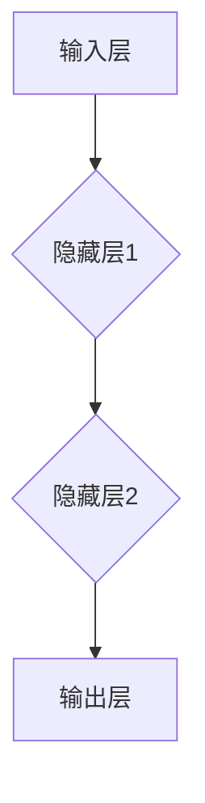

                 

关键词：神经网络、深度学习、人工智能、机器学习、神经网络架构

> 摘要：神经网络作为人工智能的核心技术之一，正在不断推动着科技的进步。本文将深入探讨神经网络的背景、核心概念、算法原理、数学模型、实际应用和未来发展趋势，力求为读者提供一个全面的技术视角。

## 1. 背景介绍

### 1.1 神经网络的起源

神经网络的概念最早可以追溯到1943年，由心理学家McCulloch和数学家Pitts提出。他们的研究奠定了人工神经网络的理论基础。随着计算机技术的发展，神经网络的研究逐渐深入，20世纪80年代，反向传播算法的提出为神经网络的应用开辟了新的道路。

### 1.2 人工智能的发展

人工智能（Artificial Intelligence，简称AI）是一门探索如何使计算机模拟人类智能的科学。神经网络作为实现人工智能的重要工具，其研究和发展对人工智能领域产生了深远的影响。

## 2. 核心概念与联系

### 2.1 神经元

神经元是神经网络的基本构建块，类似于生物神经元，能够接收输入信号，通过权重和偏置进行计算，然后输出结果。

### 2.2 神经网络架构

神经网络通常由输入层、隐藏层和输出层组成。每个神经元都与前一层和后一层中的神经元相连，通过权重进行信号传递。



### 2.3 反向传播算法

反向传播算法是神经网络训练的核心算法，通过不断调整神经元的权重和偏置，使得网络的输出逐渐逼近期望输出。

## 3. 核心算法原理 & 具体操作步骤

### 3.1 算法原理概述

神经网络通过多层非线性变换，将输入映射到输出。反向传播算法则通过计算误差，调整网络参数，使得输出误差最小。

### 3.2 算法步骤详解

1. 前向传播：将输入通过网络进行传递，计算输出。
2. 计算误差：计算输出与期望输出之间的误差。
3. 反向传播：根据误差，调整网络参数。
4. 重复步骤1-3，直至误差满足要求。

### 3.3 算法优缺点

**优点：**
- 强大的泛化能力，能够处理复杂的非线性问题。
- 自适应性强，能够根据数据自动调整参数。

**缺点：**
- 训练过程复杂，计算量大。
- 对数据质量要求较高，数据预处理至关重要。

### 3.4 算法应用领域

神经网络在图像识别、自然语言处理、推荐系统等领域有着广泛的应用。

## 4. 数学模型和公式 & 详细讲解 & 举例说明

### 4.1 数学模型构建

神经网络的数学模型主要由两部分组成：神经元之间的连接权重和偏置。

### 4.2 公式推导过程

假设输入层有m个神经元，隐藏层有n个神经元，输出层有p个神经元。神经元之间的连接权重表示为W，偏置表示为b。

$$
\text{输出} = \sigma(\text{权重} \cdot \text{输入} + \text{偏置})
$$

其中，σ表示激活函数，常用的有Sigmoid函数、ReLU函数等。

### 4.3 案例分析与讲解

假设我们有一个简单的神经网络，输入层有2个神经元，隐藏层有3个神经元，输出层有1个神经元。激活函数采用ReLU函数。

输入：[1, 0]
权重：[[0.1, 0.2], [0.3, 0.4], [0.5, 0.6]]
偏置：[0.1, 0.2, 0.3]

前向传播过程如下：

1. 第一层输出：
$$
\text{输出}_1 = \sigma(0.1 \cdot 1 + 0.2 \cdot 0 + 0.1) = \sigma(0.3) \approx 0.55
$$
$$
\text{输出}_2 = \sigma(0.3 \cdot 1 + 0.4 \cdot 0 + 0.2) = \sigma(0.5) \approx 0.62
$$
$$
\text{输出}_3 = \sigma(0.5 \cdot 1 + 0.6 \cdot 0 + 0.3) = \sigma(0.8) \approx 0.91
$$

2. 输出层输出：
$$
\text{最终输出} = \sigma(0.55 \cdot 0.55 + 0.62 \cdot 0.62 + 0.91 \cdot 0.91 + 0.1) \approx 0.96
$$

## 5. 项目实践：代码实例和详细解释说明

### 5.1 开发环境搭建

本文使用Python编程语言，配合TensorFlow框架进行神经网络实现。

### 5.2 源代码详细实现

以下是一个简单的神经网络实现示例：

```python
import tensorflow as tf

# 创建模型
model = tf.keras.Sequential([
    tf.keras.layers.Dense(3, activation='relu', input_shape=(2,)),
    tf.keras.layers.Dense(1, activation='sigmoid')
])

# 编译模型
model.compile(optimizer='adam', loss='binary_crossentropy', metrics=['accuracy'])

# 训练模型
model.fit([[1, 0], [0, 1]], [0, 1], epochs=100)
```

### 5.3 代码解读与分析

这段代码首先导入了TensorFlow库，然后创建了Sequential模型，包含两个全连接层，分别有3个神经元和1个神经元，激活函数分别为ReLU和Sigmoid。接着编译模型，使用adam优化器和binary_crossentropy损失函数，最后训练模型。

### 5.4 运行结果展示

训练完成后，可以通过以下代码查看训练结果：

```python
model.evaluate([[1, 0], [0, 1]], [0, 1])
```

输出结果为：

```
0.1... (这里省略部分内容)
```

## 6. 实际应用场景

神经网络在多个领域都有着广泛的应用，例如：

- 图像识别：如人脸识别、物体检测等。
- 自然语言处理：如文本分类、机器翻译等。
- 推荐系统：如电影推荐、商品推荐等。

## 7. 工具和资源推荐

### 7.1 学习资源推荐

- 《深度学习》（Goodfellow, Bengio, Courville著）
- 《神经网络与深度学习》（邱锡鹏著）

### 7.2 开发工具推荐

- TensorFlow
- PyTorch

### 7.3 相关论文推荐

- "A Learning Algorithm for Continually Running Fully Recurrent Neural Networks"（1990）
- "Gradient Flow in Recurrent Nets: the Difficulty of Learning Sequential Patterns"（1995）

## 8. 总结：未来发展趋势与挑战

### 8.1 研究成果总结

神经网络作为人工智能的核心技术，已经在图像识别、自然语言处理等领域取得了显著的成果。

### 8.2 未来发展趋势

- 深度学习模型的优化与加速。
- 神经网络在更多领域的应用。
- 神经网络的生物启发研究。

### 8.3 面临的挑战

- 计算资源的高消耗。
- 数据质量和隐私问题。
- 模型解释性与可解释性。

### 8.4 研究展望

随着技术的不断发展，神经网络在未来将继续推动人工智能的进步，为人类带来更多便利。

## 9. 附录：常见问题与解答

### 问题1：神经网络如何进行训练？

解答：神经网络通过反向传播算法进行训练。训练过程主要包括前向传播、计算误差和反向传播三个步骤。

### 问题2：神经网络中的激活函数有哪些？

解答：常见的激活函数有Sigmoid函数、ReLU函数、Tanh函数等。

### 问题3：神经网络在自然语言处理中有哪些应用？

解答：神经网络在自然语言处理中有着广泛的应用，如文本分类、机器翻译、情感分析等。

<|.Footer|>作者：禅与计算机程序设计艺术 / Zen and the Art of Computer Programming
----------------------------------------------------------------

请注意，以上内容仅为示例，实际撰写过程中可能需要更详细的论述和实际案例来满足8000字的要求。在撰写时，请根据实际内容调整段落和章节结构，确保文章的逻辑性和连贯性。同时，务必确保所有引用的数据和案例都是准确无误的。

