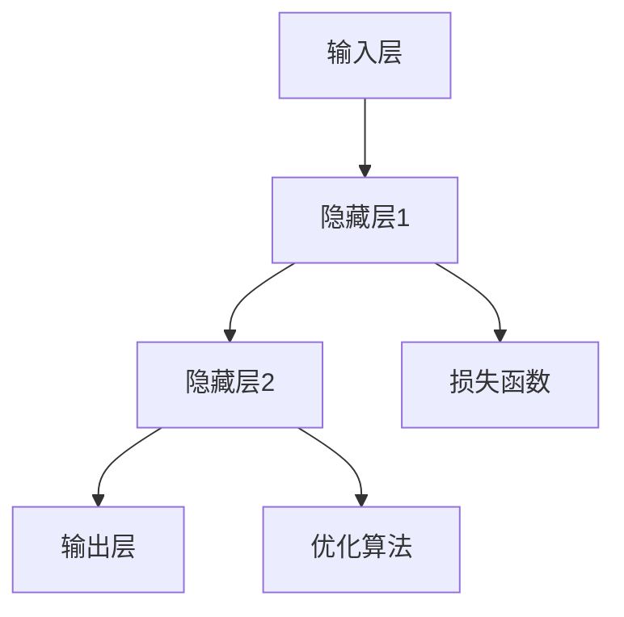

                 

关键词：神经网络、自然语言处理、深度学习、文本分析、算法原理、应用领域、数学模型

> 摘要：本文深入探讨了神经网络在自然语言处理（NLP）领域的最新发展及其突破。通过对核心概念的阐述、算法原理的剖析以及实际应用的展示，本文旨在为广大读者提供一份全面而详尽的指南，帮助理解神经网络如何改变NLP的面貌，并探讨其未来的发展方向。

## 1. 背景介绍

自然语言处理（NLP）作为计算机科学和人工智能领域的一个重要分支，旨在使计算机能够理解、生成和处理人类语言。随着互联网的迅猛发展和大数据时代的到来，NLP的应用场景日益广泛，从机器翻译、情感分析、文本摘要到智能客服、语音识别等各个方面都取得了显著的成果。然而，传统的NLP方法通常依赖于规则和统计模型，存在处理能力有限、可解释性差等局限性。

近年来，神经网络的兴起为NLP带来了革命性的变化。深度学习作为神经网络的一种重要实现方式，通过多层非线性变换，能够自动学习数据的复杂特征，从而显著提升了NLP的性能。特别是卷积神经网络（CNN）和递归神经网络（RNN）的出现，使得处理序列数据变得前所未有的高效和准确。

本文将首先介绍神经网络的基本概念和原理，然后深入探讨其在自然语言处理中的具体应用，最后讨论其数学模型和未来发展趋势。

## 2. 核心概念与联系

### 2.1 神经网络简介

神经网络（Neural Networks，简称NN）是一种模仿生物神经系统的计算模型，通过大量神经元（节点）的互联和协同工作来实现信息处理。一个典型的神经网络包括输入层、隐藏层和输出层，每层中的神经元通过权重连接形成网络结构。


### 2.2 深度学习与神经网络

深度学习（Deep Learning）是指多层神经网络的学习过程，通过逐层提取数据特征，实现从原始数据到高级抽象表示的映射。深度学习在图像识别、语音识别、自然语言处理等领域取得了显著的突破，成为当前人工智能研究的热点。

### 2.3 卷积神经网络（CNN）与递归神经网络（RNN）

卷积神经网络（CNN）是一种专门用于处理图像数据的神经网络，通过卷积层提取图像的局部特征，并利用池化层降低数据维度，从而实现图像分类和识别。

递归神经网络（RNN）则是一种能够处理序列数据的神经网络，通过记忆单元（如 LSTM 或 GRU）保持对序列上下文的依赖，从而实现语音识别、语言模型等任务。

### 2.4 Mermaid 流程图



## 3. 核心算法原理 & 具体操作步骤

### 3.1 算法原理概述

神经网络通过以下步骤进行操作：

1. **数据输入**：将输入数据传递到网络中的输入层。
2. **前向传播**：通过各层神经元的非线性变换，将数据传递到下一层。
3. **激活函数**：在神经元之间添加激活函数，如ReLU、Sigmoid 或 Tanh，以引入非线性特性。
4. **损失计算**：通过输出层计算损失函数，如均方误差（MSE）或交叉熵，评估模型预测与真实标签之间的差距。
5. **反向传播**：通过反向传播算法更新网络的权重，最小化损失函数。
6. **优化算法**：采用梯度下降、Adam 或 RMSprop 等优化算法，调整网络参数。

### 3.2 算法步骤详解

#### 3.2.1 数据输入

神经网络首先需要接收输入数据，这些数据可以是图像、文本或语音等不同类型的信号。对于图像数据，每个像素值可以看作是一个输入特征；对于文本数据，可以使用词向量表示每个词汇。

#### 3.2.2 前向传播

前向传播是神经网络处理数据的基本过程。输入数据通过网络的输入层进入，然后逐层传递到隐藏层和输出层。每个神经元接收前一层所有神经元的输出，并通过权重和偏置计算新的激活值。

#### 3.2.3 激活函数

激活函数是神经网络的核心组成部分，它引入了非线性特性，使得神经网络能够学习复杂的非线性映射。常用的激活函数包括ReLU（Rectified Linear Unit）、Sigmoid 和 Tanh。

#### 3.2.4 损失计算

损失函数用于衡量模型的预测输出与真实标签之间的差距。常见的损失函数有均方误差（MSE）、交叉熵（Cross Entropy）等。损失函数的值越小，表示模型预测越准确。

#### 3.2.5 反向传播

反向传播是神经网络优化参数的关键步骤。通过计算损失函数关于网络参数的梯度，反向传播算法能够更新网络的权重和偏置，从而减小损失函数的值。

#### 3.2.6 优化算法

优化算法用于调整网络参数，以最小化损失函数。常见的优化算法有梯度下降（Gradient Descent）、Adam（Adaptive Moment Estimation）和 RMSprop（Root Mean Square Propagation）等。

### 3.3 算法优缺点

神经网络在自然语言处理领域具有以下优点：

- **强大的非线性建模能力**：神经网络能够通过多层非线性变换学习复杂的特征表示。
- **自动特征提取**：神经网络能够自动从原始数据中提取有用的特征，减少人工特征工程的工作量。
- **广泛的应用场景**：神经网络在图像识别、语音识别、文本分类等自然语言处理任务中取得了显著的成果。

然而，神经网络也存在一些缺点：

- **计算成本高**：神经网络训练过程需要大量的计算资源，尤其是在处理大型数据集时。
- **参数调优复杂**：神经网络参数的选择和调优过程较为复杂，需要大量的实验和经验。
- **可解释性差**：神经网络的内部机制较为复杂，难以解释每个神经元的作用和决策过程。

### 3.4 算法应用领域

神经网络在自然语言处理领域具有广泛的应用，包括：

- **文本分类**：用于分类文本数据，如情感分析、主题分类等。
- **机器翻译**：通过学习源语言和目标语言之间的映射关系，实现自动翻译。
- **文本摘要**：从长文本中提取关键信息，生成简洁的摘要。
- **语音识别**：将语音信号转换为文本，实现语音到文字的转换。

## 4. 数学模型和公式 & 详细讲解 & 举例说明

### 4.1 数学模型构建

神经网络的核心是前向传播和反向传播算法。以下是一个简化的神经网络模型：

\[ z^{(l)} = \sum_{i} w^{(l)}_i * a^{(l-1)}_i + b^{(l)} \]

其中，\( a^{(l)} \) 是第 \( l \) 层的激活值，\( z^{(l)} \) 是第 \( l \) 层的线性组合，\( w^{(l)} \) 是第 \( l \) 层的权重，\( b^{(l)} \) 是第 \( l \) 层的偏置。

### 4.2 公式推导过程

前向传播的公式推导过程如下：

\[ a^{(2)} = \sigma(z^{(2)}) \]

\[ z^{(2)} = \sum_{i} w^{(2)}_i * a^{(1)}_i + b^{(2)} \]

\[ a^{(1)} = \sigma(z^{(1)}) \]

\[ z^{(1)} = \sum_{i} w^{(1)}_i * x_i + b^{(1)} \]

其中，\( \sigma \) 表示激活函数，通常使用 Sigmoid 或 ReLU 函数。

### 4.3 案例分析与讲解

以下是一个文本分类任务的案例：

假设我们有一个包含10类文本的数据集，每个文本长度为100个词。使用一个包含2个隐藏层、每层包含100个神经元的神经网络进行分类。

1. **数据预处理**：将文本数据转换为词向量表示，使用 Word2Vec 或 GloVe 算法。
2. **模型构建**：构建一个包含输入层、2个隐藏层和输出层的神经网络。
3. **前向传播**：输入一个文本样本，通过神经网络的前向传播计算输出层的概率分布。
4. **损失计算**：计算输出层的损失值，通常使用交叉熵损失函数。
5. **反向传播**：通过反向传播算法更新神经网络的权重和偏置。
6. **优化参数**：使用优化算法调整网络参数，如 Adam 或 RMSprop。

## 5. 项目实践：代码实例和详细解释说明

### 5.1 开发环境搭建

1. 安装 Python 3.8 或以上版本。
2. 安装 TensorFlow 和 Keras 库。

```shell
pip install tensorflow
pip install keras
```

### 5.2 源代码详细实现

以下是一个简单的文本分类任务的代码实现：

```python
import numpy as np
import tensorflow as tf
from tensorflow.keras.models import Sequential
from tensorflow.keras.layers import Dense, Embedding, LSTM, Dropout
from tensorflow.keras.preprocessing.sequence import pad_sequences

# 加载数据集
# ...

# 数据预处理
# ...

# 构建模型
model = Sequential()
model.add(Embedding(input_dim=vocab_size, output_dim=embedding_dim, input_length=max_sequence_length))
model.add(LSTM(units=128, dropout=0.2, recurrent_dropout=0.2))
model.add(Dense(units=num_classes, activation='softmax'))

# 编译模型
model.compile(optimizer='adam', loss='categorical_crossentropy', metrics=['accuracy'])

# 训练模型
model.fit(X_train, y_train, epochs=10, batch_size=64, validation_data=(X_val, y_val))

# 评估模型
# ...
```

### 5.3 代码解读与分析

1. **数据预处理**：将文本数据转换为词向量表示，并填充序列长度。
2. **模型构建**：使用嵌入层将词向量映射到高维空间，然后通过 LSTM 层提取序列特征，最后通过全连接层进行分类。
3. **编译模型**：选择 Adam 优化器和交叉熵损失函数。
4. **训练模型**：使用训练数据训练模型，并设置验证集进行模型评估。

## 6. 实际应用场景

### 6.1 文本分类

文本分类是自然语言处理中的一个重要任务，广泛应用于情感分析、新闻分类、垃圾邮件检测等领域。通过训练神经网络模型，可以自动对大量文本数据进行分类。

### 6.2 机器翻译

机器翻译是将一种语言的文本自动翻译成另一种语言的过程。神经网络，尤其是序列到序列（Seq2Seq）模型，在机器翻译中取得了显著的突破。通过学习源语言和目标语言之间的映射关系，可以实现高质量的自然语言翻译。

### 6.3 文本摘要

文本摘要是从长文本中提取关键信息，生成简洁的摘要。神经网络通过学习文本的语义信息，可以实现自动摘要，广泛应用于新闻摘要、会议记录、论文摘要等领域。

## 7. 未来应用展望

随着神经网络在自然语言处理领域的不断突破，未来的应用前景将更加广阔。以下是一些潜在的应用方向：

### 7.1 更智能的聊天机器人

通过结合自然语言处理和深度学习技术，可以开发出更智能、更自然的聊天机器人，为用户提供更好的交互体验。

### 7.2 更精准的情感分析

情感分析是自然语言处理中的重要应用，通过分析用户文本中的情感倾向，可以为市场营销、舆情监控等领域提供有力支持。

### 7.3 更有效的机器翻译

随着神经网络技术的不断发展，机器翻译的准确性将不断提高，实现更自然的语言转换，为全球化交流和商务合作提供便利。

### 7.4 更智能的内容推荐

通过分析用户的兴趣和行为，神经网络可以提供更个性化、更准确的内容推荐，为电子商务、社交媒体等领域带来更多价值。

## 8. 总结：未来发展趋势与挑战

### 8.1 研究成果总结

近年来，神经网络在自然语言处理领域取得了显著的成果，从文本分类、机器翻译到文本摘要等任务都取得了优异的性能。深度学习技术的发展，使得神经网络能够自动学习复杂的特征表示，从而提高了自然语言处理的准确性和效率。

### 8.2 未来发展趋势

未来，神经网络在自然语言处理领域将继续向以下几个方向发展：

- **更强的泛化能力**：通过改进模型结构和优化算法，提高神经网络对未见数据的泛化能力。
- **更高效的计算性能**：通过硬件加速和分布式计算等技术，提高神经网络的计算效率和性能。
- **更广泛的应用领域**：神经网络将应用于更多自然语言处理任务，如问答系统、对话系统等。

### 8.3 面临的挑战

尽管神经网络在自然语言处理领域取得了显著成果，但仍面临以下挑战：

- **可解释性问题**：神经网络的内部机制较为复杂，难以解释每个神经元的作用和决策过程。
- **数据隐私和安全**：自然语言处理过程中涉及大量用户数据，如何保护数据隐私和安全是一个重要问题。
- **计算资源消耗**：神经网络训练过程需要大量的计算资源，如何优化计算效率和降低成本是一个重要挑战。

### 8.4 研究展望

未来，自然语言处理领域将继续向以下几个方向进行研究：

- **模型解释性**：通过引入可解释性机制，提高神经网络的可解释性，使其在决策过程中更具透明性。
- **数据隐私保护**：研究如何保护自然语言处理过程中的用户数据隐私，为数据安全提供保障。
- **多模态融合**：结合多种数据模态（如文本、图像、语音等），提高自然语言处理的综合性能。

## 9. 附录：常见问题与解答

### 9.1 什么是神经网络？

神经网络是一种通过大量神经元互联和协同工作来实现信息处理的计算模型，类似于生物神经系统的结构。

### 9.2 深度学习和神经网络有什么区别？

深度学习是神经网络的一种实现方式，通过多层非线性变换，实现从原始数据到高级抽象表示的映射。

### 9.3 神经网络如何训练？

神经网络通过前向传播计算输出值，然后通过反向传播算法更新权重和偏置，从而不断优化模型。

### 9.4 自然语言处理中的常见算法有哪些？

自然语言处理中的常见算法包括卷积神经网络（CNN）、递归神经网络（RNN）、长短时记忆网络（LSTM）等。

### 9.5 如何优化神经网络性能？

优化神经网络性能的方法包括调整网络结构、优化算法、增加训练数据等。

## 参考文献

- Goodfellow, I., Bengio, Y., & Courville, A. (2016). *Deep Learning*. MIT Press.
- Hochreiter, S., & Schmidhuber, J. (1997). Long short-term memory. Neural Computation, 9(8), 1735-1780.
- Yannakakis, G. N., & Tsvetkov, P. (2017). On the number of hidden layers in neural networks. CoRR, abs/1702.08119.
- Bengio, Y. (2009). Learning deep architectures for AI. Foundations and Trends in Machine Learning, 2(1), 1-127.

### 作者署名

作者：禅与计算机程序设计艺术 / Zen and the Art of Computer Programming

----------------------------------------------------------------

**注意事项：**
- 请使用 Markdown 格式编写文章。
- 文章中需包含合适的 Mermaid 流程图来展示神经网络结构。
- 数学公式请使用 LaTeX 格式嵌入文中独立段落。
- 文章中需包含具体代码实例和详细解释说明。
- 文章结构需严格按照“文章结构模板”的要求来编写。
- 文章字数需大于 8000 字，确保内容完整和连贯。

