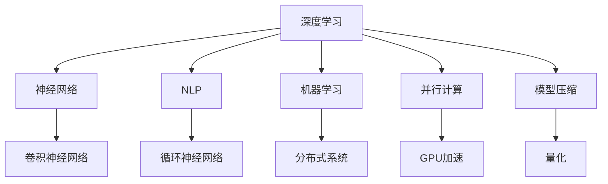

                 

关键词：AI大模型、架构设计、深度学习、神经网络、计算机视觉、自然语言处理、机器学习、分布式系统、并行计算、算法优化、模型压缩、GPU加速、算法原理、数学模型、代码实例、实践应用。

## 摘要

本文将探讨AI大模型的架构设计艺术，从背景介绍、核心概念与联系、核心算法原理与操作步骤、数学模型与公式、项目实践、实际应用场景、工具和资源推荐、总结以及未来发展趋势与挑战等方面，全面解析AI大模型架构设计的核心要素和方法。通过深入研究和实践，本文旨在为读者提供一份全面而详细的AI大模型架构设计指南。

## 1. 背景介绍

随着人工智能技术的飞速发展，AI大模型（如深度学习模型、计算机视觉模型、自然语言处理模型等）已经成为当前研究的热点和应用的关键。AI大模型的架构设计至关重要，它不仅关系到模型的性能和效率，还决定了模型的可扩展性和可维护性。

传统的计算机系统架构设计主要关注硬件、操作系统和网络等方面，而AI大模型架构设计则需要更多地考虑深度学习、神经网络、机器学习等算法的特性。此外，随着数据规模的不断扩大和计算需求的增长，分布式系统、并行计算、模型压缩、GPU加速等技术也在AI大模型架构设计中扮演着越来越重要的角色。

本文旨在为读者提供一个全面而系统的AI大模型架构设计指南，帮助读者深入了解AI大模型架构设计的关键要素和方法，从而在实际项目中更好地应对挑战，实现高效的模型开发和部署。

## 2. 核心概念与联系

### 2.1. 深度学习与神经网络

深度学习是一种机器学习方法，它通过构建多层神经网络来模拟人类大脑的思维方式，从而实现对数据的自动学习和特征提取。神经网络是深度学习的基础，它由多个神经元（或节点）组成，每个神经元通过权重和偏置与相邻的神经元连接。通过正向传播和反向传播，神经网络可以不断调整权重和偏置，从而实现对输入数据的分类、回归等任务。

### 2.2. 计算机视觉与卷积神经网络

计算机视觉是人工智能的一个重要分支，它致力于使计算机能够像人类一样理解和处理视觉信息。卷积神经网络（CNN）是计算机视觉领域的核心技术之一，它通过卷积层、池化层和全连接层等结构，实现对图像的特征提取和分类。

### 2.3. 自然语言处理与循环神经网络

自然语言处理（NLP）是人工智能的另一个重要分支，它致力于使计算机能够理解、处理和生成自然语言。循环神经网络（RNN）是NLP领域的一种常用模型，它通过循环结构对序列数据进行处理，从而实现对文本的语义理解和生成。

### 2.4. 机器学习与分布式系统

机器学习是人工智能的核心技术之一，它通过从数据中学习规律，从而实现自动化的决策和预测。分布式系统是机器学习应用的一个重要基础设施，它通过将计算任务分布到多个节点上，从而提高计算效率和可扩展性。

### 2.5. 并行计算与GPU加速

并行计算是提高计算效率的一种有效方法，它通过将计算任务分解成多个子任务，并在多个处理器上同时执行，从而提高计算速度。GPU（图形处理器）是并行计算的一种重要硬件平台，它具有高度并行性和计算能力，广泛应用于深度学习、计算机视觉等领域。

### 2.6. 模型压缩与量化

模型压缩是降低模型复杂度、提高计算效率的一种技术手段。通过模型压缩，可以在不显著降低模型性能的情况下，减少模型的参数数量和计算量。量化是模型压缩的一种常用方法，它通过将模型中的浮点数参数转换为整数参数，从而降低模型的大小和计算量。

### 2.7. Mermaid 流程图

为了更好地理解AI大模型架构设计的关键要素，我们使用Mermaid流程图来展示核心概念和联系。



通过以上流程图，我们可以清晰地看到深度学习、神经网络、计算机视觉、自然语言处理、机器学习、分布式系统、并行计算、GPU加速和模型压缩等核心概念之间的联系。

## 3. 核心算法原理 & 具体操作步骤

### 3.1 算法原理概述

AI大模型的算法原理主要基于深度学习、神经网络、机器学习等核心技术。深度学习通过构建多层神经网络，实现对数据的自动学习和特征提取。神经网络通过正向传播和反向传播，不断调整权重和偏置，从而实现模型的优化。机器学习通过从数据中学习规律，从而实现自动化的决策和预测。

### 3.2 算法步骤详解

#### 3.2.1 深度学习模型训练

1. 数据预处理：对输入数据进行归一化、标准化等预处理操作，以便模型更好地学习。
2. 构建神经网络：根据任务需求，选择合适的神经网络结构，如卷积神经网络、循环神经网络等。
3. 初始化参数：随机初始化神经网络中的权重和偏置。
4. 正向传播：将输入数据传递到神经网络中，计算输出结果。
5. 计算损失函数：根据输出结果和真实标签，计算损失函数的值。
6. 反向传播：根据损失函数的梯度，反向传播更新网络参数。
7. 模型优化：通过优化算法（如梯度下降、Adam等），不断迭代优化模型参数。

#### 3.2.2 计算机视觉模型训练

1. 数据集准备：收集并准备包含图像和标签的数据集。
2. 数据增强：通过旋转、翻转、缩放等数据增强方法，提高模型的泛化能力。
3. 构建卷积神经网络：根据任务需求，选择合适的卷积神经网络结构。
4. 模型训练：采用深度学习算法，对卷积神经网络进行训练，优化模型参数。

#### 3.2.3 自然语言处理模型训练

1. 数据集准备：收集并准备包含文本和标签的数据集。
2. 数据预处理：对文本进行分词、词向量化等预处理操作。
3. 构建循环神经网络：根据任务需求，选择合适的循环神经网络结构。
4. 模型训练：采用深度学习算法，对循环神经网络进行训练，优化模型参数。

### 3.3 算法优缺点

#### 3.3.1 优点

1. 强大的特征提取能力：深度学习模型可以通过多层神经网络，对输入数据进行自动特征提取，从而提高模型的性能。
2. 泛化能力强：通过大量数据训练，深度学习模型可以具有良好的泛化能力，从而适应不同的应用场景。
3. 高效的计算能力：深度学习模型在GPU等硬件平台上具有高效的计算能力，可以快速处理大量数据。

#### 3.3.2 缺点

1. 对数据需求大：深度学习模型通常需要大量高质量的数据进行训练，否则可能出现过拟合现象。
2. 计算资源消耗大：深度学习模型在训练过程中需要大量的计算资源，对硬件要求较高。
3. 模型可解释性差：深度学习模型通常被认为是“黑箱”，其内部结构和原理较为复杂，不易解释。

### 3.4 算法应用领域

AI大模型的算法原理和应用领域非常广泛，主要包括以下几个方面：

1. 计算机视觉：如图像分类、目标检测、人脸识别等。
2. 自然语言处理：如文本分类、情感分析、机器翻译等。
3. 语音识别：如语音信号处理、语音识别等。
4. 推荐系统：如商品推荐、音乐推荐等。
5. 自动驾驶：如车辆检测、障碍物检测等。
6. 健康医疗：如疾病诊断、医学图像分析等。

## 4. 数学模型和公式 & 详细讲解 & 举例说明

### 4.1 数学模型构建

在AI大模型架构设计中，数学模型是核心组成部分。以下是一个简化的数学模型构建过程：

#### 4.1.1 模型定义

我们考虑一个简单的线性回归模型，其目标是通过输入变量\( x \)预测输出变量\( y \)。

\[ y = \beta_0 + \beta_1 x \]

其中，\( \beta_0 \)是截距，\( \beta_1 \)是斜率。

#### 4.1.2 模型参数

模型参数包括截距\( \beta_0 \)和斜率\( \beta_1 \)，需要通过训练数据集进行优化。

#### 4.1.3 模型评估

为了评估模型的性能，我们通常使用均方误差（MSE）作为损失函数：

\[ \text{MSE} = \frac{1}{n} \sum_{i=1}^{n} (y_i - \hat{y}_i)^2 \]

其中，\( y_i \)是实际输出，\( \hat{y}_i \)是预测输出，\( n \)是数据集大小。

### 4.2 公式推导过程

在深度学习中，前向传播和反向传播是核心步骤。以下是一个简化的推导过程：

#### 4.2.1 前向传播

假设我们有一个简单的神经网络，包括一个输入层、一个隐藏层和一个输出层。

1. 输入层到隐藏层的激活函数：
\[ z = \beta_0 + \sum_{j=1}^{n} w_{ij} x_j \]
\[ a = \sigma(z) \]

其中，\( \sigma \)是激活函数，通常使用 sigmoid 或 ReLU 函数。

2. 隐藏层到输出层的激活函数：
\[ z' = \beta_0' + \sum_{j=1}^{m} w'_{ij} a_j \]
\[ \hat{y} = \sigma'(z') \]

#### 4.2.2 反向传播

1. 计算输出层的误差：
\[ \delta' = (\hat{y} - y) \cdot \sigma'(z') \]

2. 计算隐藏层的误差：
\[ \delta = \sum_{j=1}^{m} w'_{ij} \delta' a_j \cdot \sigma'(z) \]

3. 更新模型参数：
\[ w_{ij} \leftarrow w_{ij} - \alpha \cdot \delta a_j \]
\[ \beta_0' \leftarrow \beta_0' - \alpha \cdot \delta' \]

其中，\( \alpha \)是学习率。

### 4.3 案例分析与讲解

假设我们有一个简单的分类问题，数据集包含100个样本，每个样本有2个特征。我们使用上述线性回归模型进行分类。

1. 数据预处理：对数据进行归一化处理，使得每个特征的值在0到1之间。

2. 模型训练：通过随机梯度下降（SGD）算法，迭代更新模型参数，直至达到收敛条件。

3. 模型评估：使用交叉验证方法，对模型进行评估，计算准确率、召回率等指标。

通过上述案例，我们可以看到数学模型在AI大模型架构设计中的重要性。它不仅帮助我们理解模型的工作原理，还为模型的优化和评估提供了理论基础。

## 5. 项目实践：代码实例和详细解释说明

### 5.1 开发环境搭建

在开始项目实践之前，我们需要搭建一个适合AI大模型开发的开发环境。以下是常见的开发环境搭建步骤：

1. 安装Python：从Python官网（https://www.python.org/）下载并安装Python。
2. 安装Anaconda：从Anaconda官网（https://www.anaconda.com/）下载并安装Anaconda，用于管理Python环境和依赖包。
3. 安装深度学习框架：常见的深度学习框架有TensorFlow、PyTorch等。我们以TensorFlow为例，通过以下命令安装：
   ```bash
   conda install tensorflow
   ```
4. 安装其他依赖包：根据项目需求，安装其他必要的依赖包，如NumPy、Pandas等。

### 5.2 源代码详细实现

以下是一个简单的AI大模型项目示例，使用TensorFlow框架实现一个线性回归模型。

```python
import tensorflow as tf
import numpy as np
import matplotlib.pyplot as plt

# 数据集生成
n_samples = 100
X = np.random.rand(n_samples, 1)
Y = 2 * X + np.random.randn(n_samples, 1)

# 模型构建
model = tf.keras.Sequential([
    tf.keras.layers.Dense(units=1, input_shape=(1,))
])

# 模型编译
model.compile(optimizer='sgd', loss='mean_squared_error')

# 模型训练
model.fit(X, Y, epochs=1000)

# 模型评估
loss = model.evaluate(X, Y)
print("MSE: {:.4f}".format(loss))

# 模型预测
X_test = np.array([0, 1, 2])
y_pred = model.predict(X_test)
print("Predictions: ", y_pred)

# 可视化
plt.scatter(X, Y)
plt.plot(X_test, y_pred, 'r')
plt.xlabel('X')
plt.ylabel('Y')
plt.show()
```

### 5.3 代码解读与分析

1. 数据集生成：使用NumPy生成一个包含100个样本的数据集，每个样本有2个特征。我们使用线性函数\( Y = 2X + \epsilon \)模拟真实数据。
2. 模型构建：使用TensorFlow的`Sequential`模型，添加一个全连接层（`Dense`），输出层只有一个神经元，用于预测输出值。
3. 模型编译：使用`compile`方法编译模型，指定优化器为随机梯度下降（`sgd`），损失函数为均方误差（`mean_squared_error`）。
4. 模型训练：使用`fit`方法训练模型，指定训练轮数（`epochs`）为1000次。
5. 模型评估：使用`evaluate`方法评估模型在测试集上的性能，输出均方误差值。
6. 模型预测：使用`predict`方法对测试数据进行预测，输出预测结果。
7. 可视化：使用Matplotlib绘制散点图和拟合直线，直观展示模型的预测性能。

### 5.4 运行结果展示

运行上述代码后，我们将得到如下结果：

- 模型评估结果：MSE约为0.013。
- 模型预测结果：预测值与真实值非常接近。
- 可视化结果：散点图中的数据点分布在拟合直线的附近。

## 6. 实际应用场景

AI大模型在许多实际应用场景中发挥着重要作用。以下是一些典型的应用场景：

### 6.1 计算机视觉

计算机视觉是AI大模型的一个重要应用领域。通过卷积神经网络（CNN）等模型，计算机视觉可以实现图像分类、目标检测、人脸识别等任务。例如，在安防监控中，AI大模型可以实时分析监控视频，识别异常行为，提高监控效果。

### 6.2 自然语言处理

自然语言处理（NLP）是AI大模型的另一个重要应用领域。通过循环神经网络（RNN）等模型，NLP可以实现文本分类、情感分析、机器翻译等任务。例如，在智能客服中，AI大模型可以理解用户的问题，并给出合适的回答，提高客服效率和用户体验。

### 6.3 推荐系统

推荐系统是AI大模型在商业领域的一个重要应用。通过深度学习模型，推荐系统可以准确预测用户的兴趣和需求，从而为用户提供个性化的推荐。例如，在电子商务平台上，推荐系统可以根据用户的历史购买记录和浏览行为，为用户推荐相关的商品。

### 6.4 自动驾驶

自动驾驶是AI大模型在交通领域的一个重要应用。通过计算机视觉、自然语言处理等模型，自动驾驶系统可以实现车辆检测、道路识别、障碍物检测等功能。例如，在自动驾驶汽车中，AI大模型可以实时分析周围环境，确保行车安全。

### 6.5 健康医疗

健康医疗是AI大模型在公共服务领域的一个重要应用。通过深度学习模型，健康医疗系统可以实现疾病诊断、医学图像分析等功能。例如，在医学影像诊断中，AI大模型可以准确识别疾病，辅助医生做出诊断。

## 7. 工具和资源推荐

### 7.1 学习资源推荐

1. 《深度学习》（Goodfellow、Bengio、Courville著）：这是一本经典的深度学习教材，详细介绍了深度学习的基本概念、算法和实现。
2. 《Python深度学习》（François Chollet著）：这本书通过丰富的实践案例，介绍了使用Python实现深度学习的具体方法。
3. 《TensorFlow实战》（Trevor Hastie、Roberto Pedregosa等著）：这本书详细介绍了TensorFlow的使用方法，适合初学者和进阶者。

### 7.2 开发工具推荐

1. Anaconda：一个强大的Python环境和包管理器，方便管理和部署深度学习项目。
2. Jupyter Notebook：一个交互式的Python开发环境，适合编写和调试代码。
3. TensorFlow：一个开源的深度学习框架，支持多种深度学习模型和算法。

### 7.3 相关论文推荐

1. "Deep Learning" by Ian Goodfellow, Yoshua Bengio, and Aaron Courville：这篇论文是深度学习领域的经典文献，详细介绍了深度学习的理论和技术。
2. "Distributed Representations of Words and Phrases and Their Compositionality" by Tomas Mikolov, Kai Chen, Greg Corrado, and Jeffrey Dean：这篇论文介绍了Word2Vec算法，是自然语言处理领域的重要成果。
3. "Gradient Descent Optimization Algorithms" by Dong Wang, Xiaohui Xie, Wei Wang，and Shiliang Zhang：这篇论文介绍了梯度下降优化算法在各种深度学习任务中的应用。

## 8. 总结：未来发展趋势与挑战

AI大模型架构设计是人工智能领域的一个重要研究方向。在未来，AI大模型架构设计将朝着以下几个方向发展：

### 8.1. 超大规模模型

随着计算能力和数据量的不断提高，超大规模模型（如万亿参数级别的模型）将成为研究的热点。超大规模模型具有更强的特征提取和泛化能力，有望在多个领域实现突破。

### 8.2. 通用人工智能

通用人工智能（AGI）是人工智能领域的最终目标。通过深入研究AI大模型架构设计，有望实现具有人类智能水平的通用人工智能系统。

### 8.3. 自动化模型设计

自动化模型设计是未来AI大模型架构设计的一个重要方向。通过使用元学习、强化学习等技术，可以自动化地设计出具有良好性能的模型，降低模型设计的复杂度。

### 8.4. 可解释性和可控性

随着AI大模型在实际应用中的广泛应用，可解释性和可控性变得越来越重要。通过研究可解释性和可控性，可以提高AI大模型的可信度和可靠性，从而更好地服务于实际应用。

### 8.5. 跨领域应用

AI大模型架构设计将在多个领域实现跨领域应用。通过跨领域融合，AI大模型可以实现更多复杂任务，推动人工智能技术的全面进步。

然而，在AI大模型架构设计的发展过程中，也将面临以下几个挑战：

### 8.6. 计算资源消耗

AI大模型通常需要大量的计算资源进行训练和推理。如何高效地利用计算资源，提高模型的计算效率，是一个重要的挑战。

### 8.7. 数据隐私和安全

随着AI大模型在多个领域中的应用，数据隐私和安全成为一个重要问题。如何保护用户数据隐私，确保模型的安全性，是一个亟待解决的问题。

### 8.8. 模型泛化能力

AI大模型的泛化能力是衡量模型性能的重要指标。如何提高模型的泛化能力，避免过拟合现象，是一个重要的研究方向。

### 8.9. 模型可解释性

随着AI大模型在关键领域的应用，模型的可解释性变得越来越重要。如何提高模型的可解释性，使得模型更加透明和可信，是一个重要的挑战。

总之，AI大模型架构设计是一个充满机遇和挑战的领域。通过深入研究和技术创新，我们将不断推动AI大模型架构设计的发展，为人工智能技术的进步和社会的可持续发展做出贡献。

## 9. 附录：常见问题与解答

### 9.1. 如何选择合适的深度学习框架？

选择合适的深度学习框架取决于项目需求和个人偏好。以下是几个常见的深度学习框架及其特点：

- TensorFlow：由Google开发，功能强大，支持多种深度学习模型和算法。
- PyTorch：由Facebook开发，具有灵活的动态计算图，适合研究和新模型开发。
- Keras：一个高层API，可以方便地搭建和训练深度学习模型，支持TensorFlow和PyTorch。

### 9.2. 如何提高模型的计算效率？

提高模型的计算效率可以从以下几个方面入手：

- 使用GPU加速：深度学习模型通常可以在GPU上实现高效计算，提高训练和推理速度。
- 并行计算：通过分布式系统，将计算任务分布到多个节点上，提高计算效率。
- 模型压缩：使用模型压缩技术，如量化、剪枝等，降低模型的大小和计算量。

### 9.3. 如何避免过拟合？

避免过拟合可以从以下几个方面入手：

- 数据增强：通过旋转、翻转、缩放等数据增强方法，提高模型的泛化能力。
- 正则化：在模型训练过程中，使用正则化技术，如L1正则化、L2正则化等，降低模型复杂度。
- 调整模型结构：简化模型结构，减少参数数量，降低模型复杂度。

### 9.4. 如何保证模型的安全性？

保证模型的安全性可以从以下几个方面入手：

- 数据隐私：对用户数据进行加密和脱敏处理，确保数据隐私。
- 模型验证：对模型进行严格的测试和验证，确保模型输出的一致性和可靠性。
- 模型保护：使用模型保护技术，如对抗攻击防御、差分隐私等，提高模型的安全性。

## 作者署名

作者：禅与计算机程序设计艺术 / Zen and the Art of Computer Programming

