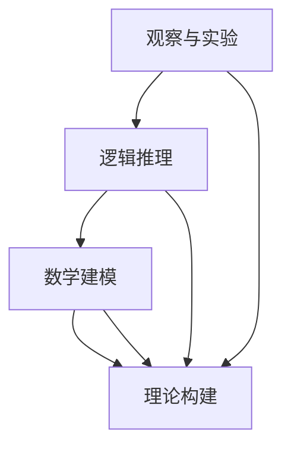

                 

关键词：科学方法、观察、实验、逻辑推理、数据处理、数学模型、算法、软件开发、技术创新

> 摘要：本文将深入探讨科学方法在信息技术领域的应用，从观察、实验到理论构建，以及如何将这些方法运用到软件开发和创新实践中。通过详细的案例分析和数学模型讲解，本文旨在为读者提供一套系统化的科学思维框架，帮助他们在技术发展中不断突破自我，实现创新。

## 1. 背景介绍

科学方法是人类认识和改造世界的基本途径。自伽利略、牛顿以来，科学方法逐渐成为推动科技进步的核心力量。在信息技术领域，科学方法同样发挥着重要作用。从计算机科学的起源，到人工智能、大数据、量子计算等前沿技术，科学方法始终贯穿其中。

### 科学方法的历史发展

1. **观察和实验**：伽利略首次通过望远镜进行天文观测，奠定了现代实验科学的基础。
2. **逻辑推理**：笛卡尔提出“我思故我在”，强调理性思考的重要性。
3. **数学建模**：牛顿和莱布尼茨分别独立发明微积分，为自然科学提供了强大的数学工具。
4. **理论构建**：达尔文的进化论、爱因斯坦的相对论，都是科学理论构建的典范。

### 科学方法在现代信息技术中的应用

1. **计算机科学**：以图灵机模型为基础，计算机科学迅速发展，推动了计算机硬件、软件和网络技术的革新。
2. **人工智能**：基于统计学习和神经网络模型，人工智能技术不断突破，应用于图像识别、自然语言处理、智能决策等领域。
3. **大数据**：通过数据采集、存储、分析和挖掘，大数据技术为商业决策、科学研究提供了新的方法。
4. **量子计算**：量子力学为量子计算提供了理论基础，有望在数据处理速度和安全性方面实现重大突破。

## 2. 核心概念与联系

为了更好地理解科学方法在信息技术中的应用，我们需要了解以下几个核心概念，并探讨它们之间的联系。

### 2.1 观察和实验

观察是通过感官或辅助工具获取信息的过程，而实验是通过控制变量来验证假设的方法。在信息技术领域，观察和实验的例子包括：

1. **性能测试**：通过模拟不同的工作负载来评估系统的性能。
2. **用户测试**：收集用户对软件产品的反馈，以优化用户体验。

### 2.2 逻辑推理

逻辑推理是基于观察和实验结果，通过归纳、演绎等方法得出结论。在信息技术中，逻辑推理体现在：

1. **算法设计**：基于特定问题的需求，设计合理的算法和数据结构。
2. **软件工程**：通过需求分析、系统设计、编码和测试等步骤，确保软件的质量和可靠性。

### 2.3 数学建模

数学建模是将现实问题转化为数学公式和模型的过程。在信息技术中，数学建模的应用包括：

1. **数据挖掘**：通过构建数学模型，从大量数据中提取有价值的信息。
2. **加密技术**：使用数学方法，如数论和模运算，实现数据的安全传输和存储。

### 2.4 理论构建

理论构建是科学方法的最终目标，即将观察和实验的结果进行系统化、理论化。在信息技术中，理论构建的例子包括：

1. **计算机网络理论**：研究网络协议、路由算法和网络性能的理论体系。
2. **人工智能理论**：探索智能的本质、学习算法的理论基础。

### 2.5 Mermaid 流程图

以下是科学方法在信息技术中的核心概念和联系所构建的 Mermaid 流程图：



## 3. 核心算法原理 & 具体操作步骤

### 3.1 算法原理概述

在信息技术领域，算法是解决问题的基础。算法原理通常包括以下几个步骤：

1. **输入处理**：接收用户输入的数据或问题。
2. **数据处理**：对输入数据进行预处理，如排序、去重等。
3. **算法执行**：根据特定的算法逻辑，对数据进行处理。
4. **输出结果**：将处理结果输出给用户。

### 3.2 算法步骤详解

以排序算法为例，以下是具体操作步骤：

1. **选择排序**：首先在未排序序列中找到最小（大）元素，存放到排序序列的起始位置，然后，再从剩余未排序元素中继续寻找最小（大）元素，然后放到已排序序列的末尾。以此类推，直到所有元素均排序完毕。

2. **插入排序**：将未排序的元素插入到已排序的序列中，以保持序列的有序状态。初始时，未排序序列中只包含一个元素，因此无需移动。

3. **快速排序**：通过一趟排序将待排序的记录分割成独立的两部分，其中一部分记录的关键字均比另一部分的关键字小，然后递归地对这两部分记录继续进行排序。

### 3.3 算法优缺点

1. **选择排序**：时间复杂度为 \(O(n^2)\)，但在小规模数据中表现良好。

2. **插入排序**：时间复杂度为 \(O(n^2)\)，但在数据基本有序时，性能优于其他排序算法。

3. **快速排序**：平均时间复杂度为 \(O(n\log n)\)，但在最坏情况下退化到 \(O(n^2)\)。但通过随机化选择基准元素，可以显著改善最坏情况下的性能。

### 3.4 算法应用领域

排序算法在许多实际应用中都有广泛的应用，如数据库索引、算法竞赛、数据分析等。

## 4. 数学模型和公式 & 详细讲解 & 举例说明

### 4.1 数学模型构建

数学模型是描述现实世界问题的数学表达式。在信息技术中，常见的数学模型包括：

1. **线性回归模型**：用于分析变量之间的关系，如回归分析。
2. **神经网络模型**：用于模拟生物神经网络，实现机器学习算法。
3. **图论模型**：用于描述网络结构和路由算法。

### 4.2 公式推导过程

以下以线性回归模型为例，介绍公式的推导过程：

1. **目标函数**：最小化误差平方和，即
   $$
   J(\theta) = \frac{1}{2m} \sum_{i=1}^{m} (h_\theta(x^{(i)}) - y^{(i)})^2
   $$
   其中，\(h_\theta(x) = \theta_0 + \theta_1x\) 是假设函数，\(\theta\) 是参数向量。

2. **偏导数计算**：对目标函数分别对 \(\theta_0\) 和 \(\theta_1\) 求偏导数，得到
   $$
   \frac{\partial J(\theta)}{\partial \theta_0} = \frac{1}{m} \sum_{i=1}^{m} (h_\theta(x^{(i)}) - y^{(i)}) \cdot (1)
   $$
   $$
   \frac{\partial J(\theta)}{\partial \theta_1} = \frac{1}{m} \sum_{i=1}^{m} (h_\theta(x^{(i)}) - y^{(i)}) \cdot (x^{(i)})
   $$

3. **梯度下降**：通过求解偏导数，得到参数更新公式：
   $$
   \theta_j := \theta_j - \alpha \cdot \frac{\partial J(\theta)}{\partial \theta_j}
   $$

### 4.3 案例分析与讲解

以下以一个线性回归的例子，说明数学模型在实际应用中的运用。

#### 数据集：

\[ x = [1, 2, 3, 4, 5], y = [2, 4, 5, 4, 5] \]

#### 模型构建：

1. **目标函数**：
   $$
   J(\theta) = \frac{1}{2} \sum_{i=1}^{5} (h_\theta(x_i) - y_i)^2
   $$
   其中，\(h_\theta(x) = \theta_0 + \theta_1x\)。

2. **参数初始化**：
   \(\theta_0 = 0, \theta_1 = 0\)。

3. **梯度下降**：
   $$
   \theta_0 := \theta_0 - \alpha \cdot \frac{1}{5} \sum_{i=1}^{5} (h_\theta(x_i) - y_i)
   $$
   $$
   \theta_1 := \theta_1 - \alpha \cdot \frac{1}{5} \sum_{i=1}^{5} (h_\theta(x_i) - y_i) \cdot x_i
   $$

通过迭代更新参数，可以得到线性回归模型的参数估计。

## 5. 项目实践：代码实例和详细解释说明

### 5.1 开发环境搭建

为了实践线性回归模型，我们需要搭建一个Python开发环境。以下是具体步骤：

1. 安装Python（版本3.8或更高）。
2. 安装必要库，如 NumPy、Pandas、matplotlib 等。

### 5.2 源代码详细实现

以下是一个简单的线性回归代码实现：

```python
import numpy as np
import matplotlib.pyplot as plt

# 数据集
X = np.array([1, 2, 3, 4, 5]).reshape(-1, 1)
y = np.array([2, 4, 5, 4, 5])

# 模型参数初始化
theta = np.array([0, 0])

# 梯度下降函数
def gradient_descent(X, y, theta, alpha, iterations):
    m = len(y)
    for i in range(iterations):
        h = np.dot(X, theta)
        loss = (h - y)
        theta = theta - alpha * (1/m) * (X.T.dot(loss))
    return theta

# 参数设置
alpha = 0.01
iterations = 1000

# 梯度下降迭代
theta = gradient_descent(X, y, theta, alpha, iterations)

# 模型预测
y_pred = np.dot(X, theta)

# 绘图
plt.scatter(X, y)
plt.plot(X, y_pred, 'r-')
plt.show()
```

### 5.3 代码解读与分析

1. **数据集**：使用 NumPy 创建了一个简单的数据集。
2. **模型参数**：初始化为 [0, 0]。
3. **梯度下降函数**：实现梯度下降算法，更新参数。
4. **参数设置**：设置学习率和迭代次数。
5. **模型预测**：使用更新后的参数进行预测。
6. **绘图**：将实际数据与预测结果绘制在图表中。

### 5.4 运行结果展示

通过运行上述代码，我们可以得到线性回归模型的预测结果，并在图表中展示。

## 6. 实际应用场景

### 6.1 数据分析

线性回归模型广泛应用于数据分析，如预测股票价格、用户行为分析等。

### 6.2 人工智能

在机器学习中，线性回归是基础模型之一，用于特征提取和预测。

### 6.3 工业自动化

线性回归模型用于工业自动化中的过程控制和质量检测。

## 7. 未来应用展望

随着信息技术的发展，线性回归模型将在更多领域得到应用，如生物信息学、金融工程等。

## 8. 工具和资源推荐

### 8.1 学习资源推荐

1. 《Python数据分析基础教程：NumPy学习指南》
2. 《机器学习实战》
3. 《深度学习》（Goodfellow, Bengio, Courville 著）

### 8.2 开发工具推荐

1. Jupyter Notebook：用于编写和运行代码。
2. PyCharm：集成开发环境（IDE）。
3. GitHub：版本控制和代码共享平台。

### 8.3 相关论文推荐

1. “Stochastic Gradient Descent” - Bottou, L.
2. “The Elements of Statistical Learning” - Hastie, T., Tibshirani, R., Friedman, J.
3. “Deep Learning” - Goodfellow, I., Bengio, Y., Courville, A.

## 9. 总结：未来发展趋势与挑战

### 9.1 研究成果总结

科学方法在信息技术领域取得了显著成果，推动了计算机科学、人工智能、大数据等领域的快速发展。

### 9.2 未来发展趋势

1. **量子计算**：量子计算有望在数据处理速度和安全性方面实现重大突破。
2. **人工智能**：深度学习和强化学习将继续发展，应用于更多领域。
3. **大数据**：数据隐私和安全问题将得到更多关注。

### 9.3 面临的挑战

1. **计算能力**：计算资源的扩展和优化。
2. **数据隐私**：确保数据安全和用户隐私。
3. **算法公平性**：避免算法偏见和不公平现象。

### 9.4 研究展望

未来，科学方法将继续在信息技术领域发挥重要作用，推动技术创新和产业发展。

## 10. 附录：常见问题与解答

### 10.1 如何选择合适的算法？

1. **问题类型**：确定问题是回归、分类、聚类等。
2. **数据特征**：分析数据规模、特征数量、特征类型等。
3. **性能需求**：考虑计算时间、内存占用、精度等。

### 10.2 如何优化算法性能？

1. **算法选择**：选择适合问题的算法。
2. **数据预处理**：去除噪声、缺失值等。
3. **参数调优**：通过交叉验证等方法选择最佳参数。
4. **并行计算**：利用多核CPU、GPU等资源加速计算。

### 10.3 如何保证数据安全？

1. **数据加密**：使用加密算法保护数据。
2. **访问控制**：设置用户权限和访问策略。
3. **安全审计**：定期进行安全检查和漏洞扫描。

### 10.4 如何提高模型的可解释性？

1. **模型选择**：选择易于解释的模型。
2. **特征工程**：设计可解释的特征。
3. **模型可视化**：使用图表、热图等可视化工具展示模型。

作者：禅与计算机程序设计艺术 / Zen and the Art of Computer Programming
----------------------------------------------------------------
本文以《科学方法：从观察到实验》为标题，深入探讨了科学方法在信息技术领域的应用。从观察、实验到理论构建，再到算法设计和数学建模，本文为读者提供了一套系统化的科学思维框架，帮助他们在技术发展中不断突破自我，实现创新。通过详细的案例分析和代码实例，本文展示了科学方法在实践中的应用，并展望了未来发展趋势和挑战。希望本文能为广大读者在信息技术领域的学习和研究提供有价值的参考。

