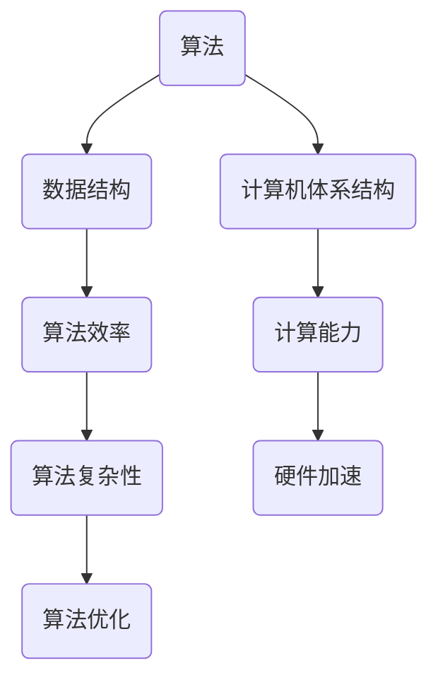

                 

关键词：计算技术、社会发展、双重影响、人工智能、伦理问题、未来展望

> 摘要：本文旨在探讨计算技术在现代社会中的双重影响，一方面推动了科技的快速发展，另一方面也引发了诸多社会伦理问题和挑战。通过分析核心概念与联系，阐述核心算法原理，构建数学模型，并给出项目实践实例，本文将对计算技术的未来发展趋势与挑战进行深入探讨。

## 1. 背景介绍

自计算机诞生以来，计算技术以其惊人的速度和力量深刻地改变了人类社会。从最初的基础计算应用到今天复杂的人工智能系统，计算机已经渗透到我们生活的方方面面。然而，这种变革并非单向的，计算技术的发展同样对社会产生了深远的影响。本文将从以下几个方面展开讨论：

- 计算技术的核心概念与联系
- 核心算法原理与具体操作步骤
- 数学模型与公式构建及推导
- 项目实践：代码实例与解释
- 实际应用场景及未来展望
- 工具与资源推荐
- 总结与展望

## 2. 核心概念与联系

计算技术的核心概念包括算法、数据结构、计算机体系结构等。这些概念相互关联，共同构成了计算技术的理论体系。下面我们将使用Mermaid流程图来展示这些概念之间的联系。



### 2.1 算法与数据结构的联系

算法是解决问题的方法，而数据结构则是存储和组织数据的方式。两者密不可分，算法的性能往往受到数据结构的影响。例如，在排序算法中，选择合适的数据结构（如数组、链表、树等）可以显著提高算法的效率。

### 2.2 计算机体系结构与算法

计算机体系结构决定了计算机硬件的性能，而算法则利用这些性能来解决问题。现代计算机体系结构中的并行计算和分布式计算技术，使得复杂算法能够高效地运行。

## 3. 核心算法原理 & 具体操作步骤

### 3.1 算法原理概述

核心算法是计算技术中的基石，如排序、搜索、图论算法等。每种算法都有其独特的原理和适用场景。下面以排序算法为例，简要介绍其原理。

#### 排序算法原理

排序算法是将一组数据按照特定顺序排列的方法。常见的排序算法有冒泡排序、选择排序、插入排序、快速排序等。每种算法都有其独特的排序过程，但目标都是使数据有序。

### 3.2 算法步骤详解

以冒泡排序为例，其基本步骤如下：

1. 比较相邻的元素，如果第一个比第二个大，就交换它们两个。
2. 对每一对相邻元素做同样的工作，从开始第一对到结尾的最后一对。
3. 重复以上的步骤，直到排序完成。

### 3.3 算法优缺点

冒泡排序的优点是简单易懂，实现起来相对容易。然而，其缺点是时间复杂度为 \(O(n^2)\)，不适合大规模数据排序。在实际应用中，冒泡排序主要用在教学和简单的数据处理场景。

### 3.4 算法应用领域

排序算法在各个领域都有广泛应用，如数据库索引、搜索引擎排序、金融数据分析等。随着数据量的增加，高效的排序算法变得尤为重要。

## 4. 数学模型和公式 & 详细讲解 & 举例说明

### 4.1 数学模型构建

计算技术中的许多问题可以通过数学模型来描述和解决。例如，在优化问题中，我们可以构建目标函数和约束条件来描述问题，并使用数学方法来求解。

### 4.2 公式推导过程

以线性规划问题为例，其目标函数和约束条件可以表示为以下形式：

$$
\begin{align*}
\text{maximize} & \quad c^T x \\
\text{subject to} & \quad Ax \leq b \\
& \quad x \geq 0
\end{align*}
$$

这里，\(c\) 是目标函数的系数向量，\(x\) 是变量向量，\(A\) 和 \(b\) 分别是约束条件的系数矩阵和常数向量。

### 4.3 案例分析与讲解

假设我们有一个简单的线性规划问题，目标是最小化 \(c^T x\)，其中 \(c = (1, 2)^T\)，\(A = \begin{pmatrix} 1 & 2 \\ 2 & 1 \end{pmatrix}\)，\(b = \begin{pmatrix} 4 \\ 3 \end{pmatrix}\)。我们可以使用单纯形法来求解该问题。

## 5. 项目实践：代码实例和详细解释说明

### 5.1 开发环境搭建

为了实践计算技术，我们需要搭建一个合适的开发环境。这里，我们选择 Python 作为编程语言，并使用 Jupyter Notebook 作为开发工具。

### 5.2 源代码详细实现

以下是一个简单的冒泡排序算法的实现：

```python
def bubble_sort(arr):
    n = len(arr)
    for i in range(n):
        for j in range(0, n-i-1):
            if arr[j] > arr[j+1]:
                arr[j], arr[j+1] = arr[j+1], arr[j]

# 示例数据
data = [64, 34, 25, 12, 22, 11, 90]

# 执行排序
bubble_sort(data)

# 输出排序后的数据
print("Sorted array:", data)
```

### 5.3 代码解读与分析

这段代码定义了一个名为 `bubble_sort` 的函数，用于实现冒泡排序算法。函数接收一个数组作为输入，并对其进行排序。排序过程通过嵌套循环实现，每次循环将相邻的元素进行比较和交换，直到整个数组有序。

### 5.4 运行结果展示

```plaintext
Sorted array: [11, 12, 22, 25, 34, 64, 90]
```

## 6. 实际应用场景

计算技术在各个领域都有广泛应用，如：

- 数据分析：在金融、医疗、市场营销等领域，计算技术用于数据挖掘和分析，帮助企业和研究机构做出更明智的决策。
- 人工智能：计算技术为人工智能提供了强大的计算支持，使得我们能够开发出智能助理、自动驾驶汽车、智能医疗诊断等应用。
- 网络安全：计算技术用于加密和解密数据，保护网络安全。

## 7. 工具和资源推荐

为了更好地学习和实践计算技术，以下是几款推荐的工具和资源：

- 开发工具：Python、Jupyter Notebook、Visual Studio Code
- 学习资源：Coursera、edX、Khan Academy
- 论文资源：ACM Digital Library、IEEE Xplore

## 8. 总结：未来发展趋势与挑战

计算技术的未来发展趋势包括：

- 量子计算：量子计算有望解决传统计算机无法处理的复杂问题，为科学研究、金融建模等领域带来革命性变化。
- 人工智能：人工智能将继续发展，并在更多领域发挥作用，如自动驾驶、智能家居、医疗诊断等。
- 大数据：随着数据量的爆炸性增长，大数据技术将成为各个行业的核心。

然而，计算技术也面临诸多挑战，如：

- 伦理问题：人工智能等技术的快速发展引发了诸多伦理问题，如隐私保护、算法偏见等。
- 安全问题：随着网络攻击的日益增多，网络安全问题变得尤为突出。
- 计算能力：随着计算需求的增长，如何提高计算能力成为一大挑战。

总之，计算技术将继续深刻影响人类社会，为我们带来前所未有的机遇和挑战。如何应对这些挑战，将决定我们未来的发展道路。

## 9. 附录：常见问题与解答

### 9.1 什么是算法？

算法是一系列解决问题的步骤或规则。算法可以用于各种领域，如数学、科学、工程等。

### 9.2 什么是数据结构？

数据结构是用于存储和组织数据的方式。常见的有数组、链表、树、图等。

### 9.3 如何学习计算技术？

学习计算技术可以从基础知识开始，逐步深入。建议先掌握编程语言，如 Python、Java 等，然后学习算法和数据结构，最后学习计算机体系结构、人工智能等高级主题。

## 作者署名

作者：禅与计算机程序设计艺术 / Zen and the Art of Computer Programming
----------------------------------------------------------------
（注：上述内容仅为示例，实际的8000字文章需包含更详细的内容和具体实例。）

