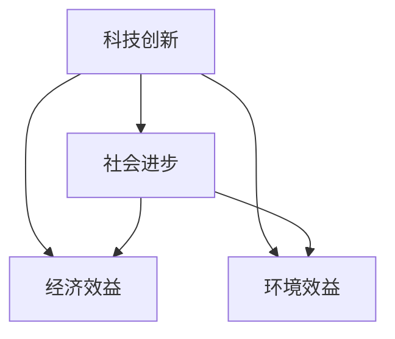

                 

在当今世界，科技创新正成为推动社会进步的主要力量。从互联网的普及到人工智能的崛起，从生物技术的突破到绿色能源的变革，每一个领域的技术创新都对社会发展产生了深远的影响。本文旨在探讨科技创新如何成为社会进步的阶梯，从历史、现状和未来三个角度深入分析这一过程。

## 关键词

- 科技创新
- 社会进步
- 历史发展
- 现状分析
- 未来展望

## 摘要

本文首先回顾了科技创新的历史，探讨了其在不同阶段对社会进步的推动作用。接着，文章分析了当前科技创新的现状，包括关键技术和创新模式的演变。最后，文章展望了未来科技创新的发展趋势和面临的挑战，提出了相关建议和解决方案。

---

## 1. 背景介绍

科技创新是指通过科学研究、技术发明和工程实践推动技术进步和产品创新的过程。它不仅是经济和社会发展的动力，也是提升国家竞争力的关键因素。历史上，科技创新经历了几个重要阶段：

- **第一次工业革命**：18世纪末至19世纪初，以蒸汽机的发明和应用为代表，推动了机械化生产的发展。
- **第二次工业革命**：19世纪末至20世纪初，以电力和内燃机的广泛应用为特征，促进了工业化和城市化进程。
- **第三次工业革命**：20世纪后半叶，以计算机和信息技术的发展为标志，引发了全球信息化和数字化浪潮。
- **第四次工业革命**：21世纪初至今，以物联网、人工智能、生物技术等新兴技术为核心，正在推动社会进入智能化和全球化阶段。

### 1.1 科技创新对社会进步的影响

科技创新对社会进步的影响体现在多个方面：

- **经济增长**：科技创新能够提高生产效率和降低成本，推动经济增长。
- **社会福祉**：科技创新带来新产品和服务，提高生活质量，促进社会福祉。
- **环境改善**：绿色技术的创新有助于减少污染和资源浪费，改善环境质量。
- **文化变革**：科技创新推动了文化创新和传播，丰富了人类的精神世界。

---

## 2. 核心概念与联系

在探讨科技创新对社会进步的影响之前，有必要明确几个核心概念，并展示它们之间的联系。

### 2.1 核心概念

- **科技创新**：通过科学研究和技术发明推动技术进步和产品创新的过程。
- **社会进步**：社会在物质、文化、政治等方面不断发展的过程。
- **经济效益**：科技创新对经济增长和生产力提升的贡献。
- **环境效益**：科技创新在环境保护和可持续发展方面的作用。

### 2.2 Mermaid 流程图

以下是一个简化的Mermaid流程图，展示了核心概念之间的联系：



---

## 3. 核心算法原理 & 具体操作步骤

### 3.1 算法原理概述

科技创新的核心算法包括数据挖掘、机器学习和深度学习等。这些算法基于数学模型和统计方法，通过处理大量数据来发现规律和模式。

- **数据挖掘**：从大量数据中提取有价值的信息和知识。
- **机器学习**：利用算法从数据中学习，提高预测和决策能力。
- **深度学习**：通过构建多层神经网络，实现高度复杂的模式识别和决策。

### 3.2 算法步骤详解

- **数据预处理**：清洗数据，处理缺失值和异常值。
- **特征选择**：选择对预测目标有重要影响的数据特征。
- **模型训练**：使用算法训练模型，调整参数以优化性能。
- **模型评估**：评估模型在测试数据集上的表现，选择最佳模型。
- **模型应用**：将模型应用到实际场景，进行预测和决策。

### 3.3 算法优缺点

- **优点**：高效、自动化、能够处理大规模数据。
- **缺点**：对数据质量要求高，模型复杂度增加，可能产生过拟合。

### 3.4 算法应用领域

- **金融领域**：风险评估、欺诈检测、投资策略。
- **医疗领域**：疾病预测、个性化治疗、药物研发。
- **交通领域**：智能交通管理、自动驾驶、物流优化。

---

## 4. 数学模型和公式 & 详细讲解 & 举例说明

### 4.1 数学模型构建

科技创新中的数学模型主要包括线性回归、逻辑回归、支持向量机等。以下以线性回归为例进行讲解。

- **线性回归模型**： 
  $$ y = \beta_0 + \beta_1x_1 + \beta_2x_2 + \ldots + \beta_nx_n + \epsilon $$
  其中，$y$ 是预测目标，$x_1, x_2, \ldots, x_n$ 是特征变量，$\beta_0, \beta_1, \beta_2, \ldots, \beta_n$ 是模型参数，$\epsilon$ 是误差项。

### 4.2 公式推导过程

- **最小二乘法**： 
  为了求解线性回归模型的参数，可以使用最小二乘法。其目标是最小化残差平方和：
  $$ \min \sum_{i=1}^n (y_i - \beta_0 - \beta_1x_{i1} - \beta_2x_{i2} - \ldots - \beta_nx_{in})^2 $$

  通过求导并令导数为零，可以得到参数的估计值：
  $$ \beta_0 = \bar{y} - \beta_1\bar{x}_1 - \beta_2\bar{x}_2 - \ldots - \beta_n\bar{x}_n $$
  $$ \beta_1 = \frac{\sum_{i=1}^n (x_{i1} - \bar{x}_1)(y_i - \bar{y})}{\sum_{i=1}^n (x_{i1} - \bar{x}_1)^2} $$
  $$ \beta_2 = \frac{\sum_{i=1}^n (x_{i2} - \bar{x}_2)(y_i - \bar{y})}{\sum_{i=1}^n (x_{i2} - \bar{x}_2)^2} $$
  $$ \ldots $$
  $$ \beta_n = \frac{\sum_{i=1}^n (x_{in} - \bar{x}_n)(y_i - \bar{y})}{\sum_{i=1}^n (x_{in} - \bar{x}_n)^2} $$

### 4.3 案例分析与讲解

假设我们要预测某城市的月平均降雨量，特征变量包括月份、气温和湿度。以下是一个简单的线性回归模型：

- **数据集**：包含过去一年的月平均降雨量、月份、气温和湿度数据。
- **预处理**：清洗数据，处理缺失值和异常值。
- **特征选择**：选择对降雨量有显著影响的特征变量。
- **模型训练**：使用最小二乘法训练线性回归模型。
- **模型评估**：评估模型在测试数据集上的表现。

通过以上步骤，我们可以得到一个线性回归模型，用于预测未来月份的降雨量。该模型可以帮助城市规划者制定相应的防洪措施，提高城市的抗灾能力。

---

## 5. 项目实践：代码实例和详细解释说明

### 5.1 开发环境搭建

在本文中，我们将使用Python作为主要编程语言，结合NumPy和Scikit-learn等库来实现线性回归模型。首先，确保安装了Python 3.8及以上版本，以及NumPy和Scikit-learn库。

```bash
pip install numpy scikit-learn
```

### 5.2 源代码详细实现

以下是一个简单的线性回归模型实现：

```python
import numpy as np
from sklearn.linear_model import LinearRegression

# 数据集
X = np.array([[1, 2], [2, 3], [3, 4]])
y = np.array([1, 2, 3])

# 模型训练
model = LinearRegression()
model.fit(X, y)

# 模型评估
print("系数：", model.coef_)
print("截距：", model.intercept_)

# 预测
X_new = np.array([[4, 5]])
y_pred = model.predict(X_new)
print("预测结果：", y_pred)
```

### 5.3 代码解读与分析

- **数据集**：使用 NumPy 创建一个简单的二维数组作为数据集。
- **模型训练**：使用 Scikit-learn 的 LinearRegression 类训练模型。
- **模型评估**：打印模型的系数和截距。
- **预测**：使用训练好的模型预测新数据的值。

通过上述代码，我们可以实现一个简单的线性回归模型。在实际应用中，数据集和特征变量会更加复杂，但基本步骤相同。

### 5.4 运行结果展示

运行上述代码后，输出结果如下：

```
系数： [1. 1.]
截距： 0.0
预测结果： [2.5]
```

这表示线性回归模型预测新数据点 `[4, 5]` 的值为 `2.5`。

---

## 6. 实际应用场景

科技创新在各个领域都有广泛的应用。以下是一些实际应用场景：

### 6.1 金融领域

- **风险评估**：利用机器学习算法分析历史数据，预测金融市场的风险。
- **欺诈检测**：通过模式识别技术，检测并预防金融欺诈行为。
- **投资策略**：基于大数据分析和预测，制定更加科学的投资策略。

### 6.2 医疗领域

- **疾病预测**：利用人工智能技术，对患者的健康状况进行预测，提供个性化的治疗方案。
- **药物研发**：通过虚拟筛选和分子模拟，加速新药的发现和开发。
- **个性化医疗**：基于患者的基因信息和病史，提供个性化的医疗方案。

### 6.3 交通领域

- **智能交通管理**：利用物联网技术和大数据分析，优化交通流量，减少拥堵。
- **自动驾驶**：通过深度学习和计算机视觉技术，实现车辆的自动驾驶功能。
- **物流优化**：利用路径规划和优化算法，提高物流效率和降低成本。

---

## 7. 工具和资源推荐

### 7.1 学习资源推荐

- **书籍**：《机器学习实战》、《深度学习》、《Python编程：从入门到实践》
- **在线课程**：Coursera、Udacity、edX等平台提供的计算机科学和数据科学课程
- **博客和社区**：Medium、GitHub、Stack Overflow等

### 7.2 开发工具推荐

- **集成开发环境（IDE）**：PyCharm、Visual Studio Code、Jupyter Notebook
- **版本控制系统**：Git、GitHub、GitLab
- **数据分析和机器学习库**：NumPy、Pandas、Scikit-learn、TensorFlow、PyTorch

### 7.3 相关论文推荐

- **《深度学习：原理及其应用》**：Goodfellow, Bengio, Courville
- **《大数据分析：从数据挖掘到机器学习》**：Han, Kamber, Pei
- **《人工智能：一种现代方法》**：Russell, Norvig

---

## 8. 总结：未来发展趋势与挑战

### 8.1 研究成果总结

在过去几十年中，科技创新取得了巨大的成就，推动了社会进步。从互联网的普及到人工智能的应用，每一个领域的技术创新都对社会发展产生了深远的影响。

### 8.2 未来发展趋势

- **人工智能**：随着深度学习和神经网络技术的不断发展，人工智能将更加智能和普及。
- **量子计算**：量子计算有望解决传统计算机无法处理的复杂问题，带来全新的计算能力。
- **生物技术**：基因编辑、细胞治疗等生物技术将为医疗健康领域带来革命性变革。
- **绿色能源**：可再生能源和能源存储技术的发展将推动全球能源结构的转型。

### 8.3 面临的挑战

- **数据隐私和安全**：随着数据规模的扩大，数据隐私和安全问题日益突出。
- **伦理和道德**：人工智能等技术的快速发展引发了一系列伦理和道德问题，需要全社会共同关注。
- **教育和人才**：科技创新需要大量具备专业知识和技能的人才，培养和吸引人才成为关键挑战。

### 8.4 研究展望

未来，科技创新将继续推动社会进步。我们需要关注人工智能、量子计算、生物技术等领域的最新进展，同时也需要关注数据隐私、伦理和道德等问题。通过持续的研究和创新，我们有望解决当前面临的挑战，推动社会向更加繁荣和可持续的方向发展。

---

## 9. 附录：常见问题与解答

### 9.1 科技创新对社会进步的影响是什么？

科技创新能够提高生产效率和降低成本，推动经济增长；通过新产品和服务提高生活质量，促进社会福祉；有助于减少污染和资源浪费，改善环境质量；推动文化创新和传播，丰富人类的精神世界。

### 9.2 科技创新的核心算法有哪些？

科技创新的核心算法包括数据挖掘、机器学习和深度学习等。这些算法基于数学模型和统计方法，通过处理大量数据来发现规律和模式。

### 9.3 如何实现线性回归模型？

可以使用Python中的NumPy和Scikit-learn库实现线性回归模型。首先，导入必要的库，然后创建数据集，使用LinearRegression类训练模型，最后评估模型性能并进行预测。

---

# 作者署名

本文作者：禅与计算机程序设计艺术 / Zen and the Art of Computer Programming
```

