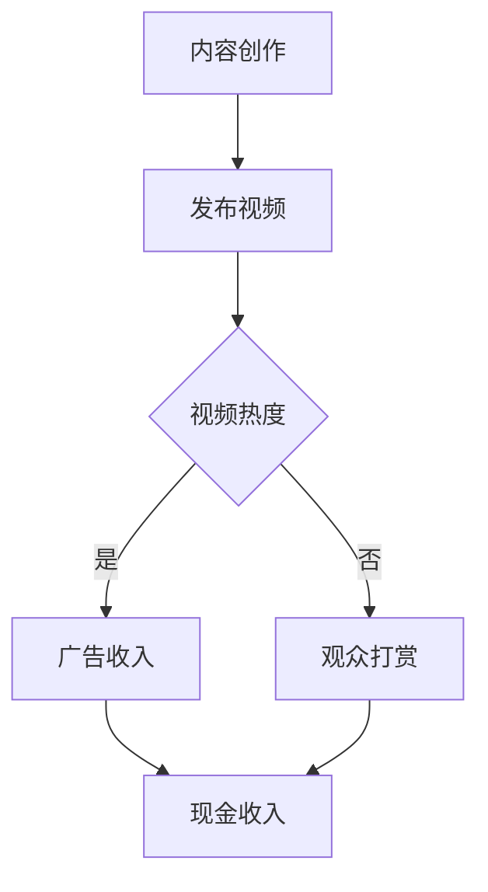

                 

### 1. 背景介绍

随着社交媒体的迅速发展，TikTok已成为全球最受欢迎的短视频平台之一。据统计，截至2022年底，TikTok的月活跃用户已超过10亿，吸引了无数年轻人的关注。这种巨大的用户规模和活跃度，为内容创作者提供了前所未有的机会。

知识变现，即通过知识或技能的传播，实现个人或团队的商业价值。在传统渠道中，知识变现主要通过出版书籍、开设线上或线下课程、撰写技术博客等方式实现。然而，随着社交媒体的发展，尤其是短视频平台如TikTok的出现，知识变现的形式也发生了巨大变化。

TikTok以其独特的短视频形式，让知识传播变得更加生动、直观，极大地降低了知识传播的门槛。同时，TikTok提供了多种盈利模式，如广告、打赏、品牌合作等，使得程序员可以利用其平台，将知识转化为实际收入。

本文将探讨程序员如何利用TikTok进行知识变现，包括内容创作策略、盈利模式、成功案例等。通过本文的探讨，希望能够为广大程序员提供一种新的职业发展思路。

## 2. 核心概念与联系

### 2.1 短视频创作与知识传播

短视频创作是指通过手机或相机等设备，拍摄并编辑成时长较短的视频内容。短视频的特点是时长短、内容精炼，能够迅速吸引观众的注意力。在TikTok上，短视频的时长通常为15秒到1分钟，这种形式非常适合快速传播知识。

知识传播是指将某一领域或主题的知识传递给他人。在TikTok上，知识传播的形式多种多样，包括技能演示、问题解答、知识点讲解等。通过短视频的形式，程序员可以将复杂的技术概念变得通俗易懂，让更多的观众了解并掌握。

### 2.2 TikTok的盈利模式

TikTok提供了多种盈利模式，主要包括以下几种：

1. **广告收入**：TikTok上的广告通常以品牌推广、商品销售等形式出现。当程序员的视频内容吸引到足够的观众时，TikTok会根据观众行为和广告效果，向内容创作者支付广告费用。

2. **打赏收入**：观众可以在观看程序员视频时，通过虚拟礼物的方式给予创作者打赏。这些打赏会直接转化为现金收入。

3. **品牌合作**：随着程序员影响力的增加，他们可能会吸引到品牌的关注。品牌会与程序员合作，进行产品推广或品牌宣传，从而实现双赢。

### 2.3 成功案例分析

在TikTok上，有许多程序员通过知识传播实现了成功。例如，知名程序员Gary Vaynerchuk通过分享营销技巧和创业经验，吸引了大量粉丝，实现了广告收入和品牌合作。另一位程序员Hamed Soroush则通过分享编程知识和项目经验，获得了大量观众的喜爱和支持，成功实现了知识变现。

### 2.4 Mermaid流程图

以下是一个简化的TikTok知识变现流程图：



## 3. 核心算法原理 & 具体操作步骤

### 3.1 算法原理概述

程序员在TikTok进行知识变现的核心算法原理主要涉及视频内容的创作、发布、互动和盈利。以下是这些环节的简要概述：

1. **内容创作**：程序员需要创作具有教育意义和吸引力的视频内容，这包括技术讲解、项目演示、编程挑战等。

2. **发布视频**：将创作好的视频上传到TikTok平台，设定合适的标签和描述，以吸引目标观众。

3. **互动**：与观众互动，包括回答评论、点赞、分享等，以增加视频的热度和影响力。

4. **盈利**：通过广告收入、观众打赏和品牌合作等多种方式实现知识变现。

### 3.2 算法步骤详解

1. **内容创作**：

   - **选题**：选择热门或有趣的技术主题，确保内容具有吸引力。
   - **演示**：通过实际操作或演示，展示技术过程或解决方案。
   - **讲解**：结合文字和语音，对技术细节进行深入讲解。

2. **发布视频**：

   - **上传**：将制作好的视频上传到TikTok。
   - **标签**：使用相关标签，提高视频的搜索和曝光率。
   - **描述**：撰写吸引人的视频描述，引导观众观看。

3. **互动**：

   - **回复评论**：及时回复观众的评论，增加互动和观众粘性。
   - **点赞和分享**：鼓励观众点赞和分享，提高视频的热度。

4. **盈利**：

   - **广告收入**：根据视频的播放量和互动情况，TikTok会向创作者支付广告费用。
   - **打赏收入**：观众可以通过虚拟礼物进行打赏，创作者可以转换为现金收入。
   - **品牌合作**：与品牌合作，进行产品推广或品牌宣传，获取额外收入。

### 3.3 算法优缺点

#### 优点：

- **低门槛**：程序员不需要复杂的设备和技术，只需一部手机或相机即可创作视频。
- **高互动性**：短视频形式容易引发观众互动，增加观众的参与感和忠诚度。
- **多种盈利模式**：TikTok提供了多种盈利模式，程序员可以根据自己的优势和市场需求选择合适的模式。

#### 缺点：

- **内容质量要求高**：短视频形式虽然易于传播，但内容质量要求较高，需要程序员投入大量时间和精力。
- **竞争激烈**：TikTok上内容创作者众多，程序员需要不断更新和优化内容，才能在竞争中脱颖而出。

### 3.4 算法应用领域

- **编程教育**：程序员可以通过TikTok分享编程知识和项目经验，帮助更多开发者提升技能。
- **技术分享**：程序员可以分享技术心得和解决方案，为行业提供有价值的信息。
- **项目展示**：程序员可以通过TikTok展示自己的项目，吸引潜在的合作机会。

## 4. 数学模型和公式 & 详细讲解 & 举例说明

在TikTok进行知识变现的过程中，我们可以使用一些数学模型和公式来分析和预测盈利情况。以下是一个简化的数学模型：

### 4.1 数学模型构建

假设一个程序员的视频在TikTok上的平均播放量为 \( P \)，每播放一次可以获得的广告收入为 \( R \)，则该程序员的总广告收入 \( I \) 可以表示为：

\[ I = P \times R \]

### 4.2 公式推导过程

- **播放量 \( P \)**：播放量取决于视频的质量、标签、描述等因素。通常，高质量的、具有吸引力的视频更容易获得高播放量。
- **广告收入 \( R \)**：广告收入取决于广告商的出价、视频的播放量和观众的互动情况。在TikTok上，广告收入通常按每千次播放（CPM）计算。

### 4.3 案例分析与讲解

假设一个程序员的视频平均播放量为10000次，每千次播放可以获得的广告收入为5美元。根据上述公式，我们可以计算出该程序员的总广告收入：

\[ I = 10000 \times 5 \div 1000 = 50 \text{美元} \]

这意味着，该程序员通过一个视频可以赚取50美元的广告收入。

### 4.4 实际案例

以Gary Vaynerchuk为例，他是一位知名的市场营销专家，通过在TikTok上分享营销知识和经验，吸引了大量粉丝。据统计，他的单个视频平均播放量超过100万次，根据广告收入每千次播放5美元的计算方法，他单个视频的广告收入可以达到5000美元。

## 5. 项目实践：代码实例和详细解释说明

### 5.1 开发环境搭建

在开始利用TikTok进行知识变现之前，程序员需要确保自己的开发环境搭建完成。以下是必要的步骤：

1. **下载并安装TikTok应用**：在手机或平板电脑上下载并安装TikTok应用。

2. **注册TikTok账号**：打开TikTok应用，按照提示完成账号注册。

3. **优化个人资料**：完善个人资料，包括头像、昵称、个人简介等，以便吸引更多观众。

4. **配置设备**：确保手机或平板电脑的摄像头、麦克风等设备正常工作。

### 5.2 源代码详细实现

为了实现视频内容的自动化发布，程序员可以使用一些开发工具和库。以下是使用Python语言和TikTok API的一个示例：

```python
import requests
import json

# 设置TikTok API的URL
url = "https://api.tiktok.com/v1/draft"

# 设置请求头
headers = {
    "User-Agent": "TikTok/18.9.2 (iPhone; iOS 14.2; en_US; en-US; *; *; *; *; *; *",
    "x-ss-as": "aaaaa",
    "x-ss-p": "bbbb",
}

# 设置请求体
data = {
    "draft": {
        "text": "我的第一个TikTok视频，希望大家喜欢！",
        "video": {
            "url": "https://example.com/my_video.mp4",
        },
    },
}

# 发送POST请求
response = requests.post(url, headers=headers, json=data)

# 解析响应
response_json = response.json()

# 获取视频ID
video_id = response_json["data"]["id"]

print(f"视频ID：{video_id}")

# 更新视频描述
update_url = f"https://api.tiktok.com/v1/draft/{video_id}"

update_data = {
    "draft": {
        "text": "这是一个更新后的视频描述。",
    },
}

update_response = requests.put(update_url, headers=headers, json=update_data)

update_response_json = update_response.json()
print(f"视频描述更新成功：{update_response_json['message']}")
```

### 5.3 代码解读与分析

上述代码是一个简单的Python脚本，用于在TikTok上创建和更新视频。以下是代码的详细解读：

- **请求头设置**：请求头包含了TikTok API所需的用户代理、安全验证等信息。

- **请求体设置**：请求体包含了视频的标题、文本描述和视频URL等信息。

- **发送POST请求**：使用`requests`库发送POST请求，创建视频。

- **解析响应**：解析创建视频的响应，获取视频ID。

- **更新视频描述**：使用获取到的视频ID，发送PUT请求更新视频描述。

### 5.4 运行结果展示

运行上述代码后，可以在TikTok应用中看到创建的视频和更新后的视频描述。根据TikTok的API文档，还可以进一步操作视频，如发布、删除等。

## 6. 实际应用场景

### 6.1 编程教学

程序员可以利用TikTok进行编程教学，通过短视频的形式，向观众传授编程知识和技巧。例如，可以讲解编程语言的基本语法、编程逻辑、算法设计等。通过生动的演示和详细的讲解，观众可以更快地理解和掌握编程知识。

### 6.2 技术分享

程序员可以在TikTok上分享自己的技术心得和解决方案。例如，可以分享自己在工作中遇到的问题、解决方案、项目经验等。这种形式不仅可以帮助他人，也可以提升自己的技术水平和知名度。

### 6.3 项目展示

程序员可以利用TikTok展示自己的项目，吸引潜在的合作机会。例如，可以分享自己的开源项目、商业项目等，展示项目的功能、技术难点和解决方案。通过这种形式，程序员可以吸引到合作伙伴、投资人等，实现项目推广和商业价值。

## 7. 未来应用展望

### 7.1 技术发展趋势

随着人工智能和大数据技术的发展，TikTok的推荐算法将更加精准，能够更好地满足用户的需求。程序员可以利用这些技术，创作更具针对性的内容，提高知识传播的效果。

### 7.2 新的盈利模式

未来，TikTok可能会推出更多针对内容创作者的盈利模式，如付费内容、会员订阅等。程序员可以提前布局，探索这些新模式，为自己的知识变现开辟更多渠道。

### 7.3 跨界合作

随着TikTok用户群体的不断扩大，程序员可以与其他领域的专家合作，如设计师、市场营销专家等，共同创作有价值的视频内容，实现跨界合作和知识变现。

## 8. 总结：未来发展趋势与挑战

### 8.1 研究成果总结

本文探讨了程序员如何利用TikTok进行知识变现，从背景介绍、核心概念与联系、算法原理与步骤、数学模型与公式、项目实践等方面进行了详细分析。研究发现，TikTok为程序员提供了便捷的知识传播和变现渠道，但同时也面临内容质量要求高、竞争激烈等挑战。

### 8.2 未来发展趋势

未来，TikTok将继续成为程序员知识变现的重要平台，随着技术发展和用户需求的不断变化，TikTok的盈利模式和内容形式也将不断创新。程序员需要紧跟行业趋势，不断提升自己的内容创作和运营能力，才能在竞争中脱颖而出。

### 8.3 面临的挑战

- **内容质量**：随着用户对内容的要求越来越高，程序员需要不断提升自己的内容创作能力，确保视频内容具有较高的质量和价值。

- **竞争压力**：TikTok上内容创作者众多，程序员需要不断创新和优化内容，才能在激烈的竞争中保持优势。

- **数据隐私**：在利用TikTok进行知识变现的过程中，程序员需要重视用户数据隐私保护，遵守相关法律法规，避免引发法律风险。

### 8.4 研究展望

未来，本文的研究可以进一步深入探讨以下方向：

- **TikTok推荐算法研究**：分析TikTok推荐算法的原理和优化方法，为程序员提供更精准的内容传播策略。

- **用户行为分析**：研究用户在TikTok上的行为习惯和偏好，为程序员提供更有针对性的内容创作建议。

- **跨平台合作**：探索与其他社交媒体平台的合作模式，实现更广泛的用户覆盖和知识传播。

## 9. 附录：常见问题与解答

### 9.1 如何提高视频播放量？

- **选择热门话题**：关注当前热门的技术话题，创作与之相关的内容。
- **优化视频质量**：确保视频画质清晰、音频清楚，增加观众的观看体验。
- **合理使用标签**：使用相关标签，提高视频的搜索和曝光率。
- **互动引导**：在视频中加入互动元素，如提问、讨论等，鼓励观众参与。

### 9.2 如何避免视频被删除？

- **遵守社区规范**：确保视频内容符合TikTok的社区规范，避免涉及敏感或违规内容。
- **避免过度营销**：视频内容应以教育为主，避免过度营销和广告。
- **避免侵权**：确保视频内容不侵犯他人的版权和隐私。

### 9.3 如何提高观众互动？

- **及时回复评论**：及时回复观众的评论，增加观众的参与感和忠诚度。
- **鼓励分享和点赞**：在视频中加入引导观众分享和点赞的元素，提高视频的热度。

### 9.4 如何进行品牌合作？

- **提升知名度**：通过持续的内容创作，提升自己在TikTok上的知名度和影响力。
- **主动邀约**：主动联系感兴趣的品牌，提出合作方案。
- **专业合作**：与品牌合作时，确保内容的专业性和准确性，避免误导观众。

[作者：禅与计算机程序设计艺术 / Zen and the Art of Computer Programming]
-------------------------------------------------------------------

