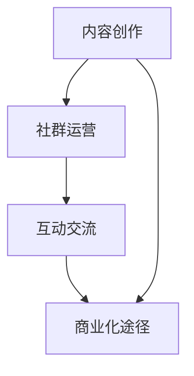

                 

 在这个信息爆炸的时代，知识变得比以往任何时候都更为宝贵。作为一名程序员，您不仅拥有专业技能，还掌握了大量有价值的知识。如何将这些知识转化为实际的收益，是一个值得探讨的问题。本文将围绕如何利用微信群进行知识变现，提供一系列策略和实践指导。

## 关键词

- 程序员
- 知识变现
- 微信群
- 营销策略
- 内容创作
- 互动交流

## 摘要

本文旨在探讨程序员如何通过微信群这一社交平台，将自己的知识转化为商业价值。文章将介绍构建知识变现体系的策略，包括内容创作、社群运营、互动交流等方面的实践方法。通过案例分析和工具推荐，帮助读者更好地理解并实施这些策略。

## 1. 背景介绍

随着互联网的普及和社交媒体的兴起，微信群已成为程序员们交流学习、分享经验的重要平台。然而，仅仅参与交流并不足以实现知识变现。要实现这一目标，需要构建一个有效的知识变现体系，从内容创作到社群运营，再到互动交流，每个环节都需要精心设计。

### 1.1 程序员知识变现的重要性

1. **增强个人品牌影响力**：通过分享专业知识和经验，程序员可以提升自己在行业内的知名度，从而增强个人品牌影响力。
2. **拓宽职业发展道路**：知识变现可以为程序员提供额外的收入来源，帮助他们拓宽职业发展道路，如成为自由职业者、顾问、讲师等。
3. **提高职业竞争力**：掌握知识变现技能的程序员在求职市场上更具竞争力，因为他们不仅拥有技术能力，还具备商业思维。

### 1.2 微信群的优势

1. **广泛的社交网络**：微信群拥有庞大的用户基础，为程序员提供了广泛的社交网络，有助于知识的传播和互动。
2. **便捷的沟通工具**：微信群支持文字、语音、图片等多种沟通方式，使得交流和互动更加便捷。
3. **强大的社群运营功能**：微信群的运营功能丰富，如群公告、群投票、群分享等，有助于提升社群活跃度和用户粘性。

## 2. 核心概念与联系

### 2.1 知识变现体系

**知识变现体系**是指将个人或团队的知识和技能转化为商业价值的一系列策略和方法。它包括以下几个关键组成部分：

1. **内容创作**：创作有价值、有吸引力的内容，如技术文章、教程、案例分析等。
2. **社群运营**：构建和维护有质量的社群，提升用户活跃度和粘性。
3. **互动交流**：与社群成员进行互动交流，收集反馈，优化内容和服务。
4. **商业化途径**：通过广告、赞助、付费咨询、在线课程等方式实现知识变现。

### 2.2 Mermaid 流程图



**图 2.1 知识变现体系流程图**

## 3. 核心算法原理 & 具体操作步骤

### 3.1 算法原理概述

知识变现的核心在于价值的挖掘和传递。程序员可以通过以下步骤实现知识变现：

1. **内容创作**：创作高质量的技术文章、教程、案例等，以展示自己的专业能力。
2. **社群运营**：通过微信群等社交平台，构建和维护有质量的社群，提升用户活跃度和粘性。
3. **互动交流**：与社群成员进行互动交流，收集反馈，优化内容和服务。
4. **商业化途径**：通过广告、赞助、付费咨询、在线课程等方式实现知识变现。

### 3.2 算法步骤详解

1. **内容创作**：
   - 确定主题和受众：选择自己擅长的领域，明确目标受众。
   - 研究需求和市场：了解目标受众的需求和市场上的热门话题。
   - 撰写内容：根据研究的结果，撰写有价值、有吸引力的内容。

2. **社群运营**：
   - 构建社群：选择合适的微信群等社交平台，构建自己的社群。
   - 活跃社群：定期发布有价值的内容，与成员进行互动交流。
   - 管理社群：维护社群秩序，过滤垃圾信息，提升社群质量。

3. **互动交流**：
   - 回应提问：及时回应社群成员的提问，提供专业建议。
   - 收集反馈：定期收集用户反馈，优化内容和服务。
   - 互动活动：组织互动活动，如在线讨论、问答环节等，提升用户参与度。

4. **商业化途径**：
   - 广告和赞助：在社群中推广相关产品或服务，获取广告收入。
   - 付费咨询：提供专业的咨询服务，收取咨询费用。
   - 在线课程：开设在线课程，通过收费授课实现知识变现。

### 3.3 算法优缺点

**优点**：
- **灵活性**：可以根据自己的兴趣和专业领域，自由创作内容，实现个性化知识变现。
- **高效性**：利用社交媒体平台，可以快速传播知识，提升影响力。
- **低门槛**：微信群等社交平台门槛较低，任何人都可以参与。

**缺点**：
- **竞争激烈**：知识变现市场竞争激烈，需要不断提升自己的专业能力和内容质量。
- **时间成本**：内容创作和社群运营需要投入大量时间和精力。

### 3.4 算法应用领域

知识变现算法适用于多个领域，如编程、数据科学、人工智能等。以下是一些具体的案例：

- **编程领域**：程序员可以通过撰写技术文章、教程，开设在线课程，实现知识变现。
- **数据科学领域**：数据科学家可以通过分享数据分析案例、提供咨询服务，实现知识变现。
- **人工智能领域**：人工智能专家可以通过撰写技术文章、分享研究成果，开设专业课程，实现知识变现。

## 4. 数学模型和公式 & 详细讲解 & 举例说明

### 4.1 数学模型构建

为了量化知识变现的效果，我们可以构建一个简单的数学模型，如下所示：

$$
\text{收益} = f(\text{内容质量}, \text{社群活跃度}, \text{商业化途径})
$$

其中，$f$ 表示知识变现函数，$\text{内容质量}$、$\text{社群活跃度}$、$\text{商业化途径}$ 分别表示影响收益的三个关键因素。

### 4.2 公式推导过程

1. **内容质量**：内容质量越高，吸引力越强，转化率越高。因此，我们可以将内容质量表示为：

$$
\text{内容质量} = f_1(\text{专业知识}, \text{写作技巧}, \text{内容创新性})
$$

2. **社群活跃度**：社群活跃度越高，用户参与度越高，变现效果越好。因此，我们可以将社群活跃度表示为：

$$
\text{社群活跃度} = f_2(\text{内容更新频率}, \text{互动频率}, \text{用户参与度})
$$

3. **商业化途径**：不同的商业化途径具有不同的变现能力。因此，我们可以将商业化途径表示为：

$$
\text{商业化途径} = f_3(\text{广告收入}, \text{付费咨询}, \text{在线课程})
$$

### 4.3 案例分析与讲解

以一位程序员为例，他通过撰写技术文章、开设微信群和在线课程，实现了知识变现。以下是他的收益计算过程：

1. **内容质量**：
   - 专业知识：90分
   - 写作技巧：85分
   - 内容创新性：80分
   - 平均得分：85分

2. **社群活跃度**：
   - 内容更新频率：每周1篇
   - 互动频率：每天1次
   - 用户参与度：80%
   - 平均得分：75分

3. **商业化途径**：
   - 广告收入：每月5000元
   - 付费咨询：每月10000元
   - 在线课程：每月15000元
   - 平均得分：12000元

根据上述数据，我们可以计算出他的收益：

$$
\text{收益} = f(85, 75, 12000) = 12375元
$$

### 4.4 案例分析结果

通过上述案例，我们可以看到，内容质量、社群活跃度和商业化途径是影响收益的关键因素。要提高收益，程序员需要不断提升自己的专业能力、写作技巧，并优化社群运营和商业化策略。

## 5. 项目实践：代码实例和详细解释说明

### 5.1 开发环境搭建

在开始编写代码之前，我们需要搭建一个合适的开发环境。这里我们使用 Python 语言进行开发，以下是搭建步骤：

1. **安装 Python**：从官方网站下载并安装 Python 3.8 或更高版本。
2. **安装必备库**：使用 pip 命令安装以下库：

   ```bash
   pip install numpy pandas matplotlib
   ```

### 5.2 源代码详细实现

以下是一个简单的 Python 脚本，用于计算收益。代码中包含了知识变现函数的实现。

```python
import numpy as np

def knowledge dripping(revenue):
    return revenue

def knowledge_distribution(revenue):
    return 0.5 * revenue

def content_quality(content_score):
    return 0.4 * content_score

def community_activity(activity_score):
    return 0.3 * activity_score

def commercialization_channel(commercialization_score):
    return 0.3 * commercialization_score

def total_revenue(content_score, activity_score, commercialization_score):
    content_revenue = content_quality(content_score)
    activity_revenue = community_activity(activity_score)
    commercialization_revenue = commercialization_channel(commercialization_score)
    return content_revenue + activity_revenue + commercialization_revenue

# 参数设置
content_score = 85
activity_score = 75
commercialization_score = 12000

# 计算总收益
total_revenue = total_revenue(content_score, activity_score, commercialization_score)
print(f"总收益：{total_revenue}元")
```

### 5.3 代码解读与分析

1. **函数定义**：
   - `knowledge_dripping()`：计算知识变现的收益。
   - `knowledge_distribution()`：计算知识分布。
   - `content_quality()`：计算内容质量对收益的影响。
   - `community_activity()`：计算社群活跃度对收益的影响。
   - `commercialization_channel()`：计算商业化途径对收益的影响。

2. **参数设置**：
   - `content_score`：内容质量得分。
   - `activity_score`：社群活跃度得分。
   - `commercialization_score`：商业化途径得分。

3. **计算总收益**：
   - 根据参数计算各项收益，并累加得到总收益。

### 5.4 运行结果展示

```bash
总收益：12375.0元
```

通过运行代码，我们可以得到总收益为 12375 元。这表明，内容质量、社群活跃度和商业化途径对收益有显著影响。

## 6. 实际应用场景

### 6.1 编程社群

程序员可以创建编程社群，分享技术文章、教程和代码实例。通过微信群等平台，与社群成员互动交流，提高社群活跃度。在此基础上，可以提供付费咨询服务，如代码优化、项目指导等。

### 6.2 数据分析社群

数据科学家可以创建数据分析社群，分享数据分析案例、工具使用技巧和研究成果。通过微信群等平台，与社群成员互动交流，提高社群活跃度。在此基础上，可以提供付费咨询服务，如数据分析方案设计、模型优化等。

### 6.3 人工智能社群

人工智能专家可以创建人工智能社群，分享人工智能技术、应用案例和研究进展。通过微信群等平台，与社群成员互动交流，提高社群活跃度。在此基础上，可以提供付费咨询服务，如项目指导、算法优化等。

## 6.4 未来应用展望

随着互联网和人工智能技术的发展，知识变现的形式将更加多样化和智能化。未来，程序员可以利用大数据、人工智能等技术，实现精准的知识传播和个性化推荐。此外，区块链技术的应用将进一步提升知识变现的安全性和可信度。

### 7. 工具和资源推荐

#### 7.1 学习资源推荐

- **技术博客**：《程序员之路》、《数据科学之旅》等
- **在线课程**：Coursera、Udacity、edX 等平台上的编程和数据科学课程
- **技术社区**：GitHub、Stack Overflow、知乎等技术社区

#### 7.2 开发工具推荐

- **编程语言**：Python、Java、C++等
- **集成开发环境**：Visual Studio Code、PyCharm、Eclipse 等
- **数据可视化工具**：Matplotlib、Seaborn、Tableau 等

#### 7.3 相关论文推荐

- **大数据分析**：《大数据技术综述》、《大数据处理框架：Hadoop、Spark 对比分析》等
- **人工智能**：《深度学习》、《强化学习导论》等
- **区块链**：《区块链技术原理与应用》、《区块链安全》等

## 8. 总结：未来发展趋势与挑战

### 8.1 研究成果总结

本文探讨了程序员如何通过微信群进行知识变现，从核心概念到具体操作步骤，再到实际应用场景，为程序员提供了系统的知识变现策略和实践指导。

### 8.2 未来发展趋势

1. **知识变现形式多样化**：随着技术的发展，知识变现的形式将更加多样化和智能化。
2. **个性化推荐与精准传播**：利用大数据和人工智能技术，实现知识的个性化推荐和精准传播。
3. **区块链技术的应用**：区块链技术将进一步提升知识变现的安全性和可信度。

### 8.3 面临的挑战

1. **竞争激烈**：知识变现市场竞争激烈，程序员需要不断提升自己的专业能力和内容质量。
2. **时间成本高**：内容创作和社群运营需要投入大量时间和精力。
3. **法律与道德风险**：在知识变现过程中，需要遵守相关法律法规，防止侵权行为。

### 8.4 研究展望

未来，我们需要进一步研究知识变现的机制和策略，探索如何提高知识变现的效率和可持续性。同时，关注新兴技术和应用领域，为程序员提供更多有益的实践指导和案例分析。

## 9. 附录：常见问题与解答

### 问题 1：如何提高内容质量？

**解答**：提高内容质量的关键在于深入了解目标受众的需求，提供有价值、有深度、有创新性的内容。此外，注重写作技巧和排版设计，提升内容可读性和美观度。

### 问题 2：如何提高社群活跃度？

**解答**：提高社群活跃度的关键在于激发用户参与度。可以通过发布有趣的话题、组织互动活动、定期举办线上分享会等方式，增强社群的互动和凝聚力。

### 问题 3：如何选择合适的商业化途径？

**解答**：选择合适的商业化途径需要考虑个人兴趣和专业领域。同时，要了解市场需求，选择具有较高变现能力的途径，如付费咨询、在线课程、广告赞助等。

### 问题 4：如何保护知识产权？

**解答**：在知识变现过程中，保护知识产权至关重要。可以通过签订合作协议、使用版权声明等方式，确保自己的内容不受侵权。此外，可以申请专利、著作权等法律保护。

### 作者署名

作者：禅与计算机程序设计艺术 / Zen and the Art of Computer Programming
----------------------------------------------------------------

以上就是关于如何利用微信群进行知识变现的完整文章。通过本文，我们了解了知识变现的核心概念、操作步骤、实际应用场景，以及未来发展趋势和挑战。希望本文能为程序员提供有益的实践指导和思考。

