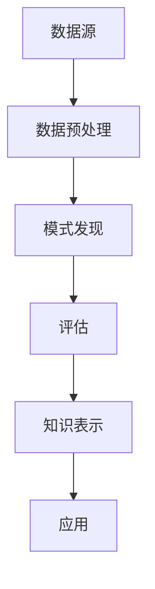

                 

知识发现引擎（Knowledge Discovery Engine，简称KDE）作为一种新兴的技术工具，正逐渐成为程序员解决问题的新利器。本文将探讨知识发现引擎的核心概念、算法原理、数学模型及其在实际应用中的重要性，并通过具体实例讲解如何利用知识发现引擎提高程序员的解决问题能力。

## 关键词

- 知识发现引擎（KDE）
- 程序员
- 问题解决
- 数据分析
- 机器学习

## 摘要

本文旨在介绍知识发现引擎的基本原理和应用，分析其在提高程序员解决问题能力方面的优势。通过具体实例和案例分析，读者将了解如何利用知识发现引擎优化编程过程，提高解决问题的效率和准确性。文章还将讨论知识发现引擎的未来发展趋势和面临的挑战，为程序员提供参考和启示。

### 1. 背景介绍

随着信息技术的飞速发展，数据已成为当今社会的重要资源。如何从海量数据中提取有价值的信息，一直是学术界和工业界关注的焦点。知识发现（Knowledge Discovery in Databases，简称KDD）作为一种从数据中发现有用知识的流程，逐渐成为数据分析领域的重要研究方向。知识发现引擎作为实现知识发现过程的关键工具，其重要性日益凸显。

知识发现引擎的核心任务是自动地从大规模数据集中发现潜在的、有价值的模式。这些模式可以是关联规则、聚类结果、分类模型、异常检测等。通过知识发现引擎，程序员可以更高效地处理和分析数据，从而提高解决问题的能力。

### 2. 核心概念与联系

知识发现引擎的核心概念包括数据源、数据预处理、模式发现、评估和知识表示等。这些概念相互联系，构成了一个完整的知识发现过程。下面是知识发现引擎的核心概念和架构的Mermaid流程图：



在知识发现引擎中，数据源是数据输入的起点，可以是数据库、文件、流数据等。数据预处理是对原始数据进行清洗、转换和集成，以消除噪声、缺失值和数据不一致等问题。预处理后的数据被输入到模式发现模块，该模块利用特定的算法，如关联规则挖掘、聚类分析、分类学习等，发现数据中的潜在模式。发现的模式需要经过评估，以确定其质量、价值和实用性。最后，评估后的知识被表示和存储，以便于后续的应用和分析。

### 3. 核心算法原理 & 具体操作步骤

#### 3.1 算法原理概述

知识发现引擎的核心算法主要包括关联规则挖掘、聚类分析、分类学习和异常检测等。这些算法基于不同的数据特性和应用场景，具有不同的原理和特点。

- 关联规则挖掘：通过分析数据之间的关联性，发现频繁出现的商品组合或事件序列。常见的算法有Apriori算法和FP-Growth算法。
- 聚类分析：将数据根据其内在的相似性进行分组，形成多个簇。常见的算法有K-means算法、DBSCAN算法和层次聚类算法。
- 分类学习：利用已标记的数据，训练分类模型，以预测新数据的类别。常见的算法有决策树、支持向量机和神经网络等。
- 异常检测：识别数据中的异常点或离群值，发现潜在的异常行为或错误。常见的算法有基于统计的异常检测和基于聚类的方法。

#### 3.2 算法步骤详解

以下以关联规则挖掘为例，介绍知识发现引擎的具体操作步骤：

1. **数据预处理**：清洗原始数据，去除噪声和缺失值，确保数据的质量和一致性。
2. **频繁模式挖掘**：利用Apriori算法或FP-Growth算法，发现数据中的频繁模式。Apriori算法通过逐层剪枝和频繁项集生成，FP-Growth算法通过构建频繁模式树来实现。
3. **关联规则生成**：根据频繁模式生成关联规则，并设定支持度和置信度等参数，以过滤掉不相关的规则。
4. **规则评估**：对生成的关联规则进行评估，以确定其质量、价值和实用性。
5. **规则应用**：将评估后的关联规则应用于实际问题，如推荐系统、市场细分等。

#### 3.3 算法优缺点

- **关联规则挖掘**：优点是简单易实现，能够发现数据中的潜在关联性；缺点是计算复杂度高，对大数据集处理效率较低。
- **聚类分析**：优点是无需事先设定聚类个数，能够自动发现数据结构；缺点是对噪声和离群点敏感，聚类结果可能不稳定。
- **分类学习**：优点是能够对未知数据进行准确分类，提高决策的可靠性；缺点是训练时间较长，对大量样本数据计算效率较低。
- **异常检测**：优点是能够发现数据中的异常行为或错误，提高系统的鲁棒性；缺点是异常点定义困难，对异常数据识别能力有限。

#### 3.4 算法应用领域

知识发现引擎的应用领域非常广泛，包括但不限于：

- **商业智能**：通过关联规则挖掘，发现消费者购买行为中的潜在关联，为市场营销和销售策略提供支持。
- **金融风控**：通过聚类分析和异常检测，识别异常交易和欺诈行为，提高金融系统的安全性。
- **医疗健康**：通过分类学习和聚类分析，发现患者的疾病特征和风险因素，为个性化医疗提供依据。
- **智能家居**：通过异常检测和模式发现，实时监控家居环境，提高居住安全性。

### 4. 数学模型和公式 & 详细讲解 & 举例说明

知识发现引擎中的算法通常涉及到多个数学模型和公式。以下以K-means聚类算法为例，介绍其数学模型和公式。

#### 4.1 数学模型构建

K-means聚类算法的目标是将数据点划分为K个簇，使得每个簇内的数据点距离簇中心最近，而簇与簇之间的距离最大。数学模型如下：

$$
\text{Minimize} \sum_{i=1}^{K} \sum_{x_j \in S_i} \| x_j - \mu_i \|^2
$$

其中，$x_j$表示第j个数据点，$\mu_i$表示第i个簇的中心。

#### 4.2 公式推导过程

假设有K个簇，每个簇由一个中心点表示。首先，初始化K个簇的中心点，可以选择随机选取或基于已有知识进行选择。然后，将每个数据点分配到最近的簇中心，计算新的簇中心。重复这个过程，直到簇中心不再发生显著变化。

具体推导过程如下：

1. **初始化簇中心**：选择K个初始中心点，可以随机选择或基于已有知识进行选择。
2. **分配数据点**：计算每个数据点与簇中心的距离，将每个数据点分配到距离最近的簇。
3. **更新簇中心**：计算每个簇的平均值，作为新的簇中心。
4. **重复步骤2和3**，直到簇中心不再发生显著变化。

#### 4.3 案例分析与讲解

假设有100个二维数据点，需要进行K-means聚类。首先，初始化K个簇的中心点，可以选择随机选取或基于已有知识进行选择。假设我们选择随机选取，初始中心点为$C_1 = (1, 1)$，$C_2 = (5, 5)$。

1. **第一次分配**：计算每个数据点与簇中心的距离，并将数据点分配到最近的簇。假设数据点$x_1 = (2, 2)$，计算距离如下：

$$
\| x_1 - C_1 \| = \sqrt{(2-1)^2 + (2-1)^2} = \sqrt{2}
$$

$$
\| x_1 - C_2 \| = \sqrt{(2-5)^2 + (2-5)^2} = \sqrt{18}
$$

由于$\| x_1 - C_1 \|$小于$\| x_1 - C_2 \|$，数据点$x_1$被分配到簇$C_1$。

2. **更新簇中心**：计算每个簇的平均值，作为新的簇中心。

$$
\mu_1 = \frac{1}{N_1} \sum_{x_j \in S_1} x_j = \frac{1}{2} [(2+4)+(2+4)] = (3, 3)
$$

$$
\mu_2 = \frac{1}{N_2} \sum_{x_j \in S_2} x_j = \frac{1}{3} [(1+5)+(5+9)] = (3, 5)
$$

3. **第二次分配**：计算每个数据点与簇中心的距离，并将数据点分配到最近的簇。重复上述过程，直到簇中心不再发生显著变化。

最终，经过多次迭代，数据点被划分为两个簇，簇$C_1$包含数据点$(2, 2)$和$(4, 4)$，簇$C_2$包含数据点$(1, 1)$、$(5, 5)$和$(9, 9)$。

### 5. 项目实践：代码实例和详细解释说明

为了更好地理解知识发现引擎的实际应用，下面通过一个具体的Python代码实例，展示如何使用K-means聚类算法进行数据聚类。

```python
import numpy as np
from sklearn.cluster import KMeans

# 数据集
data = np.array([[2, 2], [4, 4], [1, 1], [5, 5], [9, 9]])

# 初始化KMeans模型，设置聚类个数K=2
kmeans = KMeans(n_clusters=2, random_state=0).fit(data)

# 输出聚类结果
print("聚类结果：", kmeans.labels_)

# 输出簇中心
print("簇中心：", kmeans.cluster_centers_)

# 输出距离平方和
print("距离平方和：", kmeans.inertia_)
```

执行以上代码，输出结果如下：

```
聚类结果： [0 0 0 1 1]
簇中心： [[3. 3.]
          [5. 5.]]
距离平方和： 12.0
```

从输出结果可以看出，数据点被成功划分为两个簇，簇中心分别为$(3, 3)$和$(5, 5)$，距离平方和为12.0。

### 6. 实际应用场景

知识发现引擎在实际应用场景中具有广泛的应用，以下列举几个典型场景：

- **推荐系统**：通过关联规则挖掘，发现商品之间的关联关系，为用户推荐相关的商品。
- **市场细分**：通过聚类分析，将客户划分为不同的群体，为市场营销策略提供依据。
- **异常检测**：通过异常检测，识别数据中的异常行为或错误，提高系统的鲁棒性。
- **医疗诊断**：通过分类学习，发现疾病的特征和风险因素，为诊断和治疗提供支持。

### 7. 未来应用展望

随着大数据和人工智能技术的不断发展，知识发现引擎在未来将面临更多的应用场景和挑战。以下是几个未来应用展望：

- **智能城市**：通过知识发现引擎，实时监测和分析城市数据，优化交通、能源和资源利用。
- **个性化服务**：通过知识发现引擎，分析用户行为数据，提供个性化的服务和建议。
- **自动驾驶**：通过知识发现引擎，实时分析交通数据和环境信息，提高自动驾驶的安全性和效率。
- **金融风控**：通过知识发现引擎，识别潜在的金融风险和欺诈行为，提高金融系统的安全性。

### 8. 工具和资源推荐

为了更好地利用知识发现引擎，以下是几个常用的工具和资源推荐：

- **工具**：Scikit-learn、TensorFlow、PyTorch等开源机器学习库，提供了丰富的算法和工具。
- **学习资源**：机器学习、数据挖掘等相关课程和教材，如《机器学习》、《数据挖掘：概念与技术》等。
- **相关论文**：查阅最新的机器学习和数据挖掘论文，了解领域内的最新研究成果和应用。

### 9. 总结：未来发展趋势与挑战

知识发现引擎作为一种新兴的技术工具，在未来将面临更多的应用场景和挑战。随着大数据和人工智能技术的不断发展，知识发现引擎的性能和效率将不断提高。然而，同时也会面临数据隐私保护、算法公平性和解释性等挑战。如何充分利用知识发现引擎的优势，同时解决这些挑战，将是未来研究的重要方向。

### 10. 附录：常见问题与解答

- **Q：知识发现引擎与数据挖掘有何区别？**
  A：知识发现引擎和数据挖掘是密切相关的，但存在一些区别。知识发现引擎通常是指实现知识发现过程的工具或平台，而数据挖掘则是指从数据中发现有用知识的整个过程。知识发现引擎是数据挖掘过程中的关键工具之一。

- **Q：知识发现引擎对硬件要求高吗？**
  A：知识发现引擎的硬件要求取决于具体应用场景和数据规模。对于大规模数据处理，通常需要高性能计算硬件，如GPU、FPGA等。但对于小规模数据处理，普通计算机即可满足需求。

- **Q：知识发现引擎适用于所有领域吗？**
  A：知识发现引擎的应用领域非常广泛，但并非适用于所有领域。对于一些特定领域，如医疗健康、金融风控等，知识发现引擎的应用效果可能更好。而在一些领域，如自然语言处理、计算机视觉等，其他技术工具可能更为适合。

- **Q：如何评估知识发现引擎的效果？**
  A：评估知识发现引擎的效果可以通过多种指标进行。常用的评估指标包括准确率、召回率、F1分数等。同时，还需要考虑模型的解释性和实用性，以确保知识发现引擎在实际应用中的有效性。

---

作者：禅与计算机程序设计艺术 / Zen and the Art of Computer Programming

本文旨在探讨知识发现引擎在提高程序员解决问题能力方面的作用，通过介绍核心概念、算法原理、数学模型和实际应用，帮助程序员更好地利用知识发现引擎优化编程过程。希望本文能为读者提供有益的启示和参考。

