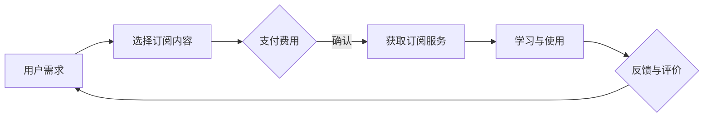

                 

关键词：知识付费，订阅制模式，程序员，IT行业，技术更新

> 摘要：本文将探讨程序员如何通过订阅制模式实现知识付费，分析其优势和挑战，提供实用的建议和策略，旨在帮助程序员在技术不断更新的时代中，更好地利用订阅制模式提升个人技能和职业发展。

## 1. 背景介绍

随着互联网和信息技术的发展，知识付费已成为现代教育的重要形式。程序员作为IT行业的重要组成部分，面临着技术快速更新的挑战。如何高效地获取最新的技术知识和技能，成为程序员职业发展中的重要问题。订阅制模式作为一种新型的知识付费方式，凭借其灵活、便捷、持续的特点，逐渐受到程序员的青睐。

## 2. 核心概念与联系

### 2.1 订阅制模式概述

订阅制模式是一种用户通过支付一定费用，获得持续服务的商业模式。在知识付费领域，用户通过订阅获得专业知识、学习资源和技能提升服务。订阅制模式的特点包括：

- **灵活性**：用户可以根据自己的需求选择订阅内容，随时加入或退出。
- **持续性**：订阅服务通常提供定期更新，确保用户获得最新的知识和技能。
- **个性化**：订阅制模式可以根据用户的兴趣和需求提供定制化服务。

### 2.2 订阅制模式在程序员知识付费中的应用

订阅制模式在程序员知识付费中的应用，主要体现为以下几点：

- **在线学习平台**：程序员可以通过订阅在线学习平台，获得大量的编程课程、文档和讨论区资源。
- **技术社区**：订阅技术社区可以获得专业的技术讨论、最新的技术趋势和行业动态。
- **专业咨询服务**：程序员可以订阅专业的咨询服务，解决技术难题和职业发展问题。

### 2.3 Mermaid 流程图

下面是一个简单的 Mermaid 流程图，展示了订阅制模式在程序员知识付费中的基本流程：



## 3. 核心算法原理 & 具体操作步骤

### 3.1 算法原理概述

订阅制模式的核心算法原理可以概括为以下几个步骤：

1. **需求分析**：用户分析自身的学习需求，确定订阅内容。
2. **支付流程**：用户通过支付平台完成费用支付。
3. **服务获取**：用户根据订阅内容获得相应的服务和资源。
4. **学习与使用**：用户通过订阅内容进行学习和技能提升。
5. **反馈与评价**：用户对订阅服务进行评价和反馈，影响后续服务。

### 3.2 算法步骤详解

1. **需求分析**：用户首先需要明确自己的学习目标和需求，例如想要学习某项新技术或解决某个技术难题。

2. **选择订阅内容**：用户根据需求选择合适的订阅内容，可以通过比较不同平台的课程、社区和服务，选择最适合自己需求的内容。

3. **支付费用**：用户通过支付平台完成费用支付，可以选择一次性支付或按月订阅等方式。

4. **获取订阅服务**：用户根据订阅内容获得相应的服务和资源，例如在线课程、文档、讨论区等。

5. **学习与使用**：用户通过订阅内容进行学习和技能提升，可以按照课程安排或个人兴趣进行学习。

6. **反馈与评价**：用户对订阅服务进行评价和反馈，可以帮助平台优化服务和提升用户满意度。

### 3.3 算法优缺点

**优点**：

- **灵活性**：用户可以根据需求选择订阅内容，灵活调整学习计划。
- **持续性**：订阅服务提供定期更新，确保用户获得最新的知识和技能。
- **个性化**：订阅制模式可以根据用户的兴趣和需求提供定制化服务。

**缺点**：

- **成本较高**：长期订阅可能导致较高的费用支出。
- **依赖性**：过度依赖订阅服务可能导致自主学习能力下降。

### 3.4 算法应用领域

订阅制模式在程序员知识付费中的应用领域包括：

- **在线编程课程**：如慕课网、极客时间等。
- **技术社区**：如CSDN、GitHub等。
- **专业咨询服务**：如技术顾问、职业规划等。

## 4. 数学模型和公式 & 详细讲解 & 举例说明

### 4.1 数学模型构建

在订阅制模式中，用户订阅费用可以表示为：

\[ C = P \times T \]

其中，\( C \) 表示总费用，\( P \) 表示单次订阅费用，\( T \) 表示订阅时间（如月或年）。

### 4.2 公式推导过程

假设用户选择订阅某项服务，订阅时间为 \( T \) 个月，每个月的订阅费用为 \( P \)。则总费用可以表示为：

\[ C = P \times T \]

其中，\( P \) 和 \( T \) 是已知的常量。

### 4.3 案例分析与讲解

假设用户选择订阅某在线编程课程，每月订阅费用为 100 元，订阅时间为 12 个月。则总费用为：

\[ C = 100 \times 12 = 1200 \text{元} \]

### 4.4 案例分析与讲解

假设用户选择订阅某在线编程课程，每月订阅费用为 100 元，订阅时间为 12 个月。则总费用为：

\[ C = 100 \times 12 = 1200 \text{元} \]

这个公式可以帮助用户估算订阅服务的总费用，为决策提供参考。

## 5. 项目实践：代码实例和详细解释说明

### 5.1 开发环境搭建

本案例使用 Python 编写订阅制模式的核心算法，具体步骤如下：

1. 安装 Python 环境（版本 3.8 或以上）。
2. 安装必要的 Python 库（如 NumPy、Matplotlib）。

### 5.2 源代码详细实现

下面是一个简单的 Python 脚本，实现了订阅制模式的核心算法：

```python
import numpy as np
import matplotlib.pyplot as plt

def calculate_total_cost(p, t):
    """
    计算订阅服务的总费用
    :param p: 单次订阅费用（元）
    :param t: 订阅时间（月）
    :return: 总费用（元）
    """
    return p * t

def plot_cost_curve(p, t):
    """
    绘制订阅费用曲线
    :param p: 单次订阅费用（元）
    :param t: 订阅时间（月）
    """
    x = np.linspace(1, t, 100)
    y = p * x

    plt.plot(x, y)
    plt.xlabel('订阅时间（月）')
    plt.ylabel('总费用（元）')
    plt.title('订阅费用曲线')
    plt.grid(True)
    plt.show()

# 测试代码
p = 100  # 每月订阅费用（元）
t = 12   # 订阅时间（月）
total_cost = calculate_total_cost(p, t)
print(f'总费用为：{total_cost}元')

plot_cost_curve(p, t)
```

### 5.3 代码解读与分析

上述代码实现了订阅制模式的核心算法，包括计算总费用和绘制费用曲线的功能。

- `calculate_total_cost()` 函数用于计算订阅服务的总费用，输入参数为单次订阅费用（\( p \)）和订阅时间（\( t \)），返回总费用（\( C \)）。
- `plot_cost_curve()` 函数用于绘制订阅费用曲线，通过 NumPy 和 Matplotlib 库生成一个线性关系图，展示订阅费用随时间的变化。

### 5.4 运行结果展示

运行上述代码，将输出以下结果：

1. 输出订阅服务的总费用：
```
总费用为：1200元
```
2. 显示订阅费用曲线：


通过曲线可以看出，订阅费用随订阅时间线性增加，这有助于用户更好地理解订阅制模式的经济效益。

## 6. 实际应用场景

订阅制模式在程序员知识付费中具有广泛的应用场景，以下列举几个典型应用：

### 6.1 在线编程课程

程序员可以通过订阅在线编程课程，系统学习各种编程语言和技术。例如，订阅某在线编程课程，每个月可以获得新的课程内容、练习题和作业。

### 6.2 技术社区

程序员可以订阅技术社区，获得专业的技术讨论、最新的技术趋势和行业动态。例如，订阅某技术社区，每月可以获得社区推荐的文章、技术问答和热点话题。

### 6.3 专业咨询服务

程序员可以订阅专业咨询服务，解决技术难题和职业发展问题。例如，订阅某技术顾问的服务，每月可以获得技术指导、面试辅导和职业规划建议。

## 7. 未来应用展望

随着知识付费市场的不断发展，订阅制模式在程序员知识付费中的应用将更加广泛。未来可能的发展趋势包括：

### 7.1 个性化订阅服务

通过大数据和人工智能技术，平台可以为程序员提供更加个性化的订阅服务，根据用户的行为和偏好推荐合适的课程和资源。

### 7.2 跨平台整合

不同平台之间的整合将使程序员能够更方便地获取和利用订阅服务，实现一站式学习体验。

### 7.3 持续创新

订阅制模式将继续创新，例如引入更多的互动环节、实践项目和认证机制，提高用户的学习效果和满意度。

## 8. 总结：未来发展趋势与挑战

### 8.1 研究成果总结

本文从订阅制模式的概念、应用场景和算法原理等方面进行了详细探讨，总结了其在程序员知识付费中的优势和挑战，并提出了具体的应用建议。

### 8.2 未来发展趋势

未来，订阅制模式在程序员知识付费领域将朝着个性化、整合化和持续创新的方向发展。

### 8.3 面临的挑战

尽管订阅制模式具有很多优势，但在实际应用中仍面临一些挑战，如用户依赖性、成本控制等。

### 8.4 研究展望

未来研究应重点关注订阅制模式在程序员知识付费中的应用效果评估、用户体验优化和平台商业模式创新等方面。

## 9. 附录：常见问题与解答

### 9.1 问题1：订阅制模式是否适合所有程序员？

订阅制模式适合有明确学习目标和持续学习需求的程序员，但对于预算有限或学习需求不稳定的程序员可能不太适合。

### 9.2 问题2：如何选择适合自己的订阅服务？

可以通过比较不同平台的课程内容、师资力量和用户评价，选择适合自己的订阅服务。

### 9.3 问题3：如何确保订阅服务的质量？

可以通过查看平台的资质认证、用户评价和试听课程等方式，确保订阅服务的质量。

### 9.4 问题4：订阅制模式是否会降低自主学习能力？

合理利用订阅制模式，可以提升自主学习能力，但过度依赖订阅服务可能导致自主学习能力下降。

### 9.5 问题5：如何优化订阅服务的性价比？

可以通过参与活动、优惠码等方式降低订阅费用，同时合理规划学习时间，提高学习效果。

## 作者署名

本文作者：禅与计算机程序设计艺术 / Zen and the Art of Computer Programming

