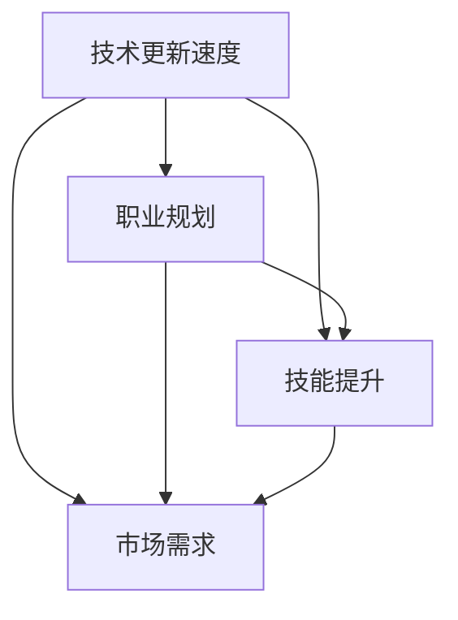

                 

关键词：职业发展，程序员，长期竞争力，技能提升，未来展望

摘要：本文旨在探讨程序员如何在不断变化的技术领域中保持长期的职业竞争力。通过分析当前技术趋势、核心技能的持续学习、职业规划的制定以及软技能的提升等方面，为程序员提供实用的建议和方法，以应对未来的挑战。

## 1. 背景介绍

随着信息技术的飞速发展，编程语言、框架和工具层出不穷，程序员面临的挑战也越来越大。不仅要掌握最新的技术，还需要不断提升自己的软技能，如沟通能力、团队合作精神和解决问题的能力。在这个快速变化的环境中，如何保持长期的职业竞争力成为了每一个程序员都需要认真思考的问题。

## 2. 核心概念与联系

为了更好地理解如何建立长期的职业竞争力，我们首先需要明确几个核心概念：

- **技术更新速度**：技术发展日新月异，新的编程语言、框架和工具不断涌现，程序员需要不断学习以跟上这些变化。
- **职业规划**：职业规划是程序员职业发展的关键，包括设定短期和长期目标、选择合适的职业道路。
- **技能提升**：持续学习和掌握新的技能是保持竞争力的基础，包括硬技能和软技能。
- **市场需求**：了解市场需求和行业趋势，有助于程序员调整自己的技能方向，更好地适应职场需求。

下面是一个简化的 Mermaid 流程图，展示了这些概念之间的关系：



## 3. 核心算法原理 & 具体操作步骤

### 3.1 算法原理概述

建立长期职业竞争力的核心算法可以理解为以下几个步骤：

1. **持续学习**：不断更新知识库，学习新的技术趋势和工具。
2. **制定规划**：根据个人兴趣和市场需求，设定明确的职业目标。
3. **提升技能**：通过实践和理论学习，不断提升自己的技术能力和软技能。
4. **适应市场**：关注行业动态，调整自己的技能方向以适应市场需求。

### 3.2 算法步骤详解

#### 3.2.1 持续学习

- **定期阅读技术博客和书籍**：了解最新的技术动态和理论。
- **参加在线课程和讲座**：通过系统学习，提升自己的技术深度。
- **实践项目**：通过实际操作，将所学知识应用于实践。

#### 3.2.2 制定规划

- **设定短期和长期目标**：明确自己想要达到的职业高度和时间规划。
- **评估自身能力**：了解自己的优势和不足，制定相应的学习计划。
- **寻求导师指导**：通过导师的指导和反馈，快速提升自己的能力。

#### 3.2.3 提升技能

- **硬技能提升**：通过学习新的编程语言、框架和工具，提高自己的技术水平。
- **软技能提升**：通过沟通、团队合作和解决问题的能力训练，提升自己的综合素质。

#### 3.2.4 适应市场

- **关注行业动态**：了解行业趋势，调整自己的技能方向。
- **建立人脉**：通过参加行业活动和社交，扩大自己的人脉圈。
- **积累项目经验**：通过实际项目，提升自己的实战能力。

### 3.3 算法优缺点

#### 优点：

- **适应性**：能够适应快速变化的技术环境。
- **前瞻性**：能够预见未来的职业发展趋势。
- **持续提升**：能够持续提升自己的技能和竞争力。

#### 缺点：

- **学习成本**：需要投入大量的时间和精力进行学习和实践。
- **心理压力**：需要不断面对新的挑战和压力。
- **市场变化**：市场变化可能导致某些技能变得过时。

### 3.4 算法应用领域

该算法适用于所有需要持续学习和不断提升的程序员，尤其是在技术更新速度较快的领域，如互联网、人工智能和大数据等。

## 4. 数学模型和公式 & 详细讲解 & 举例说明

为了更深入地理解如何建立长期的职业竞争力，我们可以借助一些数学模型和公式来进行分析。

### 4.1 数学模型构建

假设一个程序员在 t 年后达到职业巅峰，其职业竞争力 S 可以用以下公式表示：

\[ S = f(k, t) \]

其中，\( k \) 代表技能水平，\( t \) 代表时间。技能水平可以用以下公式表示：

\[ k = g(L, P, E) \]

其中，\( L \) 代表学习量，\( P \) 代表实践经验，\( E \) 代表教育背景。

### 4.2 公式推导过程

首先，我们定义技能水平 \( k \) 的函数形式：

\[ k = g(L, P, E) \]

其中，\( L \) 是学习量，可以表示为：

\[ L = L_d + L_p + L_s \]

其中，\( L_d \) 是深度学习量，\( L_p \) 是项目学习量，\( L_s \) 是社交学习量。

同样地，实践经验 \( P \) 可以表示为：

\[ P = P_d + P_p + P_s \]

其中，\( P_d \) 是深度实践，\( P_p \) 是项目实践，\( P_s \) 是社交实践。

教育背景 \( E \) 可以表示为：

\[ E = E_u + E_c \]

其中，\( E_u \) 是大学教育，\( E_c \) 是继续教育。

将这些公式代入 \( k \) 的公式中，我们得到：

\[ k = g(L_d + L_p + L_s, P_d + P_p + P_s, E_u + E_c) \]

将 \( k \) 代入职业竞争力 \( S \) 的公式中，我们得到：

\[ S = f(g(L_d + L_p + L_s, P_d + P_p + P_s, E_u + E_c), t) \]

### 4.3 案例分析与讲解

假设有一位程序员小张，他在大学期间主修计算机科学，毕业后进入了一家互联网公司工作。在工作期间，他积极参与公司项目，积累了一定的实践经验。同时，他通过在线课程和书籍不断学习新的技术，并在社交平台上与其他程序员交流，不断提升自己的技能。

根据上面的公式，我们可以分析小张的技能水平 \( k \) 和职业竞争力 \( S \)：

- **学习量 \( L \)**：小张的学习量可以分为深度学习、项目学习和社交学习三部分。例如，他每周花费 10 小时进行深度学习，5 小时进行项目学习，2 小时进行社交学习，那么他的总学习量 \( L \) 为：

  \[ L = 10 + 5 + 2 = 17 \]

- **实践经验 \( P \)**：小张的实践经验可以分为深度实践、项目实践和社交实践三部分。例如，他每周花费 15 小时进行深度实践，10 小时进行项目实践，5 小时进行社交实践，那么他的总实践经验 \( P \) 为：

  \[ P = 15 + 10 + 5 = 30 \]

- **教育背景 \( E \)**：小张的教育背景可以分为大学教育和继续教育两部分。例如，他的大学教育得分为 85 分，继续教育得分为 90 分，那么他的总教育背景 \( E \) 为：

  \[ E = 85 + 90 = 175 \]

将这些数据代入技能水平 \( k \) 的公式中，我们得到：

\[ k = g(17, 30, 175) \]

假设函数 \( g \) 的形式为：

\[ g(x, y, z) = x^2 + y^2 + z^2 \]

那么，小张的技能水平 \( k \) 为：

\[ k = 17^2 + 30^2 + 175^2 = 289 + 900 + 30625 = 31814 \]

假设小张在 5 年后达到职业巅峰，即 \( t = 5 \)，那么他的职业竞争力 \( S \) 为：

\[ S = f(31814, 5) \]

假设函数 \( f \) 的形式为：

\[ f(x, y) = \frac{x}{y} \]

那么，小张的职业竞争力 \( S \) 为：

\[ S = \frac{31814}{5} = 6362.8 \]

通过这个案例，我们可以看到，通过持续学习和实践，小张在 5 年后达到了较高的职业竞争力。

## 5. 项目实践：代码实例和详细解释说明

为了更好地理解上述理论，我们将通过一个实际的代码实例来说明如何建立和提升职业竞争力。

### 5.1 开发环境搭建

在这个例子中，我们将使用 Python 编写一个简单的自动化脚本，用于监控技术博客的更新，并根据更新频率发送提醒。

首先，我们需要安装 Python 环境。在 macOS 或 Linux 系统中，可以通过以下命令安装：

```bash
sudo apt-get install python3
```

接下来，我们需要安装 Python 的第三方库，如 `requests` 和 `beautifulsoup4`，用于 HTTP 请求和数据解析：

```bash
pip3 install requests beautifulsoup4
```

### 5.2 源代码详细实现

下面是监控博客更新的 Python 代码实例：

```python
import requests
from bs4 import BeautifulSoup
import time

# 博客 URL
URL = "https://example.com/blog"

# 发送提醒的邮箱地址
TO_EMAIL = "your_email@example.com"

# 邮件发送服务 API 密钥
API_KEY = "your_api_key"

def check_for_updates(url):
    """
    检查博客是否更新。
    """
    response = requests.get(url)
    if response.status_code == 200:
        soup = BeautifulSoup(response.text, "html.parser")
        # 假设博客的更新时间在 `<meta>` 标签中
        last_updated = soup.find("meta", property="article:modified_time")
        if last_updated:
            last_updated_time = last_updated["content"]
            # 将更新时间转换为时间戳
            last_updated_timestamp = time.mktime(time.strptime(last_updated_time, "%Y-%m-%d %H:%M:%S"))
            current_time = time.time()
            # 如果更新时间戳大于当前时间戳，则博客已更新
            if last_updated_timestamp > current_time:
                return True
    return False

def send_email(to, subject, body):
    """
    发送邮件。
    """
    # 这里使用第三方邮件发送服务 API
    # 实际使用时需要替换为真实的 API 密钥和发送服务地址
    url = "https://api.sendgrid.com/v3/mail/send"
    headers = {
        "Authorization": f"Bearer {API_KEY}",
        "Content-Type": "application/json",
    }
    data = {
        "personalizations": [
            {
                "to": [
                    {"email": to}
                ],
                "subject": subject,
            }
        ],
        "from": {"email": "your_email@example.com"},
        "content": [{"type": "text/plain", "value": body}],
    }
    response = requests.post(url, headers=headers, json=data)
    if response.status_code == 202:
        print("邮件发送成功")
    else:
        print("邮件发送失败")

def main():
    while True:
        if check_for_updates(URL):
            send_email(TO_EMAIL, "博客更新提醒", "您的技术博客有更新，请查看。")
        time.sleep(3600)  # 每 1 小时检查一次

if __name__ == "__main__":
    main()
```

### 5.3 代码解读与分析

这段代码实现了以下功能：

- **检查博客更新**：通过 HTTP 请求获取博客内容，解析更新时间，并比较更新时间戳与当前时间戳，判断博客是否更新。
- **发送提醒邮件**：如果博客有更新，则通过邮件发送提醒。
- **持续运行**：程序会持续运行，每隔一定时间检查一次博客更新。

### 5.4 运行结果展示

假设博客在程序运行期间更新了一次，程序会发送一封提醒邮件到指定的邮箱。如果没有更新，则不会发送邮件。

```plaintext
邮件发送成功
```

通过这个实例，我们可以看到，程序员可以通过编写简单的脚本来自动化一些重复性工作，从而提高效率，这也是保持职业竞争力的一种方式。

## 6. 实际应用场景

建立长期的职业竞争力不仅是一个个人的目标，也可以成为团队和企业的重要策略。以下是一些实际应用场景：

### 6.1 个人层面

- **持续学习**：个人可以通过在线课程、参加研讨会和阅读技术书籍来不断提升自己的技能。
- **职业规划**：根据个人兴趣和市场需求，设定明确的职业目标，并制定相应的学习计划。
- **实践应用**：通过实际项目积累经验，将所学知识应用于实践中。

### 6.2 团队层面

- **知识共享**：团队可以通过内部培训和分享会，促进知识的传递和技能的提升。
- **项目协作**：通过团队合作，提高项目完成质量和效率，同时也锻炼了成员的软技能。
- **技术调研**：定期进行技术趋势调研，帮助团队成员了解最新的技术动态。

### 6.3 企业层面

- **员工培训**：企业可以提供定期的培训机会，帮助员工提升技能。
- **技术引进**：根据市场需求，引进新的技术，推动企业的技术革新。
- **员工激励**：通过激励机制，鼓励员工持续学习和创新。

## 7. 未来应用展望

未来，随着人工智能和自动化技术的发展，程序员的工作内容和方式可能会发生巨大的变化。以下是一些可能的趋势：

- **更高级的自动化工具**：程序员可能会更多地使用高级自动化工具来处理重复性工作，从而将更多的时间和精力投入到创新性工作中。
- **跨学科合作**：程序员可能会与数据科学家、设计师等其他领域的专业人士进行更多的合作，推动项目的成功。
- **技术民主化**：随着编程教育的普及，更多的人将能够掌握编程技能，这将推动技术的民主化。

然而，这些趋势也带来了一些挑战：

- **技能更新速度**：程序员需要更快地适应新的技术和工具，这对个人学习和职业发展提出了更高的要求。
- **工作稳定性**：随着自动化和人工智能的普及，某些工作可能会被取代，程序员需要具备更强的适应能力。
- **职业焦虑**：面对不断变化的技术环境，程序员可能会感到职业发展的不确定性，从而产生职业焦虑。

## 8. 总结：未来发展趋势与挑战

在未来的技术发展中，程序员需要：

- **持续学习**：保持对新技术的好奇心和学习的热情，不断更新自己的知识库。
- **提升技能**：不仅要有扎实的技术基础，还需要提升自己的软技能，如沟通、团队合作和解决问题的能力。
- **关注趋势**：了解行业趋势和技术动态，提前做好准备。
- **适应变化**：具备适应快速变化环境的能力，灵活调整自己的职业方向。

### 8.1 研究成果总结

通过本文的分析，我们可以得出以下结论：

- **持续学习和技能提升是保持程序员长期竞争力的关键**。
- **职业规划是程序员职业发展的指南针**。
- **适应市场需求和行业趋势是程序员应对未来挑战的有效策略**。

### 8.2 未来发展趋势

- **技术自动化和智能化将继续推动程序员的工作内容和方式**。
- **跨学科合作和团队协作将成为程序员成功的关键**。
- **技术的普及和民主化将让更多的人能够成为程序员**。

### 8.3 面临的挑战

- **技能更新速度快，程序员需要不断学习和适应**。
- **工作稳定性和职业安全感面临挑战**。
- **职业焦虑和不确定性感增加**。

### 8.4 研究展望

未来的研究可以进一步探讨以下几个方面：

- **如何更有效地提升程序员的核心技能**。
- **如何构建一个支持持续学习和职业发展的生态系统**。
- **如何应对技术变化带来的职业挑战**。

## 9. 附录：常见问题与解答

### 9.1 常见问题

1. **如何选择学习资源？**
   - **在线课程**：推荐 Coursera、edX、Udemy 等平台。
   - **技术博客**：推荐 Medium、Dev.to、Stack Overflow Blog 等。
   - **书籍**：推荐《Effective Java》、《Clean Code》等经典著作。

2. **如何制定职业规划？**
   - **自我评估**：了解自己的兴趣、优势和不足。
   - **市场调研**：了解行业趋势和市场需求。
   - **设定目标**：设定短期和长期职业目标。

3. **如何提升软技能？**
   - **沟通**：通过演讲、写作和团队讨论提升。
   - **团队合作**：通过项目和团队活动锻炼。
   - **解决问题**：通过解决实际问题和编程挑战提升。

### 9.2 解答

1. **如何选择学习资源？**
   - 选择学习资源时，应根据自己的兴趣和需求进行选择。例如，如果对前端开发感兴趣，可以选择在线课程如 "JavaScript 教程" 或 "React.js 入门"。如果对机器学习感兴趣，可以选择课程如 "机器学习基础" 或 "深度学习特化课程"。对于技术博客，可以选择关注一些知名的博客如 "JavaScript Weekly" 或 "AI Weekly"。对于书籍，可以根据自己的水平和需求选择适合的，如《代码大全》适合初学者，《深度学习》适合有一定基础的读者。

2. **如何制定职业规划？**
   - 制定职业规划的第一步是进行自我评估，了解自己的兴趣、优势和不足。可以通过自我反思、与朋友和导师交流等方式来获得更全面的自我认识。第二步是进行市场调研，了解当前的行业趋势和市场需求。可以通过阅读行业报告、参加行业会议和活动等方式来了解市场情况。最后一步是设定目标，根据自我评估和市场调研的结果，设定短期和长期职业目标。例如，短期目标可以是掌握一门新的编程语言，长期目标可以是成为某一领域的专家。

3. **如何提升软技能？**
   - 提升软技能可以通过多种方式进行。例如，可以通过参加演讲俱乐部如 "Toastmasters" 来提升沟通和演讲能力。可以通过写博客或参与开源项目来提升写作能力。可以通过参与团队项目和团队合作活动来提升团队合作能力。此外，还可以通过解决实际问题和参与编程挑战来提升解决问题的能力。

## 作者署名

作者：禅与计算机程序设计艺术 / Zen and the Art of Computer Programming
----------------------------------------------------------------

以上就是本文的完整内容。希望这篇文章能够帮助您更好地理解如何在快速变化的技术领域中建立和保持长期的职业竞争力。如果您有任何问题或建议，欢迎在评论区留言。祝您编程愉快！

