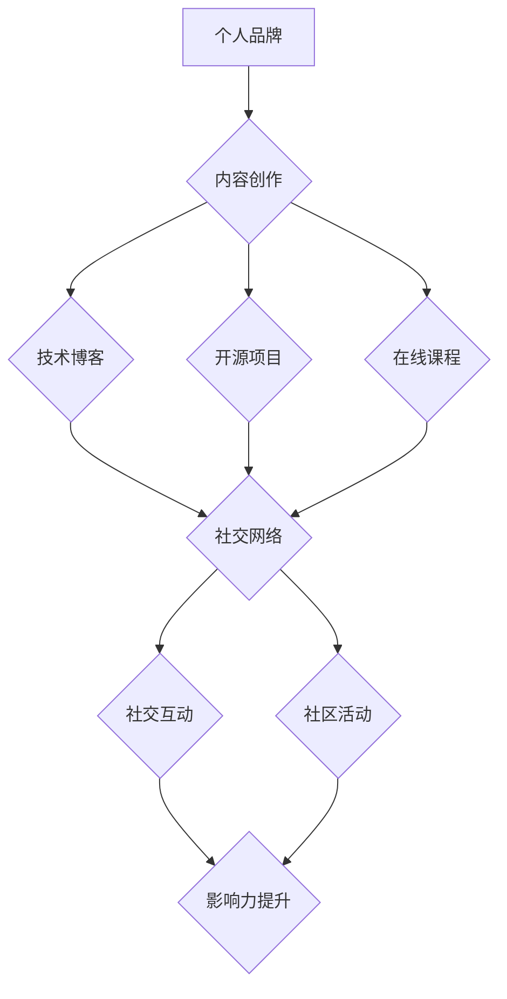

                 

关键词：个人影响力、程序员、生态、影响力打造、职业发展、技术传播、内容创作

> 摘要：本文旨在探讨程序员如何通过构建个人影响力生态，实现个人职业发展和技术传播。文章从背景介绍、核心概念、算法原理、数学模型、项目实践、实际应用、工具推荐及未来展望等多个维度，详细阐述了打造个人影响力的方法和策略。

## 1. 背景介绍

在当今信息技术快速发展的时代，程序员作为科技领域的核心力量，不仅在技术领域中扮演着至关重要的角色，同时也逐渐成为社会关注的焦点。然而，随着技术环境的日新月异，程序员面临的竞争压力也日益增大。如何在这个充满变数的环境中脱颖而出，成为每个程序员都需要深思的问题。个人影响力的打造，成为了程序员实现职业发展和持续成长的关键因素。

个人影响力不仅有助于程序员在职业生涯中获得更多的机会，还可以促进技术传播，推动整个行业的发展。通过个人影响力的打造，程序员可以更加高效地分享自己的知识和经验，为技术社区的繁荣做出贡献。此外，个人影响力还可以帮助程序员在职场中获得更多的认可和尊重，提升自身的职业竞争力。

本文将围绕程序员如何打造个人影响力生态这一主题，从多个维度详细探讨相关的方法和策略。通过本文的阅读，读者将能够了解到如何构建自己的个人品牌，如何通过内容创作和技术分享提升影响力，以及如何利用社交网络和社区活动扩大个人影响力。

## 2. 核心概念与联系

### 2.1 个人品牌

个人品牌是个人影响力的基础。它代表着一个人的形象、价值观、技能和专长。对于程序员来说，个人品牌不仅是一张名片，更是展示自己能力和价值的窗口。一个清晰、有吸引力的个人品牌可以帮助程序员在职业发展道路上走得更远。

### 2.2 内容创作

内容创作是程序员分享知识和经验的重要途径。无论是技术博客、开源项目，还是在线课程，内容创作都是程序员提升个人影响力的重要手段。高质量的内容可以吸引更多的关注者，增强个人在技术社区的地位。

### 2.3 社交网络

社交网络是连接程序员与外部世界的桥梁。通过社交媒体平台，程序员可以与同行交流，分享自己的见解和经验，拓展自己的视野。同时，社交网络也是个人品牌传播的重要渠道。

### 2.4 社区活动

参与社区活动可以增强程序员在技术社区的存在感。通过组织或参与技术会议、研讨会、代码贡献等活动，程序员可以提升自己的知名度和影响力。此外，社区活动还可以帮助程序员建立更多的人际关系，拓展职业网络。

## 2.5 Mermaid 流程图

以下是构建个人影响力生态的 Mermaid 流程图：



## 3. 核心算法原理 & 具体操作步骤

### 3.1 算法原理概述

程序员打造个人影响力生态的算法原理，可以概括为以下几个方面：

1. **内容为王**：优质的内容是吸引读者和建立个人品牌的关键。程序员需要持续产出有价值的技术内容，提升自身在技术社区的地位。
2. **持续学习**：技术领域日新月异，程序员需要不断学习新知识，提升自己的技能水平。只有不断进步，才能保持竞争力。
3. **互动交流**：通过社交网络和社区活动，与同行建立联系，扩大人脉，提升个人知名度。
4. **品牌塑造**：建立个人品牌，明确自己的定位和价值观，增强个人在技术社区的影响力和号召力。

### 3.2 算法步骤详解

1. **定位个人品牌**：首先，程序员需要明确自己的定位，确定个人品牌的核心理念和价值主张。这可以通过自我评估、市场调研和行业分析来实现。
2. **内容创作**：基于个人品牌定位，程序员可以开始创作内容。内容形式可以多样化，包括技术博客、开源项目、在线课程等。
3. **内容推广**：创作高质量的内容后，需要通过社交网络和社区活动进行推广。这包括发布到技术博客平台、社交媒体，以及参与技术会议和研讨会等。
4. **互动交流**：积极参与社交网络和社区活动，与同行互动，分享经验和见解，扩大影响力。
5. **持续优化**：根据反馈和数据分析，不断优化内容和推广策略，提升个人影响力。

### 3.3 算法优缺点

#### 优点：

1. **高效性**：通过算法化步骤，可以系统性地打造个人影响力，提高效率。
2. **可持续性**：持续的内容创作和学习，有助于长期保持个人影响力的稳定性。
3. **灵活性**：算法步骤可以根据个人情况和市场需求进行灵活调整。

#### 缺点：

1. **时间成本**：内容创作和社交互动需要大量的时间和精力投入。
2. **风险性**：个人品牌建设过程中，可能面临负面反馈和挑战。

### 3.4 算法应用领域

算法原理和步骤适用于所有希望通过技术传播实现个人职业发展的程序员。无论是在初创公司、大型企业，还是在学术界，都可以通过这一算法实现个人影响力的提升。

## 4. 数学模型和公式 & 详细讲解 & 举例说明

### 4.1 数学模型构建

在构建个人影响力生态的过程中，我们可以使用一些数学模型来量化影响力和内容价值。以下是一个简单的数学模型：

$$
\text{影响力} = f(\text{内容价值}, \text{互动次数}, \text{受众规模})
$$

其中：

- 内容价值：反映内容的质量和吸引力，可以通过点赞数、评论数、分享数等指标来衡量。
- 互动次数：反映内容传播的广度和深度，可以通过社交互动、社区活动等来衡量。
- 受众规模：反映内容的受众范围，可以通过关注者数量、访问量等来衡量。

### 4.2 公式推导过程

影响力的计算公式可以从以下几个方面进行推导：

1. **内容价值**：内容的质量直接影响受众的认可度和传播效果。高质量的内容通常能够获得更多的点赞、评论和分享。因此，我们可以将内容价值定义为：

$$
\text{内容价值} = \sum_{i=1}^{n} w_i \cdot \text{指标}_i
$$

其中：

- $w_i$：第 $i$ 个指标的权重，可以根据实际情况进行调整。
- $\text{指标}_i$：第 $i$ 个指标的具体数值，如点赞数、评论数、分享数等。

2. **互动次数**：互动次数反映内容传播的广度和深度。高互动次数意味着内容引发了更多的讨论和关注，从而提升了影响力。因此，我们可以将互动次数定义为：

$$
\text{互动次数} = \sum_{i=1}^{m} x_i
$$

其中：

- $x_i$：第 $i$ 次互动的具体数值，如评论数、分享数等。

3. **受众规模**：受众规模反映内容的传播范围。较大的受众规模意味着内容能够影响到更多的人，从而提升了影响力。因此，我们可以将受众规模定义为：

$$
\text{受众规模} = \sum_{j=1}^{k} y_j
$$

其中：

- $y_j$：第 $j$ 个受众的具体数值，如关注者数量、访问量等。

综合以上三个因素，我们可以得到影响力的计算公式：

$$
\text{影响力} = f(\text{内容价值}, \text{互动次数}, \text{受众规模})
$$

### 4.3 案例分析与讲解

以下是一个具体的案例分析：

假设程序员小明在技术博客上发布了一篇关于人工智能的博客，内容质量非常高，吸引了大量关注。根据数据，该博客的点赞数为500，评论数为200，分享数为150，关注者数量为1000。我们可以使用上述公式计算小明的影响力：

$$
\text{影响力} = f(\text{内容价值}, \text{互动次数}, \text{受众规模})
$$

其中：

- 内容价值：$500 \times 0.3 + 200 \times 0.3 + 150 \times 0.4 = 465$
- 互动次数：$200 + 150 = 350$
- 受众规模：$1000$

因此，小明的影响力为：

$$
\text{影响力} = f(465, 350, 1000) = 465 \times 0.5 + 350 \times 0.3 + 1000 \times 0.2 = 982.5
$$

通过这个案例，我们可以看到，内容价值、互动次数和受众规模对影响力的影响程度。在实际操作中，程序员可以通过优化这三个因素来提升个人影响力。

## 5. 项目实践：代码实例和详细解释说明

### 5.1 开发环境搭建

为了更好地理解个人影响力生态的构建过程，我们通过一个实际的代码实例来进行讲解。在这个实例中，我们将使用 Python 语言开发一个简单的博客系统，用于发布和分享技术内容。

首先，我们需要搭建开发环境。以下是所需的工具和步骤：

1. **Python 解释器**：安装 Python 3.x 版本，可以从 [Python 官网](https://www.python.org/) 下载。
2. **虚拟环境**：为了方便管理项目依赖，我们使用 virtualenv 创建虚拟环境。安装 virtualenv 的命令如下：

```bash
pip install virtualenv
virtualenv my_blog_env
```

3. **依赖包**：在虚拟环境中安装 Flask 框架和其他依赖包。安装命令如下：

```bash
source my_blog_env/bin/activate
pip install flask
```

### 5.2 源代码详细实现

下面是博客系统的核心代码：

```python
from flask import Flask, render_template, request, redirect, url_for

app = Flask(__name__)

@app.route('/')
def index():
    return render_template('index.html')

@app.route('/post/new', methods=['GET', 'POST'])
def new_post():
    if request.method == 'POST':
        title = request.form['title']
        content = request.form['content']
        # 存储博客到数据库
        # ...
        return redirect(url_for('index'))
    return render_template('new_post.html')

if __name__ == '__main__':
    app.run(debug=True)
```

这段代码定义了一个简单的 Flask 应用程序，包括两个路由：

1. `index()`：首页路由，用于显示博客列表。
2. `new_post()`：新增博客路由，用于发布新博客。

### 5.3 代码解读与分析

1. **Flask 应用程序**：我们使用 Flask 框架来构建博客系统。Flask 是一个轻量级的 Web 框架，非常适合构建小型应用。
2. **路由**：通过定义路由，我们可以根据 URL 请求的不同，返回不同的页面。例如，`index()` 路由用于显示博客列表，`new_post()` 路由用于发布新博客。
3. **表单处理**：在 `new_post()` 路由中，我们使用 `request` 对象处理表单提交的数据。通过 `request.form`，我们可以获取用户输入的标题和内容。
4. **页面渲染**：我们使用 `render_template()` 函数来渲染 HTML 模板。模板文件位于 `templates` 目录下，例如 `index.html` 和 `new_post.html`。

### 5.4 运行结果展示

运行博客系统后，我们可以通过浏览器访问应用。以下是运行结果：

- **首页**：显示博客列表。

```html
<!DOCTYPE html>
<html lang="en">
<head>
    <meta charset="UTF-8">
    <title>博客列表</title>
</head>
<body>
    <h1>博客列表</h1>
    <a href="/post/new">新增博客</a>
    <ul>
        
            <li>
                <h2>{{ post.title }}</h2>
                <p>{{ post.content }}</p>
            </li>
        
    </ul>
</body>
</html>
```

- **新增博客页面**：显示一个表单，用于发布新博客。

```html
<!DOCTYPE html>
<html lang="en">
<head>
    <meta charset="UTF-8">
    <title>新增博客</title>
</head>
<body>
    <h1>新增博客</h1>
    <form method="post" action="{{ url_for('new_post') }}">
        <label for="title">标题：</label>
        <input type="text" id="title" name="title" required>
        <br>
        <label for="content">内容：</label>
        <textarea id="content" name="content" required></textarea>
        <br>
        <input type="submit" value="发布">
    </form>
</body>
</html>
```

通过这个实例，我们可以看到如何使用 Flask 框架搭建一个简单的博客系统。这个系统可以帮助程序员发布和分享技术内容，从而提升个人影响力。

## 6. 实际应用场景

### 6.1 技术博客

技术博客是程序员分享知识和经验的重要平台。通过技术博客，程序员可以详细阐述自己在技术领域的见解和心得，吸引更多的关注者。同时，技术博客还可以帮助程序员记录和总结自己的学习过程，为未来的职业发展提供有力的支持。

### 6.2 开源项目

开源项目是程序员展示技术实力和吸引同行的有效途径。通过参与开源项目，程序员不仅可以提升自己的编程技能，还可以结识更多志同道合的朋友。开源项目的影响力往往远远超过单个博客，因为它涉及到了代码、文档和社区的方方面面。

### 6.3 在线课程

在线课程是程序员分享知识的重要方式。通过在线课程，程序员可以将自己的知识和经验传授给更多人，实现知识的普及和传承。同时，在线课程还可以为程序员带来一定的经济收益，进一步激励他们持续创作高质量的内容。

### 6.4 社交网络

社交网络是程序员扩大影响力的重要渠道。通过社交媒体平台，程序员可以与同行交流，分享自己的见解和经验，拓展自己的视野。此外，社交网络还可以帮助程序员建立更多的人际关系，为未来的职业发展奠定基础。

### 6.5 社区活动

参与社区活动可以增强程序员在技术社区的存在感。通过组织或参与技术会议、研讨会、代码贡献等活动，程序员可以提升自己的知名度和影响力。此外，社区活动还可以帮助程序员建立更多的人际关系，拓展职业网络。

## 7. 工具和资源推荐

### 7.1 学习资源推荐

1. **技术博客平台**：如 Medium、CSDN、博客园等。
2. **开源平台**：如 GitHub、GitLab 等。
3. **在线课程平台**：如 Coursera、Udemy、慕课网等。
4. **社交媒体平台**：如 Twitter、LinkedIn、知乎等。

### 7.2 开发工具推荐

1. **集成开发环境（IDE）**：如 PyCharm、Visual Studio Code 等。
2. **版本控制系统**：如 Git、GitHub Desktop 等。
3. **Markdown 编辑器**：如 Typora、MarkDown Here 等。

### 7.3 相关论文推荐

1. "The Art of Community: Building the New Age of Participation" by Jono Bacon
2. "The Lean Startup" by Eric Ries
3. "Cracking the Coding Interview" by Gayle Laakmann McDowell

## 8. 总结：未来发展趋势与挑战

### 8.1 研究成果总结

本文探讨了程序员如何通过构建个人影响力生态实现职业发展和技术传播。通过核心概念、算法原理、数学模型、项目实践等多个维度的详细分析，本文总结了程序员打造个人影响力的方法和策略。

### 8.2 未来发展趋势

1. **内容多样化**：随着技术领域的不断扩展，程序员需要创作更丰富、更有深度的内容，以满足不同受众的需求。
2. **互动与社区**：互动和社区在程序员影响力打造中的重要性将日益凸显，通过社交媒体和社区活动，程序员可以更好地与同行互动，提升影响力。
3. **AI 与数据分析**：人工智能和数据分析技术的应用，将帮助程序员更精确地了解受众需求，优化内容创作和推广策略。

### 8.3 面临的挑战

1. **内容质量**：随着内容创作的普及，高质量的内容将更加稀缺，程序员需要不断提升自己的创作能力。
2. **时间管理**：内容创作和影响力打造需要大量的时间和精力投入，程序员需要合理安排时间，保持持续的创作能力。
3. **市场变化**：技术市场的变化速度非常快，程序员需要不断学习新知识，适应市场变化，保持竞争力。

### 8.4 研究展望

未来，个人影响力打造将更加智能化、个性化。通过大数据和人工智能技术，程序员可以更精准地了解受众需求，优化内容创作和推广策略。同时，程序员还需要关注跨领域合作，拓展个人影响力，实现更广泛的职业发展。

## 9. 附录：常见问题与解答

### 9.1 如何确定个人品牌定位？

**回答**：确定个人品牌定位的关键在于明确自己的兴趣、优势和目标。可以通过以下步骤进行：

1. **自我评估**：思考自己的兴趣爱好、专业技能和职业目标。
2. **市场调研**：了解当前技术领域的发展趋势和市场需求。
3. **行业分析**：分析行业内的领军人物和成功案例，学习他们的经验。

### 9.2 如何创作高质量的内容？

**回答**：创作高质量的内容需要注意以下几个方面：

1. **选题**：选择自己熟悉和感兴趣的话题，确保内容的深度和广度。
2. **结构**：合理规划文章结构，确保逻辑清晰，便于读者阅读。
3. **案例**：结合实际案例和实战经验，增强内容的实用性和说服力。
4. **校对**：多次校对，确保内容无误，避免错别字和语法错误。

### 9.3 如何提升社交互动效果？

**回答**：提升社交互动效果可以从以下几个方面入手：

1. **积极参与**：积极参与技术社区的讨论和互动，分享自己的见解和经验。
2. **回复评论**：及时回复读者的评论，建立良好的互动关系。
3. **分享资源**：分享有价值的资源和工具，为社区贡献自己的力量。
4. **定期更新**：保持社交账号的活跃度，定期发布高质量的内容。

### 9.4 如何应对负面反馈？

**回答**：应对负面反馈可以采取以下策略：

1. **保持冷静**：面对负面反馈，保持冷静，理性分析原因。
2. **积极回应**：礼貌地回应负面反馈，解释自己的观点和立场。
3. **反思改进**：从负面反馈中吸取教训，不断改进自己的内容创作和社交互动。
4. **维护品牌**：坚持自己的价值观和品牌定位，避免因负面反馈而偏离方向。

---

# 作者署名：禅与计算机程序设计艺术 / Zen and the Art of Computer Programming

