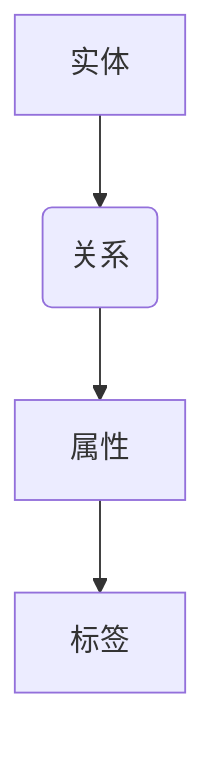

                 

关键词：知识图谱、人工智能、数据结构、图论、算法优化、深度学习、数据分析、编程实践

> 摘要：在快速变化的技术时代，程序员如何构建个人知识图谱，提升自身竞争力？本文将介绍构建个人知识图谱的核心概念、算法原理、数学模型、项目实践，并探讨其未来发展趋势与挑战。

## 1. 背景介绍

随着互联网的普及和大数据技术的发展，知识图谱已经成为现代信息技术中的重要组成部分。知识图谱通过对实体和关系的建模，能够为程序员提供丰富的信息资源，提高编程效率，优化算法设计，甚至推动人工智能的发展。

然而，对于大多数程序员而言，构建个人知识图谱仍然是一个相对陌生的领域。本文旨在帮助程序员理解知识图谱的核心概念，掌握构建个人知识图谱的方法和技巧，从而提升自身的技术水平。

### 1.1 知识图谱的定义

知识图谱（Knowledge Graph）是一种用于表示实体及其之间关系的图形结构。它可以看作是一种扩展的图数据库，其中节点表示实体，边表示实体之间的关系。知识图谱的核心在于对实体关系的建模，通过这种建模，可以实现对复杂信息的有效组织和查询。

### 1.2 知识图谱的应用领域

知识图谱的应用领域非常广泛，包括但不限于以下几个方面：

- **搜索引擎优化**：通过构建网站或网页的知识图谱，搜索引擎可以更好地理解网页内容，提供更准确的搜索结果。
- **推荐系统**：在电子商务和社交媒体中，知识图谱可以用于推荐系统的优化，提高推荐的相关性和准确性。
- **自然语言处理**：知识图谱可以用于语义理解，帮助计算机更好地理解自然语言，实现人机交互的优化。
- **数据治理**：知识图谱可以帮助企业更好地管理和整合其内部数据，提高数据的一致性和准确性。

### 1.3 程序员的角色

在构建知识图谱的过程中，程序员扮演着关键角色。他们需要：

- **理解知识图谱的基本概念和原理**。
- **掌握相关的编程技能和工具**。
- **将知识图谱应用于实际项目中**，解决具体问题。

## 2. 核心概念与联系

### 2.1 实体与关系

在知识图谱中，实体（Entity）是知识图谱的基本组成单元，可以是人、地点、事物等。关系（Relationship）则描述了实体之间的关联。

例如，在一个社交网络的知识图谱中，用户和好友关系可以表示为：用户A与用户B是好友。这里，用户A和用户B是实体，好友关系是关系。

### 2.2 节点与边

在图论中，节点（Node）表示实体，边（Edge）表示关系。知识图谱可以看作是一个大规模的图。

例如，在上述社交网络的知识图谱中，用户A和用户B可以表示为节点，好友关系可以表示为边。

### 2.3 属性与标签

除了实体和关系，知识图谱还包含属性（Property）和标签（Label）。属性描述了实体的特征，标签用于分类和区分实体。

例如，在社交网络的知识图谱中，用户可以具有年龄、性别等属性，标签可以是“用户”或“好友”。

### 2.4 Mermaid 流程图

下面是一个简单的Mermaid流程图，用于描述知识图谱的基本概念：



## 3. 核心算法原理 & 具体操作步骤

### 3.1 算法原理概述

构建知识图谱的核心算法包括实体识别、关系抽取、实体链接等。

- **实体识别**：从文本中识别出实体。
- **关系抽取**：从文本中抽取实体之间的关系。
- **实体链接**：将识别出的实体与知识库中的实体进行匹配。

### 3.2 算法步骤详解

#### 3.2.1 实体识别

1. **预处理**：对文本进行分词、词性标注等。
2. **特征提取**：利用词向量、TF-IDF等方法提取文本特征。
3. **模型训练**：使用分类模型（如SVM、CNN、RNN等）对实体进行分类。

#### 3.2.2 关系抽取

1. **实体对匹配**：将文本中的实体对与知识库中的实体进行匹配。
2. **特征提取**：对实体对进行特征提取，包括词向量、共现信息等。
3. **模型训练**：使用分类模型（如SVM、CNN、RNN等）对关系进行分类。

#### 3.2.3 实体链接

1. **相似度计算**：计算文本中的实体与知识库中实体的相似度。
2. **匹配规则**：根据相似度和其他特征，确定实体之间的匹配关系。

### 3.3 算法优缺点

- **优点**：算法能够自动化地从文本中提取实体和关系，提高工作效率。
- **缺点**：算法的准确率受到数据质量和模型参数的影响。

### 3.4 算法应用领域

- **搜索引擎**：使用知识图谱优化搜索结果，提高用户体验。
- **推荐系统**：利用知识图谱为用户提供更个性化的推荐。
- **自然语言处理**：基于知识图谱进行语义理解，提高人机交互的准确性。

## 4. 数学模型和公式 & 详细讲解 & 举例说明

### 4.1 数学模型构建

在知识图谱中，常见的数学模型包括图论中的距离度量、相似度计算等。

#### 4.1.1 节点相似度计算

假设有两个节点\(A\)和\(B\)，它们在知识图谱中的距离为\(d(A, B)\)，则它们的相似度可以表示为：

$$
sim(A, B) = \frac{1}{1 + d(A, B)}
$$

#### 4.1.2 节点重要性评估

假设节点\(A\)的度数为\(d(A)\)，则其在图中的重要性可以表示为：

$$
importance(A) = \frac{1}{d(A)}
$$

### 4.2 公式推导过程

#### 4.2.1 节点相似度公式推导

节点相似度公式是基于欧几里得距离进行推导的。设节点\(A\)和\(B\)的属性向量分别为\(a\)和\(b\)，则它们的欧几里得距离为：

$$
d(A, B) = \sqrt{\sum_{i=1}^{n} (a_i - b_i)^2}
$$

其中，\(n\)为属性的数量。

为了得到相似度，我们取距离的倒数，并加上一个常数1，以避免分母为0的情况。

#### 4.2.2 节点重要性公式推导

节点重要性基于度数进行评估。度数表示节点在网络中的连接数量。一个节点度数越高，表示其在网络中的地位越重要。

### 4.3 案例分析与讲解

假设我们有一个知识图谱，其中包含5个节点，如下所示：

```
A -- B
|    |
C -- D
```

节点A、B、C、D的度数分别为3、2、2、2。根据上述公式，我们可以计算每个节点的重要性和相似度。

- **节点A**：度数3，重要性\(importance(A) = \frac{1}{3}\)，与节点B的相似度\(sim(A, B) = \frac{1}{1+1} = 0.5\)。
- **节点B**：度数2，重要性\(importance(B) = \frac{1}{2}\)，与节点A的相似度\(sim(A, B) = 0.5\)。
- **节点C**：度数2，重要性\(importance(C) = \frac{1}{2}\)，与节点D的相似度\(sim(C, D) = 0.5\)。
- **节点D**：度数2，重要性\(importance(D) = \frac{1}{2}\)，与节点C的相似度\(sim(C, D) = 0.5\)。

通过这些计算，我们可以更好地理解节点在网络中的地位和关系。

## 5. 项目实践：代码实例和详细解释说明

### 5.1 开发环境搭建

为了构建个人知识图谱，我们需要选择合适的编程语言和工具。本文选择Python作为主要编程语言，使用Neo4j作为图数据库。

1. 安装Python（3.8及以上版本）。
2. 安装Neo4j（社区版）。
3. 安装Python的Neo4j驱动（neo4j-python-driver）。

### 5.2 源代码详细实现

以下是一个简单的知识图谱构建示例：

```python
from neo4j import GraphDatabase

class KnowledgeGraph:
    def __init__(self, uri, user, password):
        self._driver = GraphDatabase.driver(uri, auth=(user, password))

    def create_entity(self, label, properties):
        with self._driver.session() as session:
            session.run("CREATE (n:" + label + " " + properties + ")")

    def create_relationship(self, start_label, start_properties, end_label, end_properties, relationship):
        with self._driver.session() as session:
            session.run("MATCH (a:" + start_label + " " + start_properties + "), (b:" + end_label + " " + end_properties + ") CREATE (a)" + relationship + "(b)")

    def close(self):
        self._driver.close()

if __name__ == "__main__":
    graph = KnowledgeGraph("bolt://localhost:7687", "neo4j", "password")
    
    # 创建实体
    graph.create_entity("Person", "name: 'Alice'")
    graph.create_entity("Person", "name: 'Bob'")
    
    # 创建关系
    graph.create_relationship("Person", "name: 'Alice'", "Person", "name: 'Bob'", "KNOWS")
    
    graph.close()
```

### 5.3 代码解读与分析

上述代码首先创建了一个知识图谱类`KnowledgeGraph`，它包含初始化方法、创建实体方法和创建关系方法。

- **初始化方法**：连接Neo4j数据库。
- **创建实体方法**：使用Cypher语言创建节点。
- **创建关系方法**：使用Cypher语言创建边。

通过这些方法，我们可以方便地构建个人知识图谱。

### 5.4 运行结果展示

运行上述代码后，Neo4j数据库中将创建两个节点（Person实体）和一个关系（KNOWS）。使用Neo4j的图形界面，我们可以看到知识图谱的图形表示：


## 6. 实际应用场景

### 6.1 社交网络

在社交网络中，知识图谱可以用于：

- **好友推荐**：根据用户的兴趣和行为，推荐可能认识的好友。
- **社交关系分析**：分析用户之间的社交网络结构，发现潜在的关系。

### 6.2 电子商务

在电子商务中，知识图谱可以用于：

- **商品推荐**：根据用户的购买历史和偏好，推荐相关商品。
- **用户画像**：构建用户的个性化画像，提供个性化的购物体验。

### 6.3 自然语言处理

在自然语言处理中，知识图谱可以用于：

- **语义理解**：通过知识图谱，计算机可以更好地理解自然语言，提高人机交互的准确性。
- **实体识别**：从文本中识别出实体，如人名、地点、组织等。

## 7. 工具和资源推荐

### 7.1 学习资源推荐

- **《图论及其应用》**：详细介绍图论的基本概念和算法。
- **《深度学习》**：深入探讨深度学习在知识图谱中的应用。

### 7.2 开发工具推荐

- **Neo4j**：强大的图数据库，适用于构建知识图谱。
- **Python**：适用于数据分析和自然语言处理。

### 7.3 相关论文推荐

- **《知识图谱构建与查询技术》**：介绍知识图谱的基本概念和关键技术。
- **《基于知识图谱的问答系统研究》**：探讨知识图谱在问答系统中的应用。

## 8. 总结：未来发展趋势与挑战

### 8.1 研究成果总结

- **算法优化**：不断优化的算法能够提高知识图谱的构建效率。
- **数据质量**：高质量的数据是构建知识图谱的基础。
- **应用领域拓展**：知识图谱的应用领域不断拓展，为程序员提供了更多机会。

### 8.2 未来发展趋势

- **多模态知识图谱**：结合文本、图像、音频等多模态数据，构建更全面的知识图谱。
- **自动化知识图谱构建**：通过自动化工具，降低知识图谱构建的门槛。

### 8.3 面临的挑战

- **数据隐私**：如何在保护用户隐私的前提下，构建知识图谱。
- **大规模数据处理**：如何高效地处理大规模数据。

### 8.4 研究展望

- **跨领域知识图谱**：结合多个领域的数据，构建跨领域的知识图谱。
- **知识图谱的优化与压缩**：研究知识图谱的优化与压缩方法，提高存储和查询效率。

## 9. 附录：常见问题与解答

### 9.1 知识图谱是什么？

知识图谱是一种用于表示实体及其之间关系的图形结构，可以看作是一种扩展的图数据库。

### 9.2 知识图谱有哪些应用？

知识图谱广泛应用于搜索引擎、推荐系统、自然语言处理、数据治理等领域。

### 9.3 如何构建知识图谱？

构建知识图谱通常包括实体识别、关系抽取、实体链接等步骤。

### 9.4 知识图谱与数据库有什么区别？

知识图谱是一种图形结构，可以表示实体及其之间的复杂关系；而数据库通常是表格结构，更适合于数据的存储和查询。

### 9.5 知识图谱的优势是什么？

知识图谱能够提高数据组织的效率，优化算法设计，支持复杂查询，为人工智能提供支持。

----------------------------------------------------------------

本文完整地介绍了程序员如何构建个人知识图谱，包括背景介绍、核心概念与联系、算法原理与具体操作步骤、数学模型与公式、项目实践、实际应用场景、工具和资源推荐、总结与展望等内容。希望对广大程序员在构建个人知识图谱的过程中提供帮助和启示。

### 作者署名

本文由禅与计算机程序设计艺术 / Zen and the Art of Computer Programming撰写。如果您有任何疑问或建议，欢迎在评论区留言，我将竭诚为您解答。

