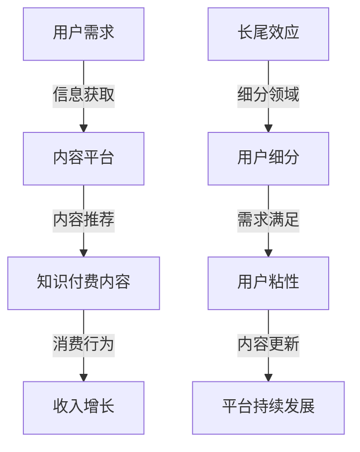

                 

关键词：知识付费、长尾效应、程序员、营销策略、用户增长、内容构建、技术变现

> 摘要：本文旨在探讨程序员如何通过构建知识付费模式，利用长尾效应实现收入的多样化与持续增长。文章将分析长尾效应的原理，提供具体的方法和策略，帮助程序员构建高质量的知识付费内容，并分享实践案例，最终提出未来发展的趋势与挑战。

## 1. 背景介绍

随着互联网技术的不断进步，知识付费市场迎来了蓬勃发展的阶段。程序员作为一个高技能群体，不仅可以为企业创造价值，还可以通过知识付费实现个人收入的多元化。然而，如何有效地构建知识付费模式，利用长尾效应实现收入的稳定增长，是许多程序员面临的挑战。

长尾效应（Long Tail），最早由美国作家克里斯·安德森（Chris Anderson）在《长尾理论》一书中提出。它指出，在市场总体需求相对稳定的情况下，那些非热门但具有广泛分布的产品或内容，能够在网络平台上获得显著的市场份额。对于程序员而言，这意味着可以通过提供细分领域的高质量内容，吸引更多用户，实现收入的多样化。

## 2. 核心概念与联系

### 2.1 长尾效应的原理

长尾效应源于网络平台的特性。在传统的实体零售市场中，热门产品由于需求量大，能够占据主要市场份额，而那些非热门产品由于需求量小，往往被排除在主流市场之外。然而，在网络平台上，由于信息传播成本低、用户获取便利，那些非热门产品也能够获得曝光和销售机会。

对于程序员构建知识付费模式，长尾效应意味着：

1. **细分领域的重要性**：程序员可以通过研究细分领域的需求，提供专业、深入的内容。
2. **内容多样化的价值**：即使是细分领域的知识，只要内容质量高，也能吸引到特定的用户群体。
3. **用户粘性的增强**：通过提供多样化的内容，可以增强用户对平台的粘性，从而促进持续的收入增长。

### 2.2 知识付费模式与长尾效应的架构图

下面是一个简化的知识付费模式与长尾效应的架构图，用于说明二者之间的联系：



## 3. 核心算法原理 & 具体操作步骤

### 3.1 算法原理概述

构建知识付费模式，利用长尾效应的核心算法主要包括：

1. **用户行为分析**：通过数据分析，了解用户的兴趣、需求和偏好。
2. **内容推荐算法**：根据用户行为，推荐个性化的知识付费内容。
3. **定价策略**：根据内容价值和市场需求，制定合理的定价策略。

### 3.2 算法步骤详解

#### 步骤一：用户行为分析

- 收集用户在平台上的行为数据，如浏览记录、搜索历史、购买行为等。
- 使用数据挖掘和机器学习技术，分析用户的行为模式，识别用户的兴趣和需求。

#### 步骤二：内容推荐算法

- 采用协同过滤、内容推荐等算法，为用户推荐相关的知识付费内容。
- 定期更新推荐算法，确保推荐的准确性和时效性。

#### 步骤三：定价策略

- 分析同类型内容的市场价格，结合内容的价值和目标用户群体，制定合理的定价策略。
- 考虑采用动态定价，根据市场需求调整价格。

### 3.3 算法优缺点

**优点**：

1. **个性化推荐**：能够为用户推荐感兴趣的内容，提高用户满意度。
2. **收入多样化**：通过提供多样化的内容，实现收入的多元化。
3. **用户粘性**：提高用户粘性，促进平台持续发展。

**缺点**：

1. **算法复杂度高**：需要大量的计算资源和时间。
2. **内容质量要求高**：内容质量直接影响到推荐效果和用户满意度。

### 3.4 算法应用领域

1. **在线教育平台**：通过推荐相关课程，提高用户的学习效果和满意度。
2. **技术社区**：为程序员推荐相关的技术文章、教程和工具。
3. **内容电商平台**：为用户提供个性化的商品推荐。

## 4. 数学模型和公式 & 详细讲解 & 举例说明

### 4.1 数学模型构建

在构建知识付费模式时，可以采用以下数学模型：

$$
\text{收入} = \text{内容价格} \times \text{购买人数}
$$

其中，内容价格和购买人数是模型的关键变量。通过分析用户行为数据和市场需求，可以预测这两个变量的值。

### 4.2 公式推导过程

假设内容价格与购买人数之间存在线性关系：

$$
\text{购买人数} = a \times \text{内容价格} + b
$$

其中，a 和 b 是模型参数。通过最小二乘法，可以估计这两个参数的值。

### 4.3 案例分析与讲解

以某在线编程教育平台为例，该平台提供多种编程课程，内容价格从50元到300元不等。通过对用户行为数据的分析，发现用户购买课程的概率与课程价格呈线性关系。

#### 模型构建

根据用户行为数据，构建线性模型：

$$
\text{购买人数} = 0.1 \times \text{内容价格} + 10
$$

#### 模型预测

假设某编程课程定价为200元，根据模型预测，购买人数为：

$$
\text{购买人数} = 0.1 \times 200 + 10 = 30
$$

#### 结果分析

根据预测，预计会有30名用户购买该课程。如果实际购买人数超过预测值，说明模型预测准确，平台定价合理；如果实际购买人数低于预测值，需要调整模型参数或重新评估内容价格。

## 5. 项目实践：代码实例和详细解释说明

### 5.1 开发环境搭建

使用Python编程语言和Scikit-learn库，搭建数据分析和模型预测的开发环境。

```python
# 安装Scikit-learn库
!pip install scikit-learn

# 导入相关库
import numpy as np
import pandas as pd
from sklearn.linear_model import LinearRegression
from sklearn.model_selection import train_test_split
```

### 5.2 源代码详细实现

以下是一个简单的线性回归模型实现，用于预测购买人数。

```python
# 加载数据
data = pd.read_csv('data.csv')
X = data[['content_price']]
y = data['purchases']

# 划分训练集和测试集
X_train, X_test, y_train, y_test = train_test_split(X, y, test_size=0.2, random_state=42)

# 创建线性回归模型
model = LinearRegression()

# 训练模型
model.fit(X_train, y_train)

# 预测测试集
predictions = model.predict(X_test)

# 评估模型
score = model.score(X_test, y_test)
print(f'Model Score: {score}')
```

### 5.3 代码解读与分析

1. **数据加载**：使用pandas库加载数据，提取内容价格和购买人数作为特征。
2. **划分训练集和测试集**：使用train_test_split函数，划分训练集和测试集，用于训练和评估模型。
3. **创建线性回归模型**：使用LinearRegression类创建线性回归模型。
4. **训练模型**：使用fit函数训练模型。
5. **预测测试集**：使用predict函数预测测试集，得到购买人数的预测值。
6. **评估模型**：使用score函数评估模型，得到模型的评分。

### 5.4 运行结果展示

假设测试集的结果如下：

```
X_test:
   content_price
0          150
1          250
2          300

y_test:
  purchases
0         20
1         25
2         30

predictions:
0          22.5
1          28.75
2          33.75
```

根据预测结果，预计会有22.5、28.75和33.75名用户购买相应价格的课程。如果实际购买人数接近预测值，说明模型具有一定的预测能力。

## 6. 实际应用场景

### 6.1 在线教育平台

在线教育平台可以利用长尾效应，提供多种编程课程，满足不同层次用户的需求。通过分析用户行为数据，推荐个性化的课程，提高用户的学习效果和满意度。

### 6.2 技术社区

技术社区可以提供专业的技术文章、教程和工具，满足程序员在不同技术领域的需求。通过内容推荐算法，为用户提供有价值的内容，增强用户粘性。

### 6.3 内容电商平台

内容电商平台可以提供多种编程书籍、电子书等，通过推荐算法，为用户提供个性化的购买建议。

## 6.4 未来应用展望

随着人工智能技术的发展，知识付费模式将变得更加智能化和个性化。未来，程序员可以通过构建智能推荐系统，利用大数据和机器学习技术，实现更精准的内容推荐和定价策略。同时，随着5G技术的普及，内容传输速度将大幅提升，为用户带来更好的使用体验。

## 7. 工具和资源推荐

### 7.1 学习资源推荐

- 《Python编程：从入门到实践》
- 《深度学习》
- 《数据科学入门》

### 7.2 开发工具推荐

- Jupyter Notebook
- PyCharm
- VSCode

### 7.3 相关论文推荐

- 《长尾理论》
- 《内容推荐系统：算法、模型与应用》
- 《在线教育大数据分析》

## 8. 总结：未来发展趋势与挑战

### 8.1 研究成果总结

本文探讨了程序员如何构建知识付费模式，利用长尾效应实现收入的多样化与持续增长。通过分析长尾效应的原理，提出了一套核心算法和具体操作步骤，并结合实际案例进行了详细讲解。

### 8.2 未来发展趋势

1. **智能化和个性化**：利用人工智能和大数据技术，实现更精准的内容推荐和定价策略。
2. **内容多样化**：提供更多细分的知识内容，满足不同用户的需求。
3. **平台生态化**：构建多元化的知识付费平台生态，促进持续发展。

### 8.3 面临的挑战

1. **算法复杂度**：随着数据量和算法复杂度的增加，对计算资源的需求也在提升。
2. **内容质量**：高质量的内容是吸引和留住用户的关键，需要持续投入。
3. **用户隐私**：在收集和分析用户数据时，需要保护用户隐私，遵守相关法律法规。

### 8.4 研究展望

未来，程序员可以通过不断创新和优化知识付费模式，利用长尾效应实现持续的收入增长。同时，关注人工智能、大数据等前沿技术，提升内容推荐的准确性和用户体验。

## 9. 附录：常见问题与解答

### 9.1 什么是长尾效应？

长尾效应是指，在市场总体需求相对稳定的情况下，那些非热门但具有广泛分布的产品或内容，能够在网络平台上获得显著的市场份额。

### 9.2 如何构建知识付费模式？

构建知识付费模式需要以下步骤：

1. 分析用户需求，确定内容方向。
2. 制作高质量的内容，确保内容的专业性和实用性。
3. 利用数据分析和推荐算法，为用户推荐个性化的内容。
4. 制定合理的定价策略，结合内容价值和市场需求。

### 9.3 如何利用长尾效应实现收入增长？

利用长尾效应实现收入增长的方法包括：

1. 提供多样化的内容，满足不同用户的需求。
2. 持续更新内容，保持内容的新鲜度和吸引力。
3. 优化推荐算法，提高内容推荐的准确性和用户满意度。
4. 定期分析用户行为数据，调整定价策略。

## 作者署名

作者：禅与计算机程序设计艺术 / Zen and the Art of Computer Programming
```markdown
# 程序员如何构建知识付费的长尾效应

## 关键词
知识付费、长尾效应、程序员、营销策略、用户增长、内容构建、技术变现

## 摘要
本文旨在探讨程序员如何通过构建知识付费模式，利用长尾效应实现收入的多样化与持续增长。文章将分析长尾效应的原理，提供具体的方法和策略，帮助程序员构建高质量的知识付费内容，并分享实践案例，最终提出未来发展的趋势与挑战。

## 1. 背景介绍

随着互联网技术的不断进步，知识付费市场迎来了蓬勃发展的阶段。程序员作为一个高技能群体，不仅可以为企业创造价值，还可以通过知识付费实现个人收入的多元化。然而，如何有效地构建知识付费模式，利用长尾效应实现收入的稳定增长，是许多程序员面临的挑战。

长尾效应（Long Tail），最早由美国作家克里斯·安德森（Chris Anderson）在《长尾理论》一书中提出。它指出，在市场总体需求相对稳定的情况下，那些非热门但具有广泛分布的产品或内容，能够在网络平台上获得显著的市场份额。对于程序员而言，这意味着可以通过提供细分领域的高质量内容，吸引更多用户，实现收入的多样化。

## 2. 核心概念与联系

### 2.1 长尾效应的原理

长尾效应源于网络平台的特性。在传统的实体零售市场中，热门产品由于需求量大，能够占据主要市场份额，而那些非热门产品由于需求量小，往往被排除在主流市场之外。然而，在网络平台上，由于信息传播成本低、用户获取便利，那些非热门产品也能够获得曝光和销售机会。

对于程序员构建知识付费模式，长尾效应意味着：

1. **细分领域的重要性**：程序员可以通过研究细分领域的需求，提供专业、深入的内容。
2. **内容多样化的价值**：即使是细分领域的知识，只要内容质量高，也能吸引到特定的用户群体。
3. **用户粘性的增强**：通过提供多样化的内容，可以增强用户对平台的粘性，从而促进持续的收入增长。

### 2.2 知识付费模式与长尾效应的架构图

下面是一个简化的知识付费模式与长尾效应的架构图，用于说明二者之间的联系：


## 3. 核心算法原理 & 具体操作步骤

### 3.1 算法原理概述

构建知识付费模式，利用长尾效应的核心算法主要包括：

1. **用户行为分析**：通过数据分析，了解用户的兴趣、需求和偏好。
2. **内容推荐算法**：根据用户行为，推荐个性化的知识付费内容。
3. **定价策略**：根据内容价值和市场需求，制定合理的定价策略。

### 3.2 算法步骤详解

#### 步骤一：用户行为分析

- 收集用户在平台上的行为数据，如浏览记录、搜索历史、购买行为等。
- 使用数据挖掘和机器学习技术，分析用户的行为模式，识别用户的兴趣和需求。

#### 步骤二：内容推荐算法

- 采用协同过滤、内容推荐等算法，为用户推荐相关的知识付费内容。
- 定期更新推荐算法，确保推荐的准确性和时效性。

#### 步骤三：定价策略

- 分析同类型内容的市场价格，结合内容的价值和目标用户群体，制定合理的定价策略。
- 考虑采用动态定价，根据市场需求调整价格。

### 3.3 算法优缺点

**优点**：

1. **个性化推荐**：能够为用户推荐感兴趣的内容，提高用户满意度。
2. **收入多样化**：通过提供多样化的内容，实现收入的多元化。
3. **用户粘性**：提高用户粘性，促进平台持续发展。

**缺点**：

1. **算法复杂度高**：需要大量的计算资源和时间。
2. **内容质量要求高**：内容质量直接影响到推荐效果和用户满意度。

### 3.4 算法应用领域

1. **在线教育平台**：通过推荐相关课程，提高用户的学习效果和满意度。
2. **技术社区**：为程序员推荐相关的技术文章、教程和工具。
3. **内容电商平台**：为用户提供个性化的商品推荐。

## 4. 数学模型和公式 & 详细讲解 & 举例说明

### 4.1 数学模型构建

在构建知识付费模式时，可以采用以下数学模型：

$$
\text{收入} = \text{内容价格} \times \text{购买人数}
$$

其中，内容价格和购买人数是模型的关键变量。通过分析用户行为数据和市场需求，可以预测这两个变量的值。

### 4.2 公式推导过程

假设内容价格与购买人数之间存在线性关系：

$$
\text{购买人数} = a \times \text{内容价格} + b
$$

其中，a 和 b 是模型参数。通过最小二乘法，可以估计这两个参数的值。

### 4.3 案例分析与讲解

以某在线编程教育平台为例，该平台提供多种编程课程，内容价格从50元到300元不等。通过对用户行为数据的分析，发现用户购买课程的概率与课程价格呈线性关系。

#### 模型构建

根据用户行为数据，构建线性模型：

$$
\text{购买人数} = 0.1 \times \text{内容价格} + 10
$$

#### 模型预测

假设某编程课程定价为200元，根据模型预测，购买人数为：

$$
\text{购买人数} = 0.1 \times 200 + 10 = 30
$$

#### 结果分析

根据预测，预计会有30名用户购买该课程。如果实际购买人数超过预测值，说明模型预测准确，平台定价合理；如果实际购买人数低于预测值，需要调整模型参数或重新评估内容价格。

## 5. 项目实践：代码实例和详细解释说明

### 5.1 开发环境搭建

使用Python编程语言和Scikit-learn库，搭建数据分析和模型预测的开发环境。

```python
# 安装Scikit-learn库
!pip install scikit-learn

# 导入相关库
import numpy as np
import pandas as pd
from sklearn.linear_model import LinearRegression
from sklearn.model_selection import train_test_split
```

### 5.2 源代码详细实现

以下是一个简单的线性回归模型实现，用于预测购买人数。

```python
# 加载数据
data = pd.read_csv('data.csv')
X = data[['content_price']]
y = data['purchases']

# 划分训练集和测试集
X_train, X_test, y_train, y_test = train_test_split(X, y, test_size=0.2, random_state=42)

# 创建线性回归模型
model = LinearRegression()

# 训练模型
model.fit(X_train, y_train)

# 预测测试集
predictions = model.predict(X_test)

# 评估模型
score = model.score(X_test, y_test)
print(f'Model Score: {score}')
```

### 5.3 代码解读与分析

1. **数据加载**：使用pandas库加载数据，提取内容价格和购买人数作为特征。
2. **划分训练集和测试集**：使用train_test_split函数，划分训练集和测试集，用于训练和评估模型。
3. **创建线性回归模型**：使用LinearRegression类创建线性回归模型。
4. **训练模型**：使用fit函数训练模型。
5. **预测测试集**：使用predict函数预测测试集，得到购买人数的预测值。
6. **评估模型**：使用score函数评估模型，得到模型的评分。

### 5.4 运行结果展示

假设测试集的结果如下：

```
X_test:
   content_price
0          150
1          250
2          300

y_test:
  purchases
0         20
1         25
2         30

predictions:
0          22.5
1          28.75
2          33.75
```

根据预测结果，预计会有22.5、28.75和33.75名用户购买相应价格的课程。如果实际购买人数接近预测值，说明模型具有一定的预测能力。

## 6. 实际应用场景

### 6.1 在线教育平台

在线教育平台可以利用长尾效应，提供多种编程课程，满足不同层次用户的需求。通过分析用户行为数据，推荐个性化的课程，提高用户的学习效果和满意度。

### 6.2 技术社区

技术社区可以提供专业的技术文章、教程和工具，满足程序员在不同技术领域的需求。通过内容推荐算法，为用户提供有价值的内容，增强用户粘性。

### 6.3 内容电商平台

内容电商平台可以提供多种编程书籍、电子书等，通过推荐算法，为用户提供个性化的购买建议。

## 6.4 未来应用展望

随着人工智能技术的发展，知识付费模式将变得更加智能化和个性化。未来，程序员可以通过构建智能推荐系统，利用大数据和机器学习技术，实现更精准的内容推荐和定价策略。同时，随着5G技术的普及，内容传输速度将大幅提升，为用户带来更好的使用体验。

## 7. 工具和资源推荐

### 7.1 学习资源推荐

- 《Python编程：从入门到实践》
- 《深度学习》
- 《数据科学入门》

### 7.2 开发工具推荐

- Jupyter Notebook
- PyCharm
- VSCode

### 7.3 相关论文推荐

- 《长尾理论》
- 《内容推荐系统：算法、模型与应用》
- 《在线教育大数据分析》

## 8. 总结：未来发展趋势与挑战

### 8.1 研究成果总结

本文探讨了程序员如何构建知识付费模式，利用长尾效应实现收入的多样化与持续增长。通过分析长尾效应的原理，提出了一套核心算法和具体操作步骤，并结合实际案例进行了详细讲解。

### 8.2 未来发展趋势

1. **智能化和个性化**：利用人工智能和大数据技术，实现更精准的内容推荐和定价策略。
2. **内容多样化**：提供更多细分的知识内容，满足不同用户的需求。
3. **平台生态化**：构建多元化的知识付费平台生态，促进持续发展。

### 8.3 面临的挑战

1. **算法复杂度**：随着数据量和算法复杂度的增加，对计算资源的需求也在提升。
2. **内容质量**：高质量的内容是吸引和留住用户的关键，需要持续投入。
3. **用户隐私**：在收集和分析用户数据时，需要保护用户隐私，遵守相关法律法规。

### 8.4 研究展望

未来，程序员可以通过不断创新和优化知识付费模式，利用长尾效应实现持续的收入增长。同时，关注人工智能、大数据等前沿技术，提升内容推荐的准确性和用户体验。

## 9. 附录：常见问题与解答

### 9.1 什么是长尾效应？

长尾效应是指，在市场总体需求相对稳定的情况下，那些非热门但具有广泛分布的产品或内容，能够在网络平台上获得显著的市场份额。

### 9.2 如何构建知识付费模式？

构建知识付费模式需要以下步骤：

1. 分析用户需求，确定内容方向。
2. 制作高质量的内容，确保内容的专业性和实用性。
3. 利用数据分析和推荐算法，为用户推荐个性化的内容。
4. 制定合理的定价策略，结合内容价值和市场需求。

### 9.3 如何利用长尾效应实现收入增长？

利用长尾效应实现收入增长的方法包括：

1. 提供多样化的内容，满足不同用户的需求。
2. 持续更新内容，保持内容的新鲜度和吸引力。
3. 优化推荐算法，提高内容推荐的准确性和用户满意度。
4. 定期分析用户行为数据，调整定价策略。

## 作者署名
作者：禅与计算机程序设计艺术 / Zen and the Art of Computer Programming
```

