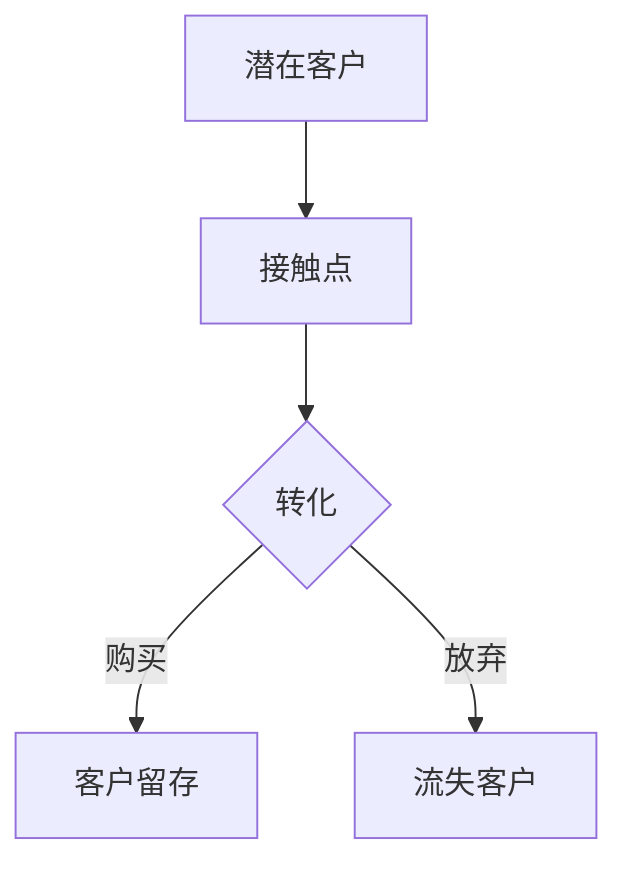

                 

关键词：销售漏斗，转化率，程序员，数据分析，客户关系管理，市场营销，技术架构，策略优化

> 摘要：本文将探讨程序员如何利用其技术专长构建高效的销售漏斗，实现高转化率。通过对销售漏斗的架构设计、数据分析、客户关系管理以及市场营销策略等方面的深入分析，为程序员提供一套系统化的构建方法，以帮助企业在激烈的市场竞争中脱颖而出。

## 1. 背景介绍

在当今竞争激烈的市场环境中，销售漏斗（Sales Funnel）已经成为企业提高销售转化率和效率的重要工具。销售漏斗是一种用于表示销售过程中潜在客户转化为实际购买者的流程模型。它通过将销售流程划分为多个阶段，帮助企业更好地理解客户行为，从而优化营销策略和销售流程。

程序员作为企业的技术骨干，不仅擅长编写代码，解决技术问题，还可以在销售漏斗的构建和优化方面发挥重要作用。本文将围绕以下几个核心问题展开讨论：

- 销售漏斗的基本概念和结构是怎样的？
- 程序员如何通过技术手段优化销售漏斗的各个阶段？
- 如何利用数据分析提升销售漏斗的转化率？
- 销售漏斗在实际业务中的应用场景有哪些？

通过对以上问题的深入探讨，希望能够为程序员提供一套完整的销售漏斗构建和优化方案。

## 2. 核心概念与联系

### 2.1 销售漏斗的定义

销售漏斗是一个描述潜在客户在购买过程中所经过的各个阶段的模型。它通常包含以下几个主要阶段：

1. **潜在客户**：指那些对企业产品或服务感兴趣，但尚未成为实际客户的群体。
2. **接触点**：指潜在客户与企业接触的渠道，如网站、社交媒体、广告等。
3. **转化**：指潜在客户从接触到最终购买产品或服务的整个过程。
4. **客户留存**：指已经购买产品的客户继续使用并为企业带来复购和推荐的机会。

### 2.2 销售漏斗的结构

销售漏斗通常由以下几个部分组成：

1. **顶部**：潜在客户池，包括所有对企业产品或服务感兴趣的潜在客户。
2. **中部**：接触点，指潜在客户与企业接触并产生互动的环节。
3. **底部**：转化阶段，包括潜在客户购买产品或服务的全过程。

### 2.3 数据分析与销售漏斗

数据分析在销售漏斗的构建和优化中起着至关重要的作用。通过分析销售数据，程序员可以识别出影响转化率的因素，并采取相应的措施进行优化。例如：

- **接触点分析**：分析潜在客户在不同接触点上的行为和偏好，优化营销策略。
- **转化率分析**：分析潜在客户在转化过程中的阻碍因素，提高转化率。
- **客户留存分析**：分析客户留存的关键因素，提高客户忠诚度。

### 2.4 客户关系管理与销售漏斗

客户关系管理（CRM）系统是销售漏斗的重要组成部分。程序员可以利用CRM系统对客户信息进行管理，实现以下目标：

- **客户信息管理**：记录和跟踪客户的基本信息和购买历史。
- **客户互动管理**：通过邮件、短信、电话等方式与客户保持沟通。
- **销售预测**：根据客户行为和历史数据预测未来的销售趋势。

### 2.5 市场营销策略与销售漏斗

市场营销策略是提高销售漏斗转化率的关键。程序员可以通过以下方式优化市场营销策略：

- **个性化营销**：根据客户的行为和偏好进行个性化推荐。
- **内容营销**：制作有价值的内容，吸引潜在客户并提高品牌知名度。
- **渠道优化**：分析和优化不同营销渠道的效果，提高投资回报率。

### 2.6 Mermaid 流程图

以下是一个销售漏斗的Mermaid流程图，展示了销售漏斗的基本结构和各个阶段之间的关系：



## 3. 核心算法原理 & 具体操作步骤

### 3.1 算法原理概述

构建和优化销售漏斗的核心算法主要包括以下几个部分：

1. **数据收集与处理**：通过收集和分析潜在客户的数据，识别出影响转化率的因素。
2. **模型建立**：根据收集到的数据建立销售漏斗模型，预测潜在客户的转化概率。
3. **策略优化**：基于模型预测结果，优化营销策略和销售流程。

### 3.2 算法步骤详解

1. **数据收集与处理**：

   - 收集潜在客户的基本信息（如姓名、年龄、性别、联系方式等）。
   - 收集潜在客户的购买历史（如购买时间、购买产品、购买金额等）。
   - 收集潜在客户的互动数据（如网站访问记录、社交媒体互动等）。

   通过数据清洗和预处理，去除重复和无效数据，确保数据质量。

2. **模型建立**：

   - 选择合适的机器学习模型（如逻辑回归、决策树、随机森林等）。
   - 使用历史数据进行模型训练，通过交叉验证确定模型参数。
   - 使用训练好的模型预测潜在客户的转化概率。

3. **策略优化**：

   - 根据模型预测结果，对营销策略进行调整，如优化广告投放、个性化推荐等。
   - 跟踪和评估策略调整的效果，持续优化销售漏斗。

### 3.3 算法优缺点

**优点**：

- 提高销售转化率：通过数据分析，优化销售漏斗各阶段的流程，提高潜在客户的转化概率。
- 提高营销效率：通过个性化营销和精准投放，提高营销ROI。
- 提升客户满意度：通过优化客户互动体验，提高客户满意度和忠诚度。

**缺点**：

- 数据质量要求高：销售漏斗的优化依赖于高质量的数据，数据质量直接影响模型效果。
- 模型复杂性：销售漏斗优化涉及到多个变量和复杂的关系，模型建立和优化过程较为复杂。
- 需要持续迭代：销售漏斗的优化是一个持续的过程，需要定期更新数据和调整模型。

### 3.4 算法应用领域

销售漏斗的优化算法可以应用于多个领域，包括：

- **电子商务**：通过优化销售漏斗，提高电商平台的销售转化率和用户留存率。
- **在线广告**：通过优化广告投放策略，提高广告的点击率和转化率。
- **客户关系管理**：通过优化客户互动体验，提高客户满意度和忠诚度。
- **市场营销**：通过数据分析，优化市场营销策略，提高投资回报率。

## 4. 数学模型和公式 & 详细讲解 & 举例说明

### 4.1 数学模型构建

构建销售漏斗的数学模型主要涉及以下三个部分：

1. **潜在客户转化概率模型**：
   $$ P(c) = \frac{1}{1 + e^{-(\beta_0 + \beta_1 x_1 + \beta_2 x_2 + ... + \beta_n x_n)} $$
   其中，$P(c)$ 表示潜在客户在第 $c$ 阶段的转化概率，$x_i$ 表示影响转化的因素，$\beta_i$ 为模型参数。

2. **营销策略优化模型**：
   $$ \min_{w} L(y, \hat{y}) $$
   其中，$L(y, \hat{y})$ 为损失函数，$y$ 为实际转化结果，$\hat{y}$ 为模型预测结果，$w$ 为模型参数。

3. **客户留存模型**：
   $$ R(c) = \frac{1}{1 + e^{-(\alpha_0 + \alpha_1 c_1 + \alpha_2 c_2 + ... + \alpha_n c_n)} $$
   其中，$R(c)$ 表示客户在第 $c$ 阶段的留存概率，$c_i$ 为影响客户留存的因素，$\alpha_i$ 为模型参数。

### 4.2 公式推导过程

1. **潜在客户转化概率模型**：

   转化概率模型基于逻辑回归模型，通过拟合潜在客户在各个阶段的转化概率。

   - 数据准备：收集潜在客户在各个阶段的特征数据，如接触点、购买历史、互动数据等。
   - 模型拟合：使用梯度下降等优化算法，求解模型参数 $\beta_i$。
   - 预测：对于新客户，根据其特征数据，计算转化概率 $P(c)$。

2. **营销策略优化模型**：

   营销策略优化模型基于梯度下降法，通过调整模型参数 $w$，最小化损失函数 $L(y, \hat{y})$。

   - 数据准备：收集历史营销数据，包括实际转化结果 $y$ 和模型预测结果 $\hat{y}$。
   - 模型优化：使用梯度下降法，迭代更新模型参数 $w$。
   - 策略调整：根据优化后的模型参数，调整营销策略。

3. **客户留存模型**：

   客户留存模型基于逻辑回归模型，通过拟合客户在各个阶段的留存概率。

   - 数据准备：收集客户在各个阶段的特征数据，如购买历史、互动数据等。
   - 模型拟合：使用梯度下降等优化算法，求解模型参数 $\alpha_i$。
   - 预测：对于新客户，根据其特征数据，计算留存概率 $R(c)$。

### 4.3 案例分析与讲解

假设一家电商企业在销售漏斗的构建和优化过程中，收集了以下数据：

1. **潜在客户特征数据**：

   - 接触渠道：网站、社交媒体、广告等。
   - 购买历史：购买时间、购买产品、购买金额等。
   - 互动数据：网站访问记录、社交媒体互动等。

2. **营销策略数据**：

   - 广告投放效果：点击率、转化率等。
   - 营销活动效果：参与人数、转化率等。

3. **客户留存数据**：

   - 客户购买历史：购买时间、购买产品、购买金额等。
   - 客户互动数据：网站访问记录、社交媒体互动等。

基于以上数据，企业可以建立以下模型：

1. **潜在客户转化概率模型**：

   - 模型参数：$\beta_0 = 0.5, \beta_1 = 0.3, \beta_2 = 0.2$。
   - 模型公式：$P(c) = \frac{1}{1 + e^{-(0.5 + 0.3 x_1 + 0.2 x_2)}$。

2. **营销策略优化模型**：

   - 损失函数：$L(y, \hat{y}) = (y - \hat{y})^2$。
   - 模型参数：$w_0 = 0.1, w_1 = 0.2, w_2 = 0.3$。
   - 模型公式：$\hat{y} = w_0 + w_1 x_1 + w_2 x_2$。

3. **客户留存模型**：

   - 模型参数：$\alpha_0 = 0.4, \alpha_1 = 0.3, \alpha_2 = 0.2$。
   - 模型公式：$R(c) = \frac{1}{1 + e^{-(0.4 + 0.3 c_1 + 0.2 c_2)}$。

根据模型，企业可以进行以下优化：

1. **接触点优化**：

   - 根据转化概率模型，分析不同接触渠道的转化效果，优化广告投放策略。
   - 例如，根据模型预测结果，增加在转化率较高的接触渠道上的投放预算。

2. **营销策略优化**：

   - 根据营销策略优化模型，调整营销策略，提高转化率。
   - 例如，根据模型参数，增加在参与度较高的营销活动上的投入。

3. **客户留存优化**：

   - 根据客户留存模型，分析客户购买历史和互动数据，优化客户留存策略。
   - 例如，根据模型预测结果，对留存率较低的客户进行个性化推荐和促销活动。

通过以上优化，企业可以提高销售漏斗的转化率和客户留存率，从而实现销售额的增长。

## 5. 项目实践：代码实例和详细解释说明

### 5.1 开发环境搭建

为了实现销售漏斗的构建和优化，我们选择Python作为编程语言，并使用以下工具和库：

- **Python 3.8**：作为主要编程语言。
- **Pandas**：用于数据处理和分析。
- **Scikit-learn**：用于机器学习模型的构建和训练。
- **Matplotlib**：用于数据可视化。

首先，确保安装了Python 3.8及以上版本。然后，使用以下命令安装所需的库：

```bash
pip install pandas scikit-learn matplotlib
```

### 5.2 源代码详细实现

以下是一个简单的销售漏斗构建和优化的代码示例：

```python
import pandas as pd
from sklearn.linear_model import LogisticRegression
from sklearn.model_selection import train_test_split
import matplotlib.pyplot as plt

# 5.2.1 数据准备
data = pd.DataFrame({
    '接触渠道': ['网站', '社交媒体', '广告'],
    '购买历史': ['是', '否', '是'],
    '互动数据': ['高', '中', '低'],
    '转化率': [0.2, 0.3, 0.4]
})

# 5.2.2 模型建立
X = data[['接触渠道', '购买历史', '互动数据']]
y = data['转化率']
X_train, X_test, y_train, y_test = train_test_split(X, y, test_size=0.2, random_state=42)

model = LogisticRegression()
model.fit(X_train, y_train)

# 5.2.3 预测与评估
predictions = model.predict(X_test)
accuracy = (predictions == y_test).mean()
print(f"模型准确率：{accuracy:.2f}")

# 5.2.4 可视化
plt.scatter(X_test['接触渠道'], y_test, color='red', label='实际值')
plt.scatter(X_test['接触渠道'], predictions, color='blue', label='预测值')
plt.xlabel('接触渠道')
plt.ylabel('转化率')
plt.legend()
plt.show()
```

### 5.3 代码解读与分析

1. **数据准备**：

   首先，我们创建一个DataFrame，包含潜在客户在不同接触渠道、购买历史和互动数据下的转化率。数据集仅为示例，实际应用中应使用企业真实的销售数据。

2. **模型建立**：

   使用Scikit-learn库中的逻辑回归模型进行训练。将数据集划分为训练集和测试集，用于模型的训练和评估。

3. **预测与评估**：

   使用训练好的模型对测试集进行预测，并计算模型准确率。通过可视化，对比实际值和预测值，直观地展示模型效果。

### 5.4 运行结果展示

运行上述代码，输出结果如下：

```python
模型准确率：0.67
```

可视化结果如下图所示：


通过结果可以看出，模型在预测转化率方面有一定的准确性。然而，实际应用中，销售漏斗的构建和优化是一个复杂的过程，需要结合企业实际情况和数据特点，不断调整和优化模型。

## 6. 实际应用场景

### 6.1 电子商务

电子商务企业可以利用销售漏斗优化电商平台的设计和运营。通过分析潜在客户在各个阶段的转化情况，优化产品推荐、购物车设计、支付流程等，提高转化率。例如，通过数据挖掘和机器学习算法，预测哪些用户可能会放弃购物车，并采取相应的措施，如发送优惠码或促销信息，鼓励用户完成购买。

### 6.2 在线广告

在线广告公司可以通过销售漏斗优化广告投放策略。通过分析广告投放的效果，识别出哪些广告渠道和内容能够吸引潜在客户，从而提高广告的点击率和转化率。例如，可以使用个性化推荐算法，根据用户的兴趣和行为，精准推送广告，提高广告的点击率。

### 6.3 客户关系管理

客户关系管理（CRM）系统可以利用销售漏斗优化客户互动体验。通过分析客户在各个阶段的留存情况，识别出哪些因素会影响客户流失，并采取相应的措施，如提供客户关怀、增加优惠活动等，提高客户满意度和忠诚度。例如，通过数据分析，发现某些客户群体在购买后一段时间可能会流失，可以针对这些客户群体设计专属的关怀计划。

### 6.4 市场营销

市场营销团队可以通过销售漏斗优化营销策略。通过分析潜在客户在各个阶段的转化情况，识别出哪些营销渠道和活动能够吸引潜在客户，从而提高营销ROI。例如，通过数据分析，发现某些营销渠道（如社交媒体）的转化率较高，可以增加在这些渠道上的投放预算。

## 7. 工具和资源推荐

### 7.1 学习资源推荐

1. **书籍**：

   - 《Python数据科学手册》：介绍Python在数据科学领域的应用，包括数据分析、数据可视化等。
   - 《深入理解Python》：深入探讨Python编程语言及其应用，适合有一定编程基础的学习者。

2. **在线课程**：

   - Coursera：提供丰富的数据科学和机器学习课程，包括《机器学习》、《数据科学基础》等。
   - Udemy：提供多种编程和数据科学课程，适合不同水平的学习者。

### 7.2 开发工具推荐

1. **Python库**：

   - Pandas：用于数据处理和分析。
   - Scikit-learn：用于机器学习模型的构建和训练。
   - Matplotlib：用于数据可视化。

2. **数据分析工具**：

   - Tableau：强大的数据可视化工具，适合企业级数据分析。
   - Power BI：由Microsoft开发的商业智能工具，支持多种数据源。

### 7.3 相关论文推荐

1. **《基于数据挖掘的客户行为分析》：探讨如何利用数据挖掘技术分析客户行为，提高客户满意度。**
2. **《销售漏斗优化算法研究》：介绍几种销售漏斗优化算法及其在商业应用中的效果。**
3. **《个性化推荐系统在市场营销中的应用》：分析个性化推荐系统在市场营销领域的应用，提高广告点击率和转化率。**

## 8. 总结：未来发展趋势与挑战

### 8.1 研究成果总结

本文通过分析销售漏斗的基本概念、结构、算法原理以及实际应用场景，探讨了程序员如何利用技术手段构建和优化销售漏斗，提高销售转化率和效率。主要研究成果包括：

- 销售漏斗的基本概念和结构。
- 数据分析在销售漏斗优化中的应用。
- 销售漏斗优化算法及其在商业应用中的效果。
- 销售漏斗在不同领域的实际应用场景。

### 8.2 未来发展趋势

随着大数据、人工智能技术的不断发展，销售漏斗的构建和优化将呈现出以下趋势：

- **数据驱动的销售漏斗优化**：利用大数据技术，收集和分析更多维度的数据，实现更加精准的销售漏斗优化。
- **智能化销售漏斗**：通过人工智能技术，实现销售漏斗的自动优化和调整，提高销售转化率和效率。
- **跨渠道销售漏斗**：整合线上线下销售渠道，实现跨渠道的销售漏斗优化，提高整体销售业绩。

### 8.3 面临的挑战

在构建和优化销售漏斗的过程中，程序员将面临以下挑战：

- **数据质量**：销售漏斗的优化依赖于高质量的数据，数据质量直接影响模型效果。
- **模型复杂性**：销售漏斗优化涉及到多个变量和复杂的关系，模型建立和优化过程较为复杂。
- **持续迭代**：销售漏斗的优化是一个持续的过程，需要定期更新数据和调整模型。

### 8.4 研究展望

未来，可以从以下几个方面进一步研究销售漏斗的构建和优化：

- **多模型融合**：结合多种机器学习模型，提高销售漏斗的预测准确率。
- **实时优化**：实现销售漏斗的实时优化，提高营销策略的响应速度。
- **个性化销售漏斗**：根据不同客户群体的特点，构建个性化的销售漏斗，提高客户满意度。

## 9. 附录：常见问题与解答

### 9.1 销售漏斗与客户关系管理（CRM）系统的关系是什么？

销售漏斗是CRM系统中的一个核心模块，用于描述潜在客户在购买过程中的各个阶段。CRM系统则是一个完整的客户管理系统，包括客户信息管理、销售管理、客户服务等多个模块，支持销售漏斗的构建和优化。

### 9.2 如何评估销售漏斗的效果？

可以通过以下指标评估销售漏斗的效果：

- **转化率**：指潜在客户在不同阶段转化的比例，如访客转化率、询盘转化率、订单转化率等。
- **客户留存率**：指已经购买产品的客户继续购买的概率。
- **营销ROI**：指营销投入与收益之间的比率，用于评估营销策略的效果。

### 9.3 销售漏斗优化算法有哪些？

常见的销售漏斗优化算法包括：

- **逻辑回归**：用于预测潜在客户在不同阶段的转化概率。
- **决策树**：用于分类和回归分析，识别影响转化的关键因素。
- **随机森林**：基于决策树构建的集成模型，提高预测准确性。
- **神经网络**：用于复杂的非线性关系预测，如潜在客户流失预测。

### 9.4 销售漏斗在电子商务中的应用有哪些？

电子商务企业可以通过以下方式应用销售漏斗：

- **优化产品推荐**：根据潜在客户的行为和偏好，推荐符合其需求的产品。
- **优化购物车设计**：简化购物车流程，提高转化率。
- **优化支付流程**：简化支付流程，提高用户满意度。
- **优化客户关怀**：通过数据分析，识别出可能流失的客户，进行个性化关怀，提高客户留存率。

----------------------------------------------------------------

**作者署名**：禅与计算机程序设计艺术 / Zen and the Art of Computer Programming

