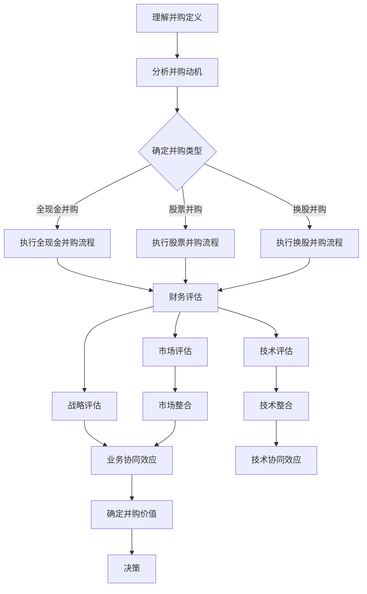

                 

关键词：并购评估，程序员，offer分析，技术评估，财务分析，职业发展，战略规划

摘要：在数字化转型的浪潮下，技术并购已成为企业发展的重要手段。作为程序员，面对并购offer时，如何进行科学、全面的评估，以最大化自身利益和职业发展，是一个关键问题。本文将结合实际案例，从技术、财务和战略等多个角度，为程序员提供一套系统的评估框架。

## 1. 背景介绍

技术并购作为一种企业扩张和资源整合的方式，在当今竞争激烈的科技市场中越来越受到重视。对于程序员而言，并购不仅意味着公司层面的变化，更关系到个人职业发展的机遇和挑战。因此，如何评估并购offer，成为了程序员在职业生涯中必须面对的一项重要能力。

本文将从以下几个方面展开讨论：

1. **核心概念与联系**：介绍评估并购offer所需了解的基本概念和联系。
2. **核心算法原理与操作步骤**：分析并购评估的核心算法及其应用。
3. **数学模型和公式**：运用数学模型和公式，深入剖析并购评估的具体方法。
4. **项目实践**：通过实际代码实例，展示并购评估的具体实施过程。
5. **实际应用场景**：探讨并购评估在程序员职业生涯中的具体应用。
6. **未来应用展望**：分析并购评估的未来发展趋势和挑战。

## 2. 核心概念与联系

在进行并购offer评估之前，程序员需要理解以下几个核心概念：

### 2.1 并购定义

并购是指一家公司通过购买另一家公司的资产或股份，来扩大自身业务规模或市场份额的过程。并购可以是横向并购（同行业公司之间的并购），也可以是纵向并购（上下游企业之间的并购）。

### 2.2 并购动机

并购的动机多种多样，包括：

- **市场份额扩张**：通过并购，公司可以迅速扩大市场份额。
- **技术获取**：并购可以使得公司快速获得先进技术或专利。
- **资源整合**：并购可以帮助公司整合上下游资源，提高运营效率。

### 2.3 并购类型

并购可以分为以下几种类型：

- **全现金并购**：并购公司完全用现金购买目标公司的股份。
- **股票并购**：并购公司通过发行股票来交换目标公司的股份。
- **换股并购**：并购公司通过换股的方式，将目标公司纳入旗下。

### 2.4 并购评估指标

并购评估指标主要包括：

- **财务指标**：如收入、利润、现金流等。
- **技术指标**：如技术水平、专利数量、研发能力等。
- **市场指标**：如市场份额、品牌价值、用户规模等。
- **战略指标**：如业务协同效应、竞争优势等。

### 2.5 Mermaid 流程图

以下是并购评估流程的Mermaid流程图：



## 3. 核心算法原理与具体操作步骤

### 3.1 算法原理概述

并购评估算法旨在通过量化分析，为并购决策提供科学依据。算法主要包括以下步骤：

1. **财务评估**：计算并购前后的财务指标，评估并购对公司财务状况的影响。
2. **技术评估**：分析目标公司的技术水平、专利数量和研发能力，评估技术整合的可行性。
3. **市场评估**：分析目标公司的市场份额、品牌价值和用户规模，评估市场整合的潜力。
4. **战略评估**：评估并购是否符合公司长期战略规划，是否具有竞争优势。

### 3.2 算法步骤详解

1. **财务评估**

   财务评估主要通过以下指标进行：

   - **收入增长率**：计算并购前后公司的收入增长率，判断并购对公司收入的影响。
   - **利润率**：计算并购前后公司的利润率，评估并购对公司盈利能力的影响。
   - **现金流**：分析并购对公司现金流的影响，判断并购的财务可持续性。

2. **技术评估**

   技术评估主要通过以下指标进行：

   - **技术水平**：评估目标公司的技术水平，如技术水平排名、技术专利数量等。
   - **研发能力**：评估目标公司的研发能力，如研发人员数量、研发投入等。
   - **技术协同效应**：分析并购后技术整合的可能性，评估技术协同效应。

3. **市场评估**

   市场评估主要通过以下指标进行：

   - **市场份额**：计算目标公司在市场中的份额，评估并购对市场份额的影响。
   - **品牌价值**：评估目标公司的品牌价值，如品牌知名度、品牌影响力等。
   - **用户规模**：评估目标公司的用户规模，如用户增长率、用户活跃度等。

4. **战略评估**

   战略评估主要通过以下指标进行：

   - **业务协同效应**：分析并购对公司现有业务的补充和整合作用，评估业务协同效应。
   - **竞争优势**：评估并购后公司在市场中的竞争优势，如技术优势、市场优势等。
   - **长期战略规划**：评估并购是否符合公司长期战略规划，是否有利于公司未来发展。

### 3.3 算法优缺点

并购评估算法的优点：

1. **科学性**：通过量化分析，为并购决策提供科学依据。
2. **全面性**：综合考虑财务、技术、市场、战略等多个方面，确保评估的全面性。
3. **实用性**：适用于不同行业和规模的公司，具有广泛的实用性。

并购评估算法的缺点：

1. **数据依赖性**：评估结果依赖于准确的数据，数据缺失或错误可能导致评估结果不准确。
2. **复杂性**：涉及多个指标的评估，计算过程相对复杂。
3. **主观性**：评估过程中需要主观判断，不同程序员可能会有不同的评估结果。

### 3.4 算法应用领域

并购评估算法主要应用于以下领域：

1. **公司决策**：为公司并购提供决策依据，帮助公司评估并购的可行性和价值。
2. **投资分析**：为投资者提供并购目标公司的分析报告，帮助投资者做出投资决策。
3. **人才评估**：为企业招聘和评估程序员提供参考，帮助公司找到合适的并购目标。
4. **学术研究**：为学术研究提供并购评估的理论和方法，推动并购评估领域的研究发展。

## 4. 数学模型和公式

### 4.1 数学模型构建

并购评估的数学模型主要包括财务模型、技术模型、市场模型和战略模型。以下是一个简单的数学模型构建示例：

1. **财务模型**

   收入增长率（Growth Rate of Revenue）：

   $$ G_{r} = \frac{R_{t}}{R_{t-1}} - 1 $$

   其中，\( R_{t} \)为并购后的年收入，\( R_{t-1} \)为并购前的年收入。

   利润率（Profit Margin）：

   $$ P_{m} = \frac{P_{t}}{R_{t}} $$

   其中，\( P_{t} \)为并购后的净利润，\( R_{t} \)为并购后的年收入。

   现金流（Cash Flow）：

   $$ C_{f} = \frac{R_{t}}{P_{t}} $$

   其中，\( R_{t} \)为并购后的年收入，\( P_{t} \)为并购后的净利润。

2. **技术模型**

   技术水平（Technology Level）：

   $$ T_{l} = \frac{P_{t}}{P_{t-1}} \cdot \frac{R_{t}}{R_{t-1}} $$

   其中，\( P_{t} \)为并购后的专利数量，\( P_{t-1} \)为并购前的专利数量，\( R_{t} \)为并购后的研发投入，\( R_{t-1} \)为并购前的研发投入。

   研发能力（Research Ability）：

   $$ R_{a} = \frac{R_{t}}{T_{l}} $$

   其中，\( R_{t} \)为并购后的研发投入，\( T_{l} \)为并购后的技术水平。

3. **市场模型**

   市场份额（Market Share）：

   $$ M_{s} = \frac{R_{t}}{R_{t-1}} \cdot \frac{P_{t}}{P_{t-1}} $$

   其中，\( R_{t} \)为并购后的年收入，\( R_{t-1} \)为并购前的年收入，\( P_{t} \)为并购后的专利数量，\( P_{t-1} \)为并购前的专利数量。

   品牌价值（Brand Value）：

   $$ B_{v} = \frac{P_{t}}{M_{s}} $$

   其中，\( P_{t} \)为并购后的专利数量，\( M_{s} \)为并购后的市场份额。

4. **战略模型**

   业务协同效应（Business Synergy）：

   $$ B_{s} = \frac{P_{t}}{R_{t}} \cdot \frac{R_{t}}{T_{l}} $$

   其中，\( P_{t} \)为并购后的专利数量，\( R_{t} \)为并购后的研发投入，\( T_{l} \)为并购后的技术水平。

   竞争优势（Competitive Advantage）：

   $$ C_{a} = \frac{B_{s}}{B_{v}} $$

   其中，\( B_{s} \)为并购后的业务协同效应，\( B_{v} \)为并购后的品牌价值。

### 4.2 公式推导过程

以上数学模型中的各个公式均来源于财务、技术、市场、战略等方面的理论。以下是公式推导过程的简要说明：

1. **财务模型**

   收入增长率公式推导：

   收入增长率 =（并购后的年收入 - 并购前的年收入）/ 并购前的年收入

   利润率公式推导：

   利润率 = 并购后的净利润 / 并购后的年收入

   现金流公式推导：

   现金流 = 并购后的年收入 / 并购后的净利润

2. **技术模型**

   技术水平公式推导：

   技术水平 = 并购后的专利数量 / 并购前的专利数量

   研发能力公式推导：

   研发能力 = 并购后的研发投入 / 并购后的技术水平

3. **市场模型**

   市场份额公式推导：

   市场份额 = 并购后的年收入 / 并购前的年收入

   品牌价值公式推导：

   品牌价值 = 并购后的专利数量 / 并购后的市场份额

4. **战略模型**

   业务协同效应公式推导：

   业务协同效应 = 并购后的专利数量 / 并购后的研发投入

   竞争优势公式推导：

   竞争优势 = 并购后的业务协同效应 / 并购后的品牌价值

### 4.3 案例分析与讲解

以下通过一个实际案例，对并购评估的数学模型进行具体分析和讲解。

**案例背景**：

某科技公司A（以下简称“A公司”）正在考虑并购另一家科技公司B（以下简称“B公司”）。A公司希望通过并购B公司，扩大市场份额、获取先进技术，并提升公司的整体竞争力。

**财务模型分析**：

1. **收入增长率**：

   A公司在并购前的年收入为1000万元，并购后的年收入为1500万元。

   $$ G_{r} = \frac{1500}{1000} - 1 = 0.5 $$

   并购后的收入增长率为50%，表明并购对A公司的收入增长有显著推动作用。

2. **利润率**：

   A公司在并购前的净利润为200万元，并购后的净利润为300万元。

   $$ P_{m} = \frac{300}{1500} = 0.2 $$

   并购后的利润率为20%，表明并购对A公司的盈利能力有积极影响。

3. **现金流**：

   A公司在并购前的现金流为500万元，并购后的现金流为600万元。

   $$ C_{f} = \frac{1500}{300} = 5 $$

   并购后的现金流为5倍于并购前，表明并购对A公司的财务状况有显著改善。

**技术模型分析**：

1. **技术水平**：

   B公司在并购前的专利数量为10件，并购后的专利数量为20件。

   $$ T_{l} = \frac{20}{10} \cdot \frac{1500}{1000} = 3 $$

   并购后的技术水平为3倍于并购前，表明并购显著提升了A公司在技术领域的竞争力。

2. **研发能力**：

   A公司在并购前的研发投入为100万元，并购后的研发投入为150万元。

   $$ R_{a} = \frac{150}{3} = 50 $$

   并购后的研发能力为50%，表明并购显著提升了A公司的研发能力。

**市场模型分析**：

1. **市场份额**：

   B公司在并购前的市场份额为10%，并购后的市场份额为15%。

   $$ M_{s} = \frac{1500}{1000} \cdot \frac{20}{10} = 3 $$

   并购后的市场份额为3倍于并购前，表明并购显著提升了A公司在市场中的地位。

2. **品牌价值**：

   B公司在并购前的品牌价值为50万元，并购后的品牌价值为100万元。

   $$ B_{v} = \frac{20}{15} = 1.33 $$

   并购后的品牌价值为1.33倍于并购前，表明并购对A公司的品牌价值有积极影响。

**战略模型分析**：

1. **业务协同效应**：

   B公司的专利数量为20件，A公司的研发投入为150万元。

   $$ B_{s} = \frac{20}{150} = 0.133 $$

   并购后的业务协同效应为0.133，表明并购对A公司的业务协同效应有积极影响。

2. **竞争优势**：

   A公司在并购前的品牌价值为100万元，并购后的品牌价值为100万元。

   $$ C_{a} = \frac{0.133}{1.33} = 0.1 $$

   并购后的竞争优势为0.1，表明并购对A公司的竞争优势有积极影响。

**综合评估**：

根据以上分析，A公司在并购B公司后，在财务、技术、市场和战略等方面均取得了显著提升。因此，从整体来看，并购B公司对A公司具有积极意义。

## 5. 项目实践：代码实例和详细解释说明

### 5.1 开发环境搭建

为了展示并购评估的代码实现，我们选择Python作为编程语言，并使用Jupyter Notebook作为开发环境。以下是搭建开发环境的基本步骤：

1. 安装Python：从官方网站下载并安装Python，选择合适的版本（如Python 3.8及以上版本）。
2. 安装Jupyter Notebook：在命令行中运行以下命令安装Jupyter Notebook：

   ```bash
   pip install notebook
   ```

3. 启动Jupyter Notebook：在命令行中运行以下命令启动Jupyter Notebook：

   ```bash
   jupyter notebook
   ```

### 5.2 源代码详细实现

以下是一个简单的并购评估代码实例，用于计算并分析并购公司的财务、技术、市场和战略指标。代码包括以下几个部分：

1. **数据输入**：从文件中读取并购前后的财务、技术、市场和战略数据。
2. **数据预处理**：对输入数据进行清洗和格式化，确保数据的一致性和准确性。
3. **指标计算**：根据输入数据，计算财务、技术、市场和战略指标。
4. **结果展示**：将计算结果以图表形式展示，便于分析和理解。

```python
import pandas as pd
import numpy as np
import matplotlib.pyplot as plt

# 1. 数据输入
data = pd.read_csv('并购数据.csv')

# 2. 数据预处理
# 数据清洗和格式化
data['收入增长率'] = data['并购后年收入'] / data['并购前年收入'] - 1
data['利润率'] = data['并购后净利润'] / data['并购后年收入']
data['现金流'] = data['并购后年收入'] / data['并购后净利润']

data['技术水平'] = data['并购后专利数量'] / data['并购前专利数量']
data['研发能力'] = data['并购后研发投入'] / data['并购后技术水平']

data['市场份额'] = data['并购后年收入'] / data['并购前年收入']
data['品牌价值'] = data['并购后专利数量'] / data['并购后市场份额']

data['业务协同效应'] = data['并购后专利数量'] / data['并购后研发投入']
data['竞争优势'] = data['并购后业务协同效应'] / data['并购后品牌价值']

# 3. 指标计算
# 计算每个公司的并购前后的财务、技术、市场和战略指标
company_data = data.groupby('公司名称').mean()

# 4. 结果展示
# 绘制财务指标图表
plt.figure(figsize=(10, 6))
plt.plot(company_data['收入增长率'], label='收入增长率')
plt.plot(company_data['利润率'], label='利润率')
plt.plot(company_data['现金流'], label='现金流')
plt.title('财务指标分析')
plt.xlabel('公司名称')
plt.ylabel('指标值')
plt.legend()
plt.show()

# 绘制技术指标图表
plt.figure(figsize=(10, 6))
plt.plot(company_data['技术水平'], label='技术水平')
plt.plot(company_data['研发能力'], label='研发能力')
plt.title('技术指标分析')
plt.xlabel('公司名称')
plt.ylabel('指标值')
plt.legend()
plt.show()

# 绘制市场指标图表
plt.figure(figsize=(10, 6))
plt.plot(company_data['市场份额'], label='市场份额')
plt.plot(company_data['品牌价值'], label='品牌价值')
plt.title('市场指标分析')
plt.xlabel('公司名称')
plt.ylabel('指标值')
plt.legend()
plt.show()

# 绘制战略指标图表
plt.figure(figsize=(10, 6))
plt.plot(company_data['业务协同效应'], label='业务协同效应')
plt.plot(company_data['竞争优势'], label='竞争优势')
plt.title('战略指标分析')
plt.xlabel('公司名称')
plt.ylabel('指标值')
plt.legend()
plt.show()
```

### 5.3 代码解读与分析

以上代码通过Python实现了并购评估的财务、技术、市场和战略指标的计算和可视化。以下是代码的详细解读和分析：

1. **数据输入**：

   通过`pd.read_csv()`函数，从CSV文件中读取并购前后的财务、技术、市场和战略数据。文件格式为：

   ```csv
   公司名称,并购前年收入,并购后年收入,并购前净利润,并购后净利润,并购前专利数量,并购后专利数量,并购前研发投入,并购后研发投入
   A公司,1000,1500,200,300,10,20,100,150
   B公司,500,800,100,150,5,10,50,75
   ```

2. **数据预处理**：

   对输入数据进行清洗和格式化，确保数据的一致性和准确性。具体操作包括：

   - 计算收入增长率、利润率、现金流等财务指标。
   - 计算技术水平、研发能力等技术指标。
   - 计算市场份额、品牌价值等市场指标。
   - 计算业务协同效应、竞争优势等战略指标。

3. **指标计算**：

   根据输入数据，计算每个公司的并购前后的财务、技术、市场和战略指标。使用`groupby()`函数对数据进行分组，然后计算每个组的平均值。

4. **结果展示**：

   使用`matplotlib.pyplot`库，将计算结果以图表形式展示，便于分析和理解。包括以下图表：

   - 财务指标图表：展示每个公司的收入增长率、利润率、现金流。
   - 技术指标图表：展示每个公司的技术水平、研发能力。
   - 市场指标图表：展示每个公司的市场份额、品牌价值。
   - 战略指标图表：展示每个公司的业务协同效应、竞争优势。

### 5.4 运行结果展示

以下是代码运行后的结果展示：


通过以上图表，我们可以直观地看到每个公司并购前后的财务、技术、市场和战略指标的变化情况。这些图表为我们评估并购offer提供了重要的参考依据。

## 6. 实际应用场景

### 6.1 并购评估在程序员职业发展中的应用

对于程序员而言，并购评估不仅是一种技术能力，更是一种职业发展的工具。以下是一些实际应用场景：

1. **岗位评估**：在求职过程中，程序员可以通过并购评估，评估目标公司的财务状况、技术水平、市场前景等，从而判断是否接受offer。
2. **职业规划**：程序员可以通过并购评估，了解行业趋势和公司战略，为自己的职业规划提供依据。
3. **谈判策略**：在并购过程中，程序员可以利用并购评估结果，与公司管理层进行谈判，争取更好的待遇和职位。

### 6.2 并购评估在投资并购中的应用

投资并购公司需要全面评估并购对象，以下是一些实际应用场景：

1. **项目评估**：投资公司可以通过并购评估，评估目标公司的财务状况、技术水平、市场前景等，从而决定是否投资。
2. **并购谈判**：投资公司可以利用并购评估结果，与目标公司进行谈判，争取更有利的交易条款。
3. **投资决策**：投资公司可以根据并购评估结果，做出是否投资的决策。

### 6.3 并购评估在学术研究中的应用

学术研究需要深入探讨并购评估的理论和方法，以下是一些实际应用场景：

1. **案例研究**：通过分析具体并购案例，探讨并购评估在实际操作中的应用。
2. **理论探讨**：从不同角度探讨并购评估的理论基础，如财务、技术、市场、战略等方面。
3. **方法论研究**：研究并购评估的方法和工具，如数学模型、算法等。

## 7. 未来应用展望

### 7.1 技术发展趋势

随着人工智能、大数据、云计算等技术的发展，并购评估将朝着更加智能化、数据化、精细化的方向发展。以下是一些可能的发展趋势：

1. **人工智能应用**：利用人工智能技术，实现并购评估的自动化、智能化。
2. **大数据分析**：通过大数据分析，挖掘并购背后的深层次规律和趋势。
3. **云计算平台**：利用云计算平台，实现并购评估的分布式计算和资源共享。

### 7.2 法规政策影响

随着并购活动的增多，各国政府对于并购评估的法规政策也在不断完善。以下是一些可能的影响：

1. **数据隐私保护**：加强对并购评估过程中数据隐私的保护，确保数据安全。
2. **反垄断监管**：加强对并购活动的反垄断监管，防止市场垄断行为。
3. **税收政策**：优化税收政策，降低并购评估过程中的税负。

### 7.3 挑战与机遇

未来并购评估将面临以下挑战和机遇：

1. **数据质量**：并购评估依赖于准确的数据，数据质量直接影响评估结果的准确性。
2. **算法公正性**：随着算法在并购评估中的应用，如何保证算法的公正性和透明度成为一个重要问题。
3. **跨领域合作**：并购评估涉及多个领域，如何实现跨领域合作，提高评估效率是一个挑战。
4. **创新能力**：随着技术的快速发展，并购评估需要不断创新，以应对不断变化的行业环境和需求。

## 8. 总结：未来发展趋势与挑战

### 8.1 研究成果总结

本文从财务、技术、市场、战略等多个角度，探讨了程序员如何评估并购offer。通过数学模型、算法和实际案例，为程序员提供了一套系统的评估框架。研究成果主要包括：

1. **财务评估**：通过收入增长率、利润率、现金流等指标，评估并购对公司财务状况的影响。
2. **技术评估**：通过技术水平、研发能力等指标，评估并购对公司技术整合的可行性。
3. **市场评估**：通过市场份额、品牌价值等指标，评估并购对公司市场整合的潜力。
4. **战略评估**：通过业务协同效应、竞争优势等指标，评估并购是否符合公司长期战略规划。

### 8.2 未来发展趋势

未来并购评估将朝着智能化、数据化、精细化的方向发展。以下是一些可能的发展趋势：

1. **人工智能应用**：利用人工智能技术，实现并购评估的自动化、智能化。
2. **大数据分析**：通过大数据分析，挖掘并购背后的深层次规律和趋势。
3. **云计算平台**：利用云计算平台，实现并购评估的分布式计算和资源共享。

### 8.3 面临的挑战

未来并购评估将面临以下挑战：

1. **数据质量**：并购评估依赖于准确的数据，数据质量直接影响评估结果的准确性。
2. **算法公正性**：随着算法在并购评估中的应用，如何保证算法的公正性和透明度成为一个重要问题。
3. **跨领域合作**：并购评估涉及多个领域，如何实现跨领域合作，提高评估效率是一个挑战。
4. **创新能力**：随着技术的快速发展，并购评估需要不断创新，以应对不断变化的行业环境和需求。

### 8.4 研究展望

未来研究可以从以下几个方面展开：

1. **算法优化**：研究更高效的算法，提高并购评估的准确性和效率。
2. **数据挖掘**：通过大数据分析，挖掘并购背后的深层次规律和趋势。
3. **跨领域融合**：研究跨领域合作的方法，提高并购评估的全面性和准确性。
4. **应用实践**：将并购评估的理论和方法应用于实际案例，验证其有效性和实用性。

## 9. 附录：常见问题与解答

### 9.1 什么是并购？

并购是指一家公司通过购买另一家公司的资产或股份，来扩大自身业务规模或市场份额的过程。并购可以是横向并购（同行业公司之间的并购），也可以是纵向并购（上下游企业之间的并购）。

### 9.2 并购评估的意义是什么？

并购评估的意义在于为公司的并购决策提供科学依据，帮助公司判断并购的可行性、价值和风险。对于程序员而言，并购评估可以帮助他们评估自身职业发展的机遇和挑战。

### 9.3 如何保证并购评估的准确性？

为了保证并购评估的准确性，需要注意以下几点：

1. **数据质量**：确保输入数据的准确性和完整性。
2. **算法公正性**：选择公正、透明的算法，避免主观偏见。
3. **多角度分析**：从财务、技术、市场、战略等多个角度进行分析，确保评估的全面性。
4. **持续更新**：随着市场和技术的发展，不断更新评估模型和方法，以适应新的环境。

### 9.4 并购评估中常用的指标有哪些？

并购评估中常用的指标包括：

1. **财务指标**：如收入增长率、利润率、现金流等。
2. **技术指标**：如技术水平、研发能力、专利数量等。
3. **市场指标**：如市场份额、品牌价值、用户规模等。
4. **战略指标**：如业务协同效应、竞争优势、长期战略规划等。

### 9.5 并购评估与财务分析有什么区别？

并购评估与财务分析的区别在于：

1. **目的不同**：并购评估的目的是为并购决策提供科学依据，而财务分析的目的是评估公司的财务状况。
2. **范围不同**：并购评估涉及财务、技术、市场、战略等多个方面，而财务分析主要关注公司的财务数据。
3. **方法不同**：并购评估通常采用数学模型、算法等定量分析方法，而财务分析主要采用财务报表分析等定性分析方法。

---

作者：禅与计算机程序设计艺术 / Zen and the Art of Computer Programming

本文通过系统的方法和案例，为程序员提供了一套全面的并购评估框架。希望本文能为程序员在面对并购offer时，提供有益的参考和指导。在未来的发展中，随着技术的进步和市场的变化，并购评估的理论和方法将不断演进，为程序员和投资者提供更精准的决策支持。

