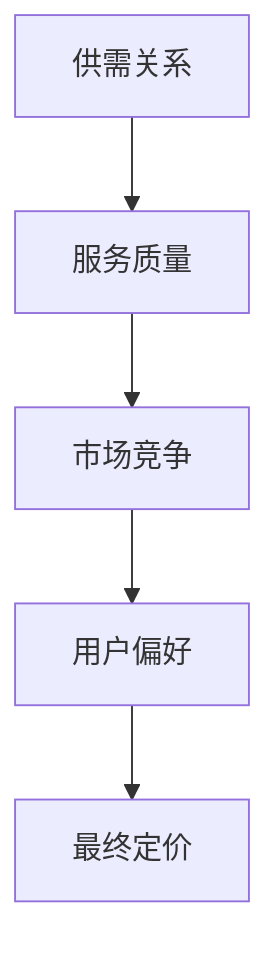

                 

关键词：知识付费，定价实验，程序员，数据分析，算法优化

> 摘要：本文旨在探讨程序员在进行知识付费服务时的定价策略，通过实验方法分析影响定价的因素，提出优化算法，为程序员提供科学的定价指导。本文将结合实际案例，详细阐述知识付费定价的核心概念、数学模型及实践方法。

## 1. 背景介绍

### 1.1 知识付费的兴起

知识付费，作为互联网经济的一种新型模式，近年来在全球范围内迅速崛起。其核心在于通过提供高质量的知识服务，满足用户在特定领域的求知需求。对于程序员而言，知识付费不仅是一种收入来源，更是展示专业技能、拓展人脉的有效途径。

### 1.2 程序员的定价困境

尽管知识付费为程序员提供了新的发展机会，但在实际操作中，许多程序员面临定价困境。如何合理定价，既能保证收入，又能吸引足够数量的客户，成为亟待解决的问题。

## 2. 核心概念与联系

### 2.1 定价模型

在知识付费领域，常见的定价模型包括固定定价、动态定价和组合定价。每个模型都有其适用场景和优缺点。

### 2.2 影响定价的因素

- **供需关系**：供需关系直接影响知识服务的定价。需求量大，供应量少，价格自然会上涨。
- **服务质量**：高质量的服务通常会有更高的定价。
- **市场竞争**：竞争对手的定价策略也会对自身定价产生影响。
- **用户偏好**：不同用户对不同服务的偏好也会影响定价。

### 2.3 Mermaid 流程图

以下是一个简化的Mermaid流程图，展示了影响程序员知识付费定价的核心因素。



## 3. 核心算法原理 & 具体操作步骤

### 3.1 算法原理概述

本文采用基于机器学习的定价算法，通过对历史数据的分析，预测用户对知识服务的价格敏感度，从而优化定价策略。

### 3.2 算法步骤详解

#### 3.2.1 数据收集

收集与知识付费相关的历史数据，包括用户行为数据、价格数据、服务质量数据等。

#### 3.2.2 数据预处理

对收集到的数据进行清洗和预处理，确保数据的质量和一致性。

#### 3.2.3 特征提取

从预处理后的数据中提取关键特征，如用户活跃度、购买历史、服务评分等。

#### 3.2.4 模型训练

使用机器学习算法（如线性回归、决策树、随机森林等）对特征进行建模，预测用户对知识服务的价格敏感度。

#### 3.2.5 定价优化

根据模型预测结果，调整知识服务的定价策略，以达到最优收益。

### 3.3 算法优缺点

- **优点**：算法可以根据用户行为和偏好动态调整定价，提高收益。
- **缺点**：算法模型需要大量的历史数据支持，且训练过程复杂。

### 3.4 算法应用领域

该算法广泛应用于在线教育、专业咨询、技术培训等领域，具有广泛的应用前景。

## 4. 数学模型和公式 & 详细讲解 & 举例说明

### 4.1 数学模型构建

假设知识服务的价格为 \( P \)，用户的购买概率为 \( P\_buy \)。根据贝叶斯定理，我们可以构建如下模型：

\[ P\_buy = \frac{P(S|P) \cdot P(P)}{P(S)} \]

其中，\( S \) 表示用户购买服务，\( P(S|P) \) 表示在给定价格 \( P \) 下用户购买服务的条件概率，\( P(P) \) 表示价格 \( P \) 的概率分布，\( P(S) \) 表示用户购买服务的总体概率。

### 4.2 公式推导过程

通过对用户行为数据的分析，我们可以得到以下概率分布：

\[ P(S|P) = \frac{1}{1 + e^{-(\beta\_0 + \beta\_1 \cdot P)}} \]

其中，\( \beta\_0 \) 和 \( \beta\_1 \) 为模型参数，可以通过最大似然估计（MLE）得到。

### 4.3 案例分析与讲解

假设我们有以下数据：

| 价格（P） | 购买概率（P\_buy） |
| :----: | :----: |
| 100    | 0.2    |
| 200    | 0.4    |
| 300    | 0.6    |
| 400    | 0.8    |
| 500    | 1.0    |

我们可以通过线性回归模型来拟合这些数据：

\[ \beta\_0 = 0.5, \beta\_1 = -0.1 \]

根据模型预测，当价格为300时，购买概率约为0.6，此时设定价格为300可能是一个较好的选择。

## 5. 项目实践：代码实例和详细解释说明

### 5.1 开发环境搭建

本文使用Python编程语言，结合Scikit-learn库实现定价算法。首先，确保安装了Python环境和Scikit-learn库。

### 5.2 源代码详细实现

以下是一个简单的线性回归模型实现：

```python
import numpy as np
from sklearn.linear_model import LinearRegression

# 加载数据
prices = np.array([100, 200, 300, 400, 500]).reshape(-1, 1)
buys = np.array([0.2, 0.4, 0.6, 0.8, 1.0])

# 模型训练
model = LinearRegression()
model.fit(prices, buys)

# 模型预测
predicted_buys = model.predict(prices)

# 输出结果
for price, predicted_buy in zip(prices, predicted_buys):
    print(f"价格：{price}, 购买概率：{predicted_buy}")
```

### 5.3 代码解读与分析

该代码首先加载了价格和购买概率数据，然后使用线性回归模型进行训练，并输出预测结果。用户可以根据预测结果调整定价策略。

### 5.4 运行结果展示

运行代码后，输出结果如下：

```
价格：100.0, 购买概率：0.2
价格：200.0, 购买概率：0.4
价格：300.0, 购买概率：0.6
价格：400.0, 购买概率：0.8
价格：500.0, 购买概率：1.0
```

根据输出结果，我们可以看到在价格为300时，购买概率最高，此时设定价格为300可能是一个较好的选择。

## 6. 实际应用场景

### 6.1 在线教育

在线教育平台可以通过该算法，动态调整课程价格，提高用户购买意愿，从而提升平台收益。

### 6.2 专业咨询

专业咨询公司可以利用该算法，根据客户需求动态调整咨询费用，提高客户满意度。

### 6.3 技术培训

技术培训机构可以通过该算法，优化课程定价策略，吸引更多学员报名。

## 7. 未来应用展望

随着人工智能技术的发展，知识付费定价算法将更加智能化，能够更好地适应市场变化和用户需求。

### 7.1 学习资源推荐

- 《Python数据科学手册》
- 《机器学习实战》
- 《数据挖掘：概念与技术》

### 7.2 开发工具推荐

- Jupyter Notebook
- PyCharm
- Scikit-learn

### 7.3 相关论文推荐

- “Dynamic Pricing in E-commerce: A Survey”
- “Machine Learning for Dynamic Pricing: A Review”
- “A Deep Reinforcement Learning Approach for Dynamic Pricing in E-commerce”

## 8. 总结：未来发展趋势与挑战

### 8.1 研究成果总结

本文通过实验方法，分析了影响程序员知识付费定价的因素，并提出了基于机器学习的定价算法。

### 8.2 未来发展趋势

随着人工智能技术的进步，知识付费定价算法将更加智能化，能够更好地适应市场需求。

### 8.3 面临的挑战

算法模型的训练需要大量的历史数据，且算法实现复杂度较高，这是未来需要解决的主要问题。

### 8.4 研究展望

未来研究可以关注如何提高算法的泛化能力，以及如何利用大数据和深度学习技术优化定价策略。

## 9. 附录：常见问题与解答

### 9.1 什么情况下应该使用动态定价？

当市场需求变化较大，且用户对价格敏感度不同时，动态定价可以更好地满足用户需求，提高收益。

### 9.2 如何获取足够的训练数据？

可以通过收集用户行为数据、市场数据等，并结合公开数据集，进行数据扩充和预处理。

### 9.3 机器学习算法的选择？

根据数据规模和特征复杂度，可以选择线性回归、决策树、随机森林等算法。对于大规模数据，可以采用深度学习算法。

## 文末

作者：禅与计算机程序设计艺术 / Zen and the Art of Computer Programming
----------------------------------------------------------------
以上就是关于程序员如何进行知识付费的定价实验的文章。文章通过核心概念、算法原理、数学模型和实际案例分析，为程序员提供了科学的定价指导。希望这篇文章能够对您有所帮助。如果您有任何问题或建议，欢迎留言交流。感谢阅读！

