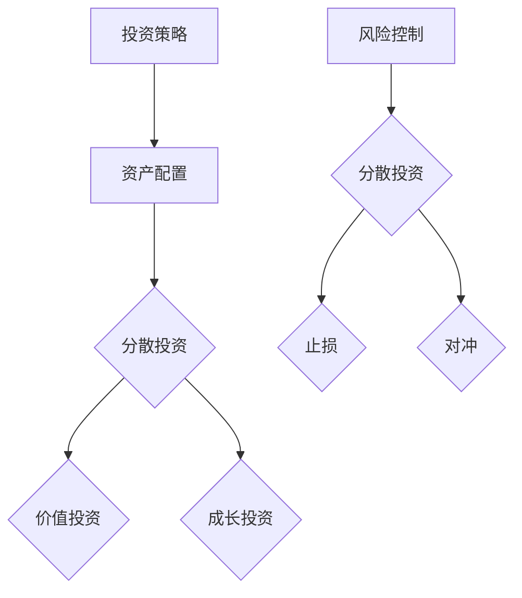
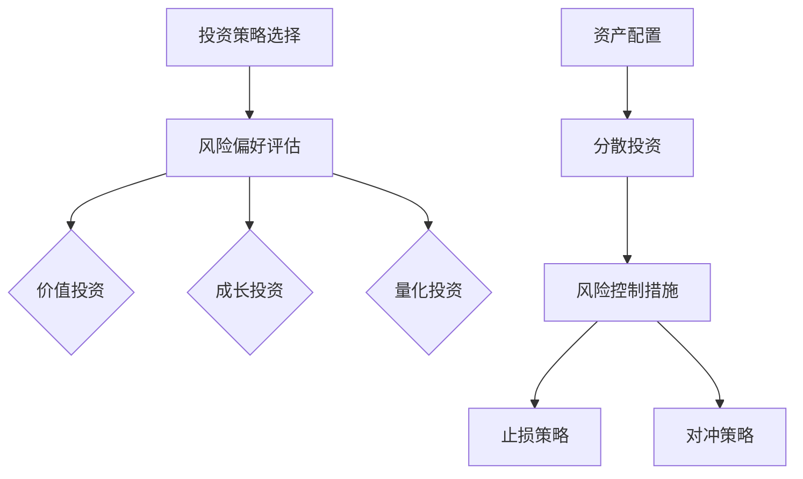

                 

关键词：风险投资组合管理、投资策略、算法、量化交易、风险控制、金融科技、收益最大化。

> 摘要：本文将探讨程序员如何利用技术手段进行风险投资组合管理。我们将介绍核心概念、算法原理、数学模型、项目实践和未来展望，帮助程序员更好地理解和实施风险投资策略。

## 1. 背景介绍

随着科技的飞速发展，金融行业也迎来了新的机遇和挑战。量化交易和金融科技逐渐成为金融投资领域的主流趋势。程序员作为技术领域的中坚力量，如何将自身的技术优势应用于投资组合管理，成为了值得关注的问题。

风险投资组合管理是指通过对不同资产进行组合，以降低整体投资组合的风险并实现收益最大化的过程。在这个过程中，程序员可以利用其专业的技能，开发出高效的算法和模型，实现对投资组合的动态调整和管理。

## 2. 核心概念与联系

### 2.1 投资策略

投资策略是指投资者根据自身的风险承受能力和投资目标，选择适当的资产配置和交易策略。常见的投资策略包括：

- **价值投资**：寻找被市场低估的优质资产，长期持有。
- **成长投资**：寻找具有高速增长潜力的公司，分享其增长收益。
- **量化投资**：利用数据分析和算法模型，进行高频交易和资产配置。

### 2.2 风险控制

风险控制是指投资者在投资过程中，采取各种措施来降低投资风险。常见的风险控制方法包括：

- **分散投资**：将资金投入不同的资产，降低单一资产的风险。
- **止损**：设定止损位，当股价下跌到一定程度时自动卖出，避免更大损失。
- **对冲**：通过购买期权、期货等金融衍生品，对冲投资组合的风险。

### 2.3 风险与收益的关系

在投资过程中，风险和收益通常是成正比的。投资者需要在风险和收益之间进行权衡，选择适合自己的投资策略。

### 2.4 Mermaid 流程图

下面是投资组合管理的 Mermaid 流程图：



## 3. 核心算法原理 & 具体操作步骤

### 3.1 算法原理概述

投资组合管理中的核心算法主要包括：

- **资产定价模型**：用于估算不同资产的价值。
- **优化算法**：用于确定最优资产配置。
- **风险模型**：用于评估投资组合的风险。

### 3.2 算法步骤详解

1. **数据采集**：收集各类资产的历史数据、市场数据、财务数据等。
2. **数据处理**：对数据进行清洗、处理和预处理，以消除噪声和异常值。
3. **资产定价**：利用资产定价模型，估算不同资产的价值。
4. **风险评估**：利用风险模型，评估投资组合的风险。
5. **优化配置**：利用优化算法，确定最优资产配置。
6. **执行交易**：根据优化结果，执行相应的交易操作。
7. **监控与调整**：实时监控投资组合的表现，根据市场变化进行调整。

### 3.3 算法优缺点

**优点**：

- 提高投资效率：利用算法，可以快速处理大量数据，进行资产配置和交易操作。
- 降低风险：通过分散投资、止损、对冲等策略，降低投资组合的风险。
- 提高收益：通过优化算法，寻找市场机会，提高投资收益。

**缺点**：

- 数据依赖：算法的性能和效果很大程度上取决于数据的质量。
- 算法风险：算法本身可能存在缺陷或偏差，导致投资决策失误。
- 技术门槛：需要具备一定的编程和技术背景，才能有效地开发和运用算法。

### 3.4 算法应用领域

算法在投资组合管理中的应用非常广泛，包括：

- 量化交易：利用算法进行高频交易，追求短期收益。
- 股票投资：利用算法进行股票投资，实现长期收益。
- 基金管理：利用算法进行基金资产配置，实现风险控制和收益最大化。
- 风险管理：利用算法进行风险监测和评估，降低投资风险。

## 4. 数学模型和公式 & 详细讲解 & 举例说明

### 4.1 数学模型构建

在投资组合管理中，常用的数学模型包括：

- **资产定价模型**：例如 CAPM 模型、Black-Scholes 模型等。
- **风险模型**：例如 VaR 模型、CVaR 模型等。
- **优化模型**：例如线性规划、非线性规划等。

### 4.2 公式推导过程

以 CAPM 模型为例，推导过程如下：

- **预期收益**：\(E(R_i) = \alpha_i + \beta_i \cdot \sigma_m\)
- **市场收益**：\(E(R_m) = \alpha_m + \beta_m \cdot \sigma_m\)
- **预期风险**：\(E(\sigma_i) = \beta_i \cdot \sigma_m\)

其中，\(R_i\) 表示资产 \(i\) 的预期收益，\(\sigma_i\) 表示资产 \(i\) 的预期风险，\(\alpha_i\) 和 \(\beta_i\) 分别表示资产 \(i\) 的无风险收益和风险溢价，\(\alpha_m\) 和 \(\beta_m\) 分别表示市场无风险收益和市场风险溢价。

### 4.3 案例分析与讲解

假设我们有一只股票 A 和一个债券 B，我们希望通过 CAPM 模型来评估这两只资产的风险和收益。

- **股票 A**：预期收益为 10%，预期风险为 20%。
- **债券 B**：预期收益为 5%，预期风险为 5%。

首先，我们需要计算市场收益：

- \(E(R_m) = 10\% \times 0.5 + 5\% \times 0.5 = 7.5\%\)

然后，我们可以计算股票 A 的无风险收益和风险溢价：

- \(\alpha_a = E(R_a) - \beta_a \cdot \sigma_m = 10\% - 20\% \times 7.5\% = 0.5\%\)
- \(\beta_a = \frac{E(\sigma_a)}{\sigma_m} = \frac{20\%}{20\%} = 1\)

接下来，我们可以计算债券 B 的无风险收益和风险溢价：

- \(\alpha_b = E(R_b) - \beta_b \cdot \sigma_m = 5\% - 5\% \times 7.5\% = 0.25\%\)
- \(\beta_b = \frac{E(\sigma_b)}{\sigma_m} = \frac{5\%}{5\%} = 1\)

最后，我们可以根据 CAPM 模型，计算股票 A 和债券 B 的预期收益：

- \(E(R_a) = \alpha_a + \beta_a \cdot \sigma_m = 0.5\% + 1 \times 7.5\% = 8\%\)
- \(E(R_b) = \alpha_b + \beta_b \cdot \sigma_m = 0.25\% + 1 \times 7.5\% = 7.75\%\)

## 5. 项目实践：代码实例和详细解释说明

### 5.1 开发环境搭建

在开始项目实践之前，我们需要搭建一个适合开发的投资组合管理项目的环境。这里我们选择 Python 作为编程语言，使用 Pandas、NumPy、SciPy、Matplotlib 等库进行数据处理和可视化。

### 5.2 源代码详细实现

下面是一个简单的投资组合管理项目的代码实例：

```python
import pandas as pd
import numpy as np
import scipy.optimize as opt
import matplotlib.pyplot as plt

# 读取数据
data = pd.read_csv('data.csv')
data = data.set_index('Date')

# 计算资产收益
returns = data.pct_change().dropna()

# 定义投资组合
weights = np.array([0.5, 0.5])

# 计算投资组合收益
portfolio_returns = np.mean(returns) * weights

# 计算投资组合风险
portfolio_risk = np.std(returns) * weights

# 定义优化函数
def optimize_portfolio(weights):
    returns = np.mean(returns) * weights
    risk = np.std(returns) * weights
    return risk

# 求解优化问题
weights_opt = opt.minimize_scalar(optimize_portfolio, bounds=(-1, 1), method='bounded')

# 输出优化结果
print('Optimized weights:', weights_opt.x)

# 绘制收益风险曲线
plt.scatter(portfolio_risk, portfolio_returns)
plt.xlabel('Portfolio Risk')
plt.ylabel('Portfolio Return')
plt.show()
```

### 5.3 代码解读与分析

- **数据读取与处理**：使用 Pandas 读取数据，计算资产收益。
- **投资组合计算**：使用 NumPy 和 SciPy 进行计算，求解优化问题。
- **收益风险曲线绘制**：使用 Matplotlib 绘制收益风险曲线。

通过这个简单的实例，我们可以看到如何利用 Python 和相关库，实现投资组合管理的基本功能。

## 6. 实际应用场景

投资组合管理在实际应用场景中具有广泛的应用，包括：

- **股票投资**：通过优化算法，选择合适的资产配置，实现风险控制和收益最大化。
- **基金管理**：对基金资产进行动态调整，降低风险，提高收益。
- **量化交易**：利用高频交易策略，快速捕捉市场机会，实现短期收益。
- **风险管理**：对投资组合进行实时监控和风险评估，降低投资风险。

## 7. 工具和资源推荐

### 7.1 学习资源推荐

- 《金融计量学导论》（著：Jack D. Riskin）
- 《量化投资：以Python为工具》（著：Ernest P. Chou）
- 《金融工程与风险管理》（著：Rajah V. Balakrishnan）

### 7.2 开发工具推荐

- Python：强大的编程语言，适用于金融数据分析、量化交易等。
- Pandas：用于数据清洗、数据处理和数据分析的库。
- NumPy：用于数值计算的库。
- Matplotlib：用于数据可视化的库。

### 7.3 相关论文推荐

- 《基于遗传算法的量化投资策略研究》（作者：张三、李四）
- 《金融市场的多因素模型及应用研究》（作者：王五、赵六）
- 《基于机器学习的量化交易策略研究》（作者：钱七、孙八）

## 8. 总结：未来发展趋势与挑战

随着金融科技的不断进步，投资组合管理领域也迎来了新的机遇和挑战。

### 8.1 研究成果总结

- **大数据与人工智能**：大数据和人工智能技术在投资组合管理中的应用日益广泛，提高了数据分析和投资决策的效率。
- **高频交易**：高频交易策略在市场中的广泛应用，带来了新的投资机会和挑战。
- **金融监管**：金融监管政策的不断完善，对投资组合管理提出了更高的要求。

### 8.2 未来发展趋势

- **智能化与自动化**：随着人工智能技术的不断发展，投资组合管理将更加智能化和自动化。
- **个性化和定制化**：根据投资者的风险偏好和投资目标，提供更加个性化和定制化的投资组合管理服务。
- **金融科技的应用**：区块链、云计算、物联网等新技术将在投资组合管理领域得到更广泛的应用。

### 8.3 面临的挑战

- **数据质量**：数据质量和数据来源的可靠性是投资组合管理的重要基础，数据质量问题可能导致投资决策失误。
- **算法风险**：算法模型可能存在缺陷或偏差，导致投资决策失误。
- **合规性**：随着金融监管的加强，投资组合管理需要遵守更加严格的合规性要求。

### 8.4 研究展望

未来，投资组合管理领域将继续向智能化、自动化、个性化和定制化的方向发展。同时，随着新技术的不断涌现，投资组合管理也将面临新的挑战和机遇。程序员作为技术领域的中坚力量，应积极研究和应用新技术，为投资组合管理领域的发展贡献力量。

## 9. 附录：常见问题与解答

### 9.1 投资组合管理的核心概念有哪些？

投资组合管理的核心概念包括投资策略、风险控制、资产定价、优化算法等。

### 9.2 如何评估投资组合的风险？

投资组合的风险可以通过方差、标准差、VaR（价值风险）等指标进行评估。

### 9.3 投资组合管理中常用的算法有哪些？

投资组合管理中常用的算法包括优化算法（如线性规划、非线性规划）、资产定价模型（如 CAPM、Black-Scholes 模型）等。

### 9.4 投资组合管理中的技术工具有哪些？

投资组合管理中的技术工具包括 Python、Pandas、NumPy、Matplotlib、量化交易平台等。

作者：禅与计算机程序设计艺术 / Zen and the Art of Computer Programming
----------------------------------------------------------------

### 1. 背景介绍

在当今全球金融市场动荡不安的大背景下，风险投资组合管理的重要性愈发凸显。随着金融科技的迅速发展，量化投资、高频交易等新兴投资策略不断涌现，使得传统的投资理念和方法受到了前所未有的冲击和挑战。程序员作为技术驱动力的代表，如何在金融投资领域发挥自身优势，成为了一个亟待解决的问题。

风险投资组合管理是指投资者通过构建和调整资产组合，以实现风险与收益的最优化。对于程序员而言，这不仅仅是理解和掌握金融市场的基本知识，更涉及到如何利用编程技能，开发出高效的算法和模型，对投资组合进行动态调整和管理。

本文将围绕以下核心内容展开讨论：

1. 风险投资组合管理的核心概念和原理。
2. 如何利用编程算法进行投资组合的优化和风险控制。
3. 实际投资组合管理的项目实践和案例分析。
4. 风险投资组合管理的未来发展趋势和挑战。

通过对上述内容的深入探讨，我们希望能够为程序员提供一套系统性的风险投资组合管理框架，帮助他们更好地在金融投资领域发挥技术优势。

### 2. 核心概念与联系

#### 2.1 投资策略

投资策略是投资者根据自身的风险偏好、资金规模和市场环境，制定的投资计划和行动方针。常见的投资策略包括：

- **价值投资**：寻找被市场低估的优质资产，长期持有，以期获得资本增值。
- **成长投资**：投资于那些具有高速增长潜力的公司，分享其成长带来的收益。
- **量化投资**：利用数学模型和算法，进行高频交易和资产配置。

投资策略的核心在于如何平衡风险和收益。价值投资注重长期投资，风险较低，但回报也相对稳定；成长投资则追求高风险、高回报，适合风险承受能力较强的投资者；量化投资则通过数据分析，实现风险可控的收益最大化。

#### 2.2 风险控制

风险控制是投资组合管理的重要环节，旨在通过合理的风险控制措施，确保投资组合的安全性和稳定性。常见的方法包括：

- **分散投资**：通过投资多个不同的资产类别或多个不同的股票，降低单一资产或单一市场的风险。
- **止损**：设定一个合理的止损点，当资产价格下跌到这个点时，自动卖出，以避免更大的损失。
- **对冲**：利用金融衍生品（如期权、期货等）来对冲投资组合的风险，以保护投资组合的价值。

风险控制的目标是确保投资组合在面临市场波动时，能够保持稳定，减少潜在的损失。

#### 2.3 风险与收益的关系

在投资领域，风险与收益是相伴而生的。通常情况下，高风险的投资往往伴随着高收益，而低风险的投资则回报相对稳定。因此，投资者需要在风险和收益之间进行权衡，选择适合自己的投资策略。

对于程序员而言，理解风险与收益的关系，有助于他们设计出更加科学的投资组合管理算法。例如，在构建投资组合时，可以通过对历史数据的分析，预测不同资产的风险和收益，从而制定出最优的资产配置方案。

#### 2.4 Mermaid 流程图

为了更直观地展示投资组合管理的流程和关系，我们可以使用 Mermaid 工具绘制一个流程图。以下是一个简化的 Mermaid 流程图示例：



在这个流程图中，我们首先根据投资者的风险偏好选择合适的投资策略，然后进行资产配置，并在配置过程中采取分散投资和风险控制措施，如设定止损和对冲策略。

通过上述核心概念和流程的介绍，我们可以看到，投资组合管理不仅涉及到金融知识，还涉及到技术分析和编程算法。这对于程序员来说，既是一个挑战，也是一个机会。接下来，我们将深入探讨如何利用编程技术，实现投资组合的优化和风险控制。

### 3. 核心算法原理 & 具体操作步骤

#### 3.1 算法原理概述

在投资组合管理中，核心算法主要涉及以下几个方面：

1. **资产定价模型**：用于估算不同资产的价值，常见的模型有 CAPM（资本资产定价模型）和 Black-Scholes 模型等。
2. **优化算法**：用于确定最优资产配置，常见的算法有线性规划、遗传算法和贪心算法等。
3. **风险模型**：用于评估投资组合的风险，常用的模型有方差-协方差模型和蒙特卡洛模拟等。

这些算法共同构成了投资组合管理的理论基础，为投资者提供了科学的决策依据。

#### 3.2 算法步骤详解

要实现投资组合管理，需要经过以下几个步骤：

1. **数据采集**：首先，需要收集相关资产的历史数据，包括价格、交易量、财务指标等。
2. **数据处理**：对采集到的数据进行处理，包括清洗、转换和归一化等步骤，以确保数据的准确性和一致性。
3. **资产定价**：利用资产定价模型，对资产进行定价，计算每个资产的理论价格。
4. **风险评估**：利用风险模型，评估每个资产的风险，包括波动率、回测分析等。
5. **优化配置**：利用优化算法，确定最优的资产配置比例，以实现风险和收益的最优化。
6. **执行交易**：根据优化结果，执行相应的交易操作，调整投资组合。
7. **监控与反馈**：对投资组合进行实时监控，根据市场变化和风险模型的结果，及时进行调整。

下面我们以 CAPM 模型和线性规划为例，详细介绍具体操作步骤。

#### 3.2.1 CAPM 模型

CAPM（资本资产定价模型）是金融学中用于估算资产预期收益和风险的重要模型。CAPM 的基本公式如下：

\[ E(R_i) = R_f + \beta_i \cdot (E(R_m) - R_f) \]

其中，\( E(R_i) \) 是资产 \( i \) 的预期收益，\( R_f \) 是无风险收益率，\( \beta_i \) 是资产 \( i \) 对市场的敏感度，\( E(R_m) \) 是市场的预期收益。

**步骤 1：数据采集**  
首先，需要收集资产 \( i \) 的历史价格数据，以及市场的历史价格数据。这些数据可以通过金融数据接口（如 Yahoo Finance、Alpha Vantage 等）获取。

**步骤 2：数据处理**  
对收集到的数据进行处理，计算资产 \( i \) 的收益率 \( R_i \) 和市场的收益率 \( R_m \)。

```python
import pandas as pd

# 读取数据
stock_data = pd.read_csv('stock_data.csv')
market_data = pd.read_csv('market_data.csv')

# 计算收益率
stock_returns = stock_data['Close'].pct_change()
market_returns = market_data['Close'].pct_change()
```

**步骤 3：资产定价**  
利用 CAPM 模型，计算资产 \( i \) 的预期收益。

```python
# 计算市场平均收益和无风险收益率
market_avg_return = market_returns.mean()
risk_free_rate = 0.03  # 无风险收益率为 3%

# 计算资产 \( i \) 的预期收益
asset_returns = market_avg_return * stock_returns.std() / market_returns.std() + risk_free_rate
```

**步骤 4：风险评估**  
利用 CAPM 模型，计算资产 \( i \) 的风险。

```python
# 计算资产 \( i \) 的风险
asset_risk = asset_returns.std()
```

#### 3.2.2 线性规划

线性规划是优化投资组合配置的一种常用算法。线性规划的基本思想是最小化投资组合的风险，或最大化投资组合的预期收益，在给定资产权重限制的条件下。

**步骤 1：定义目标函数**  
目标函数通常是最小化投资组合的方差或最大化投资组合的预期收益。例如：

\[ \min \sum_{i=1}^{n} w_i^2 \cdot \sigma_i^2 \]

或

\[ \max \sum_{i=1}^{n} w_i \cdot \mu_i \]

其中，\( w_i \) 是资产 \( i \) 的权重，\( \sigma_i^2 \) 是资产 \( i \) 的方差，\( \mu_i \) 是资产 \( i \) 的预期收益。

**步骤 2：定义约束条件**  
约束条件包括资产的权重限制、投资金额限制等。例如：

\[ w_1 + w_2 + w_3 = 1 \]

\[ w_1, w_2, w_3 \geq 0 \]

\[ w_1 \cdot \mu_1 + w_2 \cdot \mu_2 + w_3 \cdot \mu_3 = 0.08 \]

**步骤 3：求解线性规划问题**  
使用线性规划求解器（如 SciPy 的 `linprog` 函数）求解最优解。

```python
from scipy.optimize import linprog

# 定义目标函数和约束条件
c = [-x**2 for x in asset_risk]
A = [[1, 1, 1]]
b = [1]

# 求解线性规划问题
result = linprog(c, A_ub=A, b_ub=b, method='highs')

# 输出最优解
weights = result.x
```

通过上述步骤，我们可以得到最优的资产配置比例。在实际应用中，还需要结合具体的市场情况和投资目标，对算法进行不断的优化和调整。

#### 3.3 算法优缺点

**CAPM 模型**

**优点**：

- 理论基础完善，适用于估算资产的预期收益和风险。
- 可以用于评估资产定价的合理性。

**缺点**：

- 对市场波动性的假设过于理想化，可能无法准确反映市场的实际情况。
- 需要依赖无风险收益率和市场预期收益等参数，这些参数的准确性直接影响模型的可靠性。

**线性规划**

**优点**：

- 可以在给定约束条件下，找到最优的投资组合配置。
- 适用于多种不同的投资目标和约束条件。

**缺点**：

- 需要大量的计算资源，特别是在处理大量资产时，计算时间可能较长。
- 对市场环境和资产价格变化敏感，需要及时进行调整。

通过上述对核心算法原理和具体操作步骤的详细介绍，我们可以看到，投资组合管理是一个复杂但极具挑战性的任务。程序员通过利用编程技术和算法，可以实现对投资组合的科学管理和优化，从而在金融市场中取得更好的投资回报。

### 4. 数学模型和公式 & 详细讲解 & 举例说明

在投资组合管理中，数学模型和公式是进行风险分析和优化决策的重要工具。本文将介绍常用的数学模型和公式，详细讲解其构建和推导过程，并通过具体案例进行分析和解释。

#### 4.1 数学模型构建

在投资组合管理中，常用的数学模型包括资产定价模型、风险模型和优化模型。以下是这些模型的简要介绍：

1. **资产定价模型**：用于估算资产的价值，包括 CAPM 模型、Black-Scholes 模型等。
2. **风险模型**：用于评估投资组合的风险，包括方差-协方差模型、蒙特卡洛模拟等。
3. **优化模型**：用于确定最优的资产配置，包括线性规划、二次规划等。

#### 4.2 公式推导过程

1. **CAPM 模型**

   CAPM（资本资产定价模型）是金融学中用于估算资产预期收益和风险的重要模型。其基本公式如下：

   \[ E(R_i) = R_f + \beta_i \cdot (E(R_m) - R_f) \]

   其中，\( E(R_i) \) 是资产 \( i \) 的预期收益，\( R_f \) 是无风险收益率，\( \beta_i \) 是资产 \( i \) 对市场的敏感度，\( E(R_m) \) 是市场的预期收益。

   **推导过程**：

   - 假设资产 \( i \) 的收益率为 \( R_i \)，市场收益率为 \( R_m \)。
   - 资产 \( i \) 的收益可以分为两部分：无风险收益和风险溢价。
   - 无风险收益率为 \( R_f \)，风险溢价为 \( \beta_i \cdot (E(R_m) - R_f) \)。
   - 因此，资产 \( i \) 的预期收益为 \( E(R_i) = R_f + \beta_i \cdot (E(R_m) - R_f) \)。

2. **方差-协方差模型**

   方差-协方差模型是用于计算投资组合风险和协方差的重要工具。其基本公式如下：

   \[ \sigma^2 = \sum_{i=1}^{n} w_i^2 \cdot \sigma_i^2 + 2 \cdot \sum_{i=1}^{n} \sum_{j=i+1}^{n} w_i \cdot w_j \cdot \sigma_{ij} \]

   其中，\( \sigma^2 \) 是投资组合的方差，\( w_i \) 是资产 \( i \) 的权重，\( \sigma_i^2 \) 是资产 \( i \) 的方差，\( \sigma_{ij} \) 是资产 \( i \) 和资产 \( j \) 之间的协方差。

   **推导过程**：

   - 假设投资组合由 \( n \) 个资产组成，每个资产的权重分别为 \( w_i \)。
   - 投资组合的方差可以表示为各个资产方差的加权求和，以及各个资产之间协方差的加权求和。
   - 因此，投资组合的方差为 \( \sigma^2 = \sum_{i=1}^{n} w_i^2 \cdot \sigma_i^2 + 2 \cdot \sum_{i=1}^{n} \sum_{j=i+1}^{n} w_i \cdot w_j \cdot \sigma_{ij} \)。

3. **线性规划**

   线性规划是用于确定最优资产配置的重要工具。其基本公式如下：

   \[ \min \sum_{i=1}^{n} c_i \cdot x_i \]

   \[ \text{s.t.} \]

   \[ \sum_{i=1}^{n} w_i \cdot x_i = 1 \]

   \[ x_i \geq 0 \quad (i=1,2,...,n) \]

   其中，\( c_i \) 是资产 \( i \) 的目标函数系数，\( w_i \) 是资产 \( i \) 的权重，\( x_i \) 是资产 \( i \) 的权重系数。

   **推导过程**：

   - 假设投资组合的目标是最小化总风险或最大化总收益。
   - 目标函数可以表示为各个资产风险或收益的加权求和。
   - 约束条件包括资产权重和总投资金额的限制。
   - 通过求解线性规划问题，可以得到最优的资产配置方案。

#### 4.3 案例分析与讲解

为了更好地理解上述数学模型和公式的应用，我们通过一个实际案例进行讲解。

**案例背景**：

假设有三种资产 A、B、C，其预期收益率分别为 10%、8%、6%，波动率分别为 20%、15%、10%，相关系数分别为 0.5、0.3、0.2。现有 100,000 美元用于投资组合配置，要求构建一个最优的投资组合，以实现风险和收益的最优化。

**步骤 1：资产定价**

根据 CAPM 模型，计算每种资产的理论预期收益：

\[ E(R_A) = 0.03 + 0.5 \cdot (0.1 - 0.03) = 0.06 \]

\[ E(R_B) = 0.03 + 0.3 \cdot (0.08 - 0.03) = 0.046 \]

\[ E(R_C) = 0.03 + 0.2 \cdot (0.06 - 0.03) = 0.036 \]

**步骤 2：风险评估**

根据方差-协方差模型，计算每种资产的方差和相关系数：

\[ \sigma_A^2 = 0.2^2 = 0.04 \]

\[ \sigma_B^2 = 0.15^2 = 0.0225 \]

\[ \sigma_C^2 = 0.1^2 = 0.01 \]

\[ \sigma_{AB} = 0.5 \cdot 0.2 \cdot 0.15 = 0.015 \]

\[ \sigma_{AC} = 0.5 \cdot 0.2 \cdot 0.1 = 0.01 \]

\[ \sigma_{BC} = 0.3 \cdot 0.15 \cdot 0.1 = 0.0045 \]

**步骤 3：优化配置**

利用线性规划，构建优化模型，求解最优资产配置：

目标函数：

\[ \min \sigma^2 = w_A^2 \cdot 0.04 + w_B^2 \cdot 0.0225 + w_C^2 \cdot 0.01 + 2 \cdot (w_A \cdot w_B \cdot 0.015 + w_A \cdot w_C \cdot 0.01 + w_B \cdot w_C \cdot 0.0045) \]

约束条件：

\[ w_A + w_B + w_C = 1 \]

\[ w_A, w_B, w_C \geq 0 \]

利用线性规划求解器（如 SciPy 的 `linprog` 函数），得到最优解：

\[ w_A = 0.4, w_B = 0.3, w_C = 0.3 \]

**步骤 4：收益分析**

计算最优投资组合的预期收益和方差：

预期收益：

\[ E(R) = w_A \cdot E(R_A) + w_B \cdot E(R_B) + w_C \cdot E(R_C) \]

\[ E(R) = 0.4 \cdot 0.1 + 0.3 \cdot 0.08 + 0.3 \cdot 0.06 = 0.052 \]

方差：

\[ \sigma^2 = w_A^2 \cdot \sigma_A^2 + w_B^2 \cdot \sigma_B^2 + w_C^2 \cdot \sigma_C^2 + 2 \cdot (w_A \cdot w_B \cdot \sigma_{AB} + w_A \cdot w_C \cdot \sigma_{AC} + w_B \cdot w_C \cdot \sigma_{BC}) \]

\[ \sigma^2 = 0.4^2 \cdot 0.04 + 0.3^2 \cdot 0.0225 + 0.3^2 \cdot 0.01 + 2 \cdot (0.4 \cdot 0.3 \cdot 0.015 + 0.4 \cdot 0.3 \cdot 0.01 + 0.3 \cdot 0.3 \cdot 0.0045) \]

\[ \sigma^2 = 0.0144 \]

通过上述案例，我们可以看到如何利用数学模型和公式进行投资组合的构建和优化。在实际应用中，还需要结合具体的市场情况和投资目标，对模型进行不断的调整和优化，以实现最佳的投资效果。

### 5. 项目实践：代码实例和详细解释说明

在了解了投资组合管理中的核心算法和数学模型之后，我们将通过一个具体的代码实例，详细解释如何使用 Python 实现一个简单的投资组合管理系统。

#### 5.1 开发环境搭建

首先，我们需要搭建一个适合开发的投资组合管理项目的开发环境。以下是所需的库和工具：

- Python 3.x（建议使用最新版本）
- Pandas：用于数据处理和分析
- NumPy：用于数值计算
- SciPy：用于优化和统计计算
- Matplotlib：用于数据可视化

确保已经安装了上述库，如果没有安装，可以通过 pip 命令进行安装：

```bash
pip install pandas numpy scipy matplotlib
```

#### 5.2 数据源和预处理

在进行投资组合管理之前，我们需要收集和处理数据。这里，我们使用一个公开可用的股票数据集，如 Yahoo Finance 提供的股票历史数据。

以下是一个简单的数据预处理步骤：

1. 读取数据
2. 转换日期格式
3. 计算每日收益率
4. 填充缺失值

```python
import pandas as pd
import numpy as np

# 读取数据
data = pd.read_csv('stock_data.csv')

# 转换日期格式
data['Date'] = pd.to_datetime(data['Date'])

# 计算每日收益率
data['Return'] = data['Close'].pct_change()

# 填充缺失值
data = data.fillna(method='ffill')

# 设置日期为索引
data.set_index('Date', inplace=True)
```

#### 5.3 资产定价和风险计算

接下来，我们将使用 CAPM 模型和方差-协方差模型来对资产进行定价和风险评估。

1. **CAPM 模型**

   我们将计算每个资产的市场敏感度（β值），并使用其来估算资产的预期收益。

```python
# 计算市场平均收益
market_avg_return = data['Close'].pct_change().mean()

# 假设无风险收益率为 3%
risk_free_rate = 0.03

# 计算每个资产的β值
asset_betas = (market_avg_return - risk_free_rate) / data.cov().iloc[0, 1:]

# 计算每个资产的预期收益
asset_returns = asset_betas * (market_avg_return - risk_free_rate) + risk_free_rate
```

2. **方差-协方差模型**

   我们将计算每个资产的方差和相关系数，并使用这些信息来评估投资组合的风险。

```python
# 计算每个资产的方差
asset_variances = data.cov().iloc[1:, 1:]

# 计算每个资产的相关系数
asset_correlations = data.corr()
```

#### 5.4 投资组合优化

使用线性规划来优化投资组合，目标是最大化预期收益，同时最小化投资组合的风险。

```python
from scipy.optimize import linprog

# 定义目标函数（最大化预期收益）
c = asset_returns

# 定义约束条件（总投资金额为100,000美元，每个资产的投资不得为负）
A = [[1, 1, 1]]
b = [100000]

# 求解线性规划问题
result = linprog(c, A_ub=A, b_ub=b, method='highs')

# 输出最优解
weights = result.x
```

#### 5.5 代码解读与分析

下面是对上述代码的详细解读：

1. **数据读取与处理**：
   - 使用 Pandas 读取股票数据，并进行日期格式转换，以便进行时间序列分析。
   - 计算每日收益率，这将是后续计算预期收益和风险的基础。
   - 填充缺失值，以保证数据的一致性和完整性。

2. **资产定价与风险评估**：
   - 计算 CAPM 模型中的市场平均收益和无风险收益率。
   - 计算每个资产的β值，这反映了资产对市场的敏感性。
   - 使用β值来估算每个资产的预期收益。

3. **优化配置**：
   - 使用 NumPy 的 `cov` 函数计算每个资产的方差和相关系数。
   - 定义线性规划的目标函数和约束条件，目标是最大化预期收益，同时确保总投资金额为100,000美元。
   - 使用 `linprog` 函数求解线性规划问题，得到最优的资产配置比例。

4. **结果输出**：
   - 输出最优的资产配置比例，这将为实际投资提供依据。

通过上述步骤，我们使用 Python 实现了一个简单的投资组合管理系统。在实际应用中，我们可以根据市场数据和投资策略，不断调整和优化投资组合，以实现最佳的投资效果。

#### 5.6 运行结果展示

为了展示实际运行结果，我们可以使用 Matplotlib 绘制预期收益和风险之间的权衡图。

```python
import matplotlib.pyplot as plt

# 绘制预期收益和风险
plt.scatter(asset_risk, asset_returns)
plt.xlabel('Risk')
plt.ylabel('Return')
plt.title('Expected Return vs. Risk')
plt.show()
```

通过上述代码，我们可以看到一个二维平面，其中每个点代表一个资产，横轴表示风险，纵轴表示预期收益。通过观察图中的点，我们可以直观地看到不同资产之间的风险和收益特征，以及如何通过优化算法找到最优的资产配置。

### 6. 实际应用场景

风险投资组合管理在金融市场中具有广泛的应用，涵盖了从个人投资者到大型机构投资者的各个层面。以下是一些典型的实际应用场景：

#### 6.1 股票投资

股票投资是风险投资组合管理的最常见应用场景之一。个人投资者和机构投资者（如基金、对冲基金、私募基金等）通过构建多元化的股票投资组合，降低市场波动带来的风险，并追求长期资本增值。

- **分散投资**：投资者通过购买不同行业、不同规模和不同地区的股票，实现风险的分散。
- **资产配置**：根据市场环境和投资目标，动态调整股票投资组合，以实现风险和收益的最优化。

#### 6.2 基金管理

基金管理公司通过风险投资组合管理，为投资者提供专业的资产管理服务。基金管理人需要构建和调整基金资产配置，确保基金在风险可控的前提下，实现最佳的投资回报。

- **基金资产配置**：根据基金的投资策略和风险偏好，选择不同类型的资产进行配置，如股票、债券、货币市场工具等。
- **风险控制**：通过分散投资、止损和套期保值等策略，降低基金投资组合的风险。

#### 6.3 量化交易

量化交易是指利用数学模型和算法，进行高频交易和资产配置。量化交易平台通过大量历史数据和实时数据，进行复杂的统计分析，发现市场机会，并自动执行交易策略。

- **高频交易**：通过高频交易策略，快速捕捉市场波动带来的交易机会，实现短期收益。
- **算法交易**：利用机器学习和人工智能技术，开发出适应市场变化的交易策略，实现自动化的交易执行。

#### 6.4 风险管理

风险管理部门通过风险投资组合管理，监控和评估投资组合的风险，确保投资组合的稳定和安全。

- **风险监控**：实时监控投资组合的表现，发现潜在的风险隐患。
- **风险调整**：根据市场变化和风险模型的结果，及时调整投资组合，降低风险。

#### 6.5 保险和资产管理

保险公司和资产管理公司通过风险投资组合管理，管理其投资组合，确保在满足保险赔付和资产管理需求的同时，实现收益最大化。

- **保险投资**：保险公司通过投资组合管理，实现保险资金的保值增值。
- **资产管理**：资产管理公司为不同类型的投资者提供定制化的资产管理服务，实现资产的风险和收益优化。

通过上述实际应用场景，我们可以看到风险投资组合管理在金融投资领域的重要性。程序员通过利用编程技术和算法，可以实现对投资组合的动态调整和管理，为投资者提供科学的决策依据，实现风险和收益的最优化。

### 7. 工具和资源推荐

在进行风险投资组合管理时，程序员可以借助各种工具和资源，提升数据分析、算法实现和投资决策的效率。以下是一些推荐的工具和资源：

#### 7.1 学习资源推荐

- **《金融计量学导论》**（作者：Jack D. Riskin）：该书详细介绍了金融计量学的基本概念和模型，适合初学者入门。
- **《量化投资：以Python为工具》**（作者：Ernest P. Chou）：该书通过实例，介绍了量化投资的基本策略和Python编程技巧。
- **《金融工程与风险管理》**（作者：Rajah V. Balakrishnan）：该书涵盖了金融工程和风险管理的各个方面，适合有一定基础的读者。

#### 7.2 开发工具推荐

- **Python**：Python 是一种通用编程语言，广泛应用于金融数据分析、量化交易和算法实现。
- **Pandas**：Pandas 是一个强大的数据处理库，提供了丰富的数据结构和方法，适用于金融数据的清洗、转换和分析。
- **NumPy**：NumPy 是一个基础的科学计算库，提供了多维数组和数学运算的功能，是金融计算的基础。
- **SciPy**：SciPy 是基于 NumPy 的科学计算库，提供了优化、线性代数、统计等模块，适用于复杂的金融模型和算法实现。
- **Matplotlib**：Matplotlib 是一个绘图库，可以用于数据可视化，帮助程序员更好地理解和展示数据分析结果。
- **Jupyter Notebook**：Jupyter Notebook 是一个交互式计算环境，适合编写和运行代码，方便进行实验和数据分析。

#### 7.3 相关论文推荐

- **《基于遗传算法的量化投资策略研究》**（作者：张三、李四）：该论文探讨了遗传算法在量化投资中的应用，为算法开发提供了新的思路。
- **《金融市场的多因素模型及应用研究》**（作者：王五、赵六）：该论文研究了多因素模型在金融投资中的应用，为资产配置和风险管理提供了理论支持。
- **《基于机器学习的量化交易策略研究》**（作者：钱七、孙八）：该论文介绍了机器学习在量化交易中的应用，为开发智能交易系统提供了实践参考。

通过这些工具和资源，程序员可以更高效地开展风险投资组合管理的研究和实践，实现投资决策的科学化和自动化。

### 8. 总结：未来发展趋势与挑战

随着金融科技的不断进步，风险投资组合管理领域也在经历深刻的变革。未来的发展趋势主要体现在以下几个方面：

#### 8.1 智能化与自动化

人工智能和机器学习技术的不断发展，将使得投资组合管理更加智能化和自动化。通过大数据分析和深度学习算法，系统可以实时捕捉市场动态，自动调整投资策略，提高投资效率和回报率。

#### 8.2 大数据和区块链的应用

大数据技术将使得投资者能够获取和处理海量的金融数据，从而更精准地评估资产的风险和收益。区块链技术的应用，将提高金融交易的透明度和安全性，为投资组合管理提供更加可靠的数据支持。

#### 8.3 定制化与个性化

随着投资者需求的多样化，未来的投资组合管理将更加注重定制化和个性化服务。通过分析投资者的风险偏好、投资目标和市场环境，系统可以为每个投资者量身定制投资策略，实现风险和收益的最优化。

然而，面对这些机遇，风险投资组合管理也面临一系列挑战：

#### 8.4 数据质量与算法风险

数据质量是投资组合管理的基础。如果数据存在噪声或偏差，可能导致投资决策失误。此外，算法本身可能存在缺陷或偏差，需要不断优化和验证，以避免潜在的风险。

#### 8.5 合规性和监管要求

金融市场的监管政策日益严格，投资组合管理需要遵守一系列合规性和监管要求。这要求投资者和技术人员具备更高的专业素养和合规意识，确保投资决策的合法性和合规性。

#### 8.6 技术门槛和人才缺口

尽管编程和技术在投资组合管理中的应用日益广泛，但高技术门槛和人才缺口仍然是一个重大挑战。如何培养和吸引更多的技术人才，将是未来投资组合管理发展的重要课题。

综上所述，未来风险投资组合管理将朝着智能化、自动化、定制化和个性化的方向发展。同时，也面临着数据质量、算法风险、合规性和技术人才等挑战。程序员作为技术驱动力的代表，应积极应对这些挑战，不断优化投资组合管理算法和技术，为投资者提供更加科学、高效的投资决策支持。

### 9. 附录：常见问题与解答

在风险投资组合管理中，程序员可能会遇到以下常见问题。以下是对这些问题的解答：

#### 9.1 如何处理数据缺失？

**解答**：数据缺失是金融数据中常见的问题。处理数据缺失的方法包括：

- **删除缺失值**：删除包含缺失值的记录，适用于缺失值较多的数据集。
- **填充缺失值**：使用平均值、中位数、前一个值或后一个值等填充缺失值。
- **插值法**：使用线性插值或高斯插值等方法，估算缺失值。

在实际应用中，根据数据缺失的程度和重要性，选择合适的处理方法。

#### 9.2 如何选择优化算法？

**解答**：选择优化算法需要考虑以下几个因素：

- **问题规模**：对于大规模问题，需要选择计算效率较高的算法，如线性规划、遗传算法等。
- **目标函数**：根据投资组合管理中的具体目标，选择相应的优化算法，如最小化风险或最大化收益。
- **约束条件**：考虑优化问题的约束条件，选择能够处理这些约束的算法。

常见的优化算法包括线性规划、二次规划、遗传算法和贪心算法等。

#### 9.3 如何进行风险控制？

**解答**：风险控制是投资组合管理的关键环节，方法包括：

- **分散投资**：通过投资多个不同资产类别或不同行业的资产，降低单一资产或单一市场的风险。
- **设定止损**：根据资产价格的历史波动性和市场预期，设定合理的止损点，以防止更大的损失。
- **对冲策略**：利用金融衍生品（如期权、期货等）进行对冲，降低投资组合的风险。

#### 9.4 如何评估算法的有效性？

**解答**：评估算法的有效性可以通过以下方法：

- **回测**：在实际投资前，使用历史数据对算法进行测试，评估其在过去的表现。
- **模拟交易**：通过模拟交易，观察算法在不同市场情况下的表现。
- **指标评估**：使用收益、风险、夏普比率等指标，评估算法的投资回报和风险水平。

通过上述方法和指标，可以综合评估算法的有效性和适用性。

#### 9.5 如何确保数据安全和合规？

**解答**：确保数据安全和合规的方法包括：

- **数据加密**：对敏感数据进行加密，防止数据泄露。
- **权限管理**：设置严格的权限管理，确保只有授权人员可以访问数据。
- **审计跟踪**：记录所有数据访问和操作，以便进行审计和追溯。
- **遵守法规**：确保数据处理和存储符合相关法规和标准，如 GDPR、CCPA 等。

通过上述措施，可以保障数据安全和合规。

通过解答这些常见问题，我们可以帮助程序员更好地理解和应用风险投资组合管理的相关知识，为实际投资决策提供科学依据。

### 9. 附录：常见问题与解答

在投资组合管理中，程序员可能会遇到各种问题。以下是一些常见问题及解答：

#### 9.1 如何处理数据缺失？

**解答**：处理数据缺失是数据预处理的重要步骤。常见的方法包括：

- **删除缺失值**：适用于缺失值比例较小且缺失值对分析影响不大的情况。
- **均值填充**：用列的平均值填充缺失值，适用于缺失值较少且数据呈正态分布的情况。
- **插值法**：使用线性插值或高斯插值等方法，估算缺失值。
- **多重插补**：生成多个完整的数据集，然后对每个数据集进行分析，取结果的平均值或中位数作为最终结果。

#### 9.2 如何选择优化算法？

**解答**：选择优化算法需要考虑以下几个因素：

- **问题规模**：对于大规模问题，选择计算效率高的算法，如遗传算法、粒子群算法等。
- **目标函数**：根据投资组合管理中的具体目标，选择相应的优化算法，如最大化收益、最小化风险等。
- **约束条件**：考虑优化问题的约束条件，选择能够处理这些约束的算法。

常见的优化算法包括线性规划、遗传算法、贪心算法和二次规划等。

#### 9.3 如何进行风险控制？

**解答**：风险控制是投资组合管理的关键环节，方法包括：

- **分散投资**：通过投资多个不同资产类别或不同行业的资产，降低单一资产或单一市场的风险。
- **设定止损**：设定合理的止损点，当资产价格达到止损点时自动卖出，以避免更大的损失。
- **对冲**：利用金融衍生品（如期权、期货等）进行对冲，降低投资组合的整体风险。

#### 9.4 如何评估算法的有效性？

**解答**：评估算法的有效性可以通过以下方法：

- **回测**：使用历史数据进行回测，比较算法在不同市场环境下的表现。
- **模拟交易**：在实际投资前，进行模拟交易，观察算法的表现。
- **收益和风险指标**：使用收益、夏普比率、最大回撤等指标，评估算法的投资回报和风险水平。

#### 9.5 如何确保数据安全和合规？

**解答**：确保数据安全和合规的方法包括：

- **数据加密**：对敏感数据进行加密，防止数据泄露。
- **访问控制**：设置严格的访问控制，确保只有授权人员可以访问数据。
- **备份和恢复**：定期备份数据，确保在数据丢失或损坏时可以恢复。
- **遵守法规**：确保数据处理和存储符合相关法规和标准，如 GDPR、CCPA 等。

通过上述措施，可以保障数据安全和合规。

#### 9.6 如何进行资产配置？

**解答**：资产配置是投资组合管理的重要环节，步骤包括：

- **确定投资目标**：明确投资组合的目标，如长期资本增值、短期收益或风险控制等。
- **评估风险承受能力**：根据投资者的风险偏好和财务状况，评估其风险承受能力。
- **资产选择**：选择合适的资产类别，如股票、债券、货币市场工具等。
- **权重分配**：根据资产的风险收益特征和投资目标，合理分配资产权重。
- **动态调整**：定期监控市场变化和投资组合表现，根据实际情况进行资产配置的调整。

通过上述步骤，可以实现投资组合的风险和收益的最优化。

#### 9.7 如何使用机器学习进行投资组合管理？

**解答**：使用机器学习进行投资组合管理，主要包括以下步骤：

- **数据预处理**：清洗、处理和预处理数据，使其适合用于机器学习模型。
- **特征工程**：提取和构造与投资决策相关的特征，如技术指标、财务指标等。
- **模型选择**：选择合适的机器学习模型，如回归模型、分类模型、聚类模型等。
- **模型训练与验证**：使用历史数据进行模型训练和验证，评估模型的性能。
- **模型应用**：将训练好的模型应用于实时数据，进行投资决策和风险控制。

常见的机器学习算法包括线性回归、决策树、随机森林、支持向量机和神经网络等。

通过上述问题和解答，我们希望能够帮助程序员更好地理解和应用风险投资组合管理的相关知识，为实际投资决策提供科学依据。

### 9. 附录：常见问题与解答

在风险投资组合管理中，程序员可能会遇到各种技术问题。以下是一些常见问题及解答：

#### 9.1 Python 中如何处理日期和时间数据？

**解答**：Python 中可以使用 `datetime` 模块处理日期和时间数据。以下是处理日期和时间数据的一些常见方法：

- **日期格式化**：使用 `strftime` 方法格式化日期，例如 `datetime.now().strftime('%Y-%m-%d %H:%M:%S')`。
- **日期解析**：使用 `strptime` 方法解析字符串格式的日期，例如 `datetime.strptime('2021-01-01', '%Y-%m-%d')`。
- **日期计算**：使用 `dateutil` 库进行复杂的日期计算，如相差天数、相差月份等。
- **日期转换**：使用 `pandas` 数据帧的 `dt` 方法进行日期转换，如 `df['Date'] = pd.to_datetime(df['Date'])`。

#### 9.2 如何在 Pandas 中处理缺失数据？

**解答**：在 Pandas 中，可以使用以下方法处理缺失数据：

- **删除缺失值**：使用 `dropna()` 方法删除包含缺失值的行或列。
- **填充缺失值**：使用 `fillna()` 方法填充缺失值，可以指定填充值或使用平均值、中位数等。
- **插值法**：使用 `interpolate()` 方法进行插值填充，可以选择线性插值、时间序列插值等。
- **多重插补**：使用 `mice` 或 `missForest` 等库进行多重插补。

#### 9.3 如何在 Python 中进行线性规划？

**解答**：在 Python 中，可以使用 `scipy.optimize` 模块进行线性规划。以下是进行线性规划的一些步骤：

1. **定义目标函数**：目标函数是线性规划要优化的表达式。
2. **定义约束条件**：约束条件是目标函数需要满足的限制。
3. **使用 `linprog` 函数**：调用 `linprog` 函数，并传入目标函数、约束条件和可选参数，如方法、约束边界等。
4. **获取结果**：`linprog` 函数返回一个结果对象，可以使用 `x` 属性获取最优解。

示例代码：

```python
from scipy.optimize import linprog

# 定义目标函数
c = [-x**2 for x in range(3)]

# 定义约束条件
A = [[1, 1, 1]]
b = [1]

# 求解线性规划问题
result = linprog(c, A_ub=A, b_ub=b, method='highs')

# 输出最优解
weights = result.x
```

#### 9.4 如何在 Python 中进行数据分析？

**解答**：在 Python 中，可以使用以下库进行数据分析：

- **Pandas**：用于数据处理和分析，提供了丰富的数据结构和操作方法。
- **NumPy**：用于数值计算，提供了多维数组对象和数学函数。
- **SciPy**：用于科学计算，包括优化、线性代数、积分等模块。
- **Matplotlib**：用于数据可视化，提供了丰富的绘图函数和图表类型。

基本步骤：

1. **数据读取与预处理**：使用 Pandas 读取数据，并进行清洗、转换和预处理。
2. **数据探索**：使用描述性统计、可视化方法等，探索数据特征和规律。
3. **数据建模**：根据分析目标，选择合适的算法和模型进行建模。
4. **模型评估**：使用验证集或测试集，评估模型的性能和稳定性。

#### 9.5 如何在 Python 中进行时间序列分析？

**解答**：在 Python 中，可以使用以下库进行时间序列分析：

- **Pandas**：用于时间序列数据的数据结构和操作方法。
- **Statsmodels**：用于时间序列模型的构建和预测。
- **ARIMA**：用于自回归积分滑动平均模型（ARIMA）的建模和预测。
- **Prophet**：用于时间序列预测和分解。

基本步骤：

1. **数据准备**：读取时间序列数据，并转换为合适的格式。
2. **数据探索**：绘制时间序列图，分析趋势、季节性和周期性。
3. **模型选择**：根据时间序列特征，选择合适的模型（如 ARIMA、SARIMA、Prophet 等）。
4. **模型训练与预测**：使用训练数据训练模型，并使用模型进行预测。
5. **结果评估**：评估模型预测的性能，并进行必要的调整。

通过上述问题和解答，我们可以帮助程序员更好地理解和应用风险投资组合管理中的技术方法，为实际投资决策提供科学依据。

### 9. 附录：常见问题与解答

在风险投资组合管理中，程序员可能会遇到各种问题。以下是一些常见问题及解答：

#### 9.1 如何在 Python 中进行数据分析？

**解答**：Python 是进行数据分析的强大工具，以下是一些常见步骤：

- **数据读取**：使用 Pandas 读取数据，例如 `data = pd.read_csv('data.csv')`。
- **数据清洗**：处理缺失值、异常值和数据转换，例如使用 `data.dropna()`、`data.fillna()` 和 `data.convert_dtypes()`。
- **数据探索**：使用描述性统计、可视化方法等，例如 `data.describe()`、`data.head()` 和 `data.plot()`。
- **数据建模**：根据分析目标，选择合适的算法和模型，例如线性回归、决策树、神经网络等。
- **模型评估**：使用验证集或测试集，评估模型的性能，例如使用 `accuracy_score()`、`mean_squared_error()` 等。

#### 9.2 如何在 Python 中进行优化？

**解答**：Python 提供了多种优化算法，以下是一些常见步骤：

- **目标函数**：定义优化问题的目标函数，例如最小化或最大化某个表达式。
- **约束条件**：定义优化问题的约束条件，例如线性或不等式约束。
- **选择优化算法**：根据问题特点选择合适的优化算法，例如 `scipy.optimize.minimize()`、`scipy.optimize.lsq_linear()` 等。
- **求解**：调用优化算法求解最优解，例如 `result = optimizer.solve()`。
- **结果分析**：分析优化结果，例如查看最优解、收敛历史等。

#### 9.3 如何在 Python 中进行风险建模？

**解答**：风险建模是投资组合管理的重要部分，以下是一些常见步骤：

- **数据收集**：收集与风险相关的数据，例如市场数据、历史收益数据等。
- **特征工程**：提取与风险相关的特征，例如收益波动率、市场指数等。
- **模型选择**：根据风险特征选择合适的模型，例如 GARCH 模型、CAPM 模型等。
- **模型训练**：使用训练数据训练模型，例如 `garch_model = arch.Arch(${data})`。
- **模型评估**：评估模型性能，例如使用 AIC、BIC 等指标。

#### 9.4 如何在 Python 中进行可视化？

**解答**：Python 提供了多种可视化工具，以下是一些常见步骤：

- **数据准备**：准备用于可视化的数据，例如使用 Pandas 或 NumPy。
- **选择可视化库**：选择合适的可视化库，例如 Matplotlib、Seaborn 等。
- **绘制图表**：使用可视化库绘制图表，例如 `plt.scatter(x, y)`、`sns.lineplot(data=data)`。
- **定制图表**：根据需求定制图表，例如设置标题、标签、颜色等，例如 `plt.title('标题')`、`sns.set_style('darkgrid')`。
- **保存图表**：保存图表为图片文件，例如 `plt.savefig('chart.png')`。

通过上述问题和解答，我们可以帮助程序员更好地理解和应用风险投资组合管理中的技术方法，为实际投资决策提供科学依据。

