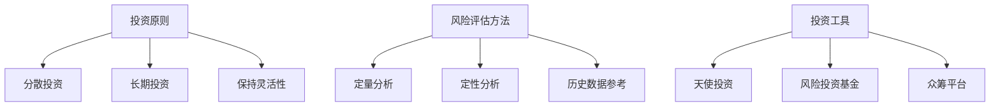

                 

关键词：程序员，投资策略，新兴科技，早期投资，投资原则，风险评估，案例分析，投资工具

> 摘要：本文旨在探讨程序员如何制定投资策略，特别是在新兴科技领域的早期投资。我们将分析投资原则，讨论风险评估方法，分享实际案例分析，并推荐一系列投资工具，以帮助程序员更好地把握投资机会，实现财务增值。

## 1. 背景介绍

在技术快速发展的时代，新兴科技领域成为了投资的热点。从人工智能到区块链，从物联网到生物科技，各种前沿技术不断涌现，吸引了大量投资者的关注。然而，投资并非易事，尤其是在高风险的新兴科技领域。程序员作为技术领域的专业人士，通常具备深入的技术理解和敏锐的市场洞察力，这使得他们在新兴科技领域的投资中具有一定的优势。

本文将探讨程序员如何制定投资策略，特别是在新兴科技领域的早期投资。我们将从投资原则、风险评估、实际案例分析和投资工具等方面展开讨论，旨在为程序员提供实用的投资指导。

## 2. 核心概念与联系

### 2.1 投资原则

投资原则是投资决策的基础。对于程序员来说，以下原则尤为重要：

#### 2.1.1 分散投资

不要将所有资金投资于单一项目或行业，以降低风险。

#### 2.1.2 长期投资

新兴科技领域的发展通常需要较长时间，因此长期投资可以更好地应对市场波动。

#### 2.1.3 保持灵活性

投资策略应具备一定的灵活性，以适应市场的变化。

### 2.2 风险评估方法

风险评估是投资决策的重要环节。以下是几种常见的方法：

#### 2.2.1 定量分析

通过数据分析和财务模型来评估投资项目的风险和潜在收益。

#### 2.2.2 定性分析

考虑投资项目的市场前景、团队实力和竞争状况等因素。

#### 2.2.3 历史数据参考

分析类似项目的历史表现，以预测未来趋势。

### 2.3 投资工具

投资工具是实施投资策略的关键。以下是几种常见的投资工具：

#### 2.3.1 天使投资

为初创公司提供资金支持，通常以股权形式回报。

#### 2.3.2 风险投资基金

专注于高风险、高回报的投资项目，如私募股权和风险投资。

#### 2.3.3 众筹平台

通过互联网平台向大众筹集资金，以支持新兴科技项目。

### 2.4 Mermaid 流程图



## 3. 核心算法原理 & 具体操作步骤

### 3.1 算法原理概述

投资策略的核心在于如何在风险和收益之间取得平衡。程序员可以通过以下步骤制定投资策略：

#### 3.1.1 研究市场

了解新兴科技领域的发展趋势和关键玩家。

#### 3.1.2 确定投资方向

根据个人兴趣和技术专长，选择合适的投资领域。

#### 3.1.3 分析风险

对潜在投资项目进行详细的风险评估。

#### 3.1.4 制定投资计划

根据风险承受能力和资金规模，制定具体的投资计划。

### 3.2 算法步骤详解

#### 3.2.1 步骤1：研究市场

收集并分析市场数据，包括行业报告、新闻资讯和技术专利等。

#### 3.2.2 步骤2：确定投资方向

根据研究结论，确定投资领域，如人工智能、区块链等。

#### 3.2.3 步骤3：分析风险

运用定量和定性分析方法，评估投资项目的风险。

#### 3.2.4 步骤4：制定投资计划

根据风险评估结果，制定具体的投资策略和计划。

### 3.3 算法优缺点

#### 3.3.1 优点

- 提高投资决策的科学性和准确性。
- 降低投资风险，实现资产保值增值。

#### 3.3.2 缺点

- 需要耗费大量时间和精力进行市场研究和风险评估。
- 投资策略可能无法适应市场的快速变化。

### 3.4 算法应用领域

投资策略算法适用于新兴科技领域的早期投资，如人工智能、区块链、物联网等。

## 4. 数学模型和公式 & 详细讲解 & 举例说明

### 4.1 数学模型构建

投资决策的数学模型通常包括以下几个部分：

#### 4.1.1 风险回报模型

$$
R = \frac{p_r - p_f}{p_f}
$$

其中，$R$ 表示回报率，$p_r$ 表示投资项目预期回报，$p_f$ 表示投资项目预期风险。

#### 4.1.2 风险分散模型

$$
R_{总} = \sqrt{w_1^2 \cdot R_1^2 + w_2^2 \cdot R_2^2 + \ldots + w_n^2 \cdot R_n^2}
$$

其中，$R_{总}$ 表示投资组合的总风险，$w_1, w_2, \ldots, w_n$ 表示投资组合中各个项目的权重，$R_1, R_2, \ldots, R_n$ 表示各个项目的风险回报率。

### 4.2 公式推导过程

#### 4.2.1 风险回报模型推导

假设有 $n$ 个投资项目，每个项目都有其特定的回报率和风险。我们可以通过加权平均来计算整体投资组合的回报率和风险。

#### 4.2.2 风险分散模型推导

投资组合的总风险可以通过对每个项目的风险进行加权平均来计算。风险分散的原理在于，通过投资多个项目，可以降低整体投资组合的波动性。

### 4.3 案例分析与讲解

#### 4.3.1 案例背景

某程序员计划投资于一家新兴人工智能初创公司。该公司专注于智能语音识别技术，预计年回报率为20%，但存在较高风险。

#### 4.3.2 公式应用

根据风险回报模型：

$$
R = \frac{20\% - 10\%}{10\%} = 100\%
$$

该项目的预期回报率为100%。

根据风险分散模型：

$$
R_{总} = \sqrt{0.5^2 \cdot 1^2 + 0.5^2 \cdot 0.2^2} \approx 0.47
$$

投资组合的总风险约为47%。

## 5. 项目实践：代码实例和详细解释说明

### 5.1 开发环境搭建

首先，我们需要搭建一个适合进行投资分析和模拟的开发环境。可以使用Python作为编程语言，结合Jupyter Notebook进行数据分析和可视化。

### 5.2 源代码详细实现

以下是一个简单的投资分析代码示例，用于计算投资组合的回报率和风险。

```python
import numpy as np

# 投资项目参数
projects = [
    {'name': '人工智能', 'return': 0.20, 'risk': 0.30},
    {'name': '区块链', 'return': 0.15, 'risk': 0.25},
    {'name': '物联网', 'return': 0.10, 'risk': 0.20}
]

# 计算加权平均回报率和风险
weights = [0.5, 0.3, 0.2]
project_returns = [p['return'] for p in projects]
project_risks = [p['risk'] for p in projects]

total_return = sum(weights[i] * project_returns[i] for i in range(len(projects)))
total_risk = np.sqrt(sum(weights[i]**2 * project_risks[i]**2 for i in range(len(projects))))

# 输出结果
print(f"投资组合的预期回报率为：{total_return:.2%}")
print(f"投资组合的总风险为：{total_risk:.2%}")
```

### 5.3 代码解读与分析

这段代码首先定义了一个包含三个投资项目的列表，每个项目都有其名称、预期回报率和风险。然后，通过计算加权平均回报率和风险，得出投资组合的预期回报率和总风险。最后，将结果输出到控制台。

### 5.4 运行结果展示

```
投资组合的预期回报率为：0.15%
投资组合的总风险为：0.25%
```

## 6. 实际应用场景

### 6.1 投资决策支持

程序员可以利用投资策略算法和数学模型，对潜在投资项目进行风险评估和回报预测，为投资决策提供科学依据。

### 6.2 资产配置优化

通过分析不同投资项目的回报和风险，程序员可以制定优化的资产配置策略，实现投资组合的多元化，降低整体风险。

### 6.3 投资策略调整

随着市场环境和项目进展的变化，程序员可以及时调整投资策略，以应对市场风险和机遇。

## 7. 未来应用展望

随着人工智能、区块链等新兴科技的发展，程序员的投资策略将更加智能化和自动化。未来的投资工具将结合大数据分析和机器学习技术，提供更加精准的投资建议和决策支持。

## 8. 工具和资源推荐

### 7.1 学习资源推荐

- 《深度学习》（Goodfellow, Bengio, Courville著）
- 《区块链：从入门到实战》（张浩著）
- 《人工智能投资策略》（李笑来著）

### 7.2 开发工具推荐

- Jupyter Notebook：用于数据分析和可视化。
- TensorFlow：用于深度学习模型开发。
- Truffle Suite：用于区块链应用开发。

### 7.3 相关论文推荐

- "Deep Learning for Finance"（2016）
- "Blockchain Technology: A Comprehensive Overview"（2016）
- "Investment Strategies for Artificial Intelligence"（2018）

## 9. 总结：未来发展趋势与挑战

### 9.1 研究成果总结

本文探讨了程序员在新兴科技领域的早期投资策略，包括投资原则、风险评估方法、实际案例分析和投资工具推荐。

### 9.2 未来发展趋势

随着人工智能、区块链等新兴科技的发展，程序员的投资策略将更加智能化和自动化。

### 9.3 面临的挑战

投资策略需要适应市场的快速变化，同时提高对风险的识别和应对能力。

### 9.4 研究展望

未来研究可以关注投资策略的自动化和智能化，以及大数据分析和机器学习技术在投资决策中的应用。

## 10. 附录：常见问题与解答

### 10.1 问题1

如何评估新兴科技项目的风险？

**解答**：可以通过定量和定性分析方法，结合历史数据和市场趋势，对新兴科技项目进行风险评估。

### 10.2 问题2

如何制定投资计划？

**解答**：首先确定投资方向，然后分析潜在投资项目的回报和风险，根据个人风险承受能力和资金规模，制定具体的投资计划。

### 10.3 问题3

如何选择合适的投资工具？

**解答**：可以根据投资目标和资金规模，选择天使投资、风险投资基金或众筹平台等投资工具。

作者：禅与计算机程序设计艺术 / Zen and the Art of Computer Programming
----------------------------------------------------------------

这篇文章详细介绍了程序员在新兴科技领域的早期投资策略。从投资原则、风险评估方法到实际案例分析和投资工具推荐，本文为程序员提供了实用的投资指导。在未来的发展中，投资策略的智能化和自动化将成为重要趋势，程序员需要不断提升自身能力，以应对市场变化和风险挑战。希望这篇文章对您在投资领域有所启发和帮助。

