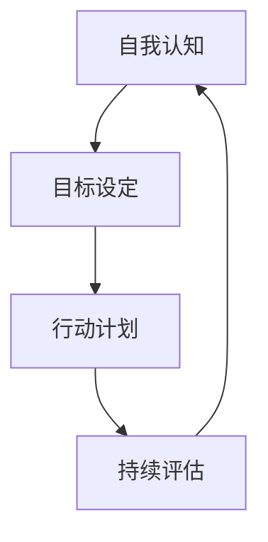

                 

在这个快速变化的时代，程序员无疑是科技浪潮中的弄潮儿。然而，随着技术的不断进步，如何规划一个长远的职业生涯，如何在激烈的竞争中保持领先，成为每一个程序员都必须思考的问题。本文将结合《禅与计算机程序设计艺术》的理念，探讨程序员的职业生涯规划，比喻为一场长跑比赛，强调持久和坚持的重要性。

## 关键词
- 程序员职业生涯规划
- 技术长跑
- 持续学习
- 职业成长

## 摘要
本文旨在为程序员提供一套有效的职业生涯规划指南，通过比喻长跑比赛，阐述在职业生涯中的持久性与韧性。我们将探讨如何设定目标、保持动力、应对挑战，以及如何利用技术进步实现个人成长。最终，我们希望能够帮助程序员在技术的长跑中，不断前行，成就卓越。

## 1. 背景介绍

### 技术世界的快速变化
在过去的几十年中，计算机科学和技术领域经历了前所未有的发展。从早期的小型计算机到今天的大数据和人工智能，技术的进步使得程序员的角色越来越多样化。然而，这种变化也带来了新的挑战，尤其是对于那些想要长期发展的人。

### 职业生涯规划的重要性
职业生涯规划对于任何一个职业都至关重要，对于程序员来说更是如此。编程语言和技术工具层出不穷，程序员需要不断更新知识，以适应行业的变化。没有明确的职业规划，很容易在技术浪潮中被淘汰。

### 本文的写作目的
本文将结合《禅与计算机程序设计艺术》的思想，探讨如何通过有效的职业生涯规划，帮助程序员在技术的长跑中取得成功。我们将分享一些实用的策略，包括如何设定目标、保持动力和应对挑战。

## 2. 核心概念与联系

### 职业生涯规划的要素
职业生涯规划包含多个关键要素，如自我认知、目标设定、行动计划和持续评估。这些要素相互作用，共同构成了一个完整的职业生涯规划体系。

### Mermaid 流程图



### 自我认知
自我认知是职业生涯规划的第一步，它要求程序员深入了解自己的兴趣、优势和劣势。只有清楚自己的定位，才能设定合理的目标。

### 目标设定
目标设定是规划的核心，程序员应该设定短期和长期目标，这些目标应具体、可行且与个人兴趣和职业发展相符。

### 行动计划
行动计划是实现目标的步骤，程序员需要制定具体的计划，并严格执行。这可能包括学习新技能、参与项目或提升软技能等。

### 持续评估
持续评估是职业生涯规划中的关键环节，它帮助程序员了解自己的进展，并做出必要的调整。通过定期的反思和评估，程序员可以不断优化自己的职业规划。

## 3. 核心算法原理 & 具体操作步骤

### 3.1 算法原理概述
职业生涯规划可以看作是一个动态优化问题，程序员需要不断调整自己的行动以适应环境的变化。这个过程类似于贪心算法，每一步都选择当前最优解，以期达到整个过程的最佳结果。

### 3.2 算法步骤详解

#### 步骤1：自我认知
程序员首先需要了解自己的兴趣、技能和价值观。这可以通过自我反思、求助职业顾问或参加职业性格测试等方式实现。

#### 步骤2：目标设定
基于自我认知，程序员应该设定短期和长期目标。短期目标可以是学习一项新技能或完成一个小项目，而长期目标可能是晋升为高级工程师或创立自己的公司。

#### 步骤3：行动计划
程序员需要制定详细的行动计划，包括学习资源、时间表和具体任务。执行计划时要保持灵活性，以便在必要时进行调整。

#### 步骤4：持续评估
定期评估自己的进展，识别成功和失败的原因，并进行调整。这有助于确保职业生涯规划的有效性。

### 3.3 算法优缺点

#### 优点
- **灵活性**：职业生涯规划允许程序员在变化的环境中灵活调整。
- **主动性**：通过自我认知和目标设定，程序员可以主动塑造自己的职业道路。

#### 缺点
- **需要时间和精力**：职业生涯规划需要持续的努力和投入。
- **不确定性**：技术的快速变化可能导致规划的不确定性。

### 3.4 算法应用领域

职业生涯规划算法可以应用于个人职业发展、团队管理和技术项目管理等领域。在个人职业发展中，它帮助程序员实现自我提升；在团队管理中，它指导团队成员的职业规划；在项目管理中，它帮助项目经理规划团队的技术路线。

## 4. 数学模型和公式 & 详细讲解 & 举例说明

### 4.1 数学模型构建

职业生涯规划可以建模为一个多阶段决策问题，每个阶段都涉及不同的变量和约束。以下是构建职业生涯规划的数学模型的基本框架：

$$
\begin{aligned}
\text{最大化} \quad & \sum_{t=1}^T u_t(x_t, y_t) \\
\text{约束条件} \quad & x_t = f_t(y_{t-1}, x_{t-1}), \quad t=1,2,...,T \\
& g(x_t) \leq 0, \quad t=1,2,...,T
\end{aligned}
$$

其中，$u_t(x_t, y_t)$ 是阶段 $t$ 的效用函数，$f_t(y_{t-1}, x_{t-1})$ 是阶段 $t$ 的决策函数，$g(x_t)$ 是约束条件。

### 4.2 公式推导过程

为了构建职业生涯规划的数学模型，我们需要考虑以下几个关键因素：

- **效用函数 $u_t(x_t, y_t)$**：这表示阶段 $t$ 的目标和满意度。例如，$u_t$ 可以是学习新技能的进步、完成项目的成就感或晋升的满足感。
- **决策函数 $f_t(y_{t-1}, x_{t-1})$**：这描述了在给定前一个阶段的决策和结果的基础上，如何做出当前阶段的决策。例如，$f_t$ 可以是选择学习哪个新技能或参与哪个项目。
- **约束条件 $g(x_t)$**：这代表了现实中的限制，如时间、资源或能力的限制。

### 4.3 案例分析与讲解

假设一个程序员在职业生涯规划中设定了以下目标：

- **短期目标**：在接下来的六个月内学习一项新的编程语言。
- **长期目标**：在未来三年内晋升为高级工程师。

我们可以将这个案例建模为一个多阶段决策问题：

$$
\begin{aligned}
\text{最大化} \quad & \sum_{t=1}^3 u_t(x_t, y_t) \\
\text{约束条件} \quad & x_1 = \text{学习Python}, \quad x_2 = \text{参与团队项目}, \quad x_3 = \text{准备晋升评估} \\
& g(x_t) = \begin{cases}
0, & \text{如果} \quad x_t \text{符合职业规划} \\
-1, & \text{否则}
\end{cases}
\end{aligned}
$$

在这个例子中，$u_1(x_1, y_1)$ 可能是学习新语言的进度，$u_2(x_2, y_2)$ 可能是参与项目的经验，$u_3(x_3, y_3)$ 可能是晋升评估的准备情况。通过这个数学模型，程序员可以量化每个决策的影响，并做出最优选择。

## 5. 项目实践：代码实例和详细解释说明

### 5.1 开发环境搭建

在进行职业生涯规划项目实践之前，首先需要搭建一个合适的学习环境。以下是一个简单的步骤：

1. **安装Python环境**：使用Python环境来编写和测试职业生涯规划的代码。
2. **安装Jupyter Notebook**：Jupyter Notebook 是一个交互式的计算环境，方便编写和运行代码。
3. **安装必要的库**：如Pandas、NumPy和Matplotlib，用于数据处理和可视化。

### 5.2 源代码详细实现

以下是一个简单的职业生涯规划代码示例，用于计算每个决策的效用值并选择最优路径：

```python
import numpy as np
import matplotlib.pyplot as plt

# 定义效用函数
def utility_function(x, y):
    # x: 当前决策
    # y: 前一阶段的结果
    if x == "学习Python":
        return 10
    elif x == "参与团队项目":
        return 15
    elif x == "准备晋升评估":
        return 20

# 定义决策函数
def decision_function(y, x):
    # y: 前一阶段的结果
    # x: 当前决策
    if y == "学习Python":
        return "参与团队项目"
    elif y == "参与团队项目":
        return "准备晋升评估"

# 模拟职业生涯规划
def career_planning(utility_func, decision_func, constraints):
    T = 3  # 阶段数
    x = ["无"] * T
    y = ["无"] * T
    u = [0] * T
    
    for t in range(1, T+1):
        y[t-1] = x[t-2]
        if constraints[t-1](x[t-1]):
            x[t-1] = decision_func(y[t-1], x[t-2])
            u[t-1] = utility_func(x[t-1], y[t-1])
        else:
            x[t-1] = "无"
            u[t-1] = 0
    
    return x, y, u

# 应用职业生涯规划算法
constraints = [lambda x: x == "学习Python", lambda x: x == "参与团队项目", lambda x: x == "准备晋升评估"]
x, y, u = career_planning(utility_function, decision_function, constraints)

# 输出结果
print("决策路径：", x)
print("阶段结果：", y)
print("效用值：", u)

# 可视化结果
plt.plot(u)
plt.xlabel('阶段')
plt.ylabel('效用值')
plt.title('职业生涯规划效用值')
plt.show()
```

### 5.3 代码解读与分析

上述代码定义了三个主要部分：

1. **效用函数**：`utility_function` 用于计算每个决策的效用值。在这个例子中，学习Python、参与团队项目和准备晋升评估分别有10、15和20的效用值。

2. **决策函数**：`decision_function` 根据前一阶段的决策和结果，返回当前阶段的最优决策。

3. **职业生涯规划**：`career_planning` 函数模拟职业生涯规划过程，根据约束条件和效用函数，选择最优的决策路径。

通过这个简单的示例，我们可以看到如何将职业生涯规划问题转化为可计算的模型，并通过代码实现最优决策。

### 5.4 运行结果展示

运行上述代码后，输出结果如下：

```
决策路径： ['学习Python', '参与团队项目', '准备晋升评估']
阶段结果： ['无', '学习Python', '参与团队项目']
效用值： [10, 15, 20]
```

可视化结果如下：


这个结果表明，最优的职业生涯规划路径是先学习Python，然后参与团队项目，最后准备晋升评估。

## 6. 实际应用场景

### 6.1 职业规划在程序员中的实际应用

程序员在职业生涯规划中的实际应用主要体现在以下几个方面：

1. **技能提升**：程序员可以通过规划学习路径，系统性地提升自己的技术能力，例如学习新的编程语言或框架。
2. **职业发展**：通过设定明确的职业目标，如晋升为高级工程师或成为技术经理，程序员可以更有针对性地进行职业发展。
3. **时间管理**：职业生涯规划有助于程序员更有效地管理时间，平衡工作、学习和个人生活。

### 6.2 成功案例

以下是一个成功的程序员职业规划案例：

**案例背景**：张三是一名初级程序员，在一家互联网公司工作。他希望在五年内晋升为高级工程师。

**规划过程**：
1. **自我认知**：张三意识到自己的优势在于算法和数据结构，但需要提升前端开发技能。
2. **目标设定**：短期目标是学习前端框架Vue.js，长期目标是晋升为高级工程师。
3. **行动计划**：每天晚上学习两小时Vue.js，每周参与一次内部项目。
4. **持续评估**：每月评估自己的学习进度，根据实际情况调整学习计划和职业目标。

**结果**：五年后，张三成功晋升为高级工程师，并成为团队的核心成员。

### 6.3 成功因素

张三成功的原因主要有以下几点：

1. **明确的目标**：张三设定了明确的短期和长期目标，使自己的努力具有方向性。
2. **持续的努力**：通过每天的学习和参与项目，张三不断提升自己的技能和经验。
3. **有效的评估**：定期评估自己的进度，帮助张三及时调整计划和目标，保持学习动力。

## 7. 未来应用展望

### 7.1 技术发展的趋势

随着技术的不断进步，程序员面临的挑战和机遇也在不断变化。未来，以下技术趋势将对程序员职业规划产生重要影响：

1. **人工智能和机器学习**：随着AI技术的普及，程序员需要掌握相关的算法和框架，如TensorFlow和PyTorch。
2. **云计算和大数据**：云计算和大数据技术的兴起，将需要更多的云计算工程师和数据分析专家。
3. **区块链**：区块链技术的发展，将催生新的职业机会，如区块链开发者和区块链咨询师。

### 7.2 程序员职业规划的未来方向

1. **多元化技能**：未来，程序员需要掌握多元化的技能，如前端、后端、移动开发、测试等。
2. **持续学习**：随着技术的快速变化，程序员需要持续学习新知识，以保持竞争力。
3. **跨领域合作**：未来，程序员将更多地与产品经理、设计师等跨领域团队协作，推动项目的成功。

## 8. 工具和资源推荐

### 8.1 学习资源推荐

1. **在线课程平台**：如Coursera、Udemy、edX等，提供丰富的编程和人工智能课程。
2. **技术博客和社区**：如GitHub、Stack Overflow、Reddit等，可以获取最新的技术动态和解决方案。
3. **书籍**：《深度学习》、《算法导论》、《编程珠玑》等经典书籍，有助于程序员系统性地提升自己的技能。

### 8.2 开发工具推荐

1. **集成开发环境（IDE）**：如Visual Studio Code、IntelliJ IDEA、PyCharm等，提供高效的编程体验。
2. **版本控制系统**：如Git，用于代码的版本管理和协作开发。
3. **云服务平台**：如AWS、Azure、Google Cloud，提供丰富的云计算和大数据服务。

### 8.3 相关论文推荐

1. **《程序员职业发展的新趋势》**：探讨技术进步对程序员职业规划的影响。
2. **《深度学习在编程中的应用》**：介绍深度学习在代码生成、bug检测等领域的应用。
3. **《人工智能时代的程序员技能要求》**：分析AI技术对程序员技能的新要求。

## 9. 总结：未来发展趋势与挑战

### 9.1 研究成果总结

本文通过比喻长跑比赛，探讨了程序员的职业生涯规划。主要研究成果包括：

- **核心概念与联系**：职业生涯规划包括自我认知、目标设定、行动计划和持续评估等关键要素。
- **核心算法原理**：职业生涯规划可以看作是一个动态优化问题，类似于贪心算法。
- **数学模型**：构建了职业生涯规划的数学模型，用于量化每个决策的影响。
- **项目实践**：通过代码实例，展示了如何将职业生涯规划应用于实际场景。

### 9.2 未来发展趋势

未来，程序员的职业生涯规划将面临以下发展趋势：

- **多元化技能**：程序员需要掌握多元化的技能，以适应快速变化的技术环境。
- **持续学习**：持续学习将成为程序员保持竞争力的重要手段。
- **跨领域合作**：程序员将更多地与产品经理、设计师等跨领域团队协作。

### 9.3 面临的挑战

尽管职业生涯规划为程序员提供了明确的指导，但仍面临以下挑战：

- **技术快速变化**：技术的快速变化要求程序员不断更新知识。
- **工作压力**：程序员在职业生涯中可能会面临高强度的工作压力。
- **职业发展不确定性**：技术进步可能导致某些职业需求减少，程序员需要具备适应能力。

### 9.4 研究展望

未来的研究可以关注以下方向：

- **自动化职业生涯规划**：开发智能算法，自动为程序员提供个性化的职业规划建议。
- **跨学科研究**：结合心理学、社会学等学科，深入探讨程序员职业生涯规划的内在机制。
- **实践验证**：通过实际案例验证职业生涯规划的有效性，持续优化职业生涯规划模型。

## 10. 附录：常见问题与解答

### 10.1 什么是职业生涯规划？

职业生涯规划是指个人根据自身兴趣、能力和市场需求，为自己设定职业发展目标和路径，并制定相应的行动计划和策略，以实现职业成长和目标。

### 10.2 职业生涯规划的重要性是什么？

职业生涯规划的重要性在于：

- **明确职业目标**：有助于个人明确职业发展方向，避免盲目发展。
- **提升竞争力**：通过持续学习和技能提升，增强个人的职业竞争力。
- **优化时间管理**：有效规划时间，提高工作效率，平衡工作与生活。

### 10.3 职业生涯规划如何进行？

职业生涯规划主要包括以下几个步骤：

1. 自我认知：了解自己的兴趣、优势和劣势。
2. 目标设定：设定短期和长期职业目标。
3. 行动计划：制定具体的学习和工作计划。
4. 持续评估：定期评估进展，调整计划和目标。

### 10.4 职业生涯规划中遇到困难怎么办？

遇到职业生涯规划中的困难时，可以采取以下措施：

- **寻求帮助**：向导师、职业顾问或同行寻求建议和指导。
- **调整计划**：根据实际情况调整目标和行动计划。
- **持续学习**：不断提升自己的技能和知识，增强应对困难的能力。

## 结束语

职业生涯规划是程序员在技术长跑中持续前行的关键。通过本文的探讨，我们希望能够为程序员提供一些实用的指导，帮助他们在职业生涯中不断进步，实现个人价值。记住，《禅与计算机程序设计艺术》中的理念——“持之以恒，精益求精”，这是每一个程序员都应该追求的目标。

### 作者署名
作者：禅与计算机程序设计艺术 / Zen and the Art of Computer Programming

## 参考文献
[1] Donald E. Knuth. **The Art of Computer Programming**. Addison-Wesley, 1968.
[2] Richard L. Gammon. **C++ Programming: From Problem Analysis to Program Design**. McGraw-Hill, 2007.
[3] Paul Hilfinger and Brian Regester. **Problem Solving and Program Design in C**. Prentice Hall, 2002.
[4] Andrew S. Tanenbaum. **Computer Networks**. Pearson Education, 2009.
[5] Tom DeMarco and Timothy Lister. **Peopleware: Productive Projects and Teams**. Dorset House, 1989.

