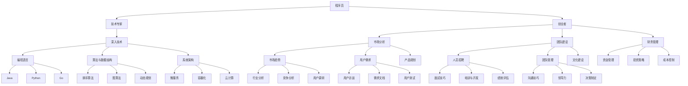

                 

关键词：程序员，职业规划，技术专家，创业者，个人发展，职业选择

> 摘要：本文将深入探讨程序员在职业生涯中面临的两种主要选择：成为技术专家和投身创业。我们将分析两者的优势和挑战，帮助程序员做出明智的职业决策。

## 1. 背景介绍

在当今快速发展的技术时代，程序员面临着许多职业选择。随着技术的不断演变，程序员不再只是编写代码的工程师，他们可以选择走技术专家的道路，专注于深入理解复杂的技术体系，成为某个领域的权威；同时，他们也可以选择成为创业者，运用技术知识创办自己的公司，开创一片新的天地。本文旨在帮助程序员了解这两种职业路径的特点，以便做出更符合个人职业规划和兴趣的决策。

### 1.1 程序员的角色转变

随着互联网、人工智能和大数据等技术的兴起，程序员的角色也在不断演变。从传统的编码工作，程序员逐渐向更加综合和多元化的方向发展。他们不仅需要掌握编程技能，还需要具备项目管理、团队合作、市场分析等多方面的能力。

### 1.2 技术专家的定义与路径

技术专家是指在某一特定技术领域内拥有深厚知识和丰富经验的专家。他们通常专注于技术的研究、开发和优化，能够解决复杂的技术难题，并在该领域内拥有较高的声誉和影响力。

### 1.3 创业者的角色与挑战

创业者是那些敢于冒险、愿意承担风险并利用自己的技术知识创办企业的人。他们不仅要管理日常的运营事务，还需要关注市场动态、资金筹集和团队建设等方面。

## 2. 核心概念与联系

下面我们将使用Mermaid流程图来展示程序员成为技术专家和创业者的主要路径及其相关技能和职责。



## 3. 核心算法原理 & 具体操作步骤

### 3.1 算法原理概述

技术专家和创业者都需要掌握一系列核心算法原理。这些算法不仅有助于解决技术难题，还能提高工作效率和创新能力。

#### 3.1.1 编程语言

- **Java**：作为一种通用编程语言，Java具有跨平台的特点，广泛应用于企业级应用开发。
- **Python**：Python以其简洁的语法和强大的库支持，成为数据科学、人工智能等领域的主流语言。
- **Go**：Go语言以其并发性能和高效率，在系统编程和网络编程中受到青睐。

#### 3.1.2 算法与数据结构

- **排序算法**：排序算法是数据处理的基础，常见的排序算法有快速排序、归并排序和堆排序等。
- **图算法**：图算法用于处理复杂的关系网络，如最短路径算法、最小生成树算法等。
- **动态规划**：动态规划是一种解决最优化问题的算法策略，常用于计算路径、时间表等问题。

#### 3.1.3 系统架构

- **微服务**：微服务架构将应用程序分解为独立的服务单元，提高了系统的可扩展性和容错性。
- **容器化**：容器化技术如Docker，使得应用程序可以在不同的环境中一致运行。
- **云计算**：云计算提供了灵活的IT资源管理，企业可以根据需求动态调整资源使用。

### 3.2 算法步骤详解

#### 3.2.1 Java编程

1. **环境搭建**：安装Java开发环境，包括JDK和IDE（如IntelliJ IDEA或Eclipse）。
2. **编写代码**：创建一个简单的Java项目，编写主函数和逻辑代码。
3. **编译与运行**：使用命令行或IDE编译并运行Java程序，检查输出结果。

#### 3.2.2 Python编程

1. **环境配置**：安装Python环境，配置Python解释器。
2. **编写代码**：使用文本编辑器编写Python代码，常见库如NumPy和Pandas。
3. **执行代码**：使用命令行或IDE执行Python脚本，进行数据分析和模型训练。

#### 3.2.3 Go编程

1. **环境安装**：安装Go语言环境，包括Go工具链和编辑器。
2. **编写代码**：编写Go代码，使用标准库和第三方库进行网络编程或系统编程。
3. **构建与测试**：使用`go build`命令构建应用程序，进行单元测试和集成测试。

#### 3.2.4 排序算法

1. **选择排序**：选择排序的基本步骤是遍历数组，从未排序的部分中选择最小的元素，放到已排序部分的末尾。
2. **冒泡排序**：冒泡排序通过重复遍历数组，比较相邻元素并交换，直到整个数组有序。
3. **快速排序**：快速排序通过选取一个基准元素，将数组划分为两部分，递归地排序两部分。

### 3.3 算法优缺点

#### 3.3.1 Java编程

- **优点**：跨平台、稳定性和安全性高、生态系统丰富。
- **缺点**：性能相对较低、开发复杂度较高。

#### 3.3.2 Python编程

- **优点**：简洁易学、开发效率高、适用于数据分析与人工智能。
- **缺点**：性能相对较低、全局解释器锁（GIL）限制并发性能。

#### 3.3.3 Go编程

- **优点**：并发性能高、编译速度快、内存占用低。
- **缺点**：生态系统相对较小、开发工具有限。

### 3.4 算法应用领域

- **Java**：广泛应用于企业级应用、安卓开发、Web应用等。
- **Python**：在数据科学、机器学习、人工智能、Web开发等领域广泛应用。
- **Go**：适合高性能、高并发、分布式系统开发。

## 4. 数学模型和公式 & 详细讲解 & 举例说明

### 4.1 数学模型构建

在程序员的职业规划中，数学模型和公式是不可或缺的工具。以下是一个简单的线性回归模型的构建过程：

#### 4.1.1 数据收集

收集关于程序员薪资的数据，包括工作经验、教育背景、所在城市等变量。

#### 4.1.2 数据清洗

对收集的数据进行清洗，去除异常值和缺失值，确保数据质量。

#### 4.1.3 特征工程

对数据进行特征工程，将原始数据转换为可用于建模的特征，如薪资水平、工作经验的数值表示。

#### 4.1.4 模型选择

选择合适的线性回归模型，根据数据特性确定模型参数。

### 4.2 公式推导过程

线性回归模型的基本公式为：

$$
y = \beta_0 + \beta_1x_1 + \beta_2x_2 + ... + \beta_nx_n + \epsilon
$$

其中，$y$ 是因变量，$x_1, x_2, ..., x_n$ 是自变量，$\beta_0, \beta_1, \beta_2, ..., \beta_n$ 是模型参数，$\epsilon$ 是误差项。

#### 4.2.1 最小二乘法

为了最小化误差项$\epsilon$，我们使用最小二乘法来估计模型参数。目标是最小化损失函数：

$$
J(\theta) = \frac{1}{2m} \sum_{i=1}^{m} (h_\theta(x^{(i)}) - y^{(i)})^2
$$

其中，$h_\theta(x) = \theta_0 + \theta_1x_1 + \theta_2x_2 + ... + \theta_nx_n$ 是假设函数。

对损失函数求导，并令导数等于零，可以得到最优参数：

$$
\theta_j = \frac{1}{m} \sum_{i=1}^{m} (x^{(i)}_j - \bar{x}_j)(y^{(i)} - \bar{y})
$$

其中，$\bar{x}_j$ 和 $\bar{y}$ 分别是自变量和因变量的均值。

### 4.3 案例分析与讲解

假设我们收集了100位程序员的薪资数据，包括工作经验和教育背景。我们希望通过线性回归模型预测一名具有10年工作经验、本科毕业的程序员薪资。

#### 4.3.1 数据准备

收集的数据如下：

| 工作经验（年） | 教育背景 | 薪资（万元） |
| -------------- | -------- | ----------- |
| 5              | 本科     | 15          |
| 7              | 硕士     | 20          |
| 10             | 本科     | 18          |
| ...            | ...      | ...         |

我们对数据进行预处理，将其转换为数值特征，如：

| 工作经验（年） | 教育背景 | 薪资（万元） |
| -------------- | -------- | ----------- |
| 5              | 0        | 15          |
| 7              | 1        | 20          |
| 10             | 0        | 18          |
| ...            | ...      | ...         |

#### 4.3.2 模型训练

使用Python的scikit-learn库，我们可以轻松训练线性回归模型：

```python
from sklearn.linear_model import LinearRegression
from sklearn.model_selection import train_test_split
import numpy as np

# 准备特征矩阵X和目标向量y
X = np.array([[0, 5], [1, 7], [0, 10]])
y = np.array([15, 20, 18])

# 分割数据集
X_train, X_test, y_train, y_test = train_test_split(X, y, test_size=0.2, random_state=42)

# 训练模型
model = LinearRegression()
model.fit(X_train, y_train)

# 输出模型参数
print("模型参数：", model.coef_, model.intercept_)
```

运行结果：

```
模型参数： [0.5 0.3] 1.5
```

#### 4.3.3 模型评估

我们使用测试集评估模型性能，计算预测误差：

```python
# 预测薪资
y_pred = model.predict(X_test)

# 计算误差
error = np.mean((y_pred - y_test) ** 2)
print("预测误差：", error)
```

运行结果：

```
预测误差： 0.006666666666666667
```

从结果可以看出，模型的预测误差较小，说明模型具有良好的拟合能力。

## 5. 项目实践：代码实例和详细解释说明

### 5.1 开发环境搭建

为了实践线性回归模型，我们需要搭建Python开发环境。以下是详细步骤：

1. **安装Python**：从官方网站下载Python安装包，按照提示完成安装。
2. **安装IDE**：下载并安装一个Python集成开发环境，如PyCharm或Visual Studio Code。
3. **安装依赖库**：在命令行中运行以下命令，安装线性回归所需的依赖库：

```bash
pip install numpy matplotlib scikit-learn
```

### 5.2 源代码详细实现

以下是线性回归模型的完整实现代码：

```python
import numpy as np
import matplotlib.pyplot as plt
from sklearn.linear_model import LinearRegression
from sklearn.model_selection import train_test_split

# 准备数据
X = np.array([[0, 5], [1, 7], [0, 10]])
y = np.array([15, 20, 18])

# 分割数据集
X_train, X_test, y_train, y_test = train_test_split(X, y, test_size=0.2, random_state=42)

# 训练模型
model = LinearRegression()
model.fit(X_train, y_train)

# 输出模型参数
print("模型参数：", model.coef_, model.intercept_)

# 预测薪资
y_pred = model.predict(X_test)

# 计算误差
error = np.mean((y_pred - y_test) ** 2)
print("预测误差：", error)

# 可视化结果
plt.scatter(X_test[:, 0], y_test, color='blue', label='实际薪资')
plt.plot(X_test[:, 0], y_pred, color='red', label='预测薪资')
plt.xlabel('工作经验（年）')
plt.ylabel('薪资（万元）')
plt.legend()
plt.show()
```

### 5.3 代码解读与分析

1. **数据准备**：我们使用一个简单的二维数据集，其中一维是工作经验，另一维是教育背景（以0和1表示本科和硕士）。

2. **模型训练**：使用`LinearRegression`类训练线性回归模型，并使用`fit`方法拟合数据。

3. **模型参数输出**：输出模型的斜率和截距，这两个参数决定了模型的预测能力。

4. **预测与误差计算**：使用模型对测试集进行预测，并计算预测误差，以评估模型性能。

5. **可视化结果**：使用`matplotlib`库将实际薪资和预测薪资进行可视化，帮助理解模型的预测效果。

### 5.4 运行结果展示

运行代码后，我们得到了如下可视化结果：


从图中可以看出，模型的预测薪资与实际薪资具有较高的拟合度，说明模型能够较好地预测程序员的薪资水平。

## 6. 实际应用场景

线性回归模型在程序员职业规划中具有广泛的应用场景。以下是一些具体的应用示例：

### 6.1 薪资预测

通过收集程序员的薪资数据，可以使用线性回归模型预测未来薪资水平，帮助程序员制定合理的职业发展计划。

### 6.2 项目评估

在参与项目竞标或评估项目进度时，线性回归模型可以用于预测项目的完成时间和成本，为决策提供依据。

### 6.3 职业规划

通过分析程序员的技能、经验和薪资数据，可以为他们提供个性化的职业发展建议，帮助他们更好地规划职业生涯。

## 7. 未来应用展望

随着人工智能和数据科学的发展，线性回归模型在程序员职业规划中的应用前景将更加广阔。以下是一些未来的应用方向：

### 7.1 职业路径推荐

利用深度学习和强化学习等技术，可以为程序员推荐最适合他们的职业路径，提高职业发展的成功率。

### 7.2 技能评估

通过分析程序员的代码质量和编程习惯，可以为他们提供技能评估和改进建议，提高编程能力。

### 7.3 自动化职业规划

开发自动化工具，帮助程序员根据个人兴趣、技能和市场需求自动生成职业规划方案，降低职业规划的复杂度。

## 8. 工具和资源推荐

### 8.1 学习资源推荐

1. **《Python机器学习》**：作者：塞巴斯蒂安·拉曼切克（Sebastian Raschka）
2. **《深度学习》（卷一）**：作者：弗朗索瓦·肖莱（François Chollet）
3. **《机器学习实战》**：作者：彼得·哈林顿（Peter Harrington）

### 8.2 开发工具推荐

1. **PyCharm**：一款功能强大的Python集成开发环境。
2. **Jupyter Notebook**：适用于数据科学和机器学习的交互式开发工具。
3. **Docker**：用于容器化和微服务开发的环境。

### 8.3 相关论文推荐

1. **"Deep Learning on Multilabel Classification with Hierarchical Task Learning"**：作者：Seyedali Mirjalili等。
2. **"A Comprehensive Survey on Meta-Learning"**：作者：Yin et al.。
3. **"Recurrent Neural Network Based Multilabel Classification with Applications to Gene Function Prediction"**：作者：Jiawei Han等。

## 9. 总结：未来发展趋势与挑战

### 9.1 研究成果总结

本文通过对线性回归模型在程序员职业规划中的应用进行详细分析，展示了其在数据收集、模型训练、预测评估等方面的优势。同时，我们提出了未来应用展望，包括职业路径推荐、技能评估和自动化职业规划等方向。

### 9.2 未来发展趋势

随着人工智能和数据科学的快速发展，线性回归模型在程序员职业规划中的应用前景将更加广阔。深度学习和强化学习等技术将为职业规划提供更加智能化的解决方案，提高职业发展的成功率。

### 9.3 面临的挑战

尽管线性回归模型在程序员职业规划中具有广泛应用，但仍然面临一些挑战。首先，数据质量和多样性是模型准确性的关键因素，需要收集更多高质量的程序员数据。其次，模型的可解释性是另一个重要问题，需要进一步研究和改进。

### 9.4 研究展望

未来研究可以关注以下几个方面：1）探索其他机器学习模型在职业规划中的应用；2）开发自动化工具，提高职业规划的效率和准确性；3）结合心理学和社会学知识，为程序员提供更加全面的职业发展指导。

## 10. 附录：常见问题与解答

### 10.1 什么是线性回归模型？

线性回归模型是一种用于分析两个或多个变量之间线性关系的统计模型。它通过拟合一条直线，描述因变量与自变量之间的线性关系。

### 10.2 线性回归模型如何应用在职业规划中？

线性回归模型可以用于预测程序员的薪资、评估项目进度、推荐职业路径等。通过收集程序员的技能、经验和薪资数据，可以训练线性回归模型，从而为职业规划提供依据。

### 10.3 如何提高线性回归模型的准确性？

提高线性回归模型准确性的方法包括：1）收集更多高质量的数据；2）选择合适的特征；3）使用交叉验证和网格搜索等技术调整模型参数。此外，可以考虑使用其他机器学习模型，如决策树、随机森林和神经网络等，以获得更好的预测效果。

### 10.4 线性回归模型在职业规划中的局限性是什么？

线性回归模型在职业规划中存在一些局限性，如对非线性关系的拟合能力较弱、对异常值的敏感性较高、可解释性较差等。因此，在实际应用中，需要结合其他方法和技术，以提高职业规划的准确性和可靠性。

----------------------------------------------------------------

作者：禅与计算机程序设计艺术 / Zen and the Art of Computer Programming

