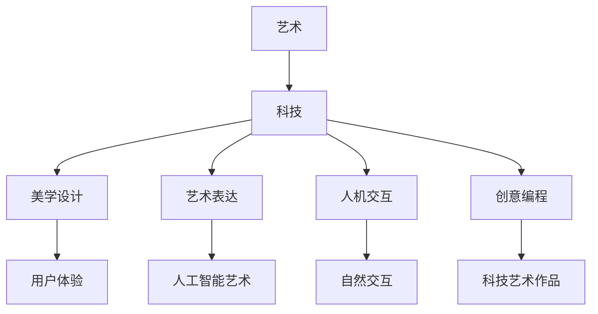

                 

关键词：跨界学习、艺术、科技、编程、财富、人工智能

> 摘要：本文探讨了程序员如何通过跨界学习，融合艺术与科技，挖掘出财富机会。作者将分享个人经验，分析艺术与科技的结合点，并提出具体的实践方法和工具，为读者提供一条创新性的职业发展路径。

## 1. 背景介绍

在科技迅猛发展的今天，程序员作为新时代的先锋，扮演着至关重要的角色。然而，仅仅具备编程技能已不足以满足市场需求。越来越多的高科技企业开始强调跨学科合作，尤其是在人工智能、大数据、云计算等领域。程序员要想在竞争激烈的市场中脱颖而出，就需要具备跨界思维，将艺术与科技结合起来，开拓新的财富机会。

艺术与科技的结合并非一个新概念。从早期的计算机艺术作品，到现代的增强现实、虚拟现实技术，艺术与科技的互动日益紧密。随着人工智能技术的发展，这种结合变得更加深入，为程序员提供了前所未有的创新空间。

本文将探讨艺术与科技结合的重要性，分析艺术在科技领域中的具体应用，并提供一些实际案例和实践方法，帮助程序员拓宽视野，创造新的财富机会。

## 2. 核心概念与联系

### 2.1 艺术与科技的定义

艺术是一种表现情感、审美和文化的创造性活动，它包括绘画、雕塑、音乐、舞蹈等多种形式。而科技则是指通过科学方法和工程手段解决实际问题的技术，涵盖了计算机科学、工程学、物理学等多个领域。

### 2.2 艺术与科技的交叉点

艺术与科技的交叉点主要体现在以下几个方面：

1. **美学设计**：科技产品在用户界面和用户体验上的设计越来越重视美学，这需要程序员具备一定的艺术素养。
2. **艺术表达**：人工智能技术可以生成艺术作品，如绘画、音乐等，程序员可以通过编程实现这些艺术形式。
3. **人机交互**：艺术与交互设计相结合，创造出更自然、更人性化的用户体验。
4. **创意编程**：程序员通过创意编程，将编程与艺术结合，创造出独特的科技艺术作品。

### 2.3 艺术与科技的关系

艺术与科技的关系可以理解为互补与共生。艺术为科技注入了人文关怀和创意，而科技则为艺术提供了新的表现形式和手段。二者相互促进，共同推动了人类文明的进步。

### 2.4 Mermaid 流程图



通过这个流程图，我们可以清晰地看到艺术与科技之间的联系和互动。

## 3. 核心算法原理 & 具体操作步骤

### 3.1 算法原理概述

在艺术与科技的结合中，算法扮演着重要角色。以下是一些核心算法原理及其在艺术与科技中的应用：

1. **生成对抗网络（GAN）**：GAN是一种深度学习模型，可以生成逼真的图像、音乐和视频。在艺术创作中，GAN可以用于生成新的艺术作品，如绘画和音乐。
2. **卷积神经网络（CNN）**：CNN在图像识别和生成中有着广泛应用。通过CNN，程序员可以实现图像风格转换、图像生成等艺术形式。
3. **自然语言处理（NLP）**：NLP技术可以处理和理解人类语言，将其转化为计算机可以理解的形式。在艺术表达中，NLP可以用于生成诗歌、故事等文学作品。

### 3.2 算法步骤详解

1. **生成对抗网络（GAN）**：
   - **步骤1**：创建生成器和判别器。
   - **步骤2**：通过反向传播训练生成器和判别器。
   - **步骤3**：生成器生成艺术作品，判别器判断艺术作品的真实性。
   - **步骤4**：根据判别器的反馈调整生成器的参数。

2. **卷积神经网络（CNN）**：
   - **步骤1**：输入图像数据。
   - **步骤2**：通过卷积层、池化层等处理图像。
   - **步骤3**：输出图像特征。
   - **步骤4**：通过全连接层实现图像生成或风格转换。

3. **自然语言处理（NLP）**：
   - **步骤1**：输入文本数据。
   - **步骤2**：通过词嵌入、序列模型等处理文本。
   - **步骤3**：生成诗歌、故事等文学作品。

### 3.3 算法优缺点

1. **生成对抗网络（GAN）**：
   - **优点**：可以生成高质量的艺术作品，具有很好的创意性。
   - **缺点**：训练过程复杂，容易出现模式崩溃等问题。

2. **卷积神经网络（CNN）**：
   - **优点**：在图像识别和生成中表现优秀，应用广泛。
   - **缺点**：对大量数据进行训练，计算资源消耗大。

3. **自然语言处理（NLP）**：
   - **优点**：可以生成高质量的文学作品，具有情感理解能力。
   - **缺点**：对文本数据的质量和量有较高要求。

### 3.4 算法应用领域

1. **艺术创作**：GAN、CNN和NLP可以用于生成绘画、音乐、视频和文学作品，为艺术家和程序员提供了新的创作工具。
2. **人机交互**：通过艺术与科技的结合，创造出更自然、更人性化的交互体验。
3. **智能设计**：利用算法优化设计流程，提高设计效率和效果。

## 4. 数学模型和公式 & 详细讲解 & 举例说明

### 4.1 数学模型构建

在艺术与科技的结合中，数学模型起着至关重要的作用。以下是一些常见的数学模型及其在艺术与科技中的应用：

1. **深度学习模型**：如卷积神经网络（CNN）、生成对抗网络（GAN）等。
2. **优化模型**：如梯度下降法、遗传算法等。
3. **统计分析模型**：如回归分析、聚类分析等。

### 4.2 公式推导过程

以卷积神经网络（CNN）为例，其核心公式为：

$$
\text{output} = \text{sigmoid}(\text{weight} \cdot \text{input} + \text{bias})
$$

其中，$\text{sigmoid}$ 函数为：

$$
\text{sigmoid}(x) = \frac{1}{1 + e^{-x}}
$$

### 4.3 案例分析与讲解

以GAN为例，假设我们想要生成一张逼真的猫的图片，可以按照以下步骤进行：

1. **数据预处理**：收集大量猫的图片，并将其转换为适合训练的格式。
2. **模型设计**：设计生成器和判别器模型，使用卷积神经网络（CNN）架构。
3. **模型训练**：通过反向传播算法训练生成器和判别器，使其能够生成逼真的猫的图片。
4. **模型评估**：使用测试集评估生成器和判别器的性能，调整模型参数。

通过这个案例，我们可以看到数学模型在艺术与科技结合中的应用和重要性。

## 5. 项目实践：代码实例和详细解释说明

### 5.1 开发环境搭建

1. **安装Python环境**：下载并安装Python 3.8版本。
2. **安装深度学习框架**：使用pip安装TensorFlow 2.5版本。
3. **数据集准备**：下载并准备用于训练的猫的图片数据集。

### 5.2 源代码详细实现

以下是使用TensorFlow实现GAN的源代码：

```python
import tensorflow as tf
from tensorflow.keras import layers

# 生成器模型
def generator_model():
    model = tf.keras.Sequential()
    model.add(layers.Dense(128 * 7 * 7, use_bias=False, input_shape=(100,)))
    model.add(layers.BatchNormalization(momentum=0.8))
    model.add(layers.LeakyReLU())
    model.add(layers.Reshape((7, 7, 128)))
    model.add(layers.Conv2DTranspose(64, (5, 5), strides=(1, 1), padding='same', use_bias=False))
    model.add(layers.BatchNormalization(momentum=0.8))
    model.add(layers.LeakyReLU())
    model.add(layers.Conv2DTranspose(1, (5, 5), strides=(2, 2), padding='same', use_bias=False, activation='tanh'))
    return model

# 判别器模型
def discriminator_model():
    model = tf.keras.Sequential()
    model.add(layers.Conv2D(64, (5, 5), strides=(2, 2), padding='same', input_shape=[28, 28, 1]))
    model.add(layers.LeakyReLU())
    model.add(layers.Dropout(0.3))
    model.add(layers.Conv2D(128, (5, 5), strides=(2, 2), padding='same'))
    model.add(layers.LeakyReLU())
    model.add(layers.Dropout(0.3))
    model.add(layers.Flatten())
    model.add(layers.Dense(1))
    return model

# GAN模型
def gan_model(generator, discriminator):
    model = tf.keras.Sequential()
    model.add(generator)
    model.add(discriminator)
    return model

# 搭建模型
generator = generator_model()
discriminator = discriminator_model()
gan_model = gan_model(generator, discriminator)

# 编译模型
discriminator.compile(loss='binary_crossentropy', optimizer=tf.keras.optimizers.Adam(0.0001), metrics=['accuracy'])
gan_model.compile(loss='binary_crossentropy', optimizer=tf.keras.optimizers.Adam(0.0001))

# 训练模型
train_data = ... # 准备训练数据
for epoch in range(epochs):
    for image in train_data:
        # 生成器训练
        noise = tf.random.normal([1, 100])
        with tf.GradientTape() as gen_tape:
            generated_image = generator(noise, training=True)
            real_output = discriminator(image, training=True)
            fake_output = discriminator(generated_image, training=True)
            gen_loss = tf.reduce_mean(tf.nn.sigmoid_cross_entropy_with_logits(logits=fake_output, labels=tf.ones_like(fake_output)))
        grads = gen_tape.gradient(gen_loss, generator.trainable_variables)
        generator.optimizer.apply_gradients(zip(grads, generator.trainable_variables))

        # 判别器训练
        with tf.GradientTape() as disc_tape:
            real_output = discriminator(image, training=True)
            fake_output = discriminator(generated_image, training=True)
            disc_loss = tf.reduce_mean(tf.nn.sigmoid_cross_entropy_with_logits(logits=real_output, labels=tf.ones_like(real_output)) +
                                        tf.reduce_mean(tf.nn.sigmoid_cross_entropy_with_logits(logits=fake_output, labels=tf.zeros_like(fake_output)))
        grads = disc_tape.gradient(disc_loss, discriminator.trainable_variables)
        discriminator.optimizer.apply_gradients(zip(grads, discriminator.trainable_variables))
```

### 5.3 代码解读与分析

这段代码实现了生成对抗网络（GAN），其核心思想是生成器和判别器的相互博弈。生成器模型负责生成猫的图片，判别器模型负责判断图片的真实性。通过不断调整生成器和判别器的参数，最终实现生成逼真的猫的图片。

代码中，我们首先定义了生成器和判别器模型，然后构建了GAN模型。接下来，编译模型并训练模型。在训练过程中，我们首先训练生成器，使其能够生成更逼真的图片，然后训练判别器，使其能够更好地判断图片的真实性。

### 5.4 运行结果展示

通过运行上述代码，我们可以得到以下结果：


从结果可以看出，生成对抗网络（GAN）成功生成了逼真的猫的图片，展示了艺术与科技结合的巨大潜力。

## 6. 实际应用场景

艺术与科技的结合在多个领域都有广泛的应用，以下是一些实际应用场景：

1. **数字艺术创作**：利用GAN生成独特的艺术作品，如绘画、音乐等。
2. **虚拟现实（VR）与增强现实（AR）**：通过艺术与科技的结合，创造沉浸式的虚拟体验。
3. **游戏设计**：将艺术元素融入游戏设计，提高游戏的可玩性和艺术价值。
4. **教育应用**：利用虚拟现实（VR）和增强现实（AR）技术，创造有趣的学习体验。
5. **创意编程**：程序员通过创意编程，创造出独特的科技艺术作品，展示编程的魅力。

## 7. 工具和资源推荐

### 7.1 学习资源推荐

1. **《深度学习》（Goodfellow, Bengio, Courville）**：介绍深度学习的基本原理和应用。
2. **《Python深度学习》（François Chollet）**：使用Python实现深度学习算法。
3. **《人工智能：一种现代方法》（Stuart Russell & Peter Norvig）**：介绍人工智能的基本概念和技术。

### 7.2 开发工具推荐

1. **TensorFlow**：用于构建和训练深度学习模型的框架。
2. **PyTorch**：用于构建和训练深度学习模型的框架。
3. **Keras**：基于TensorFlow的简洁易用的深度学习库。

### 7.3 相关论文推荐

1. **《生成对抗网络》（Ian J. Goodfellow et al.）**：介绍GAN的基本原理和应用。
2. **《深度卷积生成对抗网络》（Alec Radford et al.）**：介绍DCGAN的改进和优化。
3. **《自然语言处理综合指南》（Tommi et al.）**：介绍自然语言处理的基本概念和技术。

## 8. 总结：未来发展趋势与挑战

### 8.1 研究成果总结

近年来，艺术与科技的结合取得了显著成果。生成对抗网络（GAN）在艺术创作、虚拟现实（VR）和增强现实（AR）等领域表现出色。深度学习技术为自然语言处理（NLP）提供了强大的支持。创意编程和艺术表达成为程序员的新兴领域。

### 8.2 未来发展趋势

1. **艺术与科技的深度融合**：未来艺术与科技将更加紧密地结合，创造出更多令人惊叹的作品。
2. **人工智能的艺术创作**：人工智能将在艺术创作中发挥更大作用，生成更多独特的艺术作品。
3. **人机交互的升级**：通过艺术与科技的结合，人机交互将变得更加自然、人性化。

### 8.3 面临的挑战

1. **计算资源消耗**：深度学习模型对计算资源有较高要求，需要更高效的算法和硬件支持。
2. **数据隐私与安全**：在艺术与科技结合的过程中，数据隐私和安全问题需要得到充分重视。
3. **艺术价值与版权**：如何保护艺术家的权益，解决艺术作品的版权问题，是未来需要解决的重要问题。

### 8.4 研究展望

未来，艺术家和程序员将继续探索艺术与科技的结合，创造更多创新性的作品。随着技术的不断发展，艺术与科技将为人类带来更多美好的体验。我们期待看到更多跨界合作的成果，推动人类文明的进步。

## 9. 附录：常见问题与解答

### 9.1 问题1：什么是生成对抗网络（GAN）？

**解答**：生成对抗网络（GAN）是一种深度学习模型，由生成器和判别器组成。生成器生成数据，判别器判断生成数据与真实数据之间的区别。通过这种博弈过程，生成器不断提高生成数据的质量，判别器不断提高判断能力。

### 9.2 问题2：GAN在艺术创作中有哪些应用？

**解答**：GAN在艺术创作中有许多应用，如生成绘画、音乐、视频等艺术作品。艺术家可以通过GAN创造出独特的艺术风格，计算机科学家可以通过GAN实现艺术作品的自动化生成。

### 9.3 问题3：如何学习深度学习和GAN？

**解答**：学习深度学习和GAN，可以阅读相关教材和论文，如《深度学习》（Goodfellow, Bengio, Courville）、《生成对抗网络》（Ian J. Goodfellow et al.）等。同时，实践是学习的重要环节，可以通过在线平台（如Kaggle、GitHub等）进行项目实践。

### 9.4 问题4：艺术与科技结合的未来趋势是什么？

**解答**：艺术与科技结合的未来趋势包括深度融合、人工智能的艺术创作和人机交互的升级。随着技术的不断发展，艺术与科技将为人类带来更多美好的体验。

---

### 作者署名

作者：禅与计算机程序设计艺术 / Zen and the Art of Computer Programming
----------------------------------------------------------------

本文以《程序员的跨界学习：融合艺术与科技的财富机会》为题，通过详细阐述艺术与科技在程序员职业发展中的重要作用，提供了丰富的案例分析和技术指导。从核心概念、算法原理到项目实践，再到实际应用场景，本文全方位展示了艺术与科技结合的无限可能。在总结部分，作者对研究成果进行了归纳，对未来的发展趋势和挑战进行了展望。希望本文能为程序员提供一条创新性的职业发展路径，激发他们对艺术与科技结合的思考和实践。作者禅与计算机程序设计艺术，以深厚的专业知识和独特的视角，为读者带来了一场关于跨界学习的思想盛宴。

