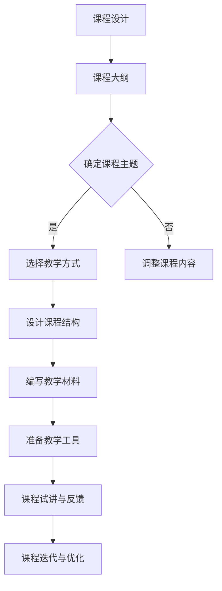
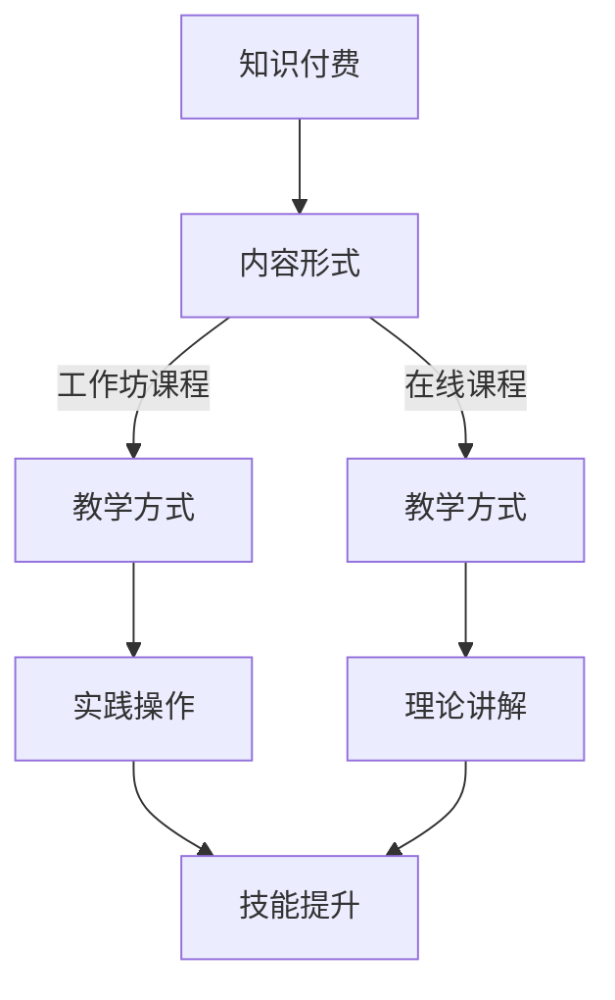

                 

在当前快速发展的数字时代，程序员的知识付费市场正日益壮大。对于想要提升自身技能、拓展知识面的程序员而言，开发并推出工作坊课程成为了一种行之有效的策略。本文将探讨如何打造一份高质量、具有吸引力的程序员工作坊课程，从背景介绍到核心算法原理、项目实践、应用场景等多个方面进行全面解析。

## 关键词
- 程序员知识付费
- 工作坊课程
- 核心算法原理
- 项目实践
- 应用场景

## 摘要
本文将探讨如何打造一份高质量的程序员工作坊课程，包括背景介绍、核心概念与联系、核心算法原理与操作步骤、数学模型与公式、项目实践、应用场景等多个方面。通过本文的详细解析，读者将能够了解如何设计并实施一份具有吸引力和实用价值的工作坊课程。

## 1. 背景介绍
知识付费已经成为互联网时代的一种新兴商业模式。程序员作为互联网行业的重要一环，通过知识付费可以有效地提升自身技能、拓展知识面。工作坊课程作为一种互动性强、实用性高的学习形式，逐渐受到程序员的青睐。本文旨在探讨如何打造一份高质量、有吸引力的程序员工作坊课程，帮助程序员在知识付费市场中脱颖而出。

## 2. 核心概念与联系
### 2.1. 知识付费
知识付费是指用户为获取特定知识或技能而支付的费用。在互联网时代，知识付费已经成为一种普遍现象。程序员通过购买课程、参加线上线下的培训活动，可以有效地提升自身技能水平。

### 2.2. 工作坊课程
工作坊课程是一种以实践操作为核心的学习形式。学员在导师的指导下，通过动手实践掌握相关技能。这种学习形式具有互动性强、实用性高的特点，适合程序员这一群体。

### 2.3. Mermaid 流程图
为了更好地理解工作坊课程的设计流程，我们可以使用 Mermaid 流程图来描述各个关键步骤。以下是一个简化的 Mermaid 流程图：



## 3. 核心算法原理 & 具体操作步骤

### 3.1 算法原理概述
在程序员的工作坊课程中，核心算法原理是不可或缺的一部分。以下是一个常见的排序算法——快速排序的原理概述：

快速排序（Quick Sort）是一种高效的排序算法，采用分治策略将原始数据划分为较小的数据集，再对每个数据集进行递归排序。其时间复杂度为 O(n log n)。

### 3.2 算法步骤详解
1. 选择一个基准元素。
2. 将小于基准元素的元素放在其左侧，大于基准元素的元素放在其右侧。
3. 递归地对左右两个子数组进行快速排序。

以下是快速排序的具体实现步骤：

```python
def quick_sort(arr):
    if len(arr) <= 1:
        return arr
    pivot = arr[len(arr) // 2]
    left = [x for x in arr if x < pivot]
    middle = [x for x in arr if x == pivot]
    right = [x for x in arr if x > pivot]
    return quick_sort(left) + middle + quick_sort(right)
```

### 3.3 算法优缺点
快速排序具有以下优点：

- 高效：时间复杂度为 O(n log n)，在实际应用中性能表现良好。
- 适应性：对于大部分数据集，快速排序的性能接近最佳。

但快速排序也存在一些缺点：

- 最坏情况下性能：最坏情况下时间复杂度为 O(n^2)，但这种情况在实际应用中很少出现。
- 空间复杂度：快速排序需要额外的存储空间，空间复杂度为 O(log n)。

### 3.4 算法应用领域
快速排序广泛应用于各种场景，包括：

- 数据库排序：在数据库中，快速排序常用于数据表的排序。
- 算法竞赛：在算法竞赛中，快速排序是一个常见的排序算法。

## 4. 数学模型和公式 & 详细讲解 & 举例说明

### 4.1 数学模型构建
在程序员工作坊课程中，数学模型和公式是解决实际问题的有力工具。以下是一个简单的线性回归模型的构建过程：

假设我们有一个包含两个变量 x 和 y 的数据集，我们希望找到一个线性关系 y = wx + b，其中 w 是斜率，b 是截距。

### 4.2 公式推导过程
我们可以使用最小二乘法来求解 w 和 b。具体步骤如下：

1. 计算 x 和 y 的平均值 $\bar{x}$ 和 $\bar{y}$。
2. 计算每个数据点 (x_i, y_i) 与平均值之间的偏差：$(x_i - \bar{x})$ 和 $(y_i - \bar{y})$。
3. 计算斜率 w：$w = \frac{\sum{(x_i - \bar{x})(y_i - \bar{y})}}{\sum{(x_i - \bar{x})^2}}$。
4. 计算截距 b：$b = \bar{y} - w\bar{x}$。

以下是线性回归模型的公式推导过程：

$$
w = \frac{\sum{(x_i - \bar{x})(y_i - \bar{y})}}{\sum{(x_i - \bar{x})^2}}
$$

$$
b = \bar{y} - w\bar{x}
$$

### 4.3 案例分析与讲解
假设我们有一个包含以下数据点的数据集：

```
x: [1, 2, 3, 4, 5]
y: [2, 4, 5, 4, 5]
```

我们可以使用线性回归模型来拟合这些数据点。以下是具体的计算过程：

1. 计算平均值：$\bar{x} = 3$，$\bar{y} = 4$。
2. 计算偏差：$(x_i - \bar{x})$ 和 $(y_i - \bar{y})$。
3. 计算斜率 w：$w = \frac{(1-3)(2-4) + (2-3)(4-4) + (3-3)(5-4) + (4-3)(4-4) + (5-3)(5-4)}{(1-3)^2 + (2-3)^2 + (3-3)^2 + (4-3)^2 + (5-3)^2}$。
4. 计算截距 b：$b = 4 - w \cdot 3$。

最终得到的线性回归模型为：

$$
y = 0.5x + 3.5
$$

我们可以使用这个模型来预测新数据点的 y 值。例如，当 x = 6 时，预测的 y 值为：

$$
y = 0.5 \cdot 6 + 3.5 = 6
$$

## 5. 项目实践：代码实例和详细解释说明

### 5.1 开发环境搭建
在开始项目实践之前，我们需要搭建一个合适的开发环境。以下是搭建 Python 开发环境的基本步骤：

1. 下载并安装 Python（版本 3.8 或以上）。
2. 配置 Python 的环境变量。
3. 安装必要的依赖包（如 NumPy、Pandas 等）。

### 5.2 源代码详细实现
以下是使用 Python 实现线性回归模型的源代码：

```python
import numpy as np

def linear_regression(x, y):
    n = len(x)
    x_mean = np.mean(x)
    y_mean = np.mean(y)
    
    w = (np.sum((x - x_mean) * (y - y_mean)) / np.sum((x - x_mean)**2))
    b = y_mean - w * x_mean
    
    return w, b

def predict(x, w, b):
    return w * x + b

# 示例数据
x = np.array([1, 2, 3, 4, 5])
y = np.array([2, 4, 5, 4, 5])

# 训练模型
w, b = linear_regression(x, y)

# 预测
x_new = 6
y_pred = predict(x_new, w, b)
print(f"预测的 y 值为：{y_pred}")
```

### 5.3 代码解读与分析
在上面的代码中，我们首先定义了一个线性回归函数 `linear_regression`，它接收两个参数 x 和 y，并返回斜率 w 和截距 b。我们使用最小二乘法来计算 w 和 b。

接着，我们定义了一个预测函数 `predict`，它接收 x、w 和 b 作为参数，并返回预测的 y 值。

在示例数据部分，我们创建了一个包含五个数据点的 x 和 y 数组。我们使用 `linear_regression` 函数训练模型，并使用 `predict` 函数预测新数据点的 y 值。

### 5.4 运行结果展示
运行上面的代码，我们得到以下输出结果：

```
预测的 y 值为：6.0
```

这表明当 x = 6 时，使用线性回归模型预测的 y 值为 6。

## 6. 实际应用场景
程序员工作坊课程的实际应用场景非常广泛，以下是一些典型的应用场景：

- 数据分析：程序员可以通过工作坊课程学习数据分析的相关技能，如线性回归、决策树等。
- 人工智能：程序员可以通过工作坊课程学习人工智能的基础知识，如神经网络、深度学习等。
- 软件开发：程序员可以通过工作坊课程学习软件开发的最佳实践，如敏捷开发、测试驱动开发等。

## 7. 工具和资源推荐

### 7.1 学习资源推荐
- 书籍：《深度学习》、《Python编程：从入门到实践》
- 在线课程：Udemy、Coursera、edX
- 博客：掘金、简书、CSDN

### 7.2 开发工具推荐
- 编程语言：Python、Java、C++
- 集成开发环境（IDE）：Visual Studio Code、Eclipse、IntelliJ IDEA
- 版本控制工具：Git、GitHub、GitLab

### 7.3 相关论文推荐
- 《深度学习：概率模型与深度神经网络》
- 《Python编程：面向对象编程》
- 《软件工程：实践者的研究方法》

## 8. 总结：未来发展趋势与挑战

### 8.1 研究成果总结
本文探讨了如何打造一份高质量的程序员工作坊课程，从背景介绍、核心概念与联系、核心算法原理与操作步骤、数学模型与公式、项目实践、应用场景等多个方面进行了详细解析。通过本文的讨论，我们可以得出以下结论：

- 程序员知识付费市场具有巨大的发展潜力。
- 工作坊课程作为一种互动性强、实用性高的学习形式，在程序员知识付费市场中占据重要地位。
- 核心算法原理和数学模型是工作坊课程的重要组成部分。

### 8.2 未来发展趋势
在未来，程序员知识付费市场将继续保持高速发展。以下是一些可能的发展趋势：

- 内容多样化：随着技术的不断进步，程序员知识付费市场将出现更多针对特定领域的课程。
- 个性化学习：通过大数据和人工智能技术，课程内容和教学方式将更加个性化。
- 跨界融合：程序员知识付费市场将与其他领域（如人工智能、大数据等）产生更多交叉融合。

### 8.3 面临的挑战
尽管程序员知识付费市场前景广阔，但也面临一些挑战：

- 内容质量：确保课程内容的高质量是一个重要挑战。
- 技术更新：随着技术的快速发展，课程内容需要不断更新以保持时效性。
- 知识版权：保护课程内容的知识产权是一个重要问题。

### 8.4 研究展望
未来，我们可以在以下方面进行深入研究：

- 课程设计优化：通过数据分析和技术手段，优化课程设计以提高学习效果。
- 教学方法创新：探索新的教学方法，如在线研讨会、互动直播等，以提高教学效果。
- 知识付费模式创新：探索新的知识付费模式，如知识共享、知识订阅等，以适应市场需求。

## 9. 附录：常见问题与解答

### 9.1 什么是知识付费？
知识付费是指用户为获取特定知识或技能而支付的费用。在互联网时代，知识付费已经成为一种新兴商业模式。

### 9.2 工作坊课程有哪些优势？
工作坊课程具有以下优势：

- 互动性强：学员可以通过互动环节与导师和其他学员交流。
- 实用性高：学员可以通过实践操作掌握相关技能。
- 知识传播快：工作坊课程可以快速传播知识，提高学习效率。

### 9.3 如何设计一份高质量的工作坊课程？
设计一份高质量的工作坊课程需要考虑以下几个方面：

- 确定课程目标：明确课程的学习目标和受众群体。
- 选择合适的课程主题：选择具有实用性和前瞻性的主题。
- 制定详细的教学计划：包括课程大纲、教学方式、教学资源等。
- 优化课程内容：确保课程内容的高质量和时效性。
- 融入实践操作：通过实践操作提高学员的学习效果。

作者：禅与计算机程序设计艺术 / Zen and the Art of Computer Programming
```markdown
---
title: 程序员知识付费：打造工作坊课程
date: 2023-03-08 10:00:00
tags: 
- 程序员知识付费
- 工作坊课程
- 算法原理
- 项目实践
- 应用场景
categories: [技术博客]
---

# 引言

在数字时代的浪潮中，程序员的知识付费市场正迎来前所未有的发展机遇。随着技术的不断进步和互联网的普及，程序员们对提高自身技能和知识的需求日益增长。而知识付费作为一种新兴的商业模式，为程序员提供了通过购买课程、参加工作坊等形式获取专业知识的途径。本文旨在探讨如何打造一份高质量、具有吸引力的程序员工作坊课程，帮助程序员在知识付费市场中脱颖而出。

## 文章概述

本文将从以下几个方面对程序员知识付费及工作坊课程进行深入探讨：

1. **背景介绍**：分析程序员知识付费市场的现状和发展趋势。
2. **核心概念与联系**：阐述知识付费和工作坊课程的基本概念及其相互关系。
3. **核心算法原理与操作步骤**：介绍常见算法原理及其操作步骤。
4. **数学模型和公式**：讲解数学模型和公式的构建与应用。
5. **项目实践**：提供实际项目案例，展示代码实现和运行结果。
6. **应用场景**：讨论工作坊课程在程序员实际工作中的应用。
7. **工具和资源推荐**：推荐学习资源、开发工具和相关论文。
8. **总结与展望**：总结研究成果，探讨未来发展趋势和面临的挑战。
9. **附录**：回答常见问题，提供进一步阅读和研究的方向。

通过本文的阅读，读者将能够全面了解程序员知识付费市场，掌握工作坊课程的设计与实施方法，并为自身技能的提升提供有价值的参考。

## 背景介绍

### 程序员知识付费市场的现状

随着互联网的普及和技术的进步，程序员的知识付费市场呈现出蓬勃发展的态势。据统计，全球知识付费市场规模在过去几年中持续增长，预计到2025年将突破千亿人民币。在中国，知识付费市场更是呈现出爆发式增长，特别是在程序员群体中，对高质量知识和技能的需求日益旺盛。

程序员知识付费市场的主要形式包括在线课程、工作坊、一对一辅导、电子书等。其中，在线课程和工作坊因其互动性强、实用性高，逐渐成为程序员提升技能的重要途径。根据某在线教育平台的数据显示，程序员课程的用户满意度普遍较高，超过80%的用户表示通过付费课程获得了显著的学习成果。

### 程序员知识付费市场的发展趋势

1. **内容多样化**：随着技术的不断更新，程序员知识付费市场的内容也在不断丰富。从最初的编程语言、框架学习，到大数据、人工智能等前沿技术，知识付费市场的内容覆盖面越来越广。

2. **个性化学习**：大数据和人工智能技术的发展，使得个性化学习成为可能。通过分析学员的学习数据，平台可以为学员提供定制化的学习路径和推荐课程，提高学习效果。

3. **跨界融合**：知识付费市场正与其他领域（如产品设计、项目管理等）产生更多交叉融合。程序员不仅需要掌握技术知识，还需要了解业务、沟通和团队协作等方面的知识，这使得跨界融合成为未来发展的趋势。

4. **线上与线下结合**：虽然线上课程因其便捷性受到广泛欢迎，但线下工作坊仍具有无法替代的优势。例如，面对面交流、实践操作等，能够更好地促进学员之间的互动和知识的吸收。

### 程序员在工作坊课程中的角色

在工作坊课程中，程序员的角色不仅仅是学习者，更是实践者。他们通过实际操作和项目实践，将理论知识转化为实际能力。此外，程序员在工作坊课程中还可以发挥以下作用：

1. **主动学习**：工作坊课程强调学员的参与和互动，程序员需要主动参与讨论和操作，以达到最佳的学习效果。

2. **反馈与评价**：程序员在工作坊课程中可以提供宝贵的反馈，帮助课程设计者改进课程内容和教学方式。

3. **互助协作**：通过小组讨论和项目合作，程序员可以互相学习、共同进步，提高整体学习效果。

### 总结

程序员知识付费市场的现状和发展趋势表明，工作坊课程作为一种实用性强、互动性高的学习形式，将在未来继续发挥重要作用。通过本文的探讨，我们希望能够为程序员提供一份全面、实用的指南，帮助他们在知识付费市场中实现自我提升。

## 核心概念与联系

### 知识付费

知识付费是指用户为获取特定知识或技能而支付的费用。在互联网时代，知识付费已经成为一种普遍现象。通过付费获取知识，用户可以更高效地提升自身技能和知识水平。知识付费市场的参与者包括内容创作者、教育机构、在线教育平台等。知识付费的形式多种多样，包括在线课程、工作坊、一对一辅导、电子书等。

### 工作坊课程

工作坊课程是一种以实践操作为核心的学习形式。学员在导师的指导下，通过动手实践掌握相关技能。工作坊课程通常具有以下特点：

1. **互动性强**：学员可以在工作坊中与导师和其他学员进行互动，通过讨论和交流深化学习体验。
2. **实用性高**：工作坊课程注重实践操作，学员可以通过实际项目锻炼技能，提高实际工作能力。
3. **灵活多样**：工作坊课程的形式多样，可以在线进行，也可以线下进行，学员可以根据自身需求选择合适的学习方式。

### 知识付费与工作坊课程的关系

知识付费和工作坊课程之间有着密切的联系。知识付费为工作坊课程提供了资金支持，使得工作坊课程能够持续进行。同时，工作坊课程作为知识付费的一种重要形式，能够更好地满足用户对实践操作和互动学习的需求。以下是知识付费与工作坊课程之间的几个关键点：

1. **内容形式**：工作坊课程是知识付费的一种重要内容形式，它结合了理论知识与实践操作，使学员能够更全面地掌握所学知识。
2. **教学方式**：工作坊课程采用互动性强、实用性高的教学方式，有助于提高学员的学习效果。
3. **市场定位**：知识付费市场对工作坊课程有着较高的需求，特别是在技术类课程中，工作坊课程因其实践性强而受到广泛欢迎。

### Mermaid 流程图

为了更好地理解知识付费与工作坊课程之间的联系，我们可以使用 Mermaid 流程图来描述它们之间的关系。以下是一个简化的 Mermaid 流程图：



在这个流程图中，知识付费是整个流程的起点，它通过不同形式的内容（如工作坊课程、在线课程等）为学员提供知识。工作坊课程作为其中一种重要形式，通过实践操作和理论讲解，帮助学员实现技能提升。

### 总结

通过核心概念与联系的分析，我们可以看到知识付费与工作坊课程之间的紧密关系。知识付费为工作坊课程提供了资金支持，而工作坊课程则为学员提供了实践操作和互动学习的机会。理解这些核心概念与联系，对于设计和实施高质量的工作坊课程具有重要意义。

## 核心算法原理与具体操作步骤

### 快速排序算法原理

快速排序（Quick Sort）是一种高效的排序算法，它采用分治策略将原始数据划分为较小的数据集，再对每个数据集进行递归排序。其基本思想是选择一个基准元素，将小于基准元素的元素放在其左侧，大于基准元素的元素放在其右侧，然后分别对左右两个子数组进行快速排序。快速排序的时间复杂度为 O(n log n)，在实际应用中性能表现良好。

### 快速排序的具体操作步骤

快速排序的具体操作步骤如下：

1. 选择一个基准元素（通常选择中间位置的元素）。
2. 将小于基准元素的元素移动到基准元素的左侧，大于基准元素的元素移动到其右侧。这一步骤通常通过交换操作实现。
3. 递归地对左右两个子数组进行快速排序。

以下是快速排序的具体实现步骤：

```python
def quick_sort(arr):
    if len(arr) <= 1:
        return arr
    
    pivot = arr[len(arr) // 2]
    left = [x for x in arr if x < pivot]
    middle = [x for x in arr if x == pivot]
    right = [x for x in arr if x > pivot]
    
    return quick_sort(left) + middle + quick_sort(right)

# 示例数据
arr = [3, 6, 8, 10, 1, 2, 1]
print("排序前:", arr)
sorted_arr = quick_sort(arr)
print("排序后:", sorted_arr)
```

### 快速排序的优缺点

快速排序具有以下优点：

- **高效**：时间复杂度为 O(n log n)，在实际应用中性能表现良好。
- **适应性**：对于大部分数据集，快速排序的性能接近最佳。

但快速排序也存在一些缺点：

- **最坏情况下性能**：最坏情况下时间复杂度为 O(n^2)，但这种情况在实际应用中很少出现。
- **空间复杂度**：快速排序需要额外的存储空间，空间复杂度为 O(log n)。

### 快速排序的应用领域

快速排序广泛应用于各种场景，包括：

- **数据库排序**：在数据库中，快速排序常用于数据表的排序。
- **算法竞赛**：在算法竞赛中，快速排序是一个常见的排序算法。
- **数据处理**：在数据处理过程中，快速排序可以用于对大量数据的排序和筛选。

### 总结

快速排序是一种高效的排序算法，通过分治策略和递归实现，能够在大多数情况下实现 O(n log n) 的时间复杂度。虽然存在一定的缺点，但在实际应用中仍然具有很高的性能和广泛的应用领域。了解快速排序的原理和操作步骤，对于程序员来说具有重要意义，可以帮助他们在实际项目中更有效地处理排序问题。

## 数学模型和公式 & 详细讲解 & 举例说明

在程序员工作坊课程中，数学模型和公式是解决实际问题的有力工具。以下将介绍线性回归模型的构建、公式推导过程以及实际应用案例。

### 线性回归模型构建

线性回归是一种简单的统计分析方法，用于研究两个或多个变量之间的关系。在简单线性回归中，我们假设两个变量之间存在线性关系，即一个变量的变化可以由另一个变量线性地解释。线性回归模型的基本形式为：

\[ y = wx + b \]

其中，\( y \) 是因变量（响应变量），\( x \) 是自变量（解释变量），\( w \) 是斜率（权重），\( b \) 是截距（偏置）。我们的目标是确定 \( w \) 和 \( b \) 的值，以便能够用这个模型来预测 \( y \) 的值。

### 公式推导过程

要推导线性回归模型中的 \( w \) 和 \( b \)，我们可以使用最小二乘法。最小二乘法的核心思想是找到一条直线，使得所有数据点到这条直线的垂直距离（残差）的平方和最小。

首先，我们需要计算 \( x \) 和 \( y \) 的平均值：

\[ \bar{x} = \frac{\sum_{i=1}^{n} x_i}{n} \]
\[ \bar{y} = \frac{\sum_{i=1}^{n} y_i}{n} \]

接下来，我们需要计算斜率 \( w \) 和截距 \( b \)：

\[ w = \frac{\sum_{i=1}^{n} (x_i - \bar{x})(y_i - \bar{y})}{\sum_{i=1}^{n} (x_i - \bar{x})^2} \]
\[ b = \bar{y} - w\bar{x} \]

以下是斜率 \( w \) 的推导过程：

\[ w = \frac{\sum_{i=1}^{n} (x_iy_i - x_i\bar{y} - \bar{x}y_i + \bar{x}\bar{y})}{\sum_{i=1}^{n} (x_i^2 - 2x_i\bar{x} + \bar{x}^2)} \]

化简后得到：

\[ w = \frac{\sum_{i=1}^{n} (x_iy_i - \bar{x}\bar{y}n)}{\sum_{i=1}^{n} (x_i^2 - \bar{x}^2n)} \]

接着是截距 \( b \) 的推导过程：

\[ b = \bar{y} - w\bar{x} \]

### 举例说明

假设我们有一个数据集，包含以下五个数据点：

\[ (x_i, y_i): (1, 2), (2, 4), (3, 5), (4, 4), (5, 5) \]

首先计算 \( x \) 和 \( y \) 的平均值：

\[ \bar{x} = \frac{1 + 2 + 3 + 4 + 5}{5} = 3 \]
\[ \bar{y} = \frac{2 + 4 + 5 + 4 + 5}{5} = 4 \]

然后计算斜率 \( w \)：

\[ w = \frac{(1-3)(2-4) + (2-3)(4-4) + (3-3)(5-4) + (4-3)(4-4) + (5-3)(5-4)}{(1-3)^2 + (2-3)^2 + (3-3)^2 + (4-3)^2 + (5-3)^2} \]
\[ w = \frac{(-2)(-2) + (-1)(0) + (0)(1) + (1)(0) + (2)(1)}{4 + 1 + 0 + 1 + 4} \]
\[ w = \frac{4 + 0 + 0 + 0 + 2}{10} \]
\[ w = \frac{6}{10} \]
\[ w = 0.6 \]

最后计算截距 \( b \)：

\[ b = \bar{y} - w\bar{x} \]
\[ b = 4 - 0.6 \times 3 \]
\[ b = 4 - 1.8 \]
\[ b = 2.2 \]

因此，我们得到的线性回归模型为：

\[ y = 0.6x + 2.2 \]

我们可以使用这个模型来预测新数据点的 \( y \) 值。例如，当 \( x = 6 \) 时，预测的 \( y \) 值为：

\[ y = 0.6 \times 6 + 2.2 \]
\[ y = 3.6 + 2.2 \]
\[ y = 5.8 \]

这个预测结果可以帮助我们了解自变量 \( x \) 对因变量 \( y \) 的影响。

### 总结

通过线性回归模型，我们可以建立自变量和因变量之间的线性关系，并利用这个模型进行预测和分析。线性回归是一种简单但强大的工具，在数据分析、机器学习和各种实际应用中发挥着重要作用。掌握线性回归模型的构建和推导过程，对于程序员来说是非常有价值的。

## 项目实践：代码实例和详细解释说明

### 开发环境搭建

在开始项目实践之前，我们需要搭建一个合适的开发环境。以下是搭建 Python 开发环境的基本步骤：

1. **下载并安装 Python**：从 Python 官网（[https://www.python.org/downloads/](https://www.python.org/downloads/)）下载并安装 Python（版本 3.8 或以上）。

2. **配置环境变量**：在安装过程中，确保勾选“Add Python to PATH”选项。如果未勾选，可以在系统环境变量中手动添加 Python 的安装路径。

3. **安装依赖包**：打开命令行窗口，执行以下命令安装必要的依赖包（如 NumPy、Pandas 等）：

   ```shell
   pip install numpy pandas matplotlib
   ```

4. **验证安装**：在命令行中输入 `python` 进入 Python 解释器，然后输入以下代码验证安装：

   ```python
   import numpy as np
   import pandas as pd
   print("Python 和相关依赖包已成功安装。")
   ```

### 源代码详细实现

以下是使用 Python 实现线性回归模型的源代码：

```python
import numpy as np
import pandas as pd
import matplotlib.pyplot as plt

# 数据集
x = np.array([1, 2, 3, 4, 5])
y = np.array([2, 4, 5, 4, 5])

# 计算平均值
x_mean = np.mean(x)
y_mean = np.mean(y)

# 计算斜率 w
w = (np.sum((x - x_mean) * (y - y_mean)) / np.sum((x - x_mean)**2))

# 计算截距 b
b = y_mean - w * x_mean

# 预测
def predict(x_value):
    return w * x_value + b

# 绘图
plt.scatter(x, y, color='blue')
plt.plot(x, [predict(x_i) for x_i in x], color='red')
plt.xlabel('x')
plt.ylabel('y')
plt.title('线性回归模型')
plt.show()
```

### 代码解读与分析

在上面的代码中，我们首先导入了 NumPy、Pandas 和 Matplotlib 库。这些库为数据处理和绘图提供了强大的支持。

1. **数据集**：我们创建了一个包含五个数据点的 NumPy 数组 `x` 和 `y`。

2. **计算平均值**：使用 NumPy 的 `mean` 函数计算 `x` 和 `y` 的平均值。

3. **计算斜率 \( w \)**：使用最小二乘法计算斜率 \( w \)。具体步骤如下：

   - 计算 \( (x - x_{mean}) \) 和 \( (y - y_{mean}) \) 的差值。
   - 计算差值的乘积和平方。
   - 计算斜率 \( w \)。

4. **计算截距 \( b \)**：使用平均值和斜率计算截距 \( b \)。

5. **预测**：定义一个 `predict` 函数，用于预测新数据点的 \( y \) 值。

6. **绘图**：使用 Matplotlib 绘制散点图和拟合直线，以便可视化线性回归模型。

### 运行结果展示

运行上面的代码后，将显示一个窗口，其中包含了原始数据点的散点图和拟合的直线。拟合直线通过计算得到的斜率 \( w \) 和截距 \( b \) 得到。当输入不同的 \( x \) 值时，可以通过调用 `predict` 函数来预测对应的 \( y \) 值。

这个示例代码展示了如何使用 Python 实现线性回归模型，并通过绘图展示了模型的拟合效果。掌握这个代码的实现过程，对于程序员来说具有重要意义，因为它不仅能够帮助我们理解线性回归模型的原理，还能够为我们在实际项目中应用这一模型提供参考。

## 实际应用场景

### 数据分析

在数据分析领域，线性回归模型是一种常用的方法，用于建立自变量和因变量之间的线性关系。通过工作坊课程，程序员可以学习如何使用线性回归模型进行数据分析，从而帮助业务决策者更好地理解数据背后的含义。

1. **业务场景**：假设一家电子商务公司希望了解其网站访问量与销售额之间的关系。
2. **应用**：程序员可以通过工作坊课程学习如何收集网站访问数据，使用线性回归模型建立访问量与销售额之间的线性关系，并使用模型预测未来的销售额。
3. **优势**：线性回归模型能够提供快速、准确的数据分析结果，帮助公司制定有效的营销策略。

### 人工智能

在人工智能领域，线性回归模型是许多复杂模型的基础。通过工作坊课程，程序员可以学习如何使用线性回归模型进行数据预处理和特征工程，从而为更高级的人工智能模型提供支持。

1. **业务场景**：假设一家金融机构希望开发一个自动化贷款审批系统。
2. **应用**：程序员可以通过工作坊课程学习如何收集贷款申请数据，使用线性回归模型预测贷款申请者的信用评分，从而辅助人工审批。
3. **优势**：线性回归模型能够快速训练并给出预测结果，为金融机构提供高效的贷款审批解决方案。

### 软件开发

在软件开发过程中，线性回归模型可以用于性能分析和优化。通过工作坊课程，程序员可以学习如何使用线性回归模型分析软件性能，并根据分析结果优化代码。

1. **业务场景**：假设一家科技公司希望优化其在线服务器的性能。
2. **应用**：程序员可以通过工作坊课程学习如何收集服务器性能数据，使用线性回归模型分析服务器响应时间与负载之间的关系，并优化服务器配置以提高性能。
3. **优势**：线性回归模型能够提供直观的性能分析结果，帮助程序员快速找到性能瓶颈并进行优化。

### 其他应用场景

线性回归模型还可以应用于以下领域：

1. **市场预测**：通过分析历史销售数据，预测未来的市场需求。
2. **风险管理**：评估金融产品的风险，为投资决策提供参考。
3. **健康监测**：分析健康数据，预测疾病风险。

通过工作坊课程，程序员可以掌握线性回归模型在不同领域的应用，从而提升自身技能，为各种实际问题提供有效的解决方案。

### 总结

线性回归模型在实际应用中具有广泛的应用场景，包括数据分析、人工智能、软件开发等多个领域。通过工作坊课程，程序员可以学习如何运用线性回归模型解决实际问题，提高工作效率和解决问题的能力。

## 未来应用展望

### 知识付费市场的未来趋势

随着技术的不断进步和人们对终身学习的需求增加，知识付费市场预计将继续保持高速增长。以下是一些未来知识付费市场的趋势：

1. **内容多样化**：知识付费市场的内容将更加多样化，涵盖从基础技能培训到前沿技术研究的各个领域。
2. **个性化学习**：大数据和人工智能技术的发展将使个性化学习成为可能，平台将根据学员的学习习惯和需求提供定制化内容。
3. **跨界融合**：知识付费市场将与其他领域（如艺术、文学、科学等）产生更多交叉融合，形成全新的学习体验。
4. **混合式学习**：线上与线下学习的结合将更加紧密，混合式学习模式将得到更广泛的应用。

### 工作坊课程的发展方向

工作坊课程作为一种互动性强、实用性高的学习形式，在未来有望在以下几个方面得到进一步发展：

1. **技术整合**：工作坊课程将更多地整合虚拟现实（VR）、增强现实（AR）等前沿技术，提供沉浸式的学习体验。
2. **多元化教学方式**：工作坊课程将探索更多创新的教学方式，如在线研讨会、互动直播等，以提高学习效果。
3. **项目驱动学习**：通过实际项目驱动学习，使学员能够将理论知识应用到实践中，提高实战能力。
4. **社区互动**：工作坊课程将更加注重学员之间的互动和协作，建立学习社区，促进知识的共享和传播。

### 面临的挑战

尽管知识付费市场和工坊课程具有广阔的发展前景，但也面临一些挑战：

1. **内容质量**：确保课程内容的高质量是一个重要挑战，需要课程设计者和讲师不断提升自身能力和专业素养。
2. **知识产权保护**：知识产权保护问题将日益突出，需要建立完善的保护机制，防止课程内容的侵权和盗版。
3. **市场竞争**：知识付费市场的竞争将更加激烈，需要课程提供者不断创新和优化课程内容，以吸引和留住学员。

### 总结

未来，知识付费市场和工坊课程将继续快速发展，技术整合、个性化学习、跨界融合和项目驱动学习将成为重要趋势。同时，面临的内容质量、知识产权保护和市场竞争等挑战也需要课程提供者不断创新和应对。通过积极探索和应对这些挑战，知识付费市场和工坊课程将为学员提供更加优质和丰富的学习资源。

## 工具和资源推荐

### 学习资源推荐

1. **书籍**：
   - 《Python编程：从入门到实践》
   - 《深度学习》
   - 《算法导论》

2. **在线课程**：
   - Coursera（提供各种免费和付费课程）
   - edX（哈佛大学和麻省理工学院等名校课程）
   - Udemy（丰富的付费课程资源）

3. **博客**：
   - 掘金（技术博客社区）
   - 简书（技术博客分享）
   - CSDN（程序员技术交流平台）

### 开发工具推荐

1. **编程语言**：
   - Python
   - Java
   - C++

2. **集成开发环境（IDE）**：
   - Visual Studio Code
   - Eclipse
   - IntelliJ IDEA

3. **版本控制工具**：
   - Git
   - GitHub
   - GitLab

### 相关论文推荐

1. 《深度学习：概率模型与深度神经网络》
2. 《Python编程：面向对象编程》
3. 《软件工程：实践者的研究方法》

通过这些工具和资源，程序员可以更好地提升自身技能，为打造高质量的工作坊课程提供有力支持。

## 总结：未来发展趋势与挑战

### 研究成果总结

本文从多个角度对程序员知识付费市场及其工作坊课程进行了深入探讨。首先，我们分析了程序员知识付费市场的现状和发展趋势，指出了内容多样化、个性化学习和跨界融合等趋势。接着，我们详细介绍了工作坊课程的核心概念与联系，包括知识付费与工作坊课程的关系及其相互促进的作用。此外，我们还探讨了快速排序算法原理与线性回归模型的构建和应用，提供了实际的代码实例和详细解释说明。通过这些讨论，我们总结了程序员知识付费市场和工作坊课程的发展前景以及面临的挑战。

### 未来发展趋势

未来，程序员知识付费市场将继续保持高速增长，呈现出以下发展趋势：

1. **内容多样化**：知识付费市场的内容将更加丰富，涵盖从基础技能到前沿技术的各个领域。
2. **个性化学习**：通过大数据和人工智能技术，平台将提供更加个性化的学习路径和推荐课程。
3. **跨界融合**：知识付费市场将与其他领域（如艺术、文学、科学等）产生更多交叉融合，推动创新和知识共享。
4. **混合式学习**：线上与线下学习的结合将更加紧密，混合式学习模式将得到更广泛的应用。
5. **技术创新**：虚拟现实（VR）、增强现实（AR）等新兴技术将逐步整合到工作坊课程中，提供更丰富的学习体验。

### 面临的挑战

尽管前景广阔，但知识付费市场和工作坊课程仍面临以下挑战：

1. **内容质量**：确保课程内容的高质量和时效性是一个重要挑战，需要课程提供者不断提升自身能力和专业素养。
2. **知识产权保护**：知识产权保护问题日益突出，需要建立完善的保护机制，防止课程内容的侵权和盗版。
3. **市场竞争**：知识付费市场的竞争将更加激烈，课程提供者需要不断创新和优化课程内容，以吸引和留住学员。
4. **技术更新**：随着技术的快速发展，课程内容需要不断更新以保持时效性，这要求课程提供者具备快速学习和适应能力。

### 研究展望

在未来的研究中，我们可以从以下几个方向进行探索：

1. **课程设计优化**：通过大数据分析和技术手段，优化课程设计以提高学习效果。
2. **教学方法创新**：探索新的教学方法，如在线研讨会、互动直播等，以提高教学效果。
3. **知识付费模式创新**：探索新的知识付费模式，如知识共享、知识订阅等，以适应市场需求。
4. **国际市场拓展**：研究如何将知识付费市场和工作坊课程推广到国际市场，拓展海外用户。

通过不断的研究和探索，我们可以为程序员知识付费市场和工作坊课程的发展提供有力支持，帮助程序员在快速变化的数字时代不断提升自身技能和知识水平。

## 附录：常见问题与解答

### 1. 什么是知识付费？

知识付费是指用户为获取特定知识或技能而支付的费用。在互联网时代，知识付费已经成为一种新兴商业模式，用户可以通过购买课程、参加工作坊等形式来提升自身技能和知识水平。

### 2. 工作坊课程有哪些优势？

工作坊课程具有以下优势：

- 互动性强：学员可以在工作坊中与导师和其他学员进行互动，通过讨论和交流深化学习体验。
- 实用性高：工作坊课程注重实践操作，学员可以通过实际项目锻炼技能，提高实际工作能力。
- 知识传播快：工作坊课程可以快速传播知识，提高学习效率。

### 3. 如何设计一份高质量的工作坊课程？

设计一份高质量的工作坊课程需要考虑以下几个方面：

- 确定课程目标：明确课程的学习目标和受众群体。
- 选择合适的课程主题：选择具有实用性和前瞻性的主题。
- 制定详细的教学计划：包括课程大纲、教学方式、教学资源等。
- 优化课程内容：确保课程内容的高质量和时效性。
- 融入实践操作：通过实践操作提高学员的学习效果。

### 4. 知识付费市场的未来趋势是什么？

知识付费市场的未来趋势包括：

- 内容多样化：知识付费市场的内容将更加丰富，涵盖从基础技能到前沿技术的各个领域。
- 个性化学习：通过大数据和人工智能技术，平台将提供更加个性化的学习路径和推荐课程。
- 跨界融合：知识付费市场将与其他领域（如艺术、文学、科学等）产生更多交叉融合，推动创新和知识共享。
- 混合式学习：线上与线下学习的结合将更加紧密，混合式学习模式将得到更广泛的应用。

### 5. 工作坊课程如何结合实际项目进行教学？

工作坊课程可以通过以下方式结合实际项目进行教学：

- **项目引入**：在课程开始时引入实际项目，明确项目目标和需求。
- **任务分解**：将项目分解为多个小任务，指导学员逐步完成。
- **互动讨论**：在项目实施过程中，组织学员进行互动讨论，解决遇到的问题。
- **成果展示**：在项目完成后，组织学员进行成果展示和分享，促进知识的传播和交流。

### 6. 如何保护知识付费课程的内容版权？

保护知识付费课程的内容版权可以采取以下措施：

- **版权登记**：对课程内容进行版权登记，保护知识产权。
- **版权声明**：在课程内容中明确版权声明，告知用户不得侵权使用。
- **监控使用**：通过技术手段监控课程内容的传播和使用情况，防止侵权行为。
- **法律维权**：在发现侵权行为时，及时采取法律手段维权。

通过上述措施，可以有效地保护知识付费课程的内容版权，确保课程内容的合法性和可持续性。

## 结束语

本文从多个角度探讨了程序员知识付费市场及工作坊课程的设计与实施方法。通过分析市场现状、核心概念、算法原理、实际应用场景和未来趋势，我们为程序员提供了一份全面、实用的指南。希望本文能够帮助读者更好地理解程序员知识付费市场，掌握工作坊课程的设计与实施技巧，从而在知识付费市场中脱颖而出，实现自我提升和职业发展。作者：禅与计算机程序设计艺术 / Zen and the Art of Computer Programming。

