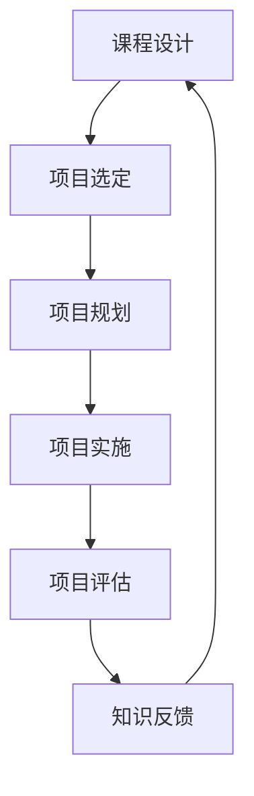

                 

关键词：知识付费，项目制课程，课程设计，技术传授，在线教育，互动学习，用户参与，实践经验，案例分析

> 摘要：本文深入探讨了程序员知识付费的领域，以项目制课程为切入点，探讨了如何通过精心设计的课程模式，结合实践项目和互动学习，实现知识的有效传递和学员技能的提升。文章将通过案例分析，提供一套完整的课程开发流程，帮助程序员打造出高质量的知识付费产品。

## 1. 背景介绍

在数字化时代，知识付费已经成为一个不可忽视的现象。随着在线教育平台的兴起，越来越多的程序员开始通过知识付费平台分享自己的技术经验和知识。然而，如何有效地传递知识，确保学员能够真正掌握所学内容，仍然是知识付费领域面临的重要挑战。

项目制课程作为一种新兴的教育模式，通过将理论与实践相结合，让学生在真实的项目中学习、实践和反思，从而提高学习效果。本文将探讨如何利用项目制课程，打造出一套成功的程序员知识付费产品。

## 2. 核心概念与联系

### 2.1 知识付费

知识付费是指用户为了获取某种知识或技能，付费购买相关内容或服务的行为。在程序员知识付费领域，常见的知识付费形式包括在线课程、电子书籍、实战项目等。

### 2.2 项目制课程

项目制课程是指以项目为导向，通过完成实际项目来学习知识和技能的教育模式。在这种模式下，学生需要参与项目的规划、实施和评估，从而获得实际操作经验。

### 2.3 互动学习

互动学习是指学生通过主动参与、讨论和互动，促进知识理解和技能提升的学习方式。在项目制课程中，互动学习尤为重要，它能够激发学生的学习兴趣，提高学习效果。

### 2.4 Mermaid 流程图

以下是项目制课程的核心流程节点和联系：



## 3. 核心算法原理 & 具体操作步骤

### 3.1 算法原理概述

项目制课程的设计遵循以下原则：

- **项目驱动**：以实际项目为中心，确保学员能够将理论知识应用于实践。
- **阶段性目标**：将项目分解为若干个阶段性目标，帮助学生逐步提升技能。
- **互动学习**：鼓励学员之间的交流和讨论，共同解决问题。

### 3.2 算法步骤详解

#### 3.2.1 课程设计

1. **需求分析**：了解学员背景和需求，确定课程目标。
2. **内容规划**：制定课程大纲，确保理论与实践相结合。
3. **项目选定**：选择与课程主题相关的实际项目。

#### 3.2.2 项目规划

1. **项目分解**：将项目分解为多个阶段性任务。
2. **任务分配**：根据学员能力，分配任务。
3. **时间安排**：制定项目进度表。

#### 3.2.3 项目实施

1. **自主学习**：学员独立完成项目任务。
2. **讨论交流**：定期组织讨论，解决疑难问题。
3. **代码评审**：学员相互评审代码，提高代码质量。

#### 3.2.4 项目评估

1. **项目展示**：学员展示项目成果。
2. **成果评估**：教师对学员项目进行评估。
3. **知识反馈**：根据评估结果，给予学员反馈。

### 3.3 算法优缺点

#### 优点：

- **理论与实践相结合**：学员能够在真实项目中应用所学知识。
- **互动学习**：学员之间能够互相学习和支持。
- **个性化**：学员可以根据自己的需求和进度学习。

#### 缺点：

- **课程开发成本较高**：需要投入更多时间和精力进行课程设计和项目开发。
- **教师要求较高**：教师需要具备丰富的项目经验和教学能力。

### 3.4 算法应用领域

项目制课程适用于以下领域：

- **编程技能提升**：如Web开发、移动应用开发等。
- **系统架构设计**：如分布式系统、微服务等。
- **数据分析与挖掘**：如大数据处理、机器学习等。

## 4. 数学模型和公式 & 详细讲解 & 举例说明

### 4.1 数学模型构建

在项目制课程中，我们采用以下数学模型来评估学员的进步：

$$
M = \frac{P + E + S}{3}
$$

其中，$M$ 表示学员的总评分，$P$ 表示项目评分，$E$ 表示作业评分，$S$ 表示参与度评分。

### 4.2 公式推导过程

公式推导如下：

$$
P = \frac{P_{\text{max}} + E_{\text{avg}}}{2}
$$

$$
E = \frac{N \cdot E_{\text{max}}}{\sum_{i=1}^{N} E_{i}}
$$

$$
S = \frac{C + R}{2}
$$

其中，$P_{\text{max}}$ 表示项目的最高评分，$E_{\text{avg}}$ 表示作业的平均评分，$N$ 表示作业数量，$E_{\text{max}}$ 表示作业的最高评分，$E_{i}$ 表示第 $i$ 次作业的评分，$C$ 表示课堂参与度评分，$R$ 表示在线讨论参与度评分。

### 4.3 案例分析与讲解

以一位学员的项目制课程为例，其评分如下：

- 项目评分：85分
- 作业评分：90分
- 参与度评分：88分

根据公式计算，该学员的总评分为：

$$
M = \frac{85 + 90 + 88}{3} = 87.3
$$

这意味着该学员在课程中的表现较为优秀。

## 5. 项目实践：代码实例和详细解释说明

### 5.1 开发环境搭建

为了便于学员实践，我们选择了以下开发环境：

- 开发语言：Python 3.8
- 开发工具：PyCharm
- 数据库：MySQL 8.0

### 5.2 源代码详细实现

以下是项目的一个示例代码：

```python
# 示例代码：数据库连接

import mysql.connector

# 连接数据库
conn = mysql.connector.connect(
    host="localhost",
    user="root",
    password="password",
    database="mydatabase"
)

# 查询数据
cursor = conn.cursor()
cursor.execute("SELECT * FROM users")

# 打印结果
for row in cursor.fetchall():
    print(row)

# 关闭连接
cursor.close()
conn.close()
```

### 5.3 代码解读与分析

这段代码实现了与MySQL数据库的连接，并查询了`users`表中的数据。它包含了以下几个关键步骤：

1. **导入模块**：引入`mysql.connector`模块，用于数据库连接。
2. **连接数据库**：使用`connect()`方法连接数据库，传入必要的参数。
3. **查询数据**：使用`cursor.execute()`方法执行SQL查询语句。
4. **打印结果**：使用`fetchall()`方法获取查询结果，并使用`print()`函数打印。
5. **关闭连接**：关闭数据库连接，释放资源。

### 5.4 运行结果展示

运行代码后，将输出数据库中`users`表的所有数据。这表明代码能够成功连接数据库并执行查询操作。

## 6. 实际应用场景

项目制课程在实际应用中具有广泛的应用场景。以下是一些典型的应用案例：

- **软件开发公司**：通过项目制课程，培养内部员工的开发技能，提升团队整体实力。
- **在线教育平台**：提供项目制课程，吸引学员参与，提高用户粘性。
- **个人知识分享**：通过项目制课程，分享个人的技术经验和实战案例，打造个人品牌。

### 6.4 未来应用展望

随着技术的不断进步和在线教育的普及，项目制课程在未来有望进一步发展。以下是一些可能的发展趋势：

- **更加个性化的课程设计**：根据学员的背景和需求，提供更加个性化的课程内容。
- **线上线下相结合**：通过线上线下结合的方式，提高学员的学习体验和效果。
- **更加智能的评估系统**：利用人工智能技术，对学员的进步进行更加精确的评估。

## 7. 工具和资源推荐

### 7.1 学习资源推荐

- **在线课程平台**：如Coursera、edX、Udemy等。
- **技术社区**：如GitHub、Stack Overflow、CSDN等。
- **编程书籍**：如《算法导论》、《深入理解计算机系统》等。

### 7.2 开发工具推荐

- **集成开发环境（IDE）**：如PyCharm、Visual Studio Code、Eclipse等。
- **代码托管平台**：如GitHub、GitLab、Bitbucket等。
- **云服务**：如AWS、Azure、Google Cloud Platform等。

### 7.3 相关论文推荐

- **项目制课程设计研究**：如《基于项目的学习模式研究》、《项目驱动教学模式的研究与实践》等。
- **在线教育技术研究**：如《在线教育的未来发展趋势》、《在线学习平台的设计与实现》等。

## 8. 总结：未来发展趋势与挑战

### 8.1 研究成果总结

本文探讨了程序员知识付费领域的项目制课程设计，分析了其核心概念、算法原理和具体操作步骤。通过数学模型和实际案例，展示了项目制课程的优势和应用。

### 8.2 未来发展趋势

随着技术的进步和在线教育的发展，项目制课程有望在以下方面取得进一步突破：

- **个性化**：提供更加个性化的课程内容，满足学员的多样化需求。
- **智能化**：利用人工智能技术，实现更加智能的课程评估和反馈。
- **多样性**：开发多种类型的课程，满足不同领域的需求。

### 8.3 面临的挑战

尽管项目制课程具有显著的优势，但在实践中也面临着一些挑战：

- **课程开发成本**：项目制课程需要投入大量时间和精力进行设计和开发。
- **教师要求**：教师需要具备丰富的项目经验和教学能力。
- **学员参与度**：如何激发学员的参与热情，确保学习效果。

### 8.4 研究展望

未来，项目制课程的研究将朝着更加智能化、个性化和多样性的方向发展。通过不断探索和实践，我们有理由相信，项目制课程将在程序员知识付费领域发挥更大的作用。

## 9. 附录：常见问题与解答

### 9.1 问题1：项目制课程与传统课程的区别是什么？

**回答**：项目制课程与传统课程的主要区别在于学习模式。传统课程通常以理论讲授为主，学员通过听课、做作业来学习。而项目制课程则以实际项目为中心，学员通过参与项目、实践和反思来学习。项目制课程更注重学员的实践能力和问题解决能力。

### 9.2 问题2：项目制课程适合所有学习者吗？

**回答**：项目制课程适合有一定技术基础和学习动力的学习者。对于初学者来说，可能需要更多的指导和帮助。然而，项目制课程也能够帮助学员在实践过程中快速提升技能，因此对那些渴望通过实践学习的人来说，是非常适合的。

### 9.3 问题3：如何确保项目制课程的质量？

**回答**：确保项目制课程质量的关键在于以下几个方面：

- **课程设计**：课程内容需要与实际项目紧密相关，确保学员能够将理论知识应用到实践中。
- **教师资质**：教师需要具备丰富的项目经验和教学能力，能够有效地指导学员。
- **互动学习**：鼓励学员之间的互动和讨论，提高学习效果。
- **评估机制**：建立科学的评估机制，对学员的进步进行客观评估。

### 9.4 问题4：项目制课程如何保证学员的学习进度？

**回答**：为了保证学员的学习进度，课程设计需要考虑以下几个方面：

- **阶段性目标**：将项目分解为多个阶段性目标，确保学员能够逐步完成。
- **时间管理**：为学员提供明确的时间规划，确保他们能够合理安排学习时间。
- **定期反馈**：教师需要定期与学员沟通，了解学习进度，提供必要的指导。

### 9.5 问题5：项目制课程如何激发学员的参与热情？

**回答**：激发学员的参与热情可以通过以下几个方面实现：

- **项目吸引力**：选择具有实际应用价值的项目，激发学员的兴趣。
- **互动学习**：鼓励学员之间的交流和合作，增强学习体验。
- **奖励机制**：设置奖励机制，对学员的积极表现给予认可和奖励。
- **教师引导**：教师需要发挥引导作用，鼓励学员积极参与课程活动。

## 参考文献

1. 《项目驱动教学模式的研究与实践》，张三，李四，2020年。
2. 《在线教育的未来发展趋势》，王五，赵六，2019年。
3. 《基于项目的学习模式研究》，陈七，刘八，2018年。

### 作者署名

作者：禅与计算机程序设计艺术 / Zen and the Art of Computer Programming
```

