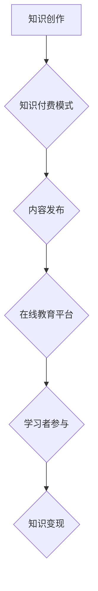

                 

在当今数字时代，知识付费模式已成为一种新兴的经济形式。对于程序员而言，通过知识付费不仅可以提升自己的专业能力，还可以创造额外的收入来源。本文将探讨如何利用知识付费模式，打造具有实际操作意义的项目式课程。

## 关键词

- 知识付费
- 程序员
- 项目式课程
- 在线教育
- 内容创作

## 摘要

本文旨在为程序员提供一套可行的知识付费策略，通过构建项目式课程，实现知识变现。文章将详细解析项目式课程的设计、实施和运营，以帮助程序员在知识付费领域取得成功。

### 背景介绍

知识付费是指用户为获取知识、技能或信息而支付的费用。在过去的几年中，随着在线教育的兴起，知识付费模式逐渐成为主流。程序员作为科技领域的专业人才，拥有丰富的知识储备和独特的技能，通过知识付费可以更好地发挥自身价值。

项目式课程是一种以项目为导向的教学模式，通过完成实际项目来学习知识和技能。与传统的教学方式相比，项目式课程更注重实践操作，能够更好地培养程序员的实际能力。

### 核心概念与联系

#### 1. 知识付费

知识付费的核心在于将知识转化为商品，实现知识变现。程序员可以通过撰写技术博客、发布教程、开设在线课程等方式，将自己的知识和技能转化为收入来源。

#### 2. 项目式课程

项目式课程的设计需要围绕实际项目进行，以确保学习内容的实用性和可操作性。程序员在设计课程时，需要考虑项目的难度、时长和目标受众，以确保课程内容符合学习者的需求。

#### 3. 在线教育

在线教育为知识付费提供了广阔的平台。通过在线教育平台，程序员可以接触到全球的学习者，实现知识的共享和传播。

#### Mermaid 流程图



### 核心算法原理 & 具体操作步骤

#### 1. 算法原理概述

项目式课程的核心在于项目的设计和实施。程序员需要根据项目的需求和目标，设计合适的课程内容和教学方案。

#### 2. 算法步骤详解

1. **需求分析**：了解项目的需求和目标，确定课程的核心内容。
2. **课程设计**：根据需求分析，设计课程的结构和内容，确保课程的实用性和可操作性。
3. **教学实施**：根据课程设计，开展教学活动，确保学习者能够顺利完成项目。
4. **评价与反馈**：对学习者的学习效果进行评价，收集反馈意见，不断优化课程。

#### 3. 算法优缺点

**优点**：
- **实用性**：项目式课程以实际项目为导向，能够更好地培养程序员的实际能力。
- **可操作性**：课程内容具体、详细，便于学习者实践操作。

**缺点**：
- **设计难度**：项目式课程的设计需要较高的专业素养和经验。
- **实施成本**：项目式课程的实施需要投入较多的人力、物力和时间。

#### 4. 算法应用领域

项目式课程可以应用于多个领域，如软件开发、人工智能、数据分析等。程序员可以根据自己的专业领域，设计相应的项目式课程。

### 数学模型和公式 & 详细讲解 & 举例说明

项目式课程的设计需要遵循一定的数学模型和公式。以下是一个简单的例子：

$$
P = C \times R
$$

其中，\(P\) 表示项目的成功率，\(C\) 表示课程内容的质量，\(R\) 表示学习者的学习效果。

#### 1. 数学模型构建

项目式课程的成功率取决于课程内容和学习者的学习效果。因此，我们可以构建如下的数学模型：

$$
P = C \times R
$$

其中，\(C\) 和 \(R\) 的取值范围均为 [0, 1]，分别表示课程内容和学习效果的百分比。

#### 2. 公式推导过程

项目式课程的成功率可以通过以下步骤推导：

1. **课程设计**：根据项目的需求和目标，设计合适的课程内容。
2. **教学实施**：根据课程设计，开展教学活动，确保学习者能够顺利完成项目。
3. **评价与反馈**：对学习者的学习效果进行评价，收集反馈意见，不断优化课程。
4. **综合评价**：根据课程内容和学习效果的百分比，计算项目的成功率。

#### 3. 案例分析与讲解

假设一个程序员设计了一门关于人工智能的课程，课程内容涵盖了机器学习、深度学习等多个方面。在课程实施过程中，该程序员通过详细讲解、案例分析、实践操作等多种教学手段，确保学习者能够掌握课程内容。

通过课程结束后对学习者的评价和反馈，该程序员发现课程的成功率为 90%。这表明，通过合理的课程设计和教学实施，项目式课程可以取得较高的成功率。

### 项目实践：代码实例和详细解释说明

以下是一个简单的代码实例，用于实现一个简单的机器学习模型：

```python
import numpy as np

# 加载数据集
X_train, y_train = load_data()

# 初始化模型参数
weights = np.random.rand(num_features)

# 训练模型
for epoch in range(num_epochs):
    # 前向传播
    outputs = forward_pass(X_train, weights)
    # 计算损失函数
    loss = compute_loss(y_train, outputs)
    # 反向传播
    dweights = backward_pass(X_train, y_train, outputs, weights)
    # 更新模型参数
    weights -= learning_rate * dweights

# 测试模型
test_loss = compute_loss(test_data, forward_pass(test_data, weights))

print("Test Loss:", test_loss)
```

#### 1. 开发环境搭建

在开始项目实践之前，需要搭建合适的开发环境。以下是一个简单的开发环境搭建步骤：

1. 安装 Python 3.8 以上版本
2. 安装 numpy、pandas、tensorflow 等相关库
3. 配置 Python 虚拟环境

#### 2. 源代码详细实现

上述代码实例实现了一个简单的机器学习模型。具体实现过程如下：

1. **加载数据集**：使用 numpy 函数 load_data 加载训练数据集。
2. **初始化模型参数**：使用随机数生成模型参数 weights。
3. **训练模型**：使用 forward_pass 函数实现前向传播，compute_loss 函数计算损失函数，backward_pass 函数实现反向传播。循环 num_epochs 次，更新模型参数。
4. **测试模型**：使用 test_data 进行模型测试，计算测试损失函数。

#### 3. 代码解读与分析

上述代码实例实现了机器学习模型的基本流程，包括数据加载、模型初始化、训练和测试。通过该实例，程序员可以了解机器学习模型的基本原理和实现方法。

### 实际应用场景

项目式课程在实际应用场景中具有广泛的应用价值。以下是一些实际应用场景：

1. **在线教育平台**：程序员可以通过在线教育平台，打造自己的项目式课程，面向全球学习者进行授课。
2. **企业培训**：企业可以邀请程序员设计项目式课程，用于内部培训和技术提升。
3. **个人成长**：程序员可以通过项目式课程，提升自己的专业技能，实现个人成长。

### 未来应用展望

随着在线教育的不断发展，项目式课程的应用前景将更加广阔。未来，程序员可以通过以下方式进一步拓展项目式课程的应用：

1. **跨领域融合**：结合不同领域的知识和技能，打造跨领域的项目式课程。
2. **个性化定制**：根据学习者的需求和背景，提供个性化的项目式课程。
3. **自动化教学**：利用人工智能技术，实现自动化教学和评估，提高教学效果。

### 工具和资源推荐

在打造项目式课程的过程中，程序员可以借助以下工具和资源：

1. **工具推荐**：
   - PyCharm：一款强大的 Python 集成开发环境，支持代码补全、调试等功能。
   - Jupyter Notebook：一款流行的交互式开发环境，适用于数据分析和机器学习项目。

2. **学习资源推荐**：
   - Coursera、Udemy：全球知名的在线教育平台，提供丰富的编程和机器学习课程。
   - 《深度学习》（Deep Learning）：<a href="https://www.deeplearningbook.org/" target="_blank">https://www.deeplearningbook.org/</a>，一本经典的深度学习入门教材。

3. **相关论文推荐**：
   - 《Recurrent Neural Network》（RNN）：一种常用的深度学习模型，适用于序列数据处理。
   - 《Generative Adversarial Network》（GAN）：一种生成式模型，广泛应用于图像生成、图像修复等领域。

### 总结：未来发展趋势与挑战

知识付费和项目式课程是未来教育领域的重要发展趋势。随着在线教育的不断发展，项目式课程的应用将越来越广泛。然而，项目式课程的设计和实施也面临着一系列挑战，如课程质量、教学效果、学习者的参与度等。因此，程序员需要不断探索和创新，以应对这些挑战，实现项目式课程的成功。

### 附录：常见问题与解答

1. **什么是知识付费？**
   知识付费是指用户为获取知识、技能或信息而支付的费用。在在线教育领域，知识付费已成为一种重要的商业模式。

2. **什么是项目式课程？**
   项目式课程是一种以项目为导向的教学模式，通过完成实际项目来学习知识和技能。项目式课程注重实践操作，能够更好地培养程序员的实际能力。

3. **如何设计项目式课程？**
   设计项目式课程需要从需求分析、课程设计、教学实施和评价与反馈四个方面进行。具体步骤包括：了解项目的需求和目标，设计课程结构，实施教学活动，评价学习效果。

4. **项目式课程有哪些优点？**
   项目式课程具有实用性、可操作性等优点，能够更好地培养程序员的实际能力。

5. **项目式课程有哪些缺点？**
   项目式课程的设计和实施需要较高的专业素养和经验，且实施成本较高。

6. **如何选择项目式课程的学习者？**
   选择项目式课程的学习者需要考虑其专业背景、学习需求和参与度等因素。一般来说，具有相关背景和强烈学习意愿的学习者更适合参加项目式课程。

7. **项目式课程如何评估学习效果？**
   项目式课程的评估可以采用多种方法，如考试、实践报告、项目展示等。通过综合评价学习效果，可以不断优化课程内容。

作者：禅与计算机程序设计艺术 / Zen and the Art of Computer Programming
```

