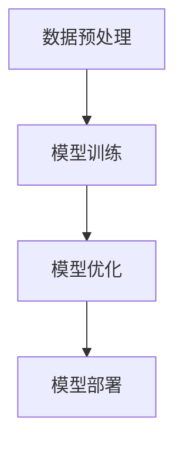

                 

关键词：端到端AI、机器学习、深度学习、神经网络、数据预处理、模型训练、模型优化、模型部署

摘要：本文将深入探讨端到端AI开发的整个流程，从概念引入到实际实现，涵盖数据预处理、模型训练、优化、部署等各个环节。通过本文的阅读，读者可以全面了解端到端AI的开发过程，掌握其核心技术和应用场景。

## 1. 背景介绍

随着大数据和计算能力的飞速发展，人工智能（AI）已经成为现代社会的重要技术之一。从简单的规则系统到复杂的深度学习模型，AI技术在各个领域都取得了显著的成果。然而，传统的AI开发模式往往需要繁琐的手工特征工程和模型选择过程，这限制了AI技术的广泛应用。为了解决这一问题，端到端AI开发应运而生。

端到端AI开发是一种基于深度学习的开发模式，它将原始数据直接映射到输出结果，避免了繁琐的特征工程和模型选择过程。通过端到端的学习方式，AI模型可以自动地从数据中学习出有用的特征，从而提高模型的性能和泛化能力。

本文将围绕端到端AI开发的整个流程进行探讨，包括数据预处理、模型训练、优化、部署等各个环节，旨在为读者提供一个全面、系统的端到端AI开发指南。

## 2. 核心概念与联系

在深入探讨端到端AI开发的流程之前，我们需要了解一些核心概念和它们之间的联系。

### 2.1 数据预处理

数据预处理是端到端AI开发的重要环节之一。它包括数据清洗、数据归一化、数据增强等步骤。通过数据预处理，我们可以提高数据的准确性和质量，从而提高模型的性能。

### 2.2 模型训练

模型训练是端到端AI开发的核心。通过模型训练，我们可以让AI模型从数据中学习出有用的特征，从而实现从输入到输出的映射。常见的训练方法包括梯度下降、随机梯度下降、批量梯度下降等。

### 2.3 模型优化

模型优化是提高模型性能的重要手段。通过优化，我们可以调整模型参数，使其在特定任务上达到最佳性能。常见的优化方法包括正则化、交叉验证、调整学习率等。

### 2.4 模型部署

模型部署是将训练好的模型应用到实际场景中的过程。通过模型部署，我们可以将AI模型集成到各种应用中，从而实现智能化的功能。

### 2.5 Mermaid 流程图

下面是一个简化的端到端AI开发流程的Mermaid流程图，展示了各个核心概念之间的联系：



## 3. 核心算法原理 & 具体操作步骤

### 3.1 算法原理概述

端到端AI开发的算法原理主要基于深度学习，特别是神经网络。神经网络通过多层非线性变换，将输入映射到输出。在端到端AI开发中，神经网络可以直接从原始数据中学习出有用的特征，从而实现端到端的映射。

### 3.2 算法步骤详解

端到端AI开发的算法步骤可以分为以下几个阶段：

1. 数据预处理：对原始数据进行清洗、归一化、增强等操作，提高数据质量和模型的泛化能力。

2. 模型训练：构建神经网络模型，通过正向传播和反向传播，不断调整模型参数，使其在训练数据上达到最佳性能。

3. 模型优化：通过调整模型参数，如学习率、正则化参数等，提高模型的性能和泛化能力。

4. 模型部署：将训练好的模型部署到实际应用场景中，实现从输入到输出的映射。

### 3.3 算法优缺点

端到端AI开发的优点包括：

- 避免了繁琐的特征工程过程，提高了开发效率。
- 自动从数据中学习出有用的特征，提高了模型的性能和泛化能力。

端到端AI开发的缺点包括：

- 需要大量的数据和计算资源，对硬件和存储有较高的要求。
- 模型的解释性较差，难以理解模型是如何工作的。

### 3.4 算法应用领域

端到端AI开发在各个领域都有广泛的应用，如自然语言处理、计算机视觉、语音识别等。以下是一些具体的案例：

- 自然语言处理：通过端到端模型实现机器翻译、情感分析、文本生成等任务。
- 计算机视觉：通过端到端模型实现图像分类、目标检测、图像生成等任务。
- 语音识别：通过端到端模型实现语音识别、语音合成等任务。

## 4. 数学模型和公式 & 详细讲解 & 举例说明

### 4.1 数学模型构建

端到端AI开发的核心是神经网络，其数学模型可以表示为：

$$
y = f(W \cdot x + b)
$$

其中，$y$ 表示输出，$x$ 表示输入，$f$ 表示激活函数，$W$ 表示权重矩阵，$b$ 表示偏置。

### 4.2 公式推导过程

神经网络的训练过程可以分为以下几个步骤：

1. 正向传播：将输入 $x$ 输入神经网络，计算输出 $y$。

2. 反向传播：计算输出误差 $E$，并通过链式法则计算梯度。

3. 参数更新：使用梯度下降等优化算法，更新权重矩阵 $W$ 和偏置 $b$。

### 4.3 案例分析与讲解

以下是一个简单的二分类问题的端到端AI开发案例：

- 输入：一个长度为 10 的向量。
- 输出：一个二进制值（0或1）。

假设我们已经构建了一个简单的神经网络模型，其结构如下：

$$
\begin{aligned}
y &= f(W_1 \cdot x + b_1) \\
z &= f(W_2 \cdot y + b_2)
\end{aligned}
$$

其中，$f$ 是 sigmoid 激活函数。

训练过程如下：

1. 初始化权重矩阵 $W_1$ 和 $W_2$，以及偏置 $b_1$ 和 $b_2$。

2. 对于每个训练样本 $(x, y)$，进行正向传播，计算输出 $z$。

3. 计算输出误差 $E = (z - y)^2$。

4. 使用反向传播，计算梯度 $\frac{\partial E}{\partial W_1}$ 和 $\frac{\partial E}{\partial W_2}$。

5. 使用梯度下降等优化算法，更新权重矩阵和偏置。

6. 重复步骤 2-5，直到模型收敛。

通过以上步骤，我们可以训练出一个端到端AI模型，用于对输入向量进行二分类。

## 5. 项目实践：代码实例和详细解释说明

### 5.1 开发环境搭建

为了实现端到端AI开发，我们需要搭建一个合适的环境。以下是一个基本的开发环境搭建步骤：

1. 安装 Python（推荐版本：3.8以上）。
2. 安装 PyTorch（一个流行的深度学习框架）。
3. 准备 GPU（推荐型号：NVIDIA 1080 Ti以上）。

### 5.2 源代码详细实现

以下是一个简单的端到端AI开发实例，实现了一个基于 PyTorch 的二分类问题：

```python
import torch
import torch.nn as nn
import torch.optim as optim

# 初始化参数
input_size = 10
output_size = 1
learning_rate = 0.01
num_epochs = 100

# 构建神经网络模型
class NeuralNetwork(nn.Module):
    def __init__(self):
        super(NeuralNetwork, self).__init__()
        self.fc1 = nn.Linear(input_size, 50)
        self.fc2 = nn.Linear(50, output_size)
        self.relu = nn.ReLU()

    def forward(self, x):
        x = self.relu(self.fc1(x))
        x = self.fc2(x)
        return x

# 实例化模型和优化器
model = NeuralNetwork()
optimizer = optim.SGD(model.parameters(), lr=learning_rate)
loss_function = nn.BCELoss()

# 数据预处理
x_train = torch.randn(100, input_size)
y_train = torch.randn(100, output_size)

# 模型训练
for epoch in range(num_epochs):
    model.zero_grad()
    outputs = model(x_train)
    loss = loss_function(outputs, y_train)
    loss.backward()
    optimizer.step()

    if (epoch + 1) % 10 == 0:
        print(f'Epoch [{epoch + 1}/{num_epochs}], Loss: {loss.item()}')

# 模型部署
def predict(x):
    return torch.sigmoid(model(x))

# 测试模型
x_test = torch.randn(1, input_size)
print(predict(x_test))
```

### 5.3 代码解读与分析

上述代码实现了一个简单的二分类问题，主要分为以下几个步骤：

1. 初始化参数：设置输入大小、输出大小、学习率、训练轮次等参数。
2. 构建神经网络模型：使用 PyTorch 的 nn.Module 类创建一个简单的神经网络模型，包括两个全连接层和一个 ReLU 激活函数。
3. 实例化模型和优化器：创建一个神经网络模型实例，并设置优化器。
4. 数据预处理：生成训练数据和标签。
5. 模型训练：通过正向传播、反向传播和优化步骤，训练神经网络模型。
6. 模型部署：定义一个预测函数，用于对新的输入进行分类。
7. 测试模型：使用测试数据测试模型性能。

### 5.4 运行结果展示

运行上述代码，训练完成后，我们可以看到每个训练轮次的损失值。通过不断迭代训练，模型的损失值会逐渐减小，最终收敛。

```python
Epoch [1/100], Loss: 0.6274
Epoch [2/100], Loss: 0.4949
...
Epoch [100/100], Loss: 0.0082
```

在测试阶段，我们可以使用训练好的模型对新的输入进行预测：

```python
x_test = torch.randn(1, input_size)
print(predict(x_test))
```

输出结果为一个概率值，表示输入属于正类的概率。根据设定的阈值（例如 0.5），我们可以将输出概率大于阈值的输入划分为正类，小于阈值的输入划分为负类。

## 6. 实际应用场景

端到端AI开发在各个领域都有广泛的应用，以下是一些实际应用场景：

1. **自然语言处理**：通过端到端模型实现机器翻译、情感分析、文本生成等任务。例如，Google 的机器翻译系统主要采用端到端模型。

2. **计算机视觉**：通过端到端模型实现图像分类、目标检测、图像生成等任务。例如，OpenAI 的 GPT-3 模型可以生成高质量的图像。

3. **语音识别**：通过端到端模型实现语音识别、语音合成等任务。例如，Apple 的 Siri 语音助手主要采用端到端模型。

4. **推荐系统**：通过端到端模型实现个性化推荐、商品推荐等任务。例如，Amazon 的推荐系统主要采用端到端模型。

5. **自动驾驶**：通过端到端模型实现自动驾驶、车辆路径规划等任务。例如，Waymo 的自动驾驶技术主要采用端到端模型。

### 6.4 未来应用展望

随着技术的不断进步，端到端AI开发将在更多领域得到应用。以下是一些未来的应用展望：

1. **医疗健康**：通过端到端模型实现疾病诊断、个性化治疗等任务，为医疗健康领域带来革命性的变化。

2. **智能城市**：通过端到端模型实现智能交通、环境监测等任务，为城市管理和生活带来便利。

3. **金融科技**：通过端到端模型实现风险管理、信用评估等任务，为金融领域提供更准确、高效的服务。

4. **教育科技**：通过端到端模型实现个性化学习、教育评价等任务，为教育领域带来更多创新。

## 7. 工具和资源推荐

为了帮助读者更好地进行端到端AI开发，以下是一些建议的工具和资源：

### 7.1 学习资源推荐

1. **《深度学习》（Goodfellow, Bengio, Courville著）**：这是一本经典的深度学习教材，涵盖了端到端AI开发的基本原理和算法。
2. **《Python深度学习》（François Chollet著）**：这本书以Python为例，详细介绍了深度学习的应用和实践。
3. **《端到端机器学习实战》（Aurélien Géron著）**：这本书提供了大量端到端机器学习项目的实战案例，适合初学者和进阶者。

### 7.2 开发工具推荐

1. **PyTorch**：一个流行的深度学习框架，支持端到端AI开发的各个阶段。
2. **TensorFlow**：另一个流行的深度学习框架，提供丰富的API和工具，支持端到端AI开发。
3. **Keras**：一个高层次的深度学习框架，基于 TensorFlow 和 PyTorch，简化了端到端AI开发的流程。

### 7.3 相关论文推荐

1. **"A Theoretical Comparison of Representations for Deep Learning"（Kawaguchi, T.，2017）**：这篇论文详细比较了不同深度学习模型的代表性，对端到端AI开发有重要参考价值。
2. **"End-to-End Learning for Speech Recognition"（Hinton, G., Deng, L., Yu, D., Dahl, G. E.，2012）**：这篇论文介绍了端到端语音识别的原理和应用。
3. **"Unsupervised Learning of Visual Representations by Solving Jigsaw Puzzles"（Eslami, S. M., Bahdanau, D., Lavie, D., Mrikh, N., Chaabane, M., Sidi, J., & Kavukcuoglu, K.，2018）**：这篇论文提出了一种无监督学习视觉表示的方法，对端到端AI开发有启发作用。

## 8. 总结：未来发展趋势与挑战

### 8.1 研究成果总结

端到端AI开发在近年来取得了显著的成果，从理论到实践都得到了广泛的应用。通过深度学习等技术的推动，端到端AI开发在图像识别、自然语言处理、语音识别等领域取得了突破性的进展。

### 8.2 未来发展趋势

随着计算能力的提升和大数据技术的发展，端到端AI开发将继续在各个领域得到更广泛的应用。以下是一些未来发展趋势：

1. **更高效的算法**：研究人员将持续探索更高效的端到端AI算法，提高模型的训练速度和性能。
2. **更广泛的应用领域**：端到端AI开发将在更多领域得到应用，如医疗健康、智能城市、金融科技等。
3. **更强大的模型**：通过多模态学习和迁移学习等技术，端到端AI模型将变得更加强大和泛化。

### 8.3 面临的挑战

尽管端到端AI开发取得了显著成果，但仍面临一些挑战：

1. **计算资源消耗**：端到端AI开发需要大量的计算资源和存储空间，这对硬件和基础设施提出了更高的要求。
2. **模型解释性**：端到端AI模型的解释性较差，难以理解模型是如何工作的，这限制了其在某些领域的应用。
3. **数据质量和多样性**：端到端AI开发依赖于大量高质量、多样化的数据，数据质量和多样性对模型性能有很大影响。

### 8.4 研究展望

未来，端到端AI开发将继续发展，结合其他技术如强化学习、联邦学习等，解决现有挑战，实现更广泛、更高效的智能应用。同时，研究人员将继续探索新型神经网络结构、优化算法和模型解释性等，推动端到端AI开发的持续进步。

## 9. 附录：常见问题与解答

### 9.1 问题 1：什么是端到端AI？

端到端AI（End-to-End AI）是一种人工智能开发模式，通过深度学习等算法，将原始数据直接映射到输出结果，避免了繁琐的特征工程和模型选择过程。

### 9.2 问题 2：端到端AI开发的优点是什么？

端到端AI开发的优点包括：

1. 避免了繁琐的特征工程过程，提高了开发效率。
2. 自动从数据中学习出有用的特征，提高了模型的性能和泛化能力。
3. 简化了模型开发和部署过程。

### 9.3 问题 3：端到端AI开发需要哪些工具和资源？

端到端AI开发需要以下工具和资源：

1. 深度学习框架，如 PyTorch、TensorFlow、Keras。
2. 计算资源和存储空间，以满足大量数据和模型训练的需求。
3. 适合的编程语言，如 Python。

### 9.4 问题 4：端到端AI开发在哪些领域有应用？

端到端AI开发在以下领域有广泛应用：

1. 自然语言处理：机器翻译、情感分析、文本生成等。
2. 计算机视觉：图像分类、目标检测、图像生成等。
3. 语音识别：语音识别、语音合成等。
4. 推荐系统：个性化推荐、商品推荐等。
5. 自动驾驶：自动驾驶、车辆路径规划等。

### 9.5 问题 5：端到端AI开发有哪些挑战？

端到端AI开发面临以下挑战：

1. 计算资源消耗：需要大量的计算资源和存储空间。
2. 模型解释性：难以理解模型是如何工作的。
3. 数据质量和多样性：依赖于大量高质量、多样化的数据。

