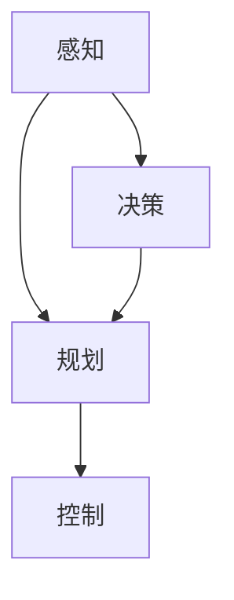
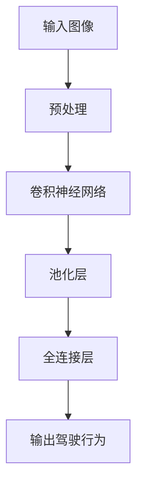

                 

关键词：端到端自动驾驶、不可预知性风险、深度学习、人工智能、算法、安全性、挑战

摘要：随着自动驾驶技术的快速发展，端到端自动驾驶系统正逐渐成为现实。然而，其不可预知性风险成为当前技术发展的重要挑战。本文从技术、应用和安全等多个角度，深入探讨了端到端自动驾驶中不可预知性风险的存在及其应对策略，为自动驾驶技术的进一步发展提供了参考。

## 1. 背景介绍

自动驾驶技术是人工智能领域的核心应用之一，其发展历程可追溯到20世纪50年代。然而，随着深度学习和计算机视觉技术的飞速发展，自动驾驶技术进入了全新的阶段。端到端自动驾驶系统（End-to-End Autonomous Driving）作为一种新兴的自动驾驶技术，通过对大量数据进行训练，使其能够直接从输入图像中学习到驾驶行为，从而实现自动驾驶。

然而，端到端自动驾驶技术的快速发展也带来了不可预知性风险。这种风险主要体现在以下几个方面：

### 1.1 算法复杂性

端到端自动驾驶系统的核心是深度学习算法，特别是卷积神经网络（CNN）和循环神经网络（RNN）等复杂神经网络。这些算法的复杂性使得训练过程需要大量的计算资源和时间，并且很难保证算法的鲁棒性和稳定性。

### 1.2 数据集缺陷

端到端自动驾驶系统的训练依赖于大量的真实数据。然而，这些数据往往存在一定的缺陷，如数据不平衡、噪声干扰、标注错误等，这些缺陷会影响模型的泛化能力，进而增加不可预知性风险。

### 1.3 安全性问题

自动驾驶系统的安全性是人们最为关注的方面。然而，端到端自动驾驶系统在复杂环境下的表现往往无法预测，特别是在面临罕见情况时，系统的反应可能不符合预期，从而导致安全事故。

## 2. 核心概念与联系

为了更好地理解端到端自动驾驶的不可预知性风险，我们需要首先了解其核心概念和联系。以下是一个简单的 Mermaid 流程图，展示了端到端自动驾驶系统的主要组成部分和它们之间的关联。



### 2.1 感知（Perception）

感知模块主要负责收集环境信息，如道路、车辆、行人等，并将其转化为计算机可以处理的数据。这个过程通常涉及到计算机视觉和传感器数据的处理。

### 2.2 规划（Planning）

规划模块根据感知模块提供的信息，制定出一条合理的行驶路径。这个过程中需要考虑各种因素，如交通规则、道路状况、车辆动态等。

### 2.3 控制（Control）

控制模块负责将规划模块生成的行驶路径转化为车辆的动作。这个过程中需要控制车辆的加速、减速、转向等动作。

### 2.4 决策（Decision）

决策模块负责处理感知模块和规划模块的信息，并根据当前情况做出决策。这个模块是整个自动驾驶系统的核心，也是不可预知性风险的主要来源。

## 3. 核心算法原理 & 具体操作步骤

### 3.1 算法原理概述

端到端自动驾驶系统的核心算法通常是基于深度学习的。深度学习算法通过学习大量数据，使其能够从输入中提取特征，并生成相应的输出。在端到端自动驾驶系统中，输入通常是图像数据，输出则是驾驶行为。

以下是一个简单的深度学习算法框架，用于实现端到端自动驾驶：



### 3.2 算法步骤详解

#### 3.2.1 预处理（Preprocessing）

预处理步骤通常包括图像的缩放、裁剪、灰度化等操作，以便于深度学习算法的输入。

#### 3.2.2 卷积神经网络（Convolutional Neural Network, CNN）

卷积神经网络是深度学习中最常用的算法之一，其核心思想是通过卷积操作提取图像的特征。在端到端自动驾驶系统中，CNN通常用于处理输入图像，提取出道路、车辆、行人等关键信息。

#### 3.2.3 池化层（Pooling Layer）

池化层用于降低特征图的维度，从而减少计算量。常见的池化操作包括最大池化和平均池化。

#### 3.2.4 全连接层（Fully Connected Layer）

全连接层用于将卷积层和池化层提取的特征转化为驾驶行为。在端到端自动驾驶系统中，全连接层通常用于生成转向、加速、减速等输出。

#### 3.2.5 输出驾驶行为（Output Driving Behavior）

输出驾驶行为步骤是将全连接层生成的输出转化为具体的驾驶动作。这个过程通常涉及到复杂的决策逻辑和动作控制。

### 3.3 算法优缺点

#### 3.3.1 优点

- **自动化程度高**：端到端自动驾驶系统可以自动从输入数据中学习到驾驶行为，无需人工干预。
- **模型简洁**：端到端自动驾驶系统将感知、规划和控制融合为一个统一的模型，简化了系统架构。
- **高效性**：深度学习算法可以快速处理大量数据，提高自动驾驶系统的响应速度。

#### 3.3.2 缺点

- **不可解释性**：深度学习算法的黑箱特性使得其决策过程难以理解，增加了不可预知性风险。
- **数据依赖**：端到端自动驾驶系统的性能高度依赖于训练数据的质量和数量，数据缺陷会导致模型性能下降。
- **鲁棒性不足**：深度学习算法在面对罕见情况时，可能无法做出正确的决策，增加了系统的不可预知性风险。

### 3.4 算法应用领域

端到端自动驾驶算法在多个领域都有广泛的应用，包括：

- **自动驾驶汽车**：自动驾驶汽车是端到端自动驾驶算法最直接的应用场景。
- **无人驾驶飞行器**：无人驾驶飞行器（如无人机、自动驾驶直升机等）也需要端到端自动驾驶算法来实现自主飞行。
- **机器人导航**：端到端自动驾驶算法可以用于机器人导航，实现自主移动和任务执行。

## 4. 数学模型和公式 & 详细讲解 & 举例说明

### 4.1 数学模型构建

端到端自动驾驶的数学模型通常基于深度学习算法，特别是卷积神经网络（CNN）和循环神经网络（RNN）等。以下是一个简化的数学模型构建过程：

#### 4.1.1 卷积神经网络（CNN）

卷积神经网络的核心是卷积层，其公式如下：

$$
\text{output} = \text{ReLU}(\text{conv}(\text{input}) + \text{bias})
$$

其中，$\text{ReLU}$表示ReLU激活函数，$\text{conv}$表示卷积操作，$\text{input}$表示输入图像，$\text{bias}$表示偏置。

#### 4.1.2 循环神经网络（RNN）

循环神经网络的核心是隐藏状态更新公式：

$$
\text{h_t} = \text{sigmoid}(\text{W_hh} \cdot \text{h_{t-1}} + \text{W_xh} \cdot \text{x_t} + \text{b_h})
$$

其中，$\text{h_t}$表示第$t$时刻的隐藏状态，$\text{sigmoid}$表示sigmoid激活函数，$\text{W_hh}$、$\text{W_xh}$和$\text{b_h}$分别表示权重矩阵和偏置。

### 4.2 公式推导过程

端到端自动驾驶的公式推导过程相对复杂，涉及到深度学习算法的多个层次。以下是一个简化的推导过程：

#### 4.2.1 卷积神经网络（CNN）

卷积神经网络的公式推导主要涉及到卷积操作和ReLU激活函数。以下是一个简化的推导过程：

$$
\text{output} = \text{ReLU}(\text{conv}(\text{input}) + \text{bias})
$$

其中，$\text{input}$表示输入图像，$\text{conv}$表示卷积操作，$\text{bias}$表示偏置。卷积操作的公式如下：

$$
\text{conv}(\text{input}) = \sum_{i=1}^{n}\text{w_i} \cdot \text{input}_{i}
$$

其中，$\text{w_i}$表示卷积核，$\text{input}_{i}$表示输入图像中的某个像素。

#### 4.2.2 循环神经网络（RNN）

循环神经网络的公式推导主要涉及到隐藏状态更新公式和sigmoid激活函数。以下是一个简化的推导过程：

$$
\text{h_t} = \text{sigmoid}(\text{W_hh} \cdot \text{h_{t-1}} + \text{W_xh} \cdot \text{x_t} + \text{b_h})
$$

其中，$\text{h_t}$表示第$t$时刻的隐藏状态，$\text{sigmoid}$表示sigmoid激活函数，$\text{W_hh}$、$\text{W_xh}$和$\text{b_h}$分别表示权重矩阵和偏置。

### 4.3 案例分析与讲解

以下是一个简化的端到端自动驾驶算法案例，用于说明数学模型的应用。

#### 4.3.1 案例背景

假设我们有一个自动驾驶系统，需要处理一张道路图像。系统需要从图像中识别出道路、车辆和行人，并根据这些信息生成驾驶行为。

#### 4.3.2 案例实施

1. **输入图像预处理**：对输入图像进行缩放、裁剪等预处理操作，使其符合深度学习算法的要求。
2. **卷积神经网络（CNN）处理**：使用卷积神经网络对预处理后的图像进行处理，提取出道路、车辆和行人的特征。
3. **循环神经网络（RNN）处理**：使用循环神经网络对提取出的特征进行处理，生成驾驶行为。
4. **输出驾驶行为**：根据循环神经网络生成的驾驶行为，控制车辆的动作。

## 5. 项目实践：代码实例和详细解释说明

### 5.1 开发环境搭建

在本项目中，我们使用 Python 编程语言和 TensorFlow 深度学习框架来实现端到端自动驾驶系统。以下是如何搭建开发环境的步骤：

1. 安装 Python 3.7 或更高版本。
2. 安装 TensorFlow 2.x 版本。
3. 安装必要的依赖库，如 NumPy、Pandas 等。

### 5.2 源代码详细实现

以下是一个简化的端到端自动驾驶系统的 Python 代码实现，用于展示主要模块的功能。

```python
import tensorflow as tf
from tensorflow.keras.models import Sequential
from tensorflow.keras.layers import Conv2D, MaxPooling2D, Flatten, Dense, LSTM

# 模型构建
model = Sequential([
    Conv2D(32, (3, 3), activation='relu', input_shape=(128, 128, 3)),
    MaxPooling2D((2, 2)),
    Flatten(),
    LSTM(64, return_sequences=True),
    LSTM(64),
    Dense(1, activation='sigmoid')
])

# 编译模型
model.compile(optimizer='adam', loss='binary_crossentropy', metrics=['accuracy'])

# 训练模型
model.fit(x_train, y_train, epochs=10, batch_size=32)
```

### 5.3 代码解读与分析

上述代码实现了一个简单的端到端自动驾驶系统，主要包括以下模块：

- **卷积神经网络（CNN）**：用于提取图像特征。
- **循环神经网络（RNN）**：用于生成驾驶行为。
- **全连接层（Dense）**：用于输出驾驶行为。

代码的关键部分是模型的构建和训练。模型构建过程中，我们使用了卷积层、池化层、循环层和全连接层。训练过程中，我们使用 binary_crossentropy 作为损失函数，adam 作为优化器，并设置了 epochs 和 batch_size 等参数。

### 5.4 运行结果展示

以下是一个简化的运行结果展示：

```python
# 输入图像预处理
input_image = preprocess_image(input_image)

# 预测驾驶行为
predicted_behavior = model.predict(input_image)

# 输出驾驶行为
control_behavior(predicted_behavior)
```

上述代码首先对输入图像进行预处理，然后使用训练好的模型预测驾驶行为，最后根据预测结果输出驾驶行为。

## 6. 实际应用场景

### 6.1 自动驾驶汽车

自动驾驶汽车是端到端自动驾驶技术的最直接应用场景。自动驾驶汽车可以通过感知、规划和控制模块实现自主驾驶，减少人为驾驶的干预，提高行车安全。

### 6.2 无人驾驶飞行器

无人驾驶飞行器（如无人机、自动驾驶直升机等）也需要端到端自动驾驶技术来实现自主飞行。这种技术在物流配送、环境监测、灾害救援等领域具有广泛的应用前景。

### 6.3 机器人导航

机器人导航是端到端自动驾驶技术在机器人领域的应用。通过端到端自动驾驶算法，机器人可以实现自主移动和任务执行，提高工作效率。

## 7. 未来应用展望

随着人工智能技术的不断发展，端到端自动驾驶技术将在更多领域得到应用。未来，我们可以期待以下应用场景：

- **智能交通系统**：端到端自动驾驶技术可以与智能交通系统相结合，实现交通流量优化、智能信号控制等功能。
- **智慧城市**：端到端自动驾驶技术可以用于智慧城市建设，实现城市交通、环境监测、公共服务等领域的智能化。
- **医疗健康**：端到端自动驾驶技术可以用于医疗健康领域，如医疗无人机运送、远程手术辅助等。

## 8. 工具和资源推荐

### 8.1 学习资源推荐

- **《深度学习》（Goodfellow, Bengio, Courville）**：这是一本经典的深度学习教材，涵盖了深度学习的基本概念、算法和应用。
- **《计算机视觉：算法与应用》（Richard Szeliski）**：这是一本关于计算机视觉的经典教材，详细介绍了计算机视觉的基本算法和应用。
- **《端到端自动驾驶系统设计》（D. J. Anderson）**：这是一本关于端到端自动驾驶系统设计的专业书籍，涵盖了端到端自动驾驶系统的原理、技术和应用。

### 8.2 开发工具推荐

- **TensorFlow**：这是一个开源的深度学习框架，适用于端到端自动驾驶系统的开发和实现。
- **PyTorch**：这是一个开源的深度学习框架，与 TensorFlow 类似，也适用于端到端自动驾驶系统的开发和实现。

### 8.3 相关论文推荐

- **“End-to-End Learning for Autonomous Driving”**：这是一篇关于端到端自动驾驶系统的经典论文，详细介绍了端到端自动驾驶系统的原理和实现方法。
- **“Deep Learning for Autonomous Driving”**：这是一篇关于深度学习在自动驾驶领域应用的综述论文，涵盖了深度学习在自动驾驶中的多种应用场景。

## 9. 总结：未来发展趋势与挑战

端到端自动驾驶技术作为一种新兴技术，具有广阔的应用前景。然而，其不可预知性风险也成为当前技术发展的重要挑战。未来，随着人工智能技术的不断发展，端到端自动驾驶技术将在更多领域得到应用，同时也需要解决以下挑战：

- **算法复杂性**：如何简化深度学习算法，提高其鲁棒性和稳定性。
- **数据质量**：如何提高数据质量，减少数据缺陷对模型性能的影响。
- **安全性**：如何确保自动驾驶系统的安全性，降低交通事故的风险。
- **法律法规**：如何制定相应的法律法规，规范自动驾驶技术的应用。

## 10. 附录：常见问题与解答

### 10.1 什么是端到端自动驾驶？

端到端自动驾驶是指通过深度学习等人工智能技术，使自动驾驶系统能够直接从输入图像中学习到驾驶行为，从而实现自主驾驶。

### 10.2 端到端自动驾驶有哪些优势？

端到端自动驾驶具有以下优势：

- **自动化程度高**：能够自动从输入数据中学习到驾驶行为，无需人工干预。
- **模型简洁**：将感知、规划和控制融合为一个统一的模型，简化了系统架构。
- **高效性**：能够快速处理大量数据，提高自动驾驶系统的响应速度。

### 10.3 端到端自动驾驶有哪些挑战？

端到端自动驾驶的主要挑战包括：

- **算法复杂性**：深度学习算法的复杂性使得训练过程需要大量的计算资源和时间，并且很难保证算法的鲁棒性和稳定性。
- **数据质量**：数据缺陷会影响模型的泛化能力，进而增加不可预知性风险。
- **安全性**：特别是在复杂环境下，端到端自动驾驶系统可能无法做出正确的决策，导致安全事故。

### 10.4 端到端自动驾驶有哪些应用场景？

端到端自动驾驶的应用场景包括：

- **自动驾驶汽车**：实现自主驾驶，减少人为驾驶的干预，提高行车安全。
- **无人驾驶飞行器**：实现自主飞行，用于物流配送、环境监测、灾害救援等领域。
- **机器人导航**：实现自主移动和任务执行，提高工作效率。


----------------------------------------------------------------

