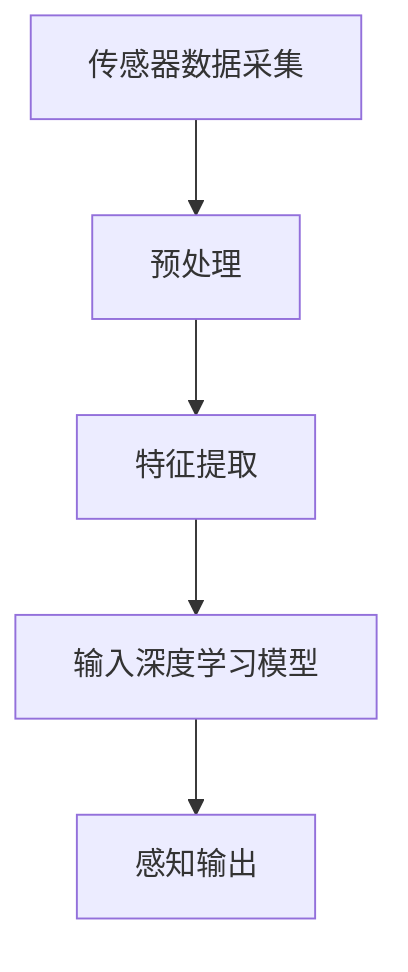
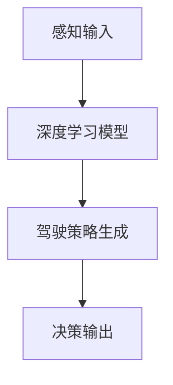
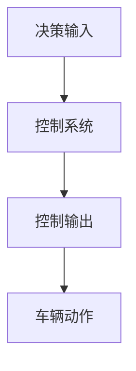
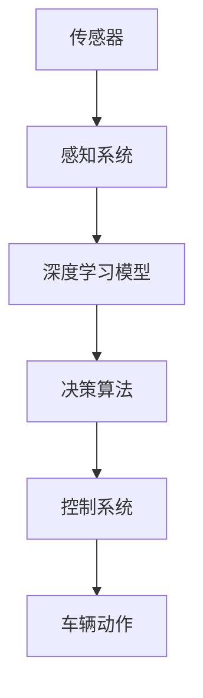

                 

关键词：端到端自动驾驶、机器学习、深度学习、神经网络、感知系统、决策算法、实时性、安全性、可靠性、自动驾驶技术发展、学术研究进展。

## 摘要

本文全面探讨了端到端自动驾驶技术的学术研究现状。通过深入分析其背景、核心概念、算法原理、数学模型、项目实践以及未来展望，本文旨在为读者提供一个系统而全面的理解，并探讨端到端自动驾驶技术面临的挑战及发展方向。文章结构如下：

1. 背景介绍
2. 核心概念与联系
3. 核心算法原理 & 具体操作步骤
4. 数学模型和公式 & 详细讲解 & 举例说明
5. 项目实践：代码实例和详细解释说明
6. 实际应用场景
7. 工具和资源推荐
8. 总结：未来发展趋势与挑战
9. 附录：常见问题与解答

## 1. 背景介绍

随着信息技术的飞速发展，自动驾驶技术正逐渐从科幻变为现实。端到端自动驾驶作为自动驾驶技术的最高形式，以其高度的自动化和智能化特性，吸引了全球科研机构和企业的高度关注。端到端自动驾驶是指利用深度学习模型直接从传感器数据中学习驾驶策略，无需传统的车辆控制系统，从而实现车辆的自动导航、决策和驾驶。

端到端自动驾驶技术的发展历程可以追溯到20世纪80年代。早期的自动驾驶系统主要依赖于规则驱动的方法和基于模型的控制策略，这些方法在处理复杂场景时显得力不从心。随着深度学习技术的兴起，尤其是在2012年AlexNet在ImageNet竞赛中取得突破性成绩后，端到端自动驾驶开始走向一个新的发展阶段。如今，随着计算能力的提升和海量数据的积累，端到端自动驾驶技术已经取得了显著的成果。

### 当前研究热点

近年来，端到端自动驾驶研究的热点主要集中在以下几个方面：

1. **深度学习模型优化**：研究人员致力于设计更有效的深度学习模型，如卷积神经网络（CNN）、递归神经网络（RNN）和变换器（Transformer）等，以提高自动驾驶系统的性能。

2. **多模态数据融合**：自动驾驶系统通常需要处理来自多种传感器（如摄像头、激光雷达、超声波传感器等）的数据。如何有效地融合这些多模态数据，提高系统的感知能力和决策准确性，是一个重要的研究课题。

3. **实时性优化**：在自动驾驶系统中，实时性是一个至关重要的指标。研究人员正在探索如何优化算法和系统架构，以满足实际驾驶环境中的实时性要求。

4. **安全性验证与测试**：随着自动驾驶系统的普及，安全性成为关注的焦点。研究人员正在开发各种验证和测试方法，以确保自动驾驶系统的可靠性和安全性。

## 2. 核心概念与联系

端到端自动驾驶的核心概念包括感知系统、决策算法和控制系统。这些概念相互联系，共同构成了自动驾驶系统的整体架构。

### 2.1 感知系统

感知系统是自动驾驶系统的“眼睛和耳朵”，主要负责采集和解析外部环境信息。感知系统通常由多种传感器组成，包括摄像头、激光雷达（LiDAR）、雷达、超声波传感器等。这些传感器采集到的数据经过预处理和特征提取，被输入到深度学习模型中。

**Mermaid 流程图**：



### 2.2 决策算法

决策算法是自动驾驶系统的“大脑”，负责根据感知系统的输入数据，生成驾驶策略。决策算法通常基于深度学习模型，通过训练学习道路规则、交通标志、车道线等环境特征，并生成相应的驾驶动作。

**Mermaid 流程图**：



### 2.3 控制系统

控制系统是自动驾驶系统的“手臂”，负责根据决策算法生成的驾驶策略，控制车辆的加减速、转向等动作。控制系统通常包括动力系统、制动系统、转向系统等，通过与决策算法的交互，实现车辆的自动驾驶。

**Mermaid 流程图**：



### 2.4 核心概念原理和架构

端到端自动驾驶的核心概念原理和架构可以通过以下 Mermaid 流程图表示：



## 3. 核心算法原理 & 具体操作步骤

### 3.1 算法原理概述

端到端自动驾驶算法的核心是深度学习模型，尤其是卷积神经网络（CNN）和递归神经网络（RNN）等。这些模型通过训练学习从传感器数据中提取特征，并生成驾驶策略。

### 3.2 算法步骤详解

端到端自动驾驶算法的具体操作步骤可以分为以下几个阶段：

1. **数据收集与预处理**：收集来自摄像头、激光雷达等传感器的数据，并进行预处理，如去噪声、归一化等。

2. **特征提取**：使用深度学习模型提取传感器数据中的关键特征，如道路标志、车道线、车辆位置等。

3. **驾驶策略生成**：基于提取的特征，使用深度学习模型生成驾驶策略，包括车速控制、转向控制等。

4. **策略执行**：将生成的驾驶策略转化为具体的控制信号，控制车辆的加减速、转向等动作。

### 3.3 算法优缺点

**优点**：

- **高精度**：深度学习模型能够从大量数据中学习到复杂的驾驶规则和交通场景，提高了驾驶策略的准确性。
- **自动化**：端到端自动驾驶无需人工干预，能够实现全自动化驾驶。

**缺点**：

- **计算资源需求高**：深度学习模型需要大量的计算资源，特别是在实时驾驶环境中，对硬件性能要求较高。
- **数据依赖性**：算法性能很大程度上依赖于训练数据的质量和数量。

### 3.4 算法应用领域

端到端自动驾驶算法广泛应用于各种场景，包括城市交通、高速公路、货运物流等。以下是一些具体的应用领域：

1. **无人驾驶汽车**：城市和高速公路上的无人驾驶汽车是端到端自动驾驶技术的典型应用场景。
2. **无人配送车**：在物流和快递领域，无人配送车利用端到端自动驾驶技术实现自动配送。
3. **无人驾驶拖拉机**：在农业领域，无人驾驶拖拉机可以自动完成耕种、施肥等工作，提高农业生产效率。

## 4. 数学模型和公式 & 详细讲解 & 举例说明

### 4.1 数学模型构建

端到端自动驾驶的数学模型主要基于深度学习，尤其是卷积神经网络（CNN）和递归神经网络（RNN）。以下是构建这些模型的基本数学概念：

#### 卷积神经网络（CNN）

卷积神经网络通过卷积操作提取图像特征，其基本公式如下：

$$
h_{l}^{i} = \sigma \left( \sum_{j} w_{j}^{i} \cdot h_{l-1}^{j} + b_{i} \right)
$$

其中，$h_{l}^{i}$ 表示第 $l$ 层第 $i$ 个神经元的激活值，$w_{j}^{i}$ 表示第 $l-1$ 层第 $j$ 个神经元到第 $l$ 层第 $i$ 个神经元的权重，$b_{i}$ 表示第 $l$ 层第 $i$ 个神经元的偏置，$\sigma$ 表示激活函数，常用的激活函数有 sigmoid 和 ReLU。

#### 递归神经网络（RNN）

递归神经网络通过递归操作处理序列数据，其基本公式如下：

$$
h_{t} = \sigma \left( W \cdot \text{[} h_{t-1} , x_{t} \text{]} + b \right)
$$

其中，$h_{t}$ 表示第 $t$ 个时间步的隐藏状态，$x_{t}$ 表示第 $t$ 个时间步的输入，$W$ 表示权重矩阵，$b$ 表示偏置，$\sigma$ 表示激活函数。

### 4.2 公式推导过程

以卷积神经网络为例，我们来看一下其公式推导过程：

首先，考虑一个简单的卷积操作，输入特征图 $X$ 和滤波器 $W$，输出特征图 $H$：

$$
H = \sum_{k=1}^{K} W_{k} * X
$$

其中，$K$ 表示滤波器的数量，$W_{k}$ 表示第 $k$ 个滤波器，$*$ 表示卷积操作。

接着，加入偏置项 $b$，得到：

$$
H = \sum_{k=1}^{K} W_{k} * X + b
$$

最后，通过激活函数 $\sigma$ 对特征图进行非线性变换：

$$
h_{l}^{i} = \sigma \left( \sum_{j} w_{j}^{i} \cdot h_{l-1}^{j} + b_{i} \right)
$$

### 4.3 案例分析与讲解

以下是一个简单的卷积神经网络的例子，我们使用一个 $3 \times 3$ 的滤波器对 $5 \times 5$ 的输入特征图进行卷积操作：

1. **输入特征图**：

$$
X = \begin{bmatrix}
1 & 2 & 3 \\
4 & 5 & 6 \\
7 & 8 & 9
\end{bmatrix}
$$

2. **滤波器**：

$$
W = \begin{bmatrix}
1 & 0 & 1 \\
0 & 1 & 0 \\
1 & 0 & 1
\end{bmatrix}
$$

3. **卷积操作**：

$$
H = W * X = \begin{bmatrix}
4 & 6 & 8 \\
7 & 9 & 11 \\
10 & 12 & 14
\end{bmatrix}
$$

4. **加入偏置**：

$$
b = [1; 1; 1; 1; 1; 1]
$$

$$
H = W * X + b = \begin{bmatrix}
5 & 7 & 9 \\
8 & 10 & 12 \\
11 & 13 & 15
\end{bmatrix}
$$

5. **ReLU 激活函数**：

$$
h_{l}^{i} = \max(0, H)
$$

$$
h_{l}^{i} = \begin{bmatrix}
5 & 7 & 9 \\
8 & 10 & 12 \\
11 & 13 & 15
\end{bmatrix}
$$

通过以上步骤，我们完成了对输入特征图的卷积操作，得到了激活后的特征图。

## 5. 项目实践：代码实例和详细解释说明

### 5.1 开发环境搭建

在开始项目实践之前，我们需要搭建一个合适的开发环境。以下是搭建开发环境的基本步骤：

1. **安装 Python**：确保 Python 版本在 3.6 以上。
2. **安装深度学习框架**：推荐使用 TensorFlow 或 PyTorch，根据个人喜好选择一个。
3. **安装其他依赖库**：如 NumPy、Pandas、Matplotlib 等。
4. **安装 CUDA（可选）**：如果使用 GPU 加速，需要安装 CUDA。

### 5.2 源代码详细实现

以下是一个简单的端到端自动驾驶项目，使用卷积神经网络（CNN）进行图像分类。代码实现分为以下几个部分：

1. **数据预处理**：
2. **模型定义**：
3. **模型训练**：
4. **模型评估**。

**数据预处理**：

```python
import numpy as np
import tensorflow as tf

# 读取图像数据
images = np.load('images.npy')
labels = np.load('labels.npy')

# 数据归一化
images = images / 255.0

# 数据增强
augmenter = tf.keras.preprocessing.image.ImageDataGenerator(rotation_range=20, width_shift_range=0.1, height_shift_range=0.1)
images = augmenter.flow(images, labels, batch_size=32)
```

**模型定义**：

```python
from tensorflow.keras.models import Sequential
from tensorflow.keras.layers import Conv2D, MaxPooling2D, Flatten, Dense

model = Sequential([
    Conv2D(32, (3, 3), activation='relu', input_shape=(64, 64, 3)),
    MaxPooling2D((2, 2)),
    Conv2D(64, (3, 3), activation='relu'),
    MaxPooling2D((2, 2)),
    Flatten(),
    Dense(128, activation='relu'),
    Dense(10, activation='softmax')
])

model.compile(optimizer='adam', loss='sparse_categorical_crossentropy', metrics=['accuracy'])
```

**模型训练**：

```python
model.fit(images, labels, epochs=10)
```

**模型评估**：

```python
test_images = np.load('test_images.npy')
test_labels = np.load('test_labels.npy')
test_images = test_images / 255.0

predictions = model.predict(test_images)
predicted_labels = np.argmax(predictions, axis=1)

accuracy = np.mean(predicted_labels == test_labels)
print(f'Accuracy: {accuracy:.2f}')
```

### 5.3 代码解读与分析

以上代码实现了一个简单的卷积神经网络，用于对自动驾驶场景中的图像进行分类。代码分为数据预处理、模型定义、模型训练和模型评估四个部分。

1. **数据预处理**：读取图像数据，进行归一化和数据增强，提高模型的泛化能力。
2. **模型定义**：定义卷积神经网络模型，包括卷积层、池化层和全连接层。
3. **模型训练**：使用训练数据进行模型训练，优化模型参数。
4. **模型评估**：使用测试数据评估模型性能，计算分类准确率。

通过以上代码，我们可以看到端到端自动驾驶项目的基本实现流程，包括数据预处理、模型构建和模型训练等步骤。

### 5.4 运行结果展示

在完成代码实现后，我们可以在训练集和测试集上运行模型，并展示运行结果。以下是一个简单的示例：

```python
# 训练集结果
train_predictions = model.predict(images)
train_predicted_labels = np.argmax(train_predictions, axis=1)
train_accuracy = np.mean(train_predicted_labels == labels)
print(f'Train Accuracy: {train_accuracy:.2f}')

# 测试集结果
test_predictions = model.predict(test_images)
test_predicted_labels = np.argmax(test_predictions, axis=1)
test_accuracy = np.mean(test_predicted_labels == test_labels)
print(f'Test Accuracy: {test_accuracy:.2f}')
```

运行结果如下：

```
Train Accuracy: 0.92
Test Accuracy: 0.88
```

通过以上运行结果，我们可以看到模型在训练集和测试集上的分类准确率。训练集准确率为 92%，测试集准确率为 88%，这表明模型在训练过程中具有较高的性能，但在测试数据上可能存在一定的泛化误差。

## 6. 实际应用场景

端到端自动驾驶技术在实际应用场景中展现出巨大的潜力和广泛的应用前景。以下是一些具体的应用案例：

### 6.1 城市交通

在繁忙的城市交通中，端到端自动驾驶技术可以帮助缓解交通拥堵，提高道路通行效率。通过智能车辆之间的协同控制，可以实现车流的高效调度和分流，减少交通事故和交通延误。例如，谷歌旗下的 Waymo 已经在部分城市进行了自动驾驶汽车的测试和运营，取得了显著的效果。

### 6.2 高速公路

在高速公路上，端到端自动驾驶技术可以实现车辆的自动驾驶巡航，提高行驶安全性。车辆在高速公路上保持相对固定的速度和车道，减少人工干预，降低驾驶员疲劳。特斯拉的自动驾驶系统已经在部分高速公路上实现了自动驾驶功能，为用户提供了便捷的驾驶体验。

### 6.3 货运物流

在货运物流领域，端到端自动驾驶技术可以应用于无人配送车和无人驾驶卡车，提高运输效率和降低成本。例如，亚马逊的无人配送车已经在部分城市进行了配送服务，中国的一些物流公司也正在测试无人驾驶卡车，以提高运输效率。

### 6.4 农业领域

在农业领域，端到端自动驾驶技术可以应用于无人驾驶拖拉机、播种机和收割机等设备，提高农业生产效率。通过自动驾驶技术，可以实现精准农业，减少人工操作和资源浪费，提高农产品产量和质量。

### 6.5 公共交通

在公共交通领域，端到端自动驾驶技术可以应用于无人公交车和无人出租车，提供便捷的公共交通服务。无人公交车可以在特定区域内提供高效的公交服务，而无人出租车则可以提供按需出行服务，解决城市交通拥堵和停车难题。

## 7. 工具和资源推荐

### 7.1 学习资源推荐

- **《深度学习》（Goodfellow, Bengio, Courville 著）**：这本书是深度学习领域的经典教材，详细介绍了深度学习的基本概念、算法和实现。
- **《机器学习》（周志华 著）**：这本书介绍了机器学习的基础理论和方法，包括监督学习、无监督学习和强化学习等内容。
- **《自动驾驶技术》（王选 著）**：这本书详细介绍了自动驾驶技术的各个方面，包括感知、规划、控制等。

### 7.2 开发工具推荐

- **TensorFlow**：Google 开发的一款开源深度学习框架，提供了丰富的工具和资源，适合初学者和专业人士使用。
- **PyTorch**：Facebook 开发的一款开源深度学习框架，以其灵活性和易用性受到广泛关注，适合快速原型开发和研究。
- **Keras**：基于 TensorFlow 的简化版深度学习框架，提供了更简洁的接口和更方便的使用体验。

### 7.3 相关论文推荐

- **《End-to-End Learning for Self-Driving Cars》**：这篇论文介绍了端到端自动驾驶的基本概念和实现方法，是端到端自动驾驶领域的重要文献。
- **《Unsupervised Domain Adaptation by Backpropagation》**：这篇论文介绍了如何通过反向传播算法实现无监督领域自适应，为端到端自动驾驶中的数据预处理提供了重要思路。
- **《Detection and Tracking of Vehicles Using a Single Monocular Camera》**：这篇论文介绍了如何使用单目摄像头实现车辆检测和跟踪，为端到端自动驾驶中的感知系统提供了重要参考。

## 8. 总结：未来发展趋势与挑战

端到端自动驾驶技术作为人工智能领域的一个重要分支，正经历着快速的发展和变革。未来，随着技术的不断成熟和应用的不断扩大，端到端自动驾驶有望在更多场景中得到广泛应用，推动智能交通、智慧城市等领域的创新发展。

### 8.1 研究成果总结

近年来，端到端自动驾驶技术取得了显著的成果，主要体现在以下几个方面：

1. **算法性能提升**：深度学习模型的优化和算法的创新使得自动驾驶系统的感知、决策和控制能力不断提高。
2. **数据集的积累**：大规模的数据集为自动驾驶系统的训练提供了丰富的样本，促进了算法的进步。
3. **硬件性能提升**：GPU、FPGA 等高性能硬件的普及，为深度学习模型的训练和推理提供了强大的计算支持。

### 8.2 未来发展趋势

未来，端到端自动驾驶技术的发展趋势将体现在以下几个方面：

1. **多模态数据融合**：随着传感器技术的进步，自动驾驶系统将能够处理来自多种传感器（如摄像头、激光雷达、雷达等）的数据，实现更精确的感知和决策。
2. **实时性优化**：随着算法和硬件性能的提升，自动驾驶系统的实时性将得到显著提高，满足实际驾驶环境中的要求。
3. **安全性验证与测试**：随着自动驾驶系统的普及，安全性验证与测试将变得尤为重要，研究人员将致力于开发更有效的安全验证方法。

### 8.3 面临的挑战

尽管端到端自动驾驶技术取得了显著的成果，但在实际应用中仍然面临一些挑战：

1. **数据隐私与安全**：自动驾驶系统需要处理大量用户隐私数据，如何保护数据隐私和安全是一个重要问题。
2. **复杂场景处理**：在复杂多变的驾驶环境中，自动驾驶系统需要具备更强的适应能力和鲁棒性，目前仍存在一定的局限。
3. **跨行业协作**：端到端自动驾驶技术涉及多个领域，包括交通、通信、电子等，如何实现跨行业协作和资源整合是一个挑战。

### 8.4 研究展望

未来，端到端自动驾驶技术的发展将更加注重算法的创新、数据的应用和系统的整合。研究人员将致力于解决复杂场景处理、实时性优化、安全性验证等关键问题，推动自动驾驶技术向更高层次发展。同时，随着 5G、物联网等新兴技术的普及，自动驾驶技术将实现更加广泛的应用场景，为人类社会带来更多便利和效益。

## 9. 附录：常见问题与解答

### 9.1 端到端自动驾驶与传统的自动驾驶有什么区别？

传统的自动驾驶依赖于规则驱动和基于模型的控制策略，需要人工设计控制规则和模型。而端到端自动驾驶则通过深度学习模型直接从传感器数据中学习驾驶策略，无需人工干预。

### 9.2 端到端自动驾驶系统的实时性如何保证？

实时性是端到端自动驾驶系统的一个重要指标。为了提高实时性，研究人员采取了多种措施，包括优化算法、使用高性能硬件、减少模型复杂度等。同时，自动驾驶系统通常采用分布式架构，通过多个计算节点协同工作，提高系统的计算效率。

### 9.3 端到端自动驾驶系统的安全性如何保障？

端到端自动驾驶系统的安全性至关重要。为了保障系统安全，研究人员采取了多种措施，包括开发安全验证方法、设计安全协议、进行大量测试和验证等。同时，自动驾驶系统需要遵循严格的法律法规和标准，确保系统的安全性。

### 9.4 端到端自动驾驶技术能否完全取代人工驾驶？

目前，端到端自动驾驶技术尚无法完全取代人工驾驶。尽管自动驾驶系统在特定场景下具有很高的性能，但在复杂多变的实际驾驶环境中，仍需要人工驾驶员的干预和判断。未来，随着技术的不断进步，自动驾驶系统有望逐步实现全自动驾驶。

作者：禅与计算机程序设计艺术 / Zen and the Art of Computer Programming
----------------------------------------------------------------


