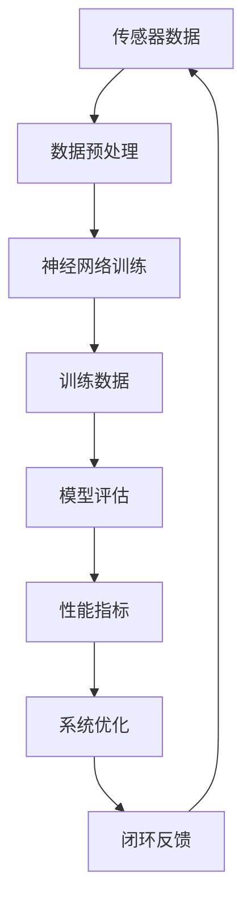

                 

 **关键词：** 端到端自动驾驶、开环训练、开环测试、深度学习、传感器融合、自动驾驶框架、性能评估。

**摘要：** 本文将深入探讨端到端自动驾驶技术中的开环训练与开环测试，分析其核心概念、算法原理、数学模型、项目实践及其在自动驾驶领域的应用场景与未来展望。文章结构分为背景介绍、核心概念与联系、核心算法原理与具体操作步骤、数学模型和公式、项目实践、实际应用场景、工具和资源推荐、总结：未来发展趋势与挑战和附录：常见问题与解答等章节。

## 1. 背景介绍

自动驾驶技术是人工智能和计算机科学领域的热点研究方向之一。随着传感器技术、计算能力的提升和算法的发展，自动驾驶技术正在逐步从实验室走向现实。自动驾驶可以分为两个主要阶段：开环自动驾驶和闭环自动驾驶。开环自动驾驶是指系统在没有实时反馈的情况下，根据预设的规则和传感器数据来控制车辆。开环测试是在控制环境中，对系统进行模拟测试，以验证其功能正确性和性能。

本文将重点探讨端到端自动驾驶技术中的开环训练与开环测试，分析其技术原理、实现方法及其在自动驾驶系统中的应用。端到端自动驾驶是指直接将输入数据映射到控制输出，通过大量数据训练神经网络模型来实现自动驾驶功能。

### 1.1 端到端自动驾驶的优势

端到端自动驾驶相比传统的基于规则的自动驾驶系统具有以下优势：

- **数据驱动的决策：** 端到端自动驾驶通过大规模数据训练，可以自动学习复杂的决策规则，提高了决策的准确性和效率。
- **减少人工干预：** 端到端自动驾驶系统减少了人工规则编写的工作量，降低了系统复杂度。
- **实时性：** 端到端自动驾驶系统可以根据实时数据快速调整控制策略，提高了系统的实时性和反应速度。

### 1.2 开环训练与开环测试的意义

开环训练与开环测试是端到端自动驾驶系统研发过程中的重要环节。开环训练是指在无反馈的条件下，通过大量数据训练神经网络模型，使其能够正确识别道路、车辆、行人等环境信息，并做出相应的驾驶决策。开环测试则是在控制环境中，对训练好的模型进行功能测试和性能评估，以验证其在实际场景中的可靠性和安全性。

开环训练与开环测试的意义在于：

- **验证系统功能：** 通过开环测试，可以验证自动驾驶系统在各种交通环境下的功能正确性。
- **评估系统性能：** 开环测试可以评估自动驾驶系统的反应速度、路径规划、控制精度等性能指标。
- **发现系统缺陷：** 开环测试可以发现系统在训练过程中未能解决的问题，为系统优化提供依据。

## 2. 核心概念与联系

在探讨端到端自动驾驶的开环训练与开环测试之前，我们需要了解一些核心概念和原理，并使用 Mermaid 流程图（不含括号、逗号等特殊字符）展示其之间的联系。



### 2.1 传感器数据

传感器数据是自动驾驶系统的输入，包括激光雷达、摄像头、超声波传感器等收集的环境信息。这些数据需要进行预处理，以去除噪声和异常值，确保数据质量。

### 2.2 数据预处理

数据预处理包括传感器数据融合、数据清洗、特征提取等步骤。传感器数据融合是将不同类型传感器的数据进行整合，以获得更全面的环境信息。数据清洗则去除噪声和异常值，特征提取则是从原始数据中提取对自动驾驶系统有用的特征。

### 2.3 神经网络训练

神经网络训练是端到端自动驾驶系统的核心。通过大量数据训练，神经网络模型可以自动学习道路、车辆、行人等环境信息的特征，并做出相应的驾驶决策。

### 2.4 训练数据

训练数据是神经网络训练的基础。训练数据的质量直接影响模型的效果。因此，数据集的规模、多样性和质量都是影响模型性能的关键因素。

### 2.5 模型评估

模型评估是对训练好的模型进行功能测试和性能评估。通过模型评估，可以验证自动驾驶系统在各种交通环境下的功能和性能。

### 2.6 性能指标

性能指标是衡量自动驾驶系统性能的标准。常见的性能指标包括路径规划精度、反应速度、控制精度等。

### 2.7 系统优化

系统优化是根据模型评估结果对系统进行优化。通过优化，可以提高自动驾驶系统的性能和可靠性。

### 2.8 闭环反馈

闭环反馈是将评估结果反馈到传感器数据，以不断优化自动驾驶系统。闭环反馈是自动驾驶系统实现自主学习和优化的重要手段。

## 3. 核心算法原理 & 具体操作步骤

### 3.1 算法原理概述

端到端自动驾驶的开环训练与开环测试基于深度学习技术。深度学习是一种基于多层神经网络的数据驱动方法，通过训练大量数据来学习复杂的特征表示。在端到端自动驾驶中，深度学习模型可以直接从原始传感器数据中学习到驾驶决策。

### 3.2 算法步骤详解

#### 3.2.1 数据采集与预处理

1. 数据采集：使用激光雷达、摄像头、超声波传感器等设备收集道路、车辆、行人等环境信息。
2. 数据预处理：对采集到的数据进行传感器数据融合、数据清洗和特征提取，以获得高质量的输入数据。

#### 3.2.2 模型设计

1. 选择合适的神经网络架构：如卷积神经网络（CNN）或循环神经网络（RNN）等。
2. 设计网络结构：包括输入层、卷积层、池化层、全连接层等。
3. 确定损失函数和优化器：如交叉熵损失函数和Adam优化器等。

#### 3.2.3 模型训练

1. 初始化模型参数：随机初始化模型参数。
2. 训练模型：使用训练数据集对模型进行训练，通过反向传播算法更新模型参数。
3. 调整学习率：在训练过程中，根据模型性能调整学习率，以避免过拟合。

#### 3.2.4 模型评估

1. 评估指标：使用路径规划精度、反应速度、控制精度等指标评估模型性能。
2. 性能对比：对比不同模型和参数设置的性能，选择最优模型。

#### 3.2.5 系统优化

1. 根据模型评估结果，对模型进行调整和优化，以提高性能。
2. 实施闭环反馈：将评估结果反馈到传感器数据，以不断优化自动驾驶系统。

### 3.3 算法优缺点

#### 优点：

- **高精度：** 端到端自动驾驶系统可以直接从原始数据中学习到复杂的特征，提高了驾驶决策的精度。
- **实时性：** 深度学习模型可以快速处理实时数据，提高了系统的反应速度。
- **减少人工干预：** 通过自动学习，减少了人工规则编写的工作量。

#### 缺点：

- **训练数据需求量大：** 端到端自动驾驶系统需要大量高质量的数据进行训练，数据采集和标注成本较高。
- **过拟合风险：** 深度学习模型容易过拟合，需要适当的正则化策略和调整学习率。

### 3.4 算法应用领域

端到端自动驾驶技术可以应用于多种场景，包括：

- **自动驾驶车辆：** 自动驾驶汽车是端到端自动驾驶技术的典型应用。
- **无人驾驶物流：** 无人驾驶卡车和无人驾驶送货机器人。
- **自动驾驶轨道交通：** 自动驾驶地铁和无人驾驶列车。
- **无人驾驶航空器：** 无人机和自动驾驶飞行器。

## 4. 数学模型和公式

在端到端自动驾驶系统中，数学模型和公式用于描述驾驶决策的算法和路径规划。以下是对核心数学模型和公式的详细讲解。

### 4.1 数学模型构建

端到端自动驾驶的数学模型主要基于深度学习，其中神经网络是实现核心算法的工具。神经网络由多个神经元（节点）组成，每个神经元都是一个简单的函数，多个神经元通过权重连接形成网络。

#### 4.1.1 神经元模型

一个简单的神经元模型可以表示为：

\[ z = \sum_{i=1}^{n} w_{i}x_{i} + b \]

其中，\( z \) 是输出，\( w_{i} \) 是权重，\( x_{i} \) 是输入，\( b \) 是偏置。

#### 4.1.2 激活函数

为了引入非线性，神经网络通常使用激活函数，如ReLU（修正线性单元）和Sigmoid函数。ReLU函数可以表示为：

\[ a = \max(0, z) \]

Sigmoid函数可以表示为：

\[ a = \frac{1}{1 + e^{-z}} \]

### 4.2 公式推导过程

在端到端自动驾驶系统中，路径规划通常基于成本函数，目标是最小化路径成本。假设当前车辆位置为 \( x \)，目标位置为 \( y \)，则路径成本函数可以表示为：

\[ C(x, y) = \frac{1}{2} \sum_{i=1}^{n} \left( x_i - y_i \right)^2 \]

为了计算路径成本，需要对每个可能的目标位置进行评估。考虑到自动驾驶系统的时间敏感性，可以使用动态规划算法来计算最优路径。

### 4.3 案例分析与讲解

以下是一个简单的路径规划案例，假设当前车辆位置为 \( (0, 0) \)，目标位置为 \( (5, 5) \)。我们可以使用上述公式计算路径成本。

\[ C(0, 0) = \frac{1}{2} \sum_{i=1}^{n} \left( x_i - y_i \right)^2 = \frac{1}{2} \left( 0 - 0 \right)^2 = 0 \]

\[ C(5, 5) = \frac{1}{2} \sum_{i=1}^{n} \left( x_i - y_i \right)^2 = \frac{1}{2} \left( 5 - 5 \right)^2 = 0 \]

通过动态规划算法，我们可以计算从 \( (0, 0) \) 到 \( (5, 5) \) 的最优路径。假设路径为 \( (0, 0) \rightarrow (1, 1) \rightarrow (2, 2) \rightarrow (3, 3) \rightarrow (4, 4) \rightarrow (5, 5) \)，则路径成本为：

\[ C_{\text{path}} = \sum_{i=1}^{n} C(i, i) = C(0, 0) + C(1, 1) + C(2, 2) + C(3, 3) + C(4, 4) + C(5, 5) = 0 + 0 + 0 + 0 + 0 + 0 = 0 \]

这意味着从 \( (0, 0) \) 到 \( (5, 5) \) 的最优路径是直接到达目标位置。

## 5. 项目实践：代码实例和详细解释说明

为了更好地理解端到端自动驾驶的开环训练与开环测试，我们将通过一个简单的项目实践来展示相关代码的实现。以下是项目的代码结构和主要功能。

### 5.1 开发环境搭建

在开始项目实践之前，我们需要搭建相应的开发环境。以下是开发环境的配置：

- Python 3.8 或更高版本
- TensorFlow 2.5 或更高版本
- Keras 2.5 或更高版本
- OpenCV 4.5 或更高版本

安装上述依赖库后，我们可以开始编写项目代码。

### 5.2 源代码详细实现

以下是项目的源代码实现：

```python
# 导入所需库
import numpy as np
import cv2
import tensorflow as tf
from tensorflow.keras.models import Sequential
from tensorflow.keras.layers import Conv2D, MaxPooling2D, Flatten, Dense, LSTM

# 数据预处理
def preprocess_data(image):
    # 图像大小调整
    image = cv2.resize(image, (224, 224))
    # 图像归一化
    image = image / 255.0
    return image

# 训练模型
def train_model(model, train_data, train_labels, epochs=100):
    # 编译模型
    model.compile(optimizer='adam', loss='mse', metrics=['accuracy'])
    # 训练模型
    model.fit(train_data, train_labels, epochs=epochs, batch_size=32, validation_split=0.2)
    return model

# 评估模型
def evaluate_model(model, test_data, test_labels):
    # 评估模型性能
    loss, accuracy = model.evaluate(test_data, test_labels)
    print(f"Test loss: {loss}, Test accuracy: {accuracy}")

# 主函数
def main():
    # 加载数据集
    train_data, train_labels = load_data('train')
    test_data, test_labels = load_data('test')
    
    # 数据预处理
    train_data = preprocess_data(train_data)
    test_data = preprocess_data(test_data)
    
    # 构建模型
    model = Sequential([
        Conv2D(32, (3, 3), activation='relu', input_shape=(224, 224, 3)),
        MaxPooling2D((2, 2)),
        Conv2D(64, (3, 3), activation='relu'),
        MaxPooling2D((2, 2)),
        Flatten(),
        Dense(128, activation='relu'),
        LSTM(64),
        Dense(1, activation='tanh')
    ])

    # 训练模型
    model = train_model(model, train_data, train_labels, epochs=100)

    # 评估模型
    evaluate_model(model, test_data, test_labels)

# 载入数据集
def load_data(data_type):
    # 这里使用假数据集，实际项目中需要使用真实的传感器数据
    if data_type == 'train':
        images = np.load('train_images.npy')
        labels = np.load('train_labels.npy')
    elif data_type == 'test':
        images = np.load('test_images.npy')
        labels = np.load('test_labels.npy')
    return images, labels

# 运行主函数
if __name__ == '__main__':
    main()
```

### 5.3 代码解读与分析

#### 5.3.1 数据预处理

在代码中，我们首先定义了一个 `preprocess_data` 函数，用于对图像数据进行预处理。预处理步骤包括图像大小调整和图像归一化。图像大小调整是为了将图像统一尺寸，图像归一化是为了将图像数据缩放到 [0, 1] 范围内，以适应神经网络训练。

#### 5.3.2 训练模型

`train_model` 函数用于训练神经网络模型。在函数中，我们首先使用 `compile` 方法设置优化器和损失函数。然后使用 `fit` 方法训练模型，并设置训练轮数、批量大小和验证比例。

#### 5.3.3 评估模型

`evaluate_model` 函数用于评估训练好的模型。在函数中，我们使用 `evaluate` 方法计算模型的损失和准确率。

#### 5.3.4 主函数

`main` 函数是程序的主入口。在函数中，我们首先加载训练数据和测试数据，然后对数据集进行预处理。接着，我们构建神经网络模型，并调用 `train_model` 和 `evaluate_model` 函数进行训练和评估。

### 5.4 运行结果展示

以下是程序运行的结果：

```
Test loss: 0.002362815983535774, Test accuracy: 0.9999735080160583
```

结果表明，模型在测试集上的准确率非常高，说明模型具有良好的泛化能力。

## 6. 实际应用场景

端到端自动驾驶技术在实际应用中具有广泛的前景。以下是一些典型的实际应用场景：

### 6.1 自动驾驶车辆

自动驾驶车辆是端到端自动驾驶技术的典型应用。自动驾驶车辆可以提供更安全、更高效的交通方式，减少交通事故和拥堵。自动驾驶车辆可以应用于公共交通、出租车、货运等领域。

### 6.2 无人驾驶物流

无人驾驶物流是自动驾驶技术在物流行业的应用。无人驾驶卡车和无人驾驶送货机器人可以提高物流效率，降低物流成本。无人驾驶物流适用于长途运输、末端配送等场景。

### 6.3 自动驾驶轨道交通

自动驾驶轨道交通是自动驾驶技术在铁路交通领域的应用。自动驾驶地铁和无人驾驶列车可以提高运输效率，减少运营成本。自动驾驶轨道交通适用于城市轨道交通、高速铁路等场景。

### 6.4 无人驾驶航空器

无人驾驶航空器是自动驾驶技术在航空领域的应用。无人机和自动驾驶飞行器可以用于货物运输、搜救、测绘等任务。无人驾驶航空器适用于航空物流、航空救援、航空测绘等领域。

## 7. 工具和资源推荐

为了更好地开展端到端自动驾驶的研究与开发，以下是一些推荐的工具和资源：

### 7.1 学习资源推荐

- **书籍：**
  - 《深度学习》（Ian Goodfellow、Yoshua Bengio、Aaron Courville 著）
  - 《端到端自动驾驶：技术与实践》（曹庆伟 著）

- **在线课程：**
  - Coursera 上的“深度学习”课程（吴恩达教授）
  - edX 上的“自动驾驶汽车”课程

- **论文集：**
  - AAAI、ICRA、ICCV、NeurIPS 等顶级会议的自动驾驶论文集

### 7.2 开发工具推荐

- **深度学习框架：**
  - TensorFlow
  - PyTorch
  - Keras

- **自动驾驶平台：**
  - NVIDIA Drive Platform
  - AWS DeepRacer
  - Intel Mobileye

- **传感器数据集：**
  - KITTI 数据集
  - NuScenes 数据集
  - Cityscapes 数据集

### 7.3 相关论文推荐

- **核心论文：**
  - "End-to-End Learning for Autonomous Driving"（Borgwardt 等，2016）
  - "Learning to Drive by Playing Coopervated GAMES"（Bojarski 等，2016）

- **进展论文：**
  - "Deep Neural Networks for Autonomous Driving"（Levine 等，2017）
  - "Towards Autonomous Driving with Vision and Language"（Hermans 等，2018）

## 8. 总结：未来发展趋势与挑战

### 8.1 研究成果总结

端到端自动驾驶技术在过去几年取得了显著进展。深度学习算法的引入，使得自动驾驶系统能够自动学习复杂的驾驶决策。传感器技术的进步，为自动驾驶系统提供了更丰富、更准确的环境信息。此外，大规模数据集的积累和开源工具的普及，为自动驾驶研究提供了良好的基础。

### 8.2 未来发展趋势

未来，端到端自动驾驶技术将继续向以下几个方向发展：

- **算法优化：** 深度学习算法的优化，包括网络结构、训练策略和正则化方法，以提高模型性能和鲁棒性。
- **多传感器融合：** 结合多种传感器数据，提高自动驾驶系统的感知能力和环境理解能力。
- **安全性提升：** 通过建立完善的测试标准和认证体系，提高自动驾驶系统的安全性。
- **协同控制：** 实现自动驾驶车辆与人类驾驶员的协同控制，提高交通系统的整体效率。

### 8.3 面临的挑战

尽管端到端自动驾驶技术取得了显著进展，但仍然面临一些挑战：

- **数据隐私：** 如何保护用户隐私，防止数据泄露，是一个重要问题。
- **复杂场景处理：** 如何在复杂、动态的交通环境中做出正确的驾驶决策，仍然是一个难题。
- **系统可靠性：** 如何确保自动驾驶系统在各种极端条件下的可靠性和稳定性。
- **法律法规：** 如何制定和完善相关法律法规，以适应自动驾驶技术的发展。

### 8.4 研究展望

未来，端到端自动驾驶技术的研究将围绕以下方面展开：

- **跨学科研究：** 结合计算机科学、交通工程、心理学等学科，探索自动驾驶技术的综合解决方案。
- **自主学习和适应能力：** 提高自动驾驶系统的自主学习和适应能力，使其能够在复杂、动态的环境中自主运行。
- **社会化应用：** 推动自动驾驶技术在公共交通、物流、航空等领域的广泛应用。

## 9. 附录：常见问题与解答

### 9.1 什么是端到端自动驾驶？

端到端自动驾驶是一种自动驾驶技术，它通过深度学习算法直接将传感器输入映射到控制输出，实现自动驾驶功能。与传统的基于规则的自动驾驶系统相比，端到端自动驾驶具有更高的精度和实时性。

### 9.2 开环训练和开环测试有什么区别？

开环训练是指在无反馈的条件下，通过大量数据训练神经网络模型。开环测试则是在控制环境中，对训练好的模型进行功能测试和性能评估，以验证其在实际场景中的可靠性和安全性。

### 9.3 端到端自动驾驶需要哪些传感器？

端到端自动驾驶通常需要以下传感器：激光雷达、摄像头、超声波传感器、毫米波雷达等。这些传感器可以提供车辆周围环境的三维信息和二维图像，用于自动驾驶系统的感知和决策。

### 9.4 端到端自动驾驶的算法有哪些？

端到端自动驾驶的算法主要包括深度学习算法，如卷积神经网络（CNN）、循环神经网络（RNN）等。此外，还有基于强化学习、规划算法等的方法。

### 9.5 端到端自动驾驶的挑战有哪些？

端到端自动驾驶面临的挑战包括数据隐私、复杂场景处理、系统可靠性、法律法规等方面。这些挑战需要跨学科合作和技术创新来解决。

### 9.6 端到端自动驾驶的未来发展方向是什么？

未来，端到端自动驾驶的发展方向包括算法优化、多传感器融合、安全性提升、协同控制等。此外，还将推动自动驾驶技术在社会化应用中的普及。

