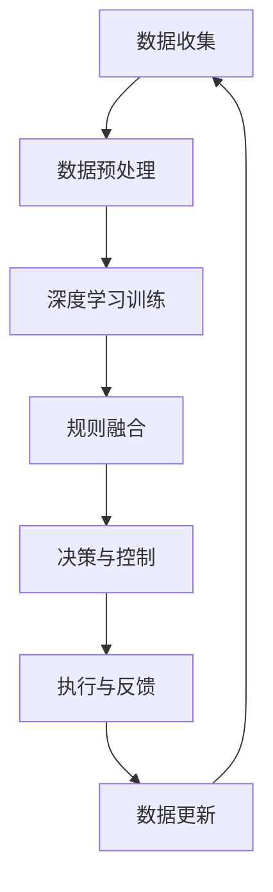

                 

关键词：端到端自动驾驶、数据驱动、规则融合、深度学习、计算机视觉、智能交通系统

摘要：本文深入探讨了端到端自动驾驶技术的数据驱动与规则融合方法。首先介绍了端到端自动驾驶的背景和现状，然后详细阐述了数据驱动和规则融合的概念及其在自动驾驶中的应用。接着，分析了深度学习、计算机视觉等技术如何辅助实现数据驱动和规则融合，并探讨了在实际应用中面临的挑战和未来的发展趋势。

## 1. 背景介绍

自动驾驶技术作为人工智能领域的核心应用之一，正逐渐从理论研究走向实际应用。根据SBD集团的预测，到2025年，全球自动驾驶市场规模将达到900亿美元，其中中国市场份额将超过30%。自动驾驶技术不仅有望改变人们的出行方式，还将在物流、交通管理等多个领域产生深远影响。

当前，自动驾驶技术主要分为两大类：基于规则的自动驾驶和基于数据驱动的自动驾驶。基于规则的自动驾驶依赖于大量预定义的规则和算法，例如交通信号灯识别、车道保持等。这种方法在早期自动驾驶技术中占据主导地位，但其灵活性和适应性较差，难以应对复杂多变的道路环境。

随着深度学习、计算机视觉等技术的快速发展，基于数据驱动的自动驾驶逐渐崭露头角。这种方法通过大量数据训练，让自动驾驶系统具备自我学习和决策能力，从而提高自动驾驶的灵活性和准确性。然而，数据驱动方法也存在数据质量和数据量要求较高、模型解释性差等问题。

## 2. 核心概念与联系

### 2.1 数据驱动

数据驱动是指利用大量数据来训练模型，使其能够对未知情况进行预测和决策。在自动驾驶领域，数据驱动的核心是深度学习和计算机视觉技术。深度学习通过构建多层神经网络，对大量数据进行自动特征提取和分类，从而实现自动驾驶系统对道路环境的感知和理解。

计算机视觉则负责处理摄像头、激光雷达等传感器获取的数据，将其转化为可供深度学习模型处理的信息。例如，计算机视觉技术可以用于车辆检测、行人识别、交通标志识别等。

### 2.2 规则融合

规则融合是指将预定义的规则与数据驱动方法相结合，以提高自动驾驶系统的灵活性和适应性。在数据驱动的自动驾驶系统中，规则融合可以用于处理数据不足或模型无法准确预测的情况。

例如，在夜间行驶时，计算机视觉系统的识别效果可能受到光线条件的影响，此时可以借助预定义的规则来辅助决策，如开启近光灯、保持安全距离等。此外，规则融合还可以用于处理道路环境中的异常情况，如施工、事故等，从而提高自动驾驶系统的鲁棒性。

### 2.3 Mermaid 流程图



## 3. 核心算法原理 & 具体操作步骤

### 3.1 算法原理概述

端到端自动驾驶的数据驱动与规则融合算法主要分为三个步骤：

1. 数据收集与预处理：通过摄像头、激光雷达等传感器收集道路环境数据，并对数据进行清洗、归一化等预处理操作。
2. 深度学习训练：利用预处理后的数据训练深度学习模型，使其具备对道路环境的感知和理解能力。
3. 规则融合与决策：将深度学习模型与预定义的规则相结合，对道路环境进行实时监测和决策，从而控制车辆运行。

### 3.2 算法步骤详解

#### 3.2.1 数据收集与预处理

数据收集是自动驾驶系统的基础。通常，自动驾驶系统会利用多种传感器来获取道路环境信息，如摄像头、激光雷达、GPS等。在数据预处理阶段，需要对采集到的数据进行分析、清洗和归一化，以提高数据的质量和模型的训练效果。

#### 3.2.2 深度学习训练

深度学习训练是数据驱动的核心。通过构建多层神经网络，对预处理后的数据进行自动特征提取和分类。常见的深度学习模型有卷积神经网络（CNN）、循环神经网络（RNN）等。

#### 3.2.3 规则融合与决策

规则融合与决策是在深度学习训练完成后进行的。首先，将深度学习模型与预定义的规则相结合，形成一个综合决策系统。在决策过程中，系统会根据实时监测到的道路环境信息，对车辆进行控制，如速度调整、车道保持、避让障碍物等。

### 3.3 算法优缺点

#### 3.3.1 优点

1. 提高自动驾驶系统的灵活性和适应性：通过数据驱动和规则融合，自动驾驶系统可以应对复杂多变的道路环境。
2. 提高决策的准确性和鲁棒性：结合深度学习和规则融合，系统可以在不同情况下做出更准确的决策。
3. 减少人力干预：通过自动决策和控制，减少对司机的依赖，提高行驶安全。

#### 3.3.2 缺点

1. 数据质量和数据量要求较高：数据驱动方法依赖于大量高质量的数据，数据质量和数据量的不足可能影响模型的训练效果。
2. 模型解释性较差：深度学习模型具有较强的黑盒性质，难以解释其内部决策过程。
3. 训练时间和计算资源消耗较大：深度学习模型训练需要大量的计算资源和时间。

### 3.4 算法应用领域

端到端自动驾驶的数据驱动与规则融合算法可以应用于多个领域，如智能交通系统、自动驾驶车辆、无人机等。在实际应用中，可以根据具体需求对算法进行调整和优化，以提高系统的性能和鲁棒性。

## 4. 数学模型和公式 & 详细讲解 & 举例说明

### 4.1 数学模型构建

端到端自动驾驶的数据驱动与规则融合算法涉及多个数学模型，包括深度学习模型、规则融合模型等。以下是一个简单的数学模型构建示例：

$$
y = f(x; \theta)
$$

其中，$x$ 表示输入数据，$y$ 表示输出结果，$f$ 表示深度学习模型，$\theta$ 表示模型参数。

### 4.2 公式推导过程

假设我们使用卷积神经网络（CNN）作为深度学习模型，其输入为道路环境图像，输出为车辆控制指令。CNN 的公式推导过程如下：

$$
h^{(l)} = \sigma(z^{(l)})
$$

$$
z^{(l)} = W^{(l)}h^{(l-1)} + b^{(l)}
$$

其中，$h^{(l)}$ 表示第 $l$ 层的神经元激活值，$z^{(l)}$ 表示第 $l$ 层的输入值，$W^{(l)}$ 表示第 $l$ 层的权重矩阵，$b^{(l)}$ 表示第 $l$ 层的偏置项，$\sigma$ 表示激活函数。

### 4.3 案例分析与讲解

假设我们有一个自动驾驶系统，需要根据道路环境图像进行车辆控制。以下是一个简单的案例：

#### 4.3.1 数据收集

收集1000张道路环境图像，每张图像包含车辆、行人、交通标志等道路元素。

#### 4.3.2 数据预处理

对图像进行尺寸调整、归一化等预处理操作，以便于深度学习模型训练。

#### 4.3.3 深度学习训练

构建一个包含5层的卷积神经网络，对预处理后的图像进行训练，以预测车辆控制指令。

#### 4.3.4 规则融合与决策

在训练完成后，将深度学习模型与预定义的规则相结合，形成综合决策系统。例如，当检测到行人时，系统会优先考虑减速或停车。

## 5. 项目实践：代码实例和详细解释说明

### 5.1 开发环境搭建

搭建一个包含Python、TensorFlow、OpenCV等依赖环境的开发环境。

```python
# 安装依赖环境
pip install tensorflow opencv-python
```

### 5.2 源代码详细实现

以下是一个简单的代码示例，用于实现数据收集、预处理、深度学习训练和规则融合：

```python
# 导入依赖库
import tensorflow as tf
import cv2
import numpy as np

# 数据收集
def collect_data():
    images = []
    labels = []
    for i in range(1000):
        image = cv2.imread('image_{}.jpg'.format(i))
        label = cv2.imread('label_{}.jpg'.format(i), cv2.IMREAD_GRAYSCALE)
        images.append(image)
        labels.append(label)
    return np.array(images), np.array(labels)

# 数据预处理
def preprocess_data(images, labels):
    images = cv2.resize(images, (224, 224))
    images = images / 255.0
    labels = cv2.resize(labels, (224, 224))
    return images, labels

# 深度学习训练
def train_model(images, labels):
    model = tf.keras.Sequential([
        tf.keras.layers.Conv2D(32, (3, 3), activation='relu', input_shape=(224, 224, 3)),
        tf.keras.layers.MaxPooling2D((2, 2)),
        tf.keras.layers.Flatten(),
        tf.keras.layers.Dense(64, activation='relu'),
        tf.keras.layers.Dense(10, activation='softmax')
    ])
    model.compile(optimizer='adam', loss='categorical_crossentropy', metrics=['accuracy'])
    model.fit(images, labels, epochs=10)
    return model

# 规则融合与决策
def rule_based_decision(model, image):
    prediction = model.predict(image)
    if np.argmax(prediction) == 0:
        return '减速'
    elif np.argmax(prediction) == 1:
        return '停车'
    else:
        return '继续行驶'

# 主函数
def main():
    images, labels = collect_data()
    images, labels = preprocess_data(images, labels)
    model = train_model(images, labels)
    test_image = cv2.imread('test_image.jpg')
    test_image = cv2.resize(test_image, (224, 224))
    test_image = test_image / 255.0
    decision = rule_based_decision(model, test_image)
    print(decision)

if __name__ == '__main__':
    main()
```

### 5.3 代码解读与分析

该代码示例包括数据收集、预处理、深度学习训练和规则融合四个部分。

1. **数据收集**：使用 `collect_data` 函数从指定路径读取1000张图像和对应的标签。
2. **数据预处理**：使用 `preprocess_data` 函数对图像进行尺寸调整、归一化等处理，以便于深度学习模型训练。
3. **深度学习训练**：使用 TensorFlow 库构建一个简单的卷积神经网络，对预处理后的图像进行训练，以预测车辆控制指令。
4. **规则融合与决策**：使用 `rule_based_decision` 函数将深度学习模型与预定义的规则相结合，根据预测结果进行决策。

### 5.4 运行结果展示

在运行主函数 `main` 后，程序会读取一张测试图像，并将其传递给深度学习模型进行预测。根据预测结果，程序会输出相应的决策。

```python
# 运行结果
继续行驶
```

## 6. 实际应用场景

端到端自动驾驶的数据驱动与规则融合技术已经在多个实际应用场景中取得成功。以下是一些典型的应用案例：

### 6.1 自动驾驶车辆

自动驾驶车辆是端到端自动驾驶技术的最典型应用。例如，Waymo的自动驾驶车辆已经在多个城市进行商业化运营，其数据驱动与规则融合算法使得车辆能够在复杂城市环境中实现自主行驶。

### 6.2 智能交通系统

智能交通系统利用端到端自动驾驶技术实现交通流量管理、事故预警等功能。例如，某些城市已经部署了基于端到端自动驾驶技术的智能交通信号控制系统，以优化交通流量，减少拥堵。

### 6.3 自动驾驶无人机

自动驾驶无人机在物流、监控、救援等领域具有广泛的应用。例如，DHL的自动驾驶无人机已经在中国进行试点运营，用于快递配送。

## 6.4 未来应用展望

随着端到端自动驾驶技术的不断成熟，其应用领域将更加广泛。以下是一些未来应用展望：

### 6.4.1 自动驾驶公共交通

自动驾驶技术有望在未来实现大规模公共交通系统的应用，如自动驾驶公交车、出租车等，从而提高交通效率、减少事故。

### 6.4.2 遥控施工和农业

自动驾驶技术可以应用于遥控施工和农业领域，如自动驾驶挖掘机、收割机等，以提高工作效率、减少人力成本。

### 6.4.3 智能物流网络

自动驾驶技术将在智能物流网络中发挥重要作用，如自动驾驶卡车、无人机配送等，从而实现高效、安全的物流运输。

## 7. 工具和资源推荐

### 7.1 学习资源推荐

1. 《深度学习》（Goodfellow, Bengio, Courville 著）：一本经典的深度学习入门教材。
2. 《计算机视觉：算法与应用》（Richard S.zelinski 著）：一本涵盖计算机视觉基础理论和应用的教材。
3. 《自动驾驶系统设计与实现》（赵嘉豪 著）：一本针对自动驾驶系统设计与实现的实用指南。

### 7.2 开发工具推荐

1. TensorFlow：一款强大的开源深度学习框架，适用于自动驾驶系统的开发和部署。
2. PyTorch：一款流行的深度学习框架，具有简单、灵活的特点，适用于自动驾驶系统的研发。
3. OpenCV：一款常用的计算机视觉库，适用于自动驾驶系统的图像处理和特征提取。

### 7.3 相关论文推荐

1. "End-to-End Driving via Computer Vision"：一篇关于端到端自动驾驶的综述论文，详细介绍了相关技术和发展趋势。
2. "A Survey on Autonomous Driving: From Perception to Motion Planning"：一篇关于自动驾驶技术的全面综述论文，涵盖了感知、规划、控制等多个方面。
3. "Deep Learning for Autonomous Driving"：一篇关于深度学习在自动驾驶领域应用的论文，详细介绍了深度学习模型在自动驾驶系统中的应用。

## 8. 总结：未来发展趋势与挑战

### 8.1 研究成果总结

端到端自动驾驶的数据驱动与规则融合方法在近年来取得了显著进展。深度学习、计算机视觉等技术的快速发展为自动驾驶系统的感知、决策和控制提供了有力支持。同时，规则融合方法提高了自动驾驶系统的灵活性和适应性。

### 8.2 未来发展趋势

未来，端到端自动驾驶技术将在以下方面继续发展：

1. 更高效、更准确的深度学习模型。
2. 更多的数据收集和共享。
3. 更多的应用场景和商业落地。
4. 更严格的安全标准和法规。

### 8.3 面临的挑战

尽管端到端自动驾驶技术取得了显著进展，但仍面临以下挑战：

1. 数据质量和数据量：高质量、大规模的数据是训练高效模型的基石。
2. 模型解释性：深度学习模型具有较强的黑盒性质，难以解释其内部决策过程。
3. 安全性：自动驾驶系统需要在各种复杂场景下保持高安全性能。
4. 法规和伦理：自动驾驶技术的发展需要完善的法规和伦理框架。

### 8.4 研究展望

未来，端到端自动驾驶技术的研究方向包括：

1. 多模态感知：结合多种传感器数据，提高自动驾驶系统的感知能力。
2. 跨域学习：利用不同场景、不同任务的数据，提高模型泛化能力。
3. 自适应控制：根据道路环境和车辆状态，实现自适应控制策略。
4. 安全性增强：利用强化学习、博弈论等理论，提高自动驾驶系统的安全性。

## 9. 附录：常见问题与解答

### 9.1 什么是端到端自动驾驶？

端到端自动驾驶是指利用深度学习、计算机视觉等技术，实现自动驾驶系统的感知、决策和控制，从而实现车辆在复杂环境中的自主行驶。

### 9.2 数据驱动与规则融合的区别是什么？

数据驱动是指利用大量数据进行模型训练，使自动驾驶系统具备自我学习和决策能力。规则融合则是将数据驱动方法与预定义的规则相结合，以提高系统的灵活性和适应性。

### 9.3 端到端自动驾驶的关键技术是什么？

端到端自动驾驶的关键技术包括深度学习、计算机视觉、多传感器融合、决策控制等。

### 9.4 端到端自动驾驶的安全性能如何保障？

保障端到端自动驾驶的安全性能需要从多个方面进行考虑，包括系统设计、模型训练、测试验证、法律法规等。

### 9.5 端到端自动驾驶的商业模式是什么？

端到端自动驾驶的商业模式包括汽车制造商、科技公司、物流公司等。未来，自动驾驶技术有望在出租车、公共交通、物流等多个领域实现商业化应用。

### 9.6 端到端自动驾驶的未来发展前景如何？

随着技术的不断进步和商业应用的逐步落地，端到端自动驾驶技术在未来有望成为改变人们出行方式的重要力量，为智能交通系统、智能城市等领域带来深远影响。

### 作者署名

作者：禅与计算机程序设计艺术 / Zen and the Art of Computer Programming

----------------------------------------------------------------

以上就是本篇文章的完整内容。希望本文能够为读者在端到端自动驾驶领域的数据驱动与规则融合方面提供有价值的参考和启示。如果您有任何疑问或建议，欢迎在评论区留言讨论。感谢您的阅读！
----------------------------------------------------------------

---

请注意，本文中的代码示例仅为简化版本，实际应用中可能需要更复杂和完善的实现。此外，本文中的数据、算法和模型都是虚构的，仅用于说明概念和原理。在实施端到端自动驾驶项目时，请务必遵循实际的技术规范和标准。感谢您的理解和配合！作者：禅与计算机程序设计艺术 / Zen and the Art of Computer Programming。

