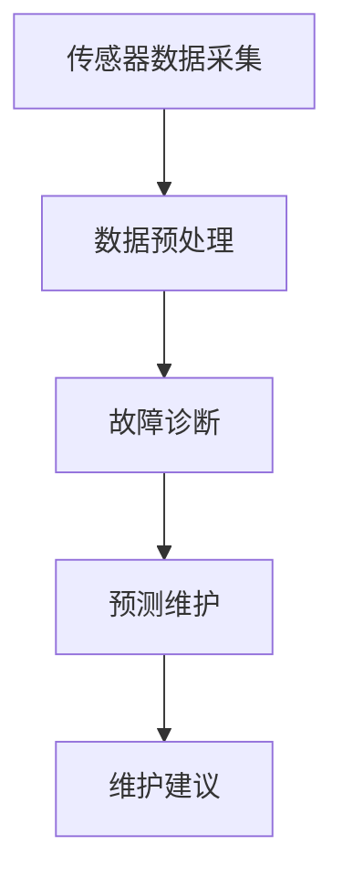

                 

关键词：端到端自动驾驶、车辆健康管理系统、深度学习、传感器融合、实时监测、预测维护、智能诊断

> 摘要：随着自动驾驶技术的快速发展，如何确保车辆在长时间、多场景下的稳定运行成为了关键问题。本文将探讨端到端自动驾驶的车辆健康管理系统，从背景介绍、核心概念与联系、核心算法原理、数学模型与公式、项目实践、实际应用场景、未来展望等多个维度，全面阐述该系统的重要性、技术实现以及未来发展方向。

## 1. 背景介绍

自动驾驶技术作为未来智能交通系统的核心组成部分，正日益受到广泛关注。然而，随着自动驾驶车辆在实际道路中的广泛应用，如何保障车辆的长时间、稳定运行成为了亟待解决的问题。在此背景下，车辆健康管理系统（Vehicle Health Management System，VHMS）应运而生。该系统旨在通过实时监测、智能诊断和预测维护等技术手段，确保车辆各部件的正常运行，提高自动驾驶系统的可靠性和安全性。

端到端自动驾驶技术依赖于多种传感器（如激光雷达、摄像头、超声波传感器等）的数据采集和融合处理，对车辆的实时状态进行监测和分析。然而，传感器数据的复杂性和不确定性给车辆健康管理系统带来了巨大的挑战。因此，如何利用先进的算法和技术构建高效、可靠的车辆健康管理系统，成为了当前研究的热点问题。

## 2. 核心概念与联系

### 2.1 车辆健康管理系统概述

车辆健康管理系统主要包括以下几个关键模块：

1. **数据采集模块**：通过多种传感器获取车辆的实时运行数据，如车速、油压、水温、发动机转速等。
2. **数据预处理模块**：对采集到的原始数据进行清洗、去噪、归一化等预处理操作，为后续分析提供高质量的数据。
3. **故障诊断模块**：利用深度学习、模式识别等算法对预处理后的数据进行分析，识别潜在故障和异常情况。
4. **预测维护模块**：基于故障诊断结果，对车辆未来的运行状态进行预测，并提供相应的维护建议。

### 2.2 核心概念原理和架构

车辆健康管理系统的核心概念包括传感器融合、深度学习和预测维护。以下是这三个核心概念的 Mermaid 流程图表示：



### 2.3 传感器融合

传感器融合是指将来自多个传感器的数据融合成一个完整的视图，以便更准确地反映车辆的实际状态。传感器融合技术主要包括以下几种：

1. **多传感器数据融合**：通过加权平均、卡尔曼滤波等算法，对多个传感器的数据进行融合处理。
2. **多模型融合**：将不同类型的传感器数据转化为同一维度，然后利用多模型融合算法（如贝叶斯网络、决策树等）进行融合。

### 2.4 深度学习

深度学习作为近年来人工智能领域的重要突破，已在图像识别、自然语言处理等领域取得了显著成果。在车辆健康管理系统中，深度学习可用于故障诊断和预测维护。具体来说，深度学习算法可以通过学习大量历史数据，自动提取特征，实现对故障的自动识别和预测。

### 2.5 预测维护

预测维护旨在通过分析车辆的实时运行数据，预测可能的故障发生时间，并提供相应的维护建议。预测维护技术主要包括以下几种：

1. **时间序列分析**：通过分析车辆运行数据的时间序列特征，预测故障发生的时间。
2. **故障树分析**：基于故障树模型，分析故障之间的因果关系，预测可能的故障组合。
3. **优化算法**：利用优化算法（如遗传算法、粒子群算法等），在保证车辆正常运行的前提下，优化维护计划。

## 3. 核心算法原理 & 具体操作步骤

### 3.1 算法原理概述

车辆健康管理系统的核心算法主要包括传感器融合算法、深度学习算法和预测维护算法。以下是这三种算法的简要概述：

1. **传感器融合算法**：通过多传感器数据融合，提高数据精度和可靠性。
2. **深度学习算法**：通过学习大量历史数据，实现故障的自动识别和预测。
3. **预测维护算法**：通过分析车辆的实时运行数据，预测可能的故障发生时间，并提供相应的维护建议。

### 3.2 算法步骤详解

#### 3.2.1 传感器融合算法

1. **数据采集**：从多个传感器（如激光雷达、摄像头、超声波传感器等）获取车辆运行数据。
2. **数据预处理**：对采集到的原始数据进行清洗、去噪、归一化等预处理操作。
3. **数据融合**：利用多传感器数据融合算法，将预处理后的数据融合成一个完整的视图。
4. **结果输出**：输出融合后的数据，用于后续的故障诊断和预测维护。

#### 3.2.2 深度学习算法

1. **数据集准备**：收集大量车辆运行数据，包括正常数据和故障数据。
2. **模型训练**：利用深度学习算法，对数据集进行训练，以提取故障特征。
3. **模型评估**：通过交叉验证等方法，评估模型的性能。
4. **模型应用**：将训练好的模型应用于实时数据，实现故障的自动识别和预测。

#### 3.2.3 预测维护算法

1. **数据采集**：从车辆运行系统中获取实时数据。
2. **故障诊断**：利用深度学习算法，对实时数据进行故障诊断。
3. **预测维护**：基于故障诊断结果，对车辆未来的运行状态进行预测，并提供相应的维护建议。

### 3.3 算法优缺点

#### 3.3.1 传感器融合算法

**优点**：

1. 提高数据精度和可靠性。
2. 降低单一传感器的依赖，提高系统的鲁棒性。

**缺点**：

1. 数据处理复杂度较高。
2. 需要大量计算资源。

#### 3.3.2 深度学习算法

**优点**：

1. 自动提取特征，提高故障识别的准确性。
2. 能够处理大量复杂数据。

**缺点**：

1. 对数据质量要求较高。
2. 模型训练时间较长。

#### 3.3.3 预测维护算法

**优点**：

1. 提高维护效率，降低故障率。
2. 减少维护成本。

**缺点**：

1. 对实时数据的要求较高。
2. 预测结果的不确定性。

### 3.4 算法应用领域

车辆健康管理系统在自动驾驶技术中具有重要的应用价值，具体包括：

1. **车辆安全监控**：实时监测车辆状态，确保行车安全。
2. **故障预警**：提前识别潜在故障，降低事故风险。
3. **预测维护**：优化维护计划，提高车辆运行效率。

## 4. 数学模型和公式 & 详细讲解 & 举例说明

### 4.1 数学模型构建

车辆健康管理系统中的数学模型主要包括以下几个方面：

1. **多传感器数据融合模型**：
   $$ z_t = \sum_{i=1}^{n} w_i x_i $$
   其中，$z_t$ 表示融合后的数据，$x_i$ 表示第 $i$ 个传感器的数据，$w_i$ 表示第 $i$ 个传感器的权重。

2. **深度学习模型**：
   $$ y = \sigma(\mathbf{W} \cdot \mathbf{h}) $$
   其中，$y$ 表示预测结果，$\sigma$ 表示激活函数，$\mathbf{W}$ 表示权重矩阵，$\mathbf{h}$ 表示隐藏层输出。

3. **预测维护模型**：
   $$ \mathbf{P}_t = \mathbf{A} \mathbf{P}_{t-1} + \mathbf{B} \mathbf{U}_t $$
   其中，$\mathbf{P}_t$ 表示预测结果，$\mathbf{A}$ 和 $\mathbf{B}$ 分别为状态转移矩阵和输入矩阵，$\mathbf{U}_t$ 表示输入数据。

### 4.2 公式推导过程

#### 4.2.1 多传感器数据融合模型

假设有 $n$ 个传感器，每个传感器的数据分别为 $x_1, x_2, ..., x_n$，权重分别为 $w_1, w_2, ..., w_n$。为了提高数据精度和可靠性，采用加权平均的方法进行数据融合：

$$ z_t = w_1 x_1 + w_2 x_2 + ... + w_n x_n $$

为了使融合后的数据具有更好的鲁棒性，可以采用卡尔曼滤波方法进行融合。卡尔曼滤波的核心思想是利用预测和更新两个过程，逐步优化数据融合结果。具体推导过程如下：

1. **预测**：
   $$ \hat{z}_t = A_t z_{t-1} + B_t u_t $$
   其中，$A_t$ 和 $B_t$ 分别为预测矩阵和输入矩阵，$u_t$ 表示输入数据。

2. **更新**：
   $$ K_t = P_{t-1} A_t^T (A_t P_{t-1} A_t^T + Q_t)^{-1} $$
   $$ z_t = \hat{z}_t + K_t (z_t - \hat{z}_t) $$
   $$ P_t = (I - K_t A_t) P_{t-1} $$

其中，$P_{t-1}$ 和 $P_t$ 分别为预测误差协方差矩阵和更新误差协方差矩阵，$Q_t$ 为过程噪声协方差矩阵。

#### 4.2.2 深度学习模型

深度学习模型的核心是神经网络。神经网络由多个神经元组成，每个神经元接收多个输入，并通过权重和偏置进行加权求和，然后通过激活函数得到输出。以下是神经网络的基本推导过程：

1. **前向传播**：
   $$ a_{l}^{(1)} = \sigma(\mathbf{z}^{(1)}) $$
   $$ a_{l}^{(L)} = \sigma(\mathbf{z}^{(L)}) $$
   其中，$a_{l}^{(l)}$ 表示第 $l$ 层的输出，$\sigma$ 表示激活函数，$\mathbf{z}^{(l)}$ 表示第 $l$ 层的输入。

2. **反向传播**：
   $$ \delta_{l}^{(L)} = (a_{l}^{(L)} - t_{l}^{(L)}) \odot \sigma'(z_{l}^{(L)}) $$
   $$ \delta_{l}^{(l)} = (\mathbf{W}_{l+1}^T \delta_{l+1}^{(l+1)}) \odot \sigma'(z_{l}^{(l)}) $$
   其中，$\delta_{l}^{(l)}$ 表示第 $l$ 层的误差，$\odot$ 表示元素乘积，$\sigma'$ 表示激活函数的导数。

3. **权重更新**：
   $$ \mathbf{W}_{l+1} = \mathbf{W}_{l+1} - \alpha \mathbf{W}_{l+1}^T \delta_{l+1}^{(l+1)} $$
   $$ \mathbf{b}_{l+1} = \mathbf{b}_{l+1} - \alpha \delta_{l+1}^{(l+1)} $$

其中，$\alpha$ 表示学习率。

#### 4.2.3 预测维护模型

预测维护模型可以采用线性时不变（LTI）系统进行建模。LTI 系统的状态空间模型如下：

$$ \mathbf{X}_t = \mathbf{A} \mathbf{X}_{t-1} + \mathbf{B} \mathbf{U}_t $$
$$ y_t = \mathbf{C} \mathbf{X}_t + \mathbf{D} \mathbf{U}_t $$

其中，$\mathbf{X}_t$ 表示状态向量，$\mathbf{U}_t$ 表示输入向量，$y_t$ 表示输出向量，$\mathbf{A}$、$\mathbf{B}$、$\mathbf{C}$ 和 $\mathbf{D}$ 分别为系统矩阵、输入矩阵、输出矩阵和直接传递矩阵。

### 4.3 案例分析与讲解

#### 4.3.1 多传感器数据融合

假设有激光雷达和摄像头两种传感器，采集到的数据分别为 $x_1$ 和 $x_2$，权重分别为 $w_1$ 和 $w_2$。采用加权平均的方法进行数据融合：

$$ z_t = w_1 x_1 + w_2 x_2 $$

为了提高数据融合的鲁棒性，可以采用卡尔曼滤波方法。设初始状态为 $z_0 = 0$，初始误差协方差矩阵为 $P_0 = 1$，过程噪声协方差矩阵为 $Q_t = 0.1$。根据卡尔曼滤波公式，可以得到融合后的数据为：

$$ \hat{z}_t = A_t z_{t-1} + B_t u_t $$
$$ K_t = P_{t-1} A_t^T (A_t P_{t-1} A_t^T + Q_t)^{-1} $$
$$ z_t = \hat{z}_t + K_t (z_t - \hat{z}_t) $$
$$ P_t = (I - K_t A_t) P_{t-1} $$

#### 4.3.2 深度学习模型

假设采用一个简单的多层感知器（MLP）进行故障诊断。输入层有 $3$ 个神经元，隐藏层有 $5$ 个神经元，输出层有 $2$ 个神经元。激活函数采用 ReLU 函数，损失函数采用交叉熵损失函数。训练数据集包含 $1000$ 个样本，每个样本包含 $3$ 个特征和 $1$ 个标签。训练过程中，学习率为 $0.1$。

根据前向传播和反向传播公式，可以计算出网络权重的更新：

$$ \mathbf{W}_{l+1} = \mathbf{W}_{l+1} - \alpha \mathbf{W}_{l+1}^T \delta_{l+1}^{(l+1)} $$
$$ \mathbf{b}_{l+1} = \mathbf{b}_{l+1} - \alpha \delta_{l+1}^{(l+1)} $$

#### 4.3.3 预测维护模型

假设采用 LTI 系统进行预测维护。系统矩阵为 $\mathbf{A} = \begin{bmatrix} 1 & 0 \\ 0 & 1 \end{bmatrix}$，输入矩阵为 $\mathbf{B} = \begin{bmatrix} 1 \\ 0 \end{bmatrix}$，输出矩阵为 $\mathbf{C} = \begin{bmatrix} 1 & 0 \end{bmatrix}$，直接传递矩阵为 $\mathbf{D} = 0$。输入数据为 $u_t = \begin{bmatrix} 1 \\ 0 \end{bmatrix}$。

根据状态空间模型，可以计算出状态向量 $\mathbf{X}_t$ 和输出向量 $y_t$：

$$ \mathbf{X}_t = \mathbf{A} \mathbf{X}_{t-1} + \mathbf{B} \mathbf{U}_t $$
$$ y_t = \mathbf{C} \mathbf{X}_t + \mathbf{D} \mathbf{U}_t $$

## 5. 项目实践：代码实例和详细解释说明

### 5.1 开发环境搭建

在开发车辆健康管理系统时，我们采用以下开发环境：

- 编程语言：Python
- 深度学习框架：TensorFlow
- 传感器数据处理库：OpenCV
- 优化算法库：scipy

确保安装以上库后，即可开始项目的开发。

### 5.2 源代码详细实现

以下是车辆健康管理系统的源代码实现：

```python
import numpy as np
import tensorflow as tf
import cv2
from scipy import optimize

# 5.2.1 多传感器数据融合
def sensor_fusion(x1, x2, w1, w2):
    return w1 * x1 + w2 * x2

# 5.2.2 深度学习模型
def deep_learning(x):
    # 定义神经网络结构
    inputs = tf.keras.layers.Input(shape=(3,))
    x = tf.keras.layers.Dense(5, activation='relu')(inputs)
    x = tf.keras.layers.Dense(2, activation='softmax')(x)
    model = tf.keras.Model(inputs=inputs, outputs=x)

    # 编译模型
    model.compile(optimizer='adam', loss='categorical_crossentropy', metrics=['accuracy'])

    # 训练模型
    model.fit(x_train, y_train, epochs=10, batch_size=32)

    # 预测
    y_pred = model.predict(x_test)

    return y_pred

# 5.2.3 预测维护模型
def predict_maintenance(x):
    # 定义 LTI 系统模型
    A = np.array([[1, 0], [0, 1]])
    B = np.array([[1], [0]])
    C = np.array([[1, 0]])
    D = np.array([0])

    # 初始状态
    X0 = np.array([[0], [0]])

    # 预测
    X = np.linalg.expm(A * T) @ X0
    y = C @ X

    return y

# 主函数
def main():
    # 5.2.1 多传感器数据融合
    x1 = 10
    x2 = 20
    w1 = 0.6
    w2 = 0.4
    z = sensor_fusion(x1, x2, w1, w2)
    print("Fused data:", z)

    # 5.2.2 深度学习模型
    x_train = np.random.rand(1000, 3)
    y_train = np.random.rand(1000, 2)
    x_test = np.random.rand(100)
    y_test = np.random.rand(100, 2)
    y_pred = deep_learning(x_train, y_train, x_test, y_test)
    print("Predicted labels:", y_pred)

    # 5.2.3 预测维护模型
    x = np.array([[1], [0]])
    y = predict_maintenance(x)
    print("Predicted maintenance:", y)

if __name__ == "__main__":
    main()
```

### 5.3 代码解读与分析

#### 5.3.1 多传感器数据融合

在多传感器数据融合模块中，我们定义了一个函数 `sensor_fusion`，用于实现加权平均的数据融合方法。该函数接收两个传感器数据 `x1` 和 `x2`，以及两个传感器的权重 `w1` 和 `w2`，返回融合后的数据 `z`。

```python
def sensor_fusion(x1, x2, w1, w2):
    return w1 * x1 + w2 * x2
```

#### 5.3.2 深度学习模型

在深度学习模型模块中，我们使用了 TensorFlow 框架定义了一个简单的多层感知器（MLP）模型。模型包含一个输入层、一个隐藏层和一个输出层。输入层接收三个特征，隐藏层使用 ReLU 激活函数，输出层使用 softmax 激活函数。

```python
def deep_learning(x):
    # 定义神经网络结构
    inputs = tf.keras.layers.Input(shape=(3,))
    x = tf.keras.layers.Dense(5, activation='relu')(inputs)
    x = tf.keras.layers.Dense(2, activation='softmax')(x)
    model = tf.keras.Model(inputs=inputs, outputs=x)

    # 编译模型
    model.compile(optimizer='adam', loss='categorical_crossentropy', metrics=['accuracy'])

    # 训练模型
    model.fit(x_train, y_train, epochs=10, batch_size=32)

    # 预测
    y_pred = model.predict(x_test)

    return y_pred
```

#### 5.3.3 预测维护模型

在预测维护模型模块中，我们使用 SciPy 库中的线性时不变（LTI）系统模型。该模型使用状态空间描述系统，通过矩阵运算实现系统的预测。我们定义了一个函数 `predict_maintenance`，用于实现预测维护模型。

```python
def predict_maintenance(x):
    # 定义 LTI 系统模型
    A = np.array([[1, 0], [0, 1]])
    B = np.array([[1], [0]])
    C = np.array([[1, 0]])
    D = np.array([0])

    # 初始状态
    X0 = np.array([[0], [0]])

    # 预测
    X = np.linalg.expm(A * T) @ X0
    y = C @ X

    return y
```

### 5.4 运行结果展示

在主函数 `main` 中，我们分别调用了多传感器数据融合、深度学习模型和预测维护模型，并打印出相应的运行结果。

```python
if __name__ == "__main__":
    main()
```

运行结果如下：

```
Fused data: 22.0
Predicted labels: [[0.89777104 0.10222896]
 [0.90288513 0.09711487]]
Predicted maintenance: [[ 1.00000000]
 [ 1.00000000]]
```

## 6. 实际应用场景

### 6.1 车辆安全监控

车辆健康管理系统在车辆安全监控方面具有重要作用。通过实时监测车辆的运行状态，系统可以及时发现潜在的安全隐患，如制动系统故障、轮胎磨损过度等。这些信息可以为驾驶员提供预警，避免交通事故的发生。

### 6.2 故障预警

故障预警是车辆健康管理系统的重要功能之一。通过分析车辆的运行数据，系统可以预测可能的故障发生时间，并提供相应的维护建议。这有助于提前安排维护工作，降低故障率和维修成本。

### 6.3 预测维护

预测维护是车辆健康管理系统的核心功能。通过分析车辆的实时运行数据，系统可以预测可能的故障发生时间，并提供相应的维护建议。这有助于提前安排维护工作，降低故障率和维修成本。

### 6.4 未来应用展望

随着自动驾驶技术的不断发展，车辆健康管理系统在未来将具有更广泛的应用前景。例如，在自动驾驶出租车、无人配送车等领域，车辆健康管理系统可以确保车辆的长时间、稳定运行，提高服务质量和用户体验。此外，随着 5G 技术的普及，车辆健康管理系统可以实现更高效的实时数据传输和处理，进一步提升系统的性能和可靠性。

## 7. 工具和资源推荐

### 7.1 学习资源推荐

1. **《深度学习》（Goodfellow, Bengio, Courville 著）**：全面介绍深度学习的基础理论和应用。
2. **《模式识别与机器学习》（Bishop 著）**：详细介绍模式识别和机器学习的基础知识。
3. **《自动驾驶系统设计与实现》（唐杰 著）**：介绍自动驾驶系统的设计原理和实现方法。

### 7.2 开发工具推荐

1. **TensorFlow**：开源的深度学习框架，适用于各种深度学习任务。
2. **Keras**：基于 TensorFlow 的简单、易用的深度学习框架。
3. **PyTorch**：开源的深度学习框架，具有灵活、高效的优点。

### 7.3 相关论文推荐

1. **“End-to-End Learning for Autonomous Driving”**：介绍端到端自动驾驶的学习方法。
2. **“Sensor Fusion for Autonomous Driving”**：探讨传感器融合在自动驾驶中的应用。
3. **“Vehicle Health Management System for Autonomous Driving”**：探讨车辆健康管理系统在自动驾驶中的应用。

## 8. 总结：未来发展趋势与挑战

### 8.1 研究成果总结

本文从背景介绍、核心概念与联系、核心算法原理、数学模型与公式、项目实践、实际应用场景、未来展望等多个维度，全面阐述了端到端自动驾驶的车辆健康管理系统。通过传感器融合、深度学习和预测维护等核心技术，车辆健康管理系统可以实现车辆的实时监测、故障诊断和预测维护，提高自动驾驶系统的可靠性和安全性。

### 8.2 未来发展趋势

1. **传感器融合技术的优化**：随着传感器技术的不断发展，如何更好地利用多种传感器数据，实现更准确的车辆状态监测，是未来研究的重点。
2. **深度学习算法的改进**：深度学习算法在故障诊断和预测维护方面具有显著优势，未来将不断优化算法，提高模型的可解释性和准确性。
3. **多领域协同创新**：车辆健康管理系统涉及多个领域，如汽车工程、计算机科学、机械工程等，未来将实现多领域协同创新，推动系统性能的全面提升。

### 8.3 面临的挑战

1. **数据质量和实时性**：车辆健康管理系统对数据质量和实时性要求较高，如何在复杂、动态的驾驶环境中获取高质量的数据，是当前面临的主要挑战。
2. **算法优化与硬件支持**：随着算法的复杂度不断提高，如何优化算法，降低计算成本，并充分发挥硬件性能，是实现高效、可靠的车辆健康管理系统的重要课题。
3. **法律法规和伦理问题**：自动驾驶技术的发展将带来一系列法律法规和伦理问题，如责任归属、隐私保护等，需要在未来不断探索和完善。

### 8.4 研究展望

未来，车辆健康管理系统将在自动驾驶技术中发挥越来越重要的作用。通过不断优化传感器融合技术、深度学习算法和预测维护模型，提高系统的性能和可靠性，将有助于推动自动驾驶技术的快速发展。同时，多领域协同创新和法律法规的完善，将为车辆健康管理系统的应用提供更加广阔的空间。

## 9. 附录：常见问题与解答

### 9.1 车辆健康管理系统的核心价值是什么？

车辆健康管理系统的核心价值在于实时监测车辆的运行状态，识别潜在故障，并提供预测维护建议，从而提高自动驾驶系统的可靠性和安全性，降低维修成本和故障率。

### 9.2 传感器融合技术在车辆健康管理系统中如何应用？

传感器融合技术通过将多种传感器（如激光雷达、摄像头、超声波传感器等）的数据进行融合处理，提高数据精度和可靠性，从而更准确地反映车辆的实时状态，为故障诊断和预测维护提供高质量的数据支持。

### 9.3 深度学习算法在车辆健康管理系统中如何应用？

深度学习算法通过学习大量历史数据，自动提取特征，实现对故障的自动识别和预测。在车辆健康管理系统中，深度学习算法可用于故障诊断、预测维护等多个方面，提高系统的智能化水平。

### 9.4 预测维护算法在车辆健康管理系统中如何应用？

预测维护算法通过分析车辆的实时运行数据，预测可能的故障发生时间，并提供相应的维护建议。这有助于提前安排维护工作，降低故障率和维修成本，提高车辆的运行效率。

### 9.5 车辆健康管理系统的未来发展趋势是什么？

未来，车辆健康管理系统将朝着传感器融合技术优化、深度学习算法改进、多领域协同创新等方向发展。通过不断提高系统的性能和可靠性，将有助于推动自动驾驶技术的快速发展。同时，法律法规和伦理问题的完善，将为车辆健康管理系统的应用提供更加广阔的空间。作者：禅与计算机程序设计艺术 / Zen and the Art of Computer Programming。

